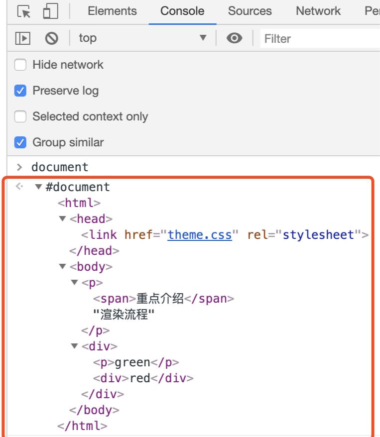
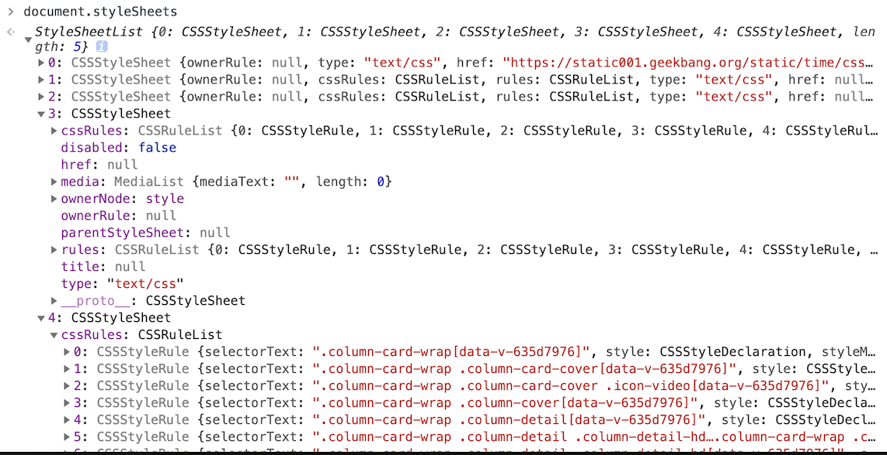
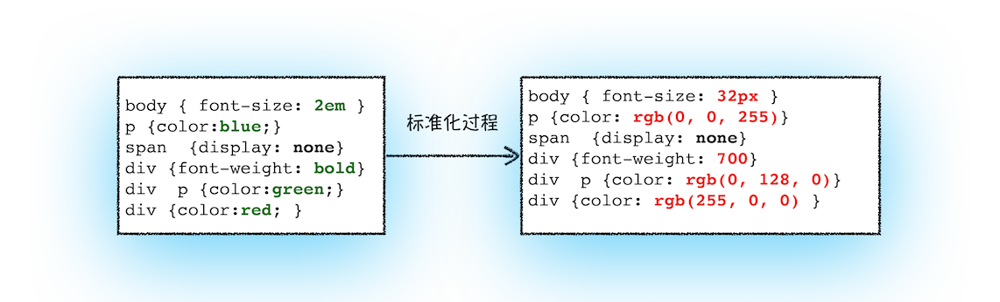
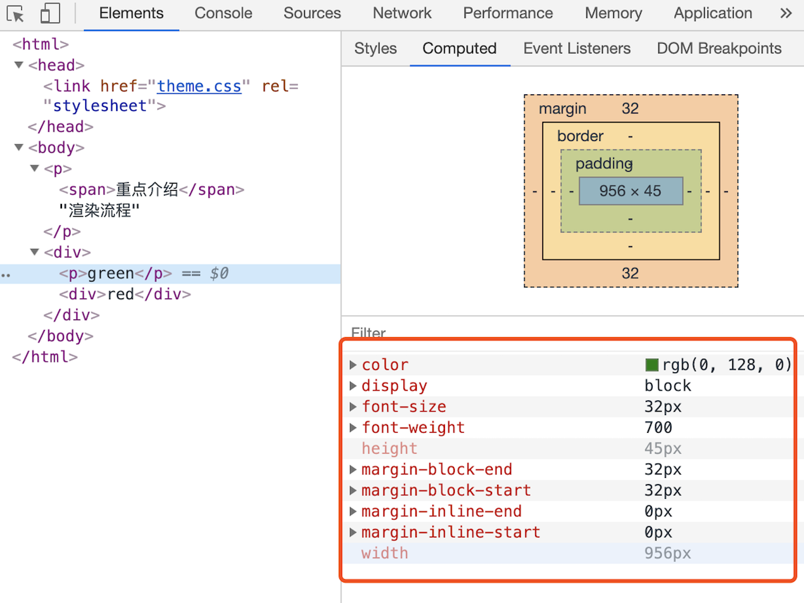

# 用 developer tools 观察渲染流程

- [构建 DOM 树](#%E6%9E%84%E5%BB%BA-dom-%E6%A0%91)
- [样式计算（Recalculate Style）](#%E6%A0%B7%E5%BC%8F%E8%AE%A1%E7%AE%97recalculate-style)
  * [第一步: 把 CSS 转换为浏览器能够理解的结构->CSSOM](#%E7%AC%AC%E4%B8%80%E6%AD%A5-%E6%8A%8A-css-%E8%BD%AC%E6%8D%A2%E4%B8%BA%E6%B5%8F%E8%A7%88%E5%99%A8%E8%83%BD%E5%A4%9F%E7%90%86%E8%A7%A3%E7%9A%84%E7%BB%93%E6%9E%84-cssom)
  * [第二步: 转换样式表中的属性值，使其标准化](#%E7%AC%AC%E4%BA%8C%E6%AD%A5-%E8%BD%AC%E6%8D%A2%E6%A0%B7%E5%BC%8F%E8%A1%A8%E4%B8%AD%E7%9A%84%E5%B1%9E%E6%80%A7%E5%80%BC%E4%BD%BF%E5%85%B6%E6%A0%87%E5%87%86%E5%8C%96)
  * [第三步: 计算出 DOM 树中每个节点的具体样式](#%E7%AC%AC%E4%B8%89%E6%AD%A5-%E8%AE%A1%E7%AE%97%E5%87%BA-dom-%E6%A0%91%E4%B8%AD%E6%AF%8F%E4%B8%AA%E8%8A%82%E7%82%B9%E7%9A%84%E5%85%B7%E4%BD%93%E6%A0%B7%E5%BC%8F)
- [布局阶段](#%E5%B8%83%E5%B1%80%E9%98%B6%E6%AE%B5)
  * [第一步: 创建布局树](#%E7%AC%AC%E4%B8%80%E6%AD%A5-%E5%88%9B%E5%BB%BA%E5%B8%83%E5%B1%80%E6%A0%91)
  * [第二步: 布局计算](#%E7%AC%AC%E4%BA%8C%E6%AD%A5-%E5%B8%83%E5%B1%80%E8%AE%A1%E7%AE%97)

---

按照渲染的时间顺序，流水线可分为如下几个子阶段：构建 DOM 树、样式计算、布局阶段、分层、绘制、分块、光栅化和合成。

## 构建 DOM 树

功能: 将 HTML 转换为浏览器能够理解的结构——DOM 树，即document对象。

DOM 和 HTML 内容几乎是一样的，但是和 HTML 不同的是，DOM 是保存在内存中树状结构，可以通过 JavaScript 来查询或修改其内容。

## 样式计算（Recalculate Style）

分三步

### 第一步: 把 CSS 转换为浏览器能够理解的结构->CSSOM

当渲染引擎接收到 CSS 文本时，会执行一个转换操作，将 CSS 文本转换为浏览器可以理解的结构——CSSOM

CSSOM定义了样式表的接口，称为CSSStyleSheet，可以在JavaScript代码中访问。借助于该接口，开发者可以利用JavaScript中获取样式表的各种信息。开发者可以通过[`document.stylesheets`](https://developer.mozilla.org/en-US/docs/Web/API/Document/styleSheets)(一个CSSStyleSheet列表，每个CSSStyleSheet对象都是一个文档中链接或嵌入的样式表。)查看当前网页中包含的所有CSS样式表，这是因为CSSOM对DOM中的Document接口进行了扩展。

只需要在控制台中输入 document.styleSheets，然后就看到如下图所示的结构。并且该结构同时具备了查询和修改功能，这会为后面的样式操作提供基础。(注意此时还没有加到dom上)

StyleSheet对象具有cssRules属性，是一个数组，同一个style中的每一条样式都是数组中的一项CSSStyleRule或CSSKeyframeRule等，并具有cssText等属性。其中CSSStyleRule对象具有style属性可用于修改。

### 第二步: 转换样式表中的属性值，使其标准化

需要将所有值转换为渲染引擎容易理解的、标准化的计算值。

### 第三步: 计算出 DOM 树中每个节点的具体样式

这涉及到 CSS 的继承规则和层叠规则。

总之，样式计算阶段的目的是为了计算出 DOM 节点中每个元素的具体样式，在计算过程中需要遵守 CSS 的继承和层叠两个规则。这个阶段最终输出的内容是每个 DOM 节点的样式，并被保存在 ComputedStyle 的结构内。

如果你想了解每个 DOM 元素最终的计算样式，有两种方法。一是在js中利用[`Window.getComputedStyle()`](https://developer.mozilla.org/en-US/docs/Web/API/Window/getComputedStyle)。二是可以打开 Chrome 的“开发者工具”，选择第一个“element”标签，然后再选择“Computed”子标签，如下图所示：

## 布局阶段

在显示之前，我们还要额外地构建一棵只包含可见元素布局树

现在，我们有 DOM 树和 DOM 树中元素的样式，但这还不足以显示页面，因为我们还不知道 DOM 元素的几何位置信息。

Chrome 在布局阶段需要完成两个任务：创建布局树和布局计算。

### 第一步: 创建布局树

遍历 DOM 树中的所有可见节点，并把这些节点加到布局树中。像 head 标签，display: none 的标签，都会被忽略掉。

### 第二步: 布局计算

现在我们有了一棵完整的布局树。那么接下来，就要计算布局树节点的坐标位置了。

在执行布局操作的时候，会把布局运算的结果重新写回布局树中，所以布局树既是输入内容也是输出内容，这是布局阶段一个不合理的地方，因为在布局阶段并没有清晰地将输入内容和输出内容区分开来。针对这个问题，Chrome 团队正在重构布局代码，下一代布局系统叫 LayoutNG，试图更清晰地分离输入和输出，从而让新设计的布局算法更加简单。

> 浏览器工作原理与实践 - 极客时间

> document.stylesheets https://www.jianshu.com/p/70da125bf3fc

> Webkit底层原理(5)--CSS解释器和样式布局 https://blog.csdn.net/caomage/article/details/102217809

> 更新: 2021-06-02 17:40:20  
> 原文: <https://www.yuque.com/viruspc/el3mi0/ussgcg>