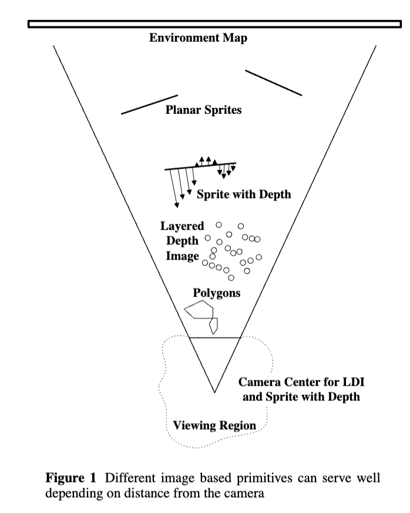

# 1998-Layered Depth Images

- [主题与核心思想](#%E4%B8%BB%E9%A2%98%E4%B8%8E%E6%A0%B8%E5%BF%83%E6%80%9D%E6%83%B3)
- [关键点与亮点](#%E5%85%B3%E9%94%AE%E7%82%B9%E4%B8%8E%E4%BA%AE%E7%82%B9)
- [总结](#%E6%80%BB%E7%BB%93)

---

#### 主题与核心思想
该论文提出了两种高效的基于图像的渲染方法，用于在PC上以每秒多帧的速度生成渲染图像：

1. **Sprites with Depth**：针对平滑表面，利用深度信息进行前向映射，实现平滑的视差效果。
2. **Layered Depth Image (LDI)**：针对复杂几何场景，使用分层深度图像表示场景，每个像素沿视线方向存储多个深度值，解决视差和遮挡问题。

这些方法通过减少几何复杂度对渲染时间的影响，显著提高了渲染效率。

---

#### 关键点与亮点
1. **Sprites with Depth** ([1][2][3][6][9])：
    - 在传统精灵（sprite）基础上添加深度信息。
    - 通过前向映射深度值，再利用视差校正生成新的视图。
    - 避免了传统前向映射方法中的图像空隙问题，渲染更平滑。
2. **Layered Depth Image (LDI)** ([2][3][12][13][15])：
    - 每个像素存储多个深度值，按从前到后的顺序排列。
    - 解决了视差引起的遮挡和未遮挡区域暴露问题。
    - 数据表示大小与场景深度复杂度线性增长，且无需z-buffer，支持高效的alpha合成。
3. **渲染算法**：
    - 基于McMillan的排序算法实现从后到前的像素绘制，避免深度排序。
    - 提出两步渲染算法：首先映射深度图，再反向映射颜色值，减少误差并提高效率 ([8][9])。
4. **LDI生成方法** ([12][13][14])：
    - 从多个深度图像生成：将多视角深度图像映射到统一的相机视图。
    - 基于光线追踪生成：通过采样立方体区域的光线，记录交点构建LDI。
    - 从真实图像生成：利用计算机视觉技术，通过视差推断像素深度。
5. **性能与优化** ([16][18][19])：
    - 使用空间高效的结构存储深度像素，优化缓存性能。
    - 通过剪裁未见像素和分段渲染，显著提升渲染速度。
    - 在300MHz的Pentium II PC上，LDI渲染可达到4-10帧/秒。
6. **应用与结果展示** ([19][20][21])：
    - 示例包括树模型、恐龙模型和农场场景，展示了LDI在复杂场景中的有效性。
    - 实现了实时的视点移动和视差效果，提升了渲染的沉浸感。

---

#### 总结
该论文通过提出Sprites with Depth和Layered Depth Image两种新型图像表示与渲染技术，显著提升了基于图像的渲染效率。这些方法结合了传统几何渲染和现代图像处理的优点，为复杂场景的快速渲染提供了新的解决方案。未来工作将探索多种渲染技术的结合，以适应更复杂和多样化的场景需求 ([22][23][24])。

> 更新: 2025-11-08 07:54:55  
> 原文: <https://www.yuque.com/viruspc/el3mi0/xkbnsu3zvot3f8h2>