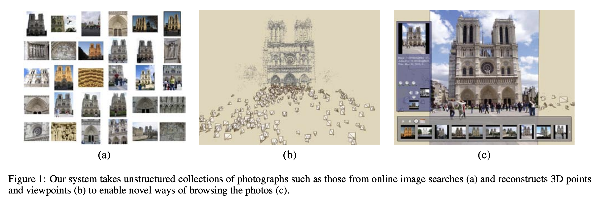

# 2007- Photo Tourism

- [核心内容](#%E6%A0%B8%E5%BF%83%E5%86%85%E5%AE%B9)
- [IBL](#ibl)
  * [总结](#%E6%80%BB%E7%BB%93)
- [References](#references)

---

### 核心内容

介绍了一种名为 Photo Tourism 的系统，该系统通过一种创新的3D界面，允许用户交互式地浏览和探索大量非结构化的场景照片集合。

核心思想是利用图像本身计算摄影师的视角和场景的稀疏3D几何模型，从而在3D空间中浏览照片并探索场景，同时支持注释传递、照片导览等功能。

一种 IBR 技术的应用

支持海量图片之间的探索。用3DV来建立图像之间的关联。支持

1. 选择相机视角
2. 选择图像区域来看细节（切换到更细节的图片）
3. 去相邻视角的图片
4. 选择相关的thumbnail

### IBL

本文并非旨在通过新视角合成生成逼真的全视角照片，而是通过3D空间上下文浏览照片，展现场景的几何感。

> In contrast to most prior work in IBR, our objective is not to synthesize a photo-realistic view of the world from all viewpoints per se, but to browse a specific collection of photographs in a 3D spatial context that gives a sense of the geometry of the underlying scene.
>

也用到了部分 view interpolation工作，但主要是用在照片之间的过渡上

+ **“近似的平面插值”**：  
这里提到作者的方法采用了一种基于平面的近似视图插值方法（approximate plane-based view interpolation method）。这意味着在照片之间的过渡中，系统并未追求完全精确的几何重建，而是通过平面拟合来简化插值计算，从而实现视图的平滑过渡。
+ **“非真实感渲染”**：  
背景场景的渲染采用了非真实感渲染（non-photorealistic rendering），即不追求完全逼真的视觉效果，而是通过一种抽象化的方式表现场景的几何感，使得系统能够更稳健地处理复杂或非结构化的图像。

1. **图像渲染领域的背景**  
图像渲染（Image-Based Rendering, IBR）领域专注于通过一组输入照片合成场景的新视图。  
    - **先驱项目**：Aspen MovieMap 项目（Lippman, 1980）是 IBR 的开创性工作。它通过激光光盘存储成千上万张 Aspen 城市的照片，用户可通过交互界面沿城市地图导航，并查看建筑物外观，还能附加元数据（如餐厅菜单或历史图像）。  
    - **局限性**：Aspen MovieMap 项目需要庞大团队花费数年完成，且照片采集和组织过程高度结构化。
2. **现代 IBR 技术的进展**  
    - 近年来 IBR 的研究重点是新视图合成技术（New View Synthesis），如 [Chen and Williams 1993; McMillan and Bishop 1995; Gortler et al. 1996] 等。  
    - **相关工作**：Aliaga 等人的“Sea of Images”项目（2003a）与本文系统较为相似，利用大量建筑空间内的照片进行特征匹配和视图生成，但其照片采集过程依赖固定网格和机器人操作。
3. **本文工作的特点与创新**  
    - **非结构化照片**：本文系统处理的是由不同摄影师随意拍摄的非结构化照片集合，而非依赖固定网格采集的结构化图像。  
    - **目标差异**：本文的目标并非从所有视角生成逼真的照片，而是通过3D空间上下文浏览特定照片集合，以展现场景的几何感。  
    - **技术方法**：采用平面插值方法和非真实感渲染技术，避免了对完整表面模型、光场或像素级精确插值的高复杂度需求。  
    - **优势**：这种方法使系统能够更稳健地处理超出传统 IBM 和 IBR 技术范围的输入图像。

#### 总结
本文的图像渲染方法在 IBR 领域中具有独特的创新性，重点在于处理非结构化照片集合，并通过3D空间上下文提供场景的几何感，而非生成完全真实的全视角视图。这种方法通过简化模型重建的复杂度，增强了系统对随意拍摄图像的适应性，同时保留了强大的浏览和交互功能。

### References
[https://dl.acm.org/doi/pdf/10.1145/1179352.1141964](https://dl.acm.org/doi/pdf/10.1145/1179352.1141964)

[https://www.youtube.com/watch?v=IgBQCoEfiMs](https://www.youtube.com/watch?v=IgBQCoEfiMs)

> 更新: 2025-11-08 07:54:38  
> 原文: <https://www.yuque.com/viruspc/el3mi0/gh6w47zfgx9m3suy>