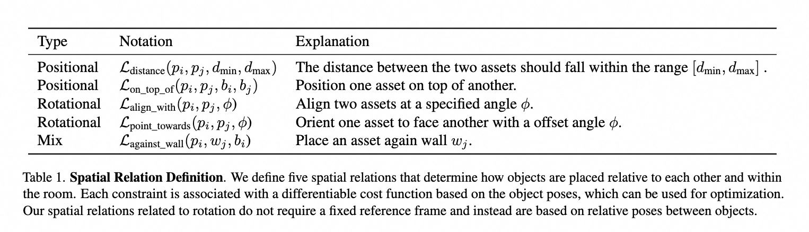
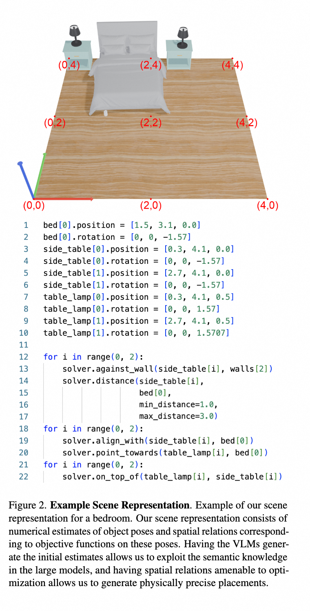

# 2025-LayoutVLM

- [主题与核心思想](#%E4%B8%BB%E9%A2%98%E4%B8%8E%E6%A0%B8%E5%BF%83%E6%80%9D%E6%83%B3)
- [核心内容与重点](#%E6%A0%B8%E5%BF%83%E5%86%85%E5%AE%B9%E4%B8%8E%E9%87%8D%E7%82%B9)
- [主要亮点与贡献](#%E4%B8%BB%E8%A6%81%E4%BA%AE%E7%82%B9%E4%B8%8E%E8%B4%A1%E7%8C%AE)
- [总结](#%E6%80%BB%E7%BB%93)
- [一些概念](#%E4%B8%80%E4%BA%9B%E6%A6%82%E5%BF%B5)
- [一些相关工作](#%E4%B8%80%E4%BA%9B%E7%9B%B8%E5%85%B3%E5%B7%A5%E4%BD%9C)
  * [Layout Generation & Indoor Scene Synthesis](#layout-generation--indoor-scene-synthesis)
  * [VLM for 3D Reasoning](#vlm-for-3d-reasoning)

---

#### 主题与核心思想
主要介绍了一种名为**LAYOUTVLM**的框架，用于通过视觉语言模型（Vision-Language Models, VLMs）实现3D场景布局的可微优化。该方法旨在生成既**符合物理约束又能满足语义要求**的3D布局，解决现有方法在复杂环境中语义一致性和物理合理性方面的不足。

Goal: understanding, arranging, and manipulating objects in 3D space within the constraints of the physical world

In this paper, we advance this goal by addressing open-universe layout generation, which involves creating diverse layouts based on unlabeled 3D assets and free-form language instructions

In this paper, we introduce LAYOUTVLM, an open-universe layout generation method that effectively achieves both **physical plausibility and semantic alignment.**

****

Our contributions are as follows: 

1. first, we introduce a novel scene layout representation that can be combined with differentiable optimization to generate diverse layouts. The scene representation builds on two complementary representations—numerical pose estimates and spatial relations with matching differentiable objectives. 
2. Second, we show that we can use VLMs and a self-consistency decoding process to generate our scene layout representation using visually marked scene and asset renderings. 
3. Third, through systematic evaluation across 11 room types, we achieved significant improvements when compared to the current best- performing method. 
4. Fourth, we show that fine-tuning open-source models on our scene representation with synthetic data yields substantial performance improvements, even for models that struggle with 3D layout generation.

#### 核心内容与重点
1. **背景与挑战**  
    - 空间推理是人类认知的重要组成部分，但现有的基础模型在基于自然语言指令生成3D布局时表现有限，尤其是在物体密集或物理约束复杂的场景中。[1][2]
    - 当前方法（如LayoutGPT和Holodeck）存在物体碰撞、布局不符合语义意图等问题。[2][3]
2. **问题定义**
    1. **任务定义**：在3D环境中，根据自然语言指令排列各种资产。目标是创建一个忠实于文本描述的3D场景
    2. **输入条件**：
        1. 布局标准由自然语言定义。
        2. 空间由四面墙限定，方向为基本方位（如东南西北）。
        3. 提供一组3D网格模型。
    3. **假设与工具**：
        1. 假设输入的3D对象是直立的。
        2. 使用现成的视觉语言模型（如GPT-4o）来确定对象的正面朝向。
        3. VLM为每个对象添加简短的文本描述，并确定其轴对齐边界框的尺寸。
    4. **输出目标**：生成布局的目标输出是每个对象的姿态，包括其3D位置和围绕z轴的旋转。
3. **LAYOUTVLM框架**  
    - **场景布局表示**：通过VLM生成两种互补的表示——数值物体姿态估计和空间关系。数值估计提供优化初始点，空间关系通过可微目标函数引导布局优化。
        * 初始布局至关重要，不良的初始化可能导致次优布局。例如，若初始布局将桌子放在房间中央分隔两边，而指令要求椅子在同一侧，则需调整。
        * 空间关系确保在调整布局以符合物理合理性时，仍能保持语义一致性。
            + 目标：
                - 捕捉输入语言指令的语义
                - 在优化过程中保持这些语义，以实现物理合理性。
            + 推荐以下五种空间关系
                - 两个位置的目标：距离、在上面
                - 两个方向的目标：对齐 align_width、指向point towards
                - 一个墙相关目标：靠墙，涉及资产的位置和方向。
                - 
            + 这些空间关系和传统的“在前”、“在左”不同，是可微的目标函数。
        * 
    - **用VLM生成场景布局：**Visual Prompting + Self-Consistent Decoding
        * 利用VLMs的泛化和常识推理能力，根据对象、3D场景和语言指令生成场景表示。
        * 提高准确性的方法：
            + 视觉提示：通过坐标和自一致解码来提高生成场景表示的准确性
                - 视觉提示细节：VLM的输入包括3D场景的渲染图像和单个资产视图。提供两种视觉标注：3D空间中每隔2米的坐标点帮助VLM判断尺寸和比例，以及坐标框架的可视化以保持一致的空间参考。每个对象的正面方向用箭头标注，以生成旋转约束（如对齐或指向
            + 自一致解码。VLMs在空间规划上存在困难，虽然可以为对象对生成空间关系，但整体布局的连贯性往往不足。
    - **优化过程**：结合物理目标（如避免碰撞）和语义目标（如保持布局语义一致性），通过投影梯度下降（PGD）实现布局优化。[5][6][8]
    - **视觉提示与自一致解码**：通过视觉标记（如坐标点和方向箭头）提升VLM的空间推理能力，并通过自一致解码筛选最关键的语义关系以优化布局。[7][8]
4. **实验与结果**  
    - **实验方法：**
        * **物理合理性**：通过无碰撞分数（CF）和边界内分数（IB）进行评估。
        * **语义一致性**：通过位置一致性（Pos.）和旋转一致性（Rot.）评估与输入指令的对齐。
            + 使用GPT-4o根据俯视图和侧视图渲染以及语言指令对布局进行评分。
        * **物理语义对齐分数（PSA）**：结合物理合理性和语义对齐进行评估，无法合理放置的资产得0分。PSA由GPT-4o评分加权物理合理性计算，分数范围为0到100，分数越高表示性能越好。****
    - **性能对比**：LAYOUTVLM在11种房间类型上显著优于现有方法（如LayoutGPT、Holodeck和I-Design），在物理合理性和语义一致性方面表现尤为突出。[9][10][12]
    - **用户评价与GPT-4o评分一致性**：用户研究显示，LAYOUTVLM生成的布局在位置、方向和整体表现上均获得较高评价，与GPT-4o评分高度一致。[12][13]
    - **消融实验**：验证了视觉输入、自一致解码和空间约束对布局生成质量的关键作用。[13][14][15]
5. **模型微调与泛化能力**  
    - 微调预训练的VLM（如GPT-4o和LLaVA-NeXT-Interleave）以生成更符合语义的布局，尤其是在处理未见过的3D资产时表现出色。[15][16]
6. **局限与未来方向**  
    - 局限性包括VLM初始布局预测的不稳定性以及对复杂场景的适应能力有待提升。[16][17]
    - 未来研究方向包括探索更复杂的场景布局和进一步优化语义与物理推理能力。[15][16]

#### 主要亮点与贡献
1. 提出了一种结合数值姿态估计和空间关系的场景布局表示，支持可微优化。
2. 利用视觉语言模型生成布局并通过自一致解码提升布局语义一致性。
3. 显著提升了3D布局生成的物理合理性和语义对齐能力。
4. 微调开源模型以增强其布局生成能力，展示了良好的泛化性能。

#### 总结
LAYOUTVLM通过创新的场景表示、自一致解码和优化流程，解决了现有方法在生成物理合理且语义一致的3D布局时的主要挑战，为开放语义的3D布局生成提供了新的解决方案。

#### 一些概念
+ Open Universe：“开放宇宙”（Open-Universe）在本文中指的是一种不受预定义对象类别或布局模式限制的场景生成方法。这意味着布局生成可以根据自由形式的语言指令和未标记的3D资产来创建多样化的场景，而不是依赖于预设的标签或类别。这种方法旨在实现更高的多样性和灵活性，以更好地模拟真实世界中的场景布局。[2][3]
+ Self Consistency: “自一致性”指的是在某个过程中，保持内部逻辑或结果的一致性。在本文中，自一致性用于确保视觉语言模型（VLMs）在生成3D布局时，空间关系不仅在个别对象对之间有效，而且在整体布局中也保持连贯。这意味着在优化过程中，只有那些与初始预测姿态一致的空间关系会被保留，从而确保布局的物理合理性和语义一致性。

#### 一些相关工作
##### Layout Generation & Indoor Scene Synthesis
场景合成有两个主要方向

1. **基于图像生成模型**：利用强大的生成性先验（如Neural Radiance Fields或高斯斑点）来生成场景。然而，这些方法生成的场景缺乏可分离和可操作的对象和表面，因此不适合需要精确物体交互的机器人应用。
2. **使用中间表示生成场景**：通过场景图或场景布局结合资产库来生成场景。这种方法允许更灵活的场景生成，不依赖于预定义的标签或类别，支持开放词汇的3D场景合成。比如，LayoutGPT直接生成室内场景的3D布局，Holodeck则使用场景图优化对象位置。

LAYOUTVLM的方法创新：

1. **使用VLMs而非LLMs**：LAYOUTVLM在生成场景布局表示时，采用了视觉语言模型（VLMs）来处理图像和文本输入，而不是使用大型语言模型（LLMs）。
2. **差分优化过程**：引入了差分优化过程，避免通过搜索解决约束满足问题。这种方法提高了布局生成的效率和准确性。

##### VLM for 3D Reasoning
视觉语言模型（VLMs）在3D空间推理中的应用：

1. **3D 空间推理能力**：近期研究探索了VLMs在空间推理方面的能力。一些研究通过在点云和网格等表示上训练3D视觉编码器来改进3D场景理解、问答、导航和规划等任务。
2. **2D VLMs的适应**：其他研究通过在涉及3D环境的视觉问答数据集上微调2D VLMs来增强其空间推理能力。
    1. **相关方向：基于2D图像的3D重建**：相关研究方向是通过训练大规模合成数据来基于2D图像重建3D场景。

LAYOUTVLM的创新：

3. 与上述方法主要关注感知任务不同，LAYOUTVLM使用2D VLMs进行3D布局生成，利用了视觉推理技术（如多视角图像和视觉标记）进行空间规划，并通过微调VLMs显著提升了开源模型的性能。

  

> 更新: 2025-04-17 16:21:43  
> 原文: <https://www.yuque.com/viruspc/el3mi0/ocvkkb0gfy3uu5ca>