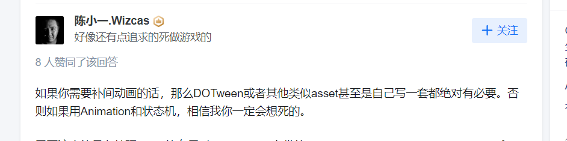
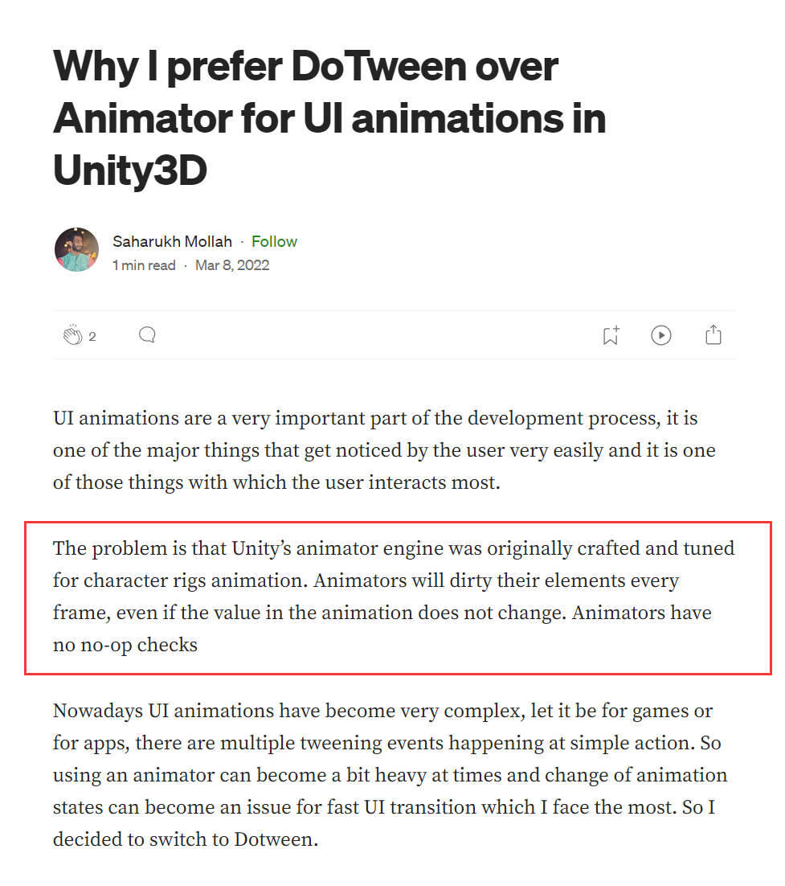
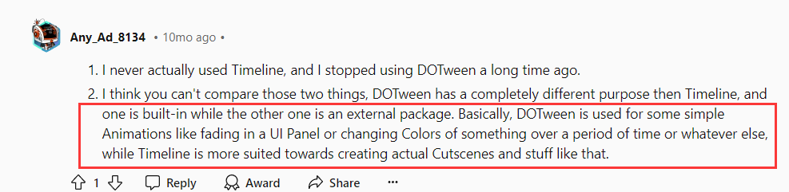
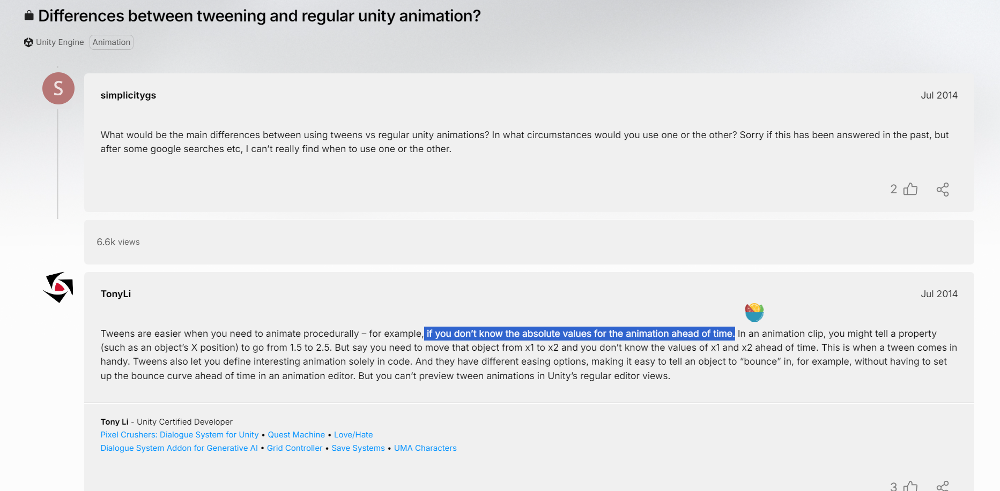
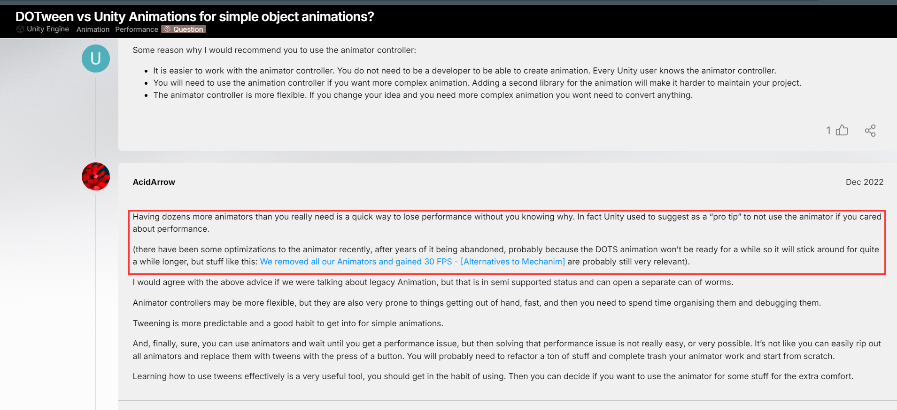
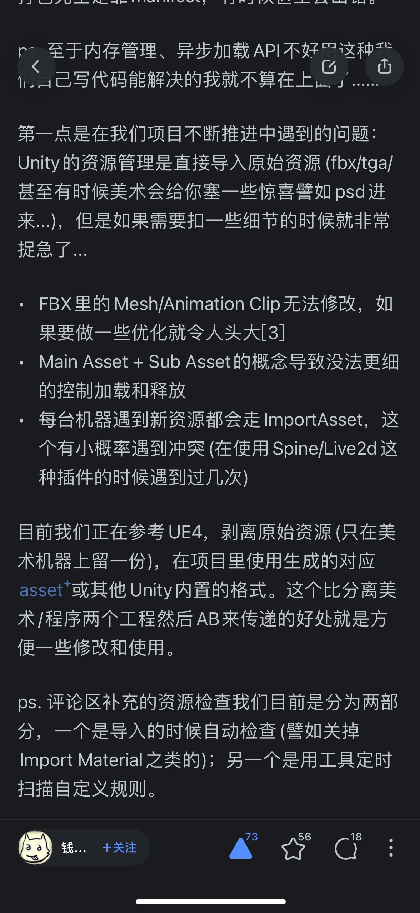
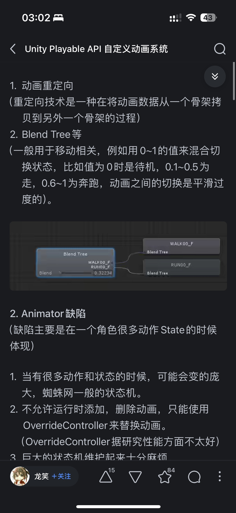

# DOTween VS Animation System in Unity

Unity已经有一套基于Timeline的动画系统，为什么我们还需要DOTween/ITween这类动画引擎的存在？

1. [https://www.zhihu.com/question/41484473](https://www.zhihu.com/question/41484473)

2. [https://saharukh.medium.com/why-i-prefer-dotween-over-animator-for-ui-animations-22decea606f8](https://saharukh.medium.com/why-i-prefer-dotween-over-animator-for-ui-animations-22decea606f8)

[https://www.reddit.com/r/Unity3D/comments/18mumwv/dotween_vs_timeline/](https://www.reddit.com/r/Unity3D/comments/18mumwv/dotween_vs_timeline/)

[https://discussions.unity.com/t/dotween-vs-unity-animations-for-simple-object-animations/903847](https://discussions.unity.com/t/dotween-vs-unity-animations-for-simple-object-animations/903847)

[https://discussions.unity.com/t/we-removed-all-our-animators-and-gained-30-fps-alternatives-to-mechanim/707814](https://discussions.unity.com/t/we-removed-all-our-animators-and-gained-30-fps-alternatives-to-mechanim/707814)

[https://www.zhihu.com/question/265610021/answer/296708358?utm_psn=1826819134895300608](https://www.zhihu.com/question/265610021/answer/296708358?utm_psn=1826819134895300608)

[https://zhuanlan.zhihu.com/p/386710404?utm_psn=1826819660512886784](https://zhuanlan.zhihu.com/p/386710404?utm_psn=1826819660512886784)

[https://mp.weixin.qq.com/s?__biz=MzkyMTM5Mjg3NQ==&mid=2247535622&idx=1&sn=b96a2d8ac55b49e74261d91bbffa944c&source=41#wechat_redirect](https://mp.weixin.qq.com/s?__biz=MzkyMTM5Mjg3NQ==&mid=2247535622&idx=1&sn=b96a2d8ac55b49e74261d91bbffa944c&source=41#wechat_redirect)

+ **Use DOTween** for simpler, code-driven animations, especially when performance is a priority or when you're doing UI work.
+ **Use Unity's Built-in Animation System** for more complex character animations, visual workflows, or when you need features like blend trees and state machines.

References

1. [https://dotween.demigiant.com/](https://dotween.demigiant.com/)
2. [https://www.zhihu.com/question/41484473](https://www.zhihu.com/question/41484473)
3. [https://saharukh.medium.com/why-i-prefer-dotween-over-animator-for-ui-animations-22decea606f8](https://saharukh.medium.com/why-i-prefer-dotween-over-animator-for-ui-animations-22decea606f8)

> 更新: 2024-10-08 02:54:35  
> 原文: <https://www.yuque.com/viruspc/el3mi0/gkx4ag71mgyr58am>