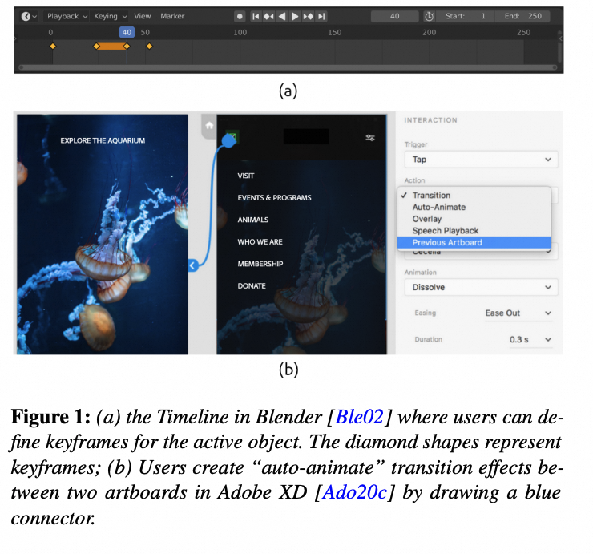
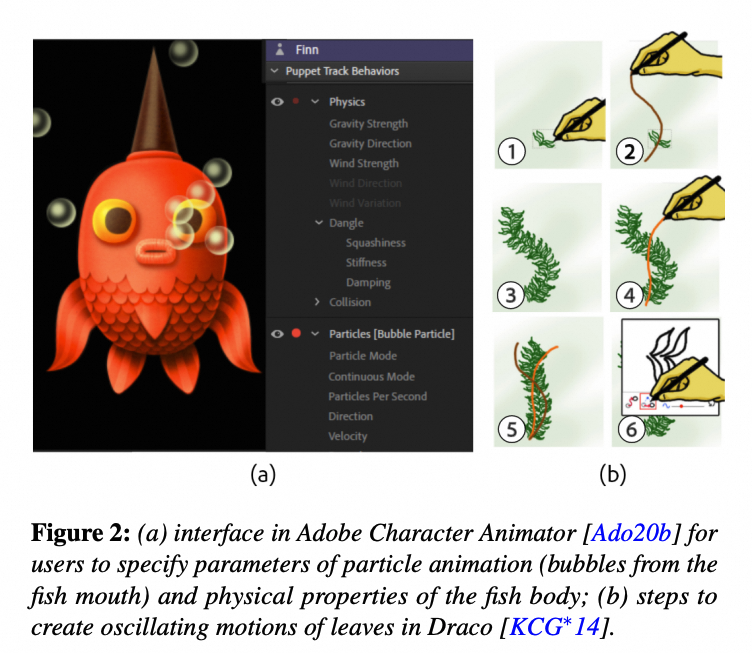
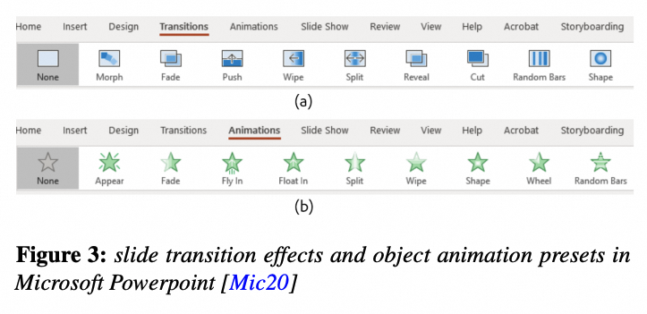
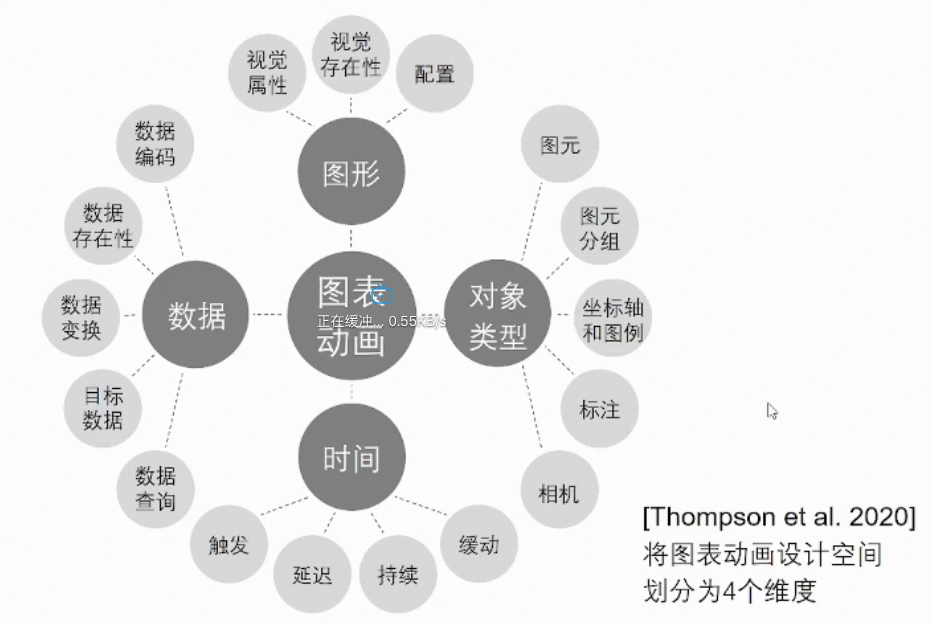

# Euro Vis 2020: Understanding the Design Space and Authoring Paradigms
for Animated Data Graphics

- [论文地址](#%E8%AE%BA%E6%96%87%E5%9C%B0%E5%9D%80)
- [摘要](#%E6%91%98%E8%A6%81)
- [相关工作](#%E7%9B%B8%E5%85%B3%E5%B7%A5%E4%BD%9C)
  * [Authoring Paradigms for Animated Graphics](#authoring-paradigms-for-animated-graphics)
    + [Keyframe Animation](#keyframe-animation)
    + [Procedural Animation](#procedural-animation)
    + [Presets and Templates](#presets-and-templates)
  * [Tools for Animated Data Graphics](#tools-for-animated-data-graphics)
  * [Taxonomies on Animated Data Graphics](#taxonomies-on-animated-data-graphics)
  * [Studies on Authoring Paradigms and Workflows](#studies-on-authoring-paradigms-and-workflows)
- [Survey of Animated Data Graphics](#survey-of-animated-data-graphics)
  * [Terninology](#terninology)
  * [Purpose of Survey](#purpose-of-survey)
  * [Animated Transition Instances](#animated-transition-instances)
  * [Dimension](#dimension)
- [Primitives](#primitives)
  * [Dimension](#dimension-1)
    + [Dimension 1: Object Type](#dimension-1-object-type)
    + [Dimension 2: Graphics](#dimension-2-graphics)
    + [Dimension3: Data](#dimension3-data)
    + [Dimension 4: Timing](#dimension-4-timing)
  * [Compositions](#compositions)
    + [Transition Types](#transition-types)
    + [Pacing Techniques](#pacing-techniques)
- [Semi-Structured Ideation Study & Discussion](#semi-structured-ideation-study--discussion)
- [Conclusion and Future Work](#conclusion-and-future-work)
- [重要相关文献](#%E9%87%8D%E8%A6%81%E7%9B%B8%E5%85%B3%E6%96%87%E7%8C%AE)
- [一些重点](#%E4%B8%80%E4%BA%9B%E9%87%8D%E7%82%B9)

---

# 论文地址
[https://www.zcliu.org/animate/Eurovis2020-authoring-paradigm.pdf](https://www.zcliu.org/animate/Eurovis2020-authoring-paradigm.pdf)

# 摘要
Our goal is to inform the design of next-generation animated data graphic authoring tools. To understand the composition of animated data graphics, we survey real-world examples and contribute a description of the design space.

The purpose of our survey is to 

(i) identify composable primitives of animated data graphics, and 

(ii) recognize common compositions of those primitives.

# 相关工作
## Authoring Paradigms for Animated Graphics
1. Prevelant authoring paradiams for animated graphcis
    1. keyframe animation: specify properties of graphical objects at certain points of time by setting a set of keyframes, frames in between two keyframes are generated by tweening. 
    2. procedural animation: generate animation of large number of animated objects with a set of behavior parameters. 
    3. presets and templates: apply predefined animation effects and configurations to objects.

注意，一个动画工具支持多种创作范式是很常见的。例如，After Effects 同时支持关键帧和预设/模板。复杂的动画也可以通过组合不同的范式来创作。例如，可能需要在关键帧动画之上添加程序生成的粒子运动。

### Keyframe Animation
+ 核心想法：
    - 关键帧+interpolating/tweening。
+ 优点：
    - 简单直观？
+ 应用场景：
    - AE
    - Blender
    - Figma
    - Unity
    - 。。。
+ GUI：
    - 对应的GUI往往采用timeline + property inspector 的形式（Figure 1 a）。如AE、Blender。
    - 有的用户界面更简单，如采用connector将两个artboard连起来，例如Figma和Adobe XD

### Procedural Animation
+ 解决keyframe存在的问题：
    - keyframe 给设计师以精准和直接的方式，来控制图形对象的属性和行为，但当有**大量物体**时，指定他们的协调运动可能会有变得很繁琐。（PS：放我家/展厅中的“家具摆放”动画，也不能直接指定移动位置，需要根据屏幕移动方向距离，来程序化生成3D属性移动方向和距离）
+ 核心想法：
    - 程序化生成动画行为：从一个初始状态开始，一个引擎（通常被称为“emitter”或“oscillator”）通过调整一系列参数来生成动作motion（如风力、物体刚度），算法的输出可能是不可预测的。
+ 应用场景：
    - 粒子系统。如火焰，雨水。
    - flocking/动物群体。如鸟群，鱼群。
    - 随机运动。如树叶随风而落。
+ GUI：
    - 可以是很多形式
        * programming languages （如 d3 中的 tweening）
        * WIMP（Windows，Icons，Menus，Pointer）组建（Figure 2a）
        * sketching（Figure 2b）
        * node-based visual programming （TouchDesigner）

### Presets and Templates
+ 前两种方式存在的问题：
    - 对于新手和普通人而言，前两种的学习成本太高。
+ 核心思想：
    - 通过可重复使用的动画预设（presets）和模版（templates），来降低学习门槛，减少制作动画所需的时间和精力。这些预定义的动画类型在许多用例中已经够用了。用户只用简单地在一系列可用的presets里选择，并将其应用到对应的图形对象上即可。
+ 应用场景
    - PPT
    - AE
+ GUI
    - 展示工具同时提供 frame level（如 slide transition effect/全景图点位移动？）、object level （如fly-in 或 bounce） 不同粒度的动画效果（Figure 3）。
    - 动画效果的参数也会同时暴露出来供用户操作。
    - 类似地，动态图形工具也提供了这样的功能（例如 After Effects 中的文本动画预设和动态图形模板

##  Tools for Animated Data Graphics
+ 用于创建动画数据图形的工具很少。可视化设计人员通常依赖编程工具包或自定义脚本来创建复杂的数据驱动动画。诸如此类的编程工具包非常具有表现力，但编码的学习曲线陡峭，需要大量时间和认知努力。 [https://gganimate.com/](https://gganimate.com/)
    - 例如，D3 支持基于“enter、update、exist”模式的数据驱动的transition定义。同时，D3 还支持许多插值函数，这些函数可以根据声明的 duration、delay和easing 函数对可视化属性进行动画处理。
    - 在 ggplot2 的基础上，gganimate 提供了描述动画的编程方式 。
+ 非编程工具倾向于依赖模版来创造可动的数据图像。然而，这些工具仅仅支持有限的可视化模版/DataClips和Flourish不支持pacing或animatin effects的设计。
    - DataClips允许作者通过组合一系列预定义的动画和可视化组合，来创造 animated data videos
    - After Effects 拥有数据驱动的 motion graphics tmeplates
    - Flourish 最近向 Talkies 引入了 animated transitions，允许 audio-driven visualizations，在narrative points之间做插值。

 这项研究的动机是了解我们如何才能超越模板范式，支持创建更细致入微、更具表现力的动画数据图形。

##  Taxonomies on Animated Data Graphics
为了解动画数据图形中不同类型的变化，有许多分类标准。

+ Heer 和 Robertson 对统计数据图形中的动画转换进行了分类[HR07]。他们的分类法通过考虑可应用于可视化的语法或语义操作符，定义了 7 种类型的动画转换。
+ Fisher [Fis10]对这一分类法进行了调整，提出了可视化中的六种动画类型列表。
+ DataClips [AHRL∗15]确定了以可视化类型×动画类型组合表达的数据视频的高级构件。
+  Chalbi [Cha18]区分了数据驱动的变化和视觉驱动的变化，并列举了低级组件层面的动画变化。
+ Chevalier 等人[CRP∗16]超越了数据图形的范畴，研究了动画在用户界面中扮演的不同角色，从而发现了动画的新用途和研究机会。

我们分析数据图形动画示例的主要目的不是建立一个全面的分类法。相反，我们旨在从对象、图形、数据和时序四个维度确定制作动画数据图形时应使用的基本元素。这些基元的范例组合，如transition类型和pacing技术，都是可以纳入创作工具的有用的更高层次结构。

这个分类比之前分类的优点在于，不局限于模版，提供了composable的primitive，设计空间更广。

Related taxonomies [HR07,ARL∗17] provide transition types that are well-suited for animation templates. While templates are easy to use and understand, they are difficult to customize. We seek to identify composable primitives for future authoring tools that are generalizable across datasets and visualization forms

## Studies on Authoring Paradigms and Workflows
+ Amini 等人观察了设计师如何根据数据事实创建data stroyboards [AHRL∗15]。他们专注于stroyboards创建所涉及的活动和过程。
+ Kramer 等人研究了动画编程范式如何影响开发人员的生产力 [KHBB16]。他们比较了两种范式：声明式（对应于关键帧）和程序式（通常在 Javascript 中实现为 requestAnimationFrame），发现开发人员可以使用声明性语言更快地实现动画，但声明性语言可能会导致意外的动画行为。

在我们的研究中，我们不希望参与者局限于特定的输入方式或用户界面。相反，我们专注于在概念层面创作范式。因此，我们的构思研究更加开放，我们的方法更类似于 Data Illustrator 项目 [LTW∗18] 中使用的方法，其中要求设计师使用他们选择的工具演示工作流程。由于数据草图提供了一种不受限制的方式来征求用户的想法[RHR16,WHC15]，我们还鼓励用户尽可能在纸上绘制他们的想法。

# Survey of Animated Data Graphics
## Terninology
Animated data graphics are composed of animated transitions on data graphic elements. An animated transition is the interpolated change between two visual states. We further breakdown these terms as follows: 

+ A visual state can be thought of as a data graphic at rest. Visual states include all information about the data graphic’s static design. 
+ A transition is the uninterrupted change from one visual state of a data graphic to another. 
+ Animation is the sequence of intermediary states between a transition that is typically perceived as continuous movement.

## Purpose of Survey
To understand the design space of animated data graphics we surveyed examples from online sources. The purpose of our survey is to

+ identify composable primitives of animated data graphics, and 
+ recognize common compositions of those primitives.

## Animated Transition Instances
To analyze these examples, we first identified their unique animated transition instances. We identified instances based on the following criteria: 

+ an object undergoes an animated transition
+ the animated transition is data-related
+ repetitive animated transitions count as a single instance (e.g., circles in a scatterplot change

y-position).

## Dimension
object、graphic、data and timing 四个维度

+ object：指明哪一类图形对象需要做动画
+ graphic和data：描述object如何从一个visual state过渡到下一个。
+ timming：timing 包括相对时序概念，用于组成动画设计和动画过渡的节奏序列。

# Primitives
## Dimension

### Dimension 1: Object Type
Object 维度描述了需要做transitoin的图形对象类型。本文提出了以下 5 种对象类型，根据它们在数据图形中的**角色**及其独特属性来划分。

+ Glyphs：图像标记，如线、三角、文本、图片、组（group）等，表示一个或多个data tuple。一个glyph的视觉表现可能encode自数据值。
+ Groups：glyphs的集合。
+ Axes & Legends：scale 的视觉表达，描述如何将数据值映射到视觉属性，数据空间到视觉空间的映射关系。
+ Annotations：辅助元素，帮助用户理解数据图像中关键洞察和contextual信息。包括标签、tooltip和脚注等。annotation通常不和数据绑定，有时也可能和数据属性值有关。3D 放我家中的 outline、标签、锚点等。（需要定义和被标注元素的视觉关系、布局信息？）
+ Cameras：提供可配置的数据图形的观察位置。camera（或者说viewport）将场景图投影到视图中。参数可能有焦点、fov、缩放级别、旋转等。这些参数的修改会产生 pan、zoom、rotation等行为。

### Dimension 2: Graphics
Graphic 维度描述了一个object如何从一个视觉状态变到下一个。它与组成数据图形场景的视觉元素、视觉属性和配置有关。最初作者希望描述low level的视觉属性，比如可见性、透明度、位置、颜色、文本内容等，但实际上很难枚举完全。所以这里提供了一个这些transition相关的视觉属性的分类，文章定义了3种primitive来描述一个object的视觉如何发生变化。

+ Visual Presence：object的存在性。类似d3，当一个object可见或添加到scene graph中时，我们说它enter到scene graph；当一个object被移除时，我们称它为exit。
+ Visual Attributes：object的视觉通道，如位置、颜色、透明度、stroke等。
+ Configurations：object的一些不可见的参数（非视觉属性）。例如，一个group的layout配置。

### Dimension3: Data
Data 维度描述数据图形背后的数据是如何变化的。数据映射的改变同样会影响视觉属性，例如将某个视觉属性绑定的的数据属性改为另一个数据属性。Graphic维度中每个glyph无视data属性，表达同样的视觉属性；而data维度中data的改变会影响视觉属性。

+ Data Presence: data tuple的存在性。例如，一个glyph实例可能被绑定一个或多个data tuple。
+ Data Encoding：是每个glyph中将数据属性映射为视觉属性的函数。data encoding 可以在group内的glyph之间共享。
+ Data Transforms：是操作数据集，将数据集变为另一种形式并attach到图形对象的操作符。Data Transform包括 data nesting、aggregation 和 linking。这些操作允许在数据集之前就定义数据图形设计，实现数据图形设计与数据集之间的解耦合。
+ Data Targets：是其他object的数据焦点。例如，label和tooltip等注释以特定数据元组的glyph为目标。
+ Data Queries：是应用于数据集的谓词，可生成“inclusion”和“exclusion”的selection。这一设计指定了两个selection相关的glyph如何在视觉上改变。例如，“filter ”会从scene graph中暂时删除 “exlusion ” selection，而 “highlight ”则会在视觉上强调 “inclusion ”的glyph和/或淡化 “exlusion ”的glyph。

### Dimension 4: Timing
动画的timing描述了视觉属性从transition开始到结束的移动速度。

+ Triggers：开始一个动画的动画。提供了一个初始的reference point。（对应canist aniunit的reference属性，[MHRL∗17] MCKENNA S., HENRY RICHE N., LEE B., BOY J., MEYER M.: Visual Narrative Flow: Exploring Factors Shaping Data Visualization Story Reading Experiences. Computer Graphics Forum 36, 3 (2017), 377–387. doi:10.1111/cgf.13195. 5 中也有用到）。
+ Delay：trigger point 之后需要延迟的时间长度。
+ Duration：transition的持续时间。
+ Easing：指定了动画中不同时间点的transition速度。easing函数根据duration的百分比来计算动画属性的值。

## Compositions
上一章中的4个维度，用于组成 animated transition 的 组合。这一章描述了一些常见的组合。这里总结了10种transition类型。文中同时强调了基于timing primitive的pacing技术。注意，这里不是一个描述所有组合的分类，并且这些composition可以组成更复杂的tansition和animation。

### Transition Types
文中transition可以通过 object、graphic和data维度的变化来描述。

+ **Enter/Exit:** (visual presence + data presence) A data-bound object is entirely added or removed from the scene graph. 
+ **Combine/Partition:** (data transform + visual presence + configuration) Objects are combined or partitioned based on a nesting data transform and re-arranged by a change in layout configuration. e.g. stacked bar chart.
+ **Visual Alteration**: (visual attributes) Here an object’s visual attributes change, which is specified by the designer and independent from data.
+ Data Encoding Alteration: (data encodings) Data encodings are altered, added, or removed from the data graphic.
+ **Ordering/Re-configuring:** (configurations) This transition typically applies to a group, where its layout configuration (graphical dimension) changes, resulting changes in the spatial positions (graphical dimension) of its constituent members.
+ **Highlighting/Filtering**: (data queries + visual presence | visual attributes) Objects are visually highlighted or filtered based on the inclusion or exclusion selections defined by a data query.
+ **Data Ticker**: (data presence) The visual states cycle through the values of a temporal or nominal data attribute.
+ **Appear/Disappear**: (visual presence) Objects visibility changes in the scene. The main difference between this type and enter/exit is that enter/exit involves data presence as a primitive, but appear/disappear does not.
+ **Camera Alteration:** (camera + configurations) The camera’s configuration such as position or projection properties are altered, resulting in a view change (e.g., panning, zooming, rotating).
+ **Simulated Process**: (data transforms) Glyphs animate based on a simulated process, defined by an underlying algorithm or streaming data source. （Procedual animation）

### Pacing Techniques
基于timing primitive的pacing技术。旨在帮助观众感知和理解数据图形在动画transition过程中的变化。

+ **Staging **segments an object’s visually complex transition into subtransitions, allowing for multiple changes to be easily observed.
+ **Layerin**g is similar to staging, as sub-transitions precede after one another.
+ **Staggering **is the incremental or distributed delay of animations’ start times across a collection of objects’ sub-transitions.
+ Looping is a cyclic succession of transitions that loops back to the start.

# Semi-Structured Ideation Study & Discussion
结论：keyframe animation 总体表现最好，但

1. 在 appear/disappear/simulated process/camera alteration三种动画场景下有问题（这也是galacean和unity中animation存在的问题）。背后牵扯到对procedual的理解问题：物理模拟属于物理系统还是动画系统？感觉最好是在动画系统中使用物理系统。
2. 在大量物体场景下2，相关GUI工具可能会出现问题
3. 

# Conclusion and Future Work

# 重要相关文献
1. [https://gganimate.com/](https://gganimate.com/)
2. 统计数据可视化中的动画transition：HEER J., ROBERTSON G.: Animated Transitions in Statistical Data Graphics. IEEE Transactions on Visualization and Computer Graphics 13, 6 (2007), 1240–1247. doi:10.1109/TVCG.2007.70539. 3, 4, 6

# 一些重点
1. 一个 Animation transition 可以通过 object、graphic、data和 timing 四个维度来描述。object、graphic和data可以组合成10种 transition 类型，此外 timing primitive 可以组成更广的 pacing 技术。
2. 关键帧动画、程序动画和预制/模版动画三种制作动画的创作模式（authoring paradiam）中，设计师往往更偏好基于关键帧的动画。然而，证据表明一个创作工具需要同时结合这三种范式，因为设计师的偏好也取决于动画过渡设计的特点和创作任务，同时一些任务在另两种创作模式下才更方便完成。
3. 从是否需要编写代码的角度，动画创作工具可以分为 programming libraries 相关的，结合 graphical interface 和 scripting 的，以及no-programming的。AE和Unity属于第二种，存在的问题是表达能力有限。
4. SSG 应该支持keyframe和procedual animation的单独使用/混合使用，同时支持沉淀下presets和templates来复用。更好的提供模版？？？Interactor？？？SSG：1. 合理划分模块 2. 合理定义模块的设计空间 3. 提供模块下的presets/templates
5. 全景图过渡动画？
6. 如何变做引擎，边迁移业务？
7. glyph+annotation 也可以用 glyph +constraint来表达？后者还更灵活？
8. 放我家中可以用的animatin：bouncing，全景漫游，轨道（其他参考ppt）
9. galacean中prodecual animation的粒子系统和animtor是分开的系统。
10. galacean中interaction系统和camera漫游toolkit是分开的系统。
    1. 粒子系统、camera漫游这些都是cmponent，无明显区分，无法定义schema。
11. 引擎开发是跟着业务走，还是领先于业务？目前看来还是要领先于业务，否则后续移植很麻烦。

> 更新: 2024-10-08 03:19:39  
> 原文: <https://www.yuque.com/viruspc/el3mi0/kf006gpz45g6v6g4>