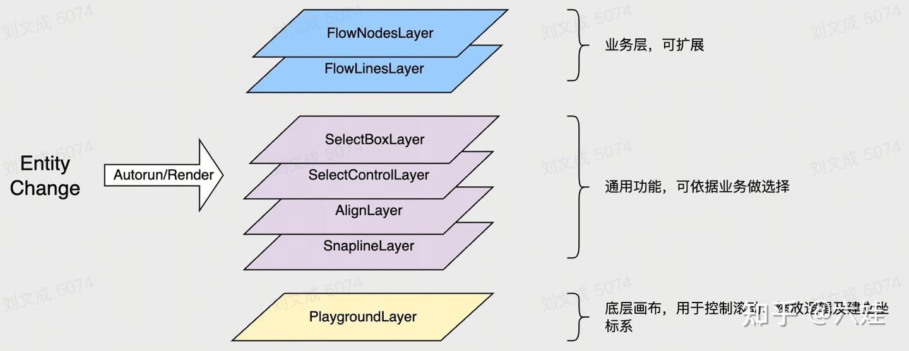
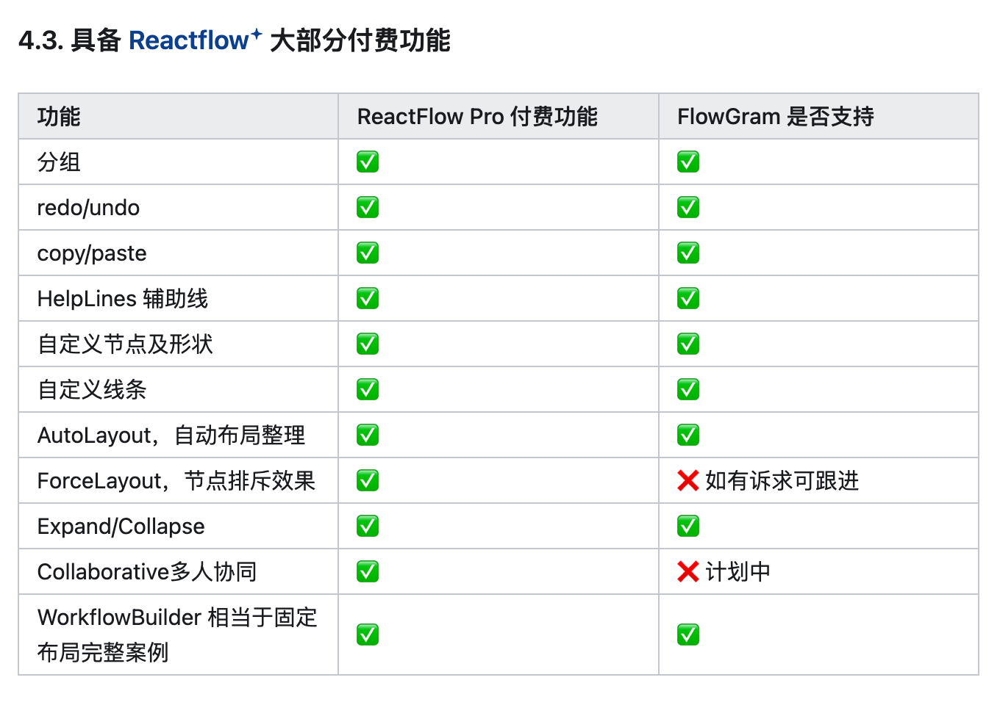

# Flowgram

[https://www.zhihu.com/search?type=content&q=flowgram](https://www.zhihu.com/search?type=content&q=flowgram)

比antv/x6更加 domain-specific，看起来动画也的更好些？

亮点：

1. 分层架构
2. 插件体系

主要问题

1. 布局能力有限，只支持固定布局和自由布局，不支持力导向等

没提到的点

1. 性能优化没太做，看到主要是底层用了fabric.js
2. 表达能力不知道会不会有局限性。看着还好。

> 更新: 2025-08-17 07:31:46  
> 原文: <https://www.yuque.com/viruspc/el3mi0/vi8q6twchnelmr1f>