# 地形、大气和云

- [Summary](#summary)
- [Introduction](#introduction)
- [Landscape](#landscape)
  * [Terrain Geometry](#terrain-geometry)
    + [Heightfield](#heightfield)
    + [Triangulated Irregular Network](#triangulated-irregular-network)
    + [Hardware Tessellation](#hardware-tessellation-)
    + [Non-Heightfield Terrain](#non-heightfield-terrain)
  * [Terrain Texture](#terrain-texture)
    + [Texture Splatting](#texture-splatting)
    + [Virtual Texture](#virtual-texture)
    + [Camera-Relative Rendering](#camera-relative-rendering)
    + [Decorator](#decorator)
- [Sky and Atmosphere](#sky-and-atmosphere)
  * [Atmosphere](#atmosphere)
    + [Analytic Atmosphere Appearance Modeling](#analytic-atmosphere-appearance-modeling)
    + [Volume Rendering Equation](#volume-rendering-equation)
    + [Real Physics in Atmosphere](#real-physics-in-atmosphere)
    + [Scattering](#scattering)
    + [Absorption](#absorption)
    + [Multi Scattering](#multi-scattering)
    + [Ray Marching](#ray-marching)
      - [Precomputed Atmospheric Scattering](#precomputed-atmospheric-scattering)
  * [Cloud](#cloud)
- [Reference](#reference)

---

## Summary
+ Landscape
    - Terrain Geometry
        * 一般用**高度场(heightfield)**来表达。高度场的缺陷在于当我们需要表示大规模的地形或者需要更精细的地形时所需的采样点数会成倍的增长。
        * 可以做简化
        * 遇到洞穴等地形，不能用高度场，可以用
    - Terrain Texture

## Introduction
现实世界中有着丰富的自然场景，如果只使用简单的绘制程序则很难给予玩家真实的游戏体验。因此在本节课中我们会介绍3A游戏中使用的自然场景渲染技术。

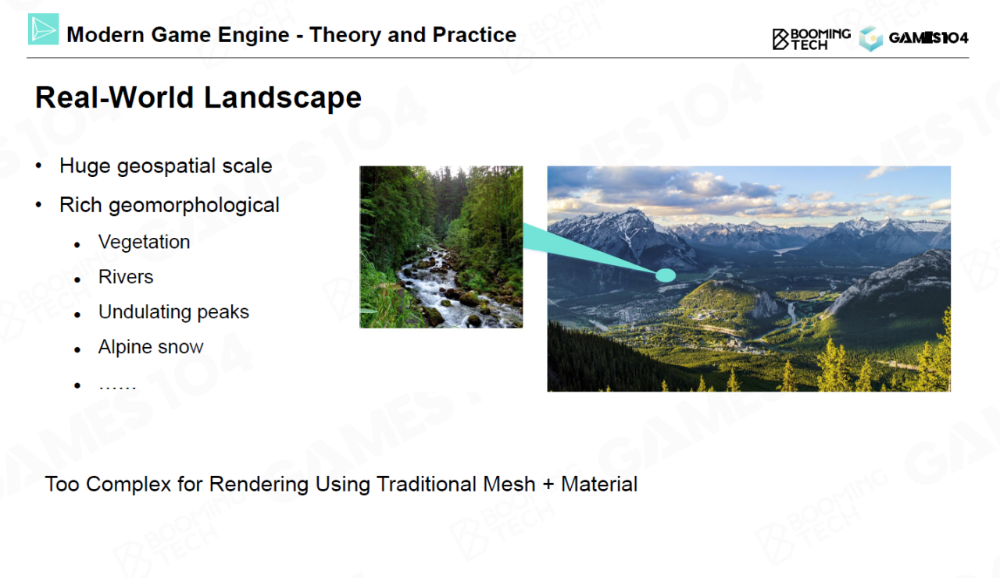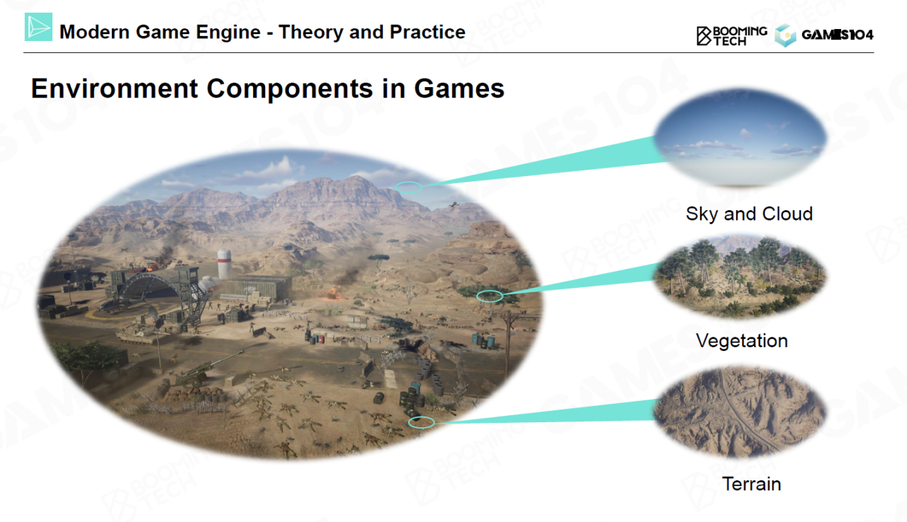

## Landscape
目前的3A游戏中以及可以生成逼真的地形环境渲染效果。以微软的模拟飞行为例，最新一代的模拟飞行已经基本实现了真实地球的地貌绘制，此外基于地形绘制技术我们也可以生成其它星球的地形和地貌。

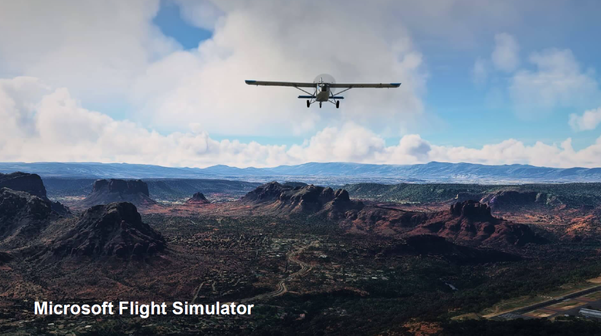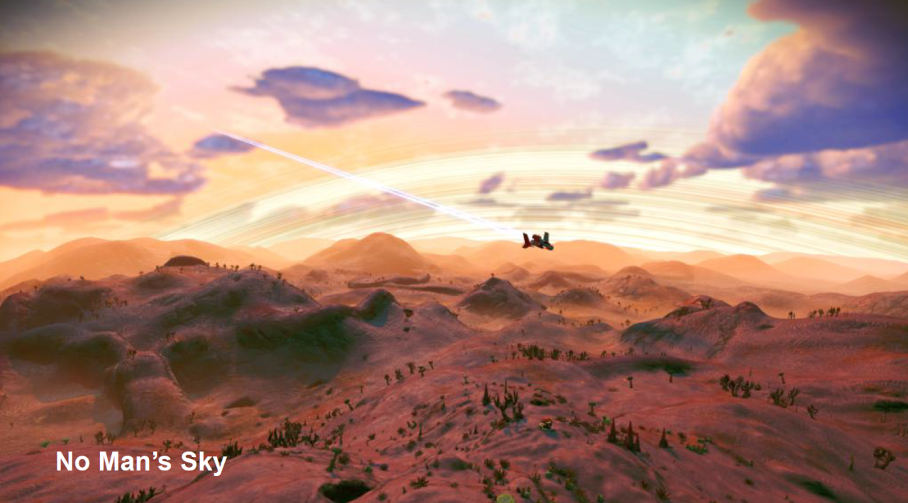

### Terrain Geometry
#### Heightfield
表示地形最简单的方法是使用**高度场(heightfield)**。高程图。ß我们可以把地形看做是平面上具有不同高度的函数，然后通过在平面进行均匀采样来近似它。这种方法在遥感等领域仍然有着很多的应用。

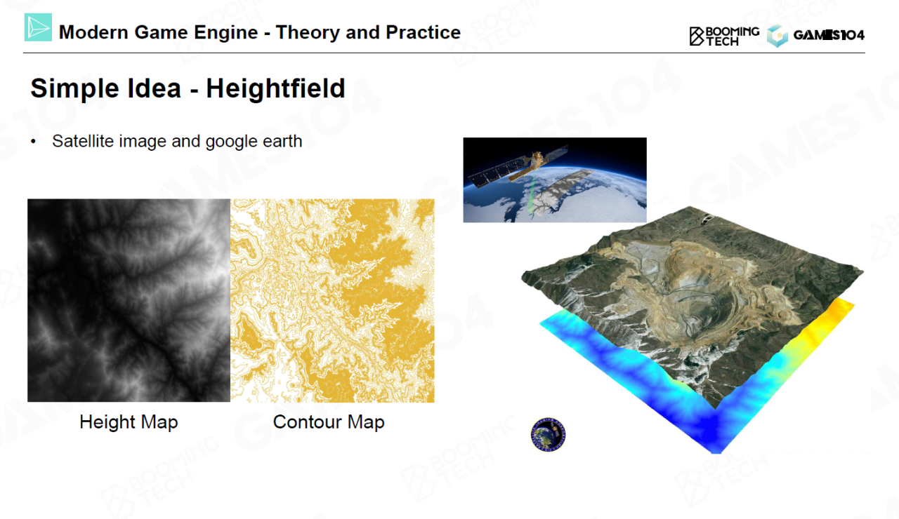

**存在的问题**：高度场的缺陷在于当我们需要表示大规模的地形或者需要更精细的地形时所需的采样点数会成倍的增长。

尽管如此，现在仍然是地形绘制的主力。

每隔一段距离（如1m）做一个格子，补充材质。

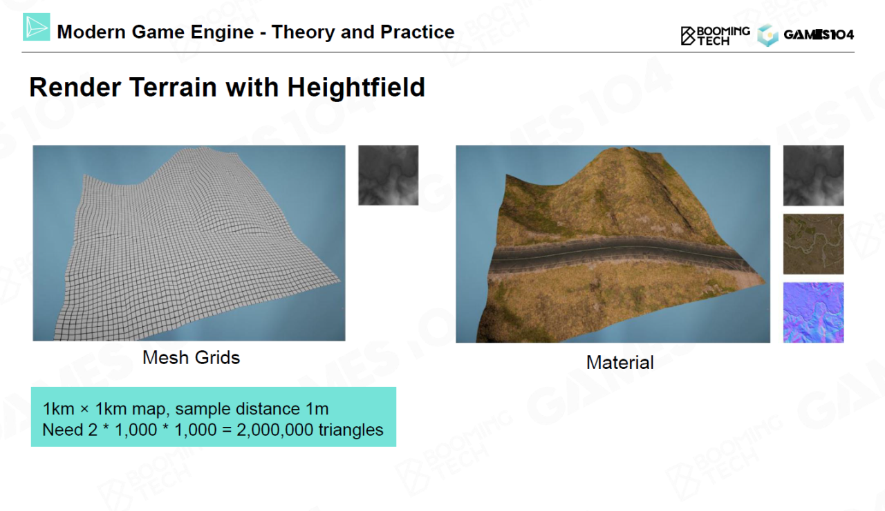

**如何做优化**：在游戏引擎中由于玩家观察的**视野(field of view, FOV)**是有限的，实际上我们不需要对所有的网格进行加密采样，只需关注视野中的地形即可。在这种思想下人们提出了两条加密采样原则：

+ 首先是根据距离和视野来调整网格的疏密，对于不再视野范围内或是距离观察点比较遥远位置的地形无需使用加密的网格。距离越近，FOV越小，网格越细密。
+ 另一条是在对地形进行采样时要考虑对网格进行加密或者化简后地形高度的误差不要超过一定的范围，我们希望近处地形的误差尽可能小而远处的误差可以大一些。

不同于之前游戏中讲的LOD。地形的LOD需要保持地形的连续。

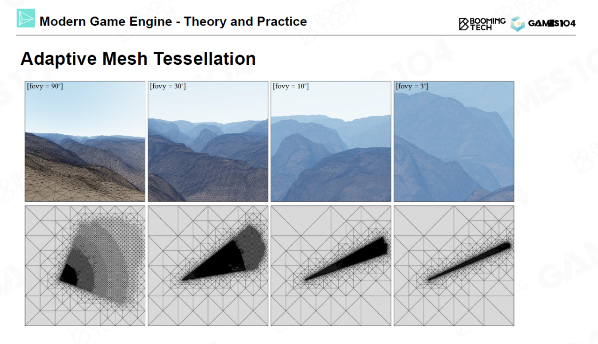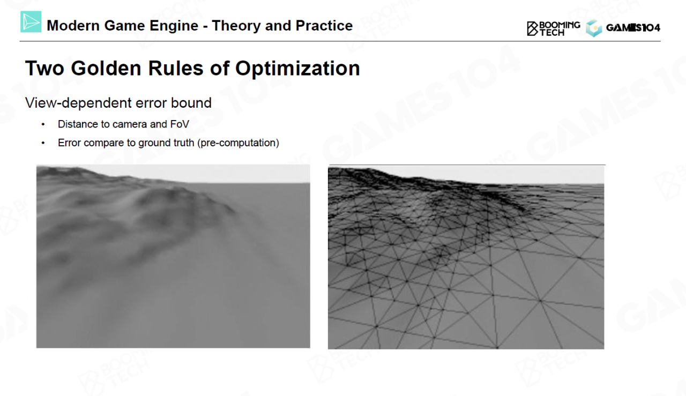

**如何把三角形变的疏密相间**：对三角网格进行加密可以通过**三角网剖分**算法来实现。又叫 binary triangles based subdivision。

核心思想：永远选择最长的边来做切分。

具体方法：对于均匀分布的网格，其中每个三角形都是等腰直角三角形。因此在进行剖分时可以直接选择三角形的斜边中点将它剖分成两个一样的小等腰直角三角形。显然这样的剖分方法等价于为二叉树添加叶节点。

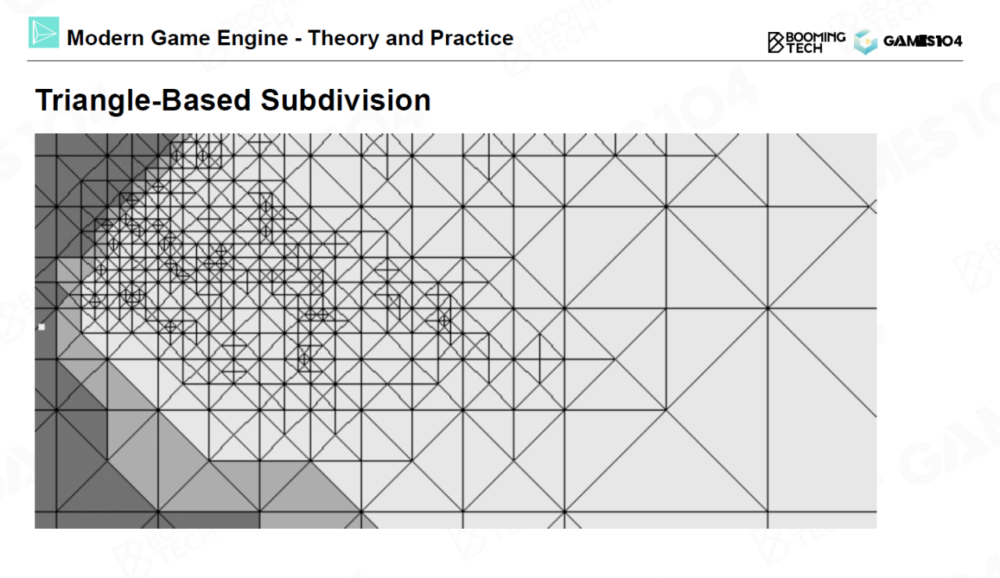 

**存在的问题**：在进行剖分时还需要注意**T-junction**的问题。右上角图中，切分完会进行上下位移后，可以看到地形上出现裂缝。

解决：当我们对某个三角形进行剖分后，必须同时将与它具有相同邻边（切分边）的三角形同时进行剖分，直至二者切分数一致为止。**避免有三角形的顶点落在其它三角形的边上****。**

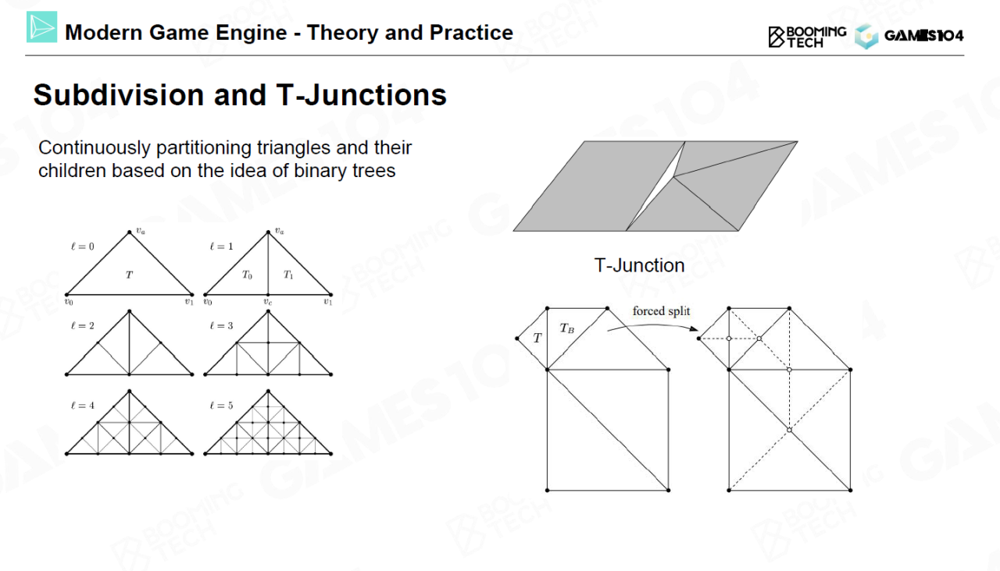

利用现代GPU的计算性能和上面介绍的三角剖分算法就可以实现大规模场景地形的实时渲染。

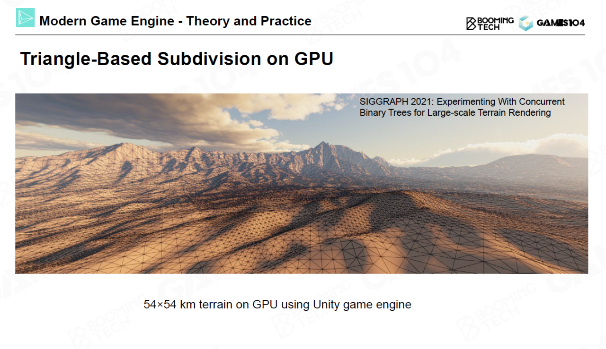

 **quad tree**：binary triangles based subdivision 其实在现代游戏行业用的不是非常多

在游戏行业中更常用的高度场表达方式是使用**四叉树**来表达地形。四方块比各种各样的三角形更规整，易理解，更符合人的直觉，同时也可以直接使用纹理的存储方式来存储这种四叉树的结构。正方形quad很好的对应磁盘数据块。很好地对应资源管理。虚拟纹理也是基于quad做的。

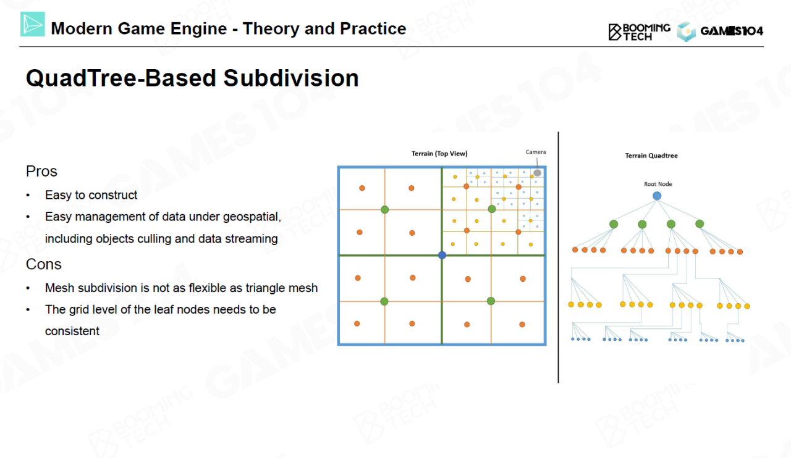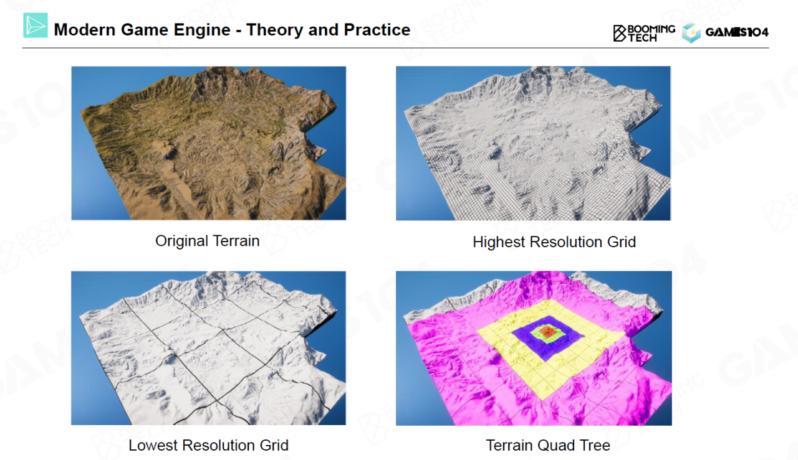

**存在的问题**：quad-tree同样需要考虑T-junction的问题。

像三角形那样继续切分，切一刀需要改几何的拓扑结构，很麻烦。

**顶点吸附**：不过在quad-tree中可以通过将三角形顶点之间吸附到其它顶点上的方法来简化处理。

顶点吸附会生成面积为0的“退化三角形”，渲染器需要处理这种情况：是画一个像素还是不画。

代码也比继续切要好写。

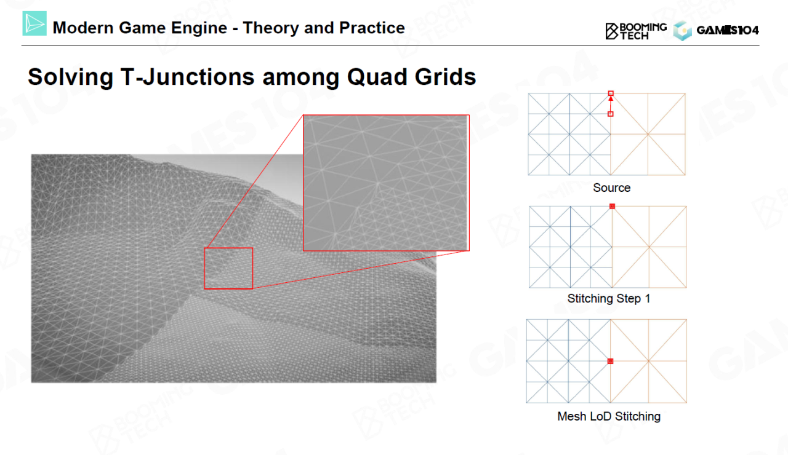

#### Triangulated Irregular Network
通过用不规则三角形来表达地形，进一步减少三角形数量。从信号学的角度来讲，可以提升采样效率。

在很多场景中均匀采样的地形会造成一些存储空间的浪费。实际上对于高度变化不大的区域只需要少量的三角形就可以进行表达，而对于高程变化剧烈的区域使用数量更多的三角形来还原地形的细节。

用了面片简化算法。

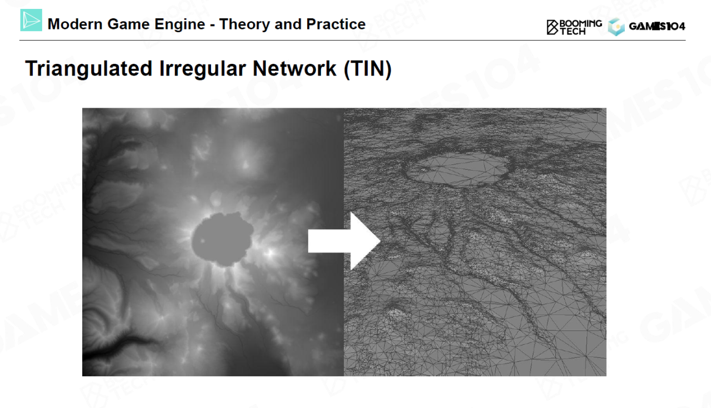

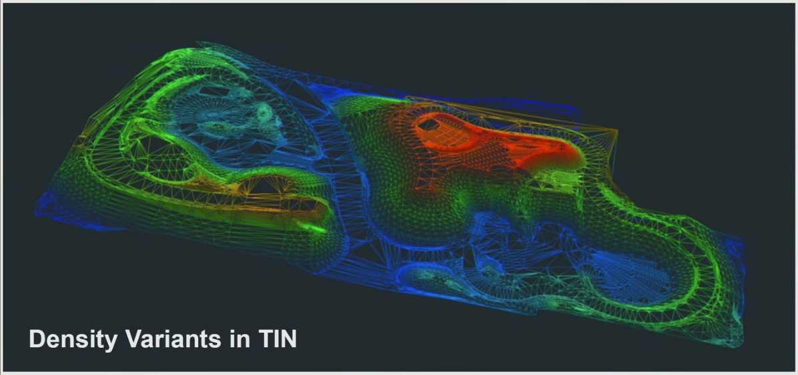

不过目前这样的方法在游戏工业界的应用还比较少，现代战争游戏中在用。主流的地形处理方法仍然是使用均匀采样的网格。

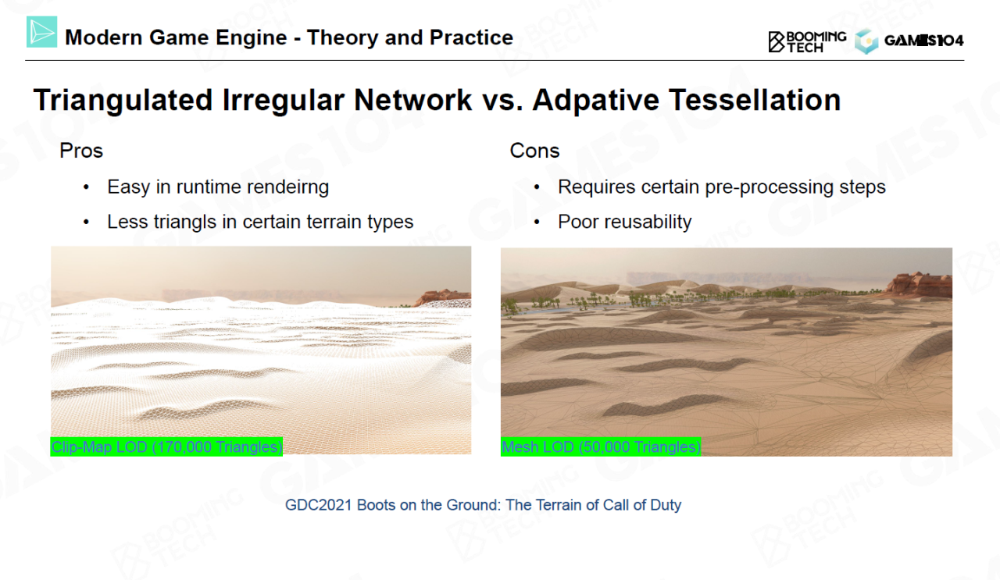

#### Hardware Tessellation 
GPU出现之前，需要在CPU预处理好地形的细化。

利用现代GPU的强大计算能力我们可以把地形的细化完全放到GPU上进行实时计算。在DirectX 11中提供了hull shader、tessellator以及domain shader等工具来网格的实时细分。

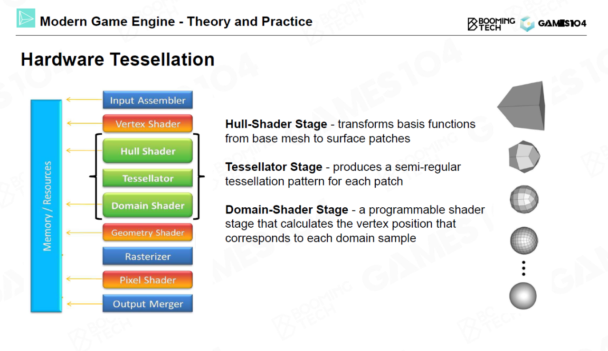

1. hull shader: 生成控制点
2. tessellator：把边tessellate多少次
3. tessellatd Mesh：tessellate的结果
4. domain shader：采样高度图，移动一下顶点
5. geometry shader：把texture uv之类的再算一遍

几个不合理的设计：

1. geometry shader 应该叫 post tessellation vertex shader
2. domain shader和geometry shader 不应该分成两个shader

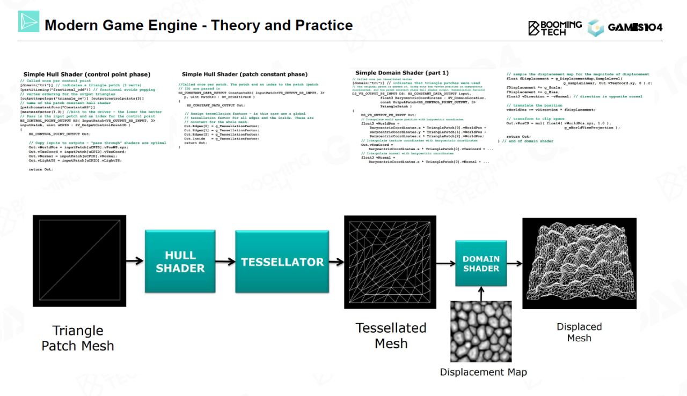

在更新的DirectX 12中则将上面这些概念合并到mesh shader中，通过mesh shader来实现全部的网格细分功能，从而极大地方便来游戏开发和图形程序。

win7是不支持DirectX 12的。可以在steam上看有多少人从win7升win10了。

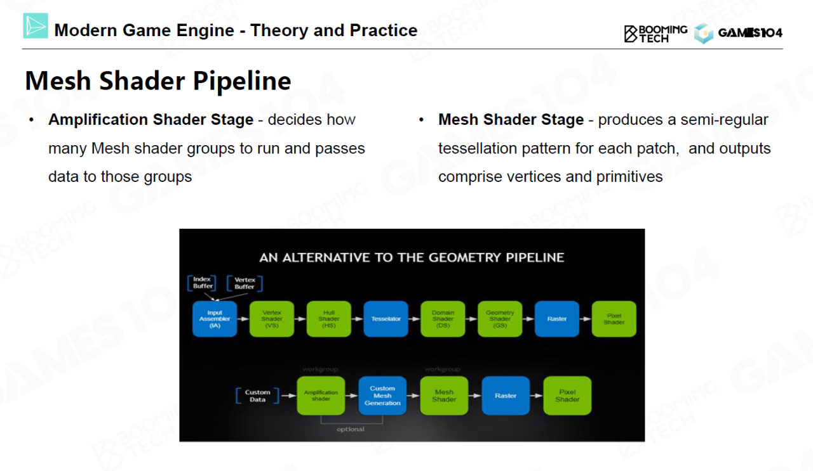

此外还可以利用GPU的计算性能实现动态的地形绘制，从而进一步提升玩家的游戏体验。

地形可以用一个个小的弹簧模拟。现代游戏引擎最好实现一下这个效果。黑神话悟空就实现了。

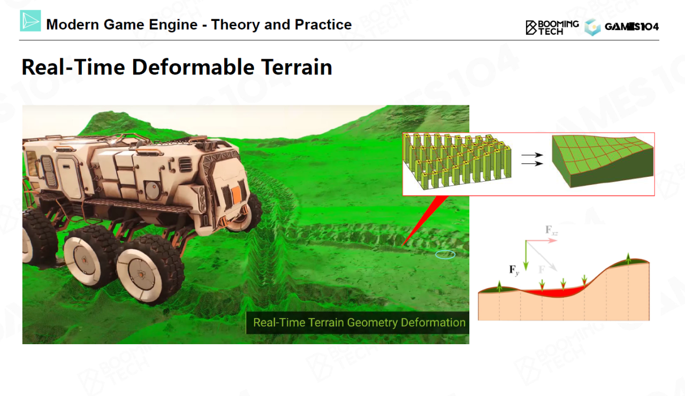

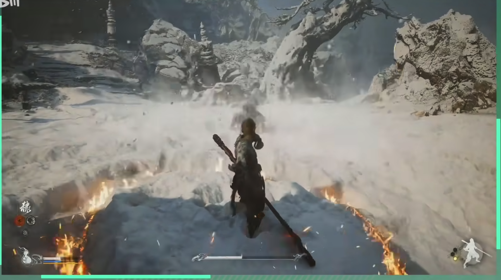

#### Non-Heightfield Terrain
有些游戏场景如洞穴可能无法使用高度场来进行表示。

以前的游戏引擎，只是插个物体，让用户感觉有倒钩，有悬崖。

方法1: 不能在山上开个洞。怎么办？一个巧妙的做法：把挖掉的顶点做个标记，vertex shader把这些顶点输出一个无效数NaN。现代GPU会把无效数顶点的相关三角形全部扔掉。但是，会产生zigzag效果，不好看。但艺术家可以插个隧道模型进去。

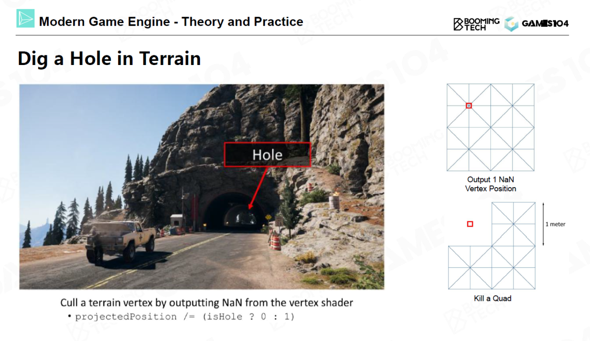

方法2: 对于这种场景可以考虑使用体素来表达场景的几何，然后利用**marching cube**算法来生成表面。

波函数坍缩。[https://www.yuque.com/pengcheng-fuigs/el3mi0/ytfqms4nix3dgtf9](https://www.yuque.com/pengcheng-fuigs/el3mi0/ytfqms4nix3dgtf9)

volumetric representation：每均匀网格，点有一个权重。PS：下图貌似来自youtube [https://youtu.be/M3iI2l0ltbE?si=aT9dTp_XHQ47l4RI](https://youtu.be/M3iI2l0ltbE?si=aT9dTp_XHQ47l4RI)

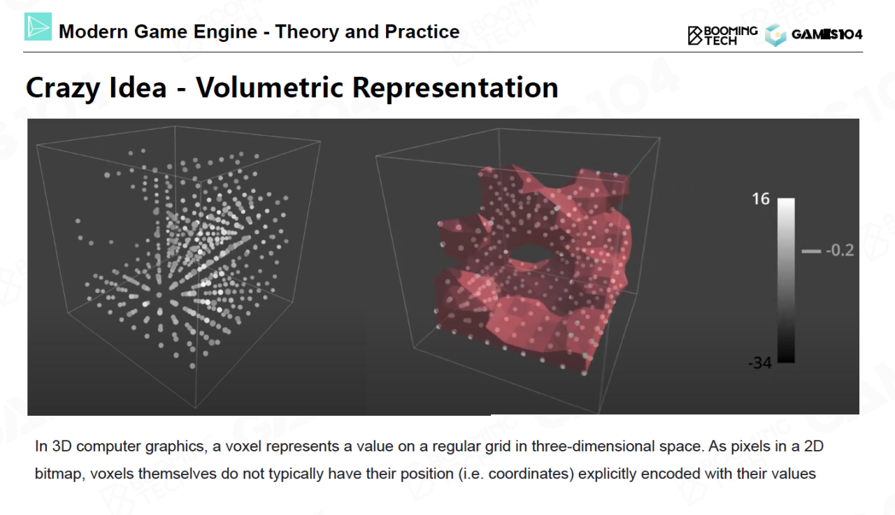

处理每个顶点数据的时候，可以在上下左右找八个点。有14种方法去切分cube，形成一个水密的三角面片集，把形状表达出来。

人体扫描出来的是一个个点，如何生成形状？也是用的marching cube。

如何可视化螺旋浆在空间产生的速度场？也是用volumetric representation + marching cube。

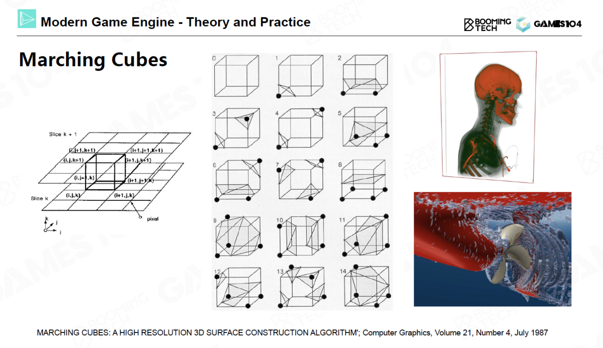

当然这种方法由于表示地形比较复杂，目前仍处于试验阶段，几乎没有游戏使用相关的技术来表示地形。

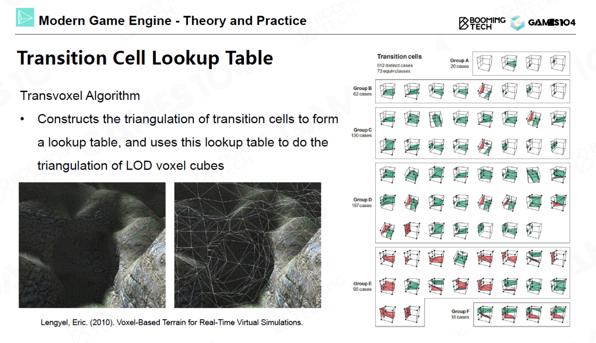

### Terrain Texture
有了地形的几何表示后就可以为它添加纹理细节进行渲染。

一个3A游戏，地表的材质的数量要求非常多。

Ghost Recon Wildlands 有 11种生物群与140种材质混合。

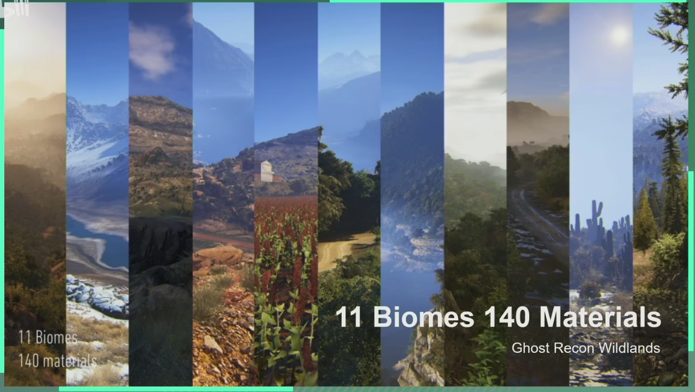

#### Texture Splatting
假设用MR模型

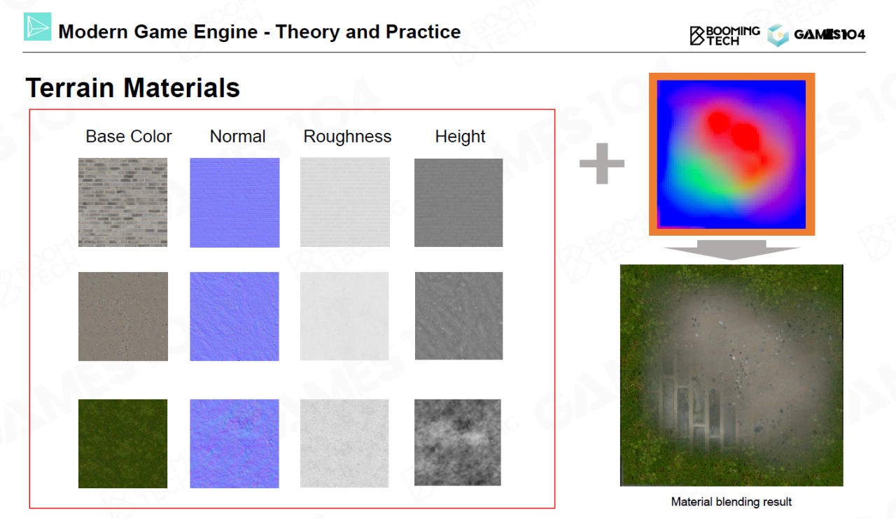

基于纹理合成算法，我们可以控制不同纹理之间的混合比例从而获得接近真实地形的纹理。

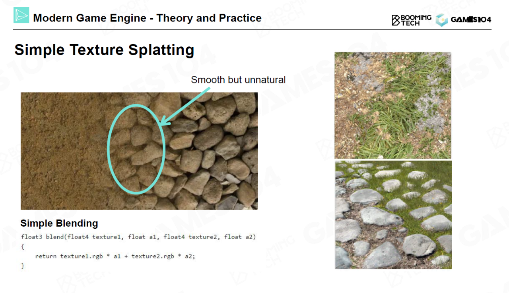

此外我们还可以利用地形的高程来动态调节混合比例，从而实现高低起伏上不同的纹理效果。

也存在问题，两个材质的切换是0/1切换，相机移动时信息很高频，会有抖动。从很低的视角看分界线，分界线会很sharp。

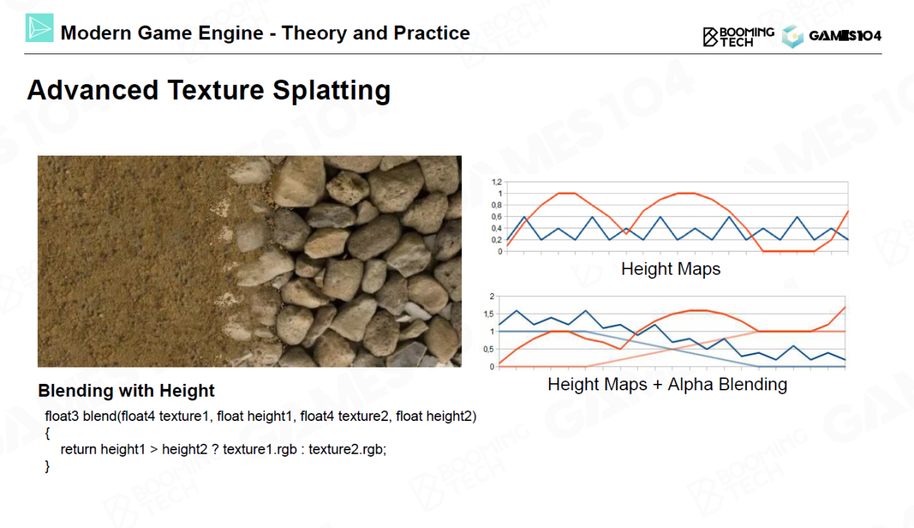

继续hack，加个bias。凡事不决，加bias。过渡区域做插值，看起来更自然更稳定。

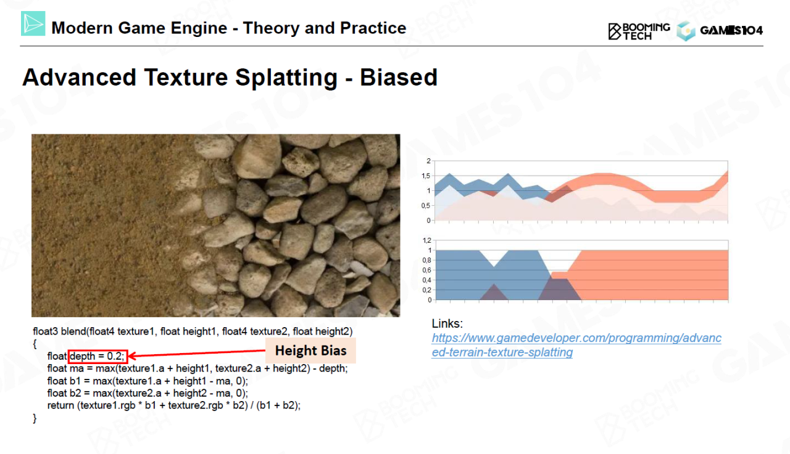

当需要对多种不同材质进行混合时还可以使用texture array来管理不同材质的混合关系。

不要混淆3D texture和texture array！

+ 3D texture mipmap时，会对上下左右前后八个点做双线性插值。 
+ texture array时，要准确告诉 mipmap 采样哪一层。做混合时，要准确告诉他index，然后用权重做混合。

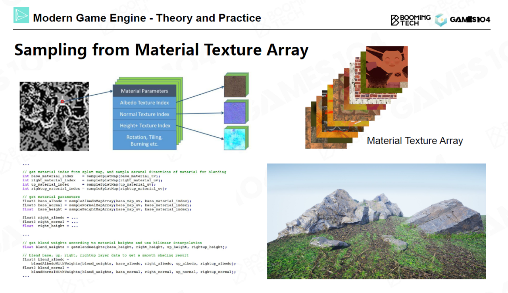

除此之外在地形渲染中还大量使用了视差贴图的技术来产生立体感。

两个很著名的绘制的表达：

+ 法向贴图：会带来明亮相间的凹凸感
+ 视差贴图：ray marching，产生更加强烈的立体感。缺点是1. 每个像素的预算要更贵（要通过ray marching 往前走几步来测一下），2. 只能产生视觉上的凹凸感，但几何的边界看起来还是刀切过去一样，光滑的。
+ Displacement mapping：在近处把地形边细。

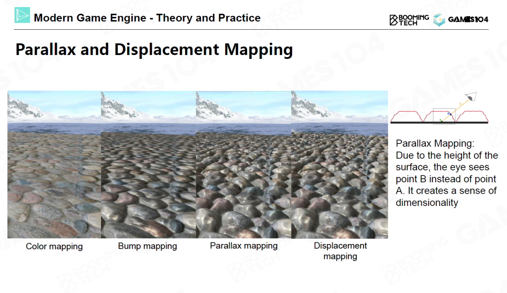

#### Virtual Texture
直接对地形纹理进行混合时容易造成计算上的性能问题，这是由于对纹理进行插值的计算是相对复杂的（没个像素点下，对所有texture采样）。如果没有设计好渲染管线则会导致渲染效率的下降。

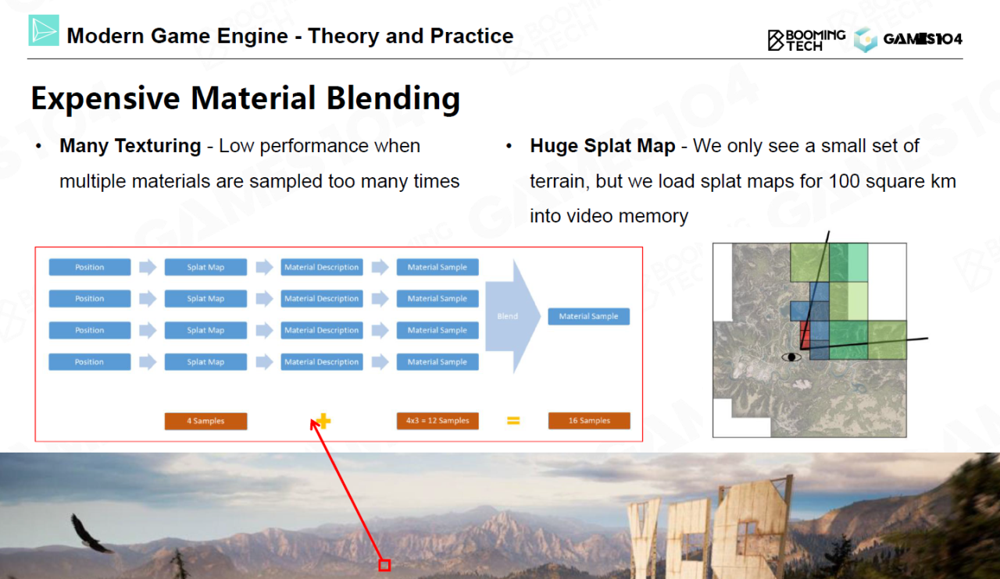

在现代游戏引擎中大量使用了**虚拟纹理(virtual texture)**的技术来提高渲染性能。

现在虚拟纹理已经一统天下了，人们已经不用texture array来做blending了。

核心思想，只把用的东西装进内存，不用的扔到硬盘。

使用虚拟纹理时首先需要把纹理分解成若干个尺寸相同的tile，然后把不同LOD的纹理则需要事先进行烘焙（多层texture的混合）存储在硬盘上。在实际渲染时根据绘制目标的精度来决定所需的LOD以及对应的tile，然后将需要进行渲染的纹理tile加载到内存中作为实际的纹理贴图。

这样的方式可以极大地缓解纹理读写的内存需求从而提高渲染效率。

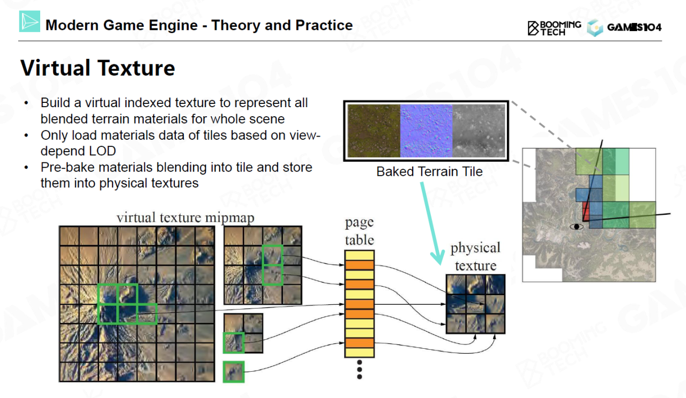

传统的纹理加载过程：硬盘=〉内存=〉显存。显然虚拟纹理的性能瓶颈在于从硬盘加载纹理的IO过程。

想要进一步提高效率甚至可以绕过CPU 直接让GPU从硬盘进行加载。

相关两个技术：

1. Direct Storage。数据还是经过内存，但内存不解压了，数据在GPU中解压。压缩的传输效率高。
2. DMA。索尼的，显存直接读硬盘。

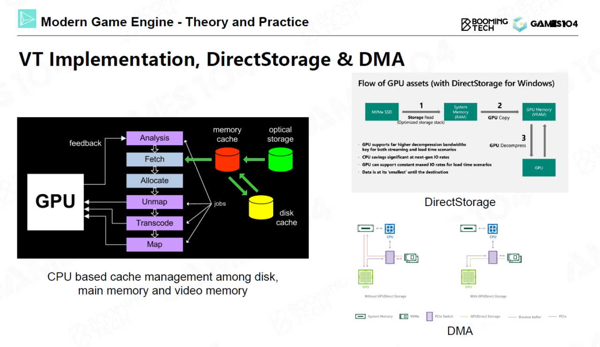

#### Camera-Relative Rendering
浮点数精度溢出：当渲染物体与相机的距离达到一定程度时就需要考虑浮点数的计算精度问题，如果不进行处理会导致严重的抖动和穿模现象。当数值特别大或特别小时，ieee 754 都会出现严重的精度问题。

如，相机位置为20000m，墙位置为20001.1m，画位置为200001m，此时就会出现抖动和穿模。解决方案就是，把相机放到原点，这样相机的位置是0m，墙位置为1.1m，画位置为1m，就尽可能地避免了这一问题。

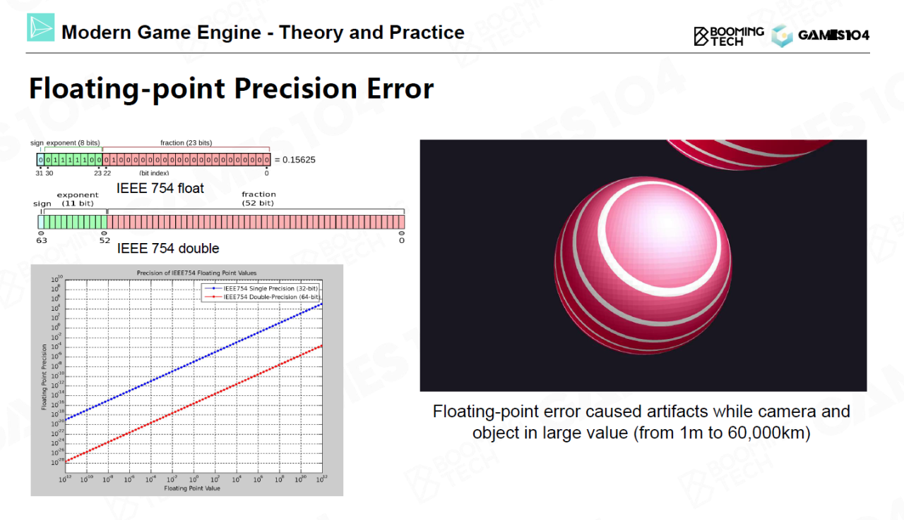

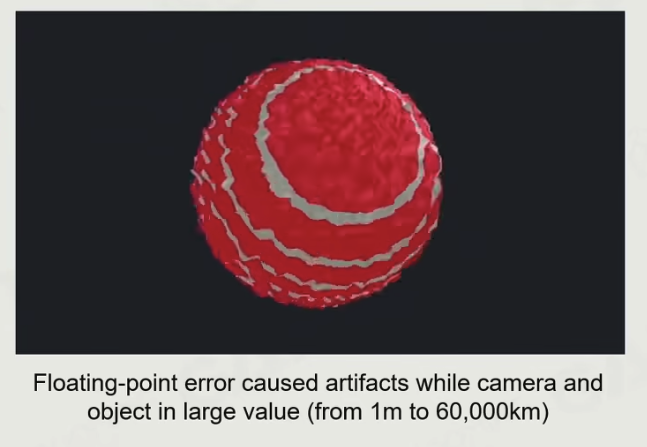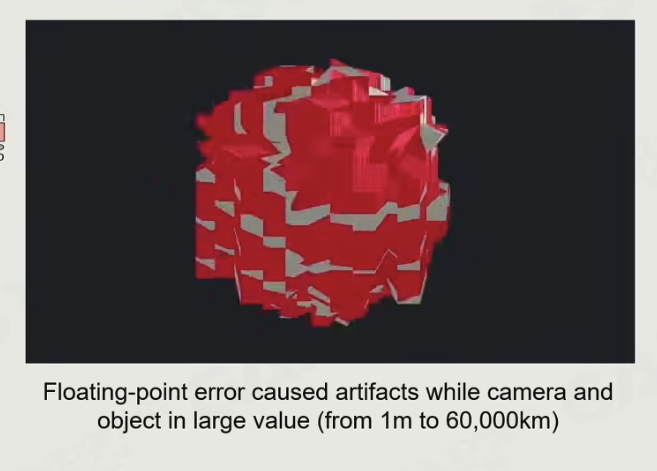

想要缓解这种问题可以将相机设置为世界坐标的中心，这样的处理方法称为**camera-relative rendering**。视角移动时，不要移动视角，而是移动场景。

是虚幻和Unity等引擎中的标准解法。如游戏每个关卡重置视角。

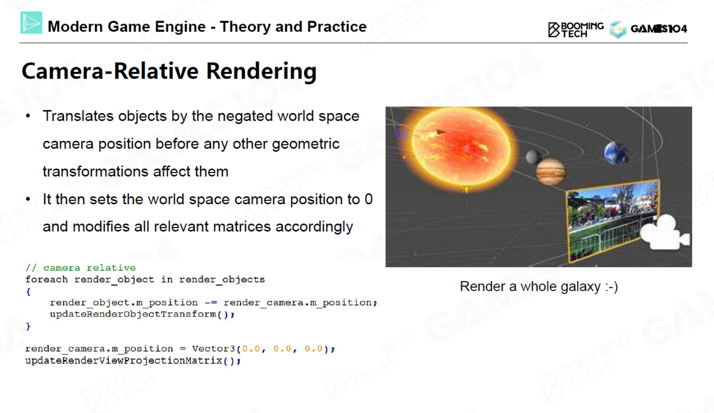

#### Decorator
除了各种地貌纹理外，游戏设计中还需要在地面上设置各种植被、草丛、道路等各种**装饰件(decorator)**。这些装饰件看起来很简单，但实际上要想做出比较好的效果仍然需要非常复杂的算法。

树的渲染是非常有挑战性的，光一个tree的插件就能卖几十万。树在近处时看到的是真正的mesh，远处时用一些插片来表达，插片会在人难以感知的情况下变得越来越稀疏，到非常远时就变成。大名鼎鼎的 Speed tree 插件就是专门用来做树木植被渲染的中间件。

地上的草、小灌木丛、碎石等都是装饰件：

+ 一般都尽量用最简单的mesh去表达。
+ 简单的游戏会用插片或view depends的方法去做。
+ 3A游戏有更复杂的做法。

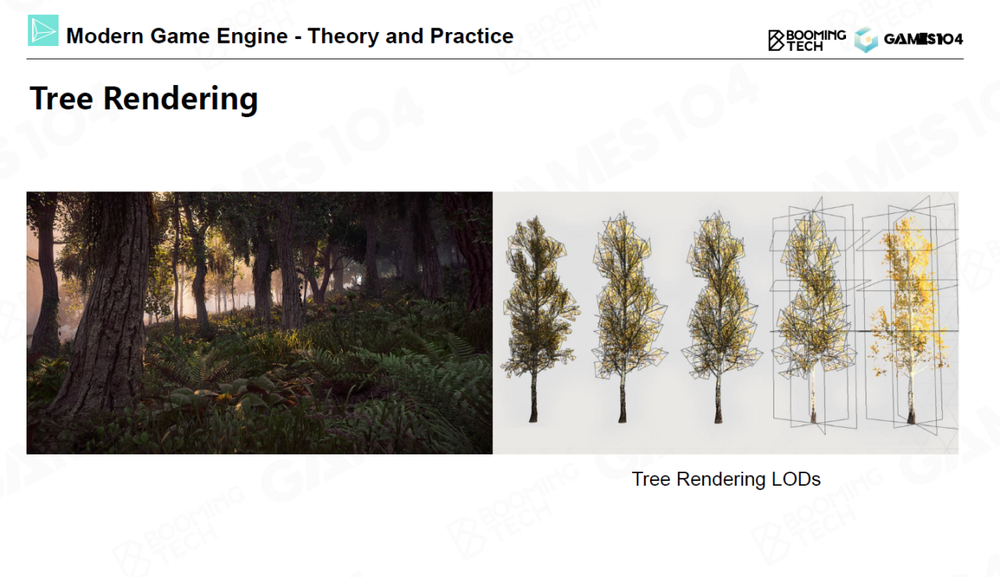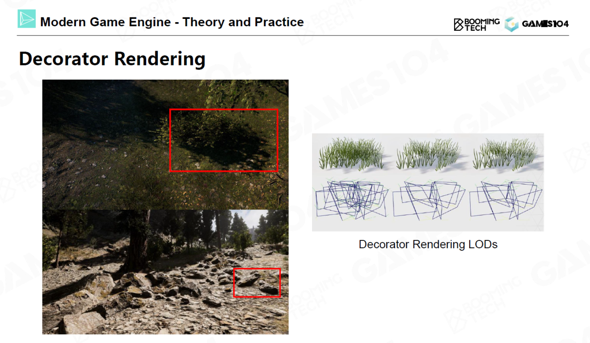

道路系统和Decal（贴画，贴片？）系统也十分复杂。

道路系统一个麻烦的点是，道路之间会有穿插，不能让两个贴图直接blending覆盖在一起。道路最常见的做法是用spline。artist用起来非常爽，程序员就 不爽了。程序员不仅要把道路上的贴图生成好，还要把高度场进行切割和腐蚀。

Decal 是一种小的贴片，如CS中子弹打到墙上留下的枪眼枪洞（可以加法向效果）。artist会在环境中撒很多decal，让环境有多样性。现代游戏中，这些decal会直接bake到 virtual texture中，runtime的成本很低。

艺术家可以在粗模上painting texture，但现代大都用程序化生成的方法生成山川河流的腐蚀、道路、植被等。

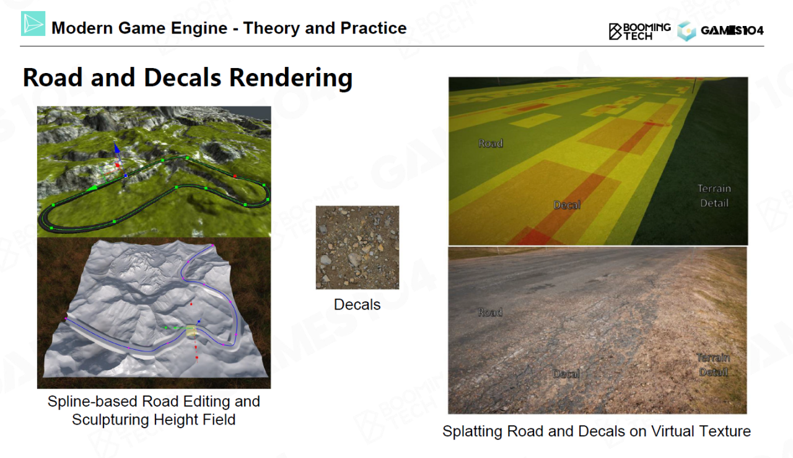

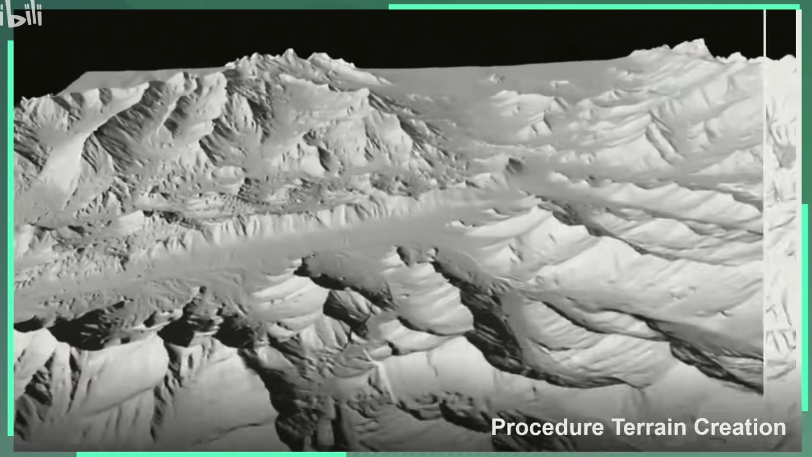

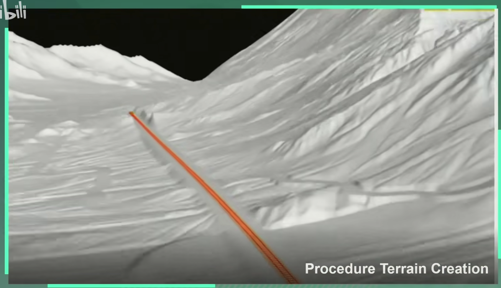

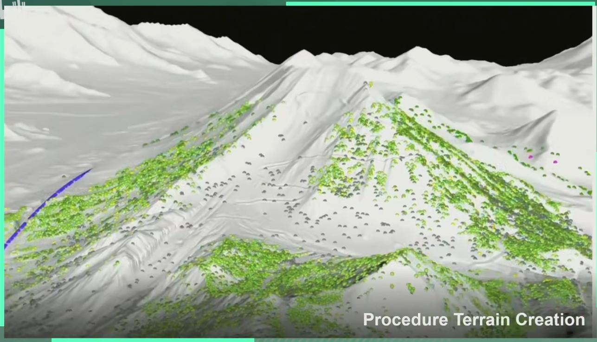

## Sky and Atmosphere
### Atmosphere
天空和云会极大地影响游戏氛围，影响人的情绪。

天空有两个元素，要分开来看：天空（大气）和云

Sky是地表向上一百公里，而Cloud是很低的。人在移动时会感受到云的体量感。

此外还有一个重要的东西，Fog。Fog放到效果中去讲，因为它不仅是一种天空大气现象，实际上也是一种非常重要的artist控制的效果。

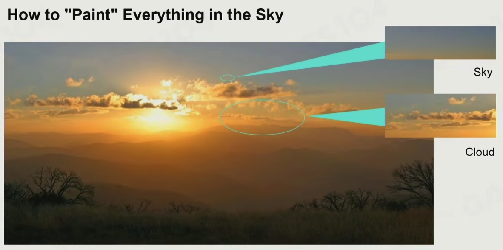

#### Analytic Atmosphere Appearance Modeling
凡事不决上拟合，先观察物理现象，再找模型去拟合。

对于天空和大气的渲染，最简单的方法是使用拟合公式来直接计算着色。当然这种方法的缺陷也很多，比如说它只能表示从地表进行观察的效果，而且可以调整的参数也有很多的限制。有点像大气界的blinn-phong。

算法需要输入两个角度：

1. 视角到天顶（z轴）的角度
2. 视角到太阳的角度

非常简单，但存在局限性。

1. 局限于地表（太空中飞过来就不行）
2. 所有参数都是写死的（下雨天不行）

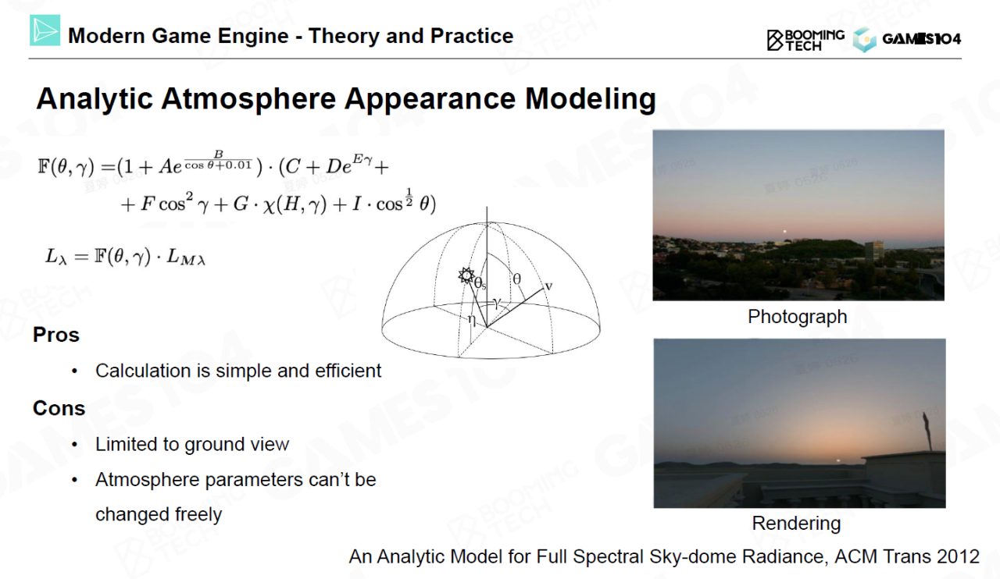

#### Volume Rendering Equation
如果想要渲染出真实的大气效果则需要考虑光照与大气相互作用的物理过程。

Participating Media（参与介质）：大气层由两种粒子组成，各种气体分子和气溶胶（灰尘等）。正是因为有这些各种各样的分子，才会产生各种复杂的光学现象。

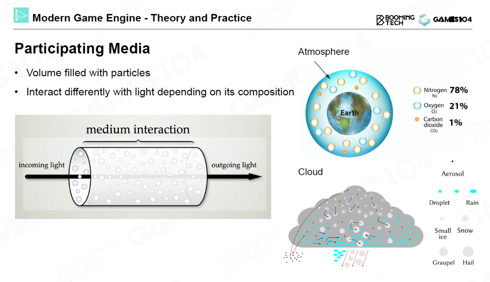

当光线与大气中的各种气体分子以及灰尘等气溶胶发生相互作用时有三种可能的现象：**吸收(absorption)**、**发射(emission)**以及**散射(scattering)**，其中散射又可以分为**内散射(in-scattering)**和**外散射(out-scattering)**。基于**辐射传输方程(radiative transfer equation, RTE)**我们可以得到出射光线的radiance在指定方向上的微分。

1. 每往前走多少步，有多少光线被吸收
2. 光打中分子后，往外散射，也要一个参数
3. 高温气体，如火/闪电会有自发光
4. 周围其他分子打过来的光

四部分合并，得到辐射传递方程 RTE。这里写的是简单的一维方程，实际上三维空间中应该是复杂的梯度方程。

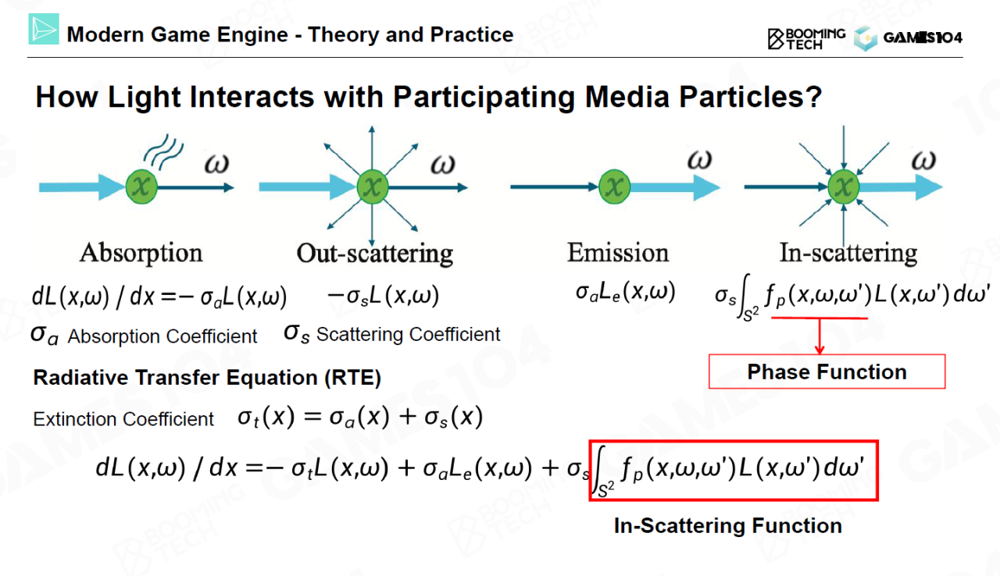

通过对RTE梯度方程沿光路进行积分，我们可以得到光线穿越介质后的radiance。这个方程也称为**体渲染方程(volume rendering equation, VRE)**。

当一束光照过来，有两个很关键的变量：

1. 远处的一个东西，有多少能够传输到我的眼中
2. 有多少散射能量沿着这个光路到眼中。


#### Real Physics in Atmosphere
真实的大气物理学，有两个主要的参与者

1. 太阳
    1. 太阳光是大量不同波长的光组成的，叠加起来呈白色
2. 大气中的气体分子和气溶胶分子
    1. 气体分子尺寸一般小于波长
    2. 气溶胶分子一般等于波长


#### Scattering
求解VRE最复杂的地方在于如何计算散射项。在大气渲染时我们一般只考虑**Rayleigh散射(Rayleigh scattering)**和**Mie散射(Miew scattering)**两种形式的散射。

Rayleigh散射：当大气中介质的尺寸远小于光线的波长时会发生Rayleigh散射，几乎在四面八方散射，不太具有方向性（只有一点点）。此时散射自身是**无方向**的而且散射的行为只**与光线的波长有关**。对于越长的波长（红光），散射的越厉害，越短的的波长（蓝光、紫光、紫外线），散射越弱。

Mie散射：气溶胶尺寸接近大于波长时，散射会具**有方向性**，一般沿着光的方向略强一些。但**对波长不敏感**。


当光线发生Rayleigh散射时太阳光中不同波长的色光会发生不同程度的散射。具体而言短波长的蓝光会出现大量的散射行为，而长波长的红光则只会发生少量的散射。这样的现象就导致了白天我们观察天空时眼睛会接收到来自四面八方散射的蓝光，因此天空呈蓝色；而在日出或是傍晚时太阳方向上只剩下未散射的红光，此时太阳呈红色。

公式就两个部分，Phase Function 和 Scattering Coefficient：

+ Phase Function：代表几何形状。几何形状就是一个腰鼓的形状 $ 1+cos\theta^2 $
+ Scattering Coefficient：
    - $ \lambda $：波长。波长越短，散射强度越高。
    - $ h $：海拔高度。大气在海拔为0时大气密度最大，海拔越高大气密度越小。这里假设是线性变化。

 

为什么天是蓝的？

1. 太阳直射的时候，大量蓝光会在大气层中被散射开来，经过多次散射进入眼睛。红光是直接照到地上的，但你不会直接看太阳。
2. 傍晚太阳斜照，很多蓝光会散射到大气层外。吸收现象也会加剧这个现象。


当大气中介质的尺寸接近或大于光线的波长时会发生Mie散射，它的特点是散射程度与波长无关只与观测方向有关。

+ Phase Function：更具方向性。一个神奇的形状。凡事不决上拟合。当g等于0时，形状会退化成花生豆；当g大于0时，越来越趋近图中的形状；当g小于0时，往光线相反方向的更多。
+ Scattering Coefficient：少了$ 1/\lambda^4 $，不受波长影响。


我们日常生活中常见的雾气和光晕都是Mie散射的结果。

雾：水滴是气溶胶，对各个波长进行无差别的 Mie 散射，白茫茫的。

傍晚日晕、雨天路灯：光源旁边围着一圈，有方向性的散射。


#### Absorption
除了散射外，在大气渲染时还需要注意不同的气体分子对于不同波长的光线有着不同的吸收行为。

臭氧和甲烷都会吸收长波。

海洋星看起来是蓝色的，是因为星球表面有很多甲烷。

臭氧会吸收紫外线。可见波波段会吸收红光多一点，不可见光波段？？？

当给出一个大气模型时，会假设臭氧和甲烷是均匀分布在天上的。（实际上臭氧是在天上的）


#### Multi Scattering
在计算散射时还要注意大气的多重散射行为：在积分时不仅要考虑光路上介质的散射行为，整个空间中介质粒子都会对接收到的光线产生贡献。

multi scattering 可以照亮山背面。应该有亮度


#### Ray Marching
对大气进行渲染时可以利用**ray marching算法**进行计算，它的思想非常简单：我们只需要把整条光线分解成N段然后在每一小段上单独进行积分，最后把N段的积分相加即可。


##### Precomputed Atmospheric Scattering
直接积分太复杂。在游戏引擎中可以通过预计算的方式提前存储在硬盘中，这样实际渲染时只需要进行查表即可。

大气中的光学现象，其实只有两个最重要的部分：

1. transmittance，通透度，透射率。看一个远处的东西大概能看到百分之多少
2. scattering，散射度。

以透射率（transmittance）为例，我们可以把大气的透射率分布参数化为海拔高度与天顶角的函数，然后预计算改点海拔高度到大气边缘（一般假设地球半径+100km，xx面的地方）的透射率，存储在一张纹理图像上。

地球表面的任何一个点，算海拔高度。在海报高度存两个值：1. 视线和天顶的夹角$ \theta $2. 现在和海拔高度的区别。


对于单次散射的情况，我们同样通过预计算的方法将散射参数化为海拔高度、观测角度以及太阳角度的函数。


最后我们把透射率的纹理图像以及单次散射的纹理不断进行积分就得到了多次散射情况下大气渲染的预计算纹理。目前很多3A游戏的天空渲染都是基于这样的方式进行处理的。


上面介绍的方法虽然可以获得非常好的效果，但它仍然具有一些缺陷：比如说离线的预计算仍然是非常费时的，而且在实时渲染时高维纹理的插值对于一些移动设备不够友好，更重要的是它很难处理大气成分发生变化时的渲染问题。


为了缓解这些问题，人们还开发出了各种近似方法。比如说我们可以假设大气是各向同性的均匀介质，然后使用一个衰减系数来模拟单次散射后接收到的光线。这样可以使用几何级数来表示光线经过无限次散射后到达相机的能量比例。


对于高维纹理的问题可以假设观察位置和太阳位置是不变的，这样光照就只是观测方向的纹理。


最后通过ray marching沿路径进行积分就可以得到大气散射的近似效果。


实践证明这样的近似方法在一些移动设备上也可以实现不错的渲染效果。


### Cloud
在大气的基础上添加云可以实现更加真实的环境渲染效果。


早期对云进行渲染的方法是使用网格来建立云的模型。这种方法可以渲染出高质量的云，但由于它非常不灵活现在基本已经弃用。


过去也出现过使用透明通道来近似云效果的方法，不过这种方法很难生成逼真的渲染效果。


目前3A游戏一般会使用体积云的方式来对云进行渲染，尽管它有着比较高的计算复杂度但却可以实现逼真的渲染效果。


使用体积云进行渲染时我们需要一张weather texture来表示云在平面以及厚度的分布。


生成体积云模型时首先使用weather texture产生柱状的云层，然后利用Perlin噪声和Worley噪声进行腐蚀就可以产生逼真的云模型。


进行渲染时使用ray marching的方式来计算散射就可以实现逼真的渲染效果。


## Reference
+ [Lecture 06：The Challenges and Fun of Rendering the Beautiful Mother Nature I](https://www.bilibili.com/video/BV1au411y7Fq/?spm_id_from=333.788)
+ [Lecture 06：The Challenges and Fun of Rendering the Beautiful Mother Nature II](https://www.bilibili.com/video/BV1i3411T7QL/?spm_id_from=333.788)
+ [https://youtu.be/M3iI2l0ltbE?si=aT9dTp_XHQ47l4RI](https://youtu.be/M3iI2l0ltbE?si=aT9dTp_XHQ47l4RI)
+ [Marching Cube](https://www.yuque.com/pengcheng-fuigs/el3mi0/ytfqms4nix3dgtf9)

> 更新: 2024-01-28 16:06:55  
> 原文: <https://www.yuque.com/viruspc/el3mi0/ewvn8igeil345gm7>