# 游戏引擎中的渲染实践

- [Introduction](#introduction)
  * [Challenges on Game Rendering](#challenges-on-game-rendering)
  * [Rendering on Game Engine](#rendering-on-game-engine)
- [Building Blocks of Rendering](#building-blocks-of-rendering)
  * [Rendering Pipeline and Data](#rendering-pipeline-and-data)
  * [Understand the Hardware](#understand-the-hardware)
- [Renderable](#renderable)
- [Render Objects in Engine](#render-objects-in-engine)
- [Visibility Culling](#visibility-culling)
- [Texture Compression](#texture-compression)
- [Authoring Tools of Modeling](#authoring-tools-of-modeling)
- [Cluster-Based Mesh Pipeline](#cluster-based-mesh-pipeline)
- [Pilot](#pilot)
- [Reference](#reference)

---

## Introduction
游戏渲染的理论基础和图形学中的渲染是一样的。不过: 

1. 渲染研究更关注于某个特定类型的效果。
2. 渲染研究更关注于算法理论的正确性。
3. 渲染研究对实时性没有太多的要求。而在游戏渲染中实时性则至关重要。对实时渲染的关注构成了游戏渲染和渲染理论之间的主要差别。

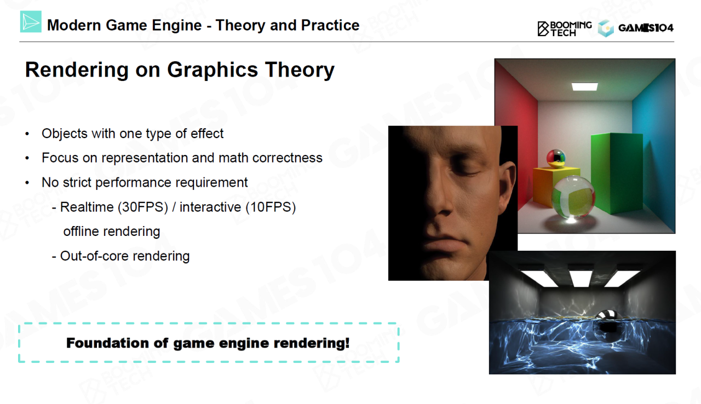ß

### Challenges on Game Rendering
游戏中渲染的难点有以下几个方面：

1. 游戏场景往往包含各种不同类型的渲染对象，同时需要在场景中实现光照、大气、天空、水面等不同的渲染效果。
2. 其次，在图形学中我们不太关注渲染在硬件中的实现过程。而在游戏引擎中，为了充分利用计算资源则需要考虑渲染过程的硬件实现。
3. 再者，人们对于游戏画质和帧率的要求逐渐提高。现代3A大作往往需要适配4K的画幅并且保证不同场景下有着足够高的帧率(60-120FPS)。
    1. 30FPS (60FPS, 120FPS+VR)
    2. 1080P, 4K and 8K resolution
4. 最后，游戏引擎除了渲染系统外还要为其它物理、逻辑系统提供支持，因此我们不能让渲染系统占掉全部的CPU计算资源。一般来说渲染系统只能占掉10-20%的计算资源，把省下来的资源让给其它玩法系统。
    1. Profiling 很重要。一般游戏引擎都会有自动的 Profiling，每天自动跑，如果性能不够就不允许发布。

### Rendering on Game Engine
总体来看，游戏引擎中的渲染系统是一个庞大的软件工程系统。在整个游戏行业几十年的不断实践中总结出了大量有效的渲染技术。

理论科学更新换代没那么快，工实践科学更新换代很快。

本节课会介绍渲染的基础概念，在后面的课程中会分别介绍游戏行业中标准的材质光照系统、场景渲染和后处理方法以及游戏引擎中的渲染管线设计。

本课程不会涉及卡通渲染、2D渲染引擎、次表面以及毛发渲染等内容。

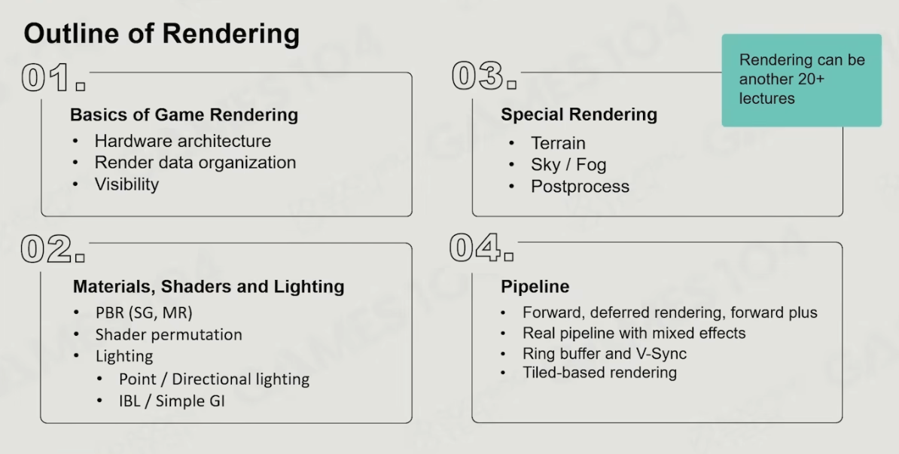

## Building Blocks of Rendering
### Rendering Pipeline and Data
目前游戏引擎渲染的主流方法仍是基于**光栅化(rasterization)**的渲染管线。

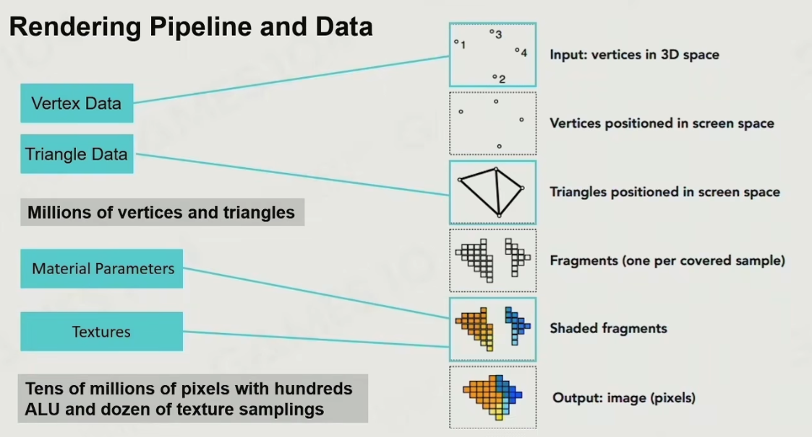

首先我们需要把场景中的物体投影到NDC上（先在Vertex Shader中乘以MVP矩阵到clip space，再GPU自己做透视除法到NDC，NDC后续还会应用视口变换到屏幕空间），然后分别计算平面上每一个像素对应的渲染对象。

  
**Local Space => (Vertex Shader) => Clip Space => (透视除法) => NDC => (视口变换) => Window Space/Screen Space => (Fragment Shader)**

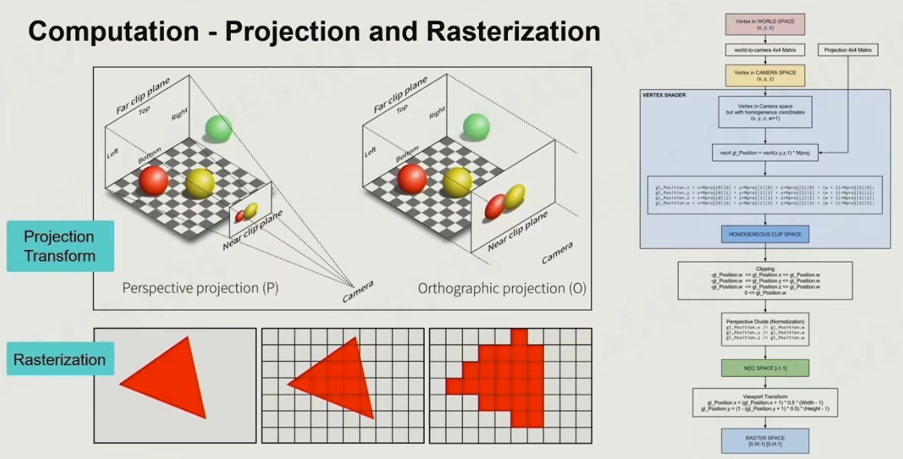

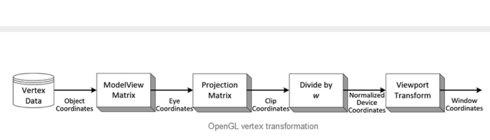

接下来对于每一个像素需要调用相应的shader计算像素的颜色。

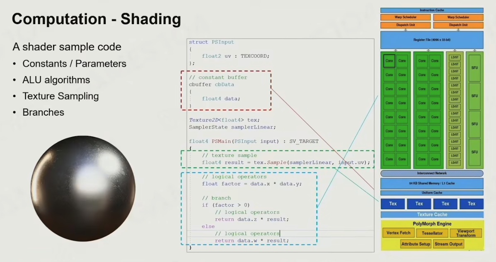

在调用shader时往往还需要通过纹理采样的方法进行反走样等处理。

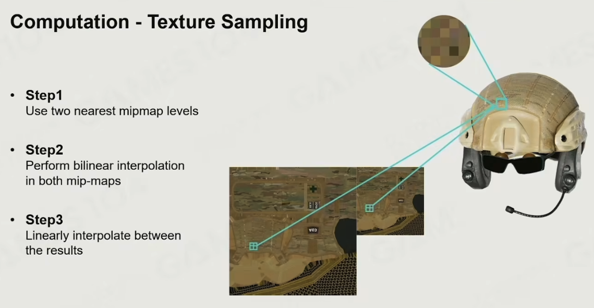

### Understand the Hardware
渲染计算的特点是有大量的像素需要进行计算，而像素之间的计算则往往是相互独立的。因此人们设计出了GPU来执行图形渲染计算，这样还解放了CPU的计算资源。

要了解现代GPU的架构我们首先来复习一下SIMD和SIMT的概念。

+ SIMD是指在运行程序时可以把一条指令同时执行在不同的数据上，目前现代CPU对于SIMD有着很好的支持，这种技术在高性能计算等领域中有着广泛的应用；
+ 而**SIMT**则是把同一条指令分配到大量的计算核心上同时执行，现代GPU的计算过程更类似于SIMT。

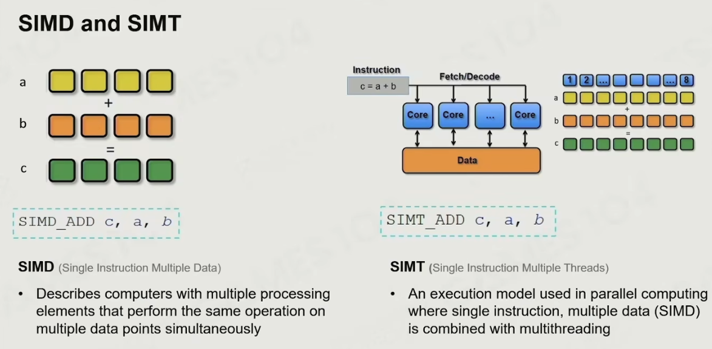

GPU 架构：

+ GPC：在现代GPU架构中有着大量重复的内核，每一组内核称为一个GPC。
+ SM：在每个GPC内部存放着大量的SM，而每个SM中还有着大量的CUDA核心用来执行数学运算，当SM接收到指令进行计算时会把运算分配给CUDA核心进行并行计算。同时GPU上还有share memory用来实现GPU上不同核心以及GPU和CPU之间的通信。
+ 还存在着很多其他核心：深度学习的Tensor Core，光线追踪的RT Core 等。

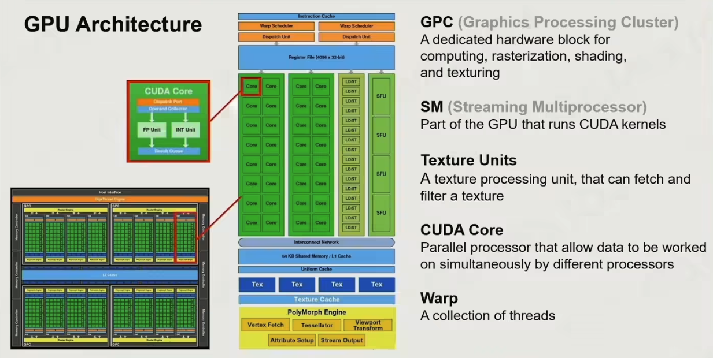

GPU和CPU之间通信的代价是非常大的，因此在渲染系统中会尽量把数据通信设计为单向的。这样GPU只需要读取CPU发送的数据而无需反向传输渲染的结果。

**尽可能不要从显卡读数据！！！**

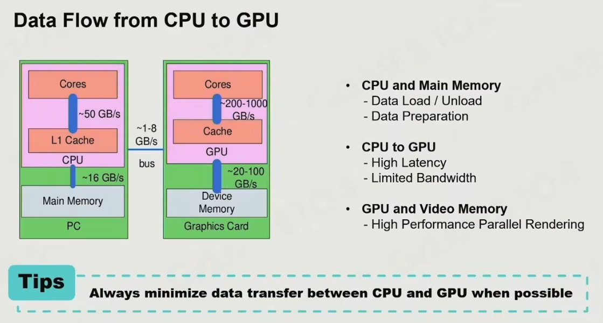

为了进一步提高数据读取的效率还需要合理地运用GPU缓存。

+ 数据一定要放在一起，以更好地利用计算机的缓存机制。

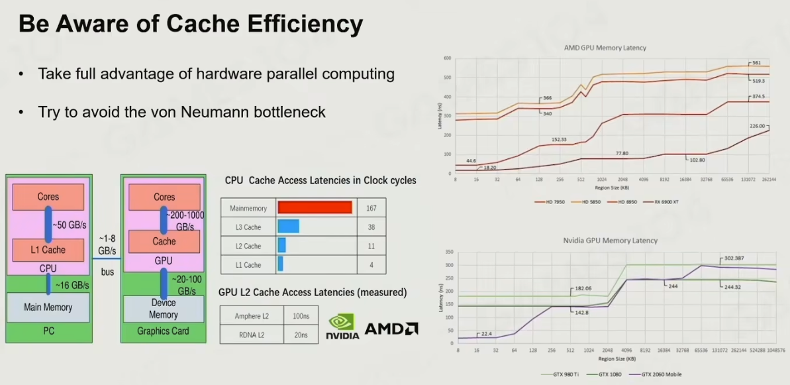

在长期的工程实践中人们总结了GPU渲染的性能瓶颈如下：

+ Memory Bounds
+ ALU Bounds （计算单元）
+ TMU (Texture Mapping Unit) Bound
+ BW (Bandwidth) Bound

任何一个地方出问题都会造成阻塞

当然GPU的架构也是一个不断发展的领域，目前现代GPU架构已经可以支持更加灵活的渲染管线。

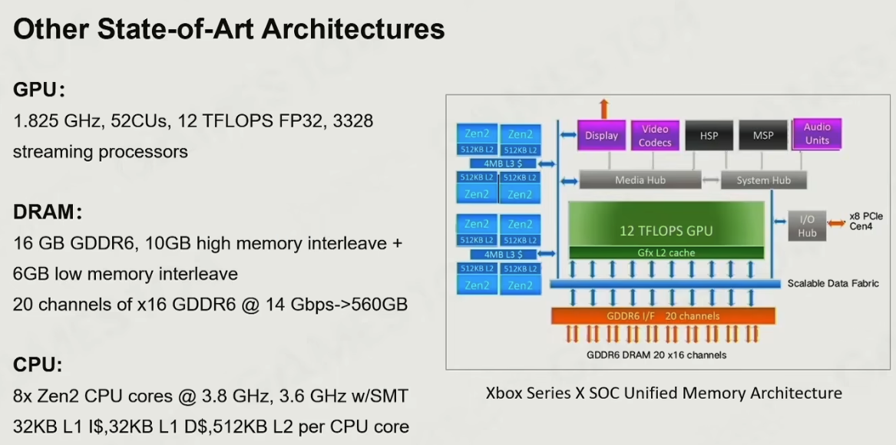

同时在不同的主机和设备上也往往有着不同于常见GPU的架构设计。

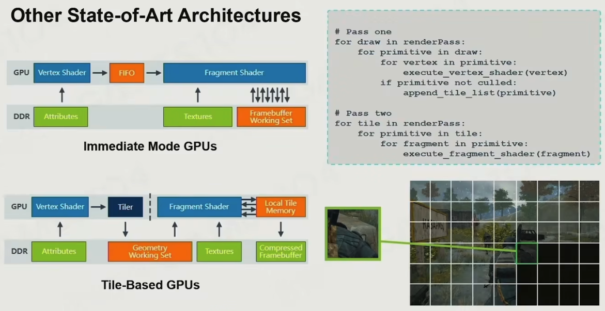

做游戏开发或游戏艺术家，最好了解一下GPU架构。这样你在设计游戏的玩法的时候，会知道硬件在什么地方会卡我们。这样就不会把场景做的无限复杂，就可以把更多精力放在游戏的玩法上。

## Renderable
不是所有的GO都可以被渲染。在进行渲染时我们只需要考虑那些需要进行渲染的GO，它们称为**可渲染对象(renderable)**。

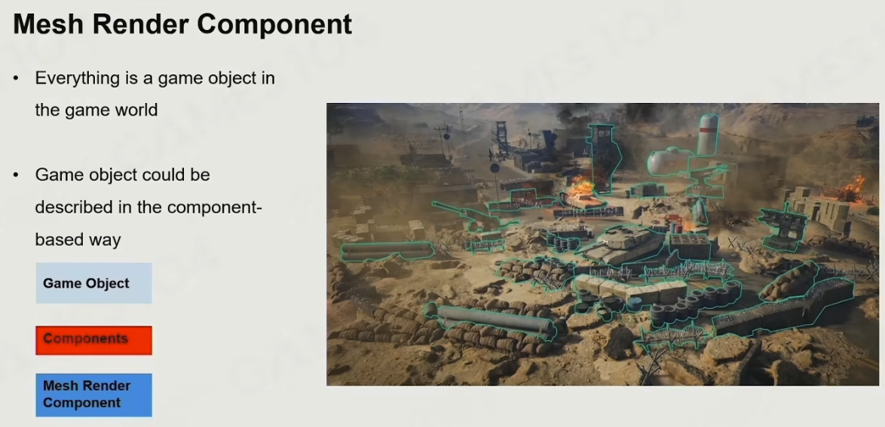

一般来说我们可以把整个可渲染对象拆分成若干个block，每个block有着自身的网格、材质等渲染信息。

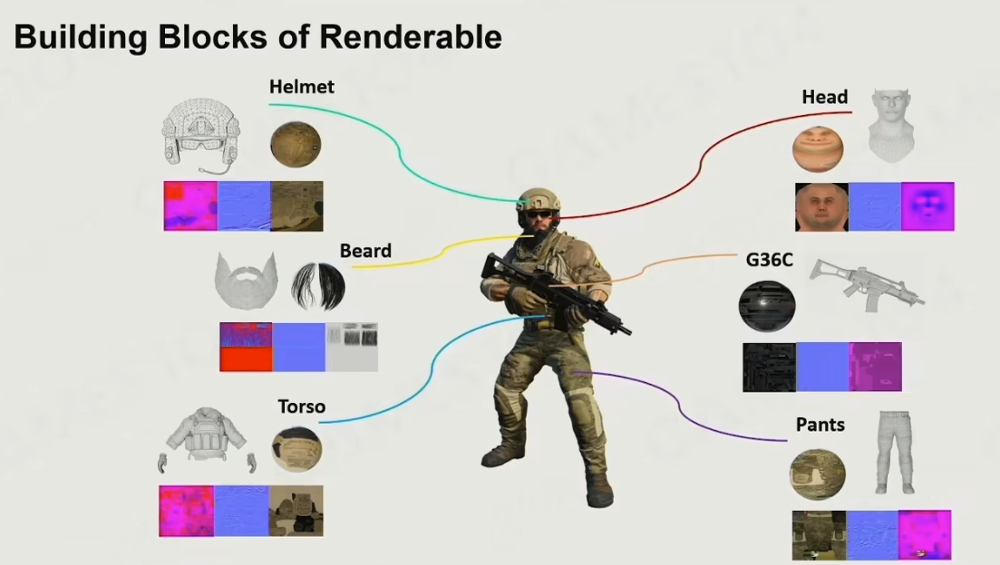

**顶点与法向**：对于网格数据，我们需要存储网格上所有的顶点坐标以及每个面包含节点的编号。同时我们往往还需要为每个顶点单独存储一个法向来处理曲面发生突变的情况。

index buffer：一般顶点数量只有三角形数量的一半，会将顶点数据存到一起，并采用index buffer来存储索引，这样存储空间理论上可以节省6倍。顶点数据存到一起，也对缓存更加友好。

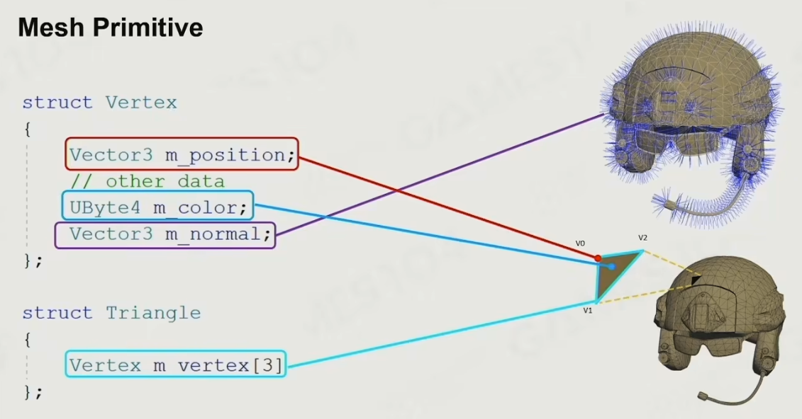

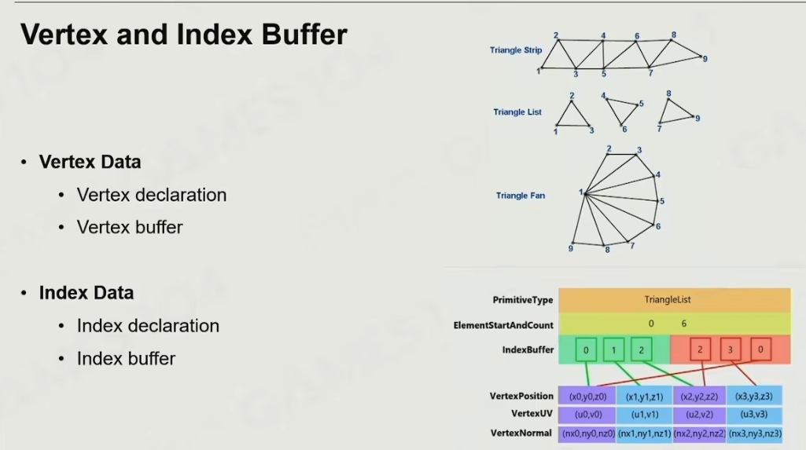

Per-Vertex Normal，立方体的拐角处，一个顶点会有三个法线；而不是一个顶点一个法线。

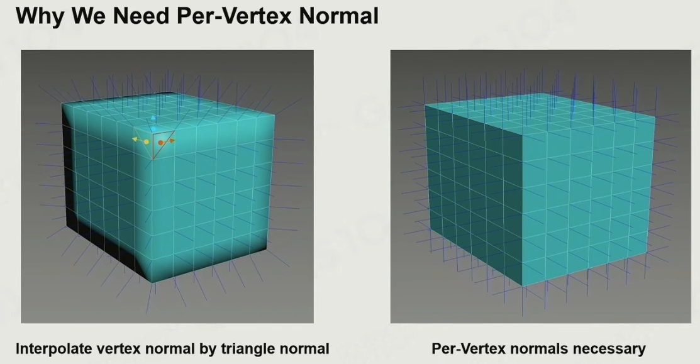

**材质**：对于材质数据，我们需要定义常见材质的渲染模型。在现代游戏引擎中往往还会集成大量的PBR材质以渲染出更加逼真的图像。

材质定义物体的外观，以及物体如何和光线作用。 

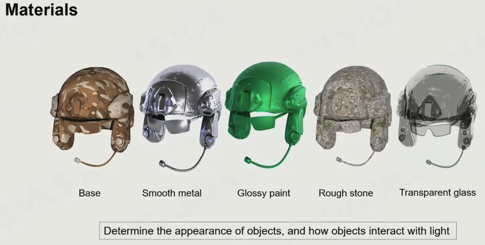

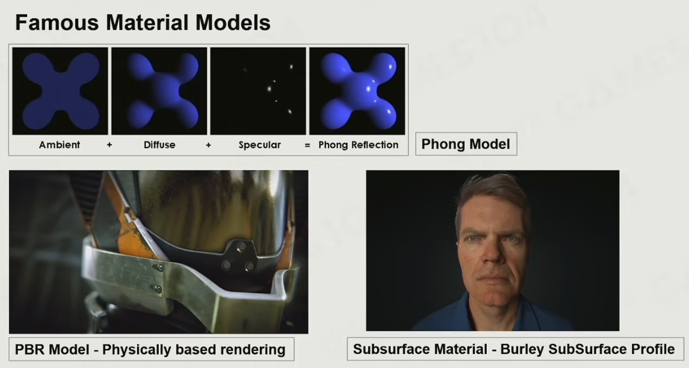

**纹理**：除此之外，我们还需要考虑材质的纹理。纹理对于材质的定义以及最终渲染呈现的效果起着至关重要的作用。

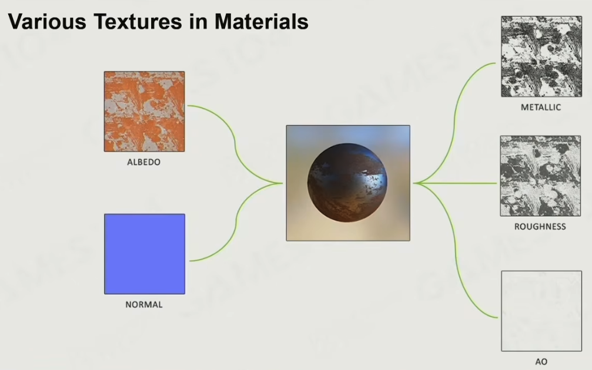

**shader**：当然我们还需要考虑shader，在进行渲染时需要把编译好的shader连同数据一起提交的GPU上进行计算。

一般软件开发中会区分资产（数据）和程序（源码），但shader是一个很神奇的存在。shader即是源码，又是数据。

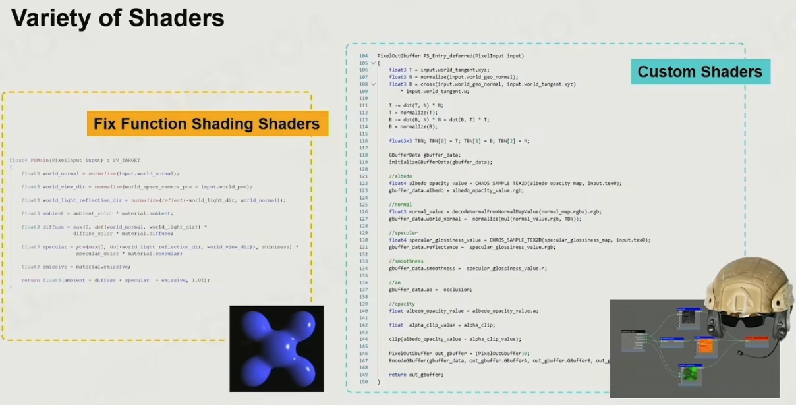

## Render Objects in Engine
**MVP**：接下来我们就可以对GO进行渲染了。根据光栅化的渲染管线，我们首先利用MVP变换（还有透视除法、viewport transformation）把模型转换到屏幕空间上，然后把渲染数据提交给GPU就可以实现渲染的过程。

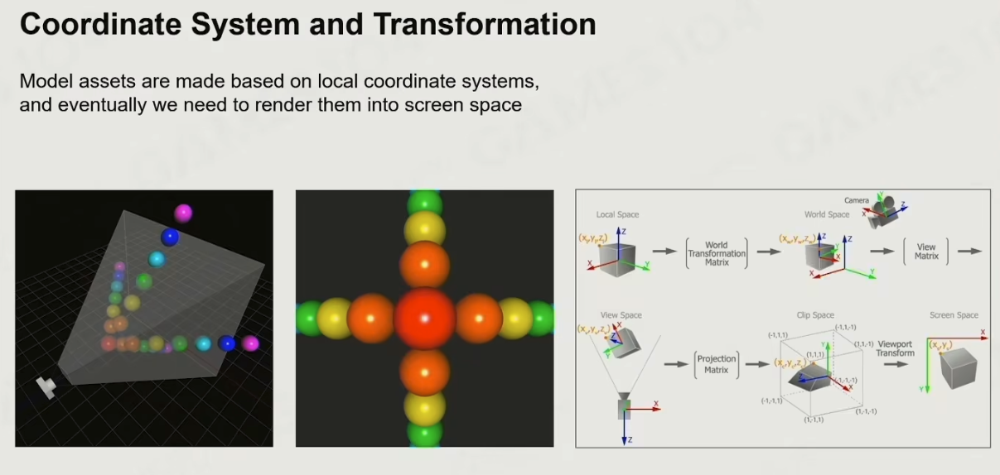

**Submesh**：把物体按材质做拆分。然而这样的渲染过程往往不会得到令人满意的渲染结果。实际工程中我们往往需要把一个完整的网格拆分成不同的submesh，顶点数据存在父mesh中而submesh中只存索引，每个submesh有着自己的材质和纹理而整个网格共享一套顶点和面片信息。这样利用submesh的概念就可以绘制出更加逼真的图像。

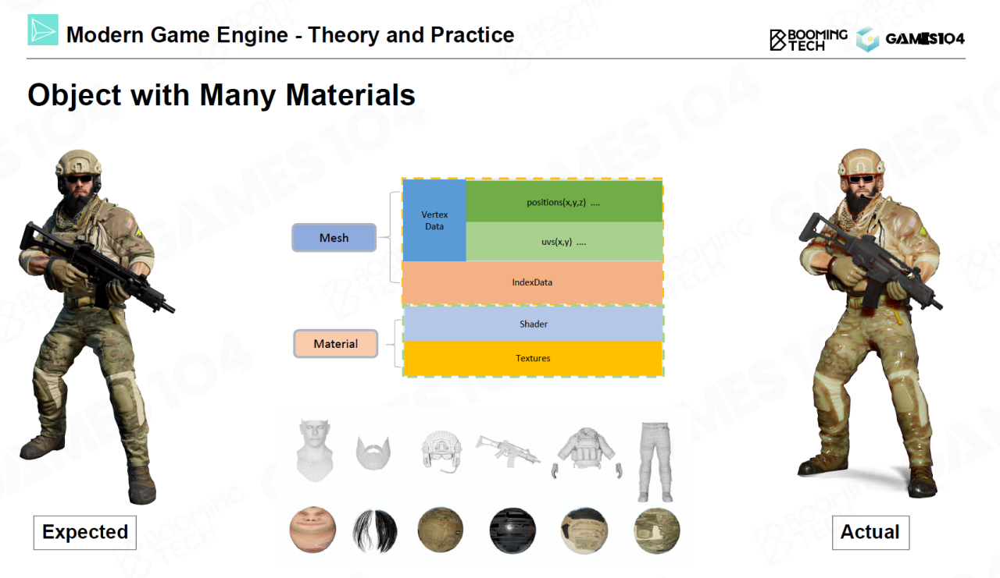

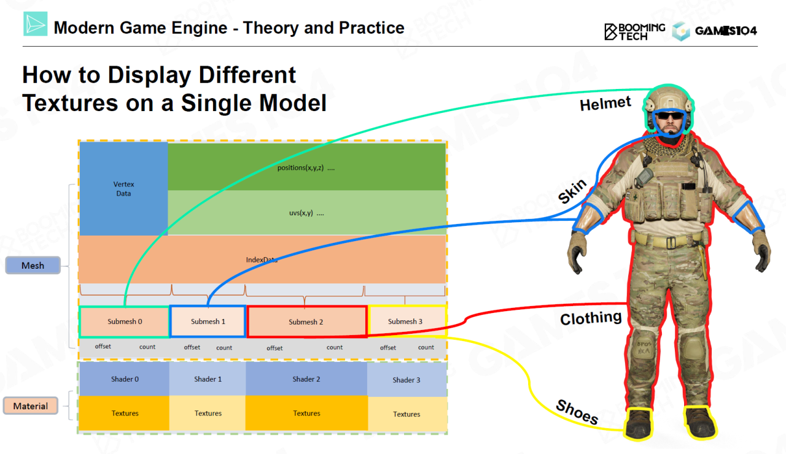

**资源池**：相同的材质/纹理归类到一起做管理。当我们需要绘制大量GO时，如果每个GO都使用单独的网格信息则会造成存储和计算资源上的浪费，实际上很多GO和submesh都共享了相同的材质、纹理甚至是shader。因此为了更高效地利用计算资源人们还提出了**资源池(resource pool)**的概念。在资源池中我们把所有的网格、材质、shader等资源分别集中到一起，在进行实际渲染时对每个对象分别去寻找对应的数据和资源即可。

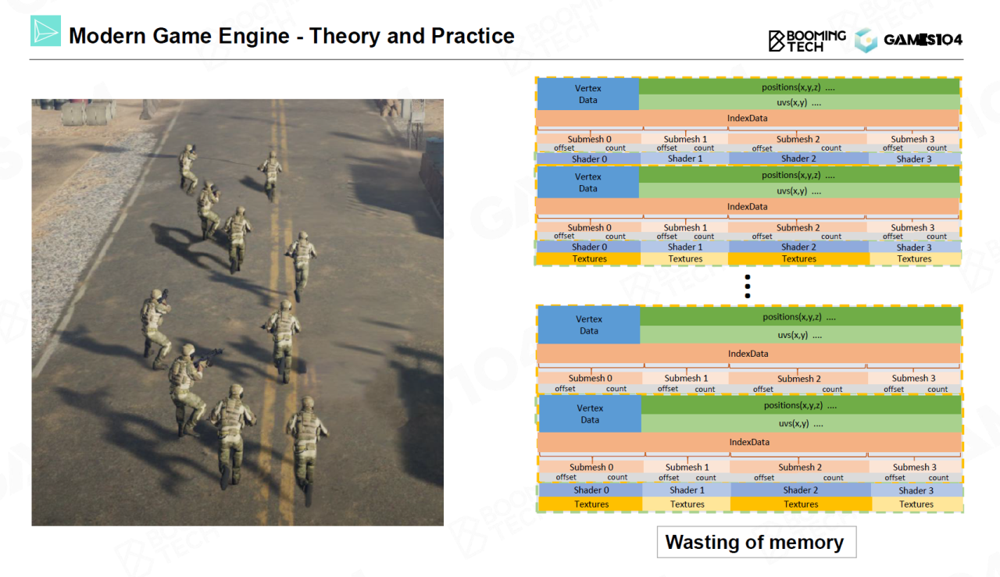

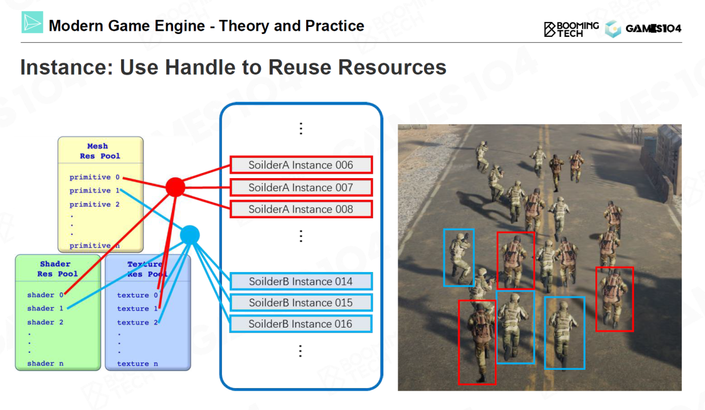

**材质排序**：为了更高效地利用GPU，我们还可以把场景中的submesh按照材质进行排序。这样可以保证渲染时具有相同材质的submesh会放在一起进行绘制，从而降低GPU切换资源的开销。

设置一次材质，用这个材质绘制多个subMesh，以减少在GPU中替换材质资源的次数

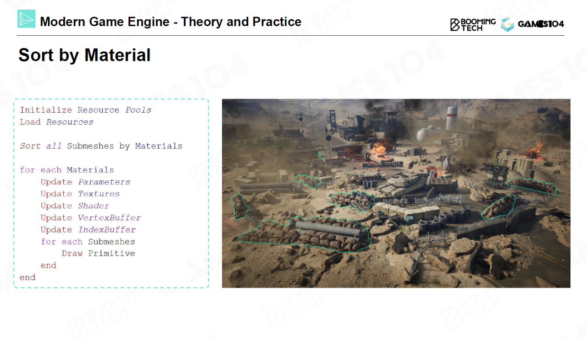

**GPU batch rendering（instanced rendering）**：在很多游戏场景中还存在着大量相似甚至是完全相同的GO。对于这种情况可以通过**GPU batch rendering**的方法把这些GO组织在一起，然后把同一batch中的对象一次性绘制出来，进一步提升场景渲染的效率。

绘制草树等大量相同物体时有用。

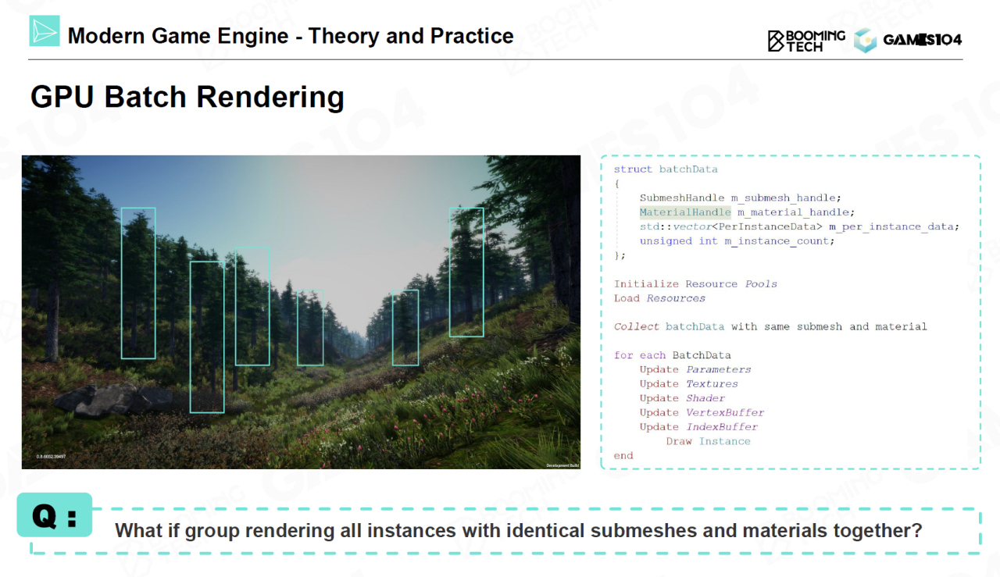

## Visibility Culling
**可见性剔除(visibility culling)：**在游戏场景中一种常见的情况是整个场景内有大量的可渲染对象，但在玩家视野内则只有有限数量的单位。在这种情况下如果直接把场景中所有的可渲染对象送入渲染管线无疑会造成计算资源的浪费。因此**可见性剔除(visibility culling)**是渲染系统中非常实用的技术，它的思想是在送入渲染管线前首先判断场景中的每个可渲染对象是否在相机视野中，然后只对视野范围内的对象进行渲染。

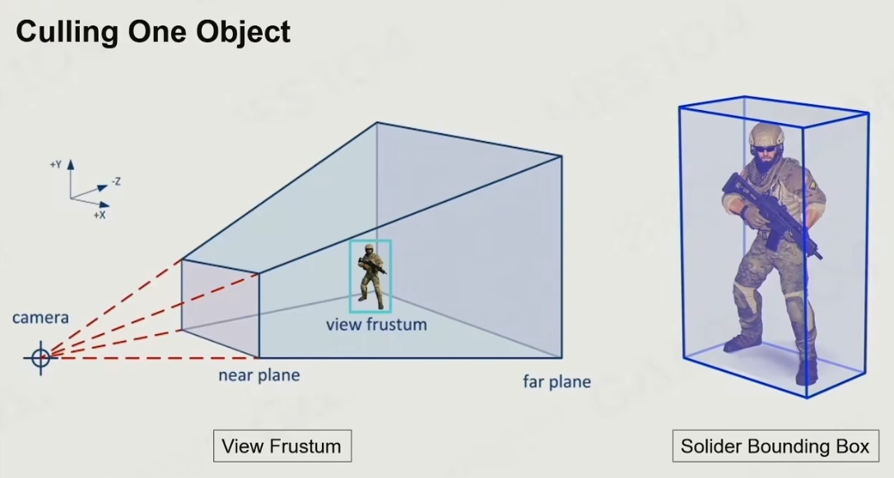

**Bounding Box，降低visibility cullilng的计算成本**: 根据包围盒做可见性剔除

1. Shpere bounding box
2. axis-align bounding box
3. object bounding box
4.  8-DOP
5. Contex Hull

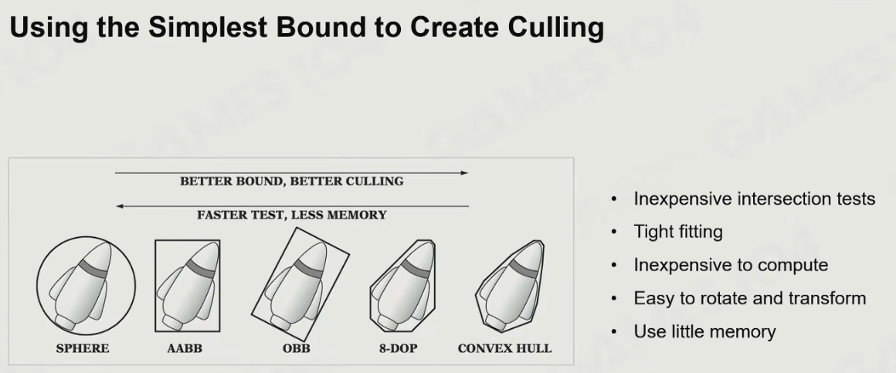

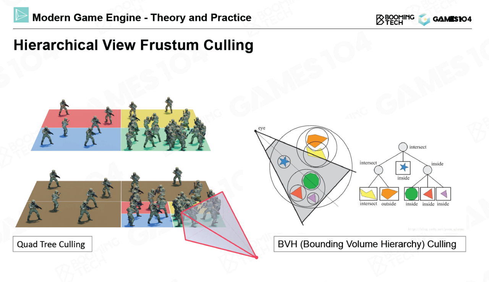

**加速visibility culling 方法1：BVH树**：在现代游戏引擎中，BVH是应用最为广泛的利用bounding box来管理场景物体的数据结构。BVH的一大特点是它可以在场景中物体发生运动时通过对节点的操作来动态地修改树的结构，这样无需每次都重新建树从而大大提高了计算效率。**支持插入删除操作**。

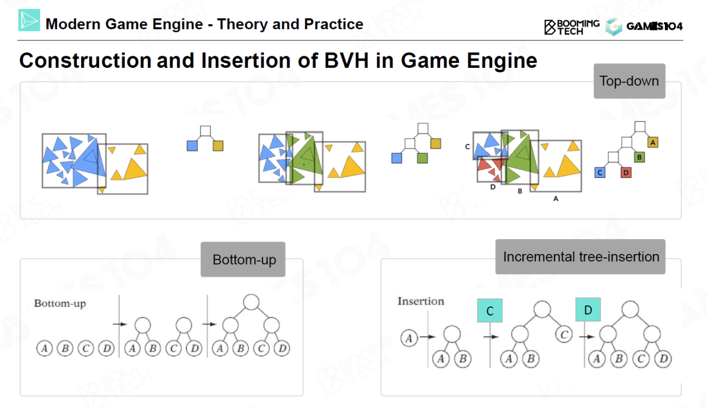

**加速visibility culling 方法2：PVS(potential visibility set) **：它的思想是把整个场景划分为若干个相对独立的区域，不同区域之间通过portal进行连接。当玩家在场景中进行游戏时只会在某个区域中，而这个区域内的可见性是可以事先确定的，这样就可以利用PVS来进一步剔除无需渲染的对象。

PVS：在一个房间时，通过门可以看到的所有房间的集合

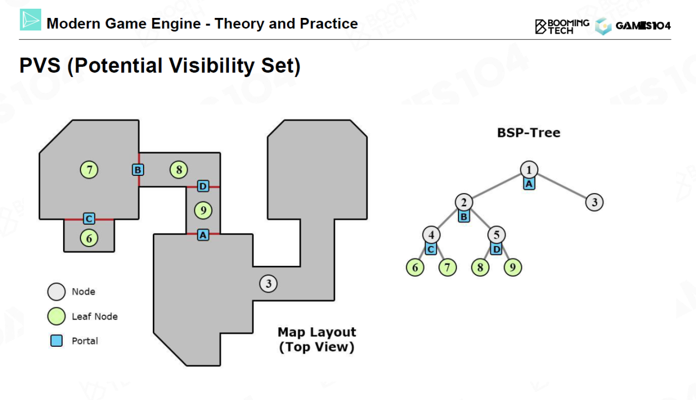

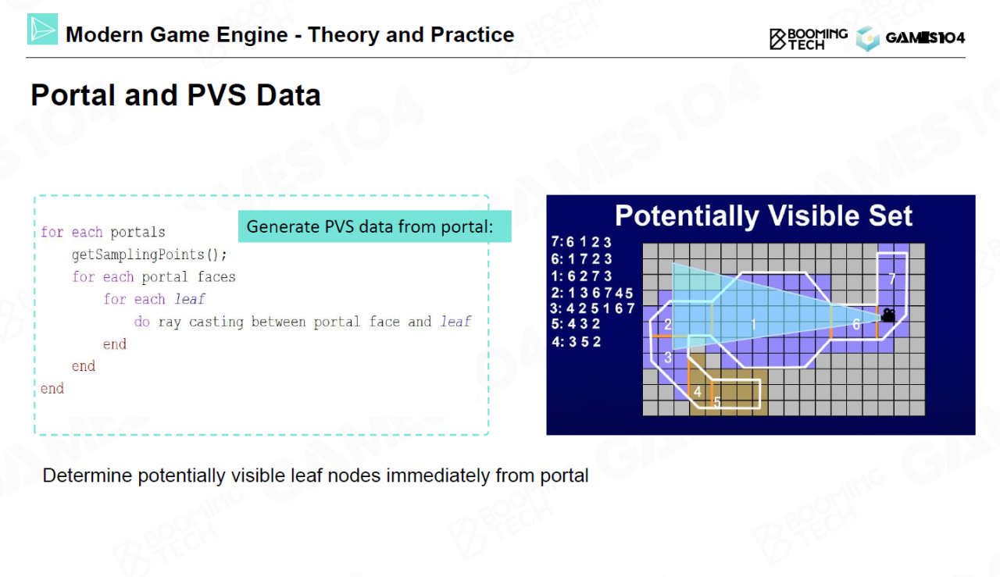

当然随着设备计算能力的进步，PVS的应用在现代游戏中已经没有那么多了，但是PVS的思想仍然是值得我们去学习的。虽然在visibility上面已经不怎么用了，但是PVS的思想在场景管理和资源调度中有着丰富的应用。

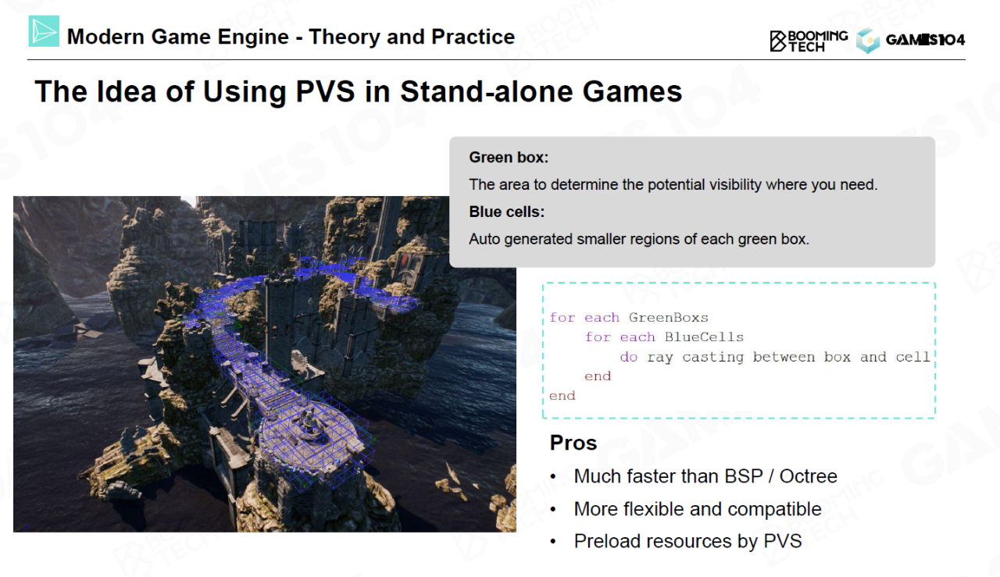

**加速visibility culling 方法3：GPU based culling**：利用现代GPU的强大计算性能我们可以通过查询的方式直接获取每个对象的可见性并以此剔除掉不可见的物体，这样的技术称为**GPU based culling**。

比如：在GPU做occlusion query

**能利用硬件做的，一定要利用硬件做完！**

显卡有个 early-z 的概念：先利用最简单的pipeline把场景渲染一遍，记录深度；第二遍真正渲染时，利用深度值来discard部分fragment。

early-z和defered shading比更简单。deferred shading在geometry pass中，会在G-buffer记录position/normal/color信息。deferred shading将几何渲染和光照计算分开，在复杂光照下的场景渲染有优势。

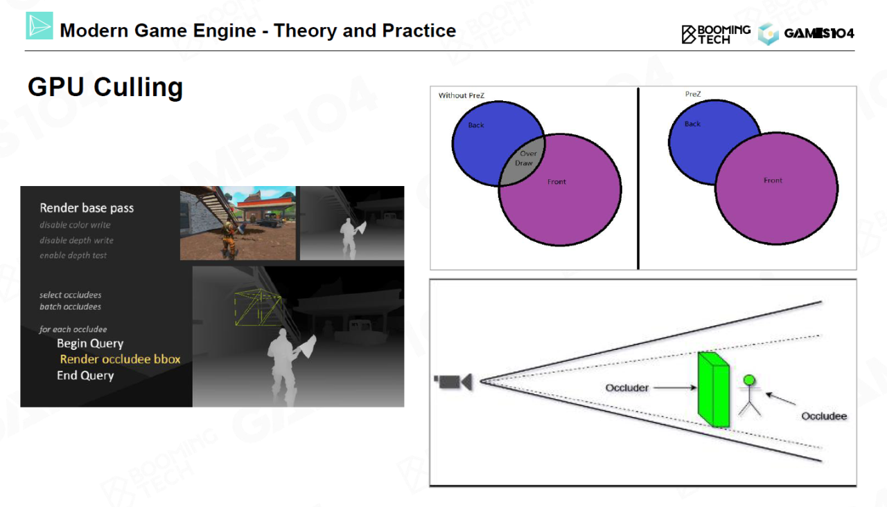

## Texture Compression
Renderable中一个很重要的组成部分就是Texture

通常情况下纹理会通过一张二维贴图进行表示，并且在计算机中使用JPG或是PNG这样的压缩格式进行存储。

而在游戏引擎中则无法使用这些常用的图像压缩格式，这主要是因为JPG这样的压缩算法**不支持快速的随机图像坐标访问**，而且它们往往具有过大的计算复杂度无法进行**实时的压缩与解压**。

texture compression VS image compresion

+ Random access: 随机访问
+ Decode speed / Encode speed：计算复杂度低，支持实时压缩和解压
+ Compression rate and visual quality: 低图像质量。有损压缩。
+ Bad compression rates: 低压缩比

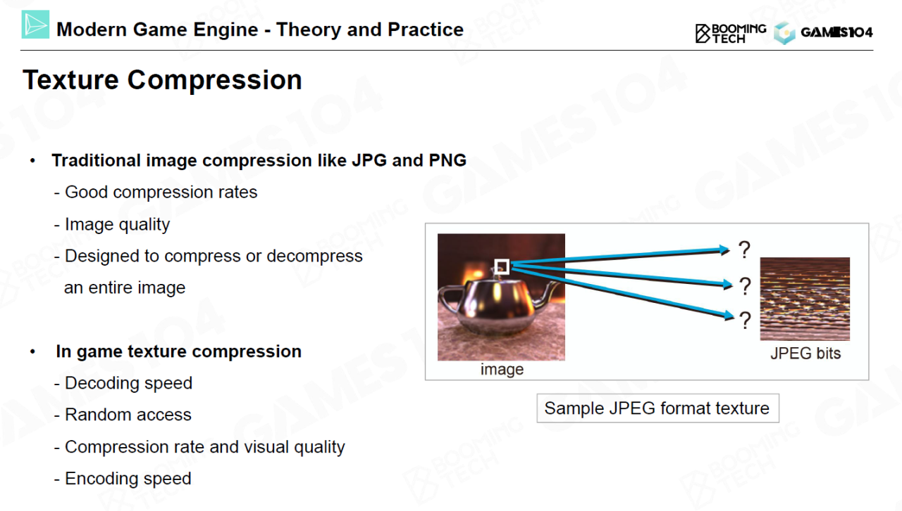

在渲染系统中最常用的纹理压缩算法是**block compression**，它的思想是统计每个4×4区域内纹理图像最大和最小值然后通过插值的方法进行查询。

+ PC端常用 BC7 格式，4*4 分块
    - 可以在运行中压缩解压缩
+ 移动端常用 ASTC 格式，不是 4*4 分块，可以是任意形状。
    - 优点：压缩效果最好
    - 缺点：不能在运行中压缩解压缩

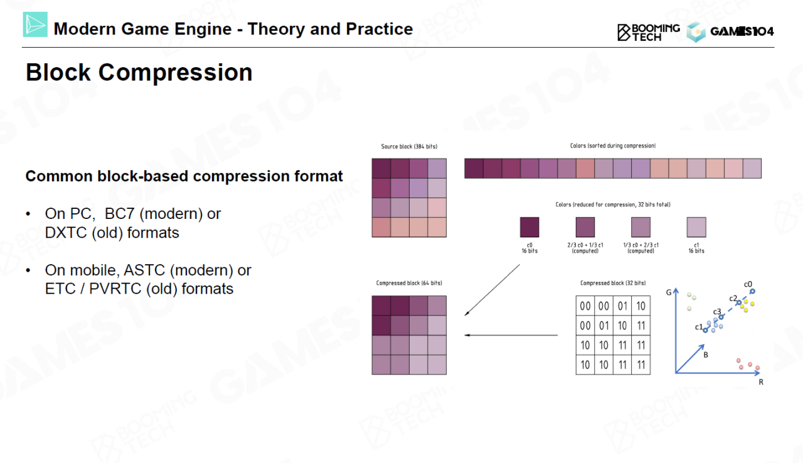

## Authoring Tools of Modeling
游戏中的模型是怎么获得的呢？最经典的建模方法是使用3ds Max、Maya、blender等建模软件来绘制3D模型。

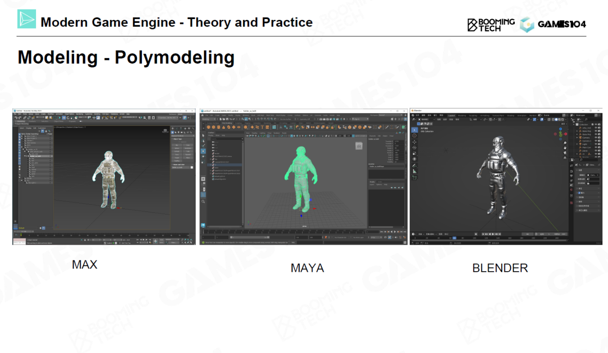

近几年基于雕刻的建模软件也获得了非常多的应用。

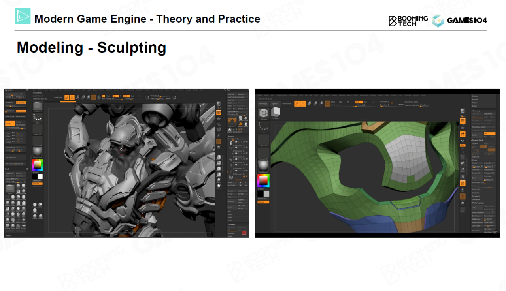

随着人工智能和三维重建技术的发展，我们甚至可以从实物通过扫描的方法来重建出非常精细的网格。

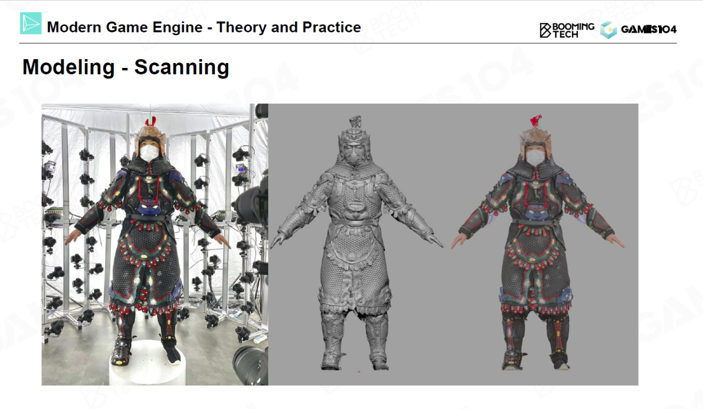

除此之外，还有一些自动化建模工具，通过算法和规则来自动生成地形等场景的网格。

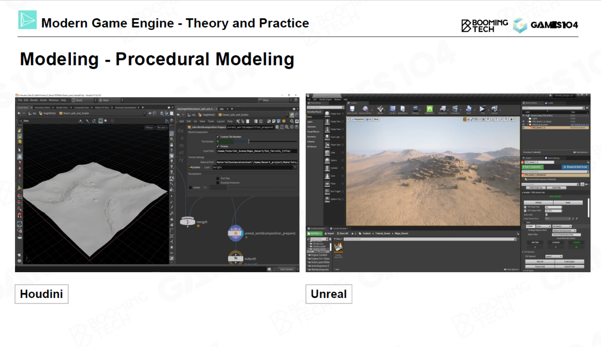

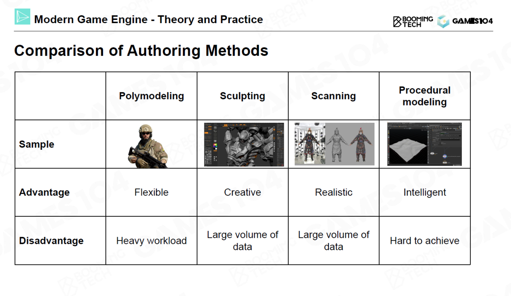

## Cluster-Based Mesh Pipeline
现在的游戏pipeline，在往哪个方向发展？

本节课最后讨论了cluster-based mesh shader这一前沿技术的基本思想。随着现代GPU计算能力的提高以及人们对于画质需求的不断增长，在3A大作中的模型往往都具有百万级甚至千万级的网格。

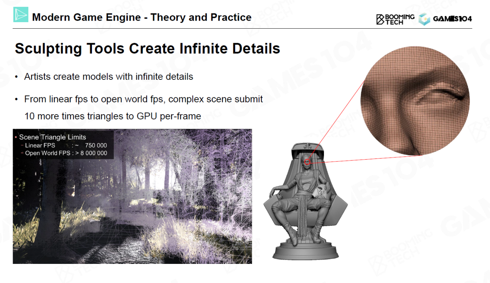

为了渲染出具有如此高精度的网格就需要使用mesh shader相关的技术。mesh shader的核心思想是把网格上的一小块区域视为一个meshlet，每个meshlet都具有固定数量的三角形。render primitive变成了一个meshlet，一个meshlet是由一个数据凭空生成的大量几何。

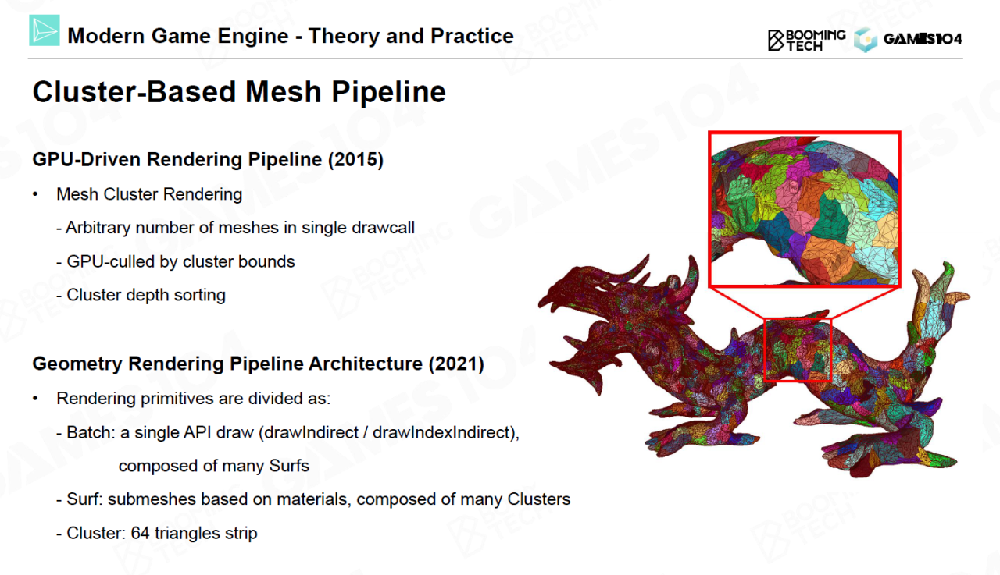

在进行渲染时可以通过实时生成的方法即时生成meshlet中的网格。

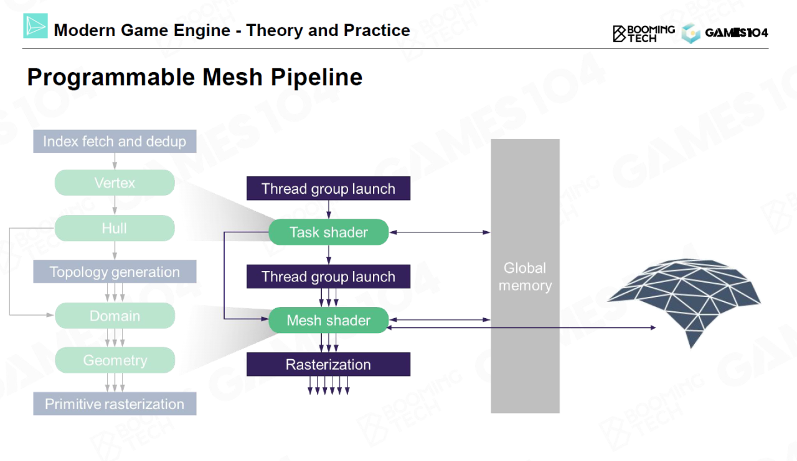

mesh shader可以生成几乎无限的细节，而且可以根据相机和物体的相对位置关系动态地调整网格的精度。类似LOD，远的时候meshlet中的网格数量少，近的时候meshlet中的网格多。

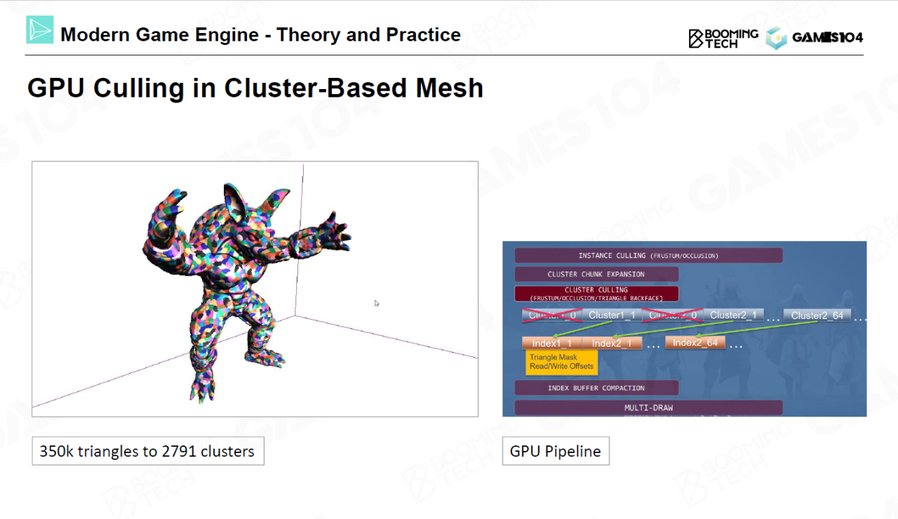

虚幻5中的 **Nanite** 技术可以认为是更加成熟的mesh shader像素级的网格密度。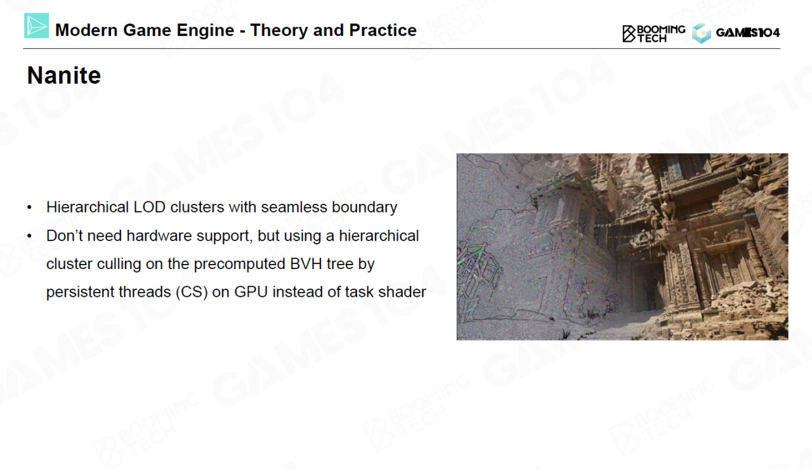

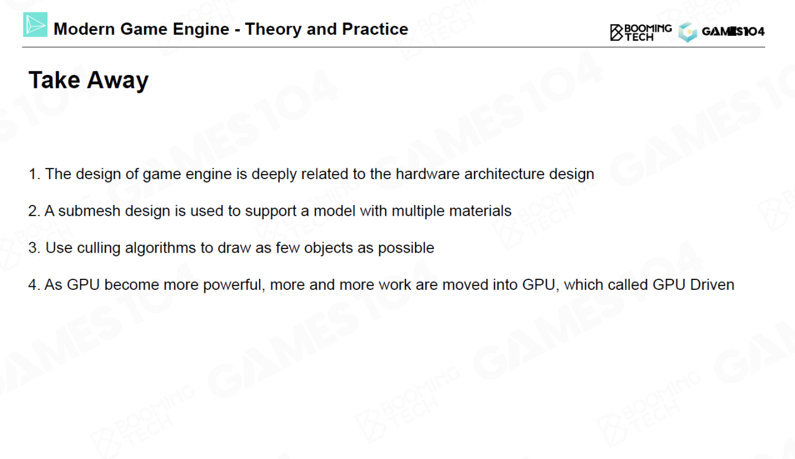

1. 游戏引擎的绘制系统是一个工程科学，深度依赖于你对现代图形硬件的理解。需要理解GPU的架构，明白性能卡点。
2. Submesh可以支持一个模型，多种材质。前沿的技术还有 mesh shader 和 Nanite。
3. Culling algrithms
4. GPU Driven 很重要，尽量把东西从CPU扔到GPU。这是一个趋势。现在很多动画系统也扔到显卡来做了。

## Pilot
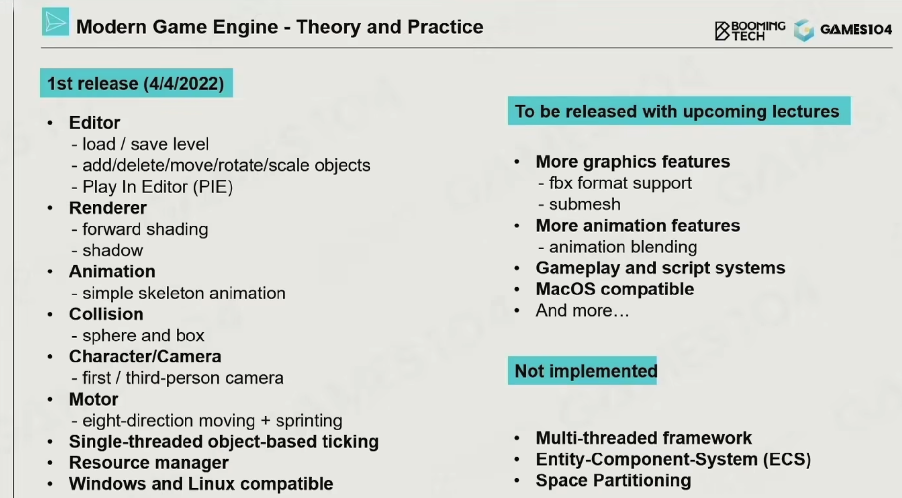

## Reference
+ [Lecture 04：Rendering on Game Engine](https://www.bilibili.com/video/BV14r4y1p7tt/?spm_id_from=333.788)
+ [GAMES104课程笔记04-Rendering on Game Engine - Bo’s Blog](https://peng00bo00.github.io/2022/04/06/GAMES104-NOTES-04.html)

> 更新: 2024-03-04 12:21:06  
> 原文: <https://www.yuque.com/viruspc/el3mi0/kqmr9cukw3i04l6k>