# 如何构建游戏世界

- [Summary](#summary)
- [How to Describe the World?](#how-to-describe-the-world)
  * [Game Object](#game-object)
  * [Components](#components)
- [How to Make the World Alive?](#how-to-make-the-world-alive)
  * [Tick](#tick)

---

## Summary
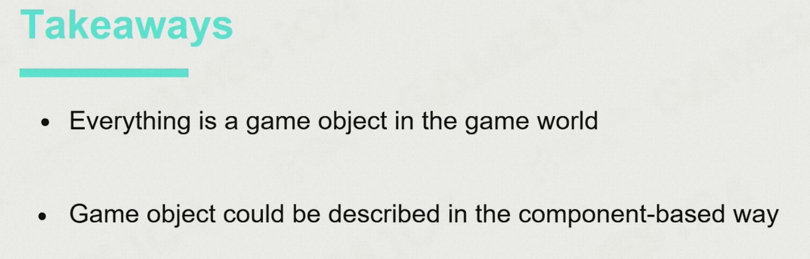

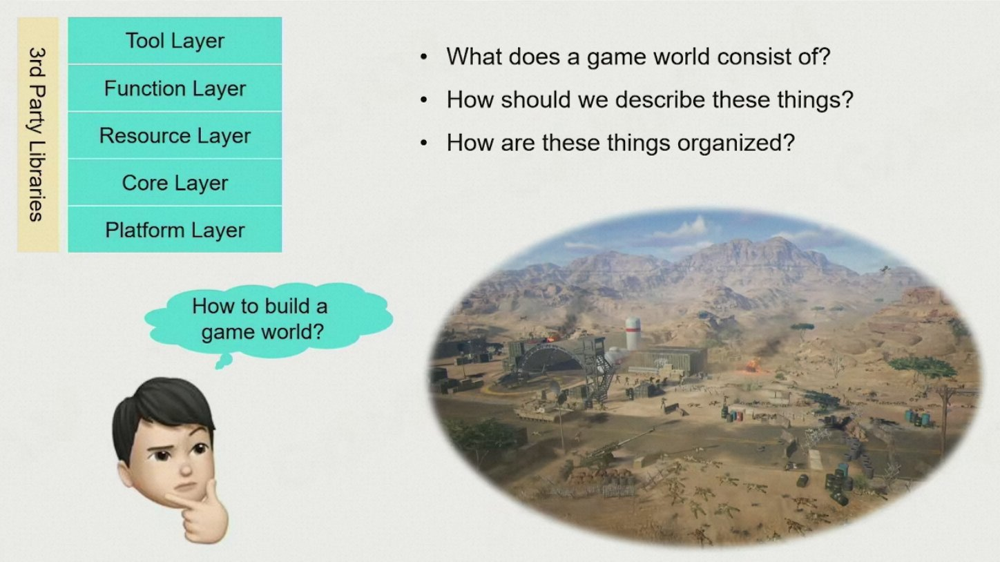

在上一节课中我们介绍了现代游戏引擎的分层架构，而在本节课中我们会开始构造整个游戏世界。

## How to Describe the World?
### Game Object 
首先我们要考虑游戏世界是由哪些组件构成的。以《战地2042》为例：

+ 游戏中包含了大量的可互动对象包括坦克、无人机、火炮、士兵等。
+ 除此之外，游戏中还包含了很多静态的对象比如说各种建筑物。
+ 这些动态和静态的游戏对象都依附于游戏场景，一般来说场景包括天空、植被以及地形等。
+ 在玩家看不到的地方还有一些其它类型的游戏对象，它们为整个玩法提供支持。

总结一下，游戏世界是由各种各样的游戏对象(game object, GO)组成的。

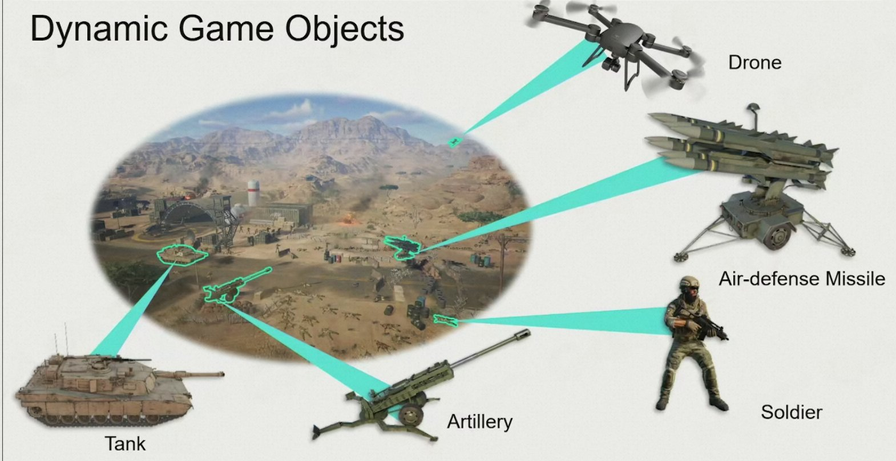

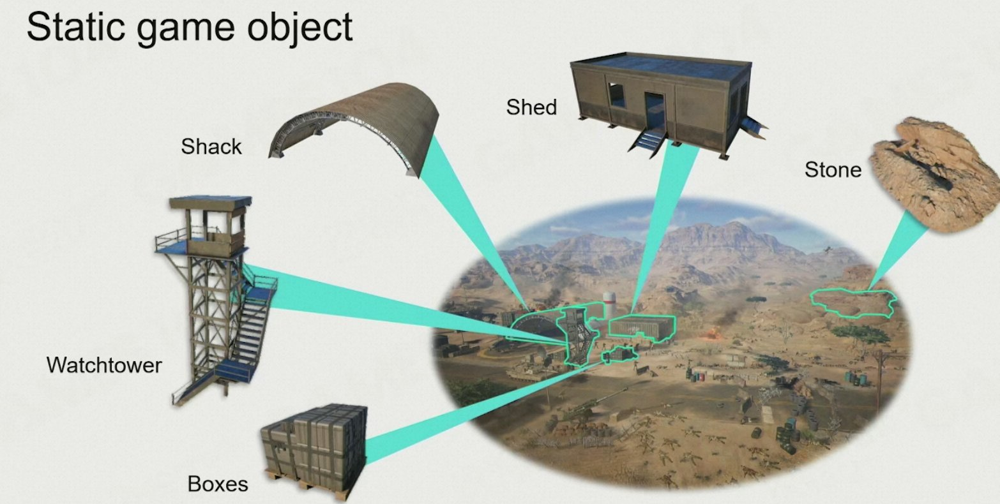

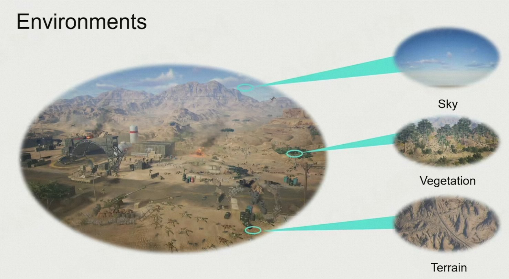  
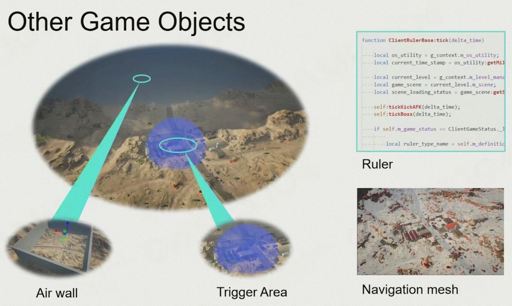

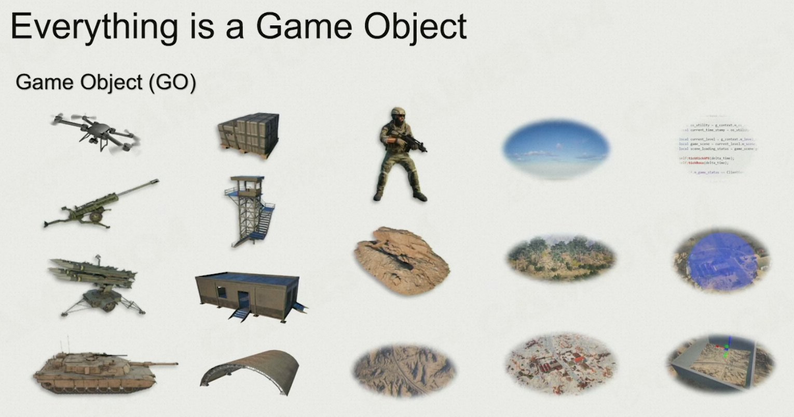

### Components
那么如何描述一个游戏对象呢？最直观的方法是使用面向对象编程的思路把GO划分为**属性**和**行为**。同时，不同GO之间的依赖关系还可以通过继承的方式来加以描述。

但在实践中人们发现GO之间的关系往往是非常复杂的，仅通过继承的方式无法完整地描述不同对象之间的关系。因此在现代游戏引擎中一般是通过**组件化(components)**的方式来描述一个对象，这样每个GO都可以拆分成若干个相互独立的组件。以无人机为例，我们可以把任意形式的无人机拆分成Transform、Motor、Model、AI等组件，然后单独实现每个组件的功能。

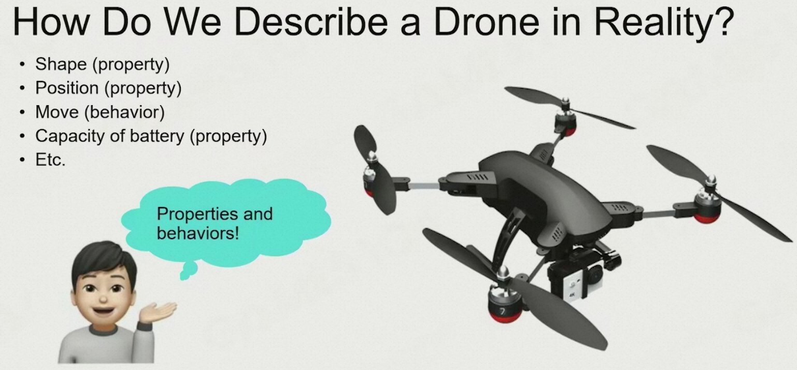

以无人机为例，我们可以把任意形式的无人机拆分成Transform、Motor、Model、AI等组件，然后单独实现每个组件的功能。这样当我们想要取定义新的无人机类型时只需要替换相应的组件即可。

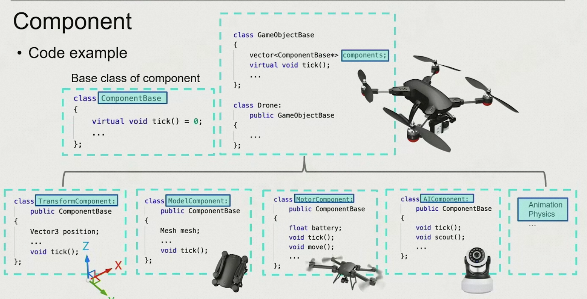

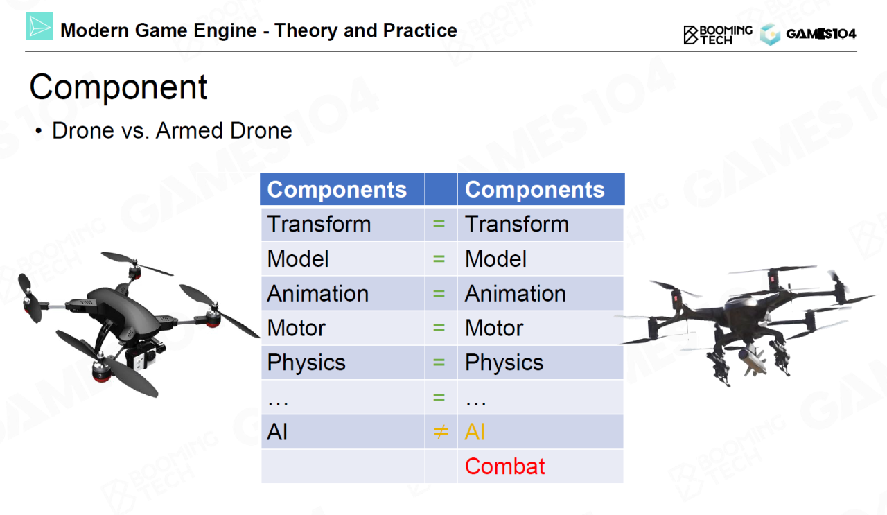

目前市面上常见的商业游戏引擎，包括Unity和虚幻等都使用了组件化的设计思想。我们在设计自己的游戏引擎时也应遵循这样的设计理念。

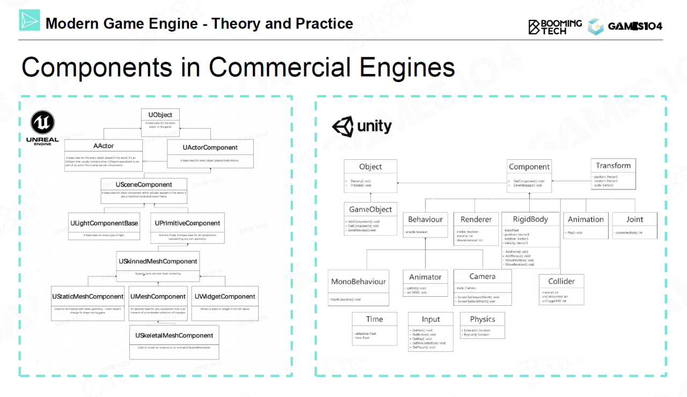

UE中的UObject不是GO，比GO更低级。

## How to Make the World Alive?
### Tick
接下来我们考虑如何让整个游戏世界动起来。回忆我们在上节课介绍过的tick机制，我们可以在每个时钟周期中分别对每个GO调用tick()函数，这种方式称为object-based tick。（整个世界tick时，每个object tick一遍）

另一种调用tick()函数的方式是以组件作为基本单位，每个时钟周期内我们依次tick不同GO的同一类组件。这种方式称为component-based tick。（整个世界tick时，先把object分组，再按分组顺序把每个object tick一遍。有点像所有人先动头，再动手，再动脚）

component-based tick相对要反直觉一点，但却有着更高的性能。component-based tick相当于把系统的tick()函数分解成流水线，这样可以提高系统的并行性并重复利用缓存。（读写存取效率更高？并且可以保证执行顺序？）

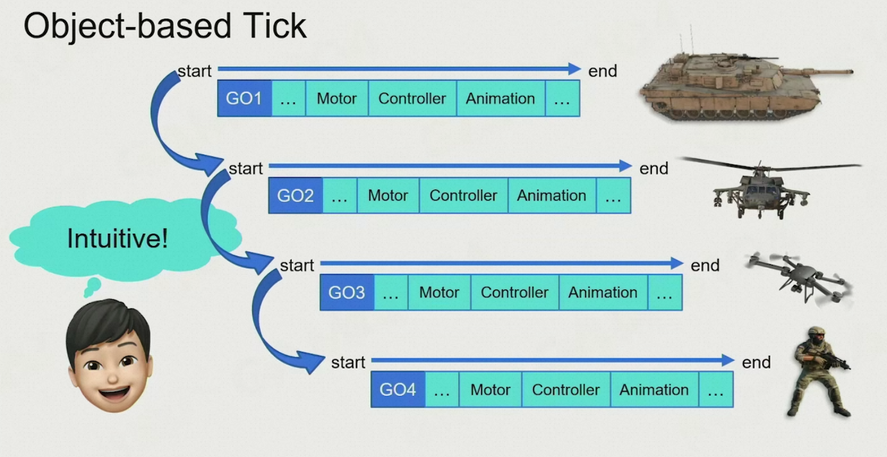

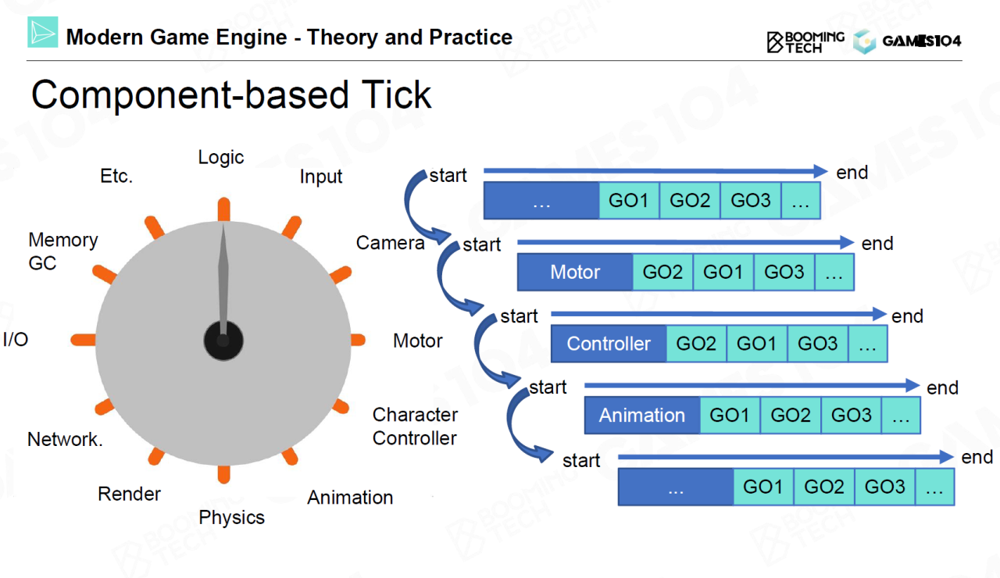

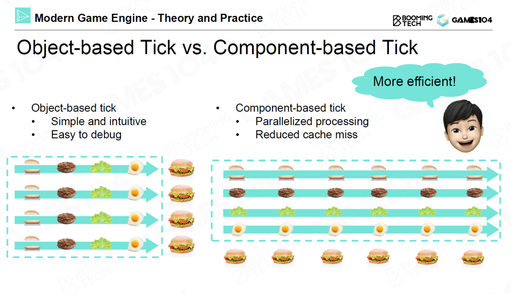

> 更新: 2023-11-27 16:32:14  
> 原文: <https://www.yuque.com/viruspc/el3mi0/vg808c89wdwu0c4y>