# 引擎架构分层

- [Summary](#summary)
- [A Glance Of Game Engine Layers](#a-glance-of-game-engine-layers)
  * [Tool Layer](#tool-layer)
  * [Function Layer](#function-layer)
  * [Resource Layer](#resource-layer)
  * [Core Layer](#core-layer)
  * [Platform Layer](#platform-layer)
  * [3rd Party Libraries](#3rd-party-libraries)
- [Resource](#resource)
  * [How to Access My Data](#how-to-access-my-data)
  * [Runtime Asset Manager](#runtime-asset-manager)
  * [Manage Asset Life Cycle](#manage-asset-life-cycle)
- [Function](#function)
  * [How to Make the World Alive](#how-to-make-the-world-alive)
  * [Dive into Ticks](#dive-into-ticks)
  * [Tick the Animation and Renderer](#tick-the-animation-and-renderer)
  * [Heavy-duty Hotchpotch](#heavy-duty-hotchpotch)
  * [Multi-Threading](#multi-threading)
- [Core](#core)
  * [Math Library](#math-library)
  * [Math Efficiency](#math-efficiency)
  * [Data Structure and Containers](#data-structure-and-containers)
  * [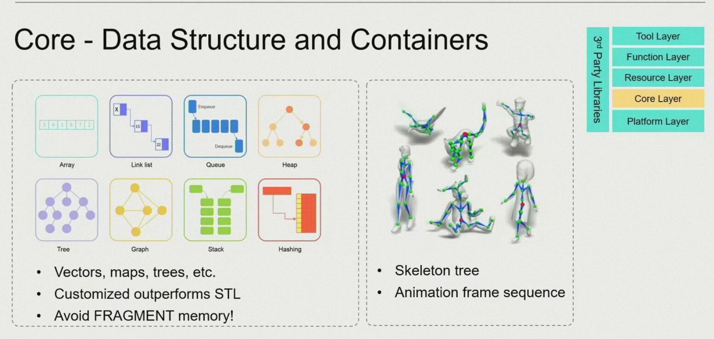](#1700739108987-56e66f34-e78d-40a2-bc5e-c36a0c1d5f31pngimgeio3cafzokzfxudd1700739108987-56e66f34-e78d-40a2-bc5e-c36a0c1d5f31-315090png)
  * [Msemory Management](#msemory-management)
  * [Foundation of Game Engine](#foundation-of-game-engine)
- [Platform](#platform)
  * [Target on Different Platform](#target-on-different-platform)
  * [Graphics API](#graphics-api)
  * [Hardware Architecture](#hardware-architecture)
- [Tool](#tool)
  * [Allow Anyone to Create Game](#allow-anyone-to-create-game)
  * [Digital Content Creation](#digital-content-creation)
- [Why Layered Architecture?](#why-layered-architecture)
- [Mini Engine - Pilot](#mini-engine---pilot)
- [QA](#qa)

---

## Summary

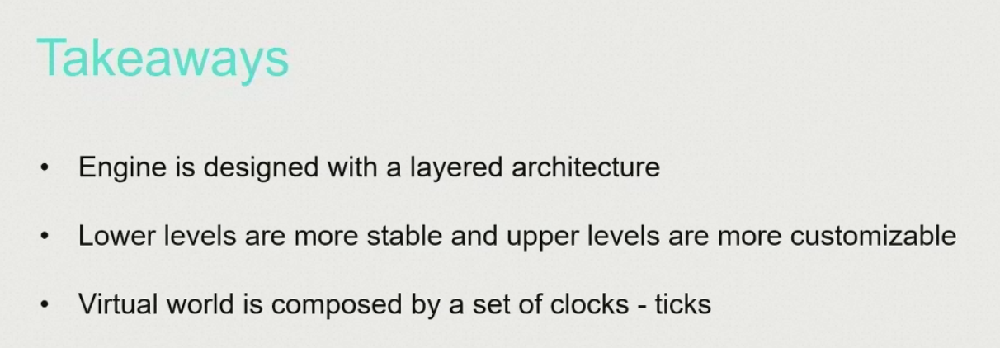

## A Glance Of Game Engine Layers

5+1

1. 工具层
2. 功能层
3. 资源层
4. 核心层
5. 平台层
6. 三方工具库

平台层、核心层、资源层，所有引擎都差不多。功能层和工具层，不同引擎差的比较大。

### Tool Layer

工具层

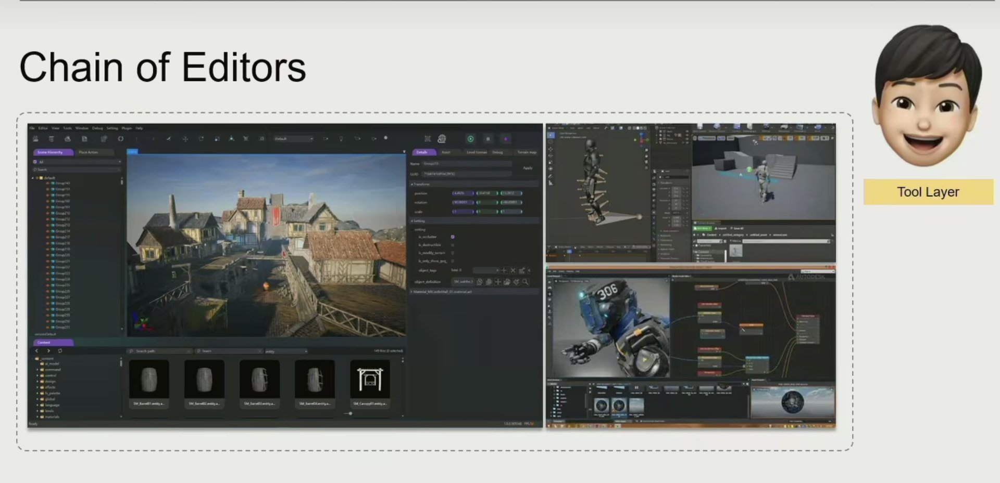

用户首先看到的东西

### Function Layer

功能层

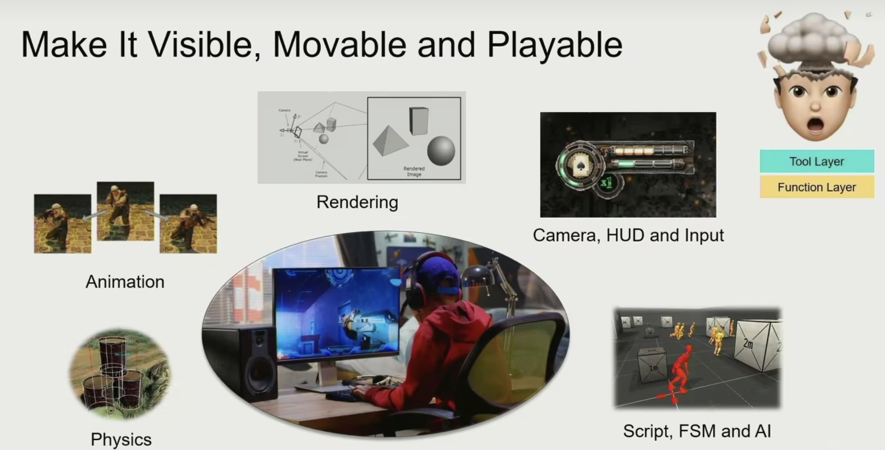

### Resource Layer

资源层

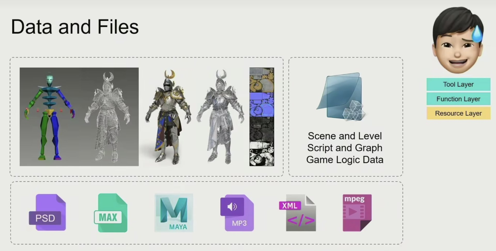

### Core Layer

核心层

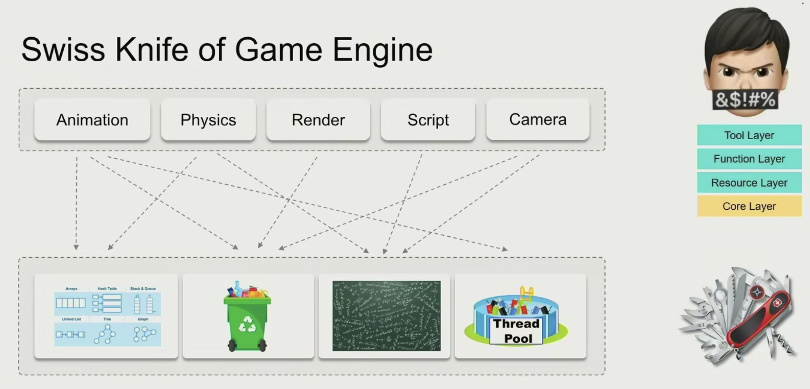

容器创建、内存分配、垃圾回收、线程管理、数学变换等

### Platform Layer

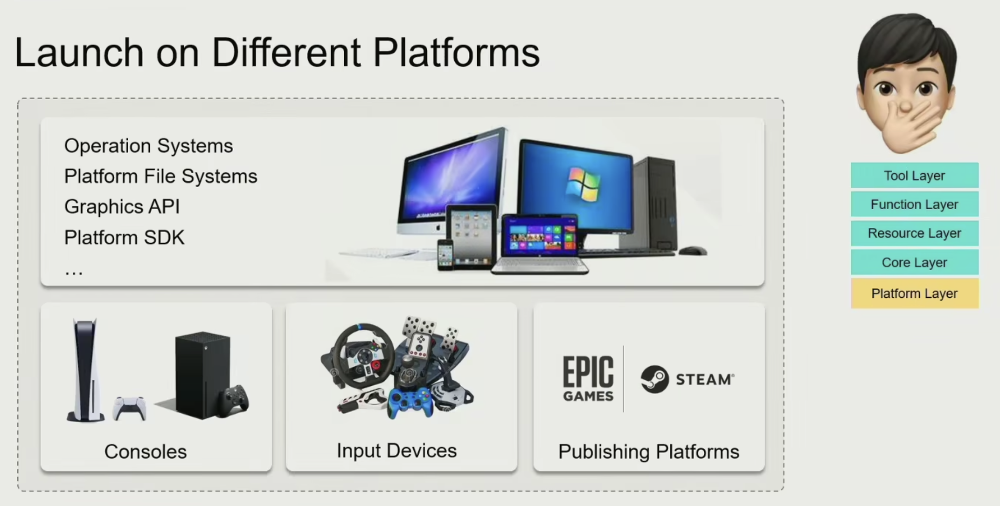

平台层

输入不同

### 3rd Party Libraries

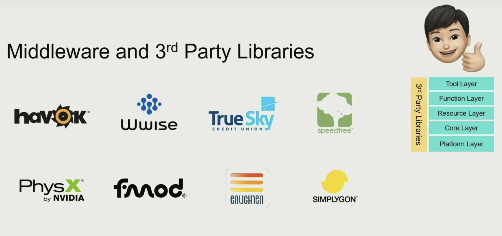

各种专业三方工具库

speedtree：快速画树

## Resource

### How to Access My Data

游戏中的每一个对象都包含不同类型的资产(asset)，比如说几何模型、纹理、声音、动画等，同时每种资产都可能包括不同的数据格式。

maya、max、psd 等文件是针对建模软件的，做得十分复杂且含有大量冗余信息，不能直接用。

importing：resource import 时会去掉这些冗余信息，变为可以在GPU中高效绘制的 assets （资产）。有种word转txt的感觉。

转为dts格式，按16bit把贴图排布好，可以直接扔到显卡中作为纹理。

现在游戏引擎中，最核心的是reference，数据之间的关联。通过资源层我们将游戏对象的资产组织起来并通过全局唯一标识符(Globally Unique Identifier, GUID)进行识别和管理。

### Runtime Asset Manager

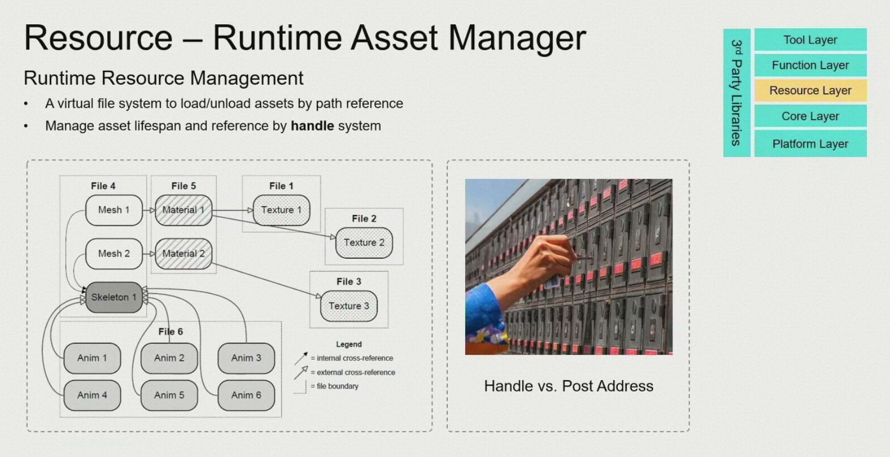

资源层和通常意义下的资源管理器的一大区别在于资源层需要对各种资产进行动态实时的管理，不同资产之间的通信和交互往往需要通过**handle**系统来进行实现。handle系统的细节我们留到后面的章节再详细介绍。

资源层和通常意义下的资源管理器的一大区别在于资源层需要对各种资产进行动态实时的管理，不同资产之间的通信和交互往往需要通过handle系统来进行实现。handle系统的细节我们留到后面的章节再详细介绍。

### Manage Asset Life Cycle

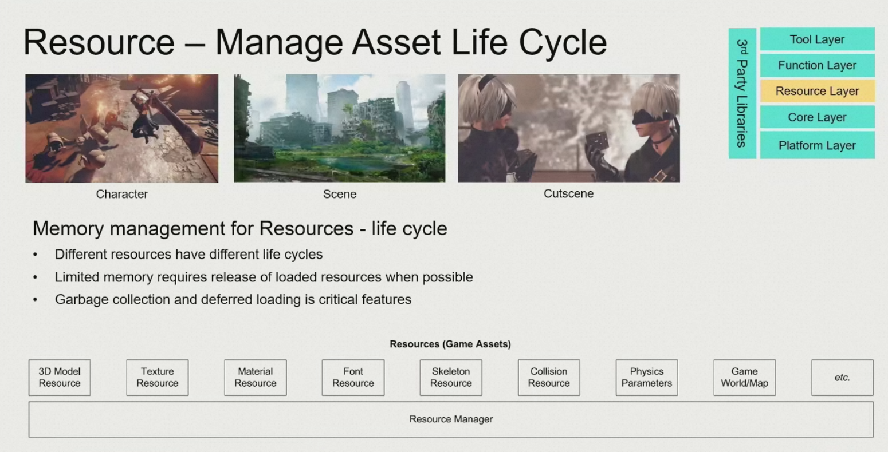

资源层的核心在于管理不同资产的生命周期(life cycle)。大型游戏需要实时地加载并回收系统资源，如何设计出高效的垃圾回收(garbage collection, GC)和动态加载机制对于提升系统的运行效率有着重要的价值。

GC的重要性：

1. 切换关卡：切换关卡时涉及大量资源的卸载，GC没做好这一帧就会卡住
2. 延迟加载：根据玩到哪来做加载

## Function

### How to Make the World Alive

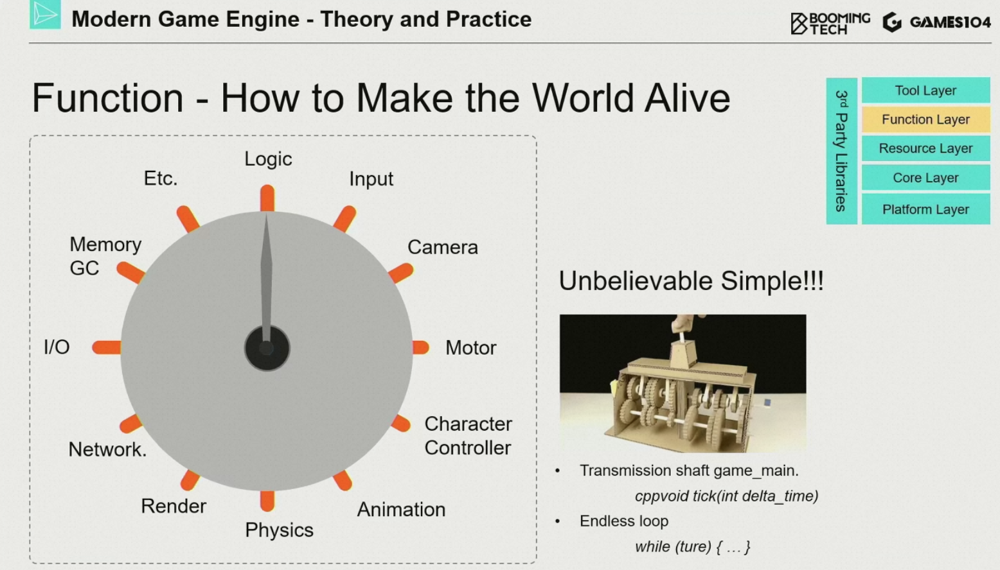

tick

功能层用来实现游戏的核心玩法。某种意义上讲功能层的作用类似于一个时钟(tick)用来控制整个游戏世界的运行，在每个时钟周期内功能层需要完成整个游戏系统的全部运算。

### Dive into Ticks

一般来说tick在运行时会依次调用两个函数：`tickLogic()`以及`tickRender()`来分别更新系统的状态和并把图像绘制到屏幕上。这里需要注意逻辑的计算是严格早于渲染的，编程时也要注意不要把它们混到一起。

* tickLogic: 模拟世界运行
* tickRender: 观察者观察世界

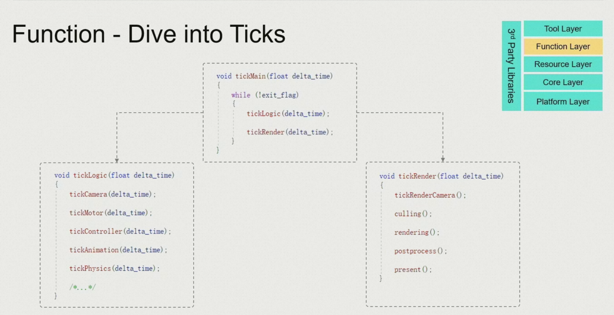

### Tick the Animation and Renderer

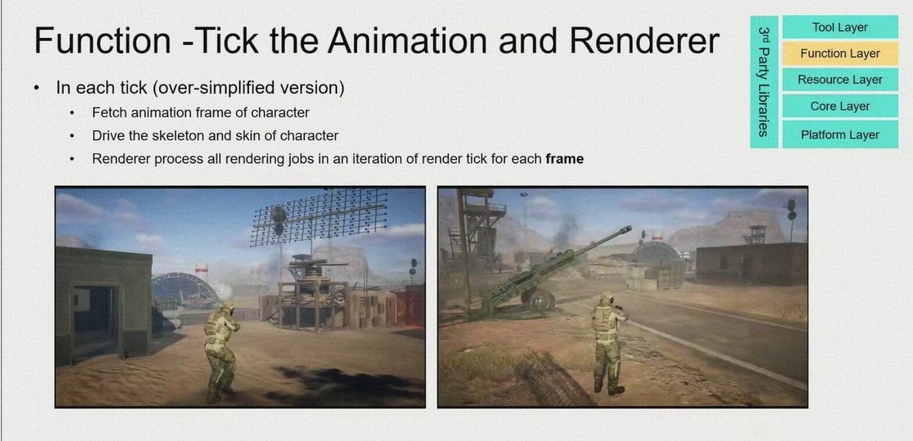

motion graph，整个动画的基础理论就是：人是靠视觉残留，感知一个连续世界的。

### Heavy-duty Hotchpotch

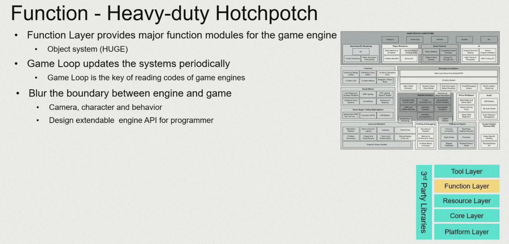

当然功能层的作用不仅限于逻辑以及渲染，实际上功能层会占据整个游戏引擎很大比例的内容并且和游戏自身的玩法密切相关。

功能层这一块内容是最多的，无所不有.

功能层在很多游戏中，会和具体的游戏关联到一起。比如：相机控制，是游戏引擎提供的功能，还是引擎只提供基础的相机绘制能力？第三人称射击游戏，可能有手持相机的摇晃感、镜头的模糊、拉远拉伸，和游戏密切相关。

所以，有时候功能不太好区分是放在引擎的功能层还是放在游戏代码本身。

### Multi-Threading

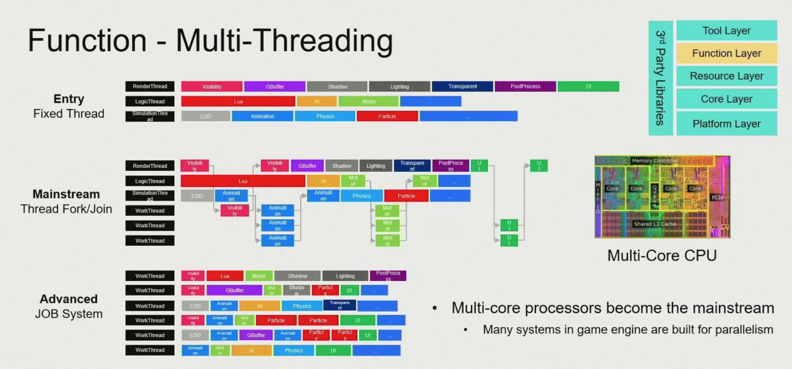

为了提升游戏引擎的计算效率现代游戏引擎往往会通过多核的方式来充分利用CPU计算的资源。未来的游戏引擎架构一定会向多核并行的方向上发展，因此在设计引擎时最好从多核的角度进行思考。当然如何管理计算任务之间的依赖仍然是一个难点。

## Core

### Math Library

功能层的各种数学计算需要核心层的代码进行支持。一般来说核心层不会涉及到过于复杂的数学知识，基础的线性代数就能满足绝大多数游戏引擎的需求。

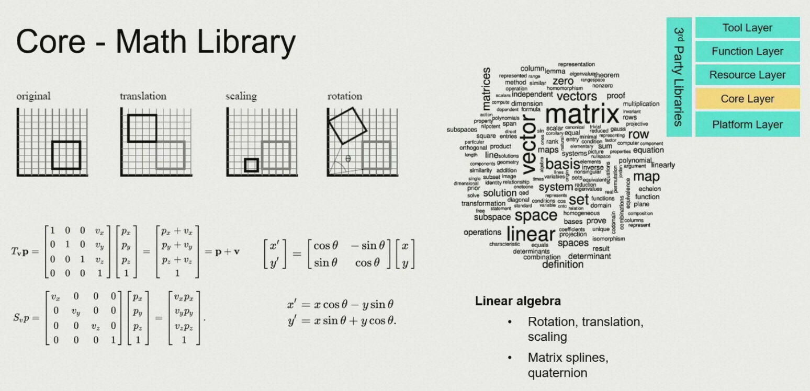

### Math Efficiency

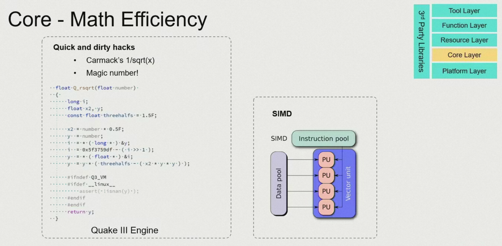

数学库之外核心层还需要包含各种常用数据结构的实现。需要说明的是即使是C++标准库stl，有些数据结构的实现仍然不是效率最高的，因此在核心层中需要根据需求重新实现一些常用的数据结构。

为什么标准的STL库性能做不到这么高效？没有关注内存使用效率。

### Data Structure and Containers

### 

总结一下，核心层是整个游戏引擎的基础，它要求非常高的代码质量而且在大多数情况下不要随意修改它。

为什么要自己实现一遍，不用c++ stl库？不可控。举个例子，c++ Vector 空间不够时，会直接乘以2，导致内存不可控。

### Msemory Management

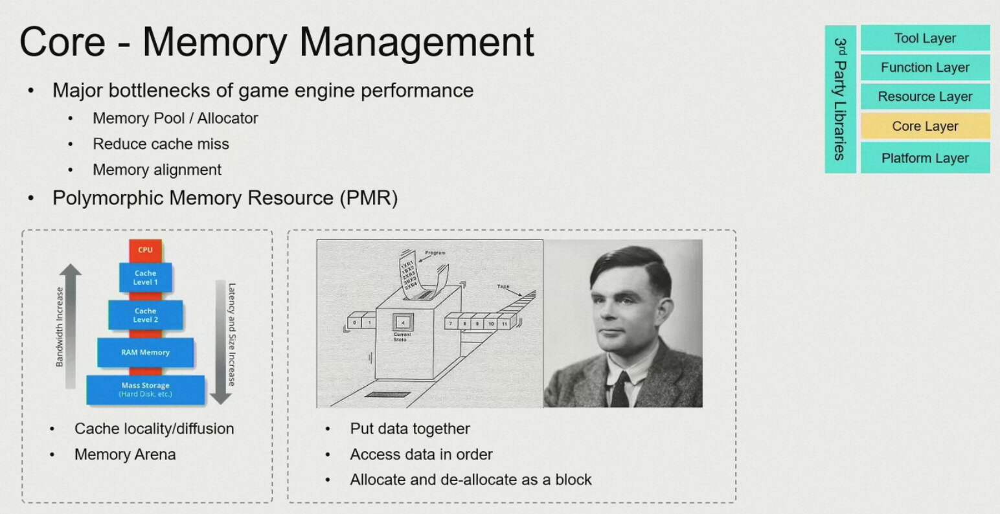

核心层最重要的功能是实现内存管理(memory management)，从这个角度看游戏引擎的功能非常类似于操作系统。在游戏运行时往往会直接申请一大片内存空间然后通过引擎而不是操作系统进行管理，这样可以提升系统的运行效率。

### Foundation of Game Engine

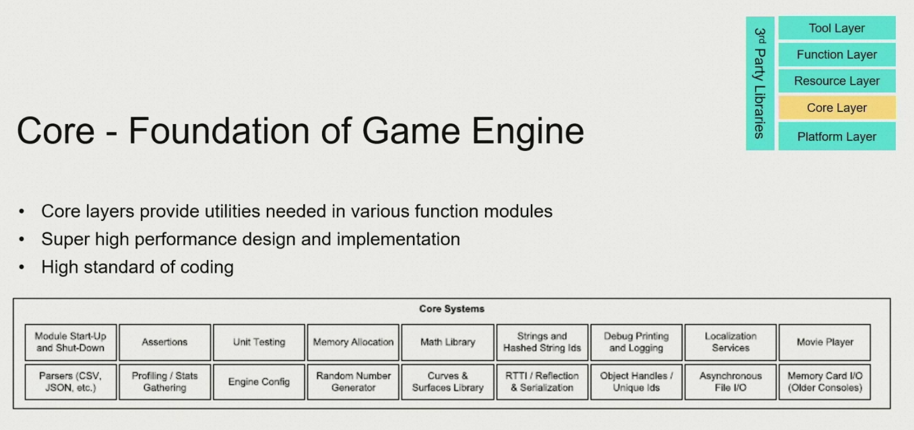

总结一下，核心层是整个游戏引擎的基础，它要求非常高的代码质量而且在大多数情况下不要随意修改它。

## Platform

### Target on Different Platform

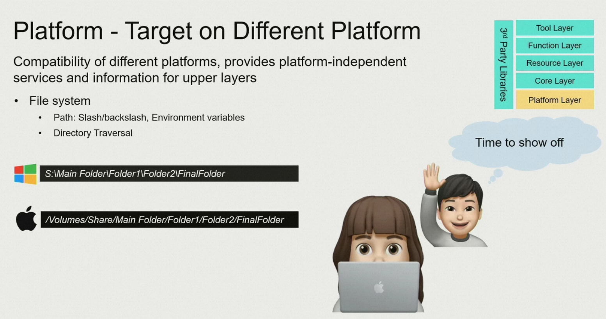

跨平台，平台无关性。为了克服不同平台对于代码的限制，我们需要平台层来提供对不同操作系统和硬件平台的支持。这样我们就只需要一套代码就可以在不同的平台上运行程序。

### Graphics API

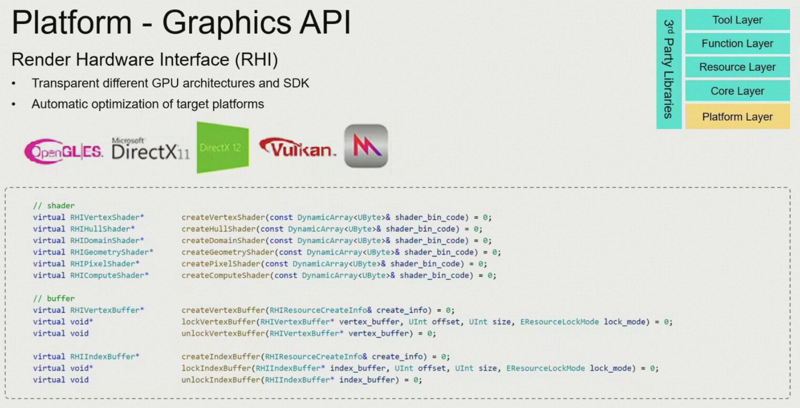

不同的平台往往使用了不同的图形接口，为了统一代码游戏引擎的平台层提供了RHI(render hardware interface)作为通用的图形编程API。RHI包含了统一套程序在不同图形API上的实现，这样上层的图形应用中就可以使用统一的一套API进行编程。

### Hardware Architecture

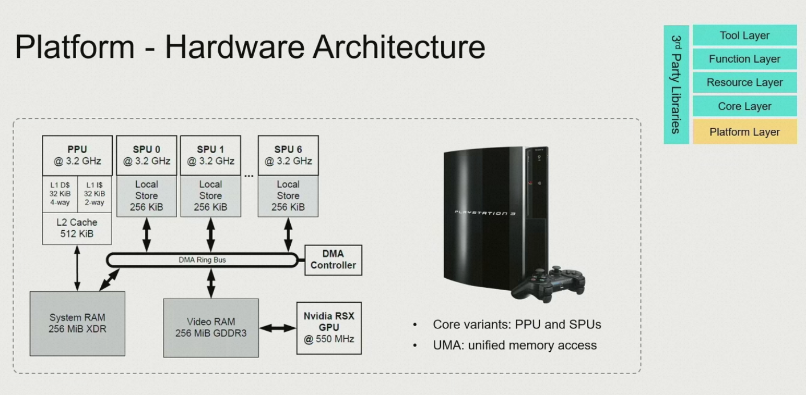

不同的平台甚至可能有着完全不同的硬件架构，为了高效地利用平台的计算资源需要平台层将计算逻辑合理地分配到不同平台的计算硬件上。

这层很难很难写。

## Tool

工具层不是Runtime，对引擎意味着什么？

### Allow Anyone to Create Game

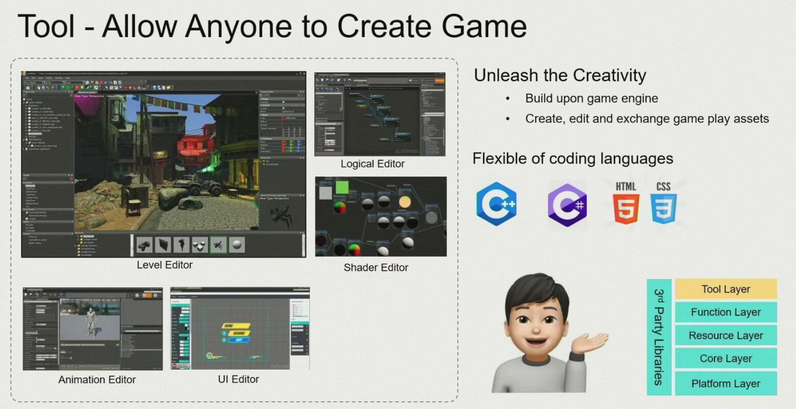

工具层是为游戏开发者提供支持的一层。工具层允许游戏开发者直观地预览不同美术资源在游戏环境中的表现，对于游戏开发者和设计师有着重要的意义。

工具层比较灵活，不是效率优先。可以用QT，也可以用html等。

很多时候，工具层代码比引擎更多，复杂度更高，维护门槛更高。

### Digital Content Creation

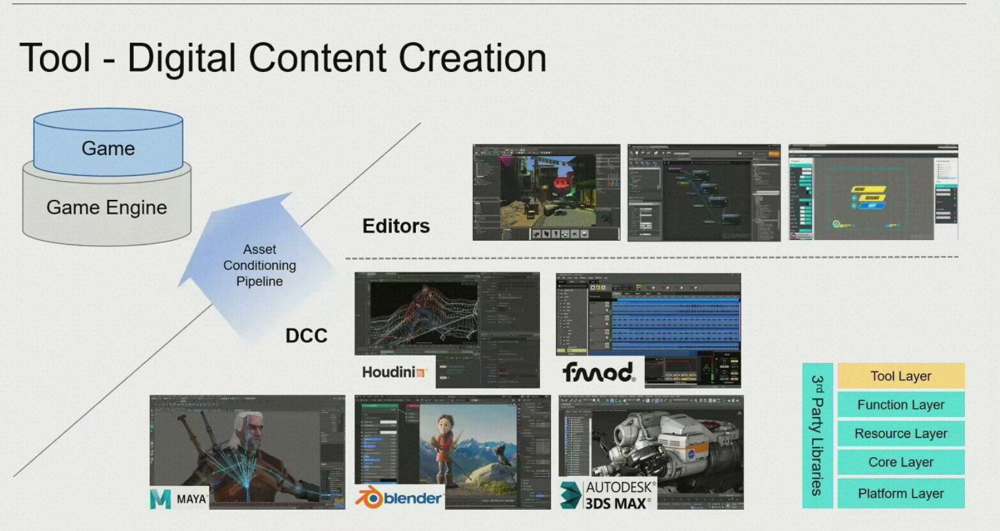

除了游戏引擎自己的开发工具外一般还需要导入其它软件和开发工具的资产，这就需要asset conditioning pipeline (各种各样的导入器和导出器)来提供不同资源导入游戏引擎的统一管线。可以说编辑器和asset conditioning pipeline共同构成了游戏引擎的工具层。

## Why Layered Architecture?

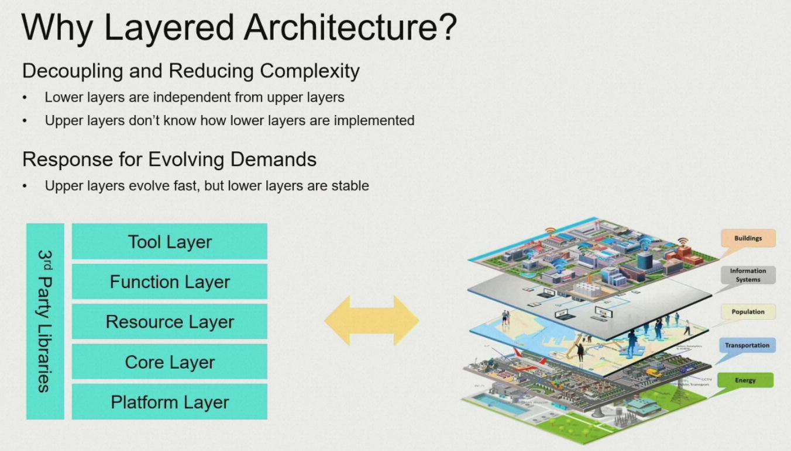

对游戏引擎进行分层的意义在于对不同类型的代码进行解耦，这样可以更好地管理这个系统的复杂度。

越底层的层，越不要去动它。功能层和工具层可能每天都在变。越往上越灵活，越往下越稳定。

## Mini Engine - Pilot

本课程使用课程组自行开发的Pilot引擎来介绍现代游戏引擎的基本架构和实现。

ECS，多线程 都支持。

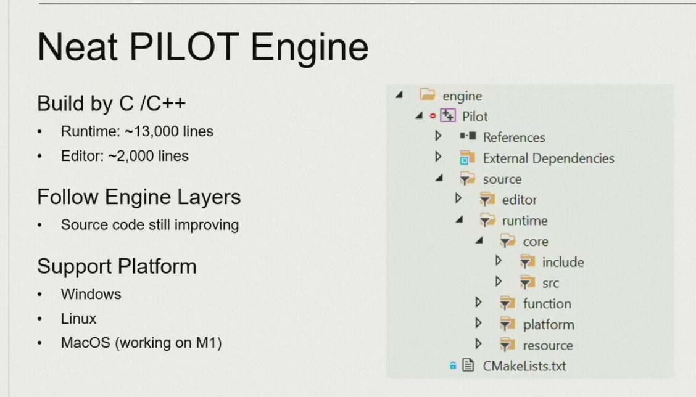

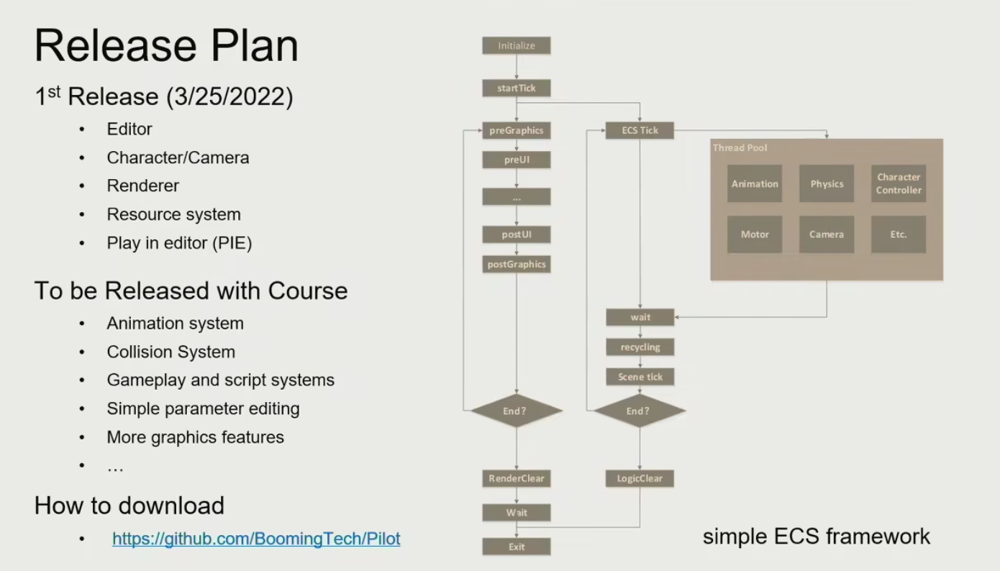

## QA

1. VR游戏开发和普通游戏开发有什么区别？
   1. VR游戏还在早期，受算力限制。强交互，强体验，不注重视觉细节。

> 更新: 2023-11-27 12:18:06  
> 原文: <https://www.yuque.com/viruspc/el3mi0/zt5uyfa21rfse52g>