# 游戏引擎导论

- [Course Content](#course-content)
- [课程流程](#%E8%AF%BE%E7%A8%8B%E6%B5%81%E7%A8%8B)

---

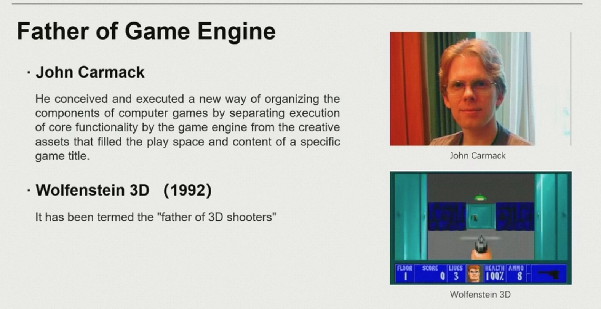

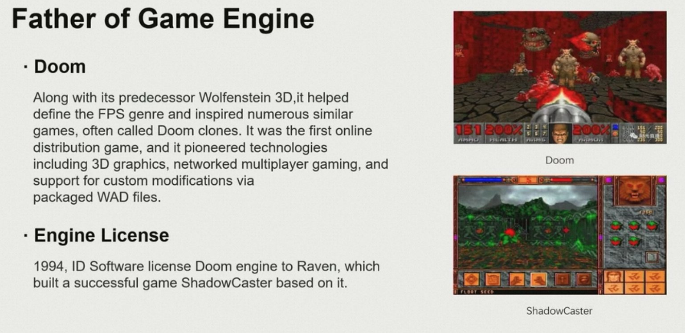

Doom 全球第一款游戏引擎

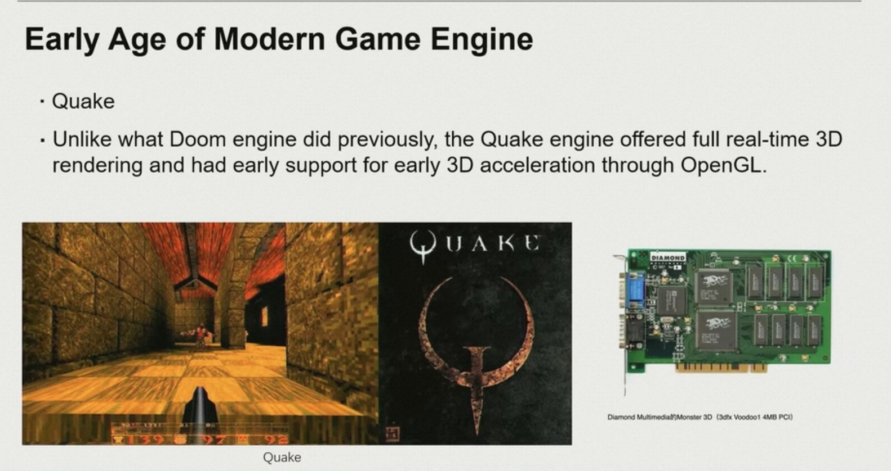

Doom只是一些代码的共用，真正的第一款游戏引擎应该是Quake

第一个研究联网对战下，网络怎么去同步的问题。

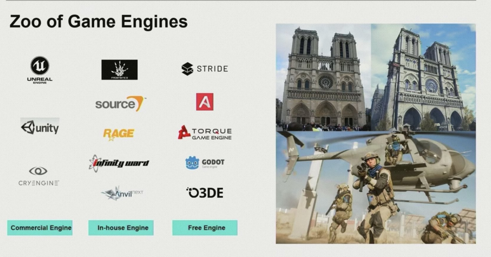

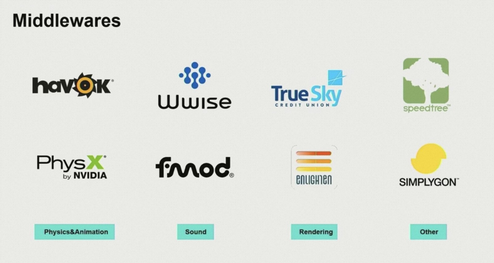

许多模块变得越来越复杂，出现专门的中间件。speedtree做漫山遍野的树木。

中间件的生命周期都不是很长。

引擎是生产力工具，做引擎的目标是服务好优秀的设计师和美术师

阅读游戏引擎源码：所有的游戏引擎，都可以从 update/tick 开始看

# Course Content
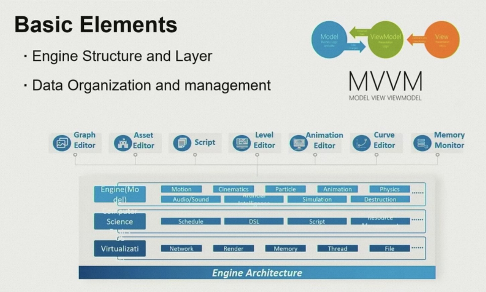

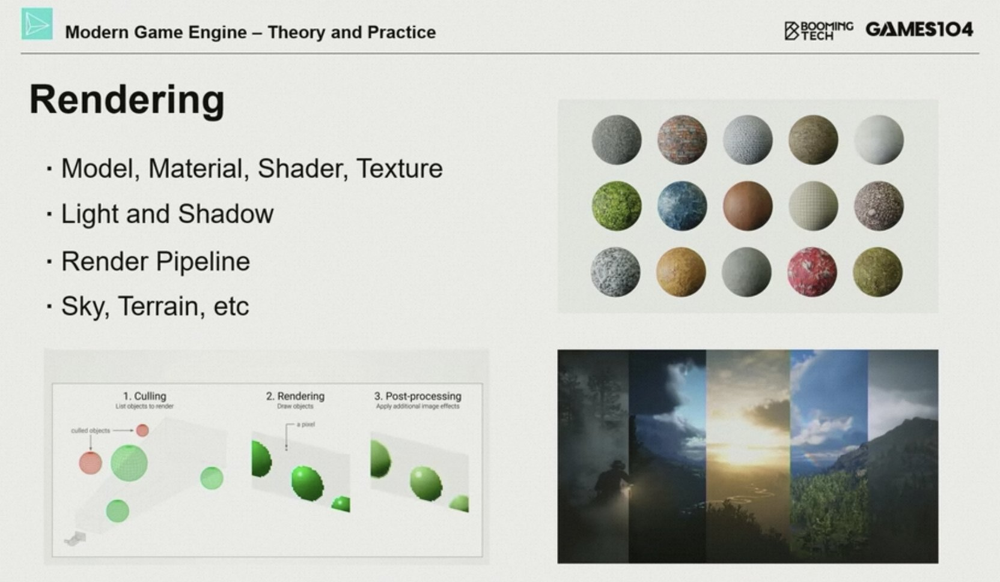

和games101/202的区别：讲如何把games101/202里的各种东西拼起来，fitin到16ms内，用什么pipeline组织起来。

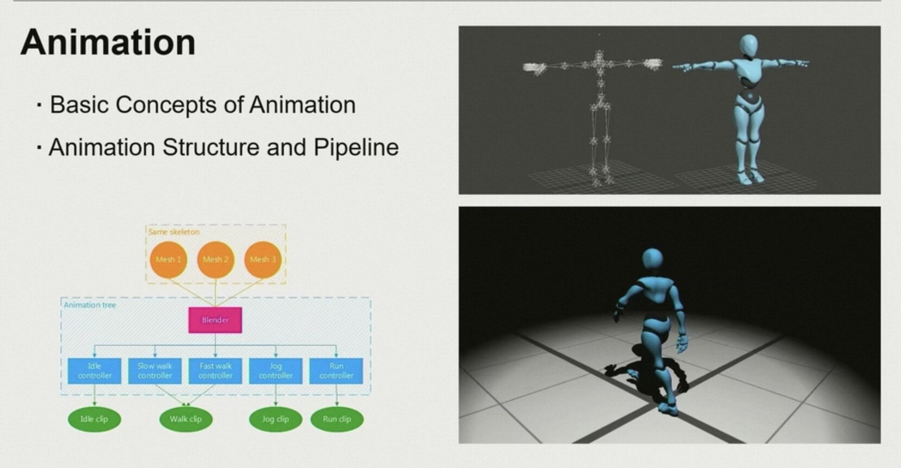

强调交互，强调如何把animation变成玩法

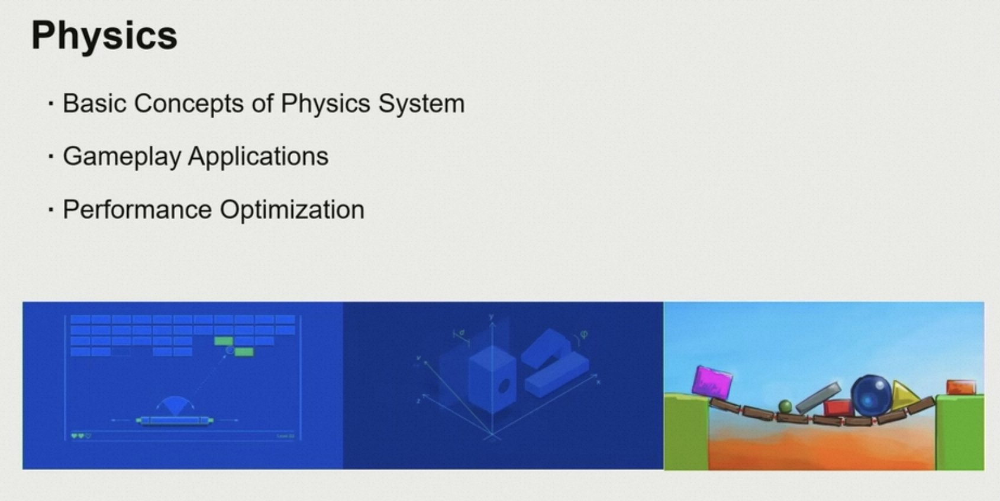

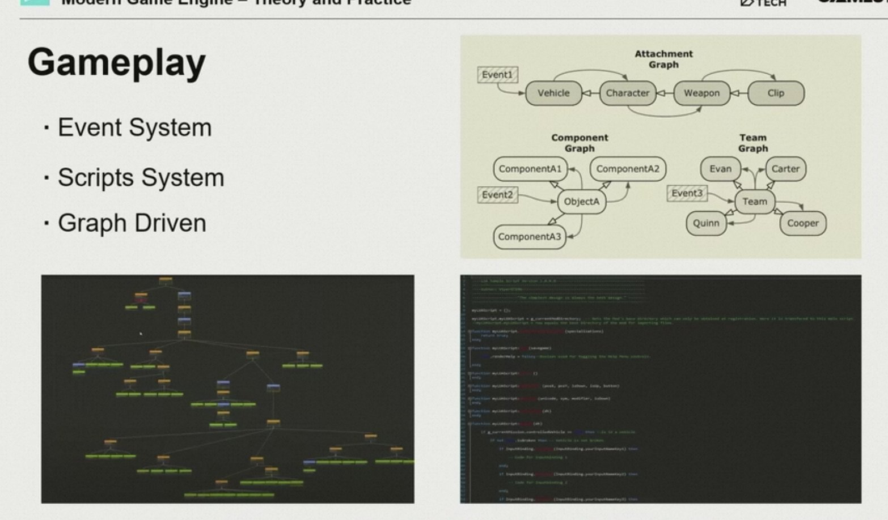  
游戏玩法，设计师设计出来的。

事件系统，脚本系统。

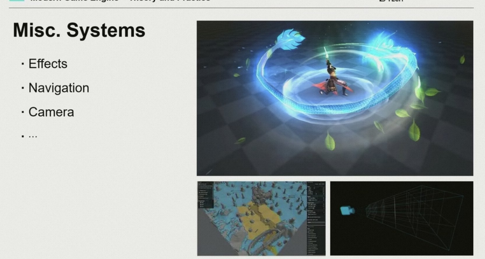

特效、寻路、镜头感

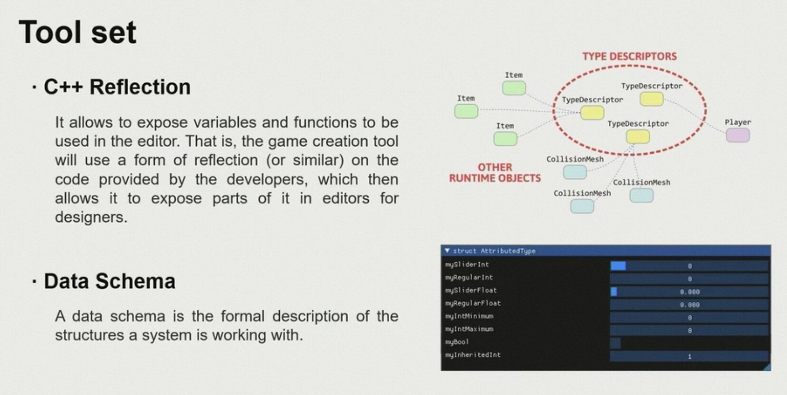

如何构建一个可以给别人用的起来的游戏开发工具体系。

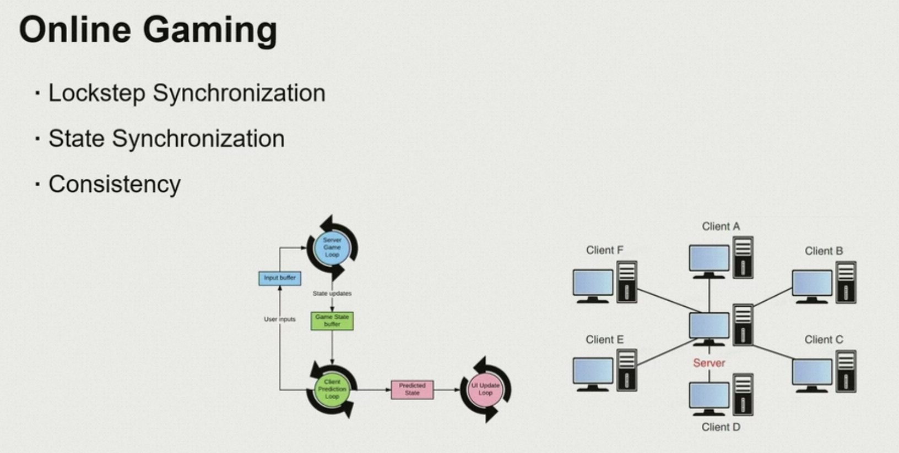

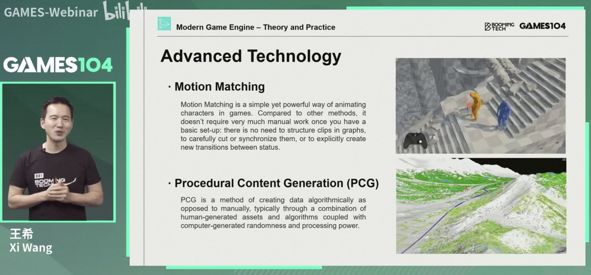

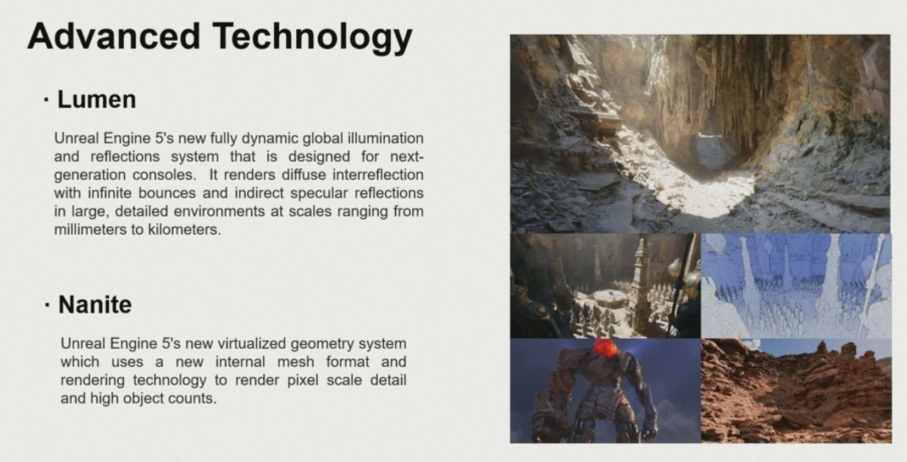

前沿课

# 课程流程
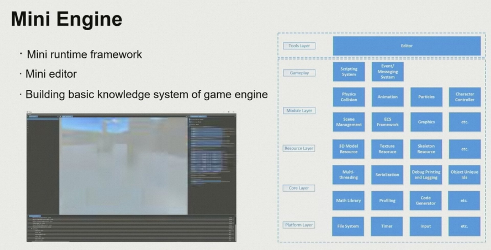

> 更新: 2023-11-13 12:45:54  
> 原文: <https://www.yuque.com/viruspc/el3mi0/xwg7pr4yxtgk9w4l>