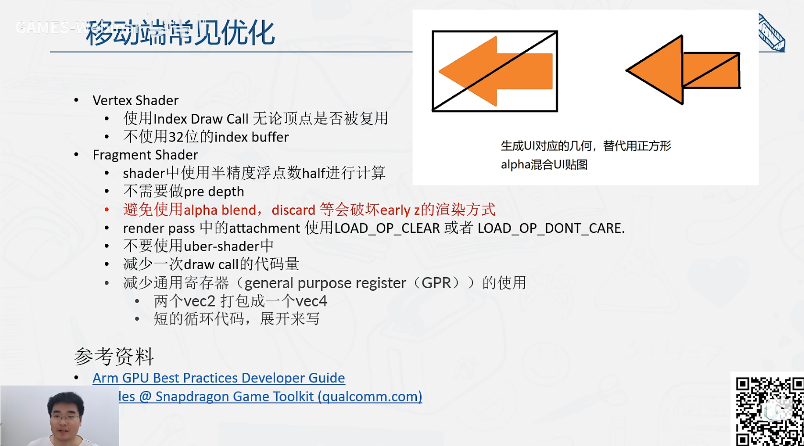

# 性能优化

- [离线资源优化](#%E7%A6%BB%E7%BA%BF%E8%B5%84%E6%BA%90%E4%BC%98%E5%8C%96)
  * [模型几何](#%E6%A8%A1%E5%9E%8B%E5%87%A0%E4%BD%95)
  * [材质](#%E6%9D%90%E8%B4%A8)
  * [纹理贴图](#%E7%BA%B9%E7%90%86%E8%B4%B4%E5%9B%BE)
  * [节点](#%E8%8A%82%E7%82%B9)
  * [动画](#%E5%8A%A8%E7%94%BB)
  * [UI](#ui)
  * [特效](#%E7%89%B9%E6%95%88)
- [资源加载优化](#%E8%B5%84%E6%BA%90%E5%8A%A0%E8%BD%BD%E4%BC%98%E5%8C%96)
  * [资源预处理](#%E8%B5%84%E6%BA%90%E9%A2%84%E5%A4%84%E7%90%86)
  * [资源懒加载](#%E8%B5%84%E6%BA%90%E6%87%92%E5%8A%A0%E8%BD%BD)
- [实时渲染优化](#%E5%AE%9E%E6%97%B6%E6%B8%B2%E6%9F%93%E4%BC%98%E5%8C%96)
  * [**减少绘制调用（Draw Calls）**](#%E5%87%8F%E5%B0%91%E7%BB%98%E5%88%B6%E8%B0%83%E7%94%A8draw-calls)
- [实时交互优化](#%E5%AE%9E%E6%97%B6%E4%BA%A4%E4%BA%92%E4%BC%98%E5%8C%96)
- [内存显存优化](#%E5%86%85%E5%AD%98%E6%98%BE%E5%AD%98%E4%BC%98%E5%8C%96)
- [相关链接](#%E7%9B%B8%E5%85%B3%E9%93%BE%E6%8E%A5)

---

以减少计算量、降低资源占用和提高运行效率为目标，主要手段包括资源压缩、批处理渲染、剔除不可见对象、事件节流等。

（一些情况下，依赖用户输入 的 实时优化手段 可以提前放到离线处理中做完，如视锥体裁剪等）

## 离线资源优化

对资源本身的优化

### 模型几何

* **减少三角面和顶点数量（使用低多边形模型）**： 建议单个场景模型面数不要超过 5万面。在保证视觉效果的前提下尽量减少模型三角面数量和顶点数量，因为两者对 GPU 的性能损耗较大或显存占用均有一定影响，尤其是三角面的渲染性能有极大影响。
* **模型合并**（合批，Batching，减少drawcall）： 美术需将不可独立移动的模型尽可能合并减少渲染批次，同时注意不要合并场景范围跨度过大的模型导致模型无法裁剪的问题。
  * 静态合批（Static Batching）：将静态物体合并为一个网格，减少绘制调用。
  * 动态合批（Dynamic Batching）：对动态但相似的小物体（如粒子）进行临时合并。
* **Imposter**：<https://zhuanlan.zhihu.com/p/684423888>

### 材质

* **材质合并：** 尽可能合并材质，材质作为三维引擎的合并根基，一切引擎级渲染批次的合并前提都是使用相同材质，所以要保持材质对象尽可能的少。
* **材质选择：**
  * **精简材质模型：**材质模型选择需要根据美术风格尽量精简，比如直接把光照合并在漫反射贴图的的卡通风格模型可以直接选择 *unlit* 材质，而无需使用复杂的 *PBR* 材质模型。
  * **优先使用非透明材质**：因为无论材质的透明混合还是透明裁剪模式相对于非透明材质都比较耗费性能。(背景设为不透明)

### 纹理贴图

* **评估实际项目贴图光栅化后的实际显示像素来使用接近的贴图尺寸**：贴图是占用显存资源的大头，贴图尺寸不可能盲目追求质量使用超大尺寸，需要评估实际项目贴图光栅化后的实际显示像素来使用接近的贴图尺寸，否则使用过大尺寸不仅得不到效果收益还浪费显存。
* **尽量使用 2 的 N 次方贴图**。
* **纹理压缩**：在合理贴图尺寸下还可以继续使用** **[纹理压缩](https://galacean.antgroup.com/#/docs/0.9/cn/texture-compression) 优化显存占用。（如ETC、S3TC、ASTC）
* **Texture Atlasing: 纹理合并。合并纹理（Texture Atlas）以减少纹理切换。**
* **Texture Arrays**
* **Reuse Texture: **复用空白贴图。
* **Dynamic Texture Loading：**做visibility culling，动态加载贴图
* **Texture Format and Channel Reduction:** 例如灰度图可以只用一个channel，非透明图可以节省一个channel
* **POT（Power of Two）Textures: **2 的倍数的贴图更高效（主要是加速mipmap，内存对齐与碎片减少、纹理操作避免padding带来的复杂度，旧硬件兼容性好） <https://www.reddit.com/r/gamedev/comments/1hz2om0/why_poweroftwo_textures_still_matter_or_not_an/>
* **Texture Swizzling: **GPU支持的话，可以压缩多个channel到一个channel
* **Texture Pooling: **资源池，单例
* **局部裁剪，**只加载部分贴图
* **Lazy loading：**懒加载
* **Sparse Texture Formats：**一些图形API支持稀疏的纹理格式，允许只用一部分纹理。虚拟纹理？
* **虚拟纹理：**核心思想还是做 visibility culling，次只在内存中加载一部分纹理。
* 
* 在离线阶段对模型、纹理等资源进行预处理（如法线贴图生成、光照烘焙）。
* 将资源转换为适合WebGL的格式，如glTF或二进制格式，以减少解析时间。

### 节点

* **减少运行时空节点数量**：空节点数量会占据一定内存消耗，而且可能会带来 [变换](https://galacean.antgroup.com/#/docs/0.9/cn/transform) 计算的潜在消耗，美术方一定要尽量删除空节点和合并碎节点。

### 动画

* **建议使用骨骼蒙皮动画**：动画的制作方式上建议使用骨骼蒙皮动画，这是一种在三维引擎里兼顾效果和内存的一种动画技术，但由于骨骼动画的计算开销较大，尤其是在 JS 这种不擅长密集运算的语言下。
* **控制骨骼数量在25块以下**：所以美术在制作骨骼动画时应保证骨骼数量尽可能的少，有助于提升骨骼动画的性能和内存占用。一般控制在 **25** 块以下，可以保证在 IPhone 这种 GPU *uniform* 数量较少的机型中保证最佳性能。

### UI

* **减少 UI 的 Alpha 部分浪费**：比如 UI 使用近乎全屏但大部分透明的图片绘制会给 GPU 带来巨大的渲染负担，
* **合并UI贴图**：美术尽量自行合并 UI 贴图并高度利用贴图空间，因为依靠编辑器的算法合并仍可能产生一些浪费。

### 特效

* **减少贴图透明部分的尺寸的浪费：**特效贴图部分和 UI 同理，一定要减少贴图透明部分的尺寸的浪费

* **在粒子等特效上尽量减少发射频率**：由于特效通常 OverDraw 非常严重，比如粒子，所以一定要在粒子等特效上尽量减少发射频率。

* **Q1：如何优化大量静态物体的渲染性能？**\ **参考答案**：\ 合并相同材质的几何体（Batch Rendering），减少Draw Calls；使用索引绘制（<code>gl.drawElements</code>）节省带宽；预编译着色器程序，避免运行时编译开销。

* **Q2：如何避免频繁的状态切换（State Change）？**\ **参考答案**：\ 按渲染状态（如纹理、混合模式）对物体排序，集中相同状态的绘制操作；使用纹理图集（Texture Atlas）减少纹理切换次数。

不要创建太多 Vecctor、Matrix、Texture 等资源，尽量复用。

## 资源加载优化

### 资源预处理

* 在离线阶段对模型、纹理等资源进行预处理（如法线贴图生成、光照烘焙）。
* 将资源转换为适合WebGL的格式，如glTF或二进制格式，以减少解析时间。

### 资源懒加载

* 按需加载资源，避免一次性加载所有内容。
* 使用分页加载或分片加载技术。

## 实时渲染优化

### **减少绘制调用（Draw Calls）**

* **合批（Batching）**：
  * **静态合批（Static Batching）**：将静态物体合并为一个网格，减少绘制调用。
  * **动态合批（Dynamic Batching）**：对动态但相似的小物体（如粒子）进行临时合并。
* **实例化渲染（Instancing）**：\ 对相同材质和模型的物体（如树木、植被）使用 <code>GL_InstanceID</code> 或 API 的实例化功能，一次绘制多个实例。Guassian Splatting 渲染大量大小不一的椭球就很适合采用这种方法。
* **减少状态切换**：\ 避免频繁切换材质、纹理、渲染状态（如混合模式、深度测试），通过排序和批处理优化状态切换频率。

实时渲染优化是指在绘制阶段提高帧率和渲染效率的手段。

* **减少绘制调用（Draw Calls）**
  * 合并多个对象为一个对象，减少`gl.drawElements`或`gl.drawArrays`调用次数。
  * 使用实例化渲染（Instanced Rendering）绘制重复的几何体。
* **视锥体裁剪（Frustum Culling）**
  * 只渲染摄像机视锥体内的对象，避免渲染不可见的对象。
* **遮挡剔除（Occlusion Culling）**
  * 剔除被其他对象遮挡的对象，避免不必要的渲染。
* **减少状态切换**
  * 减少着色器、纹理、帧缓冲区等的切换。
  * 尽量批量处理具有相同状态的对象。
* **优化着色器**
  * 精简顶点和片段着色器代码，移除不必要的计算。
  * 使用低精度变量（如`mediump`或`lowp`）代替高精度变量（`highp`）。
  * 预计算复杂的数学运算，将结果存储为常量或纹理。
* **延迟渲染（Deferred Rendering）**
  * 对复杂场景使用延迟渲染技术，只对最终需要显示的像素执行光照计算。

## 实时交互优化

实时交互优化是指提高用户与WebGL应用交互的响应速度和体验。

* **事件分帧处理**
  * 将复杂的交互逻辑分帧处理，避免阻塞主线程。
* **降低交互复杂度**
  * 对交互对象进行简化，比如降低交互模型的分辨率。
  * 限制交互对象的数量。
* **使用GPU拾取技术**
  * 对于复杂场景的点击检测，使用GPU拾取代替CPU计算。
* **避免阻塞主线程**
  * 将复杂计算任务（如物理模拟、路径规划）放到Web Worker中执行。
* **动态调整渲染质量**
  * 根据交互频率动态调整渲染质量（如降低帧率或分辨率）。
* 对远处或不重要的对象使用简化模型（如LOD：Level of Detail）。
*

## 内存显存优化

内存和显存优化旨在减少资源占用，避免内存泄漏和性能瓶颈。

* **纹理管理**
  * 避免加载过多的纹理，及时释放不再使用的纹理。
  * 使用Mipmap技术优化纹理采样。
* **缓冲区管理**
  * 合并多个对象的顶点缓冲区（Vertex Buffer Object, VBO）以减少显存占用。
  * 使用动态缓冲区（Dynamic Buffer）优化频繁更新的几何数据。
* **减少冗余数据**
  * 删除未使用的顶点属性（如颜色、法线等）。
  * 压缩顶点数据（如将32位浮点数转换为16位浮点数或整数）。
* **显存回收**
  * 定期检查和回收未使用的GPU资源（如缓冲区、纹理、帧缓冲区）。
* **内存泄漏防护**
  * 确保在不需要时释放WebGL上下文资源（如`deleteBuffer`、`deleteTexture`等）。
  * 避免在应用中创建过多的临时对象。

## 相关链接

* [Galacean - Mobile first high performance web interactive engine](https://galacean.antgroup.com/#/docs/latest/cn/artist-scene-standard)
* [4. 图形绘制流水线的基本原理与实践(三)\_哔哩哔哩\_bilibili](https://www.bilibili.com/video/BV1Uo4y1J7ie?p=4\&vd_source=a637826c55b409b420b4b6584a6e8379)
* <https://zhuanlan.zhihu.com/p/1901597967380624940>

> 更新: 2025-05-04 09:46:51  
> 原文: <https://www.yuque.com/viruspc/el3mi0/whxbv9ketb9h7sbv>