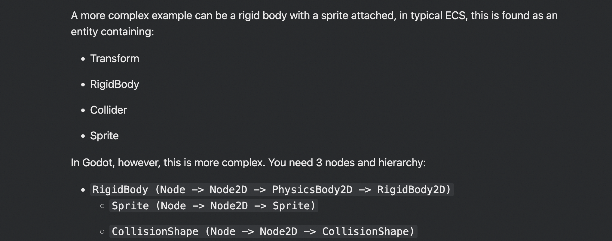
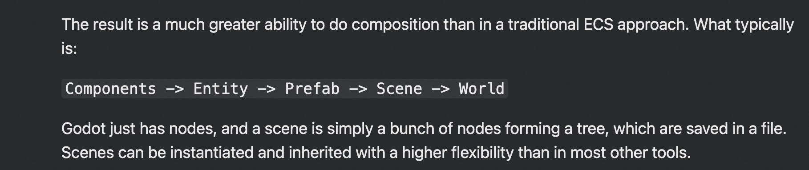

# 一些ECS的讨论

1. Unity 与 ECS
+ [https://www.reddit.com/r/Unity3D/comments/1c00tdr/eli5_isnt_unity_already_an_entity_component_system/](https://www.reddit.com/r/Unity3D/comments/1c00tdr/eli5_isnt_unity_already_an_entity_component_system/)
+ [https://medium.com/my-games-company/explaining-and-making-the-leap-to-ecs-in-unity-b6d786464d72](https://medium.com/my-games-company/explaining-and-making-the-leap-to-ecs-in-unity-b6d786464d72)
+ [https://unity.com/cn/ecs](https://unity.com/cn/ecs)

2. Godot 为什么不用 ECS
    1. [https://godotengine.org/article/why-isnt-godot-ecs-based-game-engine/](https://godotengine.org/article/why-isnt-godot-ecs-based-game-engine/)
    2. Architecturally wise, ECS aims to replace inheritance, by favouring composition, similar to how interfaces or multiple inheritance works in OOP. The key advantage in ECS is that components are dynamic (can be added or removed in run-time).
    3. Godot uses more traditional OOP by providing Nodes, that contain both data and logic. It also makes heavy use of inheritance. It still does composition, but at a higher level (the nodes you compose are generally higher level than components in traditional ECS).
    4. 
    5. Godot does composition at a higher level than in a traditional ECS. This has two fundamental differences in both architecture and performance.
    6. 
    7. Most (if not all) technologies that utilize ECS do it at the core engine level, by serving as the base architecture and building everything else (physics, rendering, audio, etc.) over it.

> 更新: 2024-09-09 07:30:45  
> 原文: <https://www.yuque.com/viruspc/el3mi0/ooq1c8c2c9qnddsn>