# Animation2

- [Summary](#summary)
- [Single Particle Simulation](#single-particle-simulation)
  * [Explicit Euler Method](#explicit-euler-method)
    + [Problem Settings](#problem-settings)
    + [Ordinary Differential Equation](#ordinary-differential-equation)
    + [Solving for Particle Position](#solving-for-particle-position)
    + [Euler's Method](#eulers-method)
      - [Errors](#errors)
      - [Instability](#instability)
    + [Errors and Instability](#errors-and-instability)
  * [Combating Instability](#combating-instability)
    + [Some Methods to Combat Instability](#some-methods-to-combat-instability)
    + [Midpoint Method](#midpoint-method)
    + [Adaptive Step Size](#adaptive-step-size)
    + [Implicit Euler Method](#implicit-euler-method)
      - [How to Determine/Quantize "Stability"?](#how-to-determinequantize-stability)
    + [Runge-Kutta Families](#runge-kutta-families)
    + [Position-Based/Verlet Integration](#position-basedverlet-integration)
- [Rigid Body Simulation](#rigid-body-simulation)
- [Fluid Simulation Position-based Method](#fluid-simulation-position-based-method)
  * [Key idea](#key-idea)
  * [Eulerian vs Larangian](#eulerian-vs-larangian)
  * [Material Point Method (MPM)](#material-point-method-mpm)
- [References](#references)

---

# Summary
+ Single Particle Simulation
    - Explicit Euler method
    - Instability and improvements
        * midpoint method
        * daptive step size
        * implicit Euler Method
        * Runge-Kutta Families
        * Position-Based/Verlet Integration
+ Rigid Body Simulation
+ Fluid Simulation
    - Eulerian VS Varangian
    - Material Point Method (MPM)

# Single Particle Simulation
## Explicit Euler Method
### Problem Settings
模拟粒子在速度场中的运动

速度场：给定任意位置和时间，给出速度

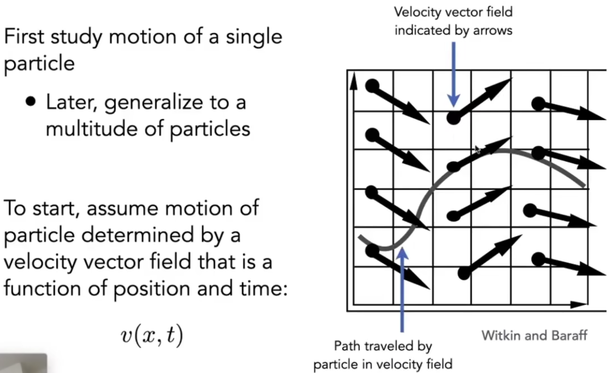

### Ordinary Differential Equation
一阶常微分方程

常微分方程：给定量的微分，求量

一阶：不存在对其他变量的微分（不存在偏微分）

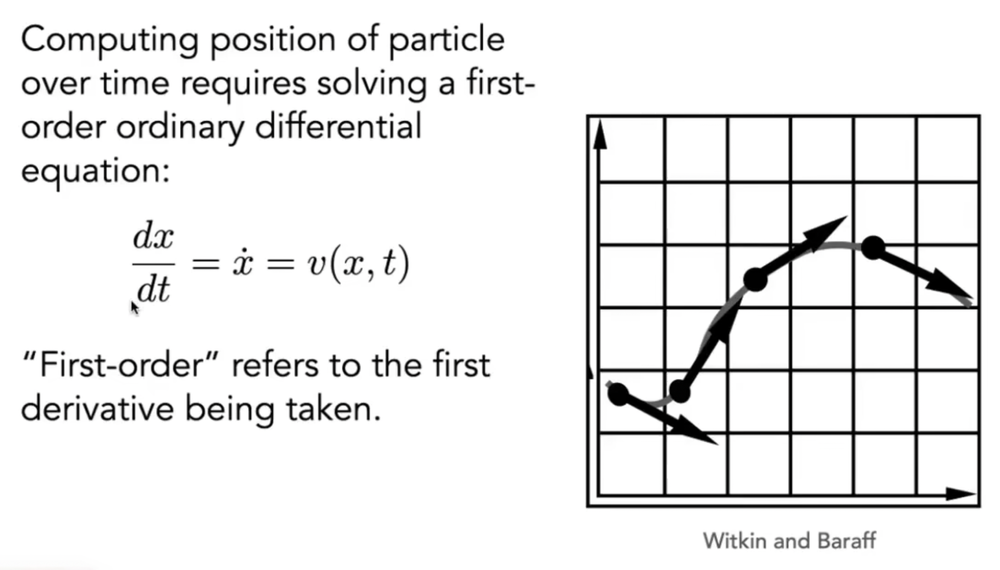

### Solving for Particle Position
解之前，先给定初始位置x0

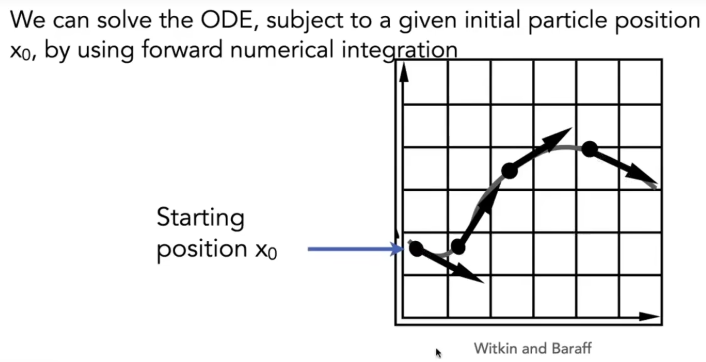

### Euler's Method
用上一个时刻的量，来估计下一个时刻的量

问题：

1. 不准
2. 迅速变得不稳定

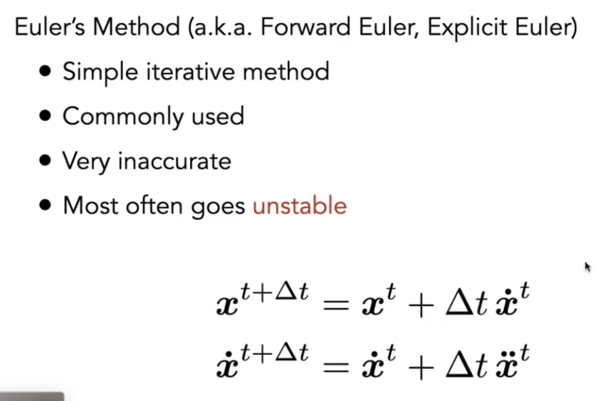

#### Errors
不同长度的步长会导致不同程度的误差。步长越小误差越小。

误差会累积。

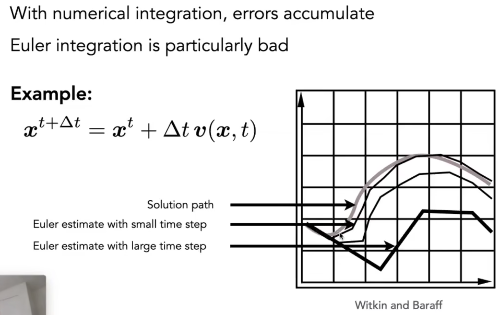

#### Instability
一些情况下，不管步长取多小，都会导致不稳定。

上图中，步长导致轨迹一定会离开螺旋形的速度场。

下图中，正反馈。原本希望最后沿着中间的横线移动，最后却会变得和实际结果无限远。

1. 

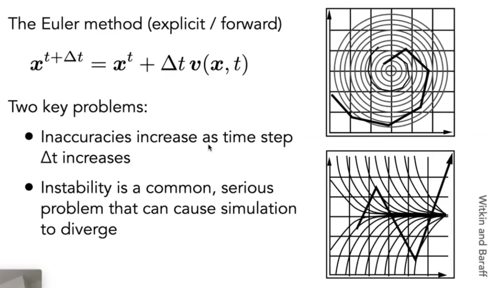

### Errors and Instability
所有数值方法都会存在的问题：误差和不稳定性。误差问题不严重，不稳定性问题严重。误差使得最终结果和实际结果差不远，不稳定性使得模拟结果和实际结果差非常远。

Solving by numerical integration with finite differences leads to two problems:

Errors

+ Errors at each time step accumulate. Accuracy decreases as simulation proceeds
+ Accuracy may not be critical in graphics applications

Instability

+ Errors can compound, causing the simulation to **diverge **even when the underlying system does not
+ Lack of stability is a fundamental problem in simulation, and it cannot be ignored

## Combating Instability
### Some Methods to Combat Instability
Midpoint method / Modified Euler

+ Average velocities at start and endpoint

Adaptive step size

+ Compare one step and two half-steps, recursively, until error is acceptable

Implicit methods

+ Use the velocity at the next time step (hard)

Position-based / Verlet integration

+ Constrain positions and velocities of particles after time step

### Midpoint Method
不希望欧拉方法在模拟过程中离真实结果越来越远。

对于一点，其移动t步长后，模拟落到a点，实际应该落在c点。

如果单纯将步长缩短一半，会得到b点。

而midpoint 方法会利用中点速度作为整个移动过程的速度：

1. 利用欧拉方法，得到中点（在t/2时刻时）的速度。
2. 利用中点速度，来代替起点速度，重新进行欧拉方法，得到位置。

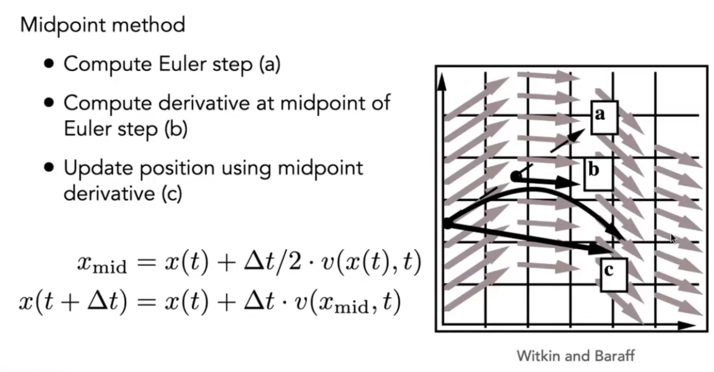

中点方法对欧拉方法做修改：

原来的欧拉方法是线性的模型。修正的欧拉方法多了个二次项，模拟了抛物线，比欧拉方法更能准确模拟。

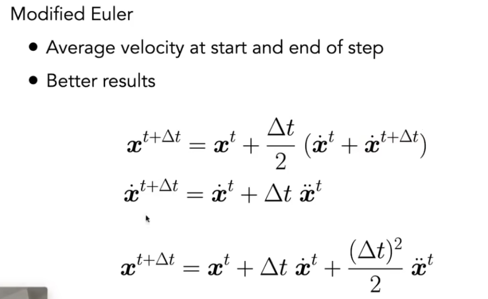

### Adaptive Step Size
把普通欧拉方法与中点方法结合起来：

自适应步长。不断减半步长，直至减半和不减半时 点的位置相差不大。

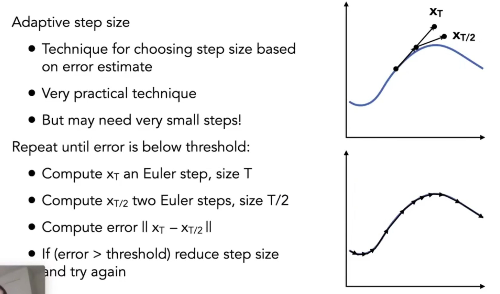

### Implicit Euler Method
隐式欧拉方法，后向方法

利用下一时刻的速度和加速度，而不是当前时刻的速度和加速度。

可以提供很好的稳定性。

问题：速度和加速度不是简单线性叠加时，方程会很难解。需要用牛顿法等求根算法来解。

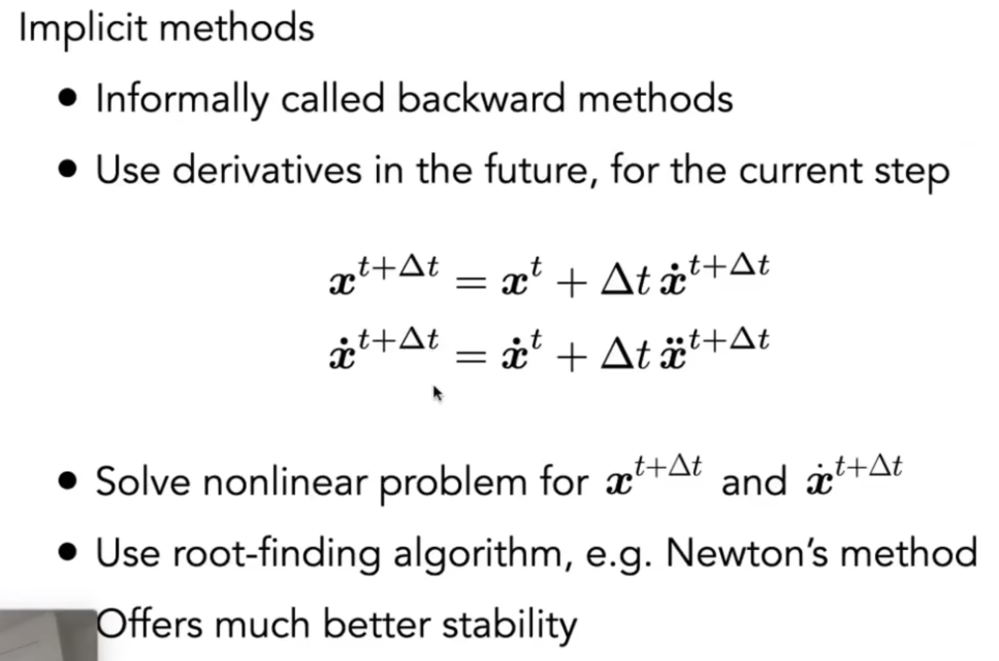

#### How to Determine/Quantize "Stability"?
h：阶数。用阶数来衡量稳定性。

O(h^n): 当步长变为1/2时，误差变为(1/2)^n => n越大越好

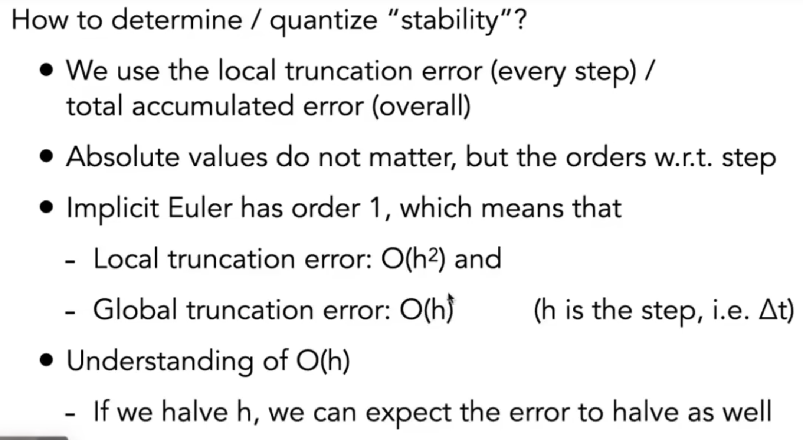

### Runge-Kutta Families
在数值计算方法里，有一类方法非常有名：龙格库塔法。

+ 非常擅长解ODE，特别是非线性情况。
+ 最常用四阶版本。a.k.a. RK4

相当于推广的中点法，中点法是二阶RK4是四阶。

欧拉法其实就是一阶的Runge-Kutta法

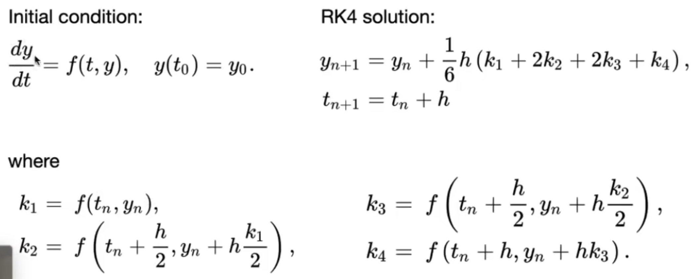

### Position-Based/Verlet Integration
不是基于物理的方法

忽略变化过程直接改变位置。当弹簧两端拉远，会立刻将弹簧拉回放松的位置。

Idea:

+ After modified Euler forward-step, constrain positions of particles to prevent divergent, unstable behavior
+ Use constrained positions to calculate velocity
+ Both of these ideas will dissipate energy, stabilize

Pros / cons:

+ Fast and simple
+ Not physically based, dissipates energy (error)

# Rigid Body Simulation
刚体模拟

不会发生形变。内部所有的点都按照相同方式运动。把整个刚体视为一个粒子。

除了位置和速度外，刚体还要考虑朝向和角速度

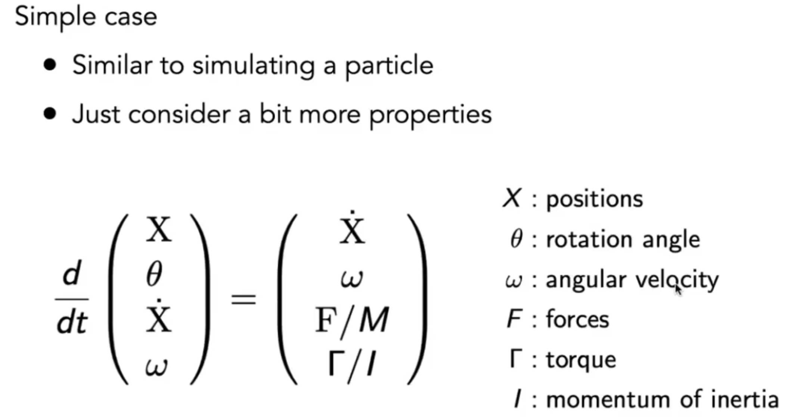

# Fluid Simulation Position-based Method
## Key idea
Key idea：

+ Assuming water is composed of small rigid-body spheres
+ Assuming the water cannot be compressed (i.e. const density) 密度恒定。
+ So as long as the density changes somewhere, it should be "corrected" via changing the positions of particles. 一旦密度不一样，就需要修正。
+ Correct density? You need to know the gradient of density anywhere w.r.t each particle's position
+ Update? Just gradient descent

Remind: 模拟和渲染是两个不同的步骤

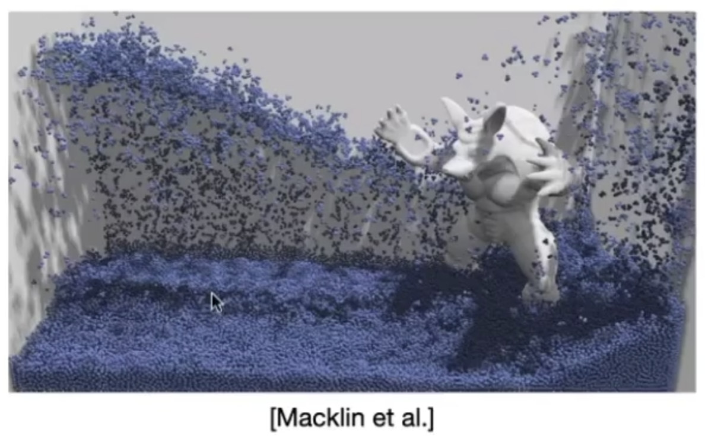

## Eulerian vs Larangian
物理模拟中两种思路

类似kdtree和bvh的区别？质点法关注单个物体（数据），网格法关注物体空间（数据空间）

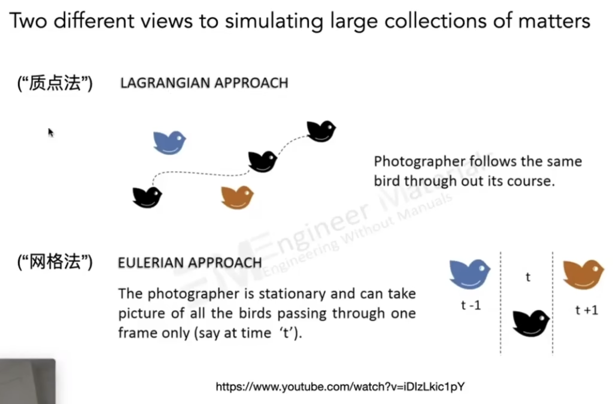

## Material Point Method (MPM)
Hybrid, combining Eulerian and Lagrangian views

+ Lagrangian: consider particles carrying material properties
+ Eulerian: use a grid to do numerical integration
+ Interaction: particles transfer properties to the grid, grid performs update, then interpolate back to particles

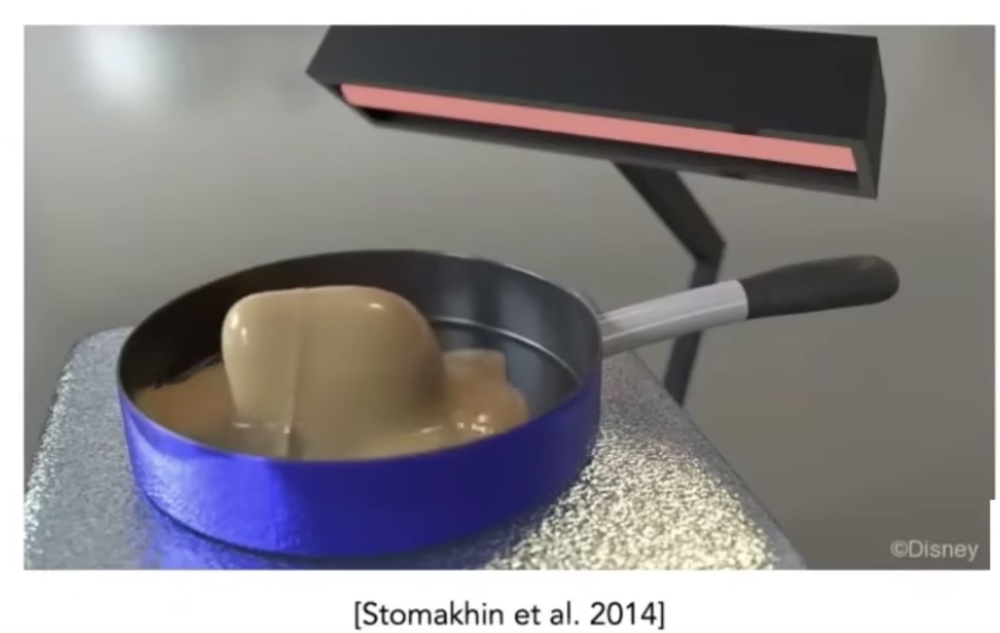

# References
+ [Lecture 22 Animation Cont._哔哩哔哩_bilibili](https://www.bilibili.com/video/BV1X7411F744?p=22&vd_source=a637826c55b409b420b4b6584a6e8379)

> 更新: 2023-05-14 02:14:28  
> 原文: <https://www.yuque.com/viruspc/el3mi0/ag15a9x5bc4mveks>