# Lecture 10. Geometry (Implicit and Explicit Representation)

- [Summary](#summary)
- [Examples of geometry](#examples-of-geometry)
- [Various representation of geometry](#various-representation-of-geometry)
  * ["Implicit" Representations of Geometry](#implicit-representations-of-geometry)
    + [介绍](#%E4%BB%8B%E7%BB%8D)
    + [缺点](#%E7%BC%BA%E7%82%B9)
    + [优点](#%E4%BC%98%E7%82%B9)
    + [Many Implicit Representations in Geometry](#many-implicit-representations-in-geometry)
      - [Algebraic surfaces （代数曲面）](#algebraic-surfaces-%E4%BB%A3%E6%95%B0%E6%9B%B2%E9%9D%A2)
      - [Constructive solid geometry （CSG，构造立体几何法）](#constructive-solid-geometry-csg%E6%9E%84%E9%80%A0%E7%AB%8B%E4%BD%93%E5%87%A0%E4%BD%95%E6%B3%95)
      - [Distance Functions（距离函数）](#distance-functions%E8%B7%9D%E7%A6%BB%E5%87%BD%E6%95%B0)
      - [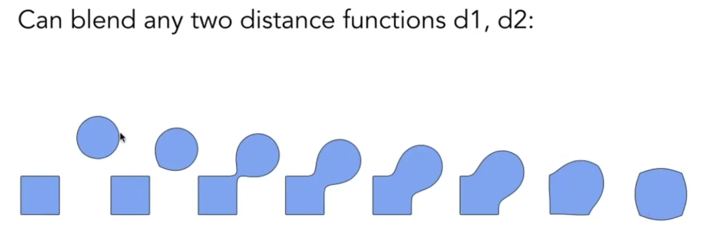](#1682736217619-c2e008ec-6b9f-4b9b-a155-084daee0364apngimgbchpjqiahmry5qjr1682736217619-c2e008ec-6b9f-4b9b-a155-084daee0364a-360043png)
      - [Level set methods（水平集）](#level-set-methods%E6%B0%B4%E5%B9%B3%E9%9B%86)
      - [Fractals (分形，自相似)](#fractals-%E5%88%86%E5%BD%A2%E8%87%AA%E7%9B%B8%E4%BC%BC)
  * ["Explicit" Representations of Geometry](#explicit-representations-of-geometry)
    + [介绍](#%E4%BB%8B%E7%BB%8D-1)
    + [优点](#%E4%BC%98%E7%82%B9-1)
    + [缺点](#%E7%BC%BA%E7%82%B9-1)
    + [Many Explicit Representations in Geometry](#many-explicit-representations-in-geometry)
      - [Point clouds](#point-clouds)
      - [Polygon mesh](#polygon-mesh)
      - [Bezier surfaces](#bezier-surfaces)
      - [Subdivision surfaces](#subdivision-surfaces)
      - [NURBS](#nurbs)
- [How to choose representations](#how-to-choose-representations)
- [References](#references)

---

# Summary

1. Examples of geometry
2. Various representation of geometry
   1. "Implicit" Representations. Sampling Can be hard, inside/outside tests easy. (more feature: difficult to model complex shapes, compact description, certian queries easy, good for ray-to-surface intersection, for simple shapes exact description and no sampling error, easy to handle changes in typology)
      1. Algebraic surfaces
      2. Constructive solid geometry (CSG) ：通过一系列基本几何的基本运算，来定义新的几何。
      3. Distance Functions：距离函数的值为0的位置，就是物体表面。SDF可以解决运动中间状态的blend问题。
      4. Level set methods：用矩阵表达距离函数
      5. Fractals 分形
   2. "Explicit" Representations. Sampling Can be easy, inside/outside tests hard.
      1. Point clouds
      2. Polygon mesh  `.obj`文件
      3. Bezier surfaces
      4. Subdivision surfaces
      5. NURBS
3. **Best representation based on task!**

# Examples of geometry

# Various representation of geometry

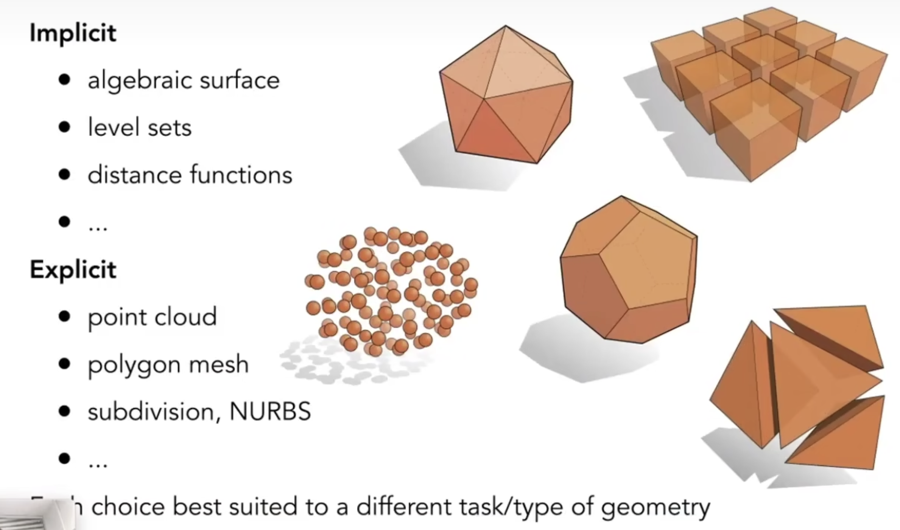

## "Implicit" Representations of Geometry

### 介绍

Based on classifying points

* Points satisfy some specified relationship

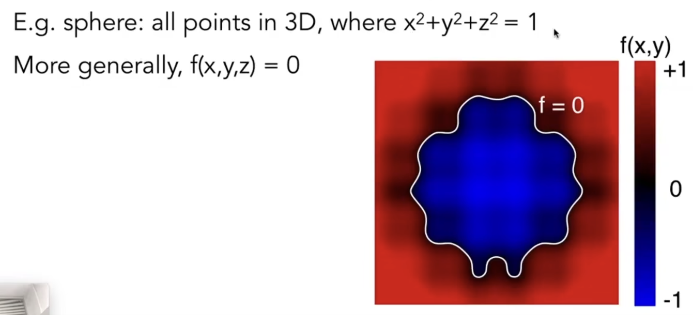

### 缺点

存在的问题：

1. Sampling Can be hard。很难直接说出这个面由哪些点组成，长什么样。
2. difficult to model complex shapes。

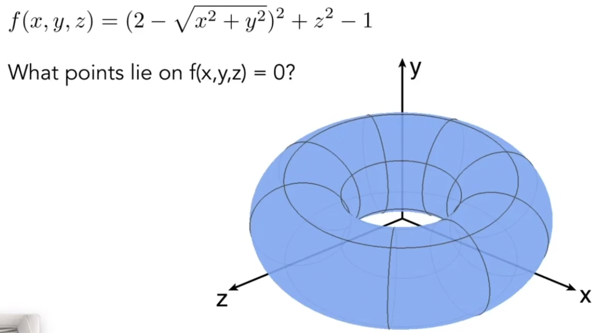

### 优点

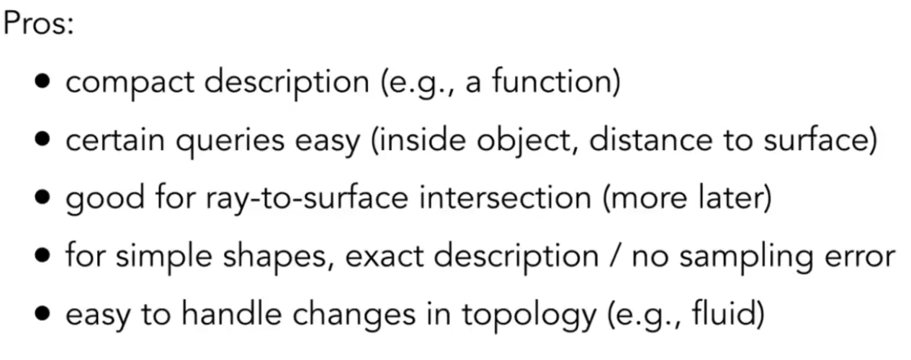Inside/Outside Tests Easy:

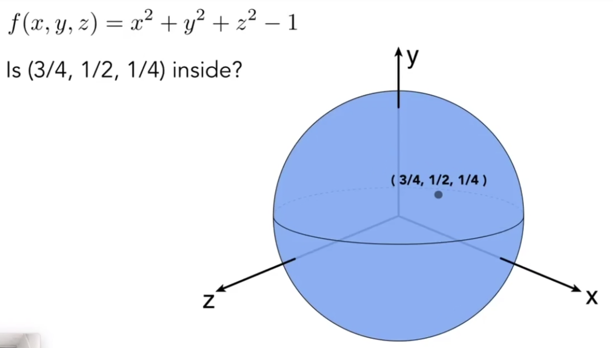

### Many Implicit Representations in Geometry

#### Algebraic surfaces （代数曲面）

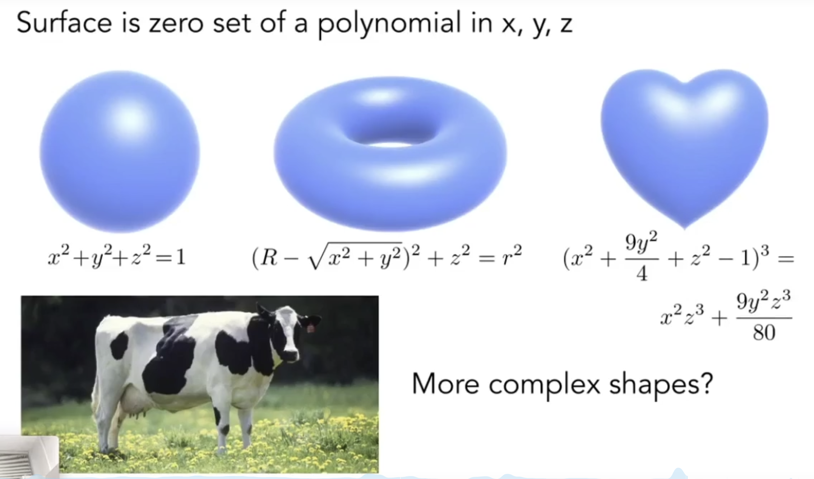

缺点： 代数方法难以描述复杂形状

#### Constructive solid geometry （CSG，构造立体几何法）

Combine implicit geometry via Boolean operations

通过一系列基本几何的基本运算，来定义新的几何。

**应用非常非常广泛！**

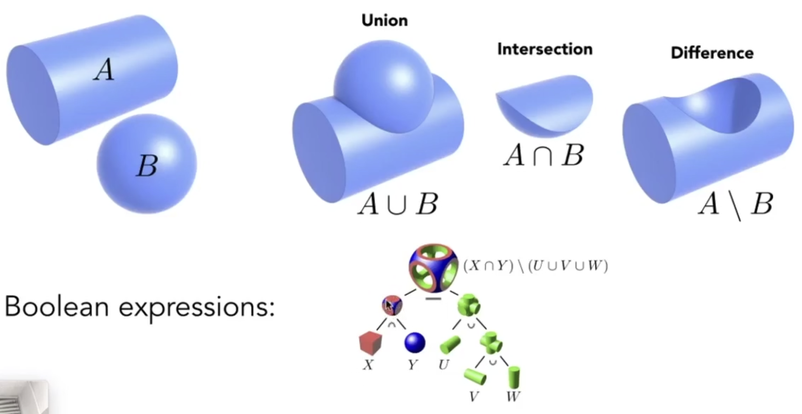

#### Distance Functions（距离函数）

Instead of Booleans, gradually blend surfaces together using distance functions:

give minimum distance (could be signed distance) from anywhere to object.

距离函数的值为0的位置，就是物体表面。

从A移动到B，直接按像素blend会出现问题：得到的并不是希望的运动中间状态。

对SDF（Signed Distance Function ） blend可以解决这个问题。

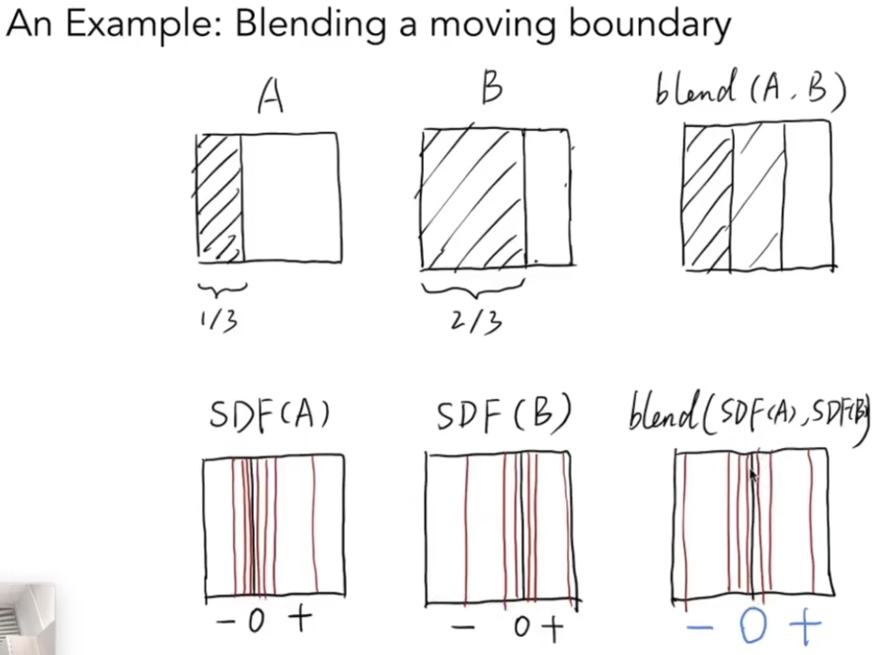

#### 

具体案例，案例中蜗牛采用SDF表示的： <https://iquilezles.org/www/articles/raymarchingdf/raymarchingdf.htm>

#### Level set methods（水平集）

距离函数的一种表示方式

距离函数存在的问题：Closed-form equations are hard to describe complex shapes (和代数曲面同样的问题)

Alternative：Store a grid of values approximate function

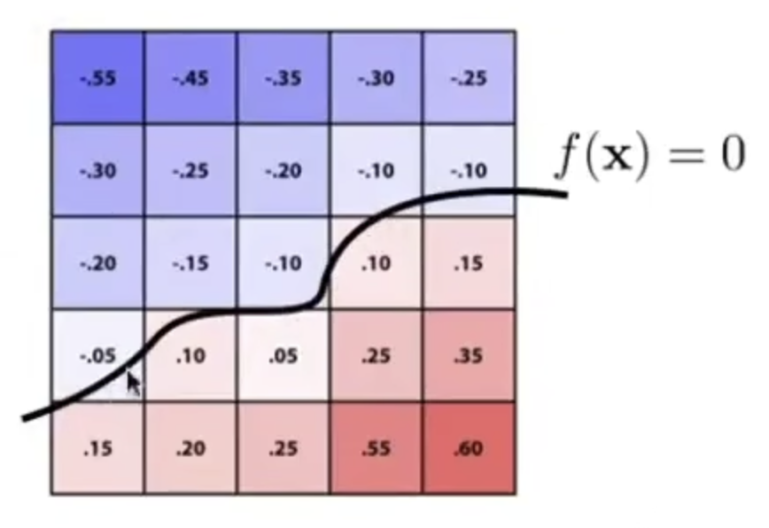

Surface is founded where interpolated values equal zero. (结合双线性插值)

Provides much explicit control over shape (like a texture)

水平集在三维空间的应用：

Level sets from medical data (CT, MIR, etc.):

Level sets encode, e.g. constant tissue density. 表达空间中每一点密度，密度相同的点在一起。

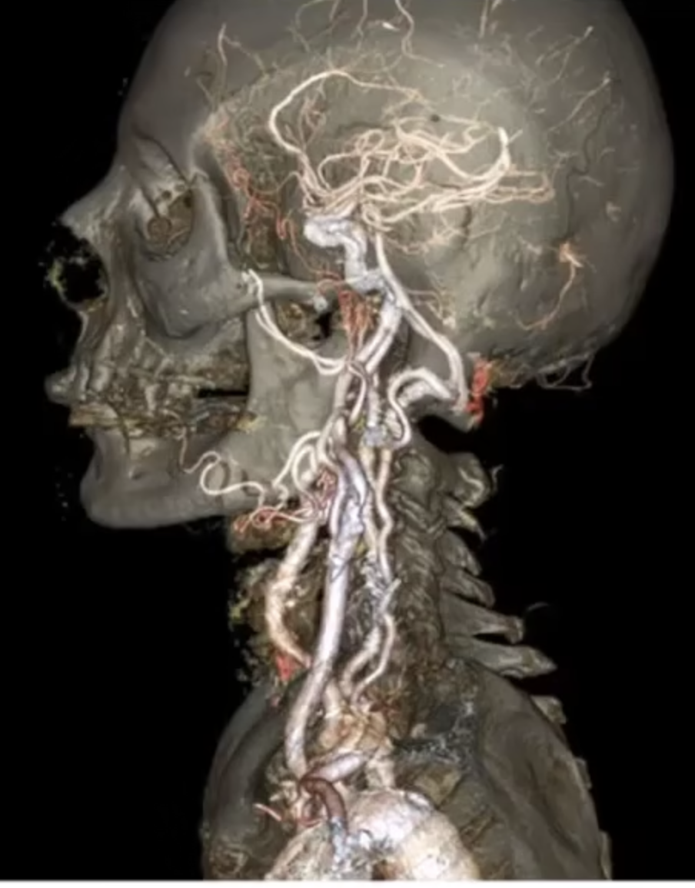

Level sets in Physical Simulation

level set encodes distance to air-liquid boundary

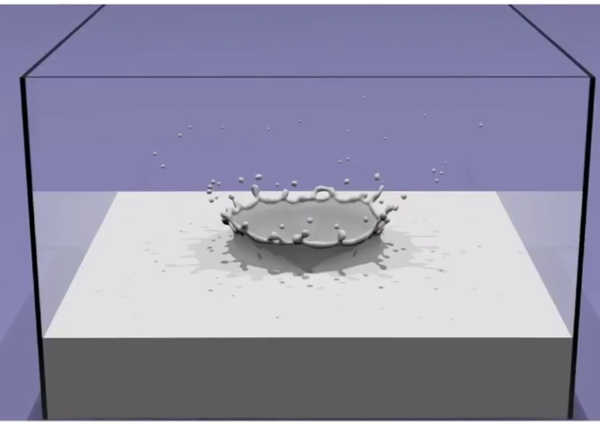

#### Fractals (分形，自相似)

Exhibit self-similarity, detail at all scales.

"Language" for describing natural phenomena.

Hard to control space!

变化频率太高，会引起强烈的走样。

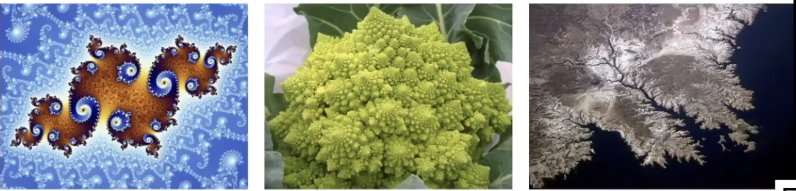

## "Explicit" Representations of Geometry

### 介绍

All points are **given explicitlly** or **via parameter mapping(2d=>3d)**

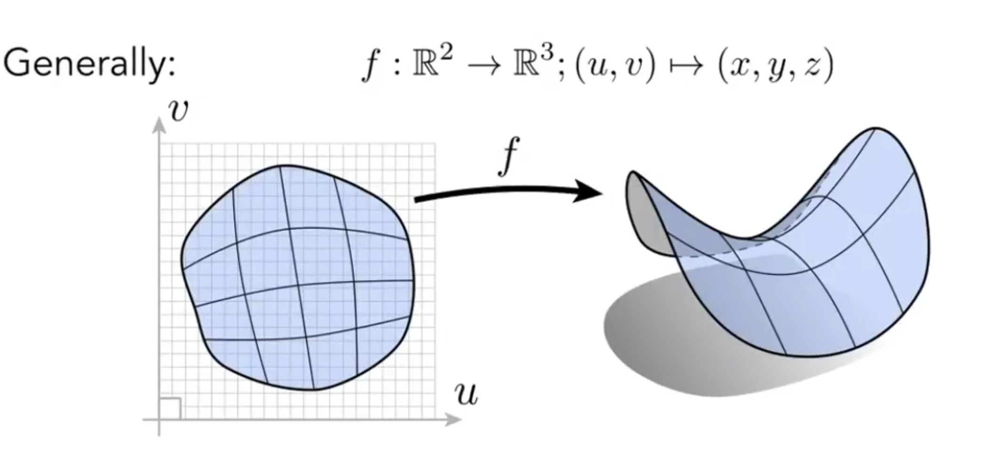

### 优点

好处：sampling is easy。对于parameter mapping，可以遍历一遍uv来得到所有点。

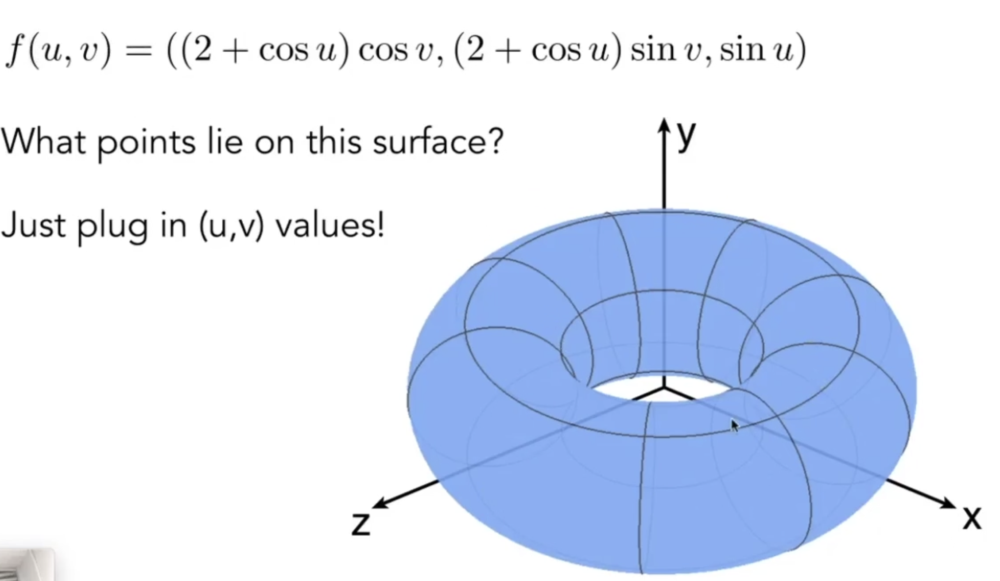

### 缺点

缺点：Inside/Outside test hard

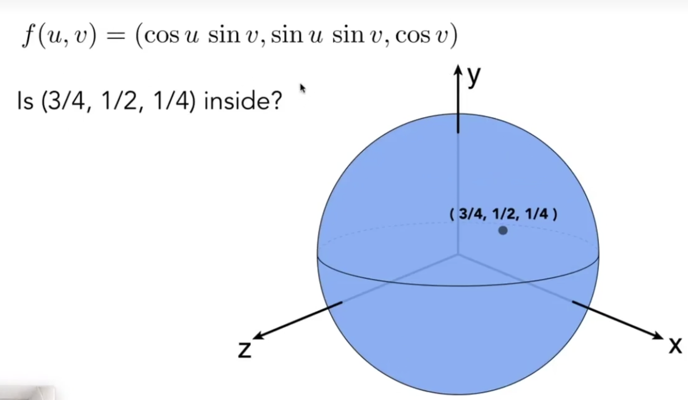

### Many Explicit Representations in Geometry

#### Point clouds

Easiest represnetation: list of points (x, y, z).

Easily represent any kind of geometry.

Useful for large datasets (>>1 point/pixel).

Often converted into polygon mesh.

Difficult to draw in undersampled regions.

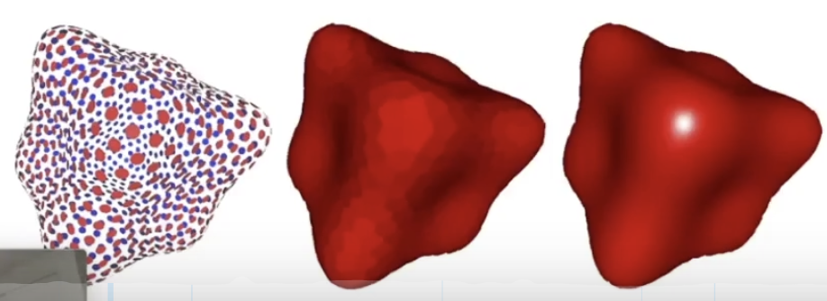

#### Polygon mesh

Store vertices & polygons (often triangles or quads)\
Easier to do processing / simulation, adaptive sampling

平常如何表示用三角形面形成的物体？The Wavefront Object File (.obj) format

Commonly used in Graphics research

Just a text file taht specifies vertices, normals, texture coordinates **and their connectivities**.

下图为一个立方体的.obj文件。

v：vertex，一个立方体有八个点

vn：顶点法向量。法向量的行数通常比顶点的行数多，是因为有一些顶点同时在不同三角形中。

vt：纹理坐标。数量比顶点数量多，因为一个顶点可能参与多个三角形，在不同三角形中有不同的纹理坐标。

f ：三角面，每个面有三个元素（顶点id、纹理坐标、法向量），是用/分隔。

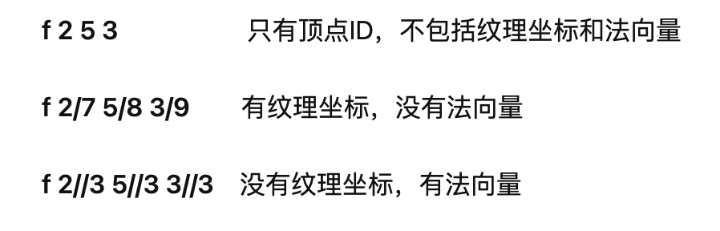

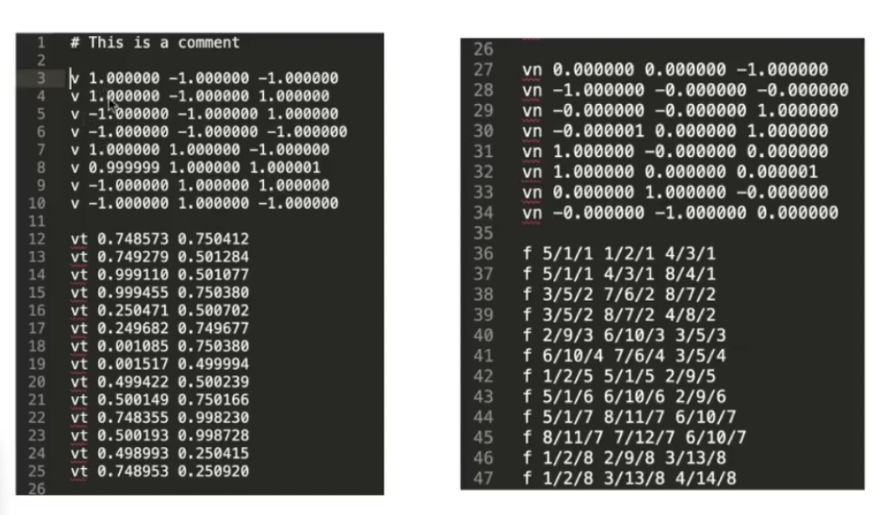

**obj文件的特点**

① 只支持三角形的模型，顶点位置、纹理坐标和法向量必须说明，形如： f #/#/# #/#/# #/#/#；

② 当材料标签被忽略时，纹理贴图须用**顶点坐标对应**的方法完成；

③ 只支持全**三角形**网格模型；

④ 每一行的元素由空格分隔开。

#### Bezier surfaces

#### Subdivision surfaces

#### NURBS

####

# How to choose representations

**Best representation based on task!**

# References

* [Lecture 10 Geometry 1 (Introduction)\_哔哩哔哩\_bilibili](https://www.bilibili.com/video/BV1X7411F744?p=10\&vd_source=a637826c55b409b420b4b6584a6e8379)
* [obj文件格式](https://zhuanlan.zhihu.com/p/552909558?utm_id=0)

> 更新: 2024-01-07 09:58:08  
> 原文: <https://www.yuque.com/viruspc/el3mi0/vf20gy7c4h0dzm28>