# Lecture 11. Geometry (Curves)

- [Summary](#summary)
- [Applications](#applications)
- [Bezier Curves](#bezier-curves)
  * [定义](#%E5%AE%9A%E4%B9%89)
  * [Evaluating Bezier Curves](#evaluating-bezier-curves)
    + [二次贝塞尔曲线](#%E4%BA%8C%E6%AC%A1%E8%B4%9D%E5%A1%9E%E5%B0%94%E6%9B%B2%E7%BA%BF)
    + [三次贝塞尔曲线](#%E4%B8%89%E6%AC%A1%E8%B4%9D%E5%A1%9E%E5%B0%94%E6%9B%B2%E7%BA%BF)
  * [Algebraic Formula](#algebraic-formula)
  * [Bernstein polynomials（伯恩斯坦多项式）](#bernstein-polynomials%E4%BC%AF%E6%81%A9%E6%96%AF%E5%9D%A6%E5%A4%9A%E9%A1%B9%E5%BC%8F)
  * [Properties of Bezier Curves](#properties-of-bezier-curves)
- [Piecewise Bezier Curve](#piecewise-bezier-curve)
  * [引出](#%E5%BC%95%E5%87%BA)
  * [Continuity](#continuity)
- [Other types of splines (样条)](#other-types-of-splines-%E6%A0%B7%E6%9D%A1)
  * [B-spline](#b-spline)
- [References](#references)

---

# Summary
+ 贝塞尔曲线
    - 属于显示定义中的参数映射（parameter mapping）。
    - 通过几个控制点来定义曲线。n阶贝塞尔曲线由n+1个控制点来定义。
    - n阶贝塞尔曲线各项的系数，是((1-t)+t)的n次方的展开式。（贝恩斯坦多项式）。
    - 性质
        * 第一个控制点也是生成曲线的起点，最后一个控制点也是生成曲线的终点
        * 仿射变换下有很好的性质：可以直接对控制点做仿射变换，得到新的控制点。新曲线即为直接对旧曲线进行仿射变换得到的曲线。（投影不行）
        * 凸包（convex hull）性质：生成的曲线一定在凸包内
+ 分段贝塞尔曲线
    - 塞尔曲线存在一定问题：对于高阶贝塞尔曲线，曲线不一定沿着期望的方向弯曲。可以通过分段解决。
    - 一般要求C2连续
+ 样条
    - B样条。
        * 是贝塞尔曲线的扩展。与贝塞尔曲线相比：
            + 需要比贝塞尔曲线更多的信息。
            + 满足贝塞尔曲线的所有特性。
            + 具有局部性。贝塞尔曲线中，动一个点，会影响曲线上的所有部分，缺少局部性。（不考虑分段贝塞尔的前提下，不能单独对某个局部进行调整）。

# Applications
1. Camera paths
    1. 
2. Animation Curves
    1. 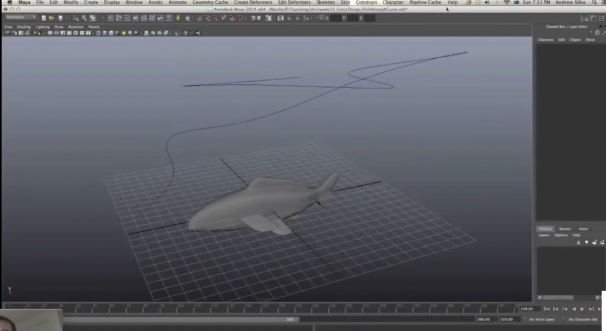
3. Vector Fonts
    1. 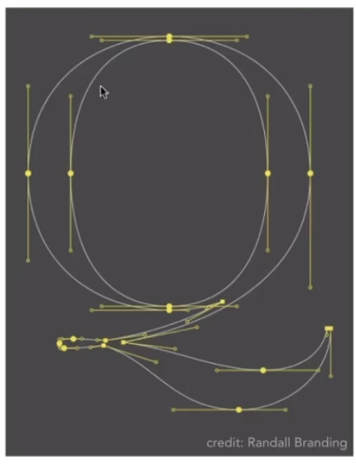

# Bezier Curves
## 定义
显式定义，通过参数定义

通过n+1个控制点来定义n阶贝塞尔曲线

Define Cubic Bezier Curve with tagents：四个控制点。起点终点：p0和p3，两个切线：3(p1-p0)和3(p3-p2)

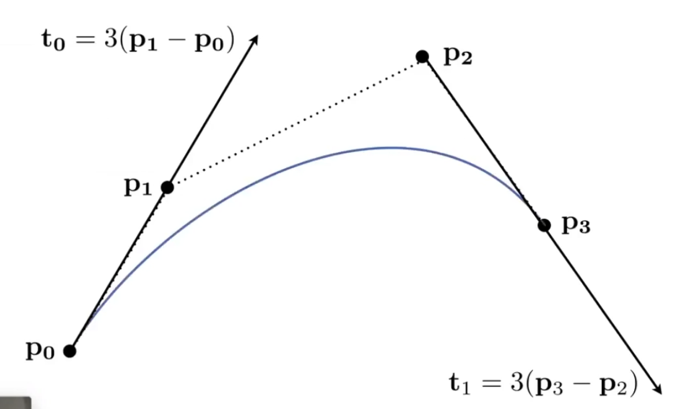

## Evaluating Bezier Curves
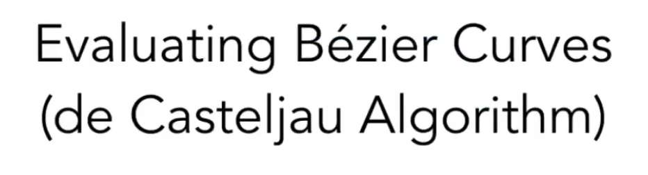

给定任意数量控制点，如何绘制贝塞尔曲线

### 二次贝塞尔曲线
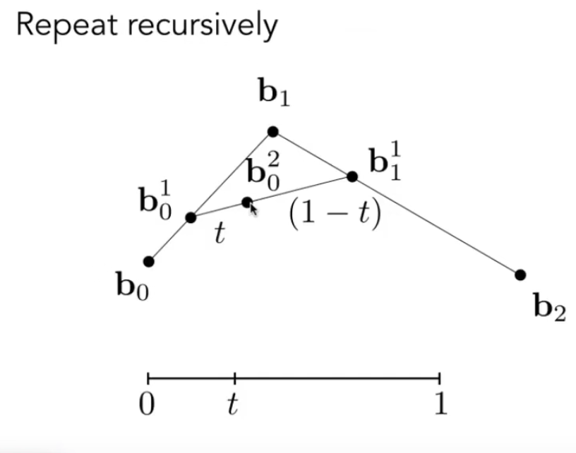

### 三次贝塞尔曲线
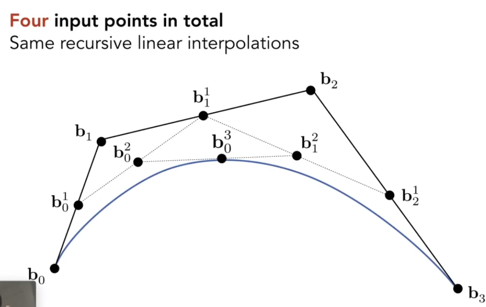

## Algebraic Formula 
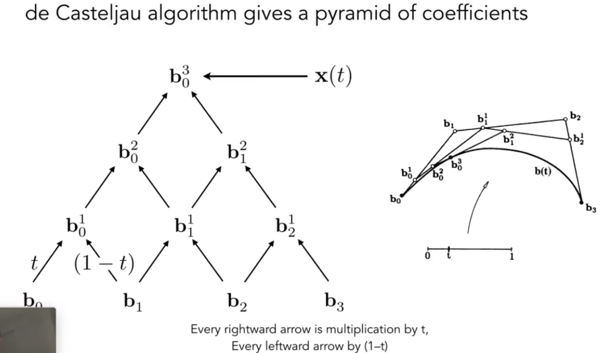

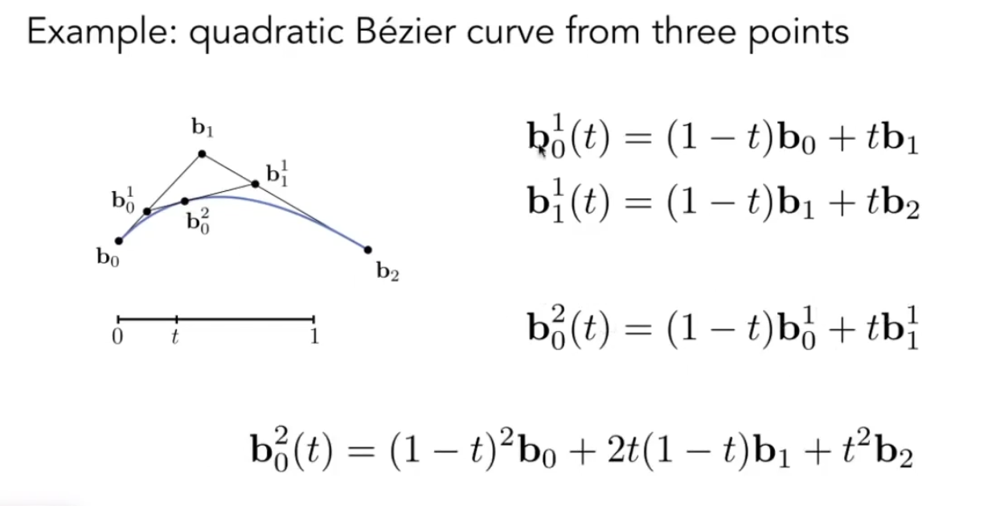

可以发现，系数是((1-t)+t)^2的展开式

不仅如此，n阶贝塞尔曲线各项的系数，是((1-t)+t)的n次方的展开式。

可用二项式定理展开，得到伯恩斯坦多项式。（伯恩斯坦多项式就是一个描述二项分布的多项式）

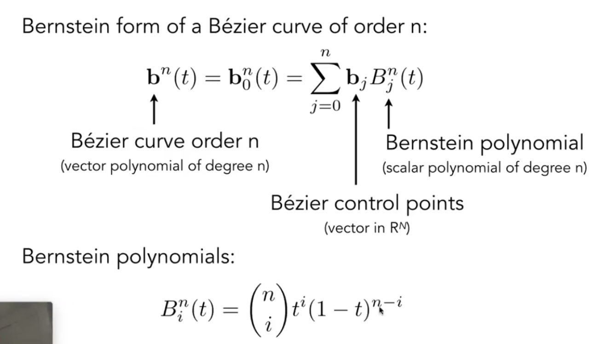

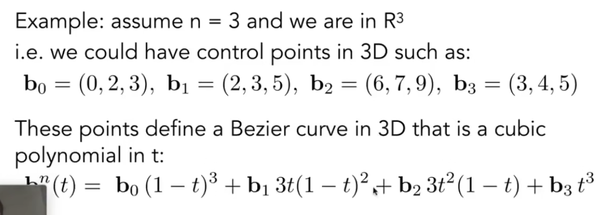

## Bernstein polynomials（伯恩斯坦多项式）
相当于对1的n阶展开

对于n阶展开，任意位置竖直画一条线，直线与所有展开曲线的交点的y值之和为1.

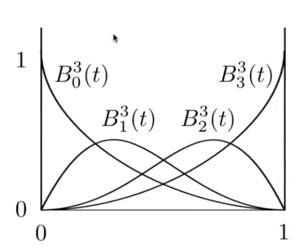

## Properties of Bezier Curves
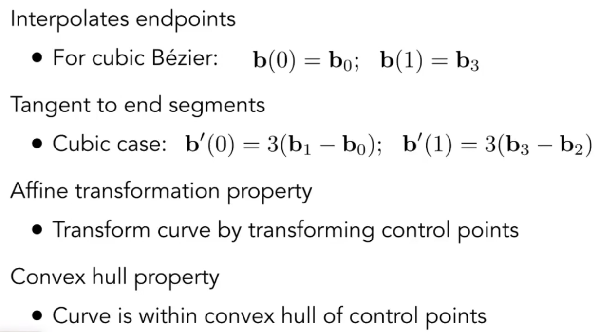

Tagent to end segments 中，不同阶贝塞尔曲线前面的系数不同，不一定为3

仿射变换下有很好的性质：可以直接对控制点做仿射变换，得到新的控制点。新曲线即为直接对旧曲线进行仿射变换得到的曲线。（投影不行）

凸包（convex hull）性质：生成的曲线一定在凸包内

什么是凸包？能够包围一系列几何形体的最小凸多边形 。

例如，如果一条贝塞尔曲线的控制点大致在一条直线上，那么曲线在形状上 大致也等同于直线。

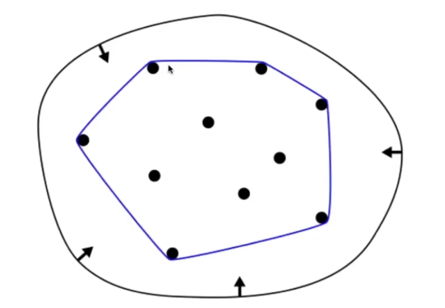

# Piecewise Bezier Curve
## 引出
贝塞尔曲线存在一定问题，可以通过分段解决。

问题：对于高阶贝塞尔曲线，曲线不一定沿着期望的方向弯曲。

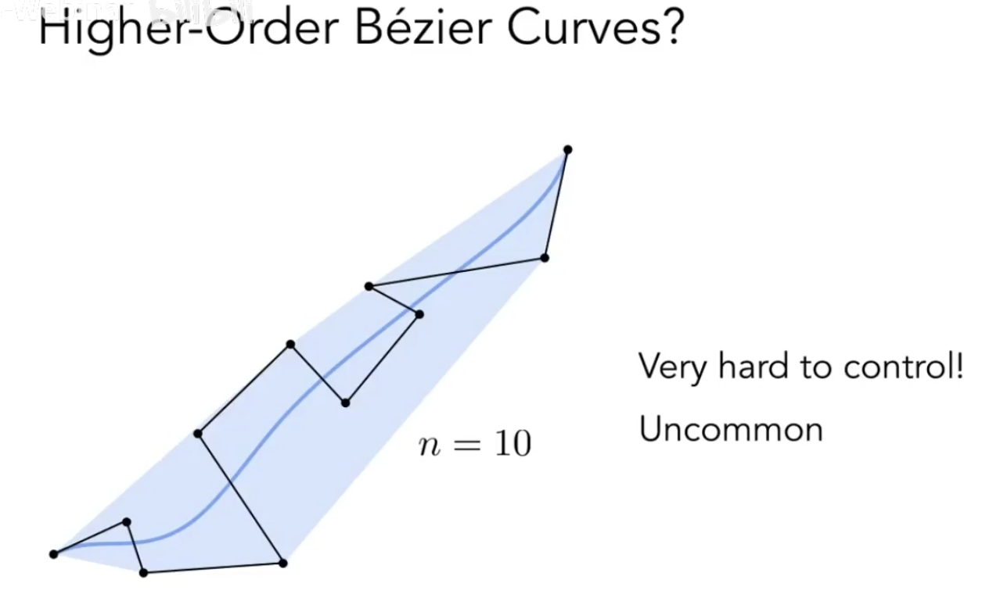

解决方案：将一个高阶贝塞尔曲线拆成很多低阶贝塞尔曲线，逐段定义。一般拆成多个**三次贝塞尔曲线**，每四个控制点拆一次。

为了美观，一般只连前两个点和后两个点，不连中间两个点。被广泛应用在各个软件中。

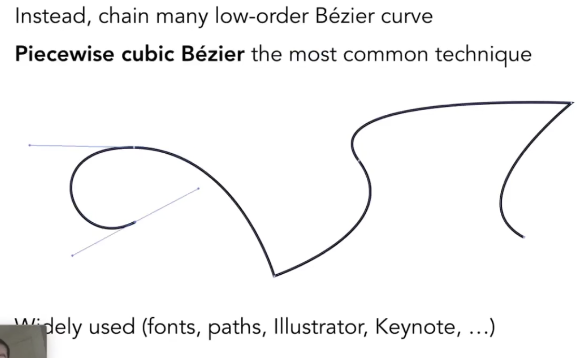

如何保证两个贝塞尔曲线的连接点光滑(C2连续)？

1. 控制点连续（必然满足，不满足则两个曲线不相连）
2. 连接点与前后两个控制点在同一条直线上（连接点左右切线方向一致。几何连续）
3. 通常还认为，两条切线大小也一样。（连接点左右二阶导一致，左右函数增长率一致。参数连续。）

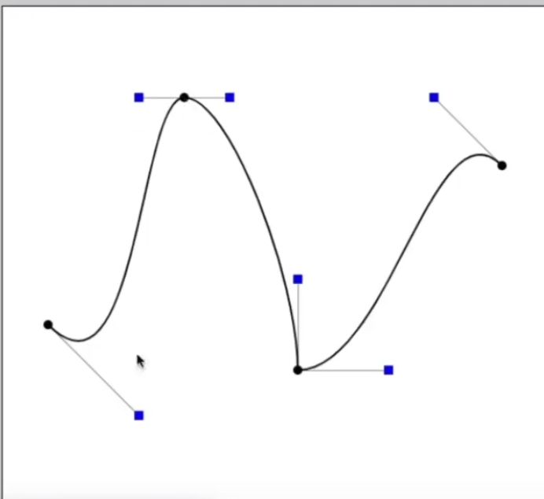

## Continuity
C0连续：两条曲线相连

C1连续：两条曲线在连接点一阶导数相同

C2连续：两条曲线在连接点二阶导数相同

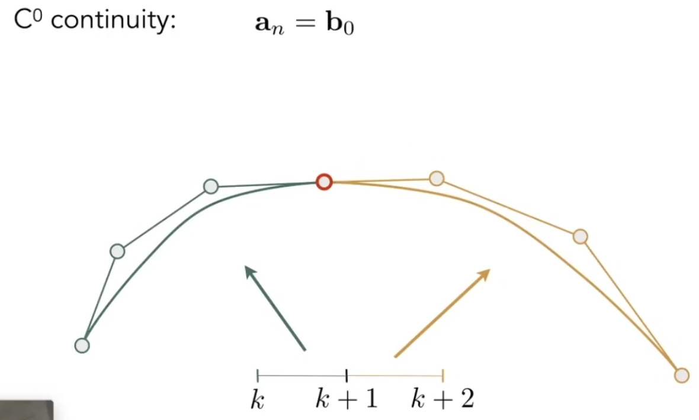

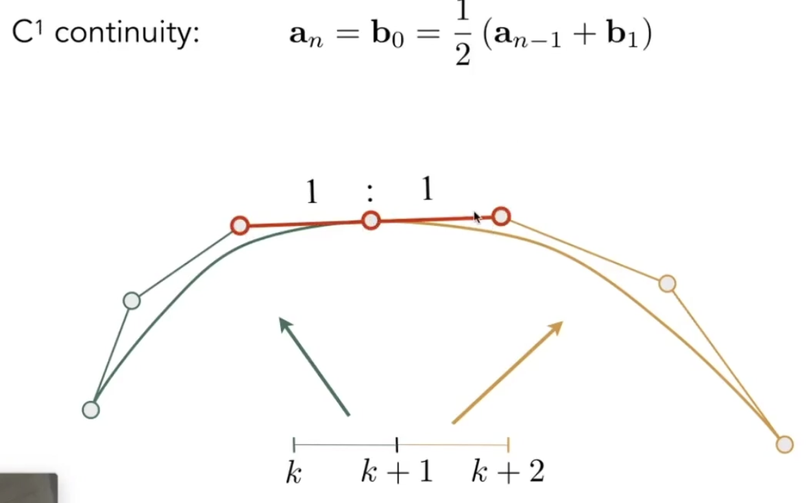C2 共线，方向相同，距离一致 

# Other types of splines (样条)
Spline: a continuous curve constructed as to pass throgthi a given set of points and have a certain of continuouse derivations.

In short, a curve under control.

## B-spline
用的比较多的一种样条。

Short for basis splines

相当于贝塞尔曲线的扩展

Require more information than Bezier Curves

Satisfy all important properties that Bezier Curves have (i.e supeset)

贝塞尔曲线中，动一个点，会影响曲线上的所有部分。缺少局部性，不能单独对某个局部进行调整。（不考虑分段贝塞尔）。B样条具有局部性。

B样条极其复杂，可能是整个图形学里最复杂的一块。

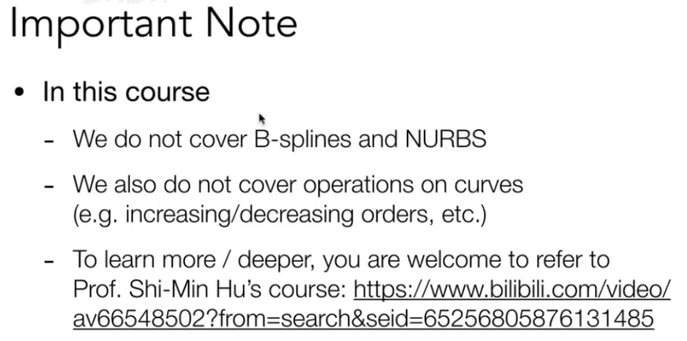

# References
+ [Lecture 11 Geometry 2 (Curves and Surfaces)_哔哩哔哩_bilibili](https://www.bilibili.com/video/BV1X7411F744?p=11&spm_id_from=pageDriver&vd_source=a637826c55b409b420b4b6584a6e8379)
+ [11-6-2Bezier曲线曲面第一节_哔哩哔哩_bilibili](https://www.bilibili.com/video/BV13441127CH?p=11&vd_source=a637826c55b409b420b4b6584a6e8379)

> 更新: 2023-05-01 08:43:50  
> 原文: <https://www.yuque.com/viruspc/el3mi0/sp0hs0ay7b3fheub>