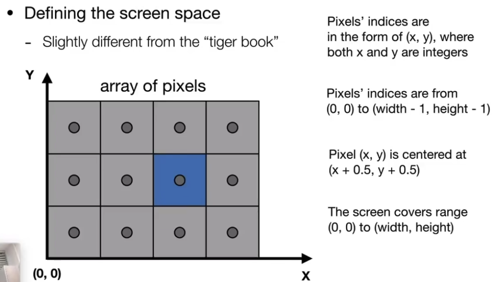
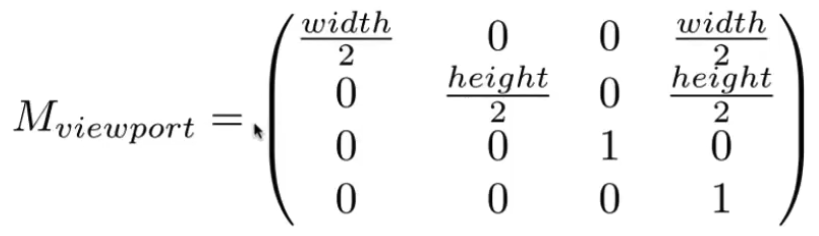
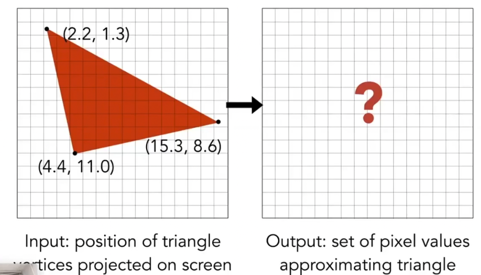
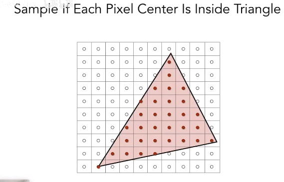
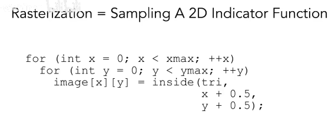
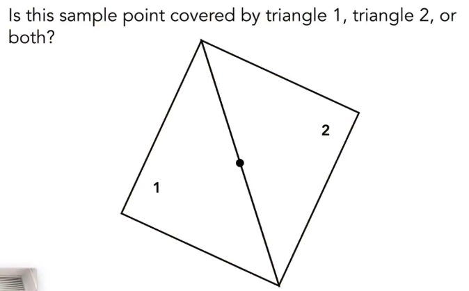
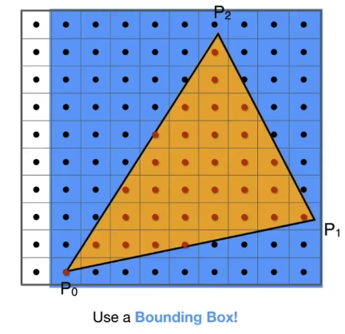
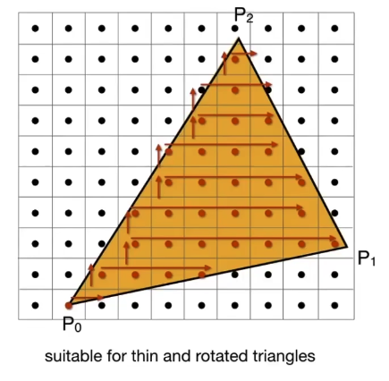

# Lecture 05. Rasterization 1 (Triangles)

- [Summary](#summary)
- [What's after MVP?](#whats-after-mvp)
- [Canonical Cube to Screen](#canonical-cube-to-screen)
  * [基本概念](#%E5%9F%BA%E6%9C%AC%E6%A6%82%E5%BF%B5)
  * [视口变换](#%E8%A7%86%E5%8F%A3%E5%8F%98%E6%8D%A2)
- [显示设备绘制](#%E6%98%BE%E7%A4%BA%E8%AE%BE%E5%A4%87%E7%BB%98%E5%88%B6)
- [Frame Buffer: Memory for a Raster Display](#frame-buffer-memory-for-a-raster-display)
- [Triangles - Fundamental Shape Primitives](#triangles---fundamental-shape-primitives)
- [What Pixel Values Approximate a Triangle?](#what-pixel-values-approximate-a-triangle)
  * [A simple Approach: Sampling](#a-simple-approach-sampling)
  * [inside 函数](#inside-%E5%87%BD%E6%95%B0)
  * [Edge Cases](#edge-cases)
  * [加速](#%E5%8A%A0%E9%80%9F)

---

# Summary
整体流程如下

1. 一个物体一般用三角面拼接而成。
2. MVP （这里的Projection包含了透视除法，opengl中透视除法是不算在MVP里的。OpenGL中，MVP后到clip space，再GPU自动做透视除法到NDC，然后才是viewport transformation到screen space）
    1. Model Transformation
    2. View Transformation
    3. Projection
    4. 得到一些 [-1, 1]^3空间内的三角面
3. Viewport, 视口变换 （NDC 到 屏幕空间）
    1.  [-1, 1]^2  => [0, width] * [0, height]
4. Rasterizing triangles. 视口变换之后，需要将这些三角面，通过栅格化，绘制到FrameBuffer里
    1. Frame Buffer 是用来存放屏幕像素信息的数组，就是要显示的图像/屏幕。
    2. 一般通过采样来做栅格化：判断一个像素点的中心点是否在三角面内
    3. 三角面可以通过向量叉乘判断点是否在面内
    4. 可以通过 bounding box 和 Incremental Triangle Traversal 来加速
5. 将Frame buffer里的图像显示到屏幕上。
    1. 逐行扫描/隔行扫描
    2. 不同显示设备
    3. 设备如何代表一个像素

# What's after MVP?
1. Model transformation (placing objects) (不考虑 world transformation)
2. View transformation (placing camera)
3. Projection transformation
4. Canonical cube to **Screen**

****

# Canonical Cube to Screen
## 基本概念
What is a screen?

1. An array of pixels
2. Size of the array: resolution
3. A typical kind of raster display

Raster == screen in German

1. Rasterize === drawing onto the screen

Pixel （FYI, short for "picture element"）

1. for now: A pixel is a little square with uniform color
2. Color is a mixture of (red, green, blue)

## 视口变换
1. Irrelevant to z
2. Transform in xy plane: [-1, 1]^2 to [0, width] * [0, height]
3. Viewport transform marix:

# 显示设备绘制
逐行扫描

隔行扫描：帧速率加倍。人物高度移动时导致画面撕裂。

# Frame Buffer: Memory for a Raster Display
显示的图像，其实就是内存中的一块区域。

# Triangles - Fundamental Shape Primitives
Why triangles?

1. Most basic polygon
    1. break up other polygons
2. Unique properties
    1. Guaranteed to be planar
    2. Well-defined interior 内部外部定义很清楚，可以通过向量叉乘来直接判断内外
    3. Well-defiend method for interpolating values at vertices over triangle (barycentric interpolation) 容易插值，做渐变

# What Pixel Values Approximate a Triangle?
判断像素的**中心点**与三角形的位置关系。

## A simple Approach: Sampling
于每个像素点，判断点是不是在三角形内。

Very important

Evaluating a function at a point is sampling.

We can discretize a function by sampling.

注意+0.5取中心

## inside 函数
通过cross product就可以判断，判断点是否在三条边向量的同侧。

判断同侧：依次比较三个通道的正负号。

## Edge Cases
当一个采样点落在三角形的边上怎么办？自己定义。opengl中规定的是，如果有点落在三角形的上边和左边的话，认为在三角形内；落在下边和右边的话，认为不在。

## 加速
1. 用bounding box，来减少遍历的像素点数量

2. Incremental Triangle Traversal. 更快？不一定。适用于窄长且旋转45度的三角。

> 更新: 2024-01-09 15:06:09  
> 原文: <https://www.yuque.com/viruspc/el3mi0/gsc6lulrhsozyhrx>