# Lecture 07: Shading 1 (Illumination, Shading and Graphics Pipeline)

- [Summary](#summary)
- [如何解决可见性问题](#%E5%A6%82%E4%BD%95%E8%A7%A3%E5%86%B3%E5%8F%AF%E8%A7%81%E6%80%A7%E9%97%AE%E9%A2%98)
  * [Painter's Algorithm](#painters-algorithm)
  * [Z-Buffer](#z-buffer)
- [shading（着色）](#shading%E7%9D%80%E8%89%B2)
  * [A Simple Shading Model (Blinn-Phong Reflectance Model)](#a-simple-shading-model-blinn-phong-reflectance-model)
  * [Shading is Local](#shading-is-local)
  * [Diffuse Reflection](#diffuse-reflection)
    + [多少光会被点吸收](#%E5%A4%9A%E5%B0%91%E5%85%89%E4%BC%9A%E8%A2%AB%E7%82%B9%E5%90%B8%E6%94%B6)
    + [多少光传播到点附近](#%E5%A4%9A%E5%B0%91%E5%85%89%E4%BC%A0%E6%92%AD%E5%88%B0%E7%82%B9%E9%99%84%E8%BF%91)
    + [Lambertian (Diffuse) Shading](#lambertian-diffuse-shading)
    + [Half Lambert Shading](#half-lambert-shading)
- [References](#references)

---

# Summary
可见性，着色

1. Visibility / occlusion（ray tracing 中的 ray intersection环节也是解决可见性问题）
    1. Painter's Algorithm
    2. Z-buffering
2. Shading
    1. Blinn-Phong Reflectance Model
        1. DIffuse:
            1. Lambertian (Diffuse) Shading
            2. Half Lambert Shading
        2. Specular
        3. Ambient
    2. Blinn-Phong模型对直接光照处理的还可以，但处理不好全局现象，比如阴影、光线的多次弹射。

webgl 代码：[https://github.com/VirusPC/webgl-test/tree/master/src/webgl2/lighting](https://github.com/VirusPC/webgl-test/tree/master/src/webgl2/lighting)

# 如何解决可见性问题
1. Painter's Algorithm (有问题)
2. 深度缓冲/Z-buffer/depth buffer （常用）

## Painter's Algorithm
Inspired by how painters paint

Paint from back to front, overwrite in the frame buffer.

问题：

1. 需要按照深度排序 (O(n log n), for n triangles， nlogn时间用来排序)
2. Can have unresolvable depth buffer
3. 对于深度相同面，不同渲染顺序也可能会导致不同渲染结果

如：三个面相互覆盖，无法判断深度

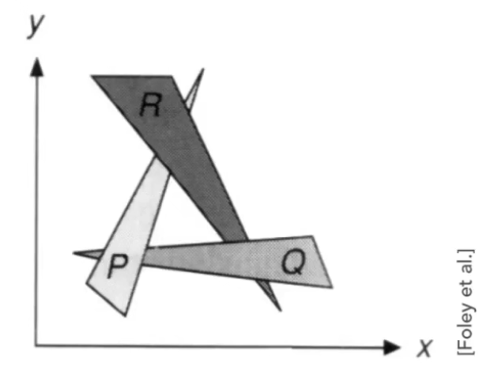

如：上下左右四个面深度相同，但不同顺序会导致不同的渲染结果。

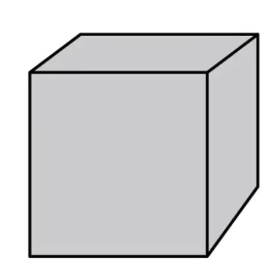

## Z-Buffer
**idea**： 逐面 ❎ 逐像素 ✅

1. 对于每个像素，存储当前的最小 z 值
2. 对于深度值需要一个额外的buffer
    1. frame buffer 存放颜色值
    2. depth buffer (z-buffer) 存放深度

**Important**: 为了简化计算，我们假设 z 总是正的。z越小越近。（transform时，z值假设都是负的，z越小越远）

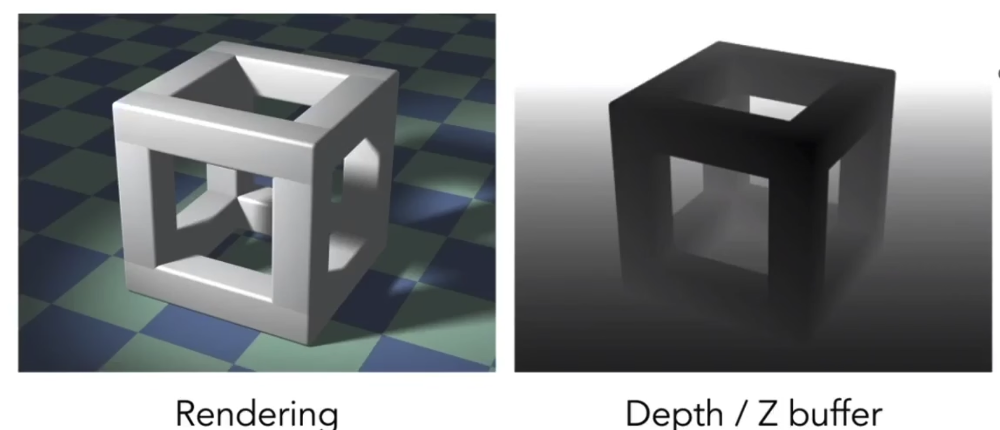

**算法：**

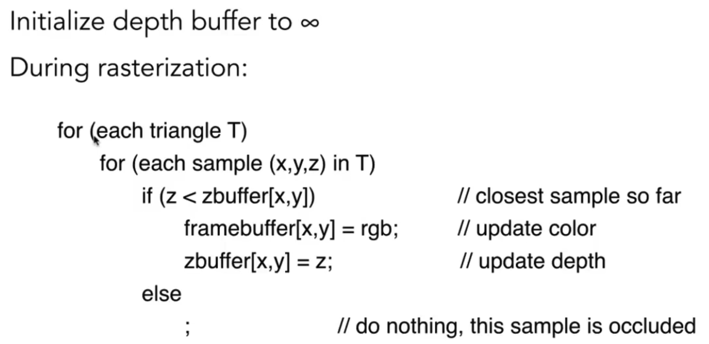

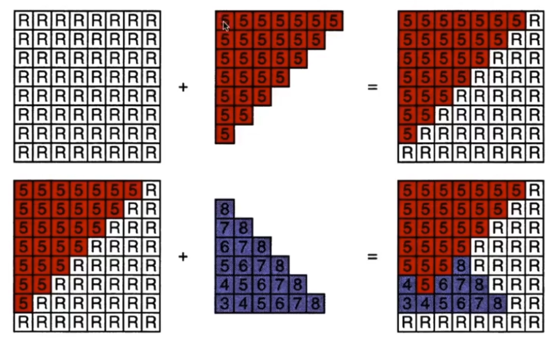

复杂度：

+ 时间复杂度： O(n) for n triangles (assuming constant  coverage). 
+ 比画家算法快, 因为不用排序。

蕴含一个假设，不会有两个三角形，在同一个像素，具有同样的深度。有一定道理，一般几何顶点用浮点数表示，一般很难通过运算得到两个完全相同的浮点数。如果真相等了，有其他方法解决。

 

这是最重要的可见性算法。被是现在在所有的GPU中。

Z-Buffer 处理不了透明物体的深度，透明需要特殊处理。

# shading（着色）
1. MVP
2. rasterization （sampling）
3. then? ... shading, 着色，给像素填充颜色

shading包括设置明暗和涂颜色。

在图形学中，shading指 对物体应用材质的过程。

## A Simple Shading Model (Blinn-Phong Reflectance Model)
Blinn-Phong 反射模型

指出了光线如何与材质进行作用，如何去反射

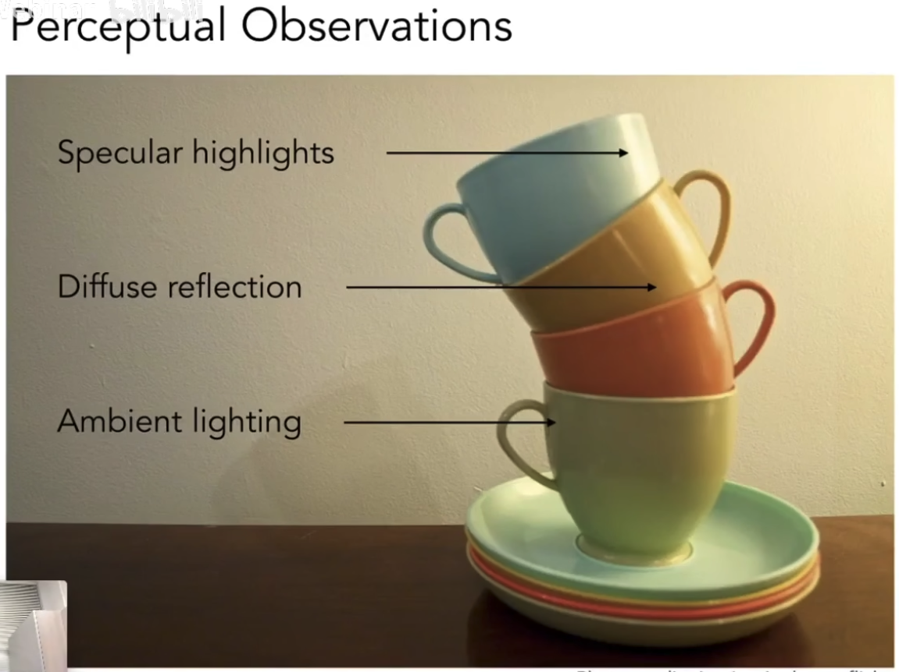

光照射到茶杯上时，茶杯上可以分为以下几个部分：

1. Specular highlights，高光：高亮的地方
2. Diffuse reflection, 漫反射：高亮之外，图中每个杯子上从右到左渐变的部分
3. Ambient lighting，环境光照: 光照不直接照射的地方，通过来自环境的反射光照亮

## Shading is Local
Compute light reflected toward camera  at a specific **shading point**.

local指，考虑任何一个点的光照时，只考虑光照本身，不考虑环境中的其他物体，不考虑遮挡。

**不会产生阴影！ **(shading !== shadow)

Inputs:

1. shading point: 物体上需要着色的一个点
2. n: surface normal, 视一个shading point为一个面，n指平面法线方向
3. l：light direction, 光照方向 (for each of many lights)
4. v: viewer direction, 观察方向
5. surface oparameters: color, shininess(亮度), ...

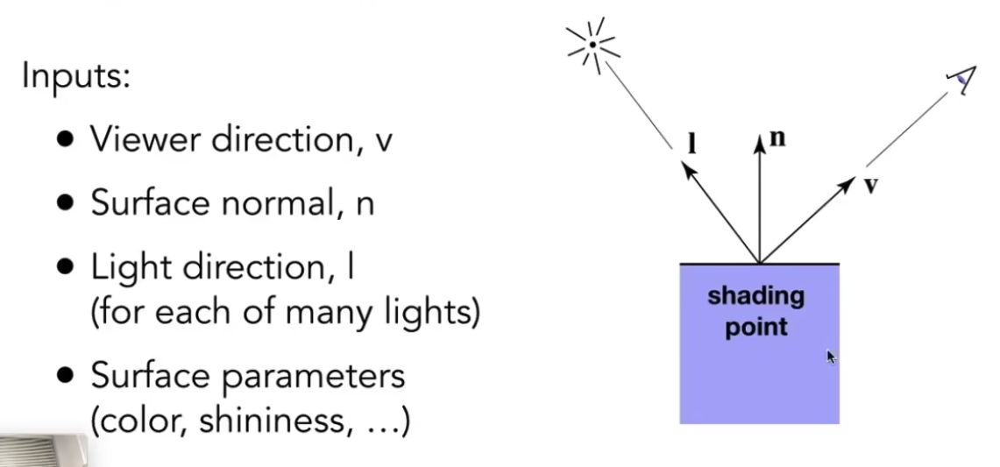

## Diffuse Reflection
Light is scattered uniformly in all directions

+ Surface color is the same for all viewing directions

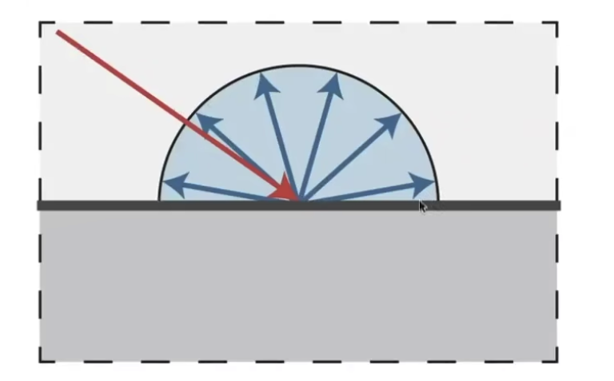

### 多少光会被点吸收
l和n的夹角决定了这个物体有多亮

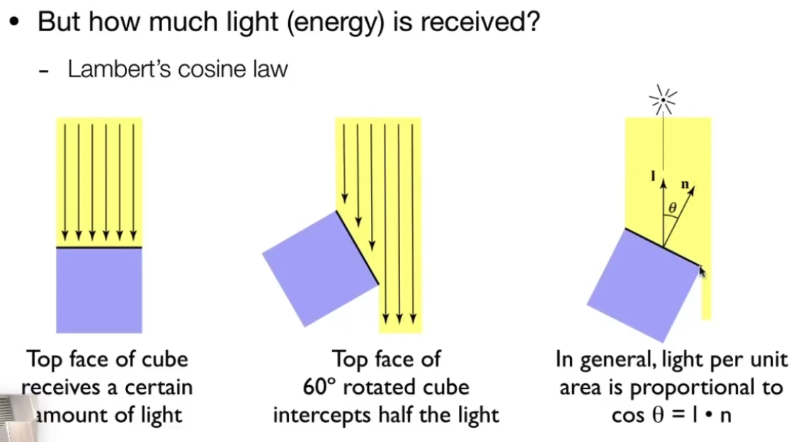

### 多少光传播到点附近
能量在某一时刻，会集中在一个球壳上

每个时刻会产生一个球壳

能量守恒，每个球壳的能量是相同的 => 光传播越远，球壳上每一单位面积的能量（后续Ray tracing部分会提到，这单位能量被称为radiance）越少

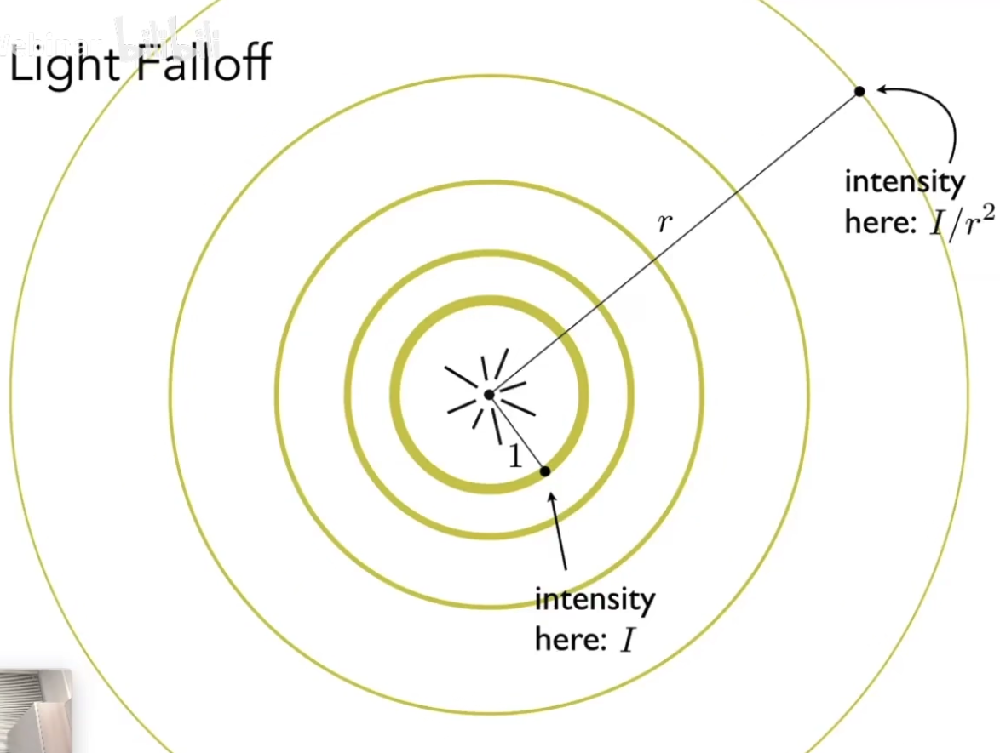

### Lambertian (Diffuse) Shading
Shading independent of view direction

n dot l 是负数时，代表从点（面）的下方投过来，我们认为没有意义，直接让能量为0。

可以看到，漫反射不考虑观察视角v，只考虑l和n。因为漫反射放射到四面八方，每个方向接收到的都是一样的，不用考虑v。

并不是一个真实的物理模型，实际上只乘kd不够。

视角距离point的距离不会有能量损失（事实上之前用能量的比喻本身就是错误的）。

K_d 可以理解为diffuse材质的brdf。（diffuse材质的brdf是常数）

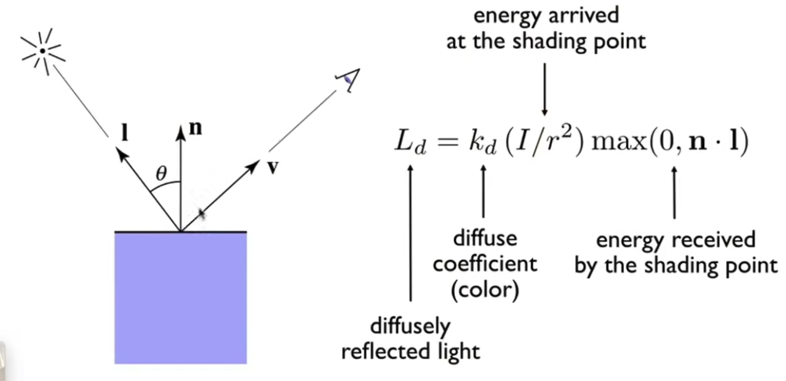

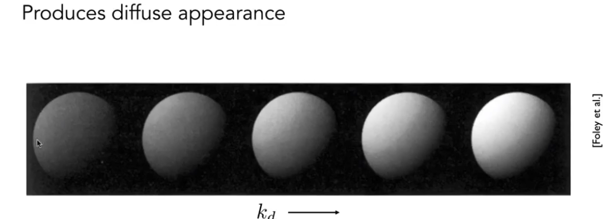

### Half Lambert Shading
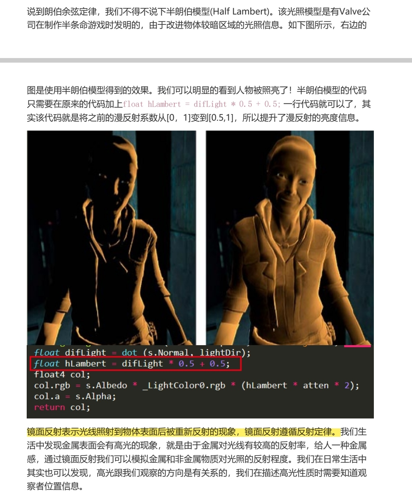

# References
+ [Lecture 07 Shading 1 (Illumination, Shading and Graphics Pipeline)_哔哩哔哩_bilibili](https://www.bilibili.com/video/BV1X7411F744?p=7)
+ [https://web3d-demos.vercel.app/gallery/blinn-phong-model](https://web3d-demos.vercel.app/gallery/blinn-phong-model)

[细说图形学渲染管线](https://zhuanlan.zhihu.com/p/79183044)

+ 

> 更新: 2023-10-17 14:51:53  
> 原文: <https://www.yuque.com/viruspc/el3mi0/vu5pozlvxkmu4m0w>