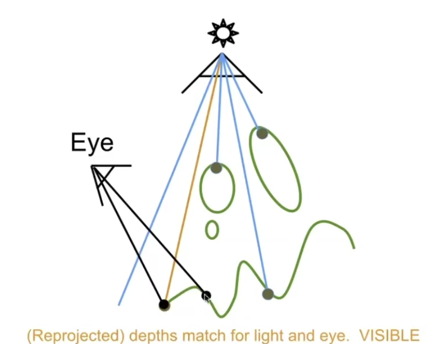
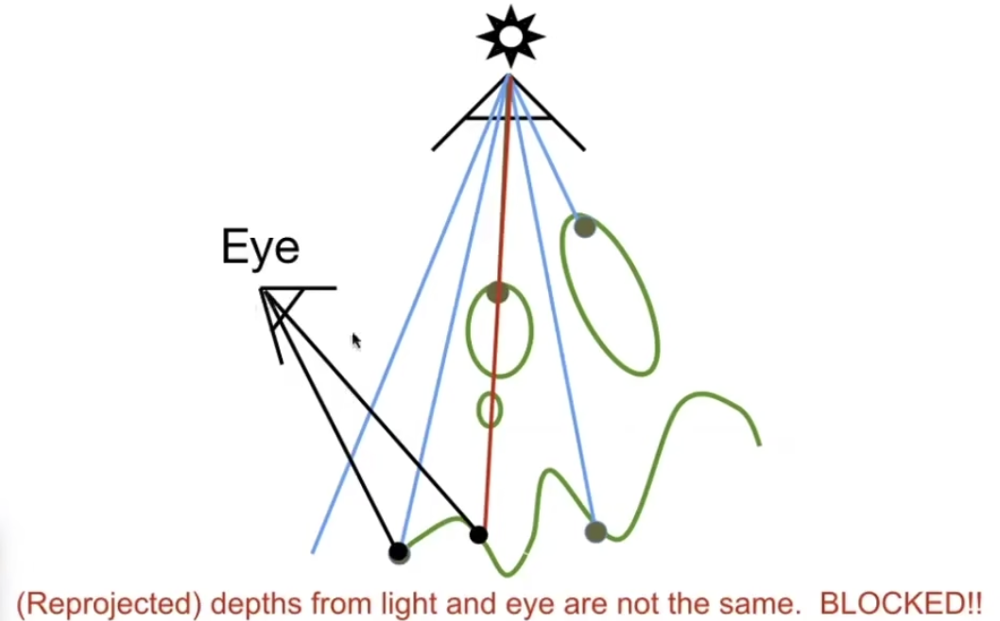
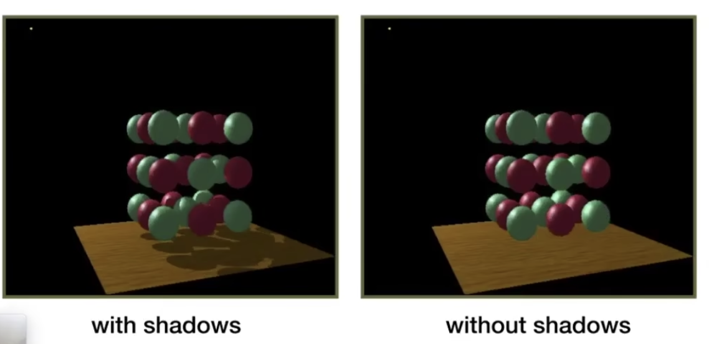
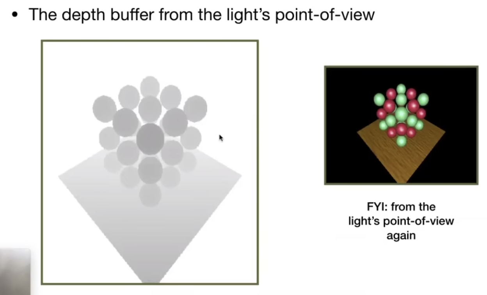
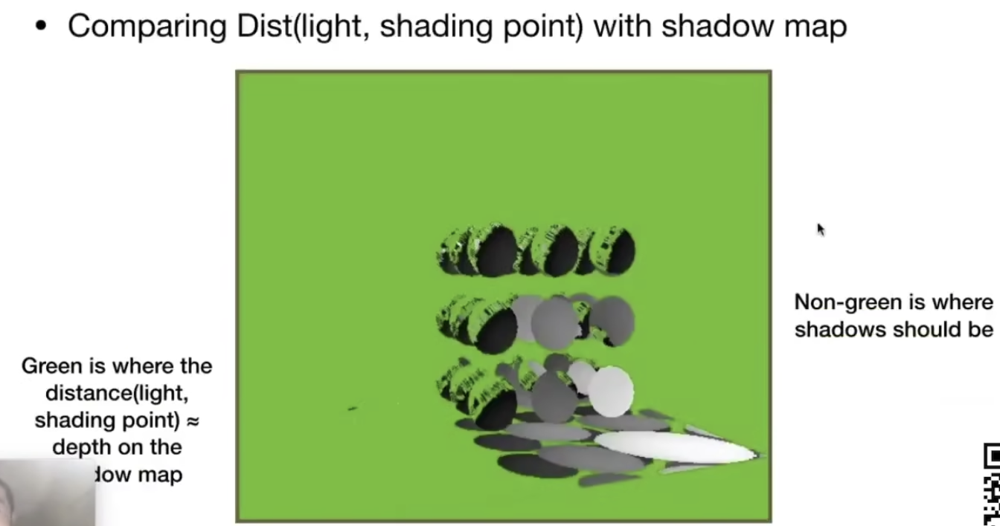
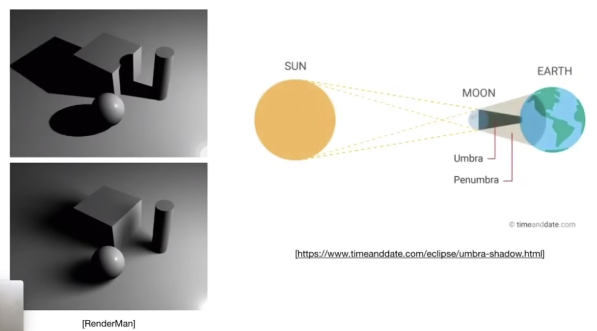

# Lecture 12 Rasterization (shadow mapping)

- [Summary](#summary)
- [Shadow Mapping](#shadow-mapping)
  * [Key idea](#key-idea)
  * [Procedure](#procedure)
  * [Example](#example)
  * [Problems](#problems)
  * [Application](#application)
- [Hard shadows vs Soft shadows](#hard-shadows-vs-soft-shadows)
- [Reference](#reference)

---

# Summary
+ Why？利用栅格化来做**点光源**的阴影。不加阴影会带来物体悬浮在空中的感觉。
+ How？
    - Key idea: the points NOT in shadow must be seen both **by the light** and **by the camera (不在阴影中的点必须同时被灯光和相机看到)**
    - 方法：渲染两趟
        1. 第一趟：从光源处看，记录深度。
        2. 第二趟：从摄像机处看。对于看到的每一个点得到一个深度，将该点投影回光源又能得到一个深度，对比两个深度判断是否相等。如果深度相等，这个点就可以被看到，不在阴影中；否则，在阴影中(存在物体挡在当前点和最近点之间)。
    - 渲染出的结果是硬阴影
+ 存在的问题：
    - 只能处理**点光源**。不考虑间接光照。导致只能生成**硬阴影。**
        * PCSS可以做面光源的软阴影。
    - shadow map**分辨率**导致的锯齿、**自遮挡**和存储空间问题。质量取决于shadow map的分辨率 (general problem with image-basd techniquees). shadow map 的分辨率应该多大？shadow map分辨率太小可能会导致锯齿。太大浪费存储空间计算能力。
        * 自遮挡问题可以通过增加bias来解决。这也是工业界中常用的方法。
            + bias带来新的问题，detach shadow。可以通过 Second-depth shadow mapping 来解决。但工业界中很少用。
    - **浮点数**比较导致的边缘脏问题。需要比较浮点数。计算机比较浮点数困难，数值精度导致边缘脏。

# Shadow Mapping
利用光栅化来做阴影

An image-space Algorithm 图像空间算法

+ no knowledge of scene's geometry during shadow computation 不需要知道场景里的几何信息
+ must deal with aliasing artifacts 会产生走样

## Key idea
+ the points NOT in shadow must be seen both **by the light** and **by the camera**

## Procedure
经典的shadow mapping只能处理点光源。点光源会有明显的阴影边界，一点要么被点光源看到，要么在阴影里，非0即1。硬阴影。

渲染两趟

第一趟：从光源处看，生成一个图。不做着色，只记录深度。

第二趟：从摄像机处看。对于看到的每一个点，投影回光源，可以得到该点对应在深度图里的像素位置。对比该点的深度和深度图里记录的深度，如果深度相同，这个点就可以被看到，不在阴影中；否则，在阴影中。

## Example

## Problems
+ Hard shadows (point lights only)
+ Quality depends on shadow map resolution (general problem with image-basd techniquees). shadow map 的分辨率应该多大？shadow map分辨率太小可能会导致锯齿。太大浪费存储空间计算能力。还会产生自遮挡问题
+ Involves equality comparison of floating point depth values means issues of scale, bias, tolerance. 数值精度导致边缘脏。一个像素包含很多点，不同点实际深度不同。浮点和浮点判断相等是一个非常困难的事情。

## Application
不加阴影会带来物体浮在空中的错觉

几乎所有的3d游戏和早期的3D电影

# Hard shadows vs Soft shadows
hard shadow: 边缘锐利

soft shadow：边缘存在过渡（要求光源存在一定大小，不能是点光源）

从物理角度，影子分为两种：

Umbra（本影）：完全不被光源看到

Penumbra（半影)：部分被光源看到 （软阴影）

# Reference
+ [Lecture 12 Geometry 3_哔哩哔哩_bilibili](https://www.bilibili.com/video/BV1X7411F744?p=12&vd_source=a637826c55b409b420b4b6584a6e8379)

> 更新: 2023-06-28 11:35:08  
> 原文: <https://www.yuque.com/viruspc/el3mi0/rbzdxpphf1clqzy9>