# Ray Tracing (Acceleration of Intersection Test)

- [Summary](#summary)
- [Accelerating Ray-Surface Intersection （Triangles）](#accelerating-ray-surface-intersection-triangles)
- [Bounding Volumes](#bounding-volumes)
  * [Ray-Intersection With Box](#ray-intersection-with-box)
  * [Ray-Intersection with Axis-Aligned Box](#ray-intersection-with-axis-aligned-box)
  * [Why Axis-aligned](#why-axis-aligned)
- [Uniform Spatial Partitions (Grids)](#uniform-spatial-partitions-grids)
  * [Preprocess - Build Acceleration Grid](#preprocess---build-acceleration-grid)
  * [Grid Resolution](#grid-resolution)
  * [When They work well](#when-they-work-well)
  * [When They work fail](#when-they-work-fail)
- [Spatial Partitions](#spatial-partitions)
  * [Spatial Partition Examples](#spatial-partition-examples)
  * [Oct-Tree](#oct-tree)
  * [KD-Tree](#kd-tree)
    + [Preprocessing](#preprocessing)
    + [Data Structure](#data-structure)
    + [Traversing a KD-Tree](#traversing-a-kd-tree)
  * [BSP tree](#bsp-tree)
  * [Bounding Volume Hierarchy (BVH)](#bounding-volume-hierarchy-bvh)
    + [解决问题](#%E8%A7%A3%E5%86%B3%E9%97%AE%E9%A2%98)
    + [Preprocessing](#preprocessing-1)
    + [How to subdivide a node?](#how-to-subdivide-a-node)
    + [BVH Traversal](#bvh-traversal)
  * [Spatial vs Object Partitions](#spatial-vs-object-partitions)
- [SDF](#sdf)
- [References](#references)

---

# Summary
+ Axis-Aligned Bounding Boxes (AABBs) (Accelerating)
    - Understanding - pairs of slabs
    - Ray-AABB intersection
+ Using AABBs to accelerate ray tracing 进一步利用光线和盒子求交，来加速光线与场景求交
    - Uniform grids
    - Spatial partitions
        * Oct Tree
        * KD Tree
            + 给定一个AABB包围盒，我需要知道它和哪些三角形有交集。而三角形和框的交叉判断比较困难（可能出现三角形的三个顶点都不在包围盒中，但他们却相交）。相交算法存在但比较难写。=》kdtree不好写 
            + 一个物体可能出现在多个叶子结点
        * BSP Tree
    - Object partitions
        * BVH
            + 解决了KD tree中一个物体可能出现在多个叶子结点的问题。
+ 用BVH之类的做trace还是太慢了，SDF 可以在shader里快速做tracing

# Accelerating Ray-Surface Intersection （Triangles）
最简单做法：对物体的每个三角面求交。问题：太慢。

Simple ray-scene intersection

• Exhaustively test ray-intersection with every object

• Find the closest hit (with minimum t)

Problem:

• Naive algorithm = #pixels x #objects (× #bounces)

• Very slow!

For generality, we use the term objects instead of triangles later (but doesn't necessarily mean entire objects)

# Bounding Volumes
Quick way to avoid intersections: bound complex object

with a simple volume

• Object is fully contained in the volume

• If it doesn't hit the volume, it doesn't hit the object

• So test BVol first, then test object if it hits

## Ray-Intersection With Box
Understanding: box is the intersection of 3 pairs of slabs (三个不同的对面)

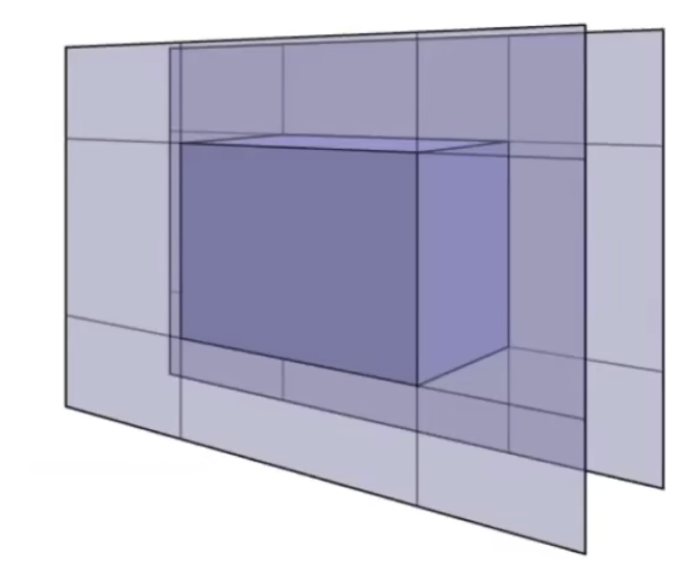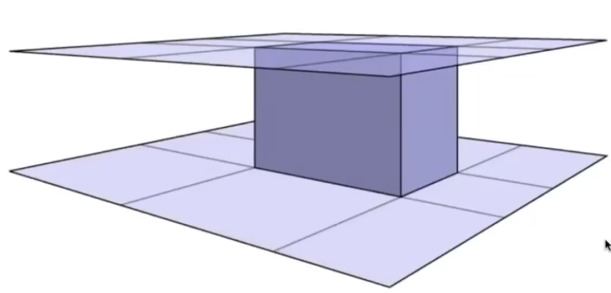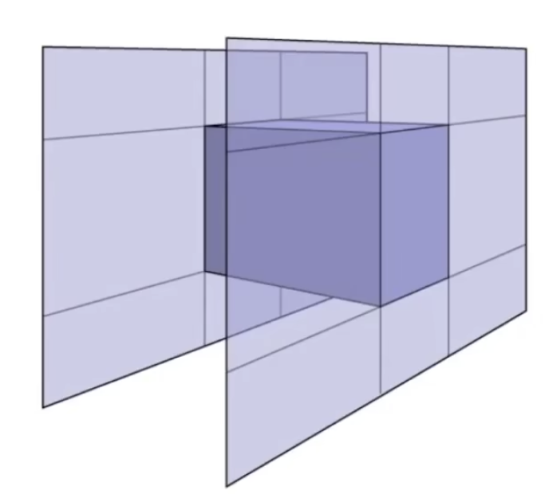

Specifically:

We often use an Axis-Aligned Bounding Box (**AABB**) (轴对齐包围盒）

i.e. any side of the BBis along either x, y, or z axis

## Ray-Intersection with Axis-Aligned Box
2D example; 3D is the same! Compute intersections with slabs and take intersection of tmin/tmax intervals

如何判断光线与2D平面的交点？

1. 求与两个x平面的交点，和与两个y平面的交点
2. 求交

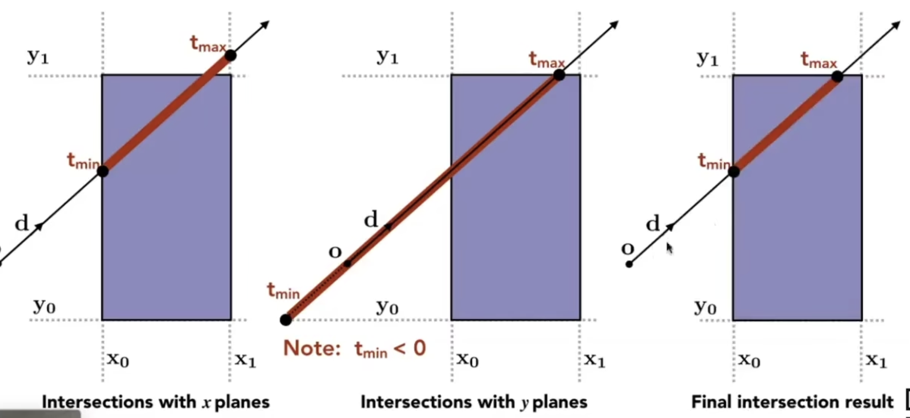

如何判断光线与3D盒子的交点？

Recall: a box (3D) = three pairs of infinitely large slabs

Key ideas

+ The ray enters the box** only when** it enters all pairs of slabs
+ The ray exits the box **as long as** it exits any pair of slabs
+ For each pair, calculate the tmin and tmax (negative is fine)
+ 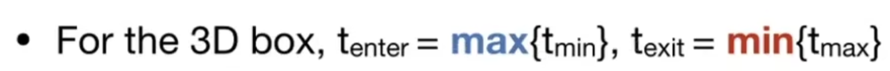
+ If tenter < texit, we know the ray **stays a while** in the box (so they must intersect!) (not done yet, see the next slide)

+ However, ray is not a line
    - Should check whether t is negative for physical correctness!
+ What if texit < 0?
    - The box is "behind" the ray - no intersection!
+ What if texit >= 0 and tenter < 0?
    - The ray's origin is inside the box - have intersection!
+ In summary, ray and AABB intersect iff
    - 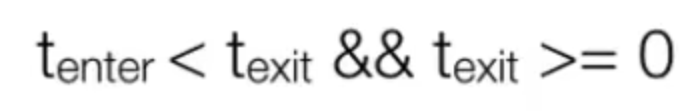

## Why Axis-aligned
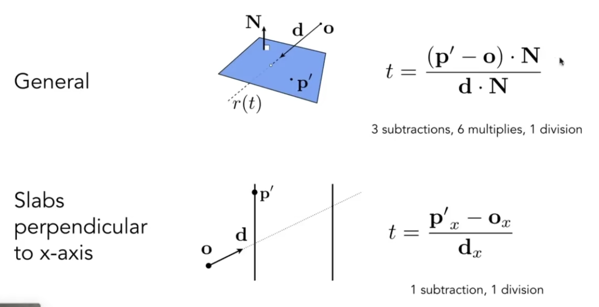

# Uniform Spatial Partitions (Grids)
## Preprocess - Build Acceleration Grid
(图中有处错误，第一行第二列的网格也应该涂灰)

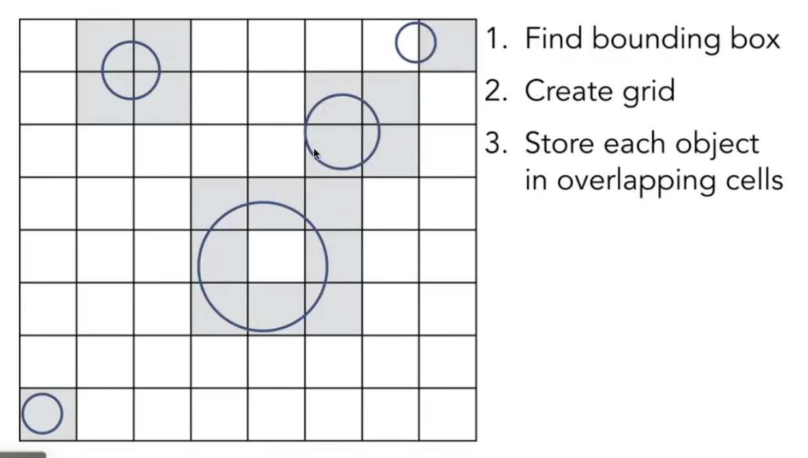

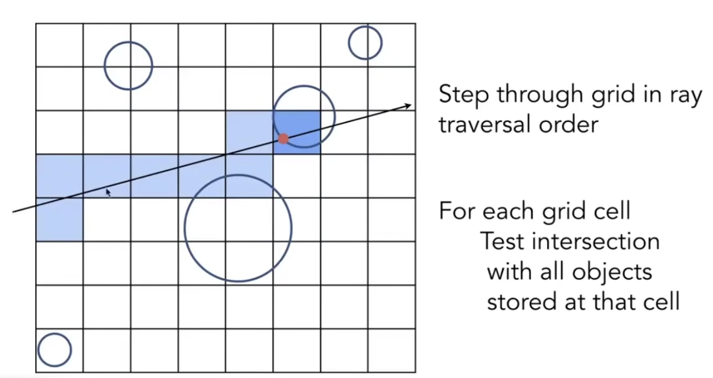

Remind：光线和盒子求交非常快

事实上，不必遍历所有格子。可以利用直线的光栅化算法来找到光线经过的格子，然后对这些格子做相交判定。

## Grid Resolution
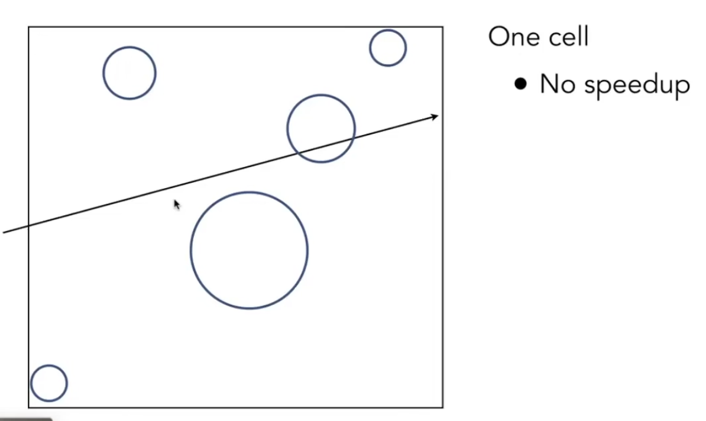

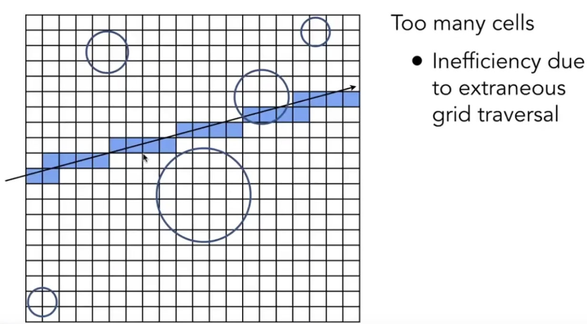

启发式算法：3D情况下令格子数量 = 27 * 物体个数

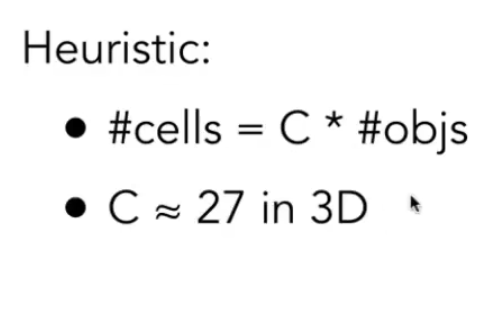

## When They work well
Grids work well on large collections of objects that are distributed evenly in size and space

## When They work fail
分布不均匀。"Teapot in a stadium" problem

# Spatial Partitions
## Spatial Partition Examples
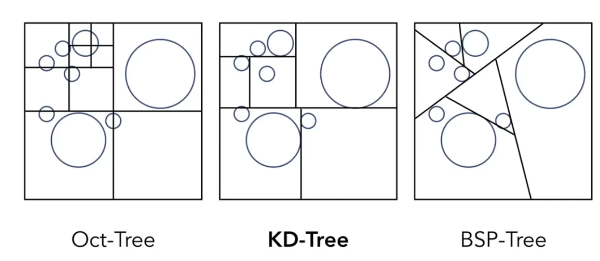

## Oct-Tree
二维叫Quad tree

## KD-Tree
Spatial partition

与八叉树不同，KD树的划分和维度没关系

### Preprocessing
不断选取一个维度的一个点做划分

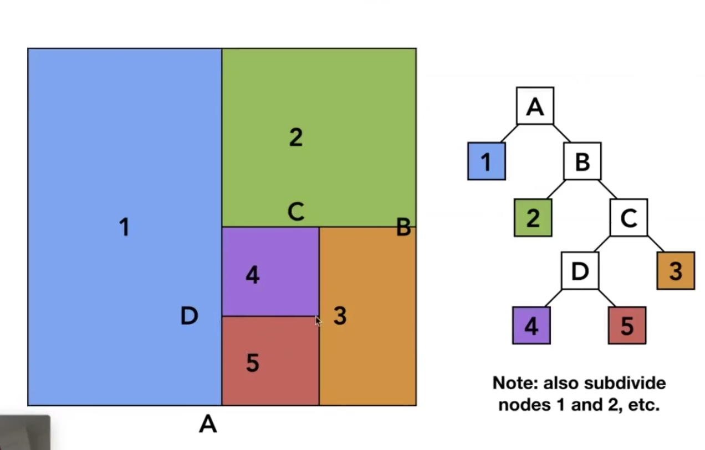

### Data Structure
Internal nodes store

+ split axis: x-, y-, or z-axis
+ split position: coordinate of split plane along axis
+ children: pointers to child nodes
+ **No objects are stored in internal nodes**

Leaf nodes store

+ list of objects

### Traversing a KD-Tree
1. 从根节点向下，对经过的每个节点判断相交
2. 到达叶子节点后，继续对叶子节点中的所有物体判断相交

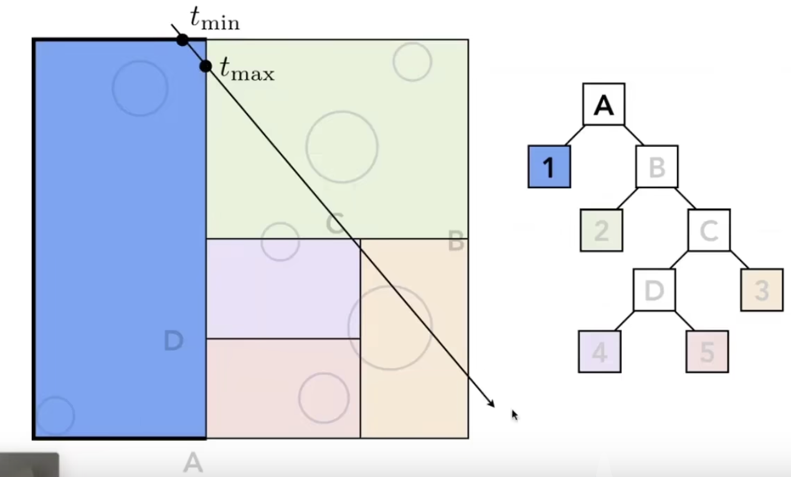

KD-Tree 存在的问题，导致近10年大家不怎么用kd-tree了：

1. 给定一个AABB包围盒，我需要知道它和哪些三角形有交集。而三角形和框的交叉判断比较困难（可能出现三角形的三个顶点都不在包围盒中，但他们却相交）。相交算法存在但比较难写。=》kdtree不好写 
2. 一个物体可能出现在多个叶子结点

## BSP tree 
在KD树的基础上，不要求split plane 横平竖直。

带来问题：

1. 不方便判断相交
2.  高维时超平面会更不好判断相交

## Bounding Volume Hierarchy (BVH)
### 解决问题
解决了一个物体可能出现在多个叶子结点的问题。

Object Partitions，基于物体本身做划分。每一步中，先将物体分成两部分，再重新求包围盒。

实现容易，效果不错，广泛应用

### Preprocessing
不断把物体分成两堆并重新计算包围盒

1. Finding bounding box.
2. **Recursively split set of objects in two subsets**
3. **Recompute the counding box of the subsets**
4. Stop when necessary
5. Store objects in each leaf node

划分尽可能让包围盒重叠的区域小

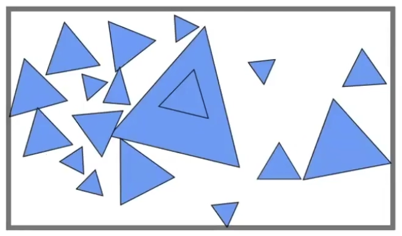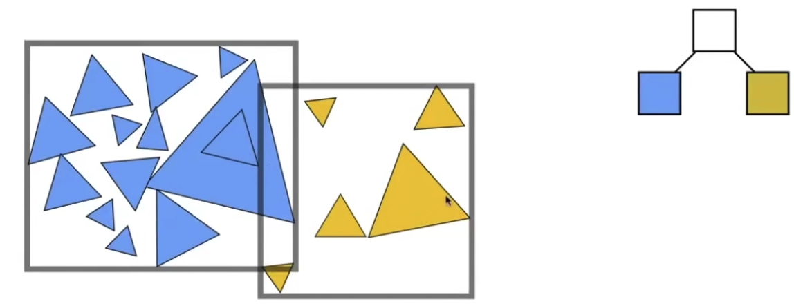

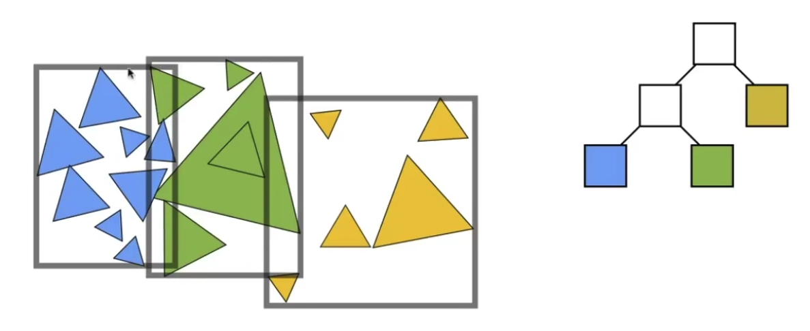

### How to subdivide a node?
划分尽可能让包围盒重叠的区域小

1. Choose a dimension to split
2. Heuristic #1: Always choose the longest axis in node. （空间中值）最长轴变短，使得划分比较均匀。
3. Heuristic #2: Split node at location of **median** object. （数量中值）保证两部分物体数量差不多，树更加平衡，平均搜索次数更少。

Tips:

找中位数不一定需要排序。

1. 先排序再取中间元素的算法的时间复杂度：O(nlogn)
2. 快速选择(quick selection)，找第n/2大的数的最好时间复杂度：O(n)，最坏时间复杂度：O(n^2)，期望时间复杂度为 O(n).
    1. 给定一个数组，将数组排序后第i个位置的元素就是第i大的元素。根据这一想法，可以利用快速排序的过程来做快速选择：不断对第i个元素所在的部分进行划分。[快速选择算法QuickSelect](https://zhuanlan.zhihu.com/p/563316397)
3. quick selection中，每次划分前需要选取主元。主元的选取可以继续利用 BFPRT（median of medians）来改进。改进后最坏时间复杂度也为O(n) [Quicksort变体，Quickselect寻找数组中位数，使用median-of-median of five策略挑选pivot，复杂度O(N)_ShengMingBuZhi的博客-CSDN博客](https://blog.csdn.net/ShengMingBuZhi/article/details/108338662)

### BVH Traversal
同kd-tree

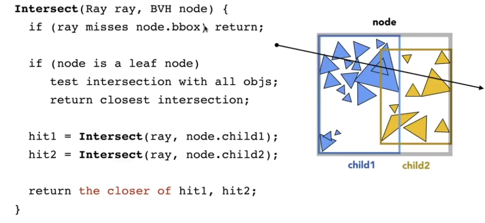

## Spatial vs Object Partitions
Spatial partition (e.g. KD-tree)

+ Partition space into non-overlapping regions
+ An object can be contained in multiple regions

Object partition (e.g. BVH)

+ Partition set of objects into disjoint subsets
+ Bounding boxes for each set may overlap in space

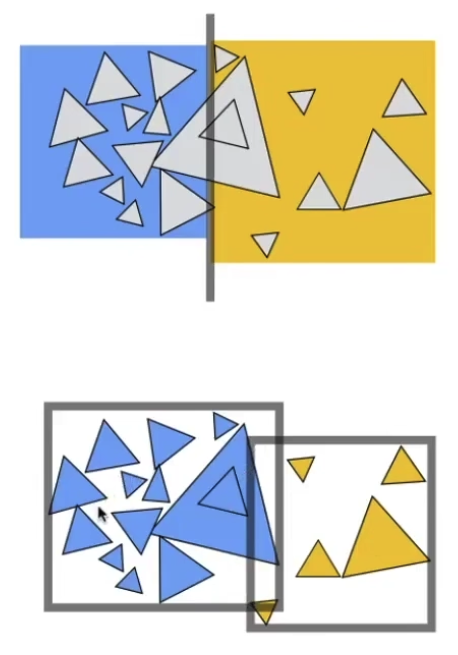

# SDF
用BVH之类的做trace还是太慢了，SDF 可以在shader里快速做tracing

SDF + ray marching

# References
+ [Lecture 14 Ray Tracing 2_哔哩哔哩_bilibili](https://www.bilibili.com/video/BV1X7411F744?p=14&vd_source=a637826c55b409b420b4b6584a6e8379)
+ [BFPRT——Top k问题的终极解法](https://zhuanlan.zhihu.com/p/291206708)
+ [快速选择算法QuickSelect](https://zhuanlan.zhihu.com/p/563316397)
+ [Quicksort变体，Quickselect寻找数组中位数，使用median-of-median of five策略挑选pivot，复杂度O(N)_ShengMingBuZhi的博客-CSDN博客](https://blog.csdn.net/ShengMingBuZhi/article/details/108338662)

> 更新: 2024-01-07 09:58:57  
> 原文: <https://www.yuque.com/viruspc/el3mi0/gat2ecck2r70pko1>