# Ray Tracing (Light Transport and Global Illumination)

- [Summary](#summary)
- [Light Transport](#light-transport)
  * [Bidirectional Reflectance Distribution Function(BRDF)](#bidirectional-reflectance-distribution-functionbrdf)
    + [Reflection at a Point](#reflection-at-a-point)
  * [The Reflection Equation](#the-reflection-equation)
    + [Challenge Recursive Equation](#challenge-recursive-equation)
  * [The Rendering Equation](#the-rendering-equation)
  * [Limitations](#limitations)
- [Global Illumination](#global-illumination)
  * [Understanding the Rendering Equation](#understanding-the-rendering-equation)
  * [Integral Equation](#integral-equation)
  * [Linear Operator Equation](#linear-operator-equation)
  * [Ray Tracing and Extensions](#ray-tracing-and-extensions)
  * [Example Result](#example-result)
- [References](#references)

---

# Summary
本章核心：渲染方程

在考虑到反射/折射的情况下，光是如何弹射的，光线的能量是如何传播的，一个着色点上的不同源的光是如何累加的。

+ Light transport
    - BRDF。 定义反射的函数
    - The reflection equation. 考虑所有入射方向的光，结合BRDF作反射。
    - The rendering equation. Reflection equation 加上能量产生的一项。(只考虑上半球面，暂不考虑折射和散射)
        * 自身发出的radiance+所有角度的（入射radiance * 对应入射方向和反射方向的BRDF * cos(入射角)）
        * 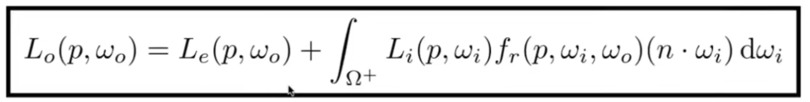
+ Global Illumination
    - 
    - 把光线的传播拆成多次
    - 最后会收敛

# Light Transport
## Bidirectional Reflectance Distribution Function(BRDF)
双向反射分布函数

### Reflection at a Point
用radiance理解反射是什么

BRDF定义了从一个方向进来的能量，如何分散到不同反射方向

一个表面对不同的光线入射角和反射角的组合，拥有不同的反射率。BRDF就是用来对这种反射性质进行定义的。

光线能量从一个方向进来，被物体吸收；然后物体再把能量从其他方向释放出去。

irradiance进来，转化成radiance后再出去

Radiance from direction w; turns into the power E that dA receives. Then power E will become the radiance to any other direction Wo

下图中，E代表irradiance，L代表radiance（luminance）,w代表单位立体角，x代表点

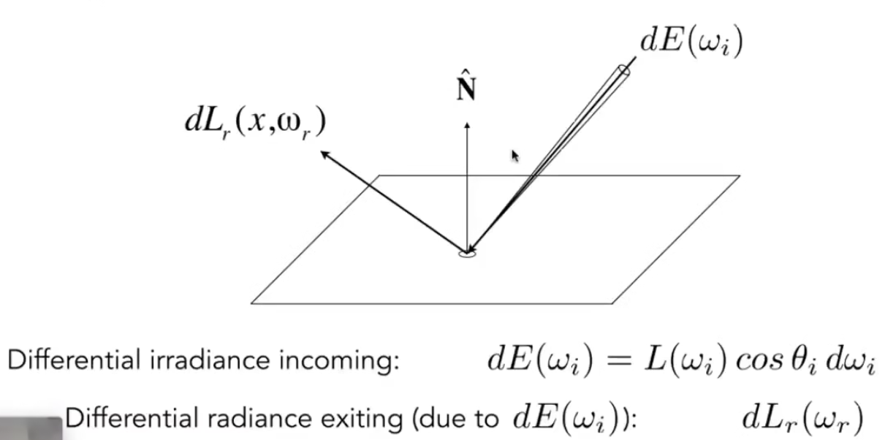

The Bidirectional Reflectance Distribution Function (BRDF) represents how much light is reflected into each outgoing direction Wr from each incoming direction

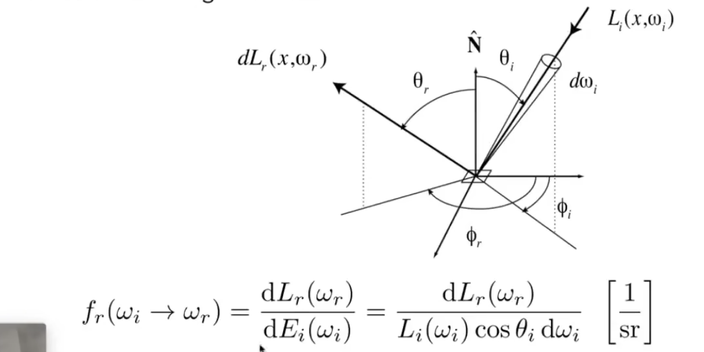

不同的材质有不同的BRDF

## The Reflection Equation
对一个着色点，把每个方向入射的光的irradiance，根据BRDF和出射方向（摄像机方向）加起来

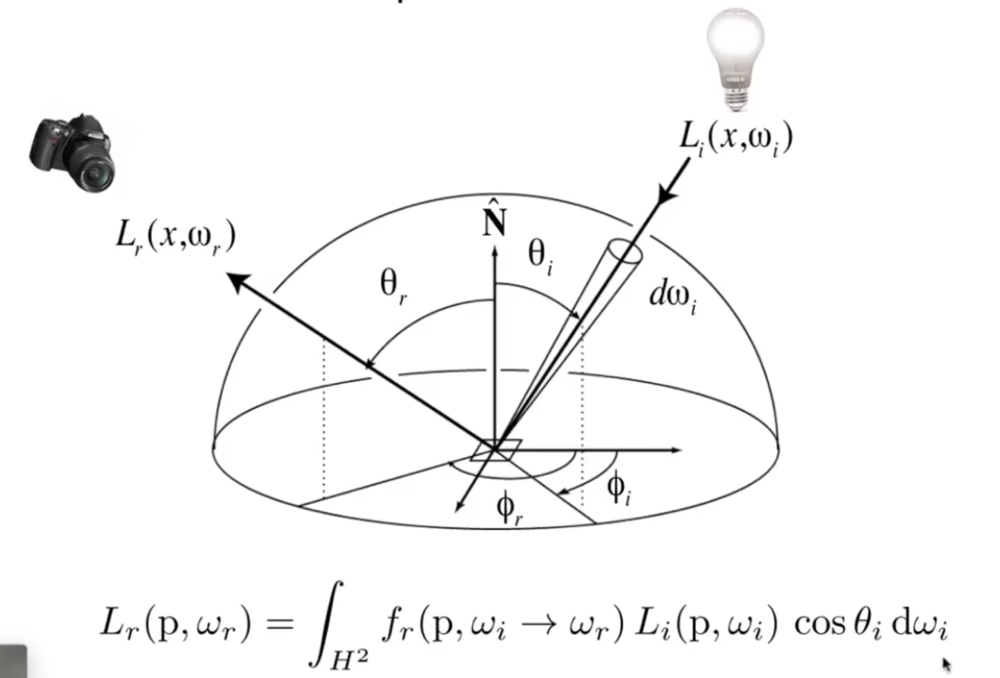

### Challenge Recursive Equation
需要考虑能够到达这个着色点的所有光线。不仅需要考虑光源的光线，还要考虑其他物体反射的光线。

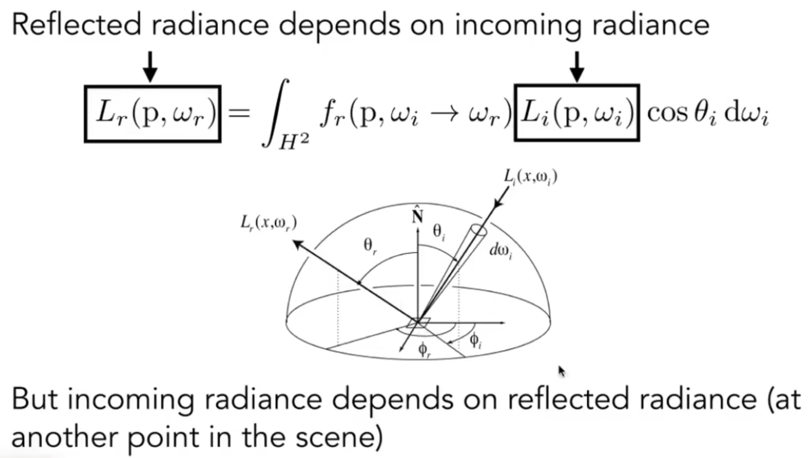

## The Rendering Equation
渲染方程/绘制方程

出射的光（radiance）有两种：自己发的光，反射的别人的光。(暂不考虑折射和散射)

同时考虑这两种光，直接把它们加起来，得到渲染方程。

H^2和Ω都表示半球（下半球看不到光）

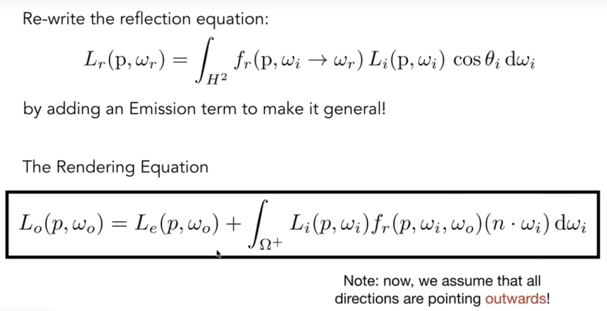

## Limitations
Although the equation is very general, it does not capture every aspect of light reflection. Some missing aspects include the following:

+ [Transmission](https://en.wikipedia.org/wiki/Transmission_(wave_propagation)), which occurs when light is transmitted through the surface, such as when it hits a [glass](https://en.wikipedia.org/wiki/Glass) object or a [water](https://en.wikipedia.org/wiki/Water) surface, (只考虑上半球面)
+ [Subsurface scattering](https://en.wikipedia.org/wiki/Subsurface_scattering), where the spatial locations for incoming and departing light are different. Surfaces rendered without accounting for subsurface scattering may appear unnaturally opaque — however, it is not necessary to account for this if transmission is included in the equation, since that will effectively include also light scattered under the surface,
+ [Polarization](https://en.wikipedia.org/wiki/Polarization_(waves)), where different light polarizations will sometimes have different reflection distributions, for example when light bounces at a water surface, （菲涅耳项brdf可以考虑极化）
+ [Phosphorescence](https://en.wikipedia.org/wiki/Phosphorescence), which occurs when light or other [electromagnetic radiation](https://en.wikipedia.org/wiki/Electromagnetic_radiation) is [absorbed](https://en.wikipedia.org/wiki/Absorption_(electromagnetic_radiation)) at one moment and emitted at a later moment, usually with a longer [wavelength](https://en.wikipedia.org/wiki/Wavelength) (unless the absorbed electromagnetic radiation is very intense),
+ [Interference](https://en.wikipedia.org/wiki/Interference_(wave_propagation)), where the wave properties of light are exhibited, （几何光学不考虑光的干涉）
+ [Fluorescence](https://en.wikipedia.org/wiki/Fluorescence), where the absorbed and emitted light have different [wavelengths](https://en.wikipedia.org/wiki/Wavelength),
+ [Non-linear](https://en.wikipedia.org/wiki/Nonlinear_optics) effects, where very intense light can increase the [energy level](https://en.wikipedia.org/wiki/Energy_level) of an [electron](https://en.wikipedia.org/wiki/Electron) with more energy than that of a single [photon](https://en.wikipedia.org/wiki/Photon) (this can occur if the electron is hit by two photons at the same time), and [emission](https://en.wikipedia.org/wiki/Emission_(electromagnetic_radiation)) of light with higher frequency than the frequency of the light that hit the surface suddenly becomes possible, and
+ [Doppler effect](https://en.wikipedia.org/wiki/Doppler_effect), where light that bounces off an object moving at a very high speed will get its wavelength changed: if the light bounces off an object that is moving towards it, the light will be [blueshifted](https://en.wikipedia.org/wiki/Blueshift) and the [photons](https://en.wikipedia.org/wiki/Photon) will be packed more closely so the photon flux will be increased; if it bounces off an object moving away from it, it will be [redshifted](https://en.wikipedia.org/wiki/Redshift) and the photon flux will be decreased. This effect becomes apparent only at speeds comparable to the [speed of light](https://en.wikipedia.org/wiki/Speed_of_light), which is not the case for most rendering applications.

For scenes that are either not composed of simple surfaces in a vacuum or for which the travel time for light is an important factor, researchers have generalized the rendering equation to produce a _volume rendering equation_[[5]](https://en.wikipedia.org/wiki/Rendering_equation#cite_note-5) suitable for [volume rendering](https://en.wikipedia.org/wiki/Volume_rendering) and a _transient rendering equation_[[6]](https://en.wikipedia.org/wiki/Rendering_equation#cite_note-6) for use with data from a [time-of-flight camera](https://en.wikipedia.org/wiki/Time-of-flight_camera).

# Global Illumination
**Global illumination**[[1]](https://en.wikipedia.org/wiki/Global_illumination#cite_note-wordpress-1) (**GI**), or **indirect illumination**, is a group of [algorithms](https://en.wikipedia.org/wiki/Algorithm) used in [3D computer graphics](https://en.wikipedia.org/wiki/3D_computer_graphics) that are meant to add more realistic [lighting](https://en.wikipedia.org/wiki/Computer_graphics_lighting) to 3D scenes. Such algorithms take into account not only the light that comes directly from a light source (_direct illumination_), but also subsequent cases in which light rays from the same source are reflected by other surfaces in the scene, whether reflective or not (_indirect illumination_).

## Understanding the Rendering Equation
点光源：

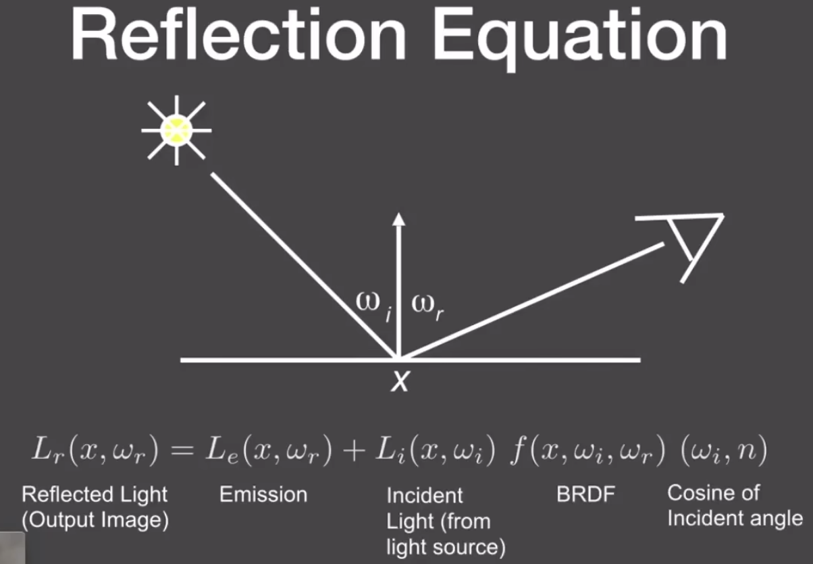

多点光源：求和

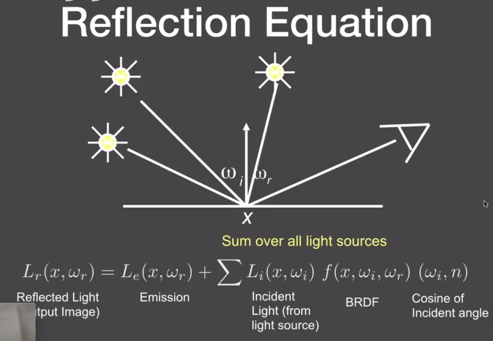

面光源：积分

  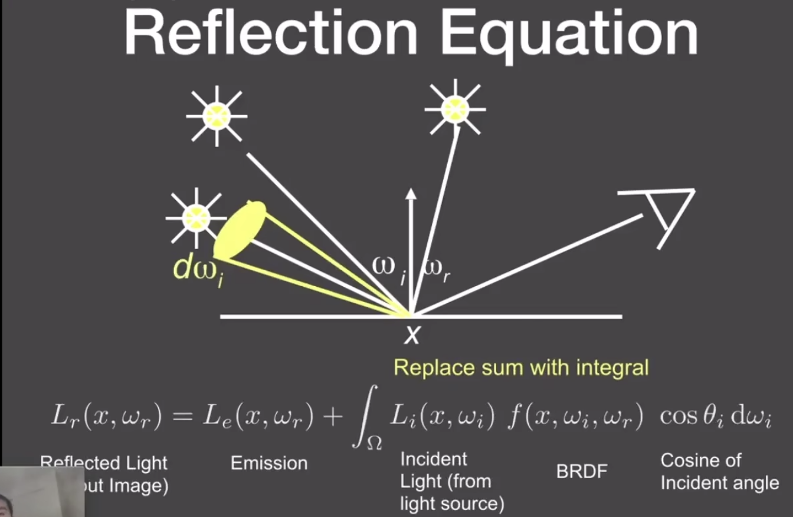

进一步考虑其他面反光到该着色点的光：

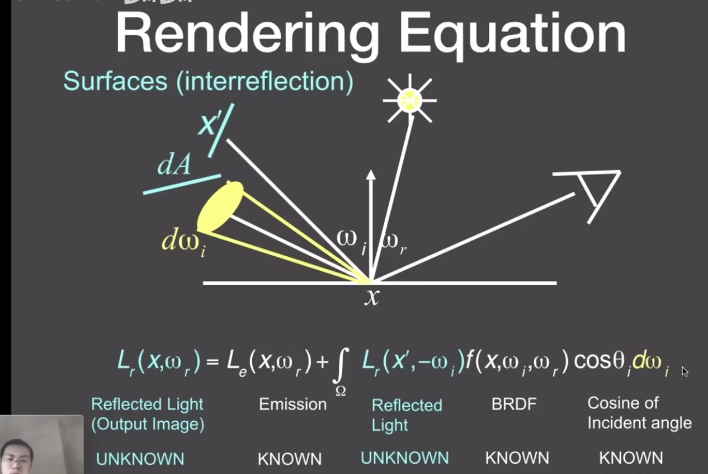

## Integral Equation
两项蓝色的不知道，其他的都知道。可以简写成下式： 

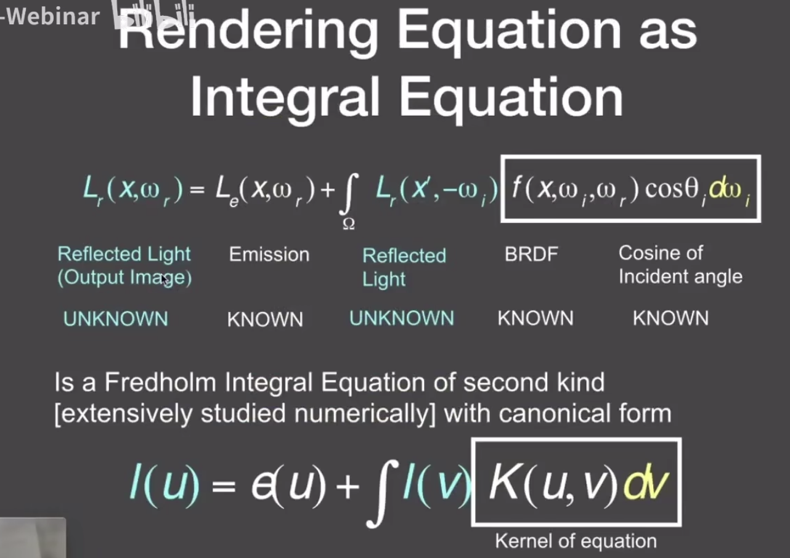 

## Linear Operator Equation
进一步简写，线性代数方程 ：

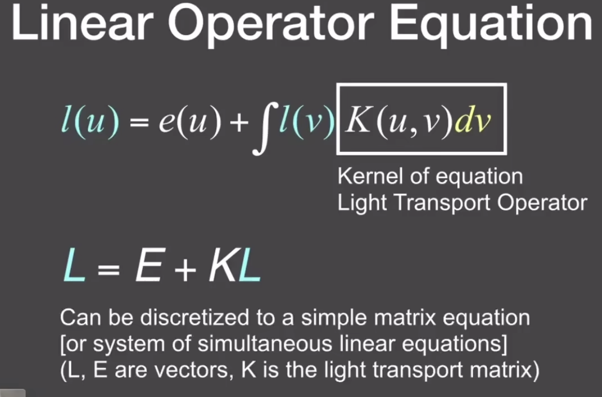 

## Ray Tracing and Extensions
注意L是递归定义的

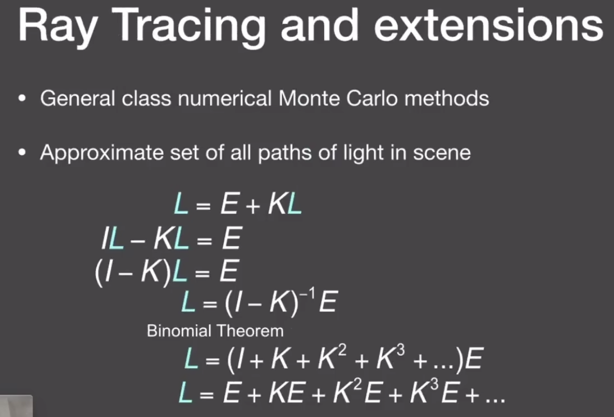

光线多次弹射：

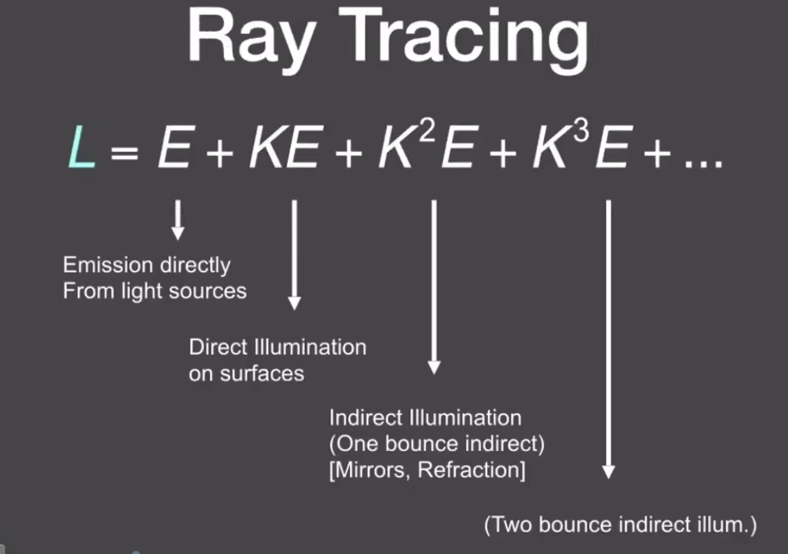

上式所有不同弹射次数的光照加起来，就是**全局光照 **

从光栅化的角度看：

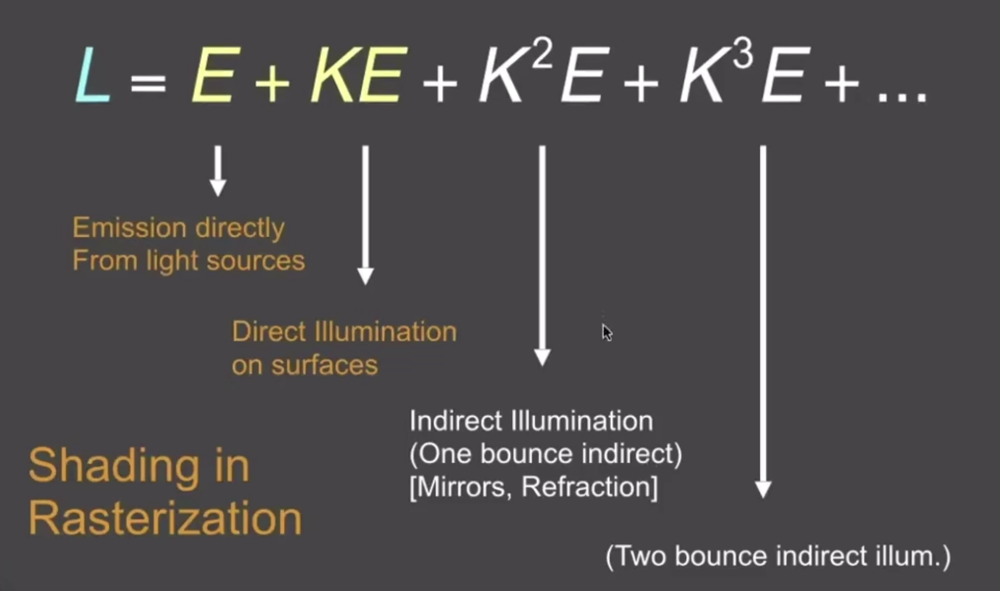

## Example Result
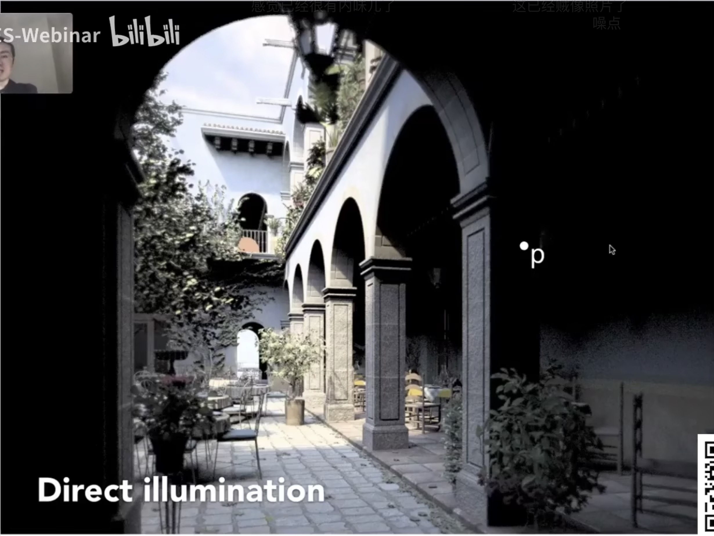

一次间接光照（两次弹射）：

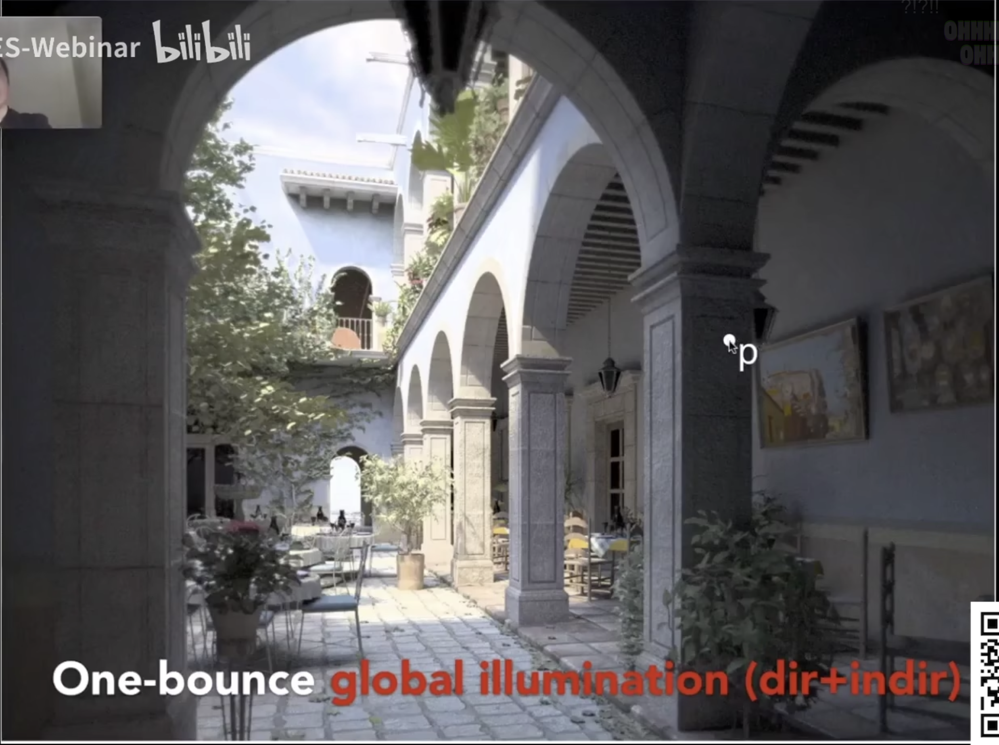

两次间接光照（三次弹射）：

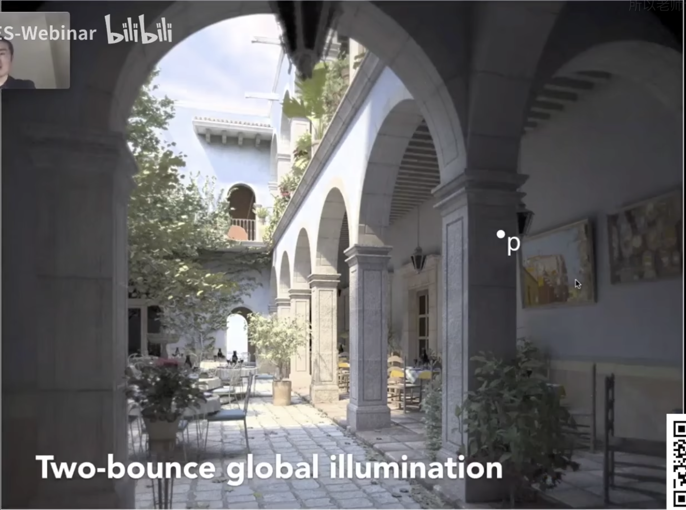

四次间接光照（五次弹射）：

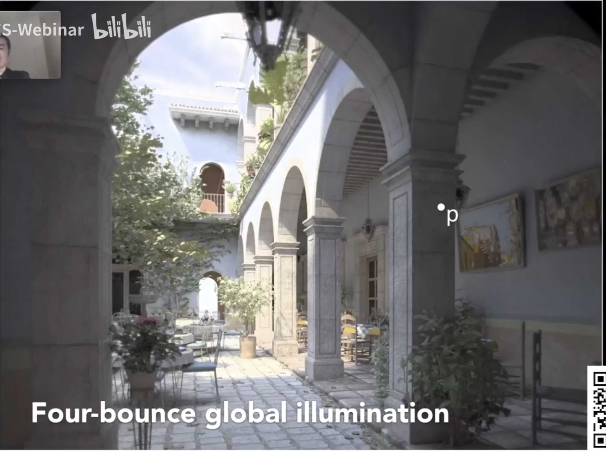

为什么中间最上方的灯，弹射三次是黑的，弹射五次是透明的？弹射三次只够从摄像机进入物体，但出不来（玻璃本身是双层的，经过两次弹射才能进去，再经过两次才能出来）。——这里比较特殊考虑到了光的折射。

最后会收敛到某个固定亮度。

# References
+ [Lecture 15 Ray Tracing 3_哔哩哔哩_bilibili](https://www.bilibili.com/video/BV1X7411F744?p=15&vd_source=a637826c55b409b420b4b6584a6e8379)
+ [Global Illumination](https://en.wikipedia.org/wiki/Global_illumination#:~:text=Global%20illumination%20(GI)%2C%20or,realistic%20lighting%20to%203D%20scenes.)
+ [wiki - Rendering Equation](https://en.wikipedia.org/wiki/Rendering_equation)
+ [1986 - The Rendering Equation](https://www.cs.cmu.edu/afs/cs/academic/class/15462-s13/www/lec_slides/86kajiyaRenderingEquation.pdf)

> 更新: 2023-07-08 04:49:25  
> 原文: <https://www.yuque.com/viruspc/el3mi0/lgmlcdatupyzeb5r>