# Ray Tracing (Path Tracing)

- [Summary](#summary)
- [Probability Review](#probability-review)
  * [Random Variables](#random-variables)
  * [Probabilities](#probabilities)
  * [Expected Value of a Random Variable](#expected-value-of-a-random-variable)
  * [Probability Distribution Function](#probability-distribution-function)
- [Monte Carlo Path Tracing](#monte-carlo-path-tracing)
  * [Monte Carlo Integration](#monte-carlo-integration)
    + [Why](#why)
    + [What & How](#what--how)
    + [Example: Uniform Monte Carlo Estimator](#example-uniform-monte-carlo-estimator)
    + [Equation](#equation)
  * [Path Tracing](#path-tracing)
    + [Motivation: Whitted-Style Ray Tracing](#motivation-whitted-style-ray-tracing)
      - [Problem1](#problem1)
      - [Problem2](#problem2)
    + [Rendering equation is correct](#rendering-equation-is-correct)
    + [A Simple Mento Carlo Solution （only direct illumination）](#a-simple-mento-carlo-solution-only-direct-illumination)
    + [Intoducing Global Illumination](#intoducing-global-illumination)
    + [Problem1: Explosion of Rays](#problem1-explosion-of-rays)
      - [Solution: Path Tracing](#solution-path-tracing)
    + [Problem2: Recursion](#problem2-recursion)
      - [Solution: Russian Roulete (RR)](#solution-russian-roulete-rr)
    + [Path Tracing](#path-tracing-1)
    + [Make Path Tracing more Efficient (Sampling the light)](#make-path-tracing-more--efficient-sampling-the-light)
- [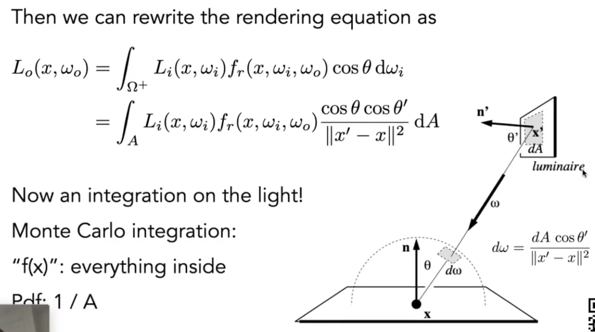](#1683269749817-2b54fba5-93cb-44e0-bab5-141116373eedpngimglimsxklbyibqyko71683269749817-2b54fba5-93cb-44e0-bab5-141116373eed-782967png)
    + [One Final Thing](#one-final-thing)
  * [Problem remians](#problem-remians)
  * [Is Path Tracing Correct?](#is-path-tracing-correct)
- [Ray Tracing: Previous VS Modern Concepts](#ray-tracing-previous-vs-modern-concepts)
- [Things we haven't covered / won't cover](#things-we-havent-covered--wont-cover)
- [References](#references)

---

# Summary
+ Probability Review
+ Monte Carlo Integration
    - why？we want to solve an integral, but it can be too difficult to solve analytically.
    -  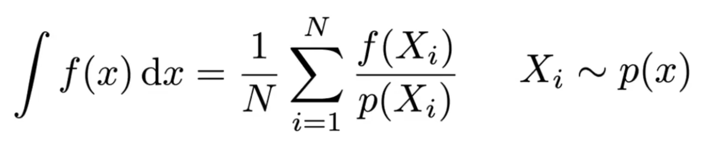
+ Path Tracing
    - Problem? Whitted-Style Ray Tracing 没有仔细考虑漫反射问题，得到的结果是错误的。
        * 光并不一定沿着镜面方向反射（比如对于glossy materials）
        * 光打到漫反射材质后，应该继续反射
    - Solution：Path Tracing 是一个几乎百分百正确(photo realistic)的算法。Path tracing可以解决之前Recursive(Whitted-Style) Ray Tracing只考虑镜面反射，而不考虑漫反射的问题
    - 渲染方程：whitted-style ray tracing章节中的渲染方程仍然是正确的。但对于直接光照，为了提升计算效率，渲染方程需要从按立体角积分改为按光源面积积分。下式中，第一行用于非直接光照，第二行用于直接光照。
        * 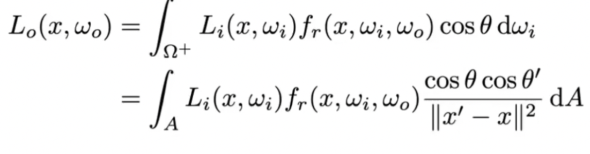
    - 从代码实现角度，需要考虑
        * 如何解这个积分？利用蒙特卡洛积分来解
        * 光线数量的指数爆炸？可以始终假设在每个着色点仅追踪 1 条光线
            + Path随机选取
            + 每个像素只用一条路径噪声太大？每个像素多用几条路径，结果求平均
        * 递归终止条件？通过俄罗斯轮盘赌（Rusion Roulete, RR）来解决无限递归
        * 点光源命中率几乎为0？点光源尽量改成很小的面积光源后再用path tracing
        * 光源采样频率低（光源方向应该增大采样频率）？将半球分为光源部分和非光源部分，光源部分特殊处理。
        * 注意判断光源和着色点之间是否有物体遮挡
    - 注意
        * 把radiance转换成像素颜色需要做gamma correction
    -   方法存在的问题
        *   不好处理点光源，点光源尽量改成很小的面积光源后再用path tracing
    - <font style="color:rgb(18, 18, 18);">Path tracing vs ray tracing</font>
        * <font style="color:rgb(18, 18, 18);">ray tracing是一种光照计算的方式，pathing tracing是ray tracing的一种，主要用来计算全局光照(GI)，所以可以简单的认为ray tracing包含pathing tracing。</font>
        * Path tracing differs from whitted-style ray tracing in that instead of following lots of rays, throughout an entire scene, the algorithm only traces the most likely path for the light.
        * whitted style ray tracing+rendering equation虽然考虑半球面，但只考虑一条折射光和一条反射光，不是真正地考虑所有方向的光。Path tracing真正考虑了所有方向的光。并且即使漫反射也不会让光的传播停止。

# Probability Review
概率论基础

## Random Variables
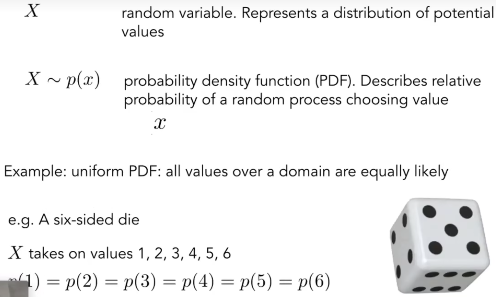

## Probabilities
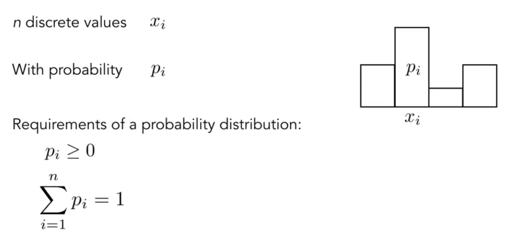

## Expected Value of a Random Variable
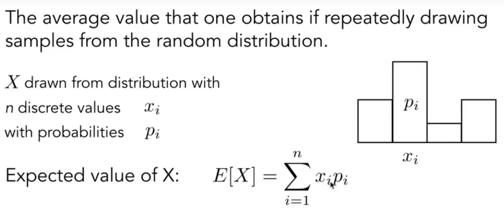

## Probability Distribution Function
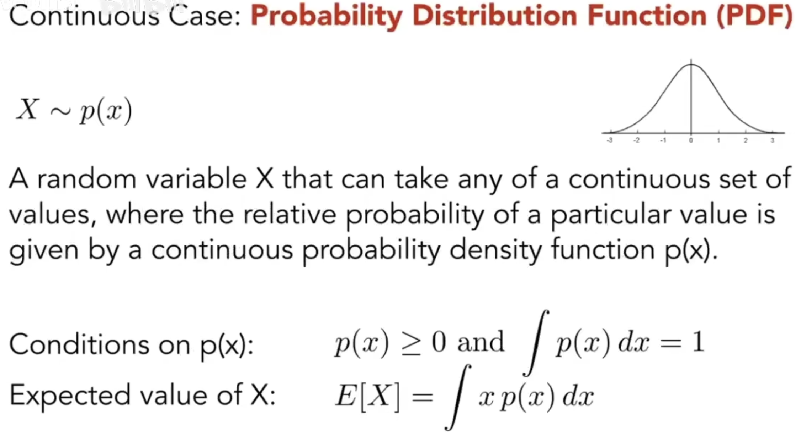

连续型随机变量中的 Probability Density Function 等同于离散型随机变量的 Probability Distribution Function

python中：

+ pdf,概率密度函数(Probability Density Function/Probability Distribution Function)
+ cdf,累积分布函数(Cumulative Distribution Function),pdf的积分。

# Monte Carlo Path Tracing
## Monte Carlo Integration
蒙特卡洛积分

### Why
we want to solve an integral, but it can be too difficult to solve analytically.

### What & How
estimate the integral of a function by averaging random samples of the function's value.

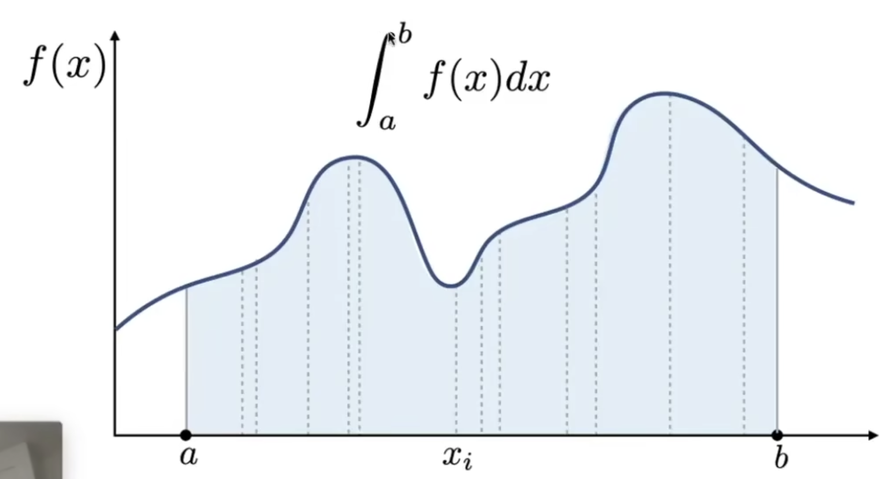

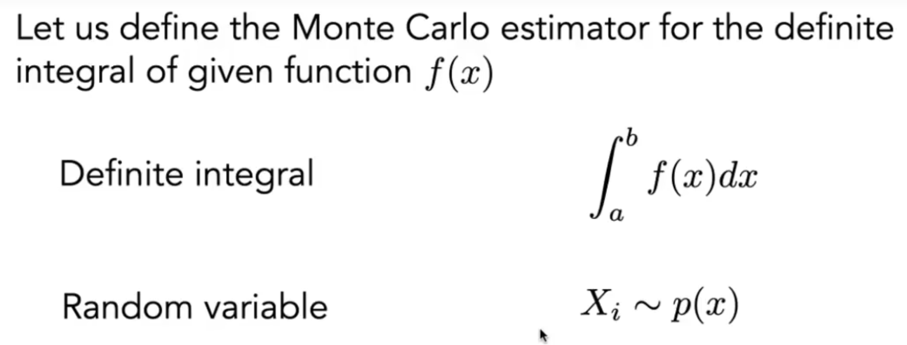

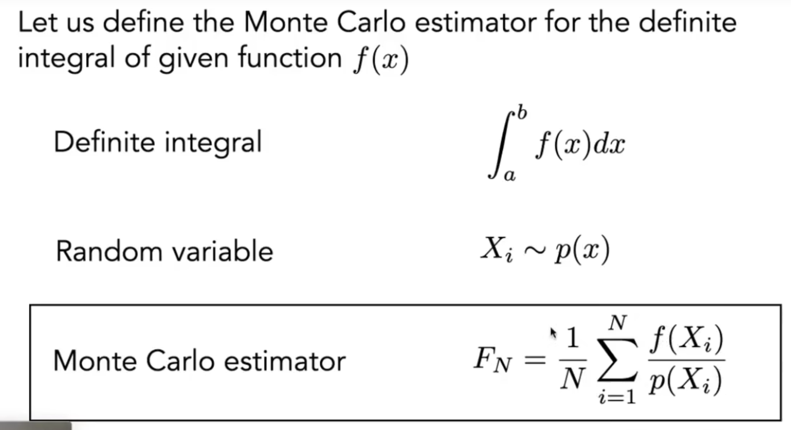

除以p(x)可以消除不同采样频率带来的误差

落在一点x的概率越大，落在这点的随机样本越多。为了使样本更加均匀，应该减密度大处的点的对应f(x)的权重。权重与x的概率成反比。

### Example: Uniform Monte Carlo Estimator
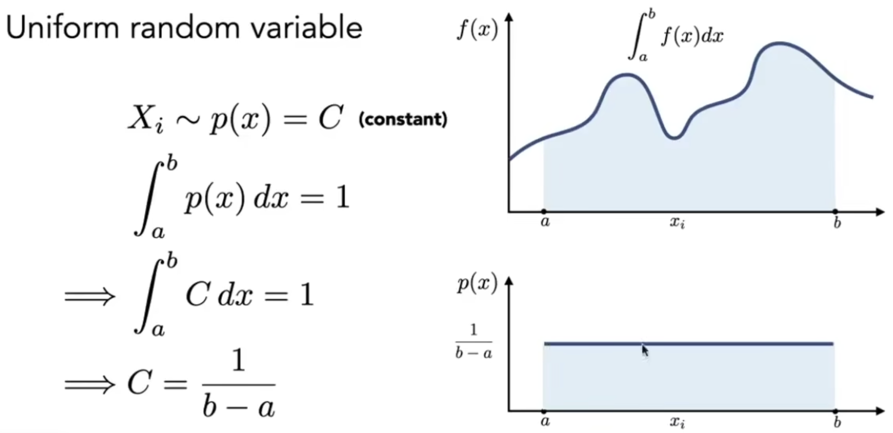

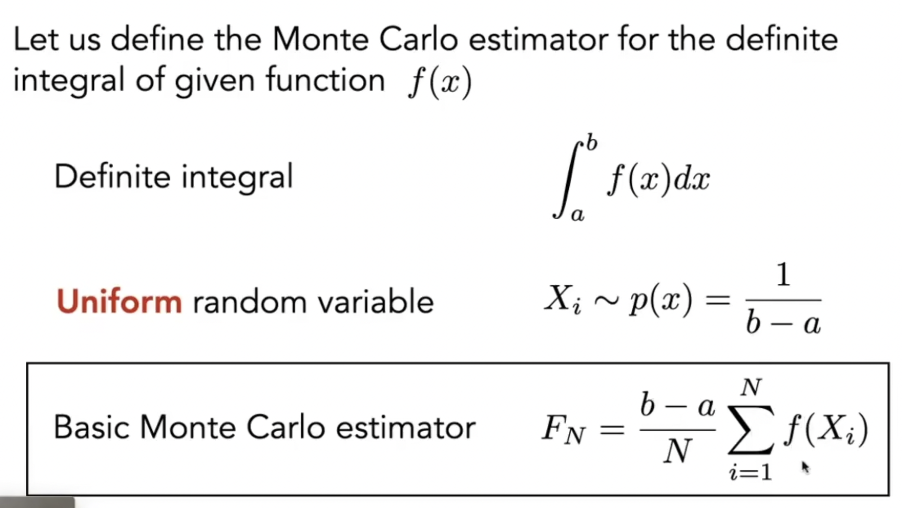

### Equation


f(x) = f(x)/p(x) * p(x) = g(x) * p(x)，离散化均值是g(x)的期望。

Some notes:

• The more samples, the less variance.

• Sample on ×, integrate on x.

## Path Tracing
### Motivation: Whitted-Style Ray Tracing
Whitted-style ray tracing 不断弹射光线，如何弹射？两种情况：沿镜面方向反射，沿折射方向折射，到漫反射表面停止。

+ Always perform specula reflections / refractions
+ Stop bouncing at diffuse surfaces

问题：这并不符合真正的物体规律

Path Tracing 是一个几乎百分百正确的算法

#### Problem1
Where should the ray be reflected for **glossy **materials? glossy: 半光滑

对于glossy materials，光并不沿着镜面方向反射。

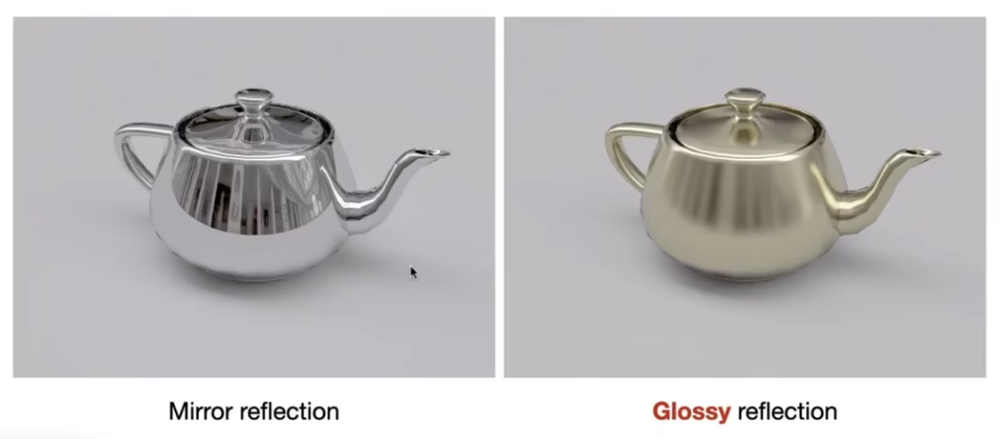

#### Problem2
No Reflection between diffuse materials?

光打到漫反射材质后，应该继续反射

下图中，长方体的左面颜色不同。原因是，在光打不到左面的基础上，左图的红色漫反射墙壁不会继续反射光，右图的红色墙壁会继续反射光。红色墙壁反射出的光也是红色的，红色反射光落在长方体上发生了color bleeding现象。

color bleeding 是一种全局光照内的效果，<font style="color:rgb(18, 18, 18);">是Whitted-Style ray-tracing 做不到的。</font>

> <font style="color:rgb(32, 33, 34);">In </font>[computer graphics](https://en.wikipedia.org/wiki/Computer_graphics)<font style="color:rgb(32, 33, 34);"> and </font>[3D rendering](https://en.wikipedia.org/wiki/3D_rendering)<font style="color:rgb(32, 33, 34);">, </font>**<font style="color:rgb(32, 33, 34);">color bleeding</font>**<font style="color:rgb(32, 33, 34);"> is the phenomenon in which objects or surfaces are colored by </font>[reflection](https://en.wikipedia.org/wiki/Reflection_(physics))<font style="color:rgb(32, 33, 34);"> of colored light from nearby surfaces.</font>
>

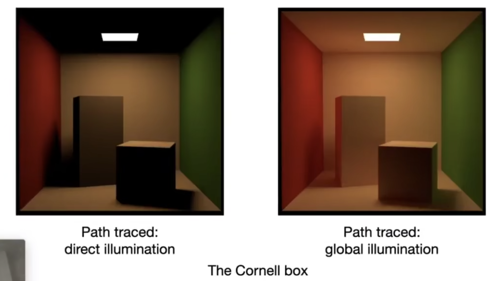

### Rendering equation is correct
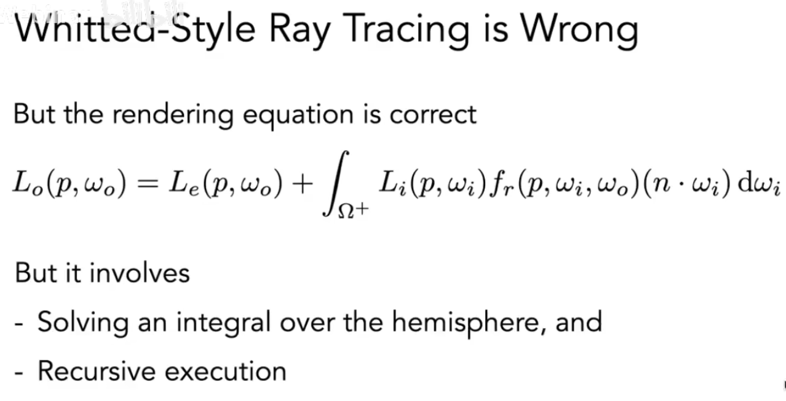

How do you solve an integral numerically? 如何把半球面上所有的光积分累加？

whitted style ray tracing+rendering equation虽然考虑半球面，但只考虑一条折射光和一条反射光，不是真正地考虑所有方向的光。Path tracing真正考虑了所有方向的光。并且即使漫反射也不会让光的传播停止。

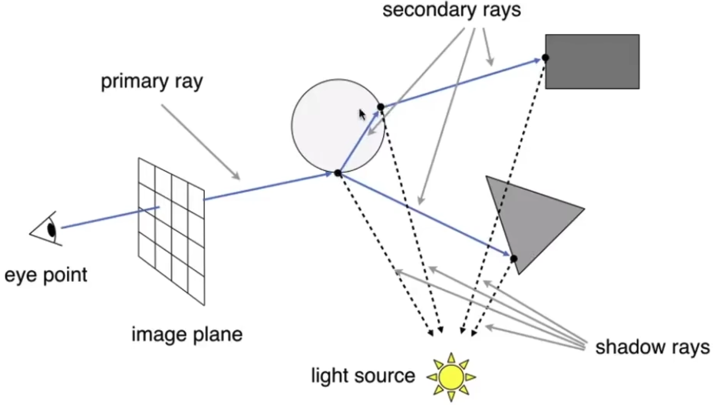

### A Simple Mento Carlo Solution （only direct illumination）
Suppose we want to render **one pixel (point)** in the following scene for **direct illumination** only.

计算着色点上来自四面八方的直接光照

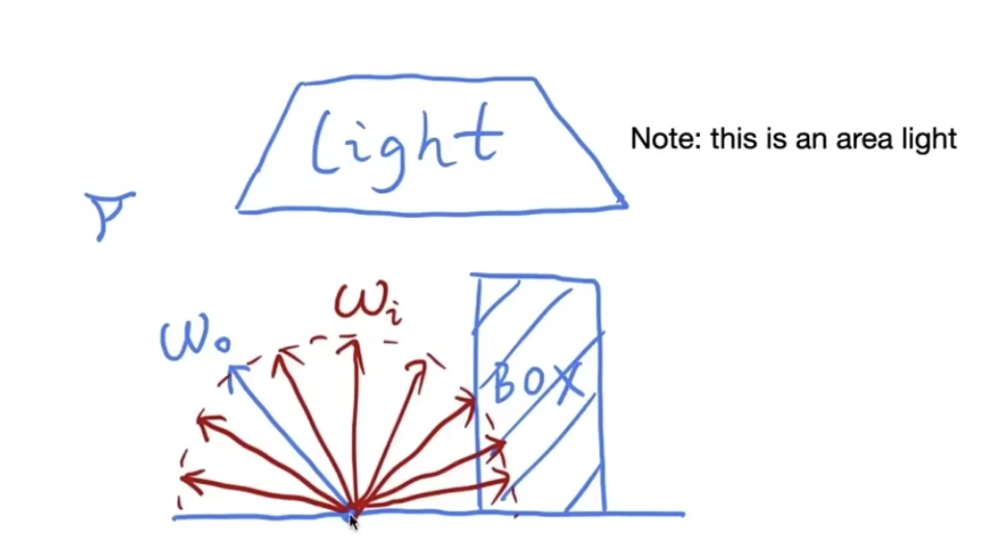

首先，忽略渲染方程中的发光项（其实就是Reflection Euqation）。

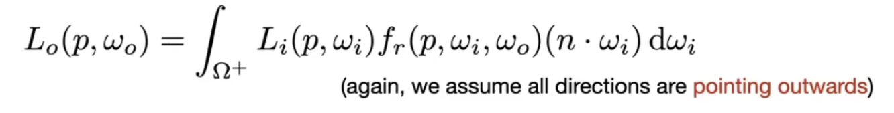

剩下的项就是光在不同方向的积分，可以用蒙特卡洛积分来解。

pdf：整个半球面对应的立体角是2PI，对半球面每单位立体角做均匀采样，每个采样点概率是1/(2PI)

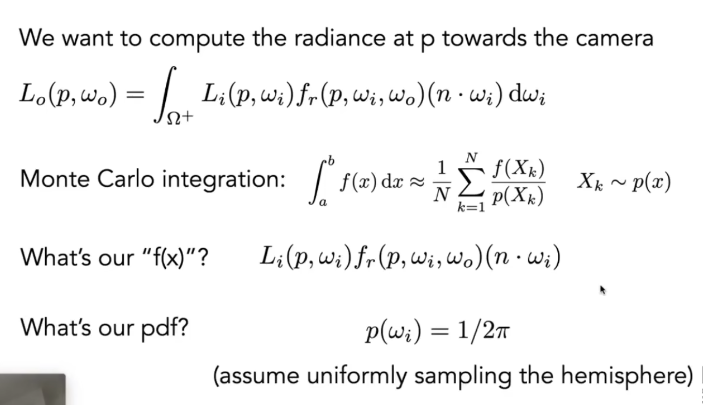

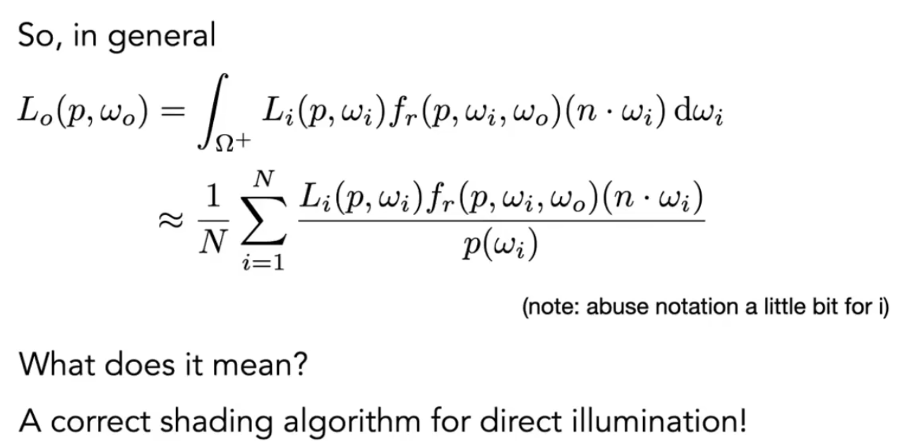

着色程序：

```tsx
// 只考虑直接光照的 Path Tracing shader
shade(p, wo) // 点p, 反射方向
	Randomly choose N directions wi~pdf
	Lo = 0.0  // 初始化结果
	For each wi  // 对于任意一个选中的方向 
		Trace a ray r(p,wi)  // 向光源方向打出一条射线
		If ray r hit the light  // 如果射线打到了光源
			Lo += (1 / N) * L_i * f_r * cosine / pdf(wi)  // 求和
  Return Lo 
```

### Intoducing Global Illumination
One more step forward, what if a ray hits an object?

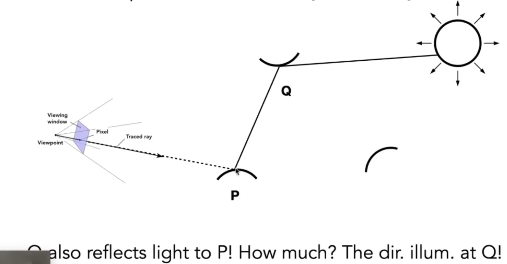

引入全局光照后的着色程序：

```plain
// 支持全局光照的 Path Tracing shader，补充了一个 else if。 
shade(p, wo) // 点p, 反射方向
  Randomly choose N directions wi~pdf
  Lo = 0.0  // 初始化结果
  For each wi  // 对于任意一个选中的方向 
    Trace a ray r(p,wi)  // 向光源方向打出一条射线
    If ray r hit the light  // 如果射线打到了光源
    	Lo += (1 / N) * L_i * f_r * cosine / pdf(wi)  // 求和
    Else if ray r hit an object at q
    	Lo += (1 / N) * shade(q, -wi) * f_r * cosine / pdf(wi)
  Return Lo 
```


问题是否完全解决？No。

仍然存在两个问题：

1. Explosion of #rays as #bounces go up. 光线数量指数爆炸.
    1. #rays = N^#bounces   where N=the number of light sources
    2. observation：#rays will not explode iff N = ? N=1时不会爆炸。
2. shade的递归调用。终止条件？这个算法可能永远不会停。计算机不能模拟弹射无数次。


### Problem1: Explosion of Rays
Explosion of #rays as #bounces go up. 光线数量指数爆炸.

#### Solution: Path Tracing
From now on, we always assume that only <font style="color:#DF2A3F;">1 ray</font> is traced at each shading point:

```plain
// This is Path Tracing!
shade (p,wo)
	Randomly choose ONE direction wi-pdf(w)
	Trace a ray r(p,wi)  // 向光源方向打出一条射线
  If ray r hit the light  // 如果射线打到了光源
  	Lo += (1 / N) * L_i * f_r * cosine / pdf(wi)  // 求和
  Else if ray r hit an object at q
    Lo += (1 / N) * shade(q, -wi) * f_r * cosine / pdf(wi)
```

This is<font style="color:#DF2A3F;"> path tracing</font>! (FYI, Distributed Ray Tracing if N != 1, 分布光线追踪由于光线的指数爆炸问题已经很少提了) 

为什么叫路径追踪？N=1时，就变成了一条路径。 


只用一条线的问题：But this will be noisy! 噪声太大

No problem, just** **trace **more paths** through each pixel and average their radiance!

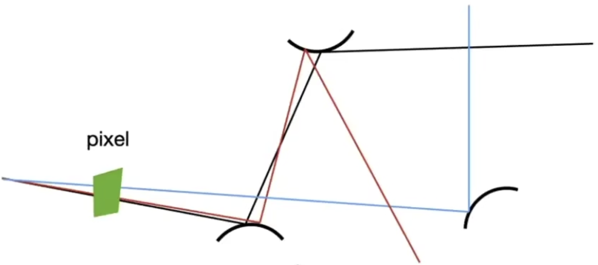

Ray Generation

Very similar to ray casting in ray tracing

```plain
ray_generation (camPos, pixel)
  Uniformly choose N sample positions within the pixel
  pixel_radiance = 0.0
  For each sample in the pixel
  	Shoot a ray r(camPos, cam_to_sample)
  	If ray r hit the scene at p
  		pixel radiance += 1 / N * shade (p, sample_to_cam)
  Return pixel_ radiance
```

### Problem2: Recursion
shade的递归调用。这个算法可能永远不会停。计算机不能模拟弹射无数次。

#### Solution: Russian Roulete (RR)
根据生存概率来继续弹射或停止

Russian Roulette is all about probability

+ With probability 0 < P < 1, you are fine
+ With probability 1 - P, otherwise

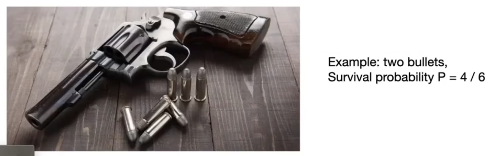

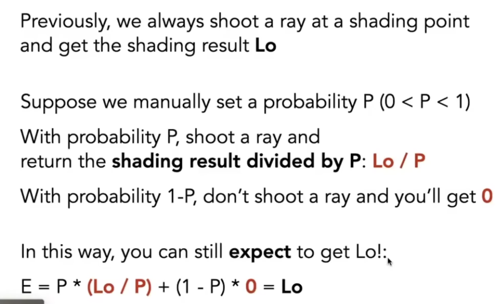 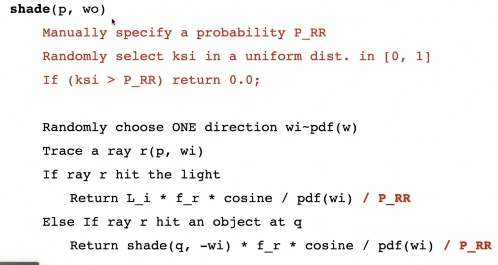

### Path Tracing
正确的path tracing shader（同problem2里的shader）：

```plain
shade (p,wo)
	Manually specify a probability P_RR
	Randomly select ksi in a uniform dist. in [0, 1]
	If (ksi > P_RR) return 0.0;

	Randomly choose ONE direction wi-pdf(w)
	Trace a ray r(p,wi)  // 向光源方向打出一条射线
  If ray r hit the light  // 如果射线打到了光源
  	Lo += (1 / N) * L_i * f_r * cosine / pdf(wi) / P_RR
  Else if ray r hit an object at q  // 如果射线打到了物体
    Lo += (1 / N) * shade(q, -wi) * f_r * cosine / pdf(wi) / P_RR


ray_generation (camPos, pixel)
  Uniformly choose N sample positions within the pixel
  pixel_radiance = 0.0
  For each sample in the pixel
  	Shoot a ray r(camPos, cam_to_sample)
  	If ray r hit the scene at p
  		pixel radiance += 1 / N * shade (p, sample_to_cam)
  Return pixel_ radiance
```

### Make Path Tracing more  Efficient (Sampling the light)
Now we already have a correct version of path tracing. But it's not really efficient. 牵扯到采样频率问题.

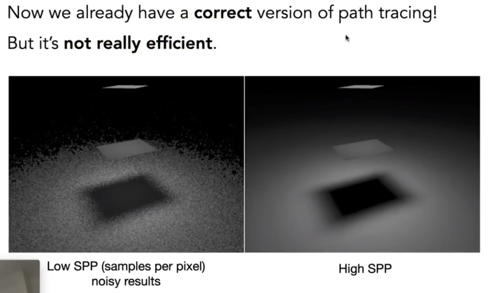

Why inefficient?

With uniform sampling of light, there will be 1 ray hitting the light. So a lot of rays are "wasted" if we uniformly sample the hemisphere at the shading point. （对于** **inefficient）

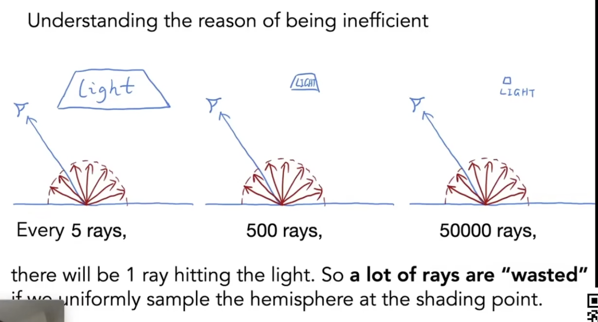

How to make it efficient?

直接从光源采样。之前渲染方程是在半球上各个立体角做积分，现在需要将半球改成光源和非光源两部分，光源部分改成在光源上积分。

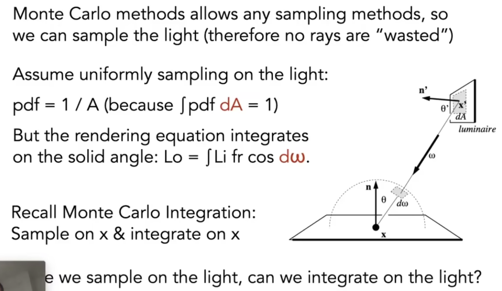

如何将渲染方程改成在光源上积分？找单位球单位立体角（dw）与光源单位面积（dA）的关系。

把一个面积投影到单位圆上：先将dA旋转一定角度，再除以两点距离的平方

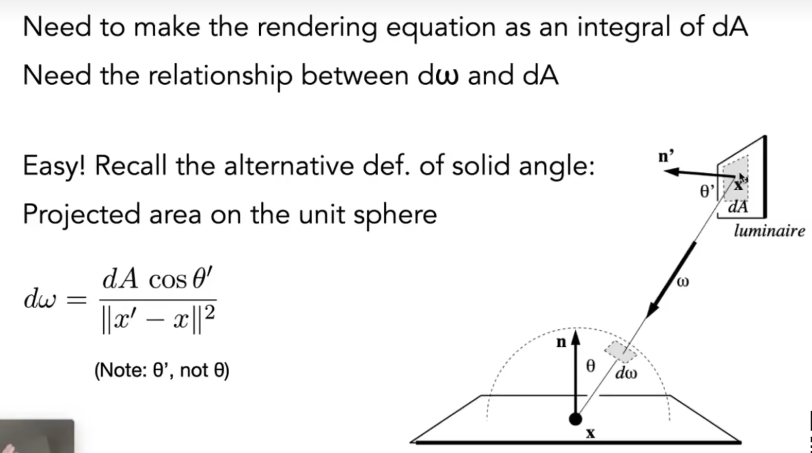

修改后的渲染方程： 

# 
 把光线传播分成两部分：1) 光源直接对这一点的贡献和 2)所有其他非光源对这一点的贡献。直接光照不需要俄罗斯轮盘赌（RR）。

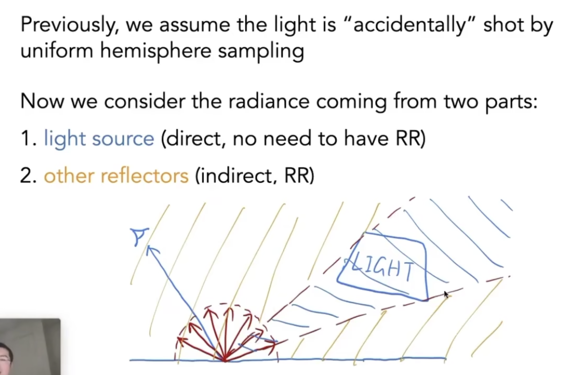

改写之后的渲染方程：

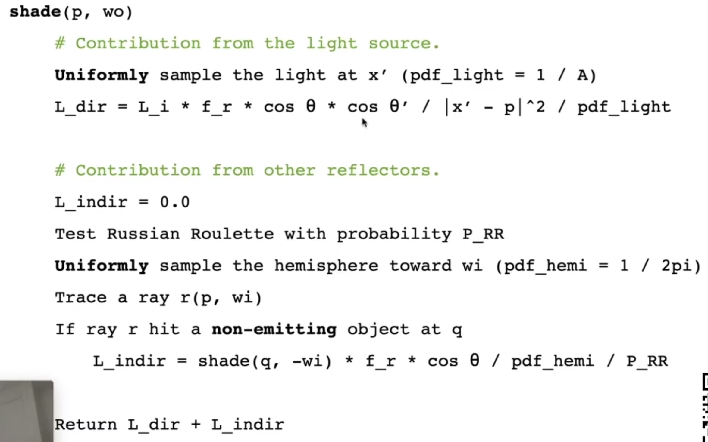

### One Final Thing
How do we know the sample on the light is not blocked or not?

着色点和光源上的采样点连线，判断是否有物体穿过

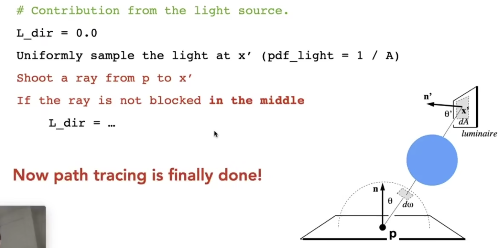

## Problem remians
1. path tracing 不好处理点光源。如果真的需要点光源，建议改成 使用一个很小的面积光源。

## Is Path Tracing Correct?
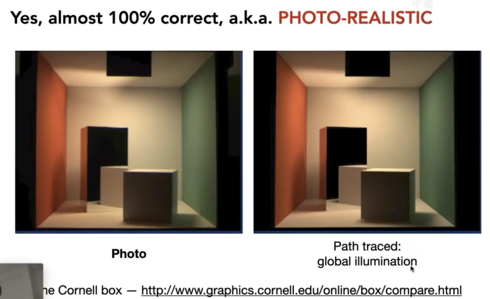

# Ray Tracing: Previous VS Modern Concepts
+ Previous
    - Ray tracing === Whitted-style ray tracing
+ Modern (my own definition) 所有光线传播方法的集合
    - The general solution of light transport, including
    - (Unidirectional & bidirectional) path tracing （单向/双向）
    - Photon mapping（光子映射）
    - Metropolis light transport （Metropolis 光线传播）
    - VCM / UPBP..

# Things we haven't covered / won't cover
+ Uniformly sampling the hemisphere
    - How? And in general, how to sample any function? (sampling)
+ Monte Carlo integration allows arbitrary pdfs
    - What's the best choice? (importance sampling，重要性采样理论，针对某一种形状更好地采样)
+ Do random numbers matter?
    - Yes! (low discrepancy sequences，采样样本均匀的分布在空间内，不会出现过于密集或过于分散的情况)
+ I can sample hemisphere and light?
    - 结合采样半球和采样光源：multiple importance sampling
+ The radiance of a pixel is the average of radiance on all paths passing through it.
    - Why? 为什么平均起来就是像素的radiance？(pixel reconstruction filter)
+ Is the radiance of a pixel the color of a pixel
    - No. 把radiance转换成像素颜色需要做伽马校正(gamma correction, curves, color space)

# References
+ [Lecture 15 Ray Tracing 3_哔哩哔哩_bilibili](https://www.bilibili.com/video/BV1X7411F744?p=15)
+ [Path Tracing](https://en.wikipedia.org/wiki/Color_bleeding_(computer_graphics))
+ [Ray tracing和Path tracing有什么区别？ - 知乎](https://www.zhihu.com/question/303252407/answer/541093842)
+ [What Is Path Tracing? | NVIDIA Blog](https://blogs.nvidia.com/blog/2022/03/23/what-is-path-tracing/)


> 更新: 2023-10-17 17:59:58  
> 原文: <https://www.yuque.com/viruspc/el3mi0/doowvhs7vpcg9e8r>