# Ray Tracing (Radiometry)

- [Summary](#summary)
- [Motivation](#motivation)
- [Radiometry](#radiometry)
  * [Radiant Energy and Flux (Power)](#radiant-energy-and-flux-power)
  * [Important measures of interest](#important-measures-of-interest)
    + [Radiant Intensity](#radiant-intensity)
      - [Angles and Solid Angles](#angles-and-solid-angles)
      - [Differential Solid Angles (微分立体角)](#differential-solid-angles-%E5%BE%AE%E5%88%86%E7%AB%8B%E4%BD%93%E8%A7%92)
      - [Isotropic Point Source](#isotropic-point-source)
    + [Irradiance](#irradiance)
    + [Radiance](#radiance)
      - [Incident Radiance](#incident-radiance)
      - [Exiting Radiance](#exiting-radiance)
      - [Radiance VS Irradiance](#radiance-vs-irradiance)
- [References](#references)

---

# Summary
+ Concepts
    - **Radiant energy**
        * the energy of electromagnetic radiation
        * Symbol: _Q(e)_
        * Unit: Joule/焦耳
        * 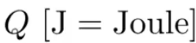
    - **Radiant flux 辐射通量**
        * energy per unit time
        * Symbol: _Φ(e)_
        * Unit: Watt/lumen/流明
        * 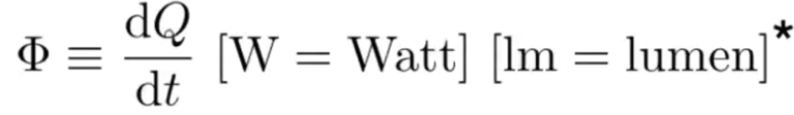
    - **Radiant intensity 辐射强度**
        * power per unit solid angle
        * Symbol: _I(e,Ω)_
        * Unit: candela/坎德拉
        * 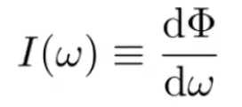
    - **Solid Angle 立体角**
        * ratio of subtended area on sphere to radius squared
        * Symbol: _Ω_
        * 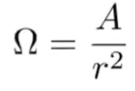
    - **Irradiance 辐照度**
        * power per (**perpendicular**/projected) unit area incident on a surface point.
        * Symbol: E
        * 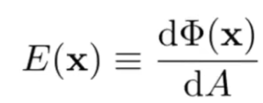
    - **Radiance/Luminance  辐射或辐亮度**
        * The radiance (luminance) is the power emitted, reflected, transmitted or received by a surface, per unit solid angle, per projected unit area.
        * Symbol: L(e,Ω)
        * 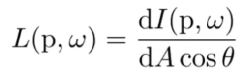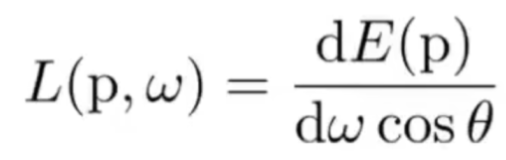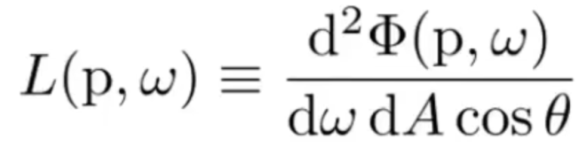

# Motivation
精准地描述光这一物理量

也是 Path Tracing 的基础

# Radiometry
Measurement system and units for illumination。如何描述光照。

+ Accurately measure the spatial properties of light 只考虑光的空间属性，不考虑时间属性
+ 仍然是是基于几何光学来做的（满足三条性质：光沿直线传播，光不相交，光的可逆性）

New terms: Radiant flux(辐射通量), intensity, irradiance, radiance

## Radiant Energy and Flux (Power)
Definition: **Radiant energy** is the energy of electromagnetic radiation. It is measured in units of joules, and denoted by the symbol:

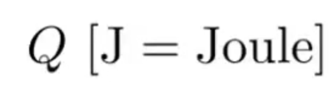 (J=焦耳)

Definition: **Radiant flux** (power，有时称为能量，实际不是能量，而是单位时间能量) is the energy emitted, reflected, transmitted or received, per unit time.

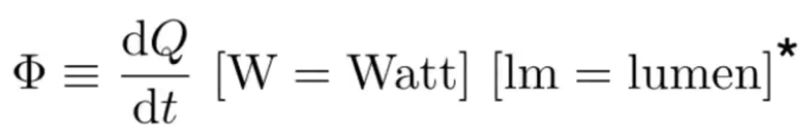（W=瓦特, lm=流明）

从另一个角度讲，flux（通量）也是单位时间内通过一个平面的能量

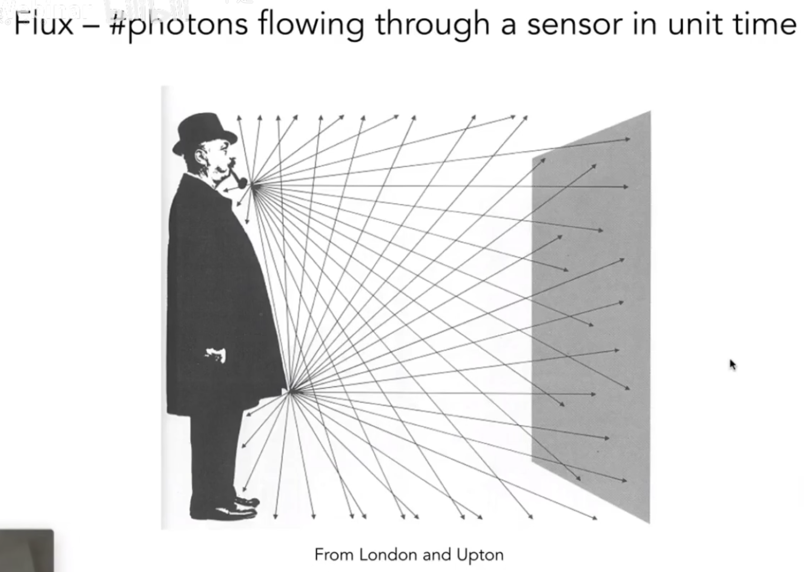

## Important measures of interest
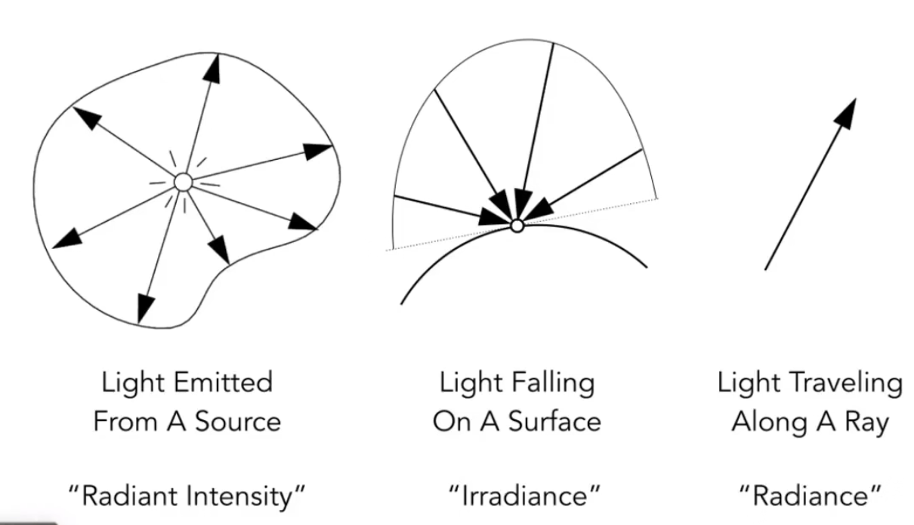

### Radiant Intensity
Defination：The** radiant (luminous) intensity **is the power per **unit solid angle** (立体角) emitted by a point light source 

均匀点光源： intensity = 流明除以4PI

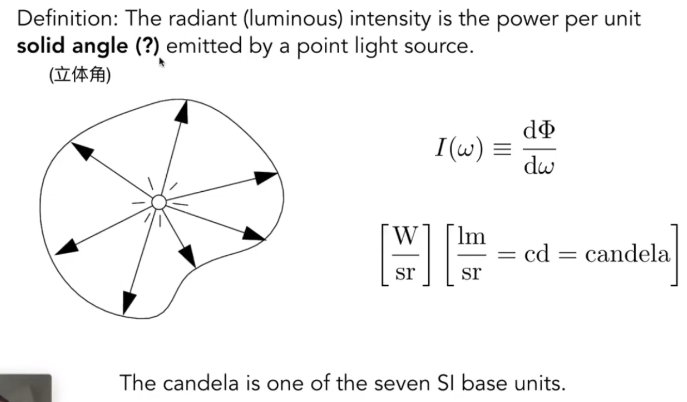

#### Angles and Solid Angles
angle（弧度）：弧长除以半径。半径为1的整个圆弧度为2PI

solid angle (立体角)：弧度在三维的扩展：球面面积除以半径的平方。半径为1的整个球面面积为4PI

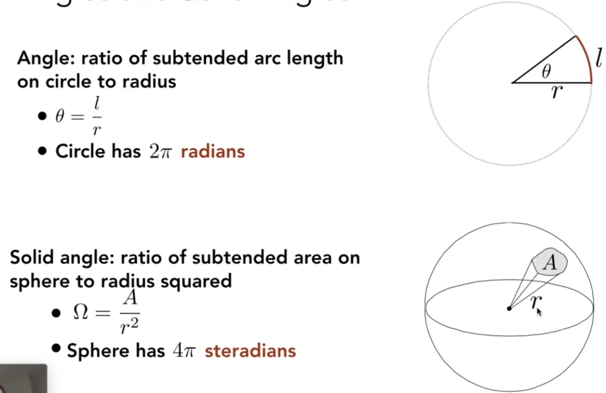

#### Differential Solid Angles (微分立体角)
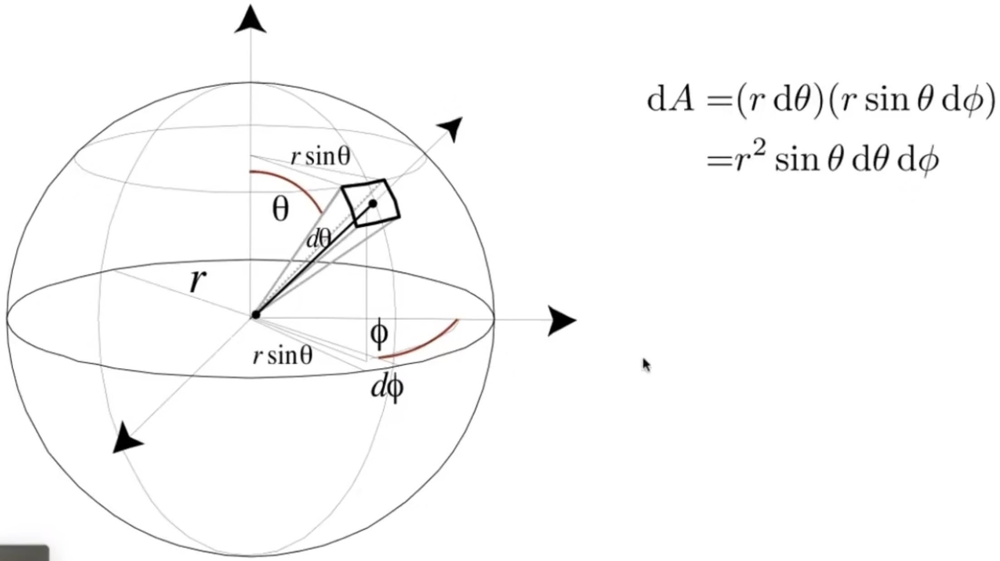

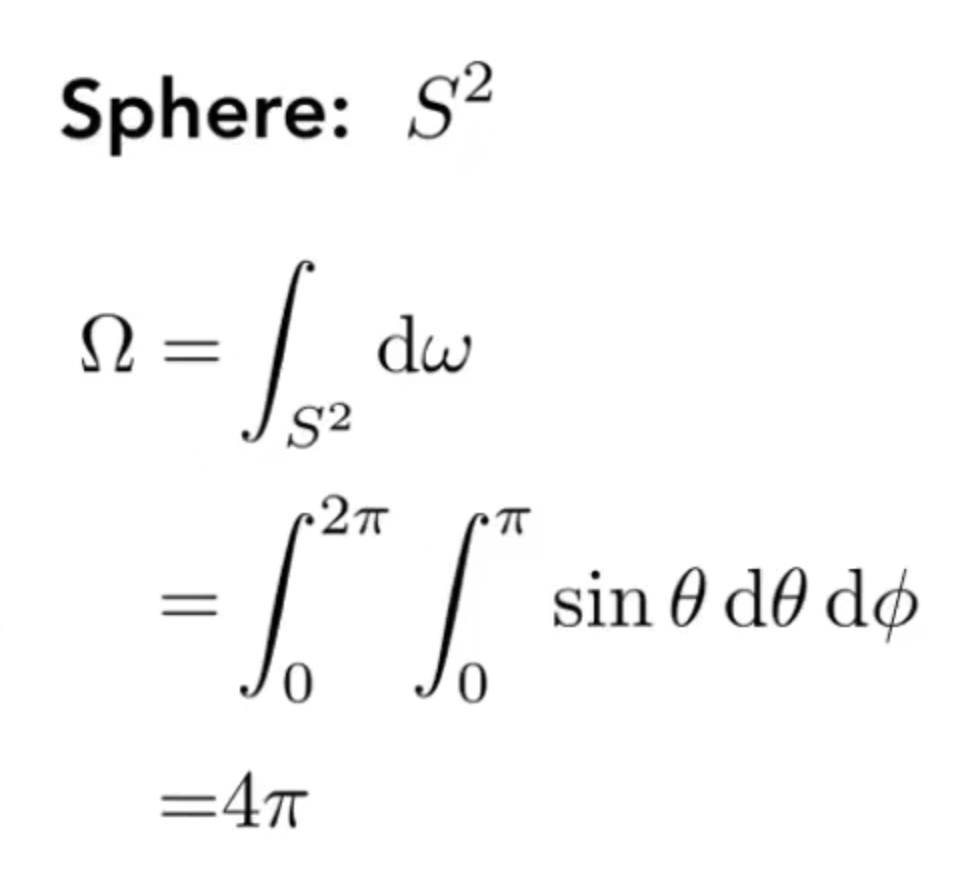

#### Isotropic Point Source
均匀点光源 intensity和距离无关

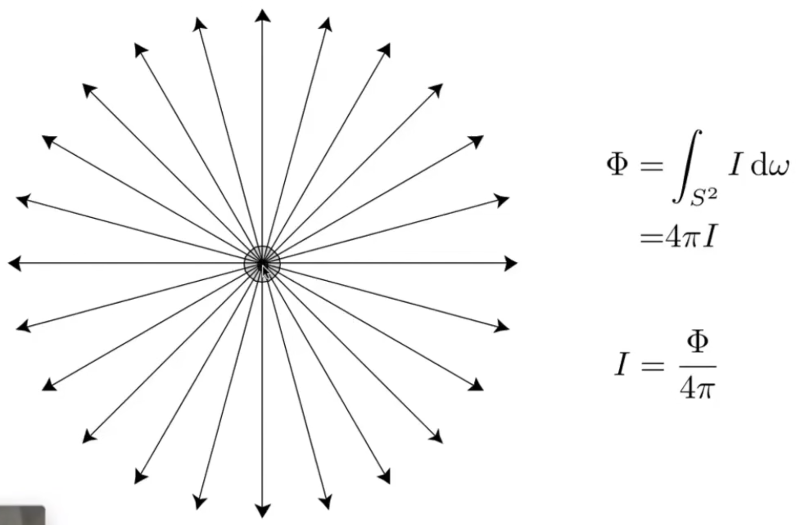

### Irradiance
Definition: The **irradiance** is the power per (**perpendicular**/projected) unit area incident on a surface point.

与intensity作区分。intensity是power per unit solid angle

光落在一个表面上的能量

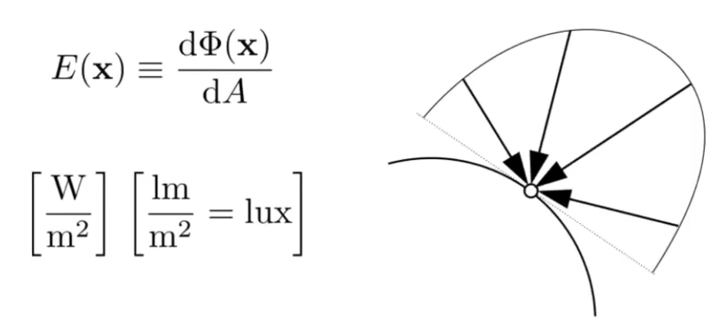

衰减的是Irradiance

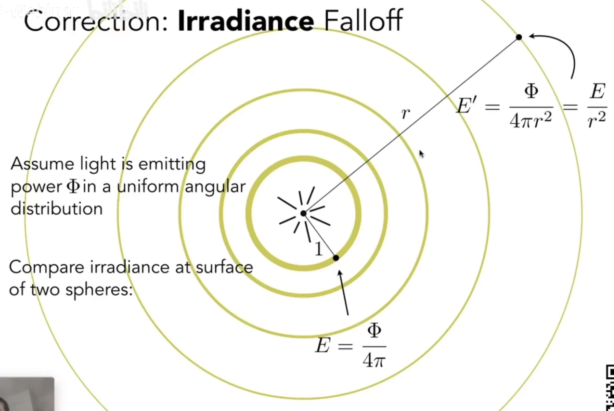

### Radiance
光沿光线传播的能量

Radiance is the fundamental field quantity that describes the distribution of light in an environment

+ Radiance is the quantity associated with a ray
+ Rendering is all about computing radiance

Definition: The **radiance (luminance)** is the power emitted, reflected, transmitted or received by a surface, **per unit solid angle**, **per projected unit area**.

两次微分。单位立体角+单位面积。某一个确定的微小的面和某一个确定的方向

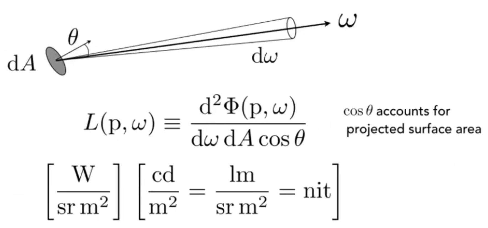

Recall

+ Irradiance: power per projected unit area
+ Intensity: power per solid angle

So

+ Radiance: Irradiance per solid angle
+ Radiance: Intensity per projected unit area

#### Incident Radiance
从radiance角度解释irridiance

入射方向的irridiance

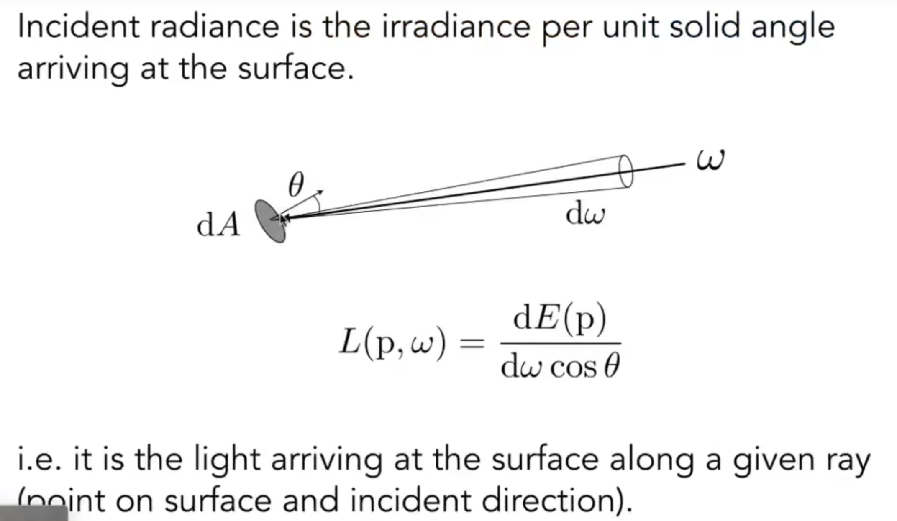

#### Exiting Radiance
从intensity角度解释irridiance

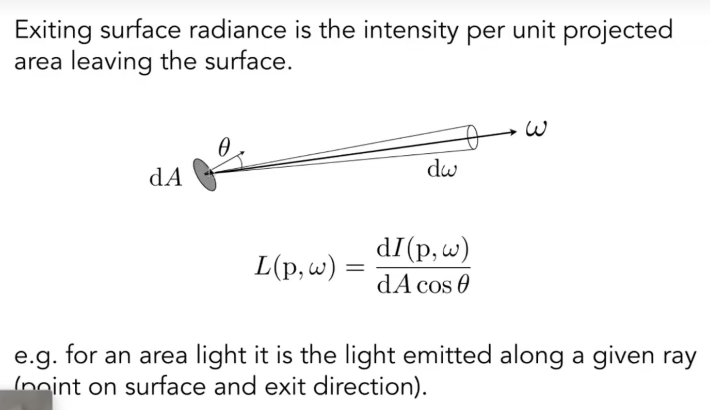

#### Radiance VS Irradiance
Irradiance: total power received by area dA

Radiance: power received by area dA from "direction" dw

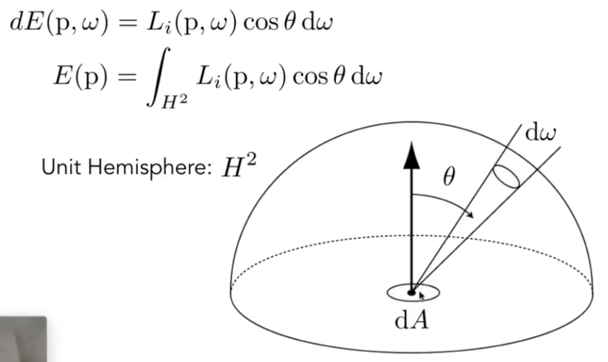  

# References
+ [Lecture 14 Ray Tracing 2_哔哩哔哩_bilibili](https://www.bilibili.com/video/BV1X7411F744/?p=14&vd_source=a637826c55b409b420b4b6584a6e8379)

> 更新: 2023-07-08 04:54:31  
> 原文: <https://www.yuque.com/viruspc/el3mi0/gk4lv415pr2oahxy>