# Ray Tracing (Whitted-Style Ray Tracing and Ray-object intersection)

- [Summary](#summary)
- [Why Ray Tracing](#why-ray-tracing)
- [Light Rays](#light-rays)
- [Ray Casting](#ray-casting)
  * [Pinhole Camera Model](#pinhole-camera-model)
- [Recursive (Whitted-Style) Ray Tracing](#recursive-whitted-style-ray-tracing)
- [Ray-Surface Intersection](#ray-surface-intersection)
  * [Ray Equation](#ray-equation)
  * [Ray Intersection With Sphere](#ray-intersection-with-sphere)
  * [Ray Intersection with Implicit Surface](#ray-intersection-with-implicit-surface)
  * [Ray Intersection with Triangle Mesh](#ray-intersection-with-triangle-mesh)
    + [Simple method](#simple-method)
      - [Plane Equation](#plane-equation)
      - [Ray Intersection with plane](#ray-intersection-with-plane)
    + [Moller Trumbore Algorithm](#moller-trumbore-algorithm)
- [References](#references)

---

# Summary
+ Why Ray Tracing？
    - Rasterization couldn't handle **global** effects well （shadow, global illumination）光栅化只考虑直接光
    - Rasterization is fast, but quality is relatively low. 
+ Ray Generation
    - Ray Casting
        * Ray Tracing 的基础
        * 利用了光的可逆性，从光源出发到眼睛。
        * Steps
            1. Generate an image by** casting one ray per pixel**.
            2. Check for shadows by **sending a ray to the light**.
    - Whitted-style ray tracing
        * main idea: 在任意一点，光线可以进一步传播
            + Always perform specula reflections / refractions  始终执行镜面反射/折射（所以不适用于glossy material）
            + Stop bouncing at diffuse surfaces  直至漫反射表面处停止
        * Whitted-style ray tracing没有仔细考虑漫反射。Whitted-style ray tracing在glossy材质和漫反射材质上会出错。后续的Rendering equation才是对的。
        * 渲染方程在六年后被提出。
+ Ray-object intersections (先判断相交，才能进行后续弹射)
    - Implicit surfaces
    - Triangles
        * simple method
            1. Ray-plane intersection
            2. Test if hit point is inside triangle (叉乘判断方向)
        * Moller Trumbore Algorithm
            + 利用重心坐标直接求解线性方程组

# Why Ray Tracing
光线追踪和光栅化是两种不同的成像方式。相比光栅化的方法（shadow mapping），光线追踪存在一定优势

1. rasterization couldn't handle **global** effects well
    - (Soft) shadows (也有方法用栅格化做软阴影，但比较困难)
    - And especially when the light bounces more than once

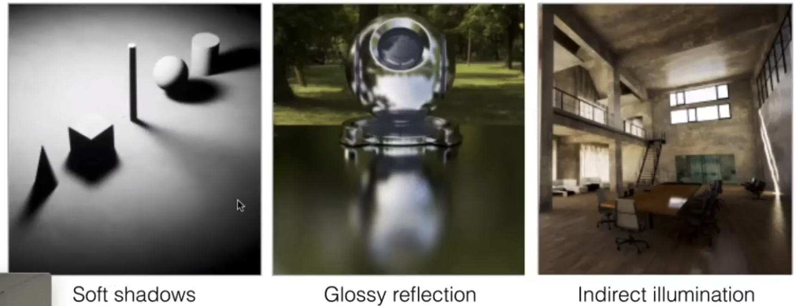

2. Rasterization is fast, but quality is relatively low. 光栅化本质是一种快速近似，质量相对较低。光栅化相当于只考虑直接光，不考虑间接光。

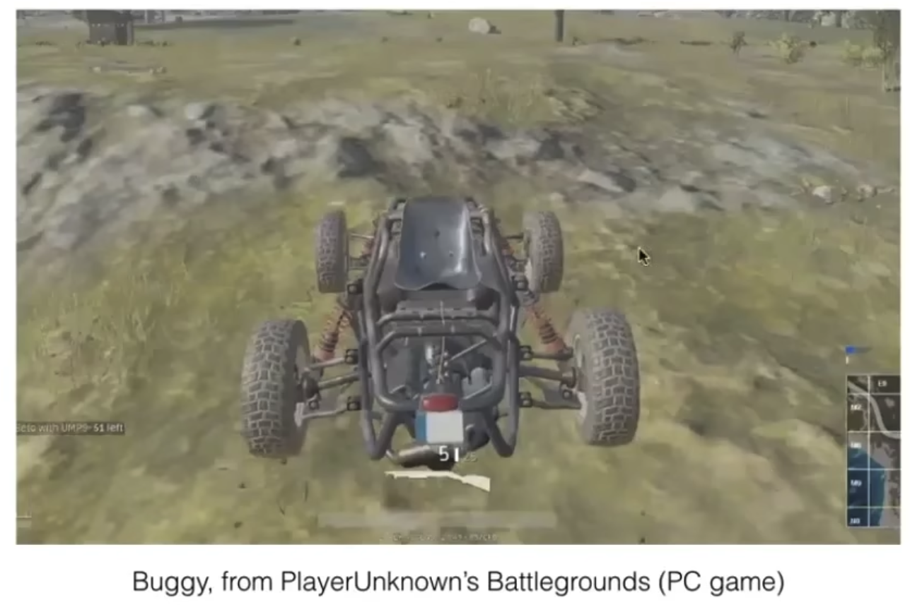‘

也存在缺点：

1. Ray tracing is accurate, but is **very slow**
    - Rasterization: **real-time;**  ray tracing: **offline (比如电影)**
    - ~10K CPU more hours to render one frame in production

# Light Rays
光线是什么？

Three ideas about light rays

1. Ligh travels in straight lines (though this is wrong，严格意义上讲，光线是一种光波，有波动性，在一定程度上需要考虑波动性质)
2. Light rays do not "collide" with each other if they cross (though this is still wrong)
3. Light rays travel from the light sources to the eye (but the physics is invariant under path reversal - reciprocity) (光线的可逆性, 也就是说对于光路而言，光从A到B的话，反过来光可以以不变的路径再从B到A。我们应该采用的是从眼睛到光源的光路，实际渲染用的是光源到眼睛的光路)

# Ray Casting 
做光线追踪，首先要做光线投射。光线投射是光线追踪的基础。

光线追踪利用了光的可逆性，从光源出发到眼睛。

Appel 1968 - Ray casting

1. Generate an image by** casting one ray per pixel**.
2. Check for shadows by **sending a ray to the light**.

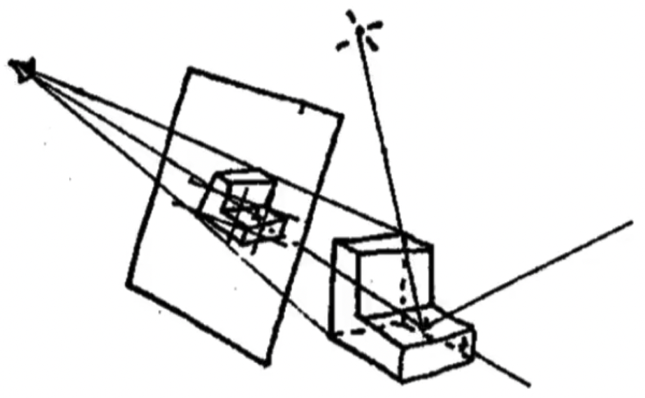

## Pinhole Camera Model
Shading Pixels (Local Only)

1. 从眼睛投射光线。对于每个像素，找物体最近点。

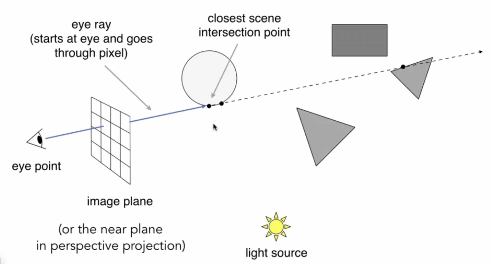

2. 从最近点向光源连一条线，判断是否被照亮

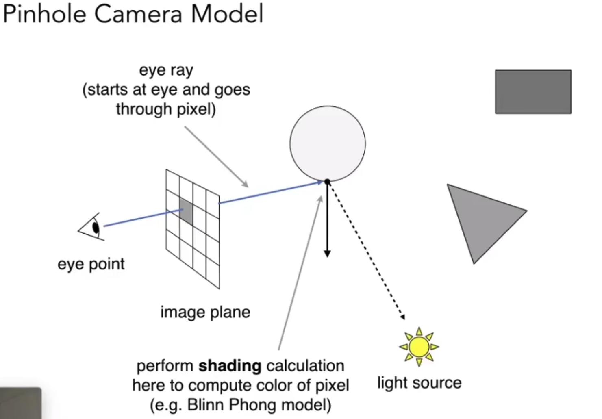

3. 根据法线、光源等计算着色

# Recursive (Whitted-Style) Ray Tracing
"An improved Illumination model for shaded display" T. Whitted, CACM 1980

main idea: 在任意一点，光线可以进一步传播

开始考虑光线到达物体后进一步 的反射、折射

Whitted-style ray tracing 不断弹射光线，如何弹射？两种情况：沿镜面方向反射，沿折射方向折射，到漫反射表面停止。

+ Always perform specula reflections / refractions
+ Stop bouncing at diffuse surfaces  

下图中圆形是半透明的。eye ray 在圆形接触点同时进行反射(refracted rays, specular transmission)和折射（reflected ray, specular reflection），反射后的光线继续传播。传播过程中有能量损失，否则会过曝。

所有光线与物体表面的交点（下图中四个点）的着色相加后，为最终着色结果

最后把光路结果累加

（后续的Path tracing的理论中，漫反射/glossy材质会继续弹射光。对于每个点，应该计算来自四面八方的光线而不仅仅考虑折射方向/反射方向）

# Ray-Surface Intersection
## Ray Equation
数学上光线的定义：

Ray is defined by its origin and a direction vector

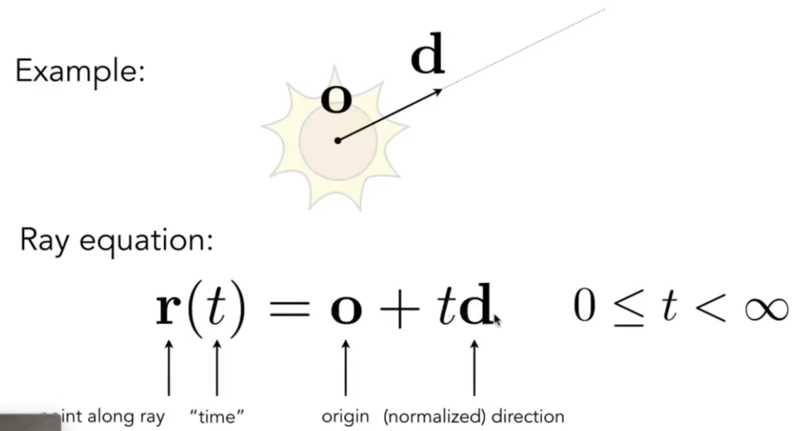

## Ray Intersection With Sphere
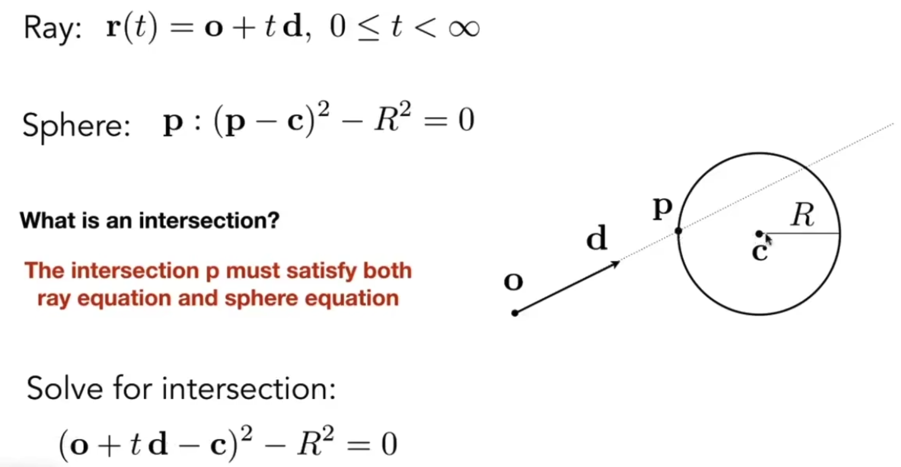

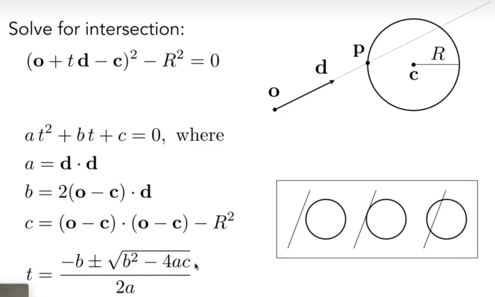

## Ray Intersection with Implicit Surface
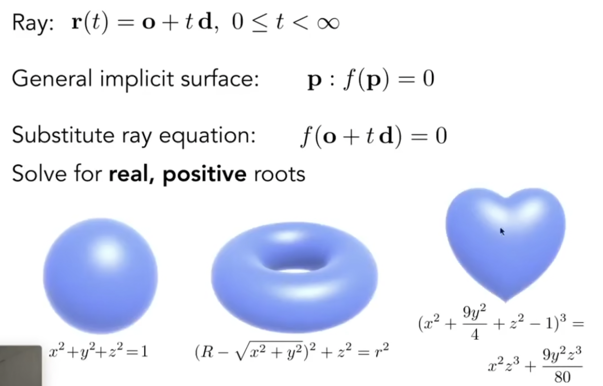

## Ray Intersection with Triangle Mesh
Why?

+ Rendering: visibility, shadows, lighting...
+ Geometry: inside/outside test

How to compute?

+ Simple idea: just interset ray with each triangle
+ Problem: Simple, but slow (acceleration?)
+ Note: can have 0, 1 intersections (ignoring mulitple intersections)

### Simple method
考虑到**三角形在一个平面**内，可以将三角形与光线求交分成两部分：

1. Ray-plane intersection
2. Test if hit point is inside triangle (叉乘判断方向)

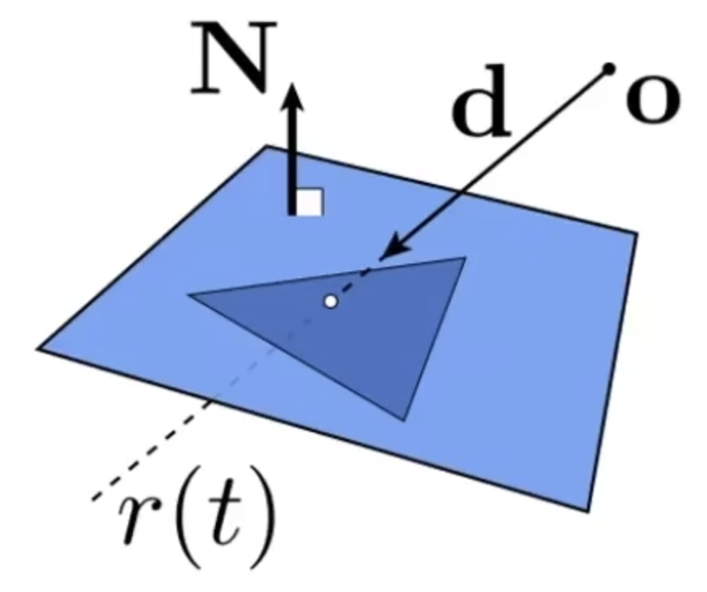

 

#### Plane Equation
Plane is defined by normal vector and a point on plane

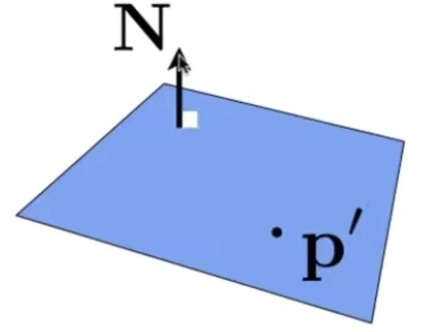

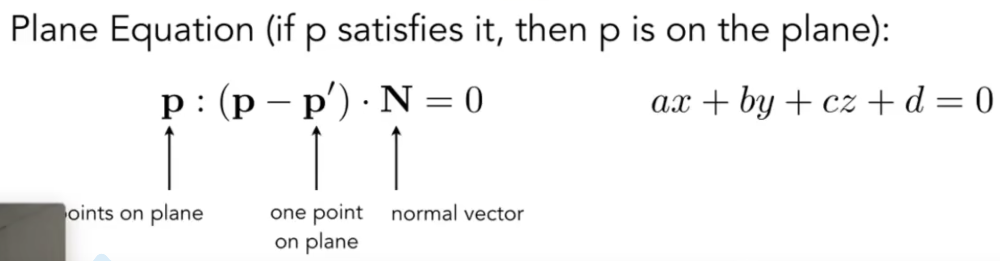

#### Ray Intersection with plane
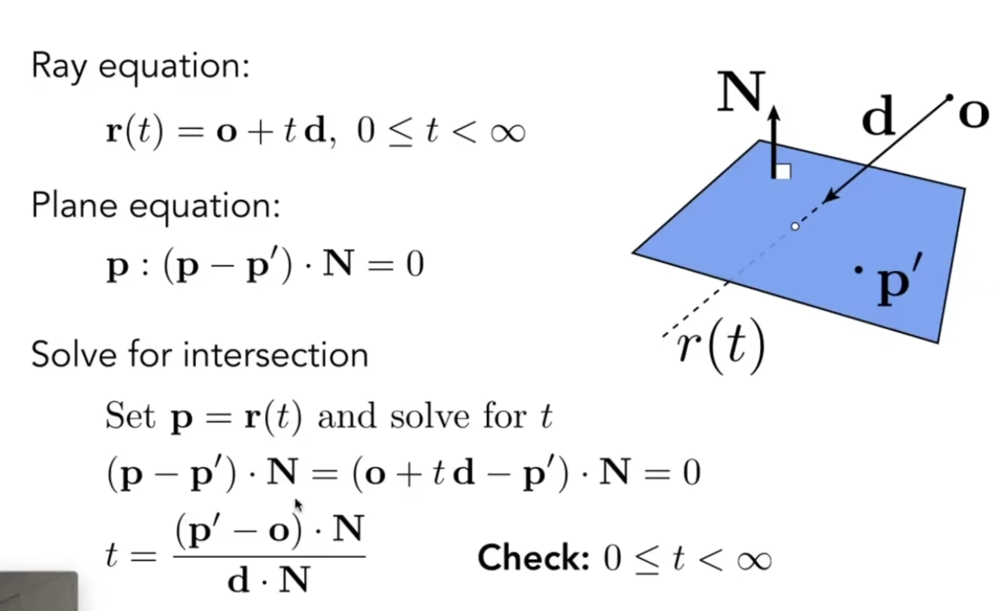

### Moller Trumbore Algorithm
前面的方法判断相交需要分两步进行。Moller Trumbore Algorithm 可以一步判断出。

A faster approach, giving** barycentric coordinate** directly

考虑到交点可以通过**重心坐标**来表示：

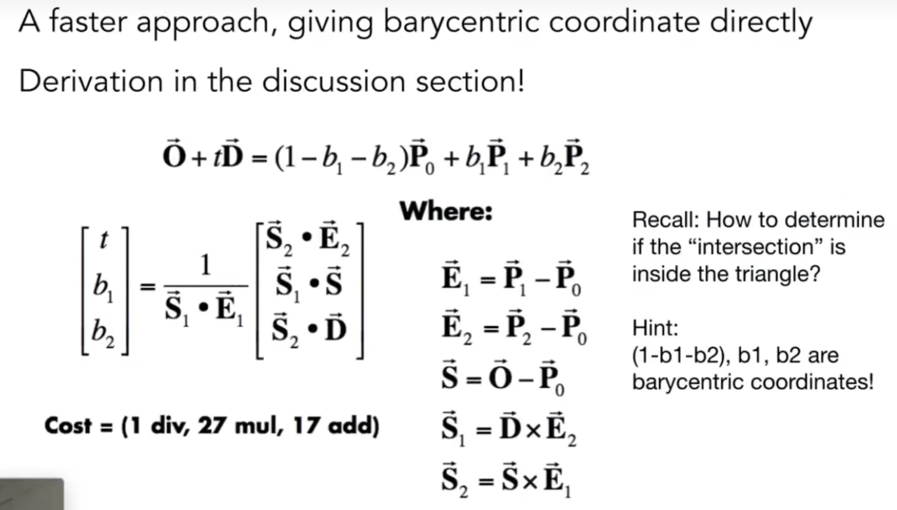

公式中的向量都是三维向量，一个公式实际上是三个公式。三个公式+三个参数（t, b1, b2），可以用Crammer法则求解线性方程组。

若t/b1/b2都为非负，则相交

# References
+ [Lecture 13 Ray Tracing 1_哔哩哔哩_bilibili](https://www.bilibili.com/video/BV1X7411F744?p=13&vd_source=a637826c55b409b420b4b6584a6e8379)

> 更新: 2023-10-21 10:58:01  
> 原文: <https://www.yuque.com/viruspc/el3mi0/byingiyiuobloy9y>