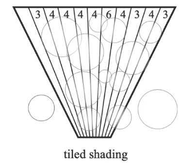
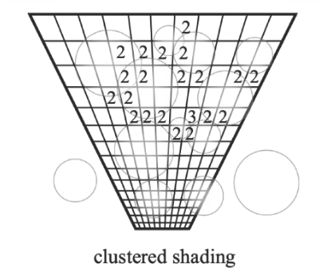
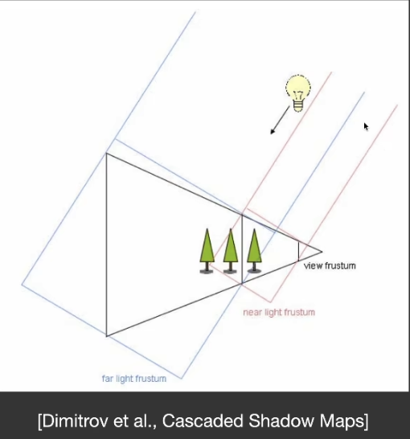
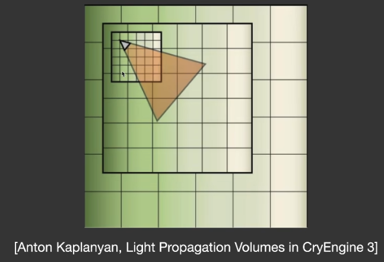
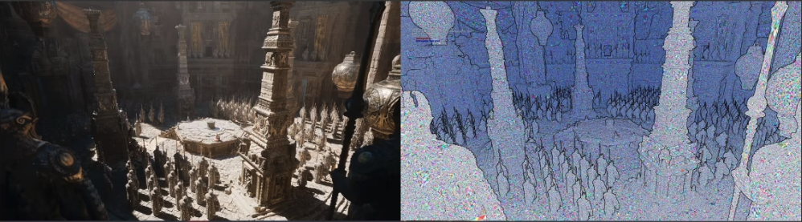
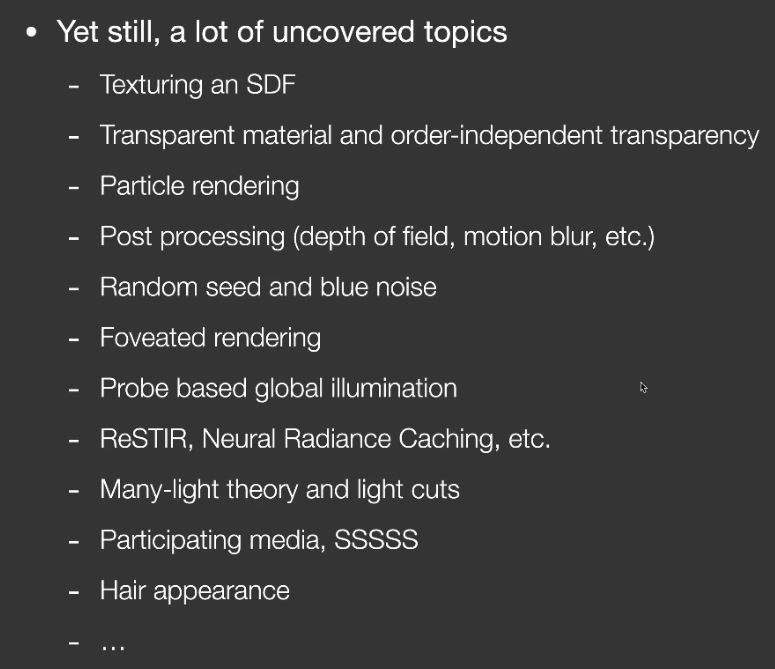

# A Glimpse of industrial Solution

- [Summary](#summary)
- [避免无意义 shading](#%E9%81%BF%E5%85%8D%E6%97%A0%E6%84%8F%E4%B9%89-shading)
  * [Deferred Shading](#deferred-shading)
  * [Tiled Shading](#tiled-shading)
  * [Clustered Shading](#clustered-shading)
- [Level of Detail Solutions](#level-of-detail-solutions)
  * [Introduction](#introduction)
  * [Examples](#examples)
    + [Cascaded shadow maps](#cascaded-shadow-maps)
    + [Cascaded LPV](#cascaded-lpv)
    + [Geometric LoD](#geometric-lod)
  * [Key Challenge](#key-challenge)
  * [Techinical difficults](#techinical-difficults)
- [Global Illumination Solutions](#global-illumination-solutions)
- [Summary: A Brief Q&A](#summary-a-brief-qa)
- [课程中缺少的主题](#%E8%AF%BE%E7%A8%8B%E4%B8%AD%E7%BC%BA%E5%B0%91%E7%9A%84%E4%B8%BB%E9%A2%98)
- [References](#references)

---

# Summary
# 避免无意义 shading
## Deferred Shading
已经成为工业化标准

+ Originally invented to saving shading time
+ Consider the rasterization process
    - Triangles => fragments -> depth test -> shade -> pixel
    - Each fragment needs to be shaded (in what scenario)
        * 严格意义上把所有物体从后往前渲染时，每个fragment都要通过深度测试。
        * Complexity：O(#fragment * #light)
+ Key observation
    - Most fragment will not be seen in the final image
        * 很多fragment最后会被遮挡住，不会被看到，但管线却对其做了着色，这是一种浪费
    - Due to depth test / occlusion
        * 深度测试导致的
    - Can we only shade those visible fragments?

+ Resolution: Modifying the rasterization process
    - Just rasterize the scene twice
    - Pass 1: no shading, just update the depth buffer
        * 第一遍，只做深度缓存的更新，不做shading
    - Pass2：is the same (why does this guarantee shading visible frag. only?)
        * 第二遍，做shading，只有深度等于最浅深度的fragment才会计算shading
    - Implicitly, this is assuming **rasterizing the scene** is way faster than **shading all unseen fragments** (usually true)
    - Complexity: O(#fragment * #light) -> O(#vis. frag. * #light)
    - Issue
        * DIfficult to do anti-aliasing
        * But almost completely solved by TAA

## Tiled Shading
通过 Deffered Shading，减少了 fragment 的数量，时间复杂度： O(#fragment * #light) -> O(#vis. frag. * #light)

可以继续减少 light 的数量。相关技术叫 tiled shading

tiled shading 建立在 differed shading 的基础上，并且把屏幕分成小块（每一块可能是32*32），每个小块单独做 shading。

核心观察：每个光源的影响范围是有限的（平房距离衰减）

通过这种方法，可以节省每一个小块要考虑的光源数量

Improvement: tiled shading

+ Subdivide the screen into tiles of e.g. 32*32 then shading each

Key observation

+ Not all lights can illuminate a specific tile
+ Mostly due to the square falloff with distance(!)
+ Complexity: O(#vis. frag. * #light) -> O(#vis. frag. * avg #light per tile)

## Clustered Shading
在 tiled shading 的基础上，继续做优化

+ Further improvement: clustered shading
    - Further subdivide each tile into different depth segments. 不止按屏幕分成若干条，还继续按深度做切分分成若干块
    - Essentially subdividing the view frustum into a 3D grid
+ Key observation
    - The depth range of each tile can be quite large
    - Therefore, a lot of lights may be identified to have potential to lit the tile
    - But some lights may only lit a small depth range
    - Complexity: O(#vis. frag. * avg #light per til e) ->  O(#vis. frag. * avg #light per cluster)

# Level of Detail Solutions

## Introduction
+ Level of Detail (LoD) is very important
    - Rewcall: texture MIPMAP-ing
    - Choosing the right level of detail to use can save computation
+ The use of multiple levels of details
    - Often called "cascaded" by RTR industry

## Examples
### Cascaded shadow maps
+ 生成 shadowmap的时候需要给一个分辨率。shadowmap 中离镜头更远的 pixel 会覆盖更大的空间范围。
+ 不同shadowmap分辨率相同，但远的shadowmap更粗糙
+ 存在问题：突然切换层级时，会有突变 artifact。
+ 解决方法；为了避免artifact，不同的shadowmap会重叠一部分区域，重叠区域会同时采用这些不同的shadowmap，并根据远近来做blending
+ 

### Cascaded LPV
+ 从光源往外做 propogation。显然越远可以采用越粗糙的Volume
+ 

### Geometric LoD
+ Recall: pre-generating a set of simplified obj. with different #tir. 低模/高模
+ Based on the distance to the camera, choose the right object to show (or part of obj., s.t. no triangle will be larger than a pixel)
+ Popping artifacts? Leave it to TAA!
+ This is Nanite in UE5 (but of course, Nanite has way more) Nanite 就是一个动态选取level的方法：对于一个像素，选取这个像素下物体应该有的哪个层级。 UE5甚至没有用GPU自己的光栅化管线、compute shader等，自己实现了一套光栅化管线。

## Key Challenge
LoD 最难的点在 Transition

+ Transition between different levels
+ For CSM，Usually need some overlapping and blending near boundaries
+ For Geometric LoD，there are popping artifacts。 Leave it to TAA。 存在几何突变（/几何突然出现）问题，但可以交给TAA解决，做temporal的平滑。

## Techinical difficults
LoD 主要难点在技术实现。图形学中技术难点太多了，技术实现非常重要，同一理论不同技术实现效果可能差非常大。

+ DIfferent places with different levels, how about cracks? 不同层级的几何相连的地方出现缝怎么办？学术界几何领域早就有人解决这个问题，保证中间是没有缝的。
+ Dynamically load and schedule different levels, how to make the best use of cache and bandwidth, etc.? 如何动态加载和调度不同层级？学术界也有相关研究。虚拟纹理也有相关需求。
+ Representing geometry using trriangles or geometry textures? 几何有一种表示方法，叫“几何纹理”（games 102）。几何纹理的优点：做Geometry的LoD更简单。
+ Clipping and culling for faster performance?

## 
# Global Illumination Solutions
+ From this course, we can see that
    - Recall when woluld screen space ray tracing (SSR) fail?
    - There is no single GI solution that is perfect for all cases, except for RTRT 除了 RTRT，其他的方案都有各自不适用的场景。
    - But completely using RTRT is still too costly in the  current generation
    - Therefore, the industry tends to use hybrid solution 工业界通常混合使用各种方案
+ For example a possible solutino to GI may include
    - SSR for a rough Gl approximation (similar to our HW3)
    - Upon SSR failure, switching to more complex ray tracing   SSR失效时，转Ray tracing
        * Either hardware (RTRT) or software

标红的技术被使用在 Lumen 中

+ Software ray tracing
    - 用 SDF，不同质量的 SDF。 SDF 可以在shader里快速做tracing，BVH trace 三角形太慢了。
        * 近处：HQ SDF for individual objects that are close-by . 
        * 远处：LQ SDF for the entire scene.
    - RSM if there are strong directional / point lights 场景中有非常强的方向光源或点光源。（手电筒）
    - Probes that stores irradiance in a 3D grid (Dynamic Diffuse GI, or DDGI) 场景比较 diffuse 时，可以用基于探针的技术：DDGI。
        * 光照探针：3D 空间中均匀分布很多 probe，用这些probe照亮场景
+ Hardware ray tracing
    - Doesn't have to use the oiginal geometry, but low-poly proxies。用简化模型代替原始模型来做 ray tracing。
    - Probes (RTXGI). RTXGI =  RTRT + probe

The highlighted solutions are mixed to get Lumen in UE5

# Summary: A Brief Q&A
计算机图形学中，理论和技术同样重要

+ What is interesting?
    - Anything that requires thinking
    - Thereforce, giving up thinking == committing suicide
+ Is implementation less important than theory?
    - NEVER. But engineering skills must be acquired in engineering.

# 课程中缺少的主题

# References
[Lecture 14 A Glimpse of Industrial Solution_哔哩哔哩_bilibili](https://www.bilibili.com/video/BV1YK4y1T7yY?p=14&vd_source=a637826c55b409b420b4b6584a6e8379)

 [Lumen](https://www.yuque.com/pengcheng-fuigs/el3mi0/oytzo9ahorv6oev3?singleDoc#) 《Lumen》

> 更新: 2024-01-07 13:00:41  
> 原文: <https://www.yuque.com/viruspc/el3mi0/neb9ciqysr1fsumo>