# Real-Time Ray Tracing （RTRT）

- [Summary](#summary)
- [RTRT](#rtrt)
  * [RTRT is the Future](#rtrt-is-the-future)
  * [RTRT is Happening](#rtrt-is-happening)
  * [What does RTX do?](#what-does-rtx-do)
  * [Key technology - Denoising](#key-technology---denoising)
- [State of the Art* Denoising Solution](#state-of-the-art-denoising-solution)
- [Before we proceed...](#before-we-proceed)
  * [Mission](#mission)
  * [industrial Solution](#industrial-solution)
- [Temporal Denoising](#temporal-denoising)
  * [The G-Buffers](#the-g-buffers)
  * [Methods](#methods)
    + [Back Projection](#back-projection)
    + [Temporal Accum./Denoising](#temporal-accumdenoising)
  * [效果](#%E6%95%88%E6%9E%9C)
  * [Temporal Failure](#temporal-failure)
  * [Some Slide Notes](#some-slide-notes)
- [Spatial Denoising](#spatial-denoising)

---

# Summary
+ RTRT
    - SPP（Sample Per Pixel）
        * 为了得到全局光照，至少考虑一次直接光加一次间接光以及遮挡关系，即下面这四个。1 SPP path tracing （一个光路的样本） = 
            + 1 rasterization (primary)  这里没用ray来表示，是考虑到了工业界的具体实现。图中也省略了这条光线。
            + + 1 ray (primary visibility)  遮挡关系。1和2构成直接光照。
            + + 1 ray (secondary bounce) 
            + + 1 ray (primary visibility)  3和4引入一次的间接光照
    - 2018年，Nvidia发布了RTX系列显卡。通过硬件加速，RTX 2080 可以做1SPP的路径追踪.
    - 但这远远不够，噪声太大。path tracing本身是一种蒙特卡洛积分的方法，本身有很大噪声。之前path tracing 作业里，每像素64条光纤，得出来的结果都基本不能看，这个效果更差。1 SPP = Extremely noisy results
    - 因此，RTRT中，最关键的技术是什么？是降噪。
        * 这里的降噪不是dlss这种orthogonal的可以和RTRT解耦合各自独立用的技术，而是和RTRT紧耦合的技术
+ RTRT的核心：降噪
    - Goals (with 1 SPP) 
        * Quality (no overblur（糊成一片）, no artifacts（渲染过程出产生的一些不希望的现象）, keep all details...)
        * Speed (< 2 ms to denoise one frame) 

    - Mission impossible （1 SPP + high quality + fast speed）降噪方法很多，针对RTRT的降噪方法非常少
        * Sheared filtering series (SF, AAF, FSF, MAAF, ...)
        * Other offline filtering methods (IPP, BM3D, APR, ...) 离线渲染中，滤波一张图甚至可能要几分钟。
        * Deep leraning series (CNN, Autoencoder, ...) 深度学习正常不行
            + 深度学习的降噪本身不一定是针对光线追踪做的 
            + 速度满，跑一遍要几十到几百毫秒（旧的NVIDIA OPTICS API）
            + 但是。。。2023年，NVIDIA 出了DL的降噪。。。
        * 还有一个可能的原因是，普通的降噪方法会导致能量不守恒？比如引入额外的亮度？？？
+ Basid Ideas：Temporal Denoising + Spatial Denoising
    - RTRT降噪方法的关键想法：Temporal
        * 假设上一帧是降噪过的可复用的（场景运动连续，帧和帧之间有连续性）。认为shading基本也连续。
        * Use motion vectors to find previous locations。motion vector 描述了物体是怎样运动的。
        * essentially increased SPP。复用上一帧相当于2 SPP。考虑到复用是个递归的过程，实际上服用了非常多的前序帧，SPP提高非常多。
    - 背景知识：G Bufer
        * 之前说，渲染一张图的时候，可以得到许多屏幕信息。如深度图、法线图、世界坐标图、albedo图（之前提到的blin phong反射模型提到的 kd）。G Buffer存储的就是这些信息。可以理解为在渲染场景的过程中，可以**免费**得到一些额外的**屏幕空间信息**。通常认为获取这些信息不需要任何代价。（实际上肯定有代价，但可以忽略不计）
            + 光线追踪中，渲染 primary ray 的时候顺便得到的辅助屏幕空间信息
    - 具体方法
        * 第一步：Back Projection
            + 目的：找当前帧某个像素对应上一帧的哪个像素
            + 方法：当前帧像素=(逆MVP)=>当前帧物体世界坐标 =(逆motion vector)=> 下一帧物体世界坐标=(mvp)> 上一帧像素
            + 相关工作：
                - 可以认为是 CV 中optical flow（光流）的一种
                - 但cv中不会直接算。这里为什么直接算？为了速度。我们本身就知道motion vector、mvp矩阵，没必要用复杂方法，可以算的更快。
        * 第二步：Temporal Accum./Denosing
            + 目的：知道了当前像素，和对应的上一帧像素，做 denoising
            + 方法：
                - 最简单的方法：
                    * 直接做时间降噪。做一个线性的blending，按照一定比例混合。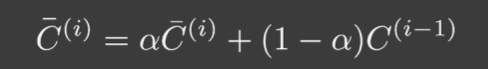
                - 正确方法：
                    * 先对当前帧做个简单的空间降噪，再做blending的时间降噪
                    * 空间降噪：先对当前帧做个简单的降噪，让它没那么noisy 。
                    * 时间降噪：然后结合上一帧做降噪。当前帧数用的比较少，用的主要是上一帧的东西（当前帧只是1SPP，上一帧是很多SPP。当前帧没有降噪过噪声很多，上一帧降噪过噪声很少）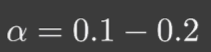
            + 效果：
                - 降噪后除了噪声小外，还会亮很多，为什么？降噪引入了额外的能量么？光线追踪的降噪方法并不是引入额外能量。这些能量本身就存在，位于少数白色像素上。
                    * 降噪前整体画面暗是因为很多能量集中在少数白色像素上，这些白色像素能量过多，多到超过255，但普通屏幕最高只能展示255白色。降噪后这些像素点的能量被分给了其他像素，使其他像素变亮。
                    * 在HDR显示器上，不会觉得亮度差异那么大。
            + 一些场景下存在问题
                - **burn-in period**，需要预热（temporal 带来的问题）。切换场景、切换镜头、切换光源（光照发生巨大变化时，如迪厅）时会出现问题。需要一段（预热时间）。
                - **screen space issue。**难以处理倒退。walking backwards in a hallway。倒退时不断出现上一帧没有的物体，没有temporal的denoising方法可以解决这个问题。
                - **disocclusion**，突然出现的背景（其实也是一种screen space问题）。和倒退问题不同，倒退问题中新出现的物体在上一帧不存在，这里是新出现的问题在上一帧存在但被其他物体遮挡住。
            + 忽略问题强行用会怎么样？
                - 移动快时产生lagging（拖尾/残影）artifact。（编辑经上一帧用到90%到80%的信息）
            + 如何解决上述问题？
                - 两种方法，Clamping和Detection
                    * Clamping：
                        + 核心想法：无论何时，将上一帧的值拉近到当前帧的值，再去做blending。
                        + 方法：比如类似shadow mapping的做法，clamp到当前帧的n个sigma的范围（如7*7范围）
                    * Detection：
                        + 核心想法：检测是否要用上一步的信息（也可以不那么绝对，只是降低上一帧的权重）
                        + 方法：
                            - 比如利用color map判断是否物体上一帧被遮挡或不存在。例如，利用一个对象id来检测temporal failure。
                            - 学术界还有其他复杂方法
                    * 存在的问题
                        + 重新引入噪声。出现问题时，当前帧（未降噪）的权重更大，意味着噪声更大。
                    * 效果：看不到拖影了，但看到噪声了。两者类似但不是一个东西。
            + 更多temporal failure的场景：
                - 静态场景移动镜头/移动光源，影子出问题（几何没变，shading变了）
                    * 很多时候shading（主要指影子）也会出问题。静态场景下移动镜头/移动光源时，地板不动，地面的motion vector为 0， 但地面上的影子实际相对地面有移动，也就是地面某个几何位置的shading在变。此时使用temporal denoising 会出现 detached/lagging shadows （阴影拖尾在移动快时非常常见）的问题。
                    * clamp同样可以作用于这种场景（尽量不用上一帧）
                - glossy reflected images（几何没变，shading变了）
                - 本质问题：motion vector不应该单纯追踪几何，应该追踪shading。但追踪shading比较复杂？
            + 扩展
                - temporal denoising 受 TAA（Temporal Anti-Aliasing） 启发。本质是通过时间复用来提升采样率。
+ Spatial Denoising
    - 回顾denoising分两步。第一步Temporal 怎么累积知道了，但第二步当前帧怎么filter？
    - 
+ Filtering techniques and implementation (next lecture)
    - Joint bilateral filtering
    - Spatiotemporal Variance-GUided Filtering (SVGF)

# RTRT
## RTRT is the Future
+ In the real-time industry, people claim that
    - "Ray tracing is the future and ever will be." - The real-time industry

## RTRT is Happening
+ In 2018, NVIDIA annouced GeForce RTX series (Turing architecture)
    - Opening a $250 billion market

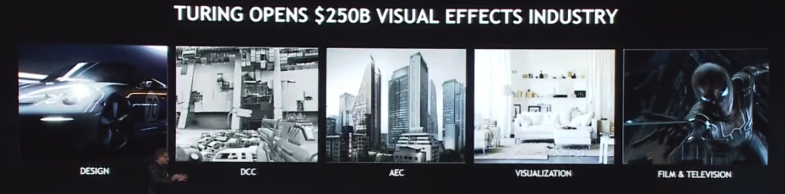

实时的光线追踪可以节省大量成本

## What does RTX do?
What does RTX do?

RTX 是一种硬件架构，允许做光线追踪

Impressive demos of RTRT (下图中都比较闪，原因是光线追踪更适合光滑材质)

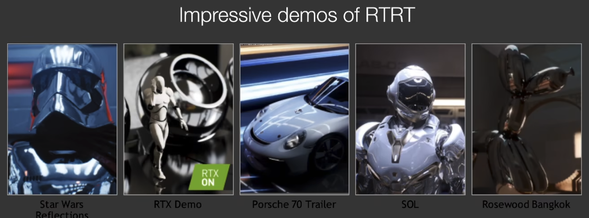

What does RTX actually do?

+ Advanced** ray traced **effects  软阴影、反射、环境光遮蔽、全局光照（与反射相比，这里的全局光照更多指diffuse的全局光照，这里即使是光线追踪都不是很好算）

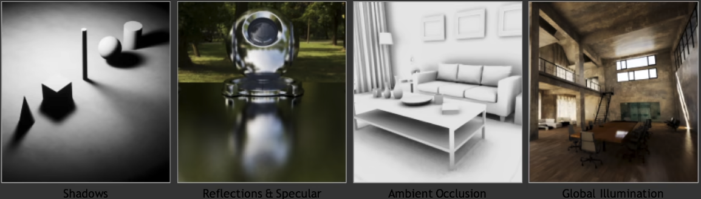

与之前GPU做光线追踪的区别：10 Giga rays per second（100亿光线）。RTX加了一个部件，用于加速光线和场景求交（tree tranversal），而这传统的GPU不好做。

100亿光线，并不多，1k分辨率就要除以200万了，能用于渲染的时间也只有几毫秒。2080是每像素一根光线

10 Giga rays per second == 1 sample per pixel (for real time applications) （RTX 2080）

1 SPP path tracing （一个光路的样本） = 

1. 1 rasterization (primary)  这里没用ray来表示，是考虑到了工业界的具体实现。图中也省略了这条光线。
2. + 1 ray (primary visibility)  遮挡关系。1和2构成直接光照。
3. + 1 ray (secondary bounce) 
4. + 1 ray (primary visibility)  3和4引入一次的间接光照

为了得到全局光照，至少考虑一次直接光加一次间接光以及遮挡关系，即上面这四个。

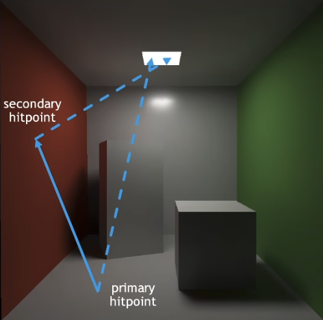

通过硬件加速，可以做1SPP的路径追踪，但这远远不够，噪声太大。path tracing本身是一种蒙特卡洛积分的方法，本身有很大噪声。之前path tracing 作业里，每像素64条光纤，得出来的结果都基本不能看，这个效果更差。

1 SPP = Extremely noisy results

因此，RTRT中，最关键的技术是什么？是降噪。

## Key technology - Denoising
Key technology

+ **Denoising**

RTRT中最关键的技术其实是降噪

        * 这里的降噪不是dlss这种orthogonal的可以和RTRT解耦合各自独立用的技术，而是和RTRT紧耦合的技术

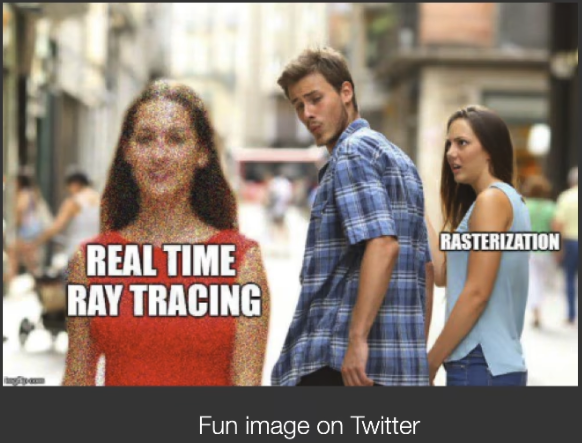

# State of the Art* Denoising Solution
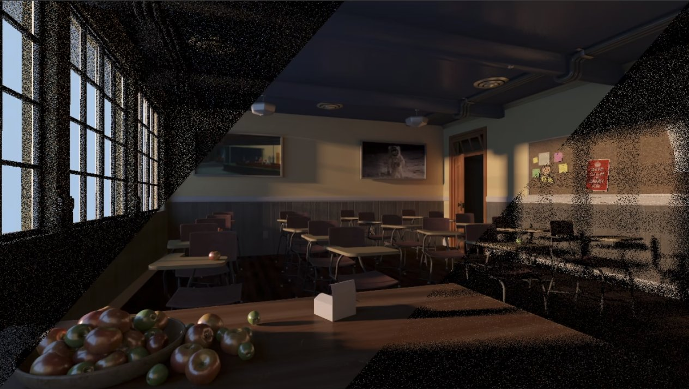

RTRT 降噪技术，学术界18年-21年研究的比较少

上图是真实降噪结果

# Before we proceed...
## Mission
+ Goals (with 1 SPP)
    - Quality (no overblur（糊成一片）, no artifacts（渲染过程出产生的一些不希望的现象）, keep all details...)
    - Speed (< 2 ms to denoise one frame) 
+ Mission impossible （1 SPP + high quality + fast speed） 降噪方法很多，针对RTRT的降噪方法非常少
    - Sheared filtering series (SF, AAF, FSF, MAAF, ...)
    - Other offline filtering methods (IPP, BM3D, APR, ...) 离线渲染中，滤波一张图甚至可能要几分钟。
    - Deep leraning series (CNN, Autoencoder, ...) 深度学习正常不行
        * 深度学习的降噪本身不一定是针对光线追踪做的 
        * 速度满，跑一遍要几十到几百毫秒（旧的NVIDIA OPTICS API）
        * 但是。。。2023年，NVIDIA 出了DL的降噪。。。

## industrial Solution
3 most important ideas

+ Temporal!
+ Temporal!!
+ Temporal!!!

Key idea 时间上的复用

+ Suppose the previous frame is denoised and reuse it。shading也可以假设是连续的。
+ Use motion vectors to find previous locations
+ Essentially increased SPP。复用上一帧相当于2 SPP。考虑到复用是个递归的过程，实际上SPP提高非常多。

Spatial？后面再说

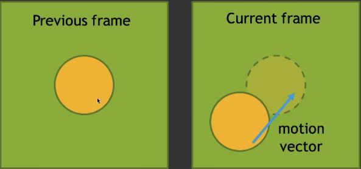

# Temporal Denoising
## The G-Buffers
之前说，渲染一张图的时候，可以得到许多**屏幕信息**。如深度图、法线图、世界坐标图、albedo图（之前提到的blin phong反射模型提到的 kd）

+ Geometry Buffer 几何缓冲区
    - The auxiliary information acuired FOR FREE* during rendering 可以理解为在渲染场景的过程中，可以免费得到一些额外的屏幕空间信息。通常认为获取这些信息不需要任何代价。（实际上肯定有代价，但可以忽略不计）
        * 光线追踪中，渲染 primary ray 的时候顺便得到的辅助信息
    - Usually, per pixel depth normal, world coordinate, etc.
    - Therefore, only screen space info.

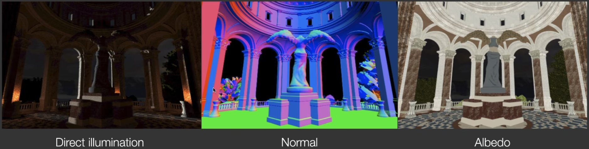

## Methods
### Back Projection
 temporal 最重要的是，找对应

+ Pixel x in the current frame i.找当前帧某个像素对应上一帧的哪个像素
+ What pixel in frame $ i-1 $contains the same place/point that you see thought pixel x in frame $ i $. 找的不是像素自己，找的是像素里的内容上一帧在哪个像素

Back Projection（可以认为是 CV 中optical flow（光流）的一种）

找对应的方法叫 Back Projection：当前帧像素 =>物体世界坐标 => 上一帧像素

+ Pixel x in the current frame i
    - Where was it in the last frame i-1?
+ Back projection
    - 当前帧像素 => 物体世界坐标
        * If world coord s is available as a G-buffer, just take it 直接从G buffer中取世界坐标
        * Otherwise, s= $ M^{-1}V^{-1}P^{-1}E^{-1}x $(still require z value) 逆向MVP 。输入不是一个屏幕二维坐标，要带z
    - 物体世界坐标 => 上一帧像素
        * Motion is known: $ s'\xrightarrow{T}  s $，thus $ s = T^{-1} s' $。 T怎么知道？我们负责整个渲染的过程，每一帧之间的运动过程自然是知道的。Motion Vector 就是CV中的optical flow（光流），但和CV不同的点在于，这里百分百精准且快速。
        * Project world corrd in frame $ i-1 $to its screen: $ x'=P'V'M's' $

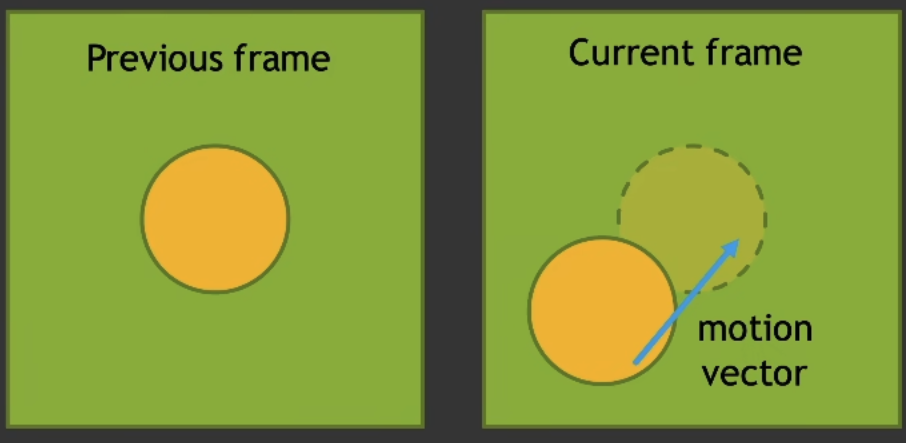

### Temporal Accum./Denoising
知道了当前像素，和对应的上一帧像素，怎么做 denoising？

最简单的方式：做一个线性的blending，按照一定比例混合

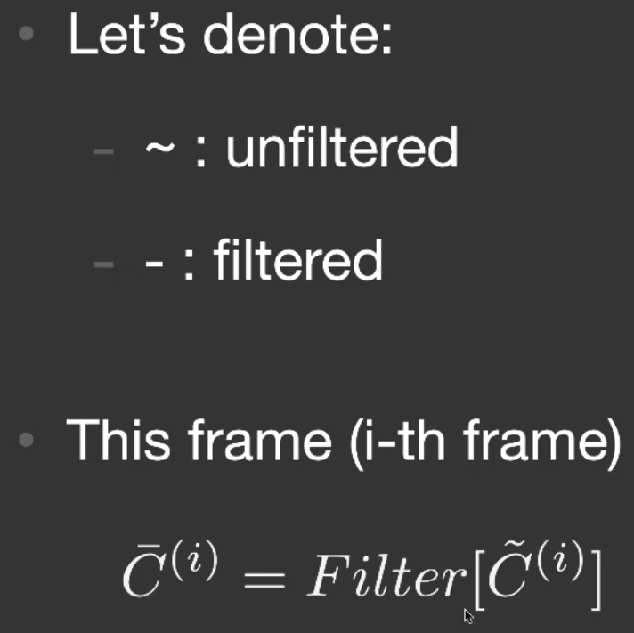

正确做法：

1. 空间降噪：先对当前帧做个简单的降噪，让它没那么noisy 。下一小节会讲。
2. 时间降噪：然后结合上一帧做降噪

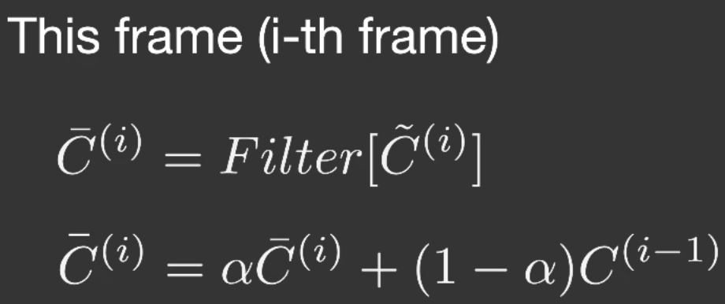（最后一个C的顶部应该加一个横杠）

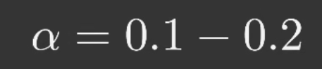

$ \alpha $一般取 0.1 - 0.2，其实80%-90%的贡献都来自上一帧。

## 效果
降噪前：

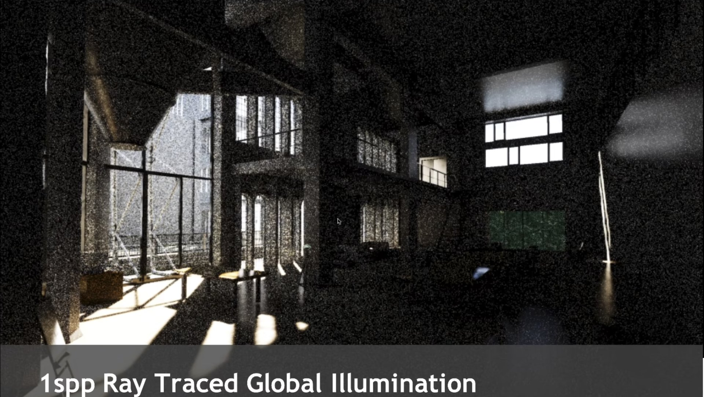

降噪后：

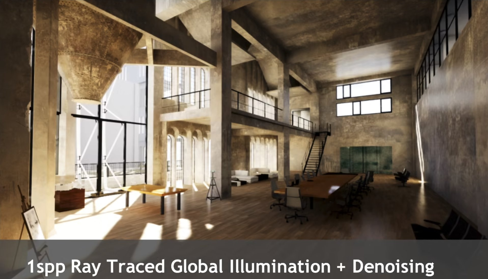

光线追踪很长时间后的 ground truth：

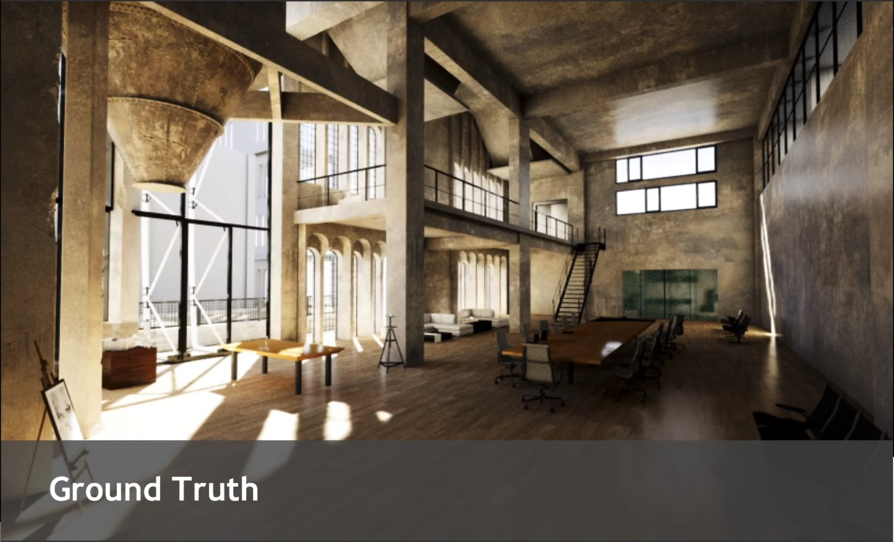

Q：滤波会让图片变得更亮或更暗？降噪之前明显更暗，降噪之后变亮了许多，是不是不遵循能量守恒？

A：其实降噪前有很多点的值是非常非常大的，超过1，超过普通显示器的显示能力。显示器由于能力限制损失了很多能量，所以降噪前看起来整体偏暗。在HDR显示器上，两个图会差不多亮。

## Temporal Failure
时间复用非常好用，但一些情况下不好用。

+ Temportal info is always available
    - Failure case 1: switching scenes (burn-in period) 切换场景、切换镜头、切换光源（光照发生巨大变化时，如迪厅）时会出现问题。需要一段预热时间。
    - Failure case 2: walking backwards in a hallway (screen space issue) 没有任何一个 temporal denoising 相关论文敢做倒退(或镜头拉远)的例子。倒退过程中，屏幕中的信息越来越多。缺少新增物体的G buffer信息。
    - Failure case 3: suddenly appearing background (disocclusion)。蓝点当前帧没被挡住，但在上一帧中被遮挡住。本质也是 screen space issue。
    - 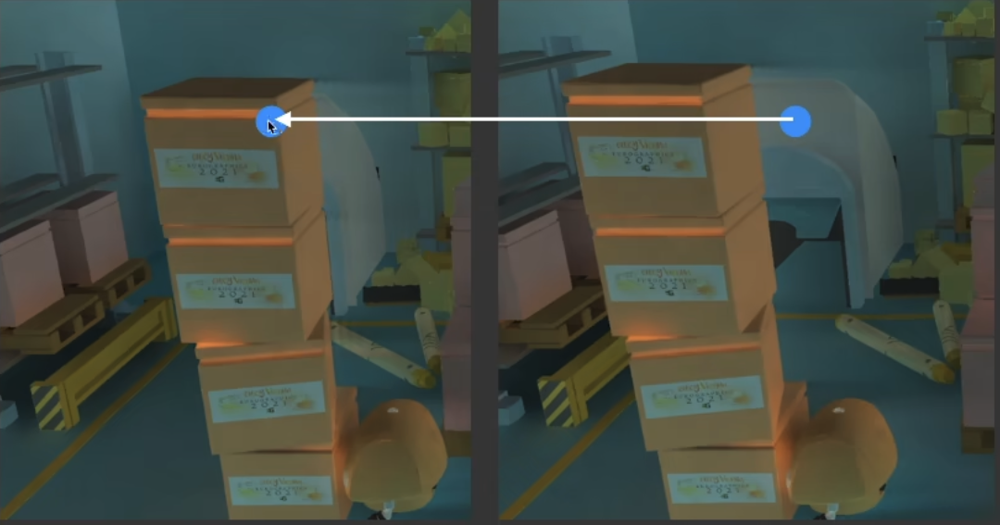

We can still blindly use temporal information

+ Of course, this is incorrect 上一帧搬了百分之八九十，错太多
+ But what kind of artifact will it bring? Lagging（或ghosting）。 产生的artifact被称为残影（拖尾）

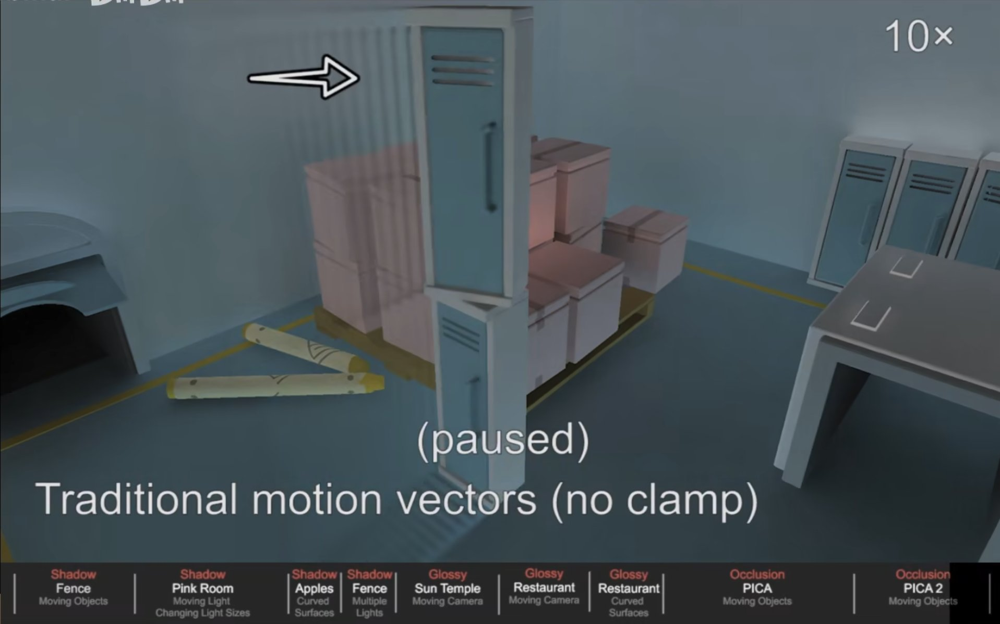

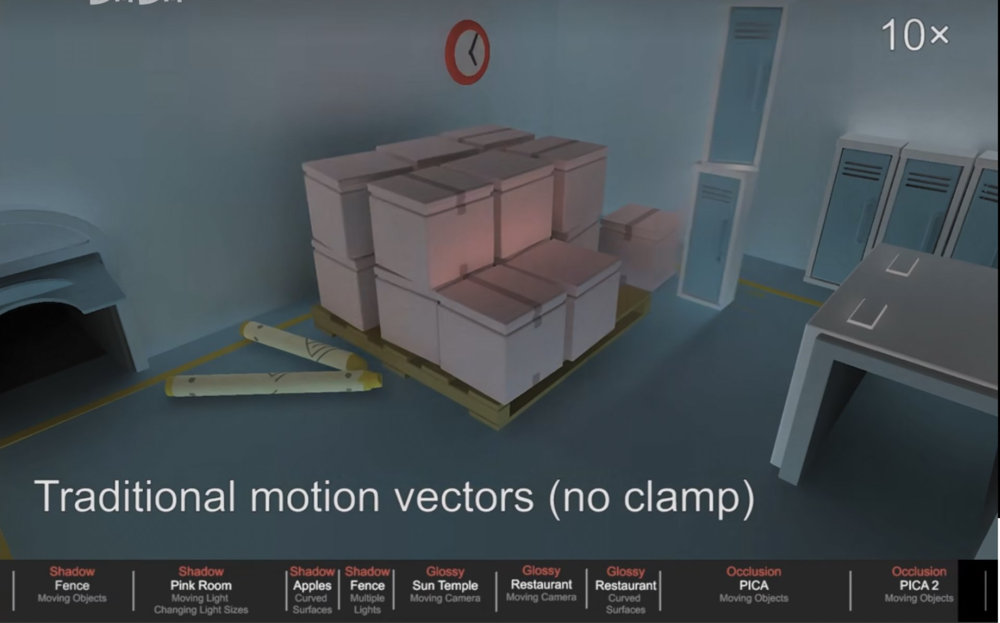

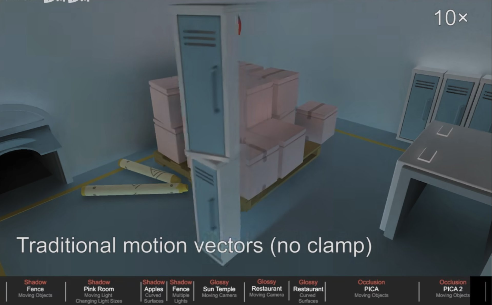

怎么解决这个问题？强行用上一帧的信息肯定不行，要聪明的用上一帧信息。两种主流方法：Clamping 和 Detection。

+ Clamping
    - 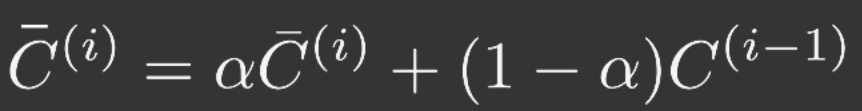
    - Clamp previous toward current
    - 应用上一帧值的时候，先把上一帧的值拉近到足够接近当前帧值的程度，再去做线性的blending。
    - 这一帧的结果得到一个范围值，把上一帧的结果限制到当前帧的范围之间。比如取n个sigma的范围（如7*7范围）
    - 问题：重新引入噪声
+ Detection
    - 检测是否用上一帧信息
    - Use e.g. object ID to detect temporal failure  用color map判断下是不是同一个物体。学术界还有其他复杂方法
    - Tune a, binary or continuously（也可以不那么绝对，只是降低上一帧的权重）
    - Possibly strengthen / enlarge spatial filtering
                - 

Problem: re-introducing noise!   重新引入噪声。出现问题时，当前帧（未降噪）的权重更大，意味着噪声更大。

做完clamp后的效果：

看不到拖影了，但看到噪声了。两者类似但不是一个东西。

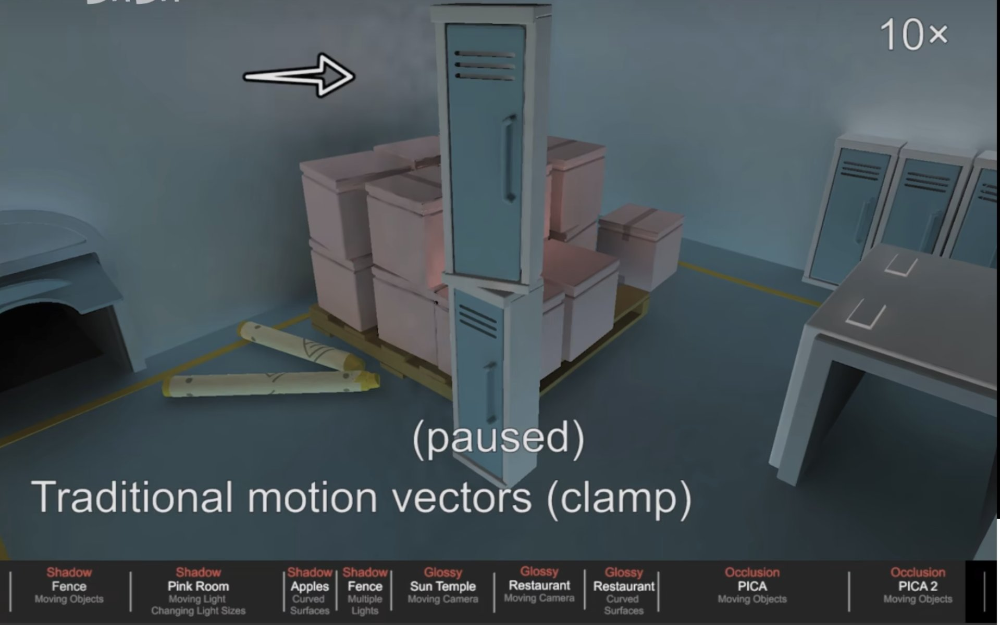

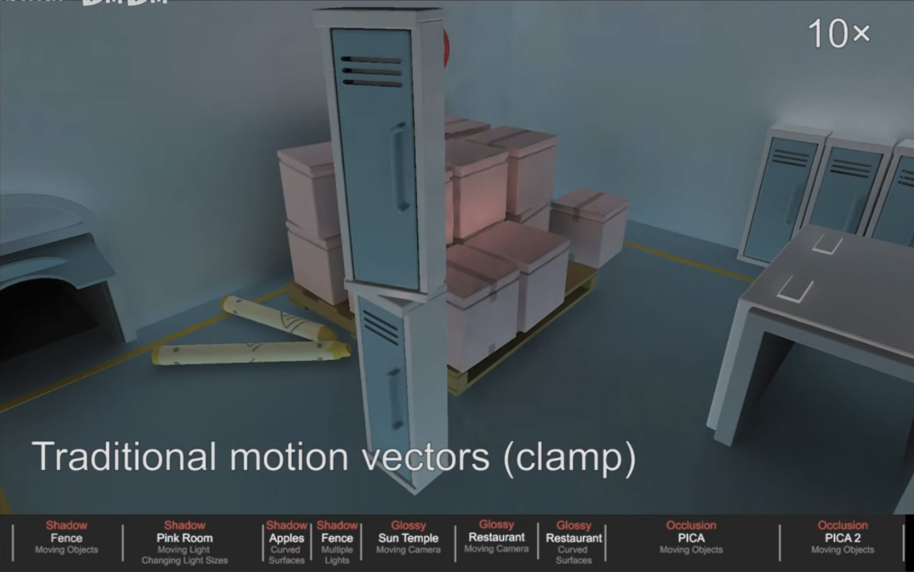

More Temporal Failure

+ Temporal failure can also happen in shading
    - Consider the "fence" scene with a moving light behind
    - What's the motion vector of the shadows?

下图中，柱子背后有一个移动的面光源，此时：

+ motion vector 为0， 物体没有动，只是光源动
+ 产生 detached/lagging shadows 问题，阴影拖尾问题，光源移动快时非常常见

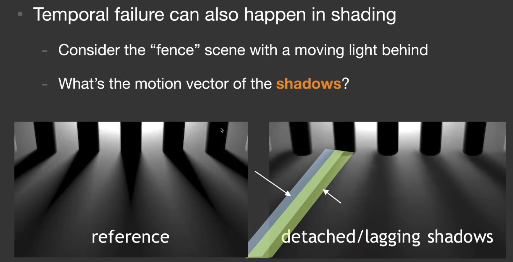

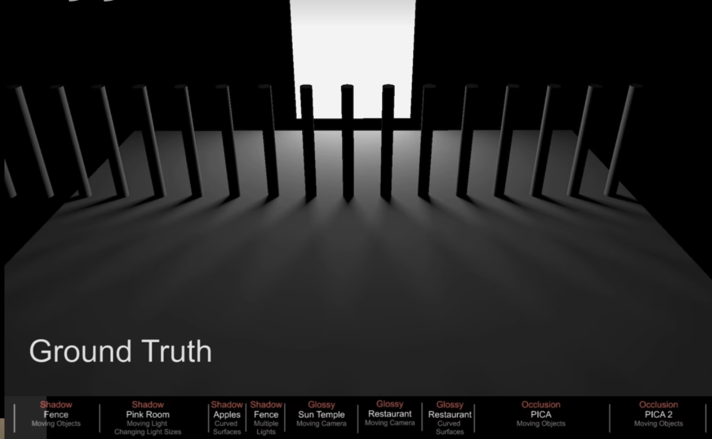

  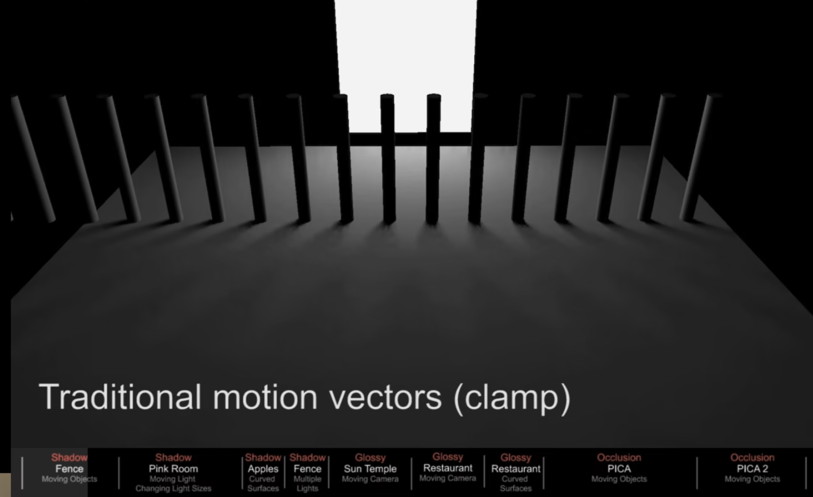

Shading不仅会出现和阴影相关的问题，还有其他问题：

glossy 反射时的问题

+ Temporal failure can also happen in shading
    - Consider the "fence" scene with a moving light behind
    - What's the motion vector of the glossy reflected images?

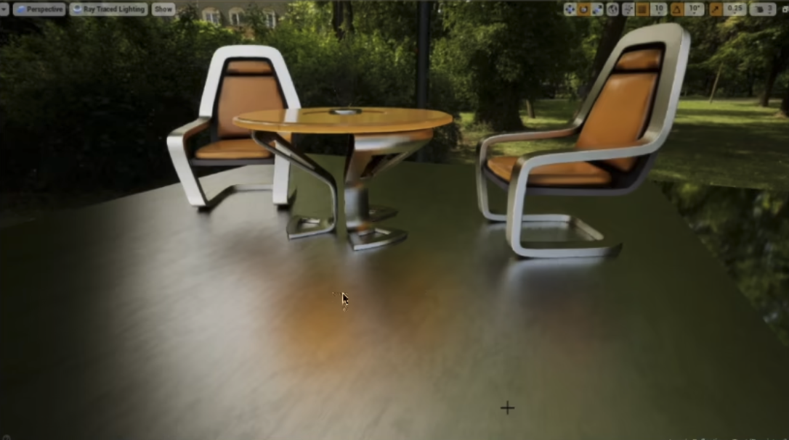

此时，移动物体，地板不动。带来的问题：一个物体与地板接触的地方，地板反射的是另一个物体。（需要花一些时间，才能让反射阴影跟上物体的移动）

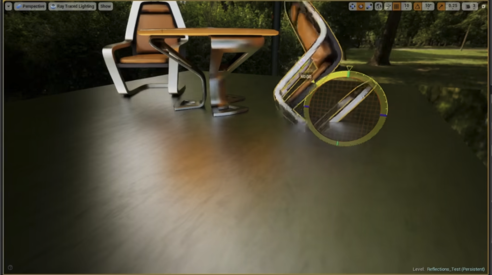

## Some Slide Notes
一切利用时间信息的思路都是差不多的，包括TAA，DLSS

+ The temporal accumulation is inspired by Temporal AntiAliasing (TAA)
    - They are very similar
    - Temporal reuse essentially increases the sampling rate
+ Is there any research on further alleviating temporal failure?
    - Yes! Our Eurographics (EG) paper： "Temporally Reliable Motion Vectors for Real-time Ray Tracing"

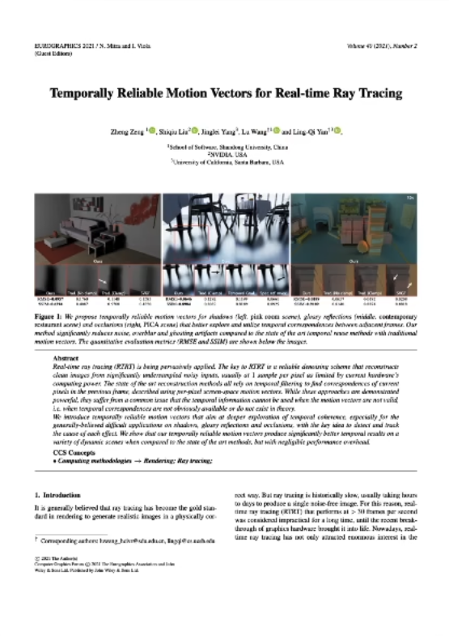

# Spatial Denoising
回顾filter实际分两步，temporal 和 spatial 的filter都要用到。temopral上怎么累积知道了，但如何在当前帧 filter ？

在 G-Buffer 的帮助下，当前帧可以 filter 的非常好。采用建立在双边滤波之上 的 联合双边滤波技术。

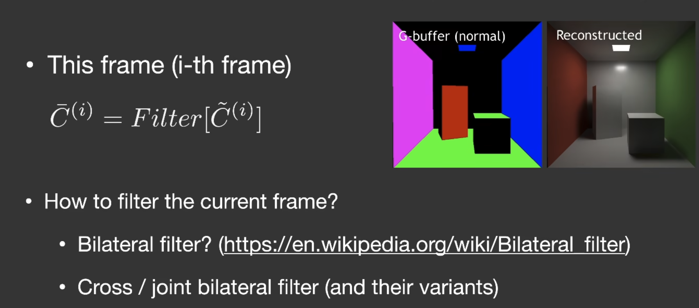

> 更新: 2024-09-30 16:53:15  
> 原文: <https://www.yuque.com/viruspc/el3mi0/wogxv5f1mv2rk23h>