# Real-time PBR Materials

- [Summary](#summary)
- [PBR and PBR Materials](#pbr-and-pbr-materials)
  * [Overview](#overview)
  * [PBR Materials in RTR](#pbr-materials-in-rtr)
- [Microfacet BRDF](#microfacet-brdf)
  * [The Fresnel Term](#the-fresnel-term)
    + [Introduction](#introduction)
    + [Dielectric](#dielectric)
    + [Conductor](#conductor)
    + [Formulae](#formulae)
  * [Normal Distribution Function (NDF)](#normal-distribution-function-ndf)
    + [Introduction](#introduction-1)
    + [Beckmann NDF](#beckmann-ndf)
    + [GGX NDF](#ggx-ndf)
    + [GTR (Generalized Trowbridge-Reitz)](#gtr-generalized-trowbridge-reitz)
  * [Shadowing Masking Term](#shadowing-masking-term)
    + [Introduction](#introduction-2)
    + [Smith shadowing-masking term](#smith-shadowing-masking-term)
  * [Problems](#problems)
    + [Multiple Bounces](#multiple-bounces)
    + [The Culla-county Approximation](#the-culla-county-approximation)
      - [背景](#%E8%83%8C%E6%99%AF)
      - [Key idea（无颜色）](#key-idea%E6%97%A0%E9%A2%9C%E8%89%B2)
      - [预计算](#%E9%A2%84%E8%AE%A1%E7%AE%97)
      - [考虑有颜色的情况](#%E8%80%83%E8%99%91%E6%9C%89%E9%A2%9C%E8%89%B2%E7%9A%84%E6%83%85%E5%86%B5)
    + [However, An Undesirable Hack](#however-an-undesirable-hack)
  * [Shading under polygonal lighting](#shading-under-polygonal-lighting)
    + [Linearly Transformed Cosines (LTC)](#linearly-transformed-cosines-ltc)
      - [Background](#background)
      - [Key Idea](#key-idea)
      - [计算](#%E8%AE%A1%E7%AE%97)
      - [Results](#results)
      - [Problems](#problems-1)
- [Disney principled BRDF](#disney-principled-brdf)
  * [Why is it needed?](#why-is-it-needed)
  * [High level design goal](#high-level-design-goal)
  * [What is "principled"?](#what-is-principled)
  * [How does it work?](#how-does-it-work)
  * [Pros and Cons](#pros-and-cons)
  * [其他](#%E5%85%B6%E4%BB%96)
- [Non-photo realistic rendering (NPR)](#non-photo-realistic-rendering-npr)
  * [Introduction](#introduction-3)
  * [Goal](#goal)
  * [Characteristics of NPR](#characteristics-of-npr)
  * [Applications of NPR](#applications-of-npr)
  * [What are Styles?](#what-are-styles)
  * [Outline Rendering](#outline-rendering)
    + [Outline Defination](#outline-defination)
    + [Method1: Shading](#method1-shading)
    + [Method2: Geometry](#method2-geometry)
    + [Method3: Image](#method3-image)
  * [Color blocks](#color-blocks)
  * [Stroke Surface Stylization](#stroke-surface-stylization)
  * [Some Notes](#some-notes)
  * [Key Obervations](#key-obervations)

---

# Summary
+ Real-Time Physically-Based Materials
    - Microfacet BRDF
        * The Fesnel Term
            + 作用：描述有多少能量被反射。
            + 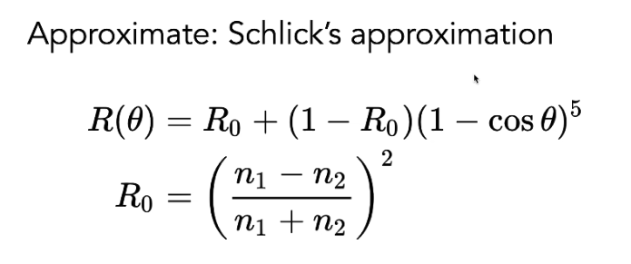
        * Normal Distribution Function
            + 作用：通过描述微表面法线分布，来表达粗糙程度
            + Beckmann NDF
                - 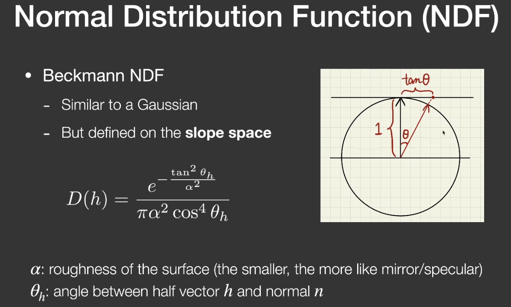
                - 重点看分子，分母用于归一化。
                - 可以理解为**定义在斜率空间的高斯函数**
                    * 可以描述不同粗糙程度的表面。高斯函数用$ \sigma $控制宽度，这里用$ \alpha $控制宽度，进而控制粗糙程度。$ \alpha $越大，函数越宽，越diffuse
                    * 是定义在斜率空间的，保证不可能出现面朝下的微表面。
            + GGX NDF
                - 又叫 TR 模型。用的非常多，有取代beckmann的趋势
                - 特点**：long tail。**具备长尾的特点。
                - 优势：与高斯分布相比，衰减到一定程度后，衰减速度会放缓。衰减到90度时，仍然不怎么是0。对于稍微粗糙的物体：beckmann会导致高光之外的地方看起来全是黑的；GGX不会，高光之外的地方有一点点diffuse的感觉。
                - 效果：意味着在高光周围，存在光晕的现象。
            + GTR (Generalized Trowbridge-Reitz)
                - 背景：Extending GGX
                - 优势：Even longer tails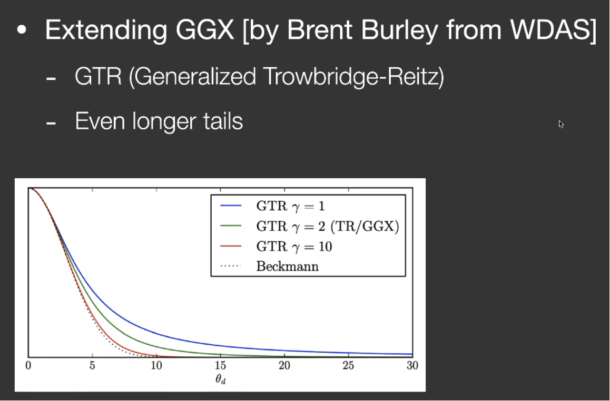
        * Shadowing Masking Term
            + 作用：考虑微表面之间的自遮挡问题。没有G项时，在掠射方向（球的边缘处），f 的分母会变得无限小，f 变得无限大，**会导致物体的边缘非常白/亮**。G项可以让这里变暗，解决这个问题。
                - 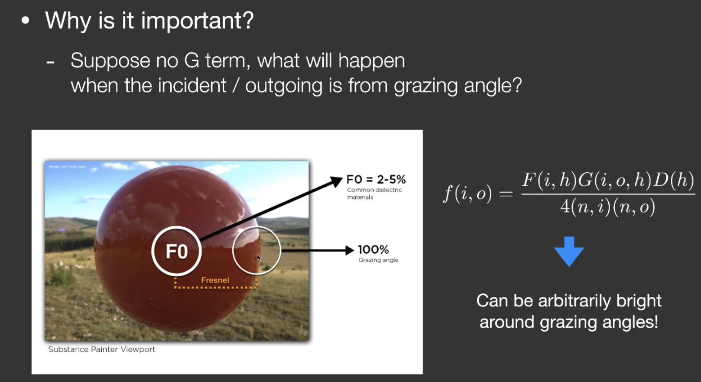
            + 怎么得到 shadowing masking term？ 假设法线分布，然后根据法线分布去推shadowing masking 项
        * Diffuse 材质的 Multiple Bounces 问题 与 Culla-county Approximation 
            + 介绍：微表面模型本身只是定义光线弹射一次的结果，没有考虑到多层光线弹射，带来能量损失。通过Culla-county Aprroximation 可以补上这块损失的能量。
            + 背景：白炉测试说明，光照不变，材质roughness越大，能量损失越严重。同样的弹射次数，粗糙表面损失的能量更多。
                - 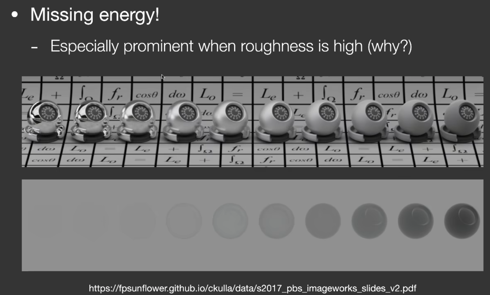
            + 解决方法：把丢失的能量补回来。存在准确的方法，从考虑1次bounce 到 考虑微表面之间的多次bounce [Heitz et al. 2016]。但是，这是种基于模拟的方法，在RTR中太慢了。RTR中通过 The Culla-county Approximation 来补**弹射的能量**
                - 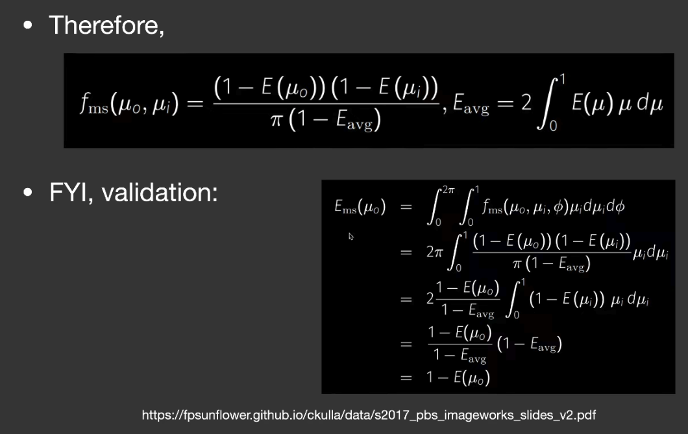
            + 加速
                - 预计算$ E_{avg}(\mu_o) $，结果存到表中
            + 考虑有颜色的情况
                - **减去颜色吸收的能量。**
                - 颜色项：
                    * 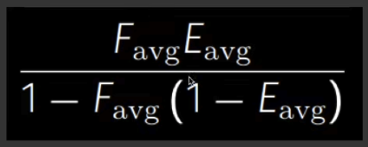
                    * Fresnel、E 都是三维的，RGB三个通道分开算。
            + Culla-county Approximation  的最终形态：补上弹射的能量，减去颜色吸收的能量。
        * Shading Under polygonal lighting
            + Linearly Transformed Consines (LTC)
                - LTC 可以在多边形光源下，做微表面模型的 shading
+ Disney principled BRDF
    - Motivation：
        * Microfacet BRDF 不能表示所有材质：比如很多microfacet model不考虑diffuse项，无法解释多层材质(涂了轻漆的木桌面)
        * PBR 材质的参数正常情况下都是些物理量，对艺术家不友好
    - Design Goal
        * **Art directable**, not necessarily physically correct
        * But agian, referred to as PBR in real-time rendering
    - What is principled
        * The BRDF is designed with** a few important principles**
        * **intuitive** rather than phycical parameters should be used. 饱和度等
        * There should be as **few parameters** as possible.
        * Parameters should be **zero to one** over their plausible range. 方便艺术家用一个拖动条来调整参数。
        * All **combinations **of parameters should be as robust and plausible as possible. 所有的参数设为任意值时，程序都不会崩掉
    - How does it work?
        * 
    - Pros and Cons
        * Easy-to-understand/control
        * A wide range of materials in a single model
            + 回忆工业界为什么在microfacet加一层diffuse：一些材质表达不了。
        * Open source implementation is available
        * Not physically based 不是基于物理的，但一般也称为基于物理的
            + But is it a big problem?
            + Acxademia vs. industry
        * Huge parameter space
+ Non-photorealistic rendring (NPR)
    - Outline
        * Shading：复制几何，扩大涂黑后放到原几何之下
        * Geometry：扩大并涂黑背面几何
        * Image：图像后处理，边缘检测
    - Color blocks
        * 基本思想：阈值
        * Hard shading: thresholding on shading
        * Posterization
    - Stroke surface Stylization
        * 基本思想：通过控制格子密度，来控制明暗度。
        * 提前准备不同密度的贴图，mipmap要保持格子密度

# PBR and PBR Materials 
## Overview
+ Physically-Based Rendering (PBR）
    - Everything in rendering should be physically based
    - Materials, lighting, camera, light transport, etc.
        * lighting：真实的灯光，大教堂的光
        * camera：薄透镜、透镜组成像
        * light transport：真是的光线传播
        * material：
        * 一般PBR主要指PBR材质。
    - Not just materials, but usually referred to as materials :)
+ PBR materials in RTR
    - The RTR community is much behind the offline community
        * 出于渲染速度的考虑，实时渲染中的材质的丰富度、质量、准确度明显落后于离线渲染
    - 'PB' in RTR is usually not actually physically based :)
        * 实时渲染中的PBR做了大量简化，基本都不是基于物理的了。。
        * 

## PBR Materials in RTR
PBR materials in RTR：

+ For surfaces, mostly just： 主要指两块
    - microfacet models (used wrong so not PBR) and （微表面模型本身是基于物理的，但RTR中有时候会错误使用，不那么PBR）
    - Disney principled BRDFs (artist friendly but still not PBR) （本身就不是PBR）（计算量小，实现简单，能表达的材质种类丰富）
+ For volumes, mostly focused on fast and approximate single scattering and multiple scattering (for cloud, hair, skin, etc.) 光线在体积中作用一次或多次
+ Usually not much new theory, but a lot of implementation hacks* (PBR材质方面没有什么新理论，基本就是离线渲染中在用的那些理论。但是，这些理论放在实时渲染中开销巨大，需要考虑如何用一些hack降低渲染开销)
+ Still, performance (speed) is the key factor to consider。（实时渲染中，最重要的是Performance）

表面现在做的不错，体积比较难做

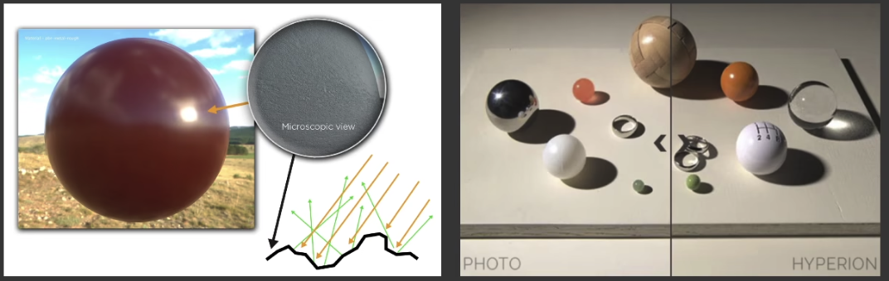

# Microfacet BRDF
什么是微表面的BRDF？

认为表面在宏观上看是平的，但是微观上看会看到各种各样的微表面，这些微表面的法线各不相同。而法线不同的分布，导致最终看到的结果的不同。

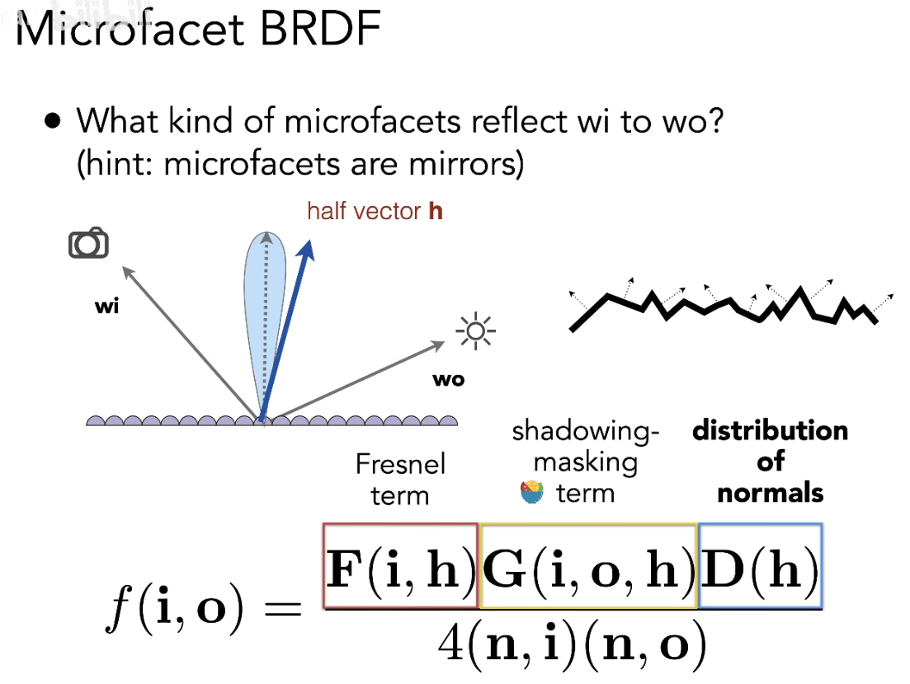

+ F(i, h)：Fresnel项，决定了从一个方向看过去，有多少的能量会被反射。由入射方向和半程向量决定。 
+ G(i, o, h)：遮挡关系
+ **D(h)：微表面的法线的分布，是最重要的一项**。给定一个入射方向和一个出射方向，什么样的微表面才能够把入射方向的光，反射到出射方向去？需要微表面的法向量和半程向量一致。D(h)描述了在半程向量方向的值是多少。

微表面模型为什么合理？给定一个入射方向和一个出射方向，问：什么样的微表面，才会把入射方向的光，反射到出射方向去？答：法线方向和半程向量方向一致的微表面。

## The Fresnel Term
### Introduction
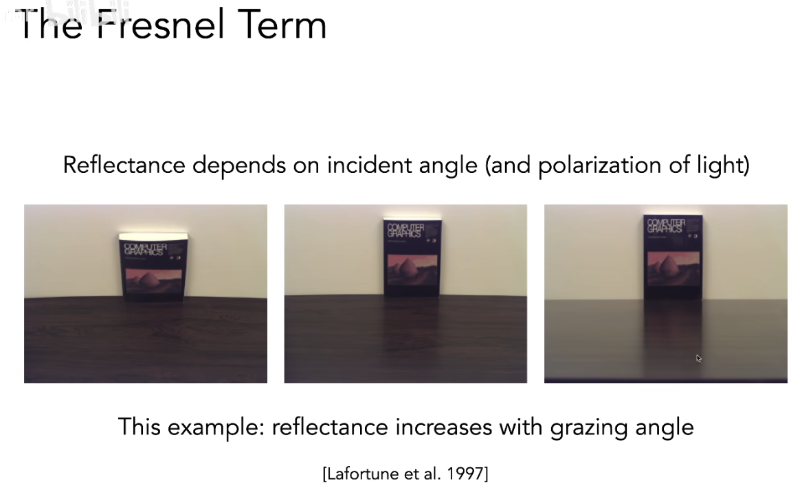 

有多少能量被反射，取决于入射光的角度。观察桌面可以发现，当入射角接近grazing angle（掠射角，和法线几乎垂直）时，反射光线最多。

菲涅耳项描述了，在不同的入射角下，有多少的能量会被反射 

### Dielectric
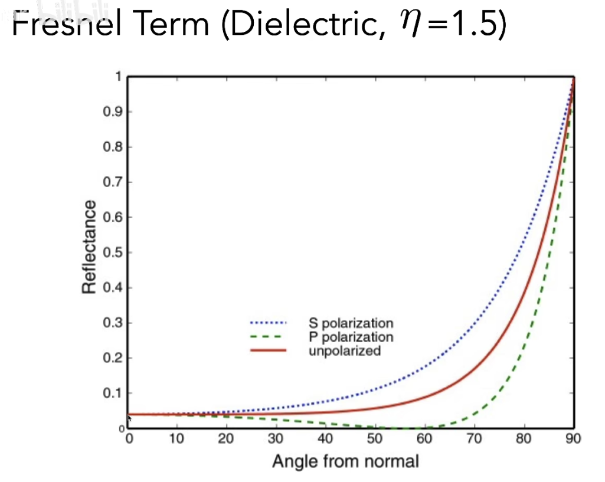

### Conductor
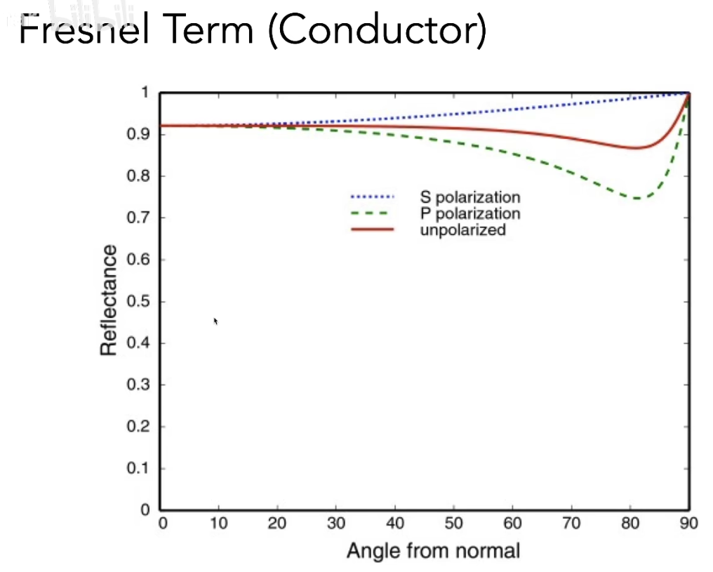

金属整体反射能量高很多（就算垂直看也90%多），但大致走势与半导体类似。

### Formulae
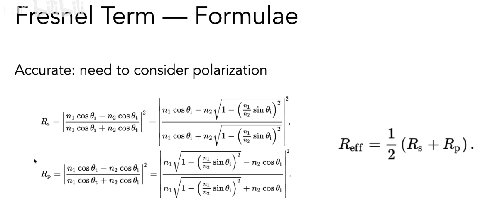

Fresnel项从物理上还要考虑极化。公式上考虑不同介质的折射率、折射角、入射角

直接算太复杂，可以做估计。90度时结果为1，0度时结果为0。估计曲线。

把Fresnel项拆成一个基础反射率 + 一个简单过渡曲线

## Normal Distribution Function (NDF)
### Introduction
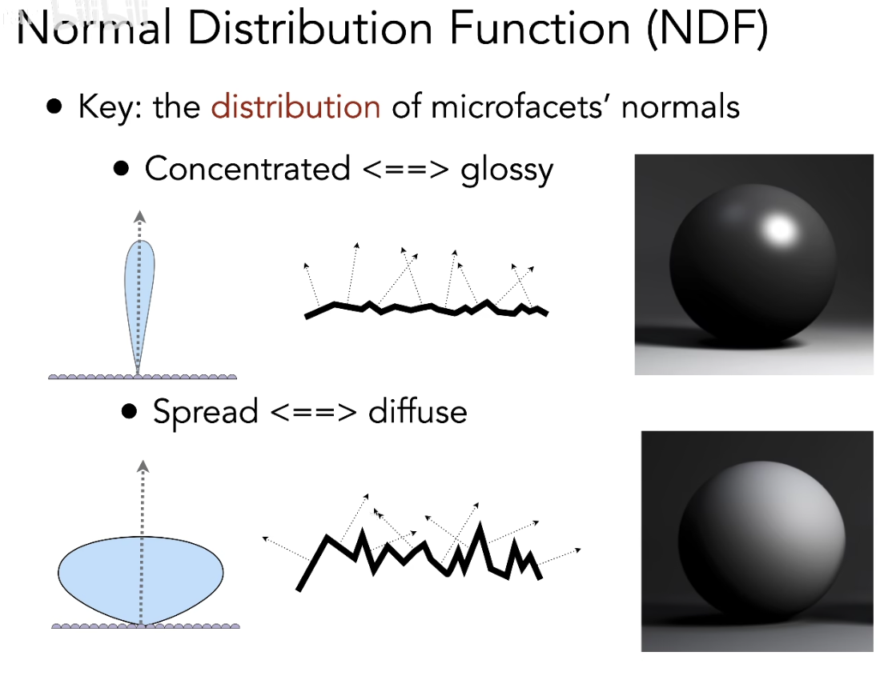

朝向都差不多时，得到一个glossy的；朝向差很多时，得到一个diffuse的。

怎么从上面的法线分布变为下面的分布？上下做scale，scale变大，微表面变得越来越深。

The Normal Distribution Function（NDF）

+ Note: has nothing to do with the normal distribution in stats
    - 这里的normal是指法线，不是指正态
+ Various models to descibe it
    - Beckmann, GGX, etc.
    - Detialed models [Yan 2014, 2016, 2018, ...]

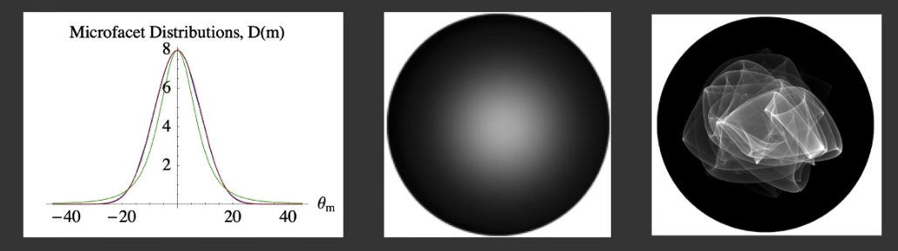

第一个球时 Beckmann模型，显然中间较集中。

接下来介绍两种经典的NDF

+ Beckmann
+ GGX

### Beckmann NDF

 

可以理解为**定义在斜率空间的高斯函数**

类似高斯函数，重点看分子，分母用于归一化。

怎么理解：

可以描述不同粗糙程度的表面。高斯函数用sigma控制宽度，这里用alpha控制宽度，进而控制粗糙程度。alpha越大，函数越宽，越diffuse

theta_h: 任意方向到h的角度。

显然，目前bechmann ndf 描述的是各相同性的结果(只有$ \theta
 $没有$ \phi
 $)。但也可以做各相同性。

**是定义在斜率空间的**。公式中为什么用 $ tan \theta_h $不直接用$ \theta_h
 $? 因为是定义在斜率空间的。夹角和上面切线的相交点，到切点的距离。

好性质：**保证不可能出现面朝下的微表面，**tan theta 不可能为大于90度。

公式的分母用于归一化，希望在projected solid angle上积分为1

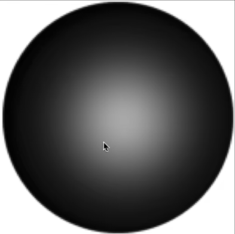

### GGX NDF
用的非常多，有取代beckmann的趋势

又叫 TR 模型

+ GGX (or Trowbridge-Reitz) [Walter et al. 2007]
    - Typical characteristic: **long tail!** 具备长尾的特点。
        * 与高斯分布相比，衰减到一定程度后，衰减速度会放缓。衰减到90度时，仍然不怎么是0.
        * 意味着在高光周围，存在光晕的现象
        * 对于稍微粗糙的物体：beckmann会导致高光之外的地方看起来全是黑的；GGX不会，高光之外的地方有一点点diffuse的感觉。

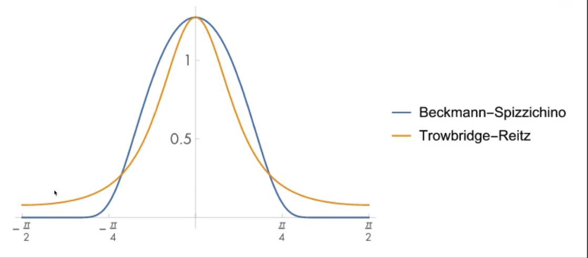

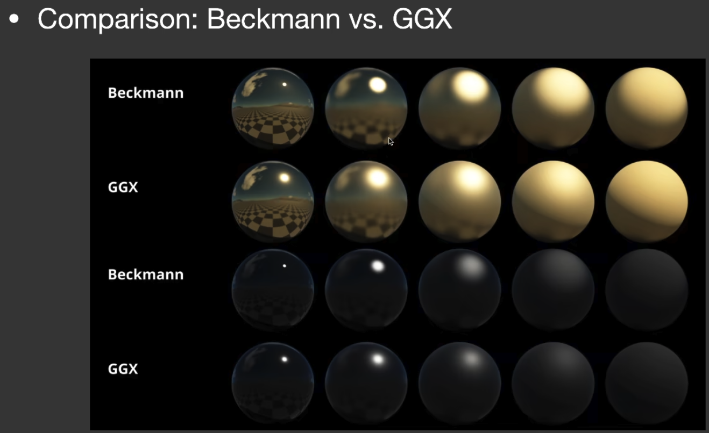

图中可以看出

+ beckmann的高光太尖锐了，像是突然没了；GGX有明显的过渡感，diffuse的范围也挺大

故，GGX看起来更自然。

beckmann有一点点像phong模型（Bling-Phong产生的高光比 Phong 更加柔和。）。

### GTR (Generalized Trowbridge-Reitz)
Extending GGX [by Brent Burley from WDAS]

+ GTR (Generalized Trowbridge-Reitz)
+ Even longer tails

## Shadowing Masking Term
### Introduction
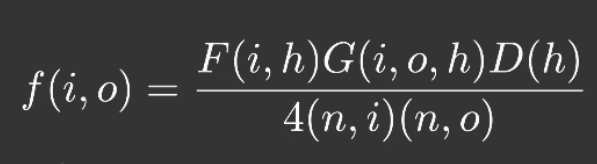

Shadowing masking term. Or, the geometry term G

+ Account for self-occlusion of micro facets 考虑微表面之间的自遮挡问题。尤其是掠射的时候问题很明显。
+ Shadowing -light, masking - eye 
    - 从light出发，一些地方光照不到，出现的微表面的遮挡现象就是 shadowing
    - 从eye出发，看不到一些微表面，出现的微表面的遮挡现象就是 masking
    - 二者本质一样，统称 Shadowing masking term 或 masking shadowing term
+ Provide darkening esp. around grazing angles. 引入这一项是为了什么？为了考虑由于遮挡产生的 darkening 现象，提供一个变暗操作。
    - 在视线靠近法线方向时，几乎为1。当靠近掠射方向时，几乎为0.

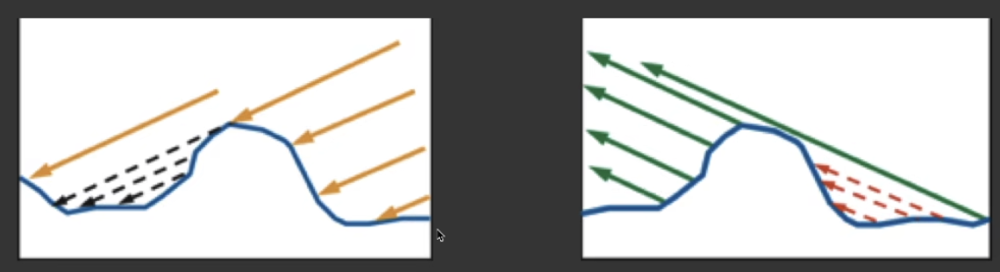

为什么这一项很重要？

+ Suppose no G term, what will happen
    - when the incident / outgoing is from grazing angle?
    - （下图已经考虑到了G项）。没有G项时，在掠射方向（球的边缘处），f的分母会变得无限小，f变得无限大，**会导致物体的边缘非常白/亮**。G项可以让这里变暗，解决这个问题。

怎么得到 shadowing masking term？ 假设法线分布，然后根据法线分布去推shadowing masking 项

### Smith shadowing-masking term
一个常用的 shadowing-masking term:

+ The Smith shadowing-masking term. 
+ 会区分 shadowing 和 masking

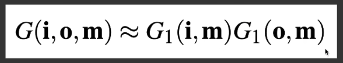

beckmann 和 GGX 对应的 shadowing masking term.

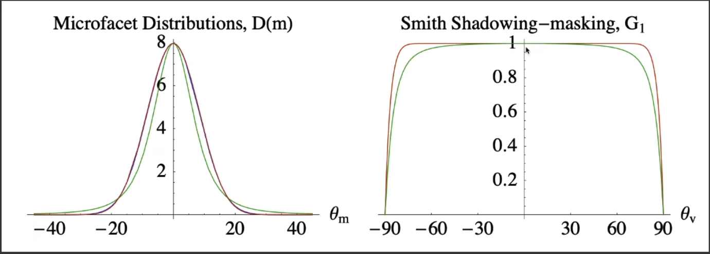

解决了物体边缘非常亮的问题，但是引入其他问题。

## Problems
### Multiple Bounces
三项都考虑后，还是发现有时候是对的，有时候不是对的。

下图中，左边相当于金属抛光，右边相当于哑光。颜色差很大，这是不对的。

第二行图（The White Furnace Test， 白炉测试）说明，光照不变，材质roughness越大，能量损失越严重。（希望最右侧和背景色一样，不是黑的）

也就是说对于diffuse材质会出现问题

越粗糙的表面，弹射次数越多。 => 同样的弹射次数，粗糙表面损失的能量更多。

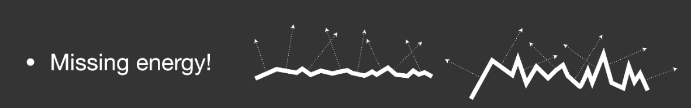

怎么办？把丢失的能量补回来

+ 存在准确的方法，从考虑1次bounce 到 考虑微表面之间的多次bounce [Heitz et al. 2016]
+ 但是，这是种基于模拟的方法，在RTR中太慢了

RTR怎么做？

+ Basic idea: Being occuded === next bounce happening 被遮挡 === 发生了下次弹射
+ The Culla-Conty Approximation

### The Culla-county Approximation
#### 背景
怎么把丢失的能量补回来？工业界非常常用的一个近似方法。通过经验的方式，补全多次bounce丢失的能量。

+ 只考虑一次反射，有多少能量离开这个表面？

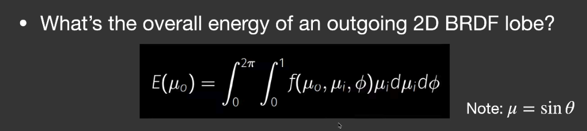

+ L项假设为1
+ BRDF项假设各向同性的，只考虑一个角度。
+ cos项包含在brdf项中
+ 对积分做了下换元

#### Key idea（无颜色）
Key idea

+ We can design an additional lobe that integrates to $ 1-E(\mu_o) $
    - 假设入射方向光能量为1， 反射到所有出射方向的能量之和为$ E(\mu_o) $，二者之间会因为Shadow Masking Term 而存在差距（能量损失）。
    - 根据能量守恒, $ E_{ms} = 1-E(\mu_o) $
+ The outgoing BRDF lobe can be different for different incident dir
    - BRDF是四维的。给定入射方向，BRDF变成二维，仅由出射方向的角度决定。
+ Consider reciprocity（考虑到光路的可逆性）, it should be* of the form
    - $ c(1-E(\mu_i))(1-E(\mu_o)) $
    -  c为一个归一化的量$ \pi(1-E_{avg}), E_{avg}=2\int^1_0 E(\mu) d\mu $，需要算出。
    - 
    - $ E_{avg} $就是，固定入射方向，出去的E的能量是多少。

#### 预计算
还存在一个问题，$ E_{avg}(\mu_o)=2 \int^1_0 E(\mu_i)\mu_i d \mu_i $ 太复杂了。如何快速计算出去的能量（固定入射方向）？

+ 参考Split Sum的处理方式：Precompute / tabulate
    - 预计算并以表格的形式存储下来。要求维度不能太高，不能依赖于太多项
    - $ E_{avg} $的维度？只有$ \mu_o $（各向同性）和 roughness

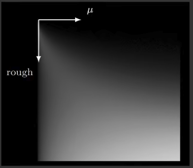

结果：

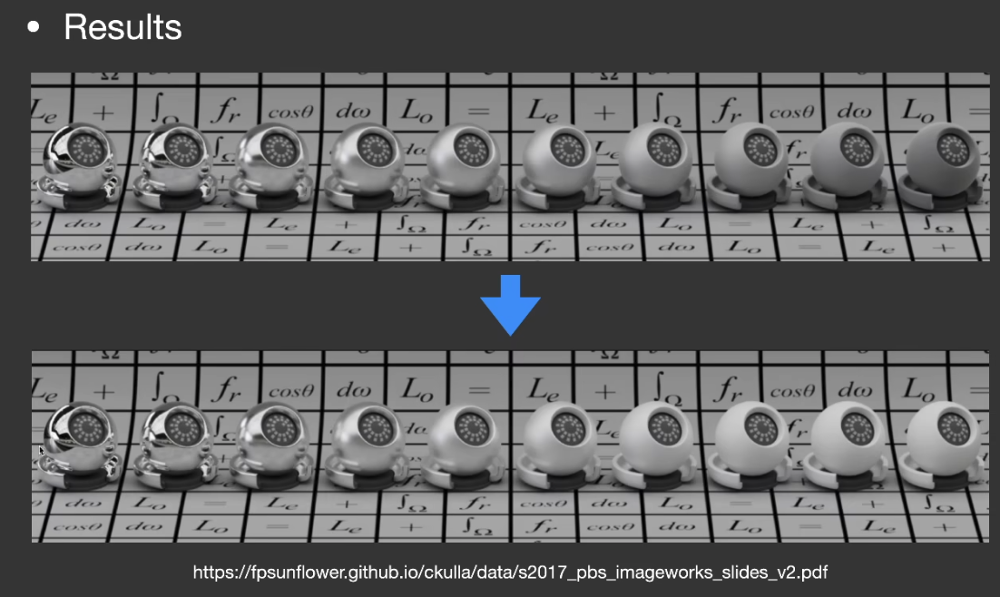

实时渲染上算起来非常容易，就是加了个BRDF考虑多次反射，而且可以采用打表预计算。

#### 考虑有颜色的情况
What if the BRDF has color? Kulla-County Approximation 继续考虑微表面模型已经有颜色的情况。考虑由于颜色吸收带来的能量损失。

+ Color == absorption == energy loss (as it should) 颜色代表着吸收。能看到颜色是因为一部分光被吸收了。看到颜色代表有额外的能量损失。
+ So we'll just need to compute the overall energy loss。

Define the average Frensel (how much energy is reflected) 定义平均每次反射损失多少能量

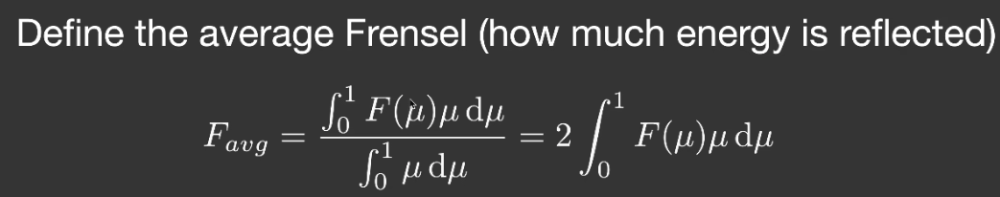

And recall that $ E_{avg} $is how much energy that you can see (i.e., will **NOT participate** in further bounces)

Therefore, the proportion of energy (color) that

+ You can directlyu see: $ F_{avg}E_{avg} $
    - $ F_{avg} $：有多少能量被反射
    - $ E_{avg} $: 被反射的能量有多少能被看到
+ After one bounce then be seen: $ F_{avg}(1-E_{avg})F_{avg}E_{avg} $\
+ 。。。
+ After k bounces then be seen: $ F^k_{avg}(1-E_{avg})^k \cdot F_{avg}E_{avg} $

Adding everything up, we have the **color term.** 累加得到 **颜色项 **

+ Which will be directly multiplied on the uncolored additional BRDF

都是三维的向量。Fresnel、E 都是三维的，RGB三个通道分开算。

结果：

弥补多次反射损失的能量，且根据颜色 去损失能量。

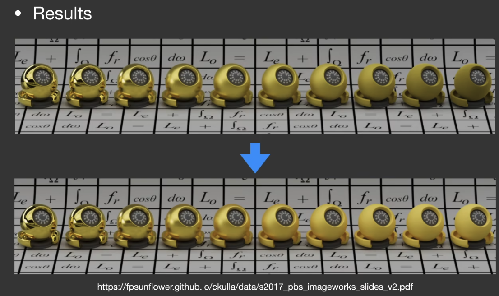

### However, An Undesirable Hack
Culla County Approximation 已经通过非物理但近似物理的方式补上了能量

但是，最近几年有人通过其他方式，解决microfacet BRDF在diffuse时变暗的问题：再加个 diffuse BRDF。

Combining a Microfacet BRDF with a diffuse lobe

+ Pervasively used in computer vision for material recognition
+ **COMPLETELY WRONG!**
+ **COULDN"T BE WORSE**

不要这么用！ microfacet 和 diffuse 不能共存，一个表面不可能既是 micro facet 又是 diffuse， 这是两个不同的模型。

但工业界都在用

存在的问题：

1. Physically incorrect 物理错误的
2. Not energy preserving 保证不了能量守恒
    1. (fixed in Kulla-Conty)
    2. 会搞出来一些错的会发光的BRDF

## Shading under polygonal lighting
microfacet BRDFs 定义好后，如何做 shading？

Split Sum 可以做环境光下的 shading。把环境光预处理一下拆出来。

这里说的 shading 是另外一回事，做多边形光源下的shading（甚至可以不均匀）。

Shading with microfacet  BRDFs under polygonal lighting

+ Linearly Transformed Cosines (LTC)

### Linearly Transformed Cosines (LTC)
#### Background
Unity 提出的

线性变换的余弦

其实不仅可以用于微表面模型，像blinn-phong模型这种用一个光滑的lobe函数（从中心往外衰减）定义的，都可以用

+ Solves the shading of microfacet models
    - Mainly on GGX, though others are also fine
    - No shadows
    - Under polygonal lighting 

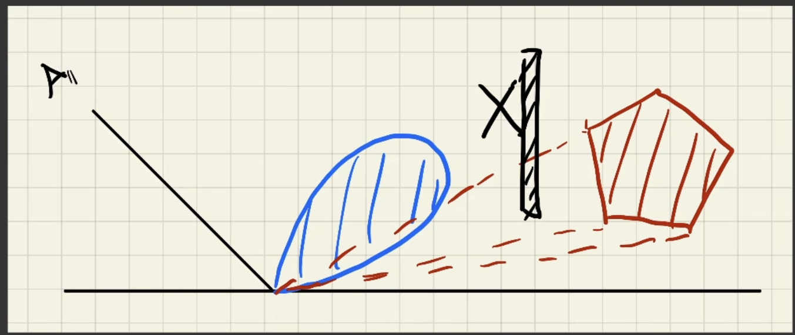

解决的问题：LTC解决的是，在微表面模型下，如果用一个多边形光源照亮一个着色点，在不考虑遮挡的情况下，这个着色点的颜色是什么。

没有LTC的话，需要在光源采样。LTC 避免了采样。

Split Sum 也是避免了采样，但 Split Sum 做的是环境光下的采样。

#### Key Idea
+ Any outgoing 2D BRDF lobe can be transformed to a cosine
+ The shape of the light can also be transformed along
+ Integrating the transformed light on a cosine lobe is analytic

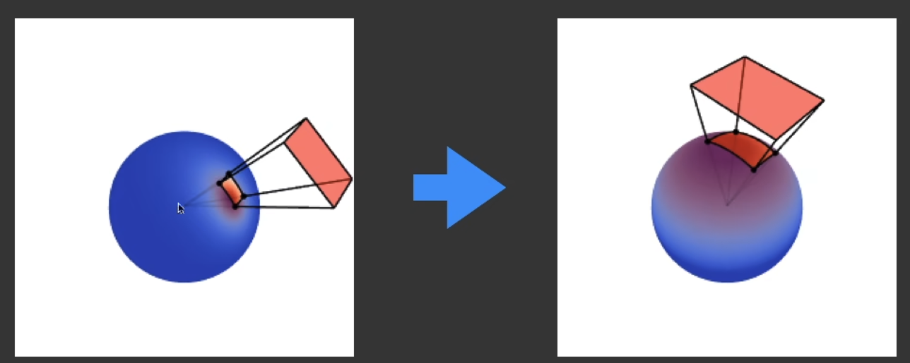

任意的BRDF lobe在任意的多边形光源的shading 

=> 转变为在一个固定的 cosine 下，对任意多边形光源进行积分 

=> 要积分的东西就是cosine，只不过积分的范围各不相同，而这个范围又是多边形，则这个积分是有解析解的

注：cosine在极坐标下是个圆

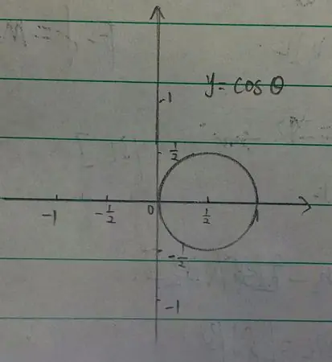

#### 计算

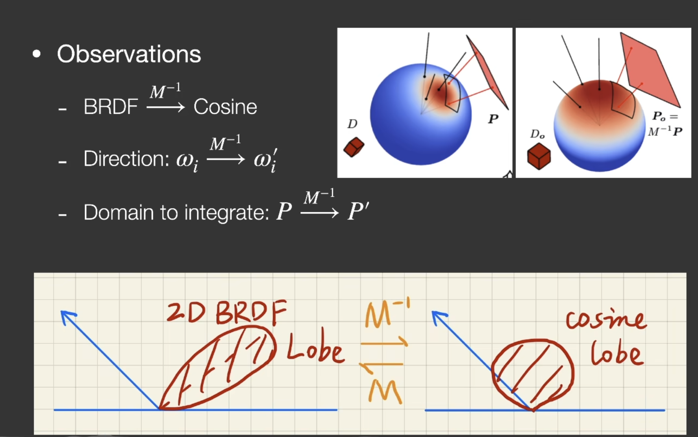

观察发现，三个地方变了

1. BRDF 经矩阵$ M^{-1} $变为 cosine
2. 所有的方向 $ w_i $ 经矩阵$ M^{-1} $变为$ w_i' $ 
3. 积分域 $ P $ 经矩阵$ M^{-1} $变为 $ P' $

具体怎么变？

先假设均匀光源，也可以做非均匀。且假设$ M $已知

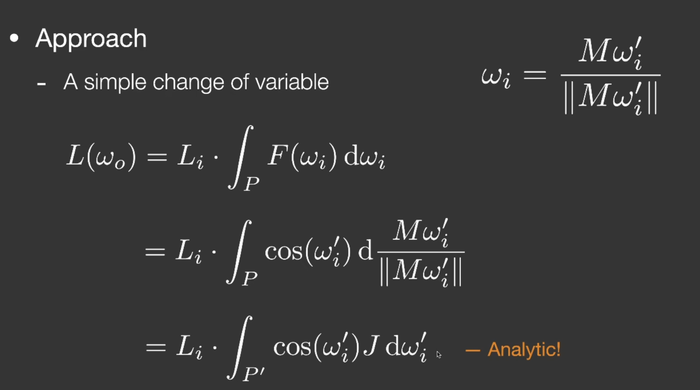

其实就是雅可比项换元

M这个变换怎么得到？最简单的是通过优化方法算。给定初始值，不断优化。

性能？不同角度看去，lobe长得不一样，M也不一样。论文中做了预计算，对所有角度做预计算。

离线渲染光追就没必要用 LTC 了。

#### Results
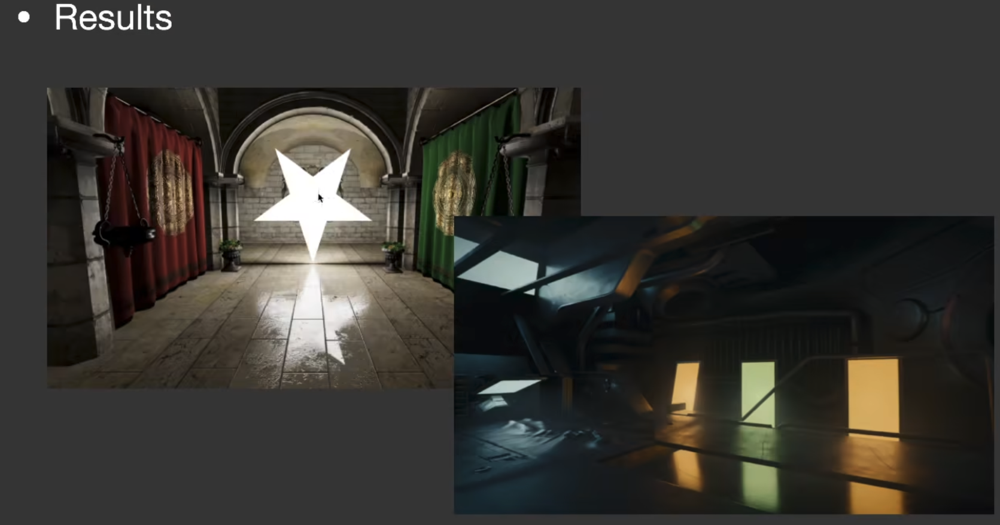

#### Problems
没考虑遮挡和阴影

Unity 后续又继续扩展，先做shading后做shadow，类似shadowmap的方法添加阴影 

# Disney principled BRDF
## Why is it needed?
Motivation：

+ No physically-based materials are good at rep. all real materials 不能表示所有材质
    - e.g. lacking diffuse term in most micro facet models
    - 微表面模型无法解释多层材质(涂了轻漆的木桌面)
+ Physically-based materials are not artist friendly PBR 材质的参数正常情况下都是些物理量，对艺术家不友好
    - e.g. "the complex index of refracction n-ik"

## High level design goal
+ Art directable, not necessarily physically correct
+ But agian, referred to as PBR in real-time rendering

## What is "principled"?
+ The BRDF is designed with** a few important principles**
+ **intuitive** rather than phycical parameters should be used. 饱和度等
+ There should be as **few parameters** as possible.
+ Parameters should be zero to one over their plausible range. 方便艺术家用一个拖动条来调整参数。
+ All combinations of parameters should be as robust and plausible as possible. 所有的参数设为任意值时，程序都不会崩掉

## How does it work?
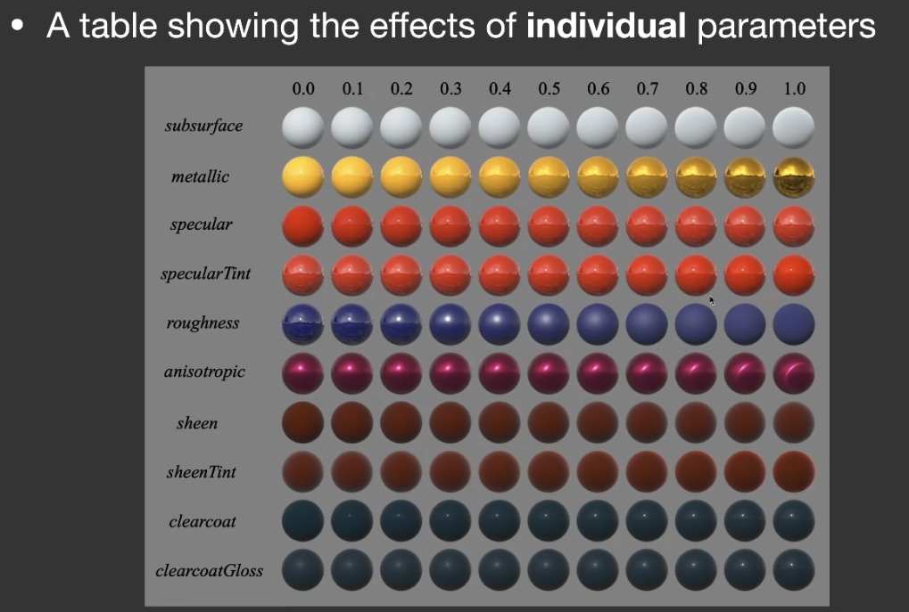

+ 常用的
    - subsurface：次表面散射
        * 光线能够进入物体，并且从另外一个地方打出去
        * 可以给出比diffuse还要平的效果。球像是被按扁了
    - metalic：是否像金属
    - specular：控制又多少镜面反射内容
    - specularTint：specular的颜色是更偏白还是更偏物体本身的颜色
        * TInt就是规定了一个颜色
    - roughness：粗糙程度
    - anisotropic：各向异性程度
        * 刷过一样的效果
+ 工业界常用，学术界基本不用的概念
    - sheen：
        * 回忆games101中的天鹅绒BRDF，表面长有许多竖直的绒毛
        * 特点：从grazing angle看去，有一种雾化的效果
    - sheenTint：
        * 希望这层绒毛造成的效果，是偏白还是偏本身的颜色
    - clearcoat：
        * 在木板上刷一层轻漆的感觉
        * 不好用微表面模型表达
    - clearcoatGloss：
        * 这一层轻漆的光滑程度

有一些参数作用会重合。参数空间越大，越容易造成冗余，而不同参数组合可能会带来相同结果（联想机器学习中的局部最优）

## Pros and Cons
+ Easy-to-understand/control
+ A wide range of materials in a single model
    - 回忆工业界为什么在microfacet加一层diffuse：一些材质表达不了。
+ Open source implementation is available
+ Not physically based 不是基于物理的，但一般也称为基于物理的
    - But is it a big problem?
    - Acxademia vs. industry
+ Huge parameter space

## 其他
+ 拟合的能量守恒
+ 游戏引擎中

LTC、Fresnel项的拆分等是基于微表面模型的实时渲染的，不能直接用于Disney Principled BRDF。也正因为这些加速方式不能够用，Disney Principled BRDF 不太适用于实时渲染。

#  Non-photo realistic rendering (NPR)
## Introduction
Non-Photo realistic rendering (NPR)

=== stylization 风格化

=== (fast and reliable) stylization（实时渲染中）当然离线渲染中可能也没人做风格化；基于神经网络的方法或多或少地不能满足两个条件。

## Goal
+ Indistinguishable from photos
+ Focus: lighting, shadows, materials, etc.
+ Producing **artistic** appearances

 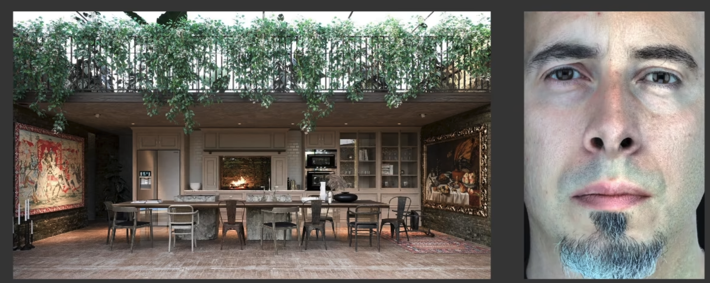

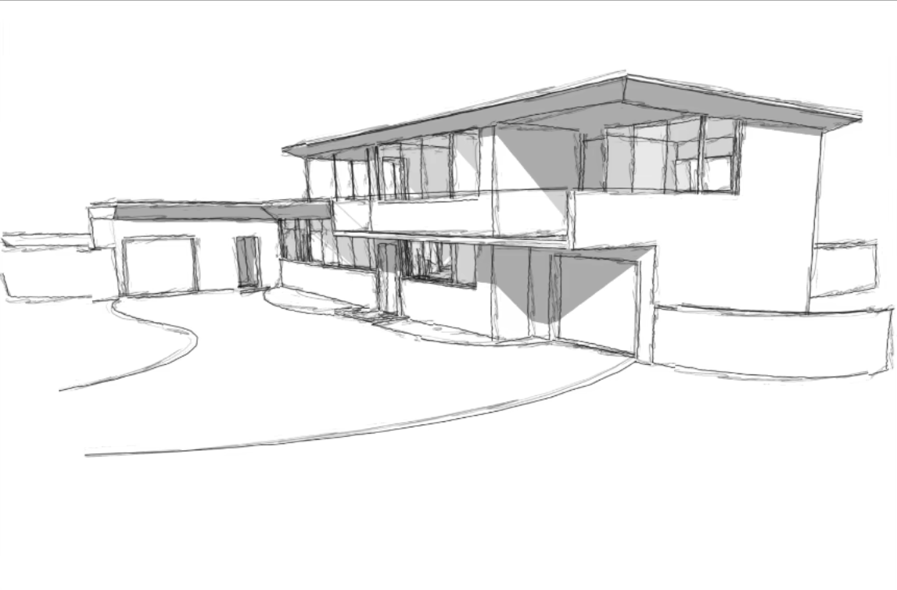

## Characteristics of NPR
+ Starts from photorealistic rendring
+ Exploits abstraction
+ Strengthens important parts

通常的逻辑：从真实感渲染出发，变成NPR效果。过程中需要考虑需要强化哪些效果，弱化哪些效果。

## Applications of NPR
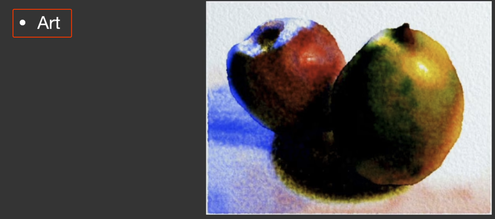

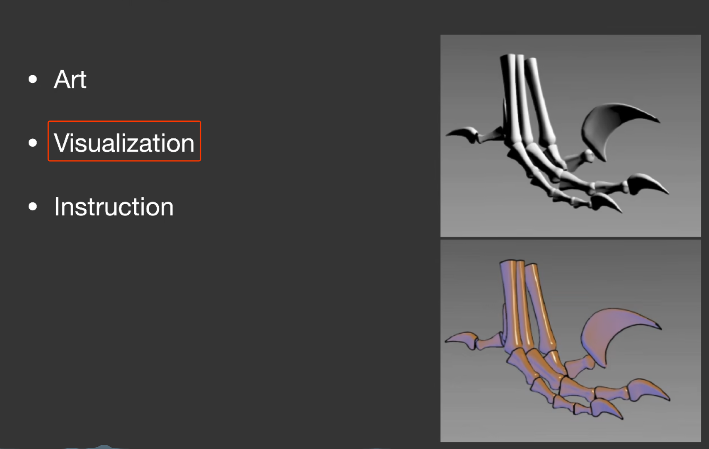

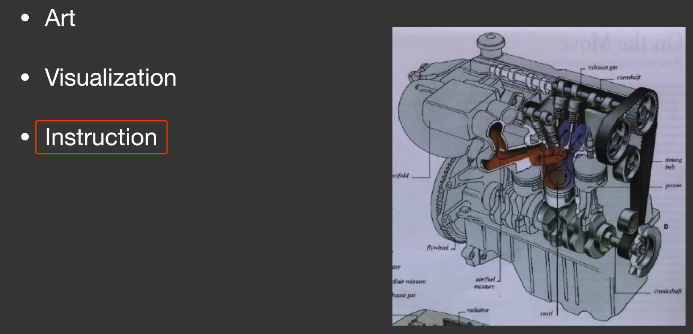

上图中，非正式感渲染比真实感渲染更能看出问题。（忽略了不必要的细节）

 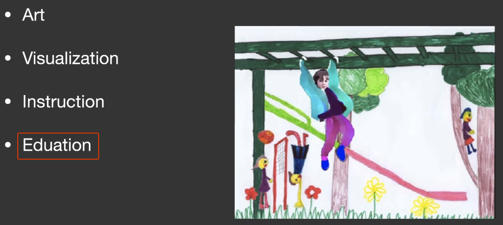

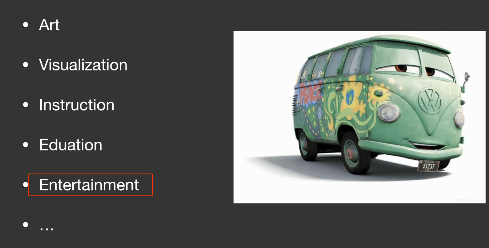

Cars是第一步用光线追踪做的动画

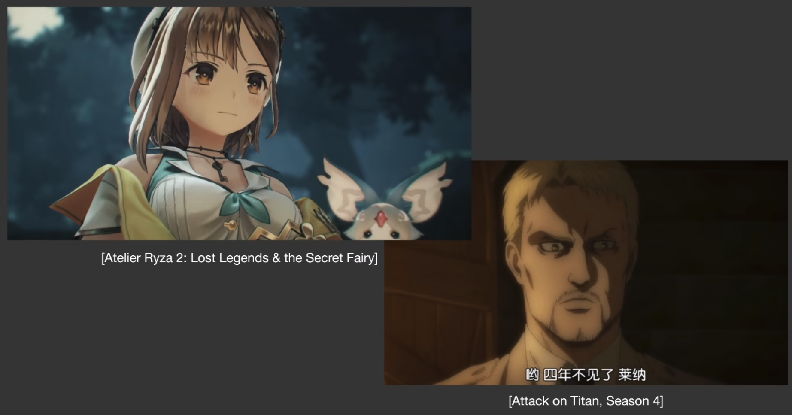

莱莎的炼金工房2

进击的巨人

## What are Styles?
+ Can we summarize styles from this image?
    - Bold contours (actually, outlines)  人物描边
    - Block of colors . 色块
    - Strokes on surfaces 人物的面上会打上很多线

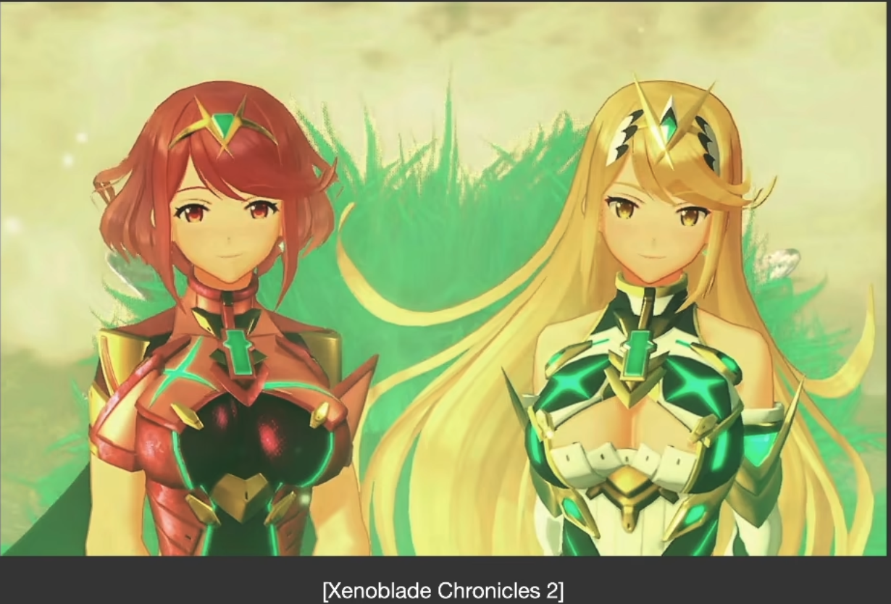

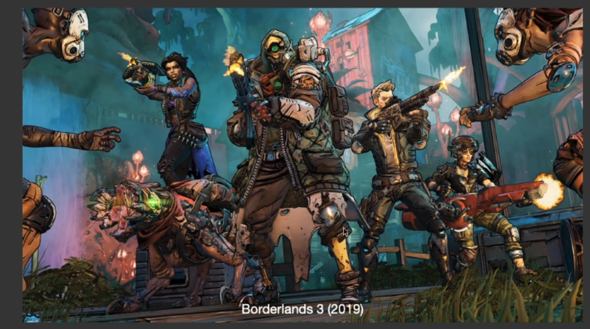无主之地

需要把看到的效果，变成需要在渲染中做哪些操作

## Outline Rendering
### Outline Defination
+ Outline are not just contours
    - [B]oundary/border edge。**单个面**的边界
    - [C]rease 折痕。是由**多个面**共享的边界. 
    - [M]aterial **材质**边界
    - [S]ilhouette edge  要求 1.在物体投影到屏幕后的**外轮廓**上，在中间的不算；2. 是由**多个面**共享的边界.  S必定是C的子集

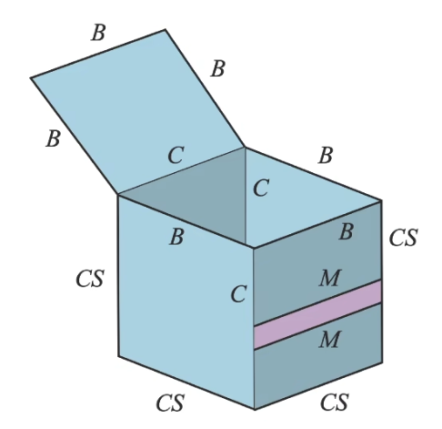

Outline可以通过 shading 或 post-processing 来做。（Silhouette 边）

### Method1: Shading
做Silhouette 边的描边。

假设物体是封闭的。

+ Shading normal contour edges	
    - Darken the surface area where the shading normal is perpendicular to viewing direction 什么样的着色点是在silhouuette边上？着色点的法线与观察方向垂直的时候。可以设置阈值（可以应用step这种有过渡带的函数）

下图展示了不同阈值的效果（使用了step函数）

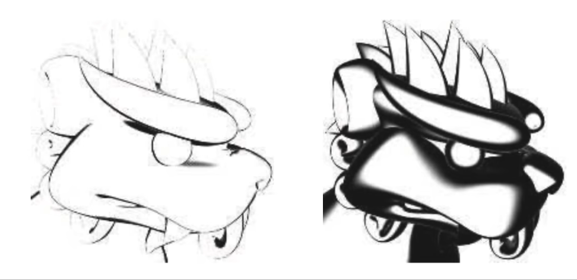

存在的问题：不同位置描边的粗细不一样。不是在图像上描边，法线变化粗锐的地方，线比较细；法线变化平缓的地方，线比较粗。

### Method2: Geometry
工业界普遍采用的方法之一

直接为每个几何加个描边。

1. 方法1: 为每个几何复制一份，复制品扩大涂黑放在原来的geometry下面，就形成了轮廓的效果
2. 方法2: 更简单的做法，渲染时知道面是正向还是反向。每个背面三角形扩一圈，全涂黑。避免额外添加geometry

Backface fattening

+ Render frontface normally
+ "Fatten" backfaces, then render again
+ Extension: fatten along vertex normals

 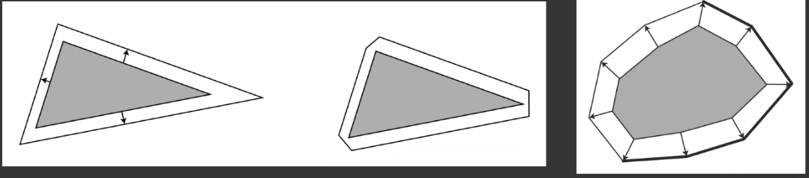

也有各种各样的优化方法，比如：

+ 不希望三个角太尖，希望在三个角切一下
+ 圆角过渡
+ 沿顶点法线扩大（而不是沿边扩大）

### Method3: Image
工业界普遍采用的方法之一

在图像上做后期处理。识别出边缘，再加回原图。

+ Edge detection in images 高通滤波
    - Usually use a Sobel detector 

英雄联盟好像是这么做的

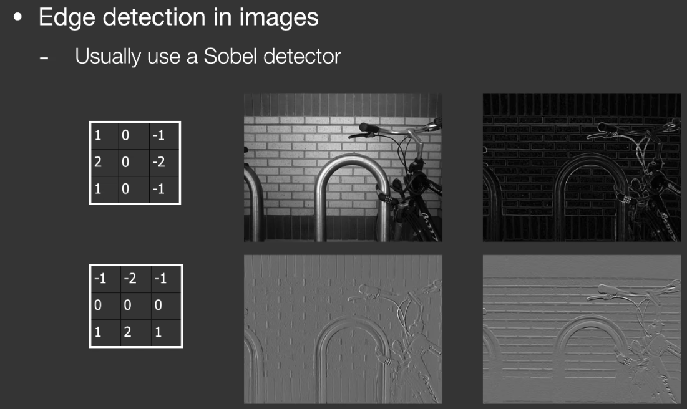

    - May work on different information
        * 除了屏幕图像信息外，在渲染过程中还可以结合法线等信息一起来做
        * 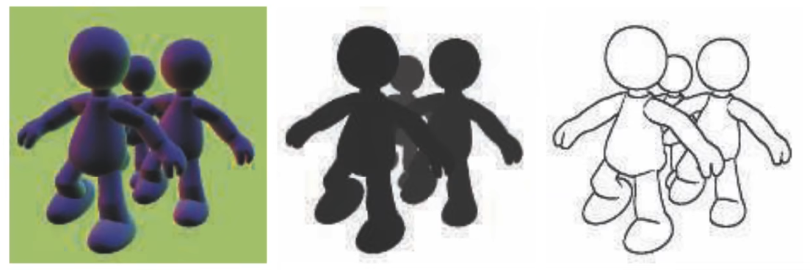

## Color blocks
卡通中可能会强调高光/diffuse/阴影。通过控制阈值化实现。

不一定是二值化，可以是多值化

Two different ways

+ Hard shading: thresholding on shading
+ Posterization: thresholding on final image color
+ May not be binary
    - Quantization (量化，多值化)

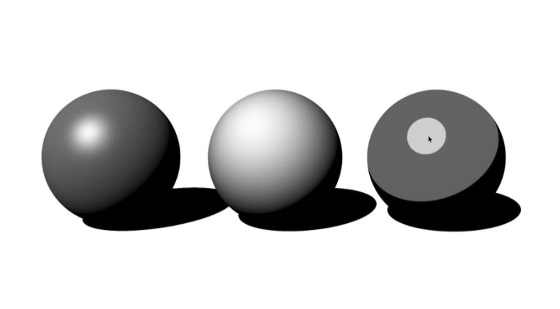

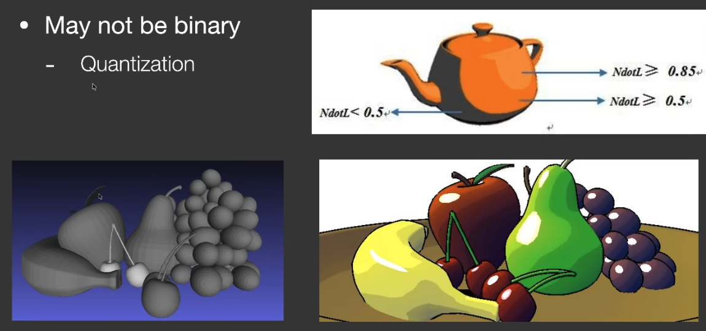、、

+ Different styles on different components 不同的材质(specular/diffuse)上，可以采用不同的 quantization 方法

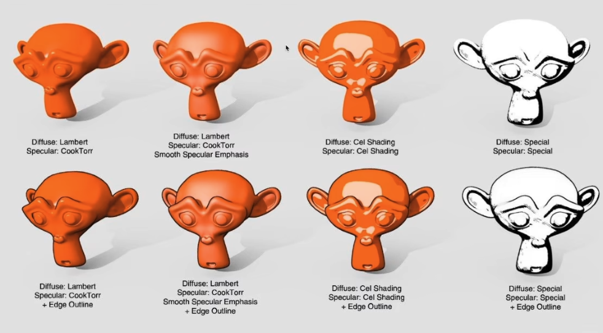

## Stroke Surface Stylization
素描效果

+ Sometimes you do not wnat color blocks
+ Instead you want to mimic sketching
+ Idea：基本思想：通过控制格子密度，来控制明暗度。
    - Replace point-wide shading with pre-generated stroke textures 
    - Density? 比较暗的地方画很多线，亮的地方不画线（不同明暗度的地方，采用不同密度的纹理）
    - Continuity? 笔触要保持连续的感觉，要用纹理预先定义好

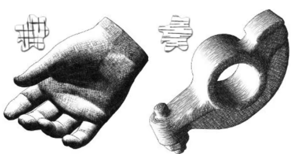

Tonal art maps (TAMs)

+ Strokes of different densities
    - 明暗之间有过渡，不同密度之间的texture也是大致连续的
+ Each density has a MIPMAP
    - 一个问题：物体推远，物体在屏幕中占的空间变小；明暗度不变，密度不变，采用的纹理不变，但最终屏幕的渲染效果会变暗。如何让渲染效果只和密度优化？
    - 做Mipmap，缩小之后保持密度

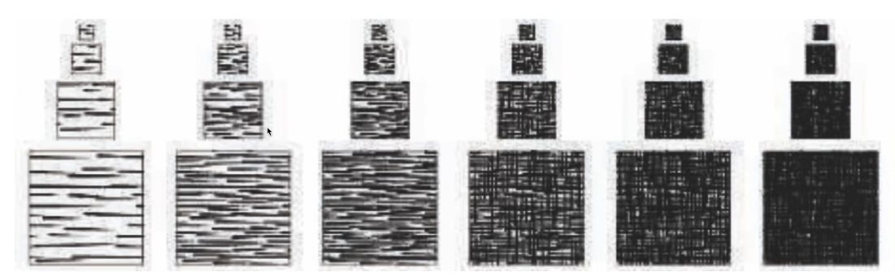

整体流程：

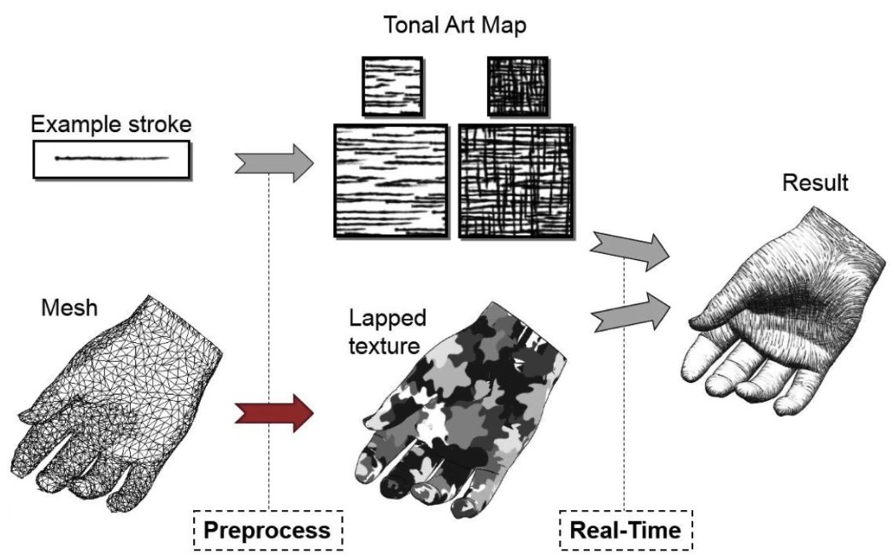

有些各种各样神奇的操作，比如有些地方可以把stroke拼起来

程序化纹理生成一般用于简单图案，可能不太适用这种复杂 pattern

## Some Notes
+ NPR is art driven 艺术家告诉你想要的结果
+ But you need the ability to "translate" artists' needs into rendering insights 这个翻译过程才是最有趣的地方，你要能实现各种渲染效果。不要直接抄，可以在和艺术家的沟通中形成自己的风格。
    - e.g. edge
+ Communication is important
+ Sometimes, per character, event per part
    - NPR一定程度上就在做 if else
    - 不太容易设计一个方法，对所有场景都适用。不同角色，不同身体部位可能要做不同处理。

## Key Obervations
+ Something people still haven't paid much attention to 
    - Photorealistic models are super important in NPR.  后期风格化很重要，但前期的photorealistic渲染也很重要。NPR 做的好不好依赖于 photorealistic 模型。NPR和PR不应该分开看
+ Example： cloth

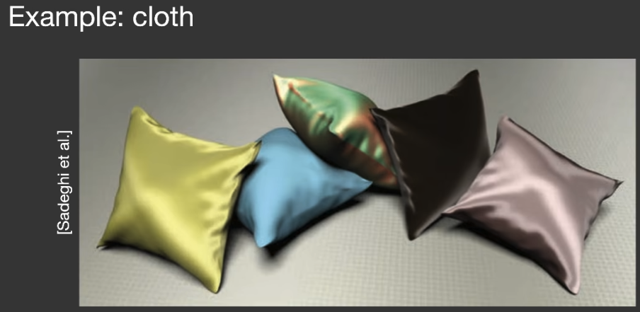

> 更新: 2024-01-14 09:00:53  
> 原文: <https://www.yuque.com/viruspc/el3mi0/xgtf61mwtc768xxl>