# Real-time Shadows

- [Summary](#summary)
  * [**Distance Field Soft Shadows**](#distance-field-soft-shadows)
- [SM: Shadow Mapping](#sm-shadow-mapping)
  * [Introduction](#introduction)
  * [Visualizing Shadow Mapping](#visualizing-shadow-mapping)
  * [Issues in Shadow Mapping](#issues-in-shadow-mapping)
    + [Self Occlusion](#self-occlusion)
    + [Aliasing](#aliasing)
- [The math behind shadow mapping](#the-math-behind-shadow-mapping)
  * [Inequalities in Calculus](#inequalities-in-calculus)
  * [一个重要“约等式”](#%E4%B8%80%E4%B8%AA%E9%87%8D%E8%A6%81%E7%BA%A6%E7%AD%89%E5%BC%8F)
  * [这个约等式在shadow mapping中的应用？](#%E8%BF%99%E4%B8%AA%E7%BA%A6%E7%AD%89%E5%BC%8F%E5%9C%A8shadow-mapping%E4%B8%AD%E7%9A%84%E5%BA%94%E7%94%A8)
- [PCSS: Percentage Closer Soft Shadows](#pcss-percentage-closer-soft-shadows)
  * [From Hard Shadows to Soft Shadows](#from-hard-shadows-to-soft-shadows)
  * [Percentage Closer Filtering (PCF)](#percentage-closer-filtering-pcf)
  * [Percentage Closer Soft Shadows （PCSS）](#percentage-closer-soft-shadows-pcss)
  * [A Deeper Look at PCF](#a-deeper-look-at-pcf)
- [VSM: Variance Soft Shadow Mapping](#vsm-variance-soft-shadow-mapping)
  * [Revisiting PCSS](#revisiting-pcss)
  * [VSSM](#vssm)
    + [Quick PCF](#quick-pcf)
      - [引出](#%E5%BC%95%E5%87%BA)
      - [Quickly Compute Mean and Variance](#quickly-compute-mean-and-variance)
      - [PCF with PDF](#pcf-with-pdf)
      - [Performance](#performance)
    + [Quick Blocker Search](#quick-blocker-search)
    + [效果](#%E6%95%88%E6%9E%9C)
    + [Questions？](#questions)
  * [MIPMAP and Summed Area Variance Shadow Maps](#mipmap-and-summed-area-variance-shadow-maps)
    + [MIPMAP](#mipmap)
    + [SAT](#sat)
- [MSM: Moment shadow mapping](#msm-moment-shadow-mapping)
  * [Revisit: VSSM (Problem with VSSM)](#revisit-vssm-problem-with-vssm)
  * [How to Resolve](#how-to-resolve)
- [DFSM: Distance Field Soft Shadows](#dfsm-distance-field-soft-shadows)
  * [Why Distance Field Soft Shadows](#why-distance-field-soft-shadows)
  * [Distance Field Functions](#distance-field-functions)
    + [Defination](#defination)
    + [Why SDF?](#why-sdf)
    + [Usages](#usages)
      - [Ray marching](#ray-marching)
      - [Distance Field Soft Shadows](#distance-field-soft-shadows)
      - [Antialiased / Infinite resolution characters in RTR](#antialiased--infinite-resolution-characters-in-rtr)
    + [Pros and Cons of Distance Field](#pros-and-cons-of-distance-field)
    + [加速判断物体相交](#%E5%8A%A0%E9%80%9F%E5%88%A4%E6%96%AD%E7%89%A9%E4%BD%93%E7%9B%B8%E4%BA%A4)
    + [渲染](#%E6%B8%B2%E6%9F%93)
      - [表面缓存](#%E8%A1%A8%E9%9D%A2%E7%BC%93%E5%AD%98)
- [References](#references)

---

# Summary
+ Recap: shadow mapping
    - 不考虑间接光照
    - A 2-Pass Algorithm
        * The light pass generates the SM
        * The camera pass uses the SM (recall last lecture)
    - An image-space algorithm
        * Pros: no knowledge of scene's geometry is required
        * Cons: causing self occlusion and aliasing issues 自遮挡和走样
            + Self Occlusion: 通过添加 bias 解决。bias 会进一步引入 Detach shadow 问题，Second-depth shadow mapping 可以解决。
            + Aliasing： 工业界常用 Cascaded Shadow Maps 解决。
+ The math behind shadow mapping
    - 在RTR中，常拿不等式当“约等式”使用。
    - 约等式在 shadow map 中的应用：RTR 中喜欢将 Visibility 项拆出。下式将 rendering equation 拆成 Visibility 部分和 Shading 部分。Visibility 部分就是 shadow map 负责的部分，这样就方便了 shadow map 的使用和计算。
    - 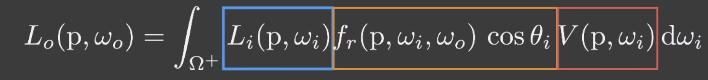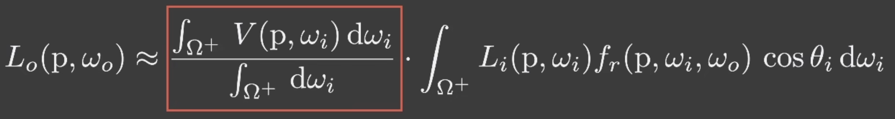
    - 在shadow mapping中，当满足以下两个条件之一时，约等式相对准确：
        * small support （point / directional lighting）。点光源或方向光源的积分区域很小。
        * smooth integrand (diffuse bsdf/constant radiance area lighting)。 面光源L不变。环境光照（超大面光源）或glossy材质（brdf变化特别大）不适合shadow mapping。
    - 当两个条件都不满足时，也可能会使用shadow mapping：ambient occlusions 环境光遮蔽。
+ **Percentage closer soft shadows **最常用的软阴影实现方法
    - 目的：传统的shadow map只支持点光源。为了支持面光源的软阴影，会先将面光源视为点光源来生成shadow map，再利用PCSS来生成软阴影。
    - 缺点：开销非常大。
    - PCF核心思想：不是先filter再compare，而是先compare再filter
    - PCSS核心思想：PCF + 一个适应性的filtering size
        * blocker distance 小的地方采用小的filtering size。
        * step1 确定了blocker distance。
        * step2 中利用相似三角形来确定filtering size （半影范围）。
        * step3 中根据filtering size做PCF。
    - 算法流程：
        * **Step 1: Blocker search** (getting the average blocker depth in a certain region)
            + 求n*n范围内遮挡物的平均深度，非遮挡物直接忽略不用来求平均。
            + Which region to perform blocker search?
            + Can be set constant (e.g. 5x5), but can be better with heuristics
        * **Step 2: Penumbra estimation** (use the average blocker depth to determine filter size)
        * **Step 3: Percentage Closer Filtering**
+ **Variance soft shadow mapping **(VSM 或 VSSM)
    - 目的：加速 PCSS 的步骤1和步骤2。相比 PCSS，VSSM 提供了更快的 blocker search 和 filtering。
    - 缺点：1. 太多假设，引入了噪声；2. 当reciever为曲面或平面与光线不平行时会出问题; 3. 当 t<均值 时，使用单边切比雪夫不等式有可能是不准的；4. 当范围深度的分布并不是单峰的分布，而是多峰分布时，甚至是一些比较简单的分布时，使用单边切比雪夫不等式同样有可能是不准的。不准会带来 Light leaking 问题。
    - 核心思想：避免效率低下的采样过程，利用单次范围查询代替多次点查询，以加速 Blocker search 和 PCF。
    - 加速 PCF：
        * 核心思想：
            + 在 PCF 步骤中，快速得到 shadow map 当前范围内深度值的分布（**PDF**，O(1) 时间复杂度）；
            + 再快速估计 shadow map 中有多少 texel 在 shading point 之前（**CDF**，O(1) 时间复杂度），得到 PCF 的结果。
        * 两个关键点：
            + **如何快速得到深度值的分布（PDF）？**
                - 采用正态分布
                - 通过MIPMAP 和 SAT 来加速均值和方差的计算 （MIPMAP 不准，SAT准）
                - 正态分布+均值+方差 = 当前范围内深度值的分布
            + **如何根据分布做 CDF？**
                - 精确的方法：对 PDF 根据前 reciever depth 做CDF
                - 近似的方法（VSSM 文中采用的方法）：切比雪夫不等式
        * 结果：PCF时间复杂度从 O(n) 降到 O(1)
    - 快速 Bloker Search：
        * Blocker search 和 PCF 过程中求均值步骤类似。但也有区别：PDF 考虑过滤范围内的所有 texel，blocker search 不考虑非遮挡的texel。快速 PCF 中的求均值步骤可以用来帮助做快速 blocker search。
        * 核心思想：一些大胆的假设加切比雪夫不等式。
            + 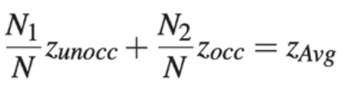
                - 符号意思：
                    * zAvg：范围内的均值（注意快速 PCF 中通过 SAT 来加速求均值）
                    * zocc(we want to compute)：Blocker (z < t), avg. 
                    * zunocc：Non-blocker (z > t), avg. 
                    * N：总 texel 个数
                    * N1: 非遮挡 texel 个数
                    * N2:遮挡 texel 个数
                - zAvg 通过 **MIPMAP** 或** SAT **范围查询得到
                - Approximation: N1 / N = P(x > t), **Chebychev**!
                - Approximation: N2 / N = 1 - P(x > t)
                - zunocc, We really don't know
                - Approximation: zunocc = t (**i.e. shadow receiver is a plane**) 假设非遮挡物部分的深度都和t一样。假设阴影接收物为平面。
+ **Moment shadow mapping **（MSM）
    - 解决的问题：VSSM 中，有时不能假设为正态分布。
    - 解决方式：用高阶矩（一般前4阶）来表示分布。VSSM 是用的前二阶矩（均值和方差）来表示分布。
+ **Distance Field Soft Shadows**
    - 

# SM: Shadow Mapping
## Introduction
注意 shadow mpping 不考虑间接光照

A 2-Pass Algorithm

+ The light pass generates the SM
+ The camera pass uses the SM (recall last lecture)

An image-space algorithm

+ Pro: no knowledge of scene's geometry is required
+ Con: causing self occlusion and aliasing issues 自遮挡和走样

Well known shadow rendering technique

+ Basic shadowing technique even for early offline renderings, e.g., Toy Story

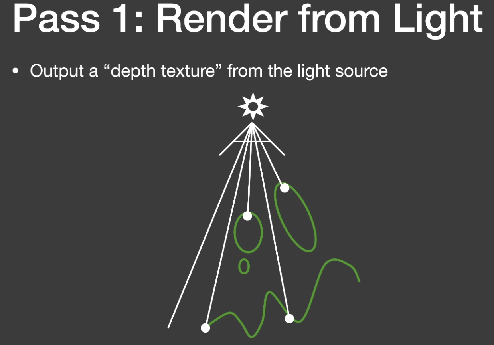

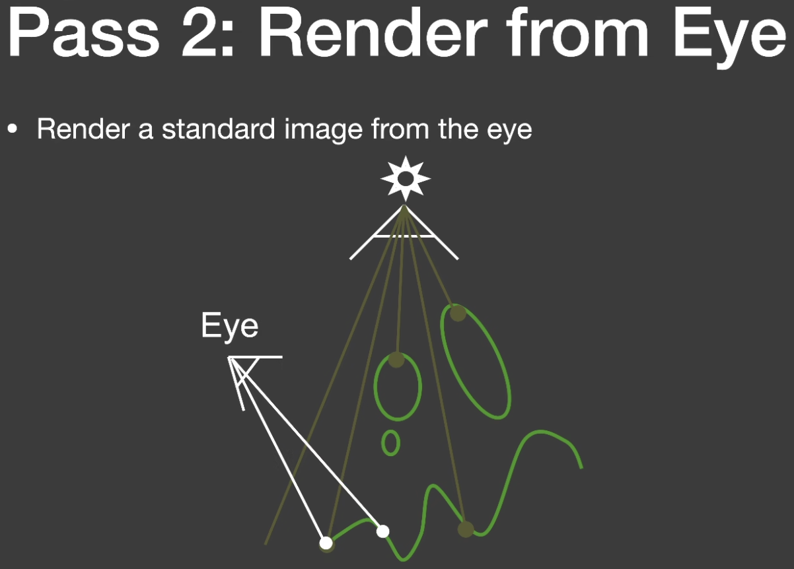

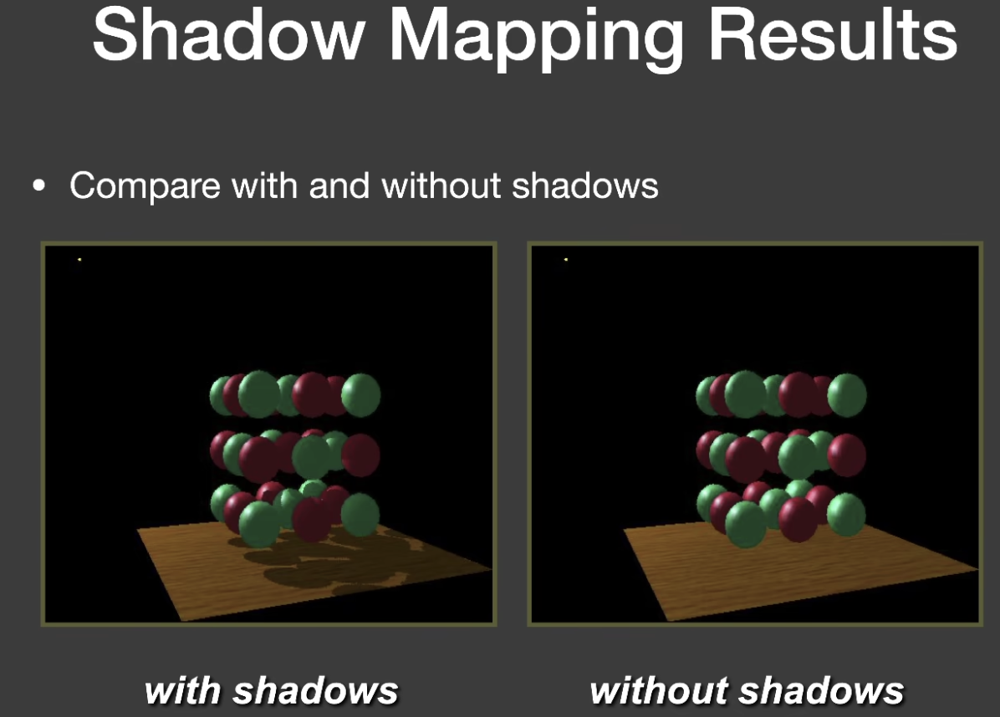

## Visualizing Shadow Mapping
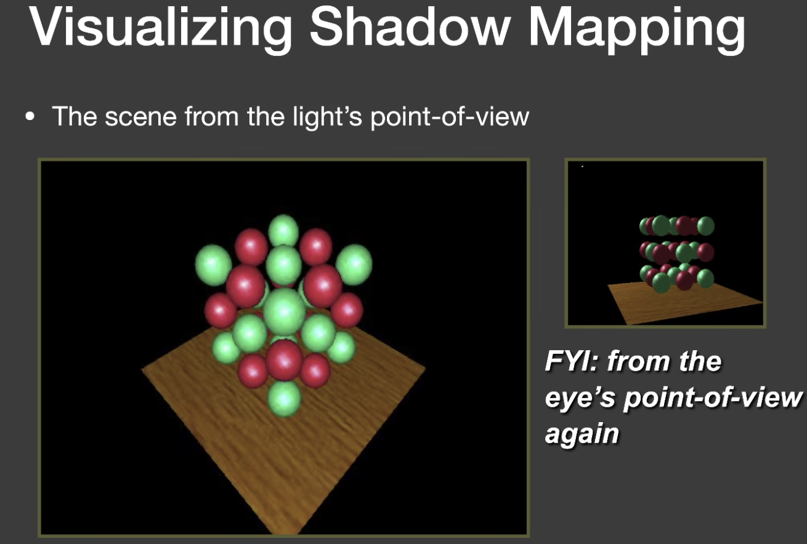

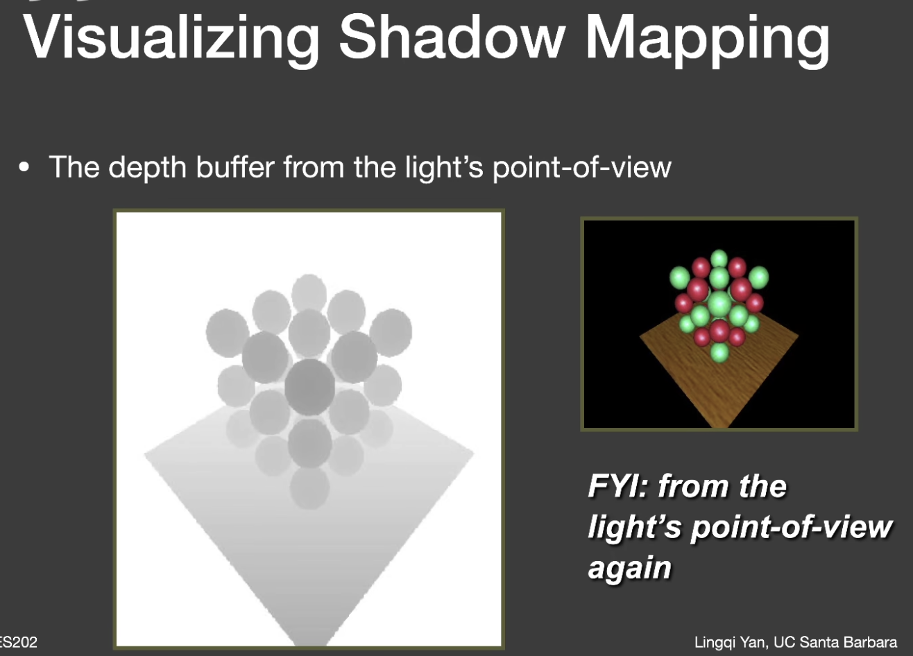

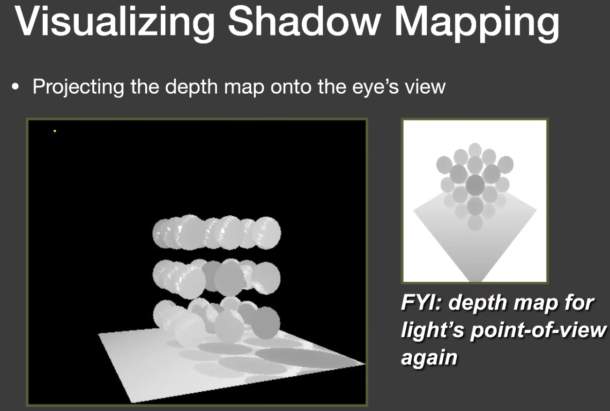

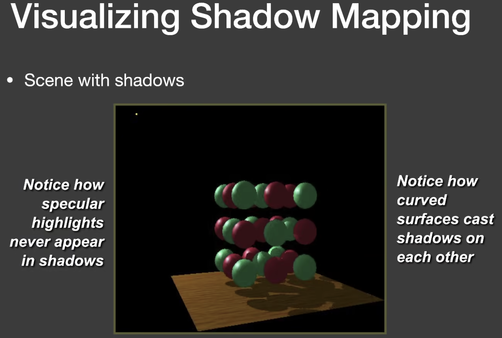

perspective projection 中将frustum变为长方体时，物体的深度（z）发生改变，向远平面推（所有点要么不偏，要么都偏）。shadow mapping第二阶段直接比较z值即可。（但会有精度问题）

## Issues in Shadow Mapping
### Self Occlusion
**问题**：shadow map 是有分辨率的。在一个像素内部，深度是一个固定值。这会导致自遮挡（**self occlusion**）问题。

**示例**：图中，人的眼睛望向一个平面。shadow map 认为 眼睛看到的点到光源的距离 是 黄色平面到光源的距离；而实际渲染时会发现实际距离大于shadow map的值。这就使得本来平整的地面出现了阴影。这个问题就是自遮挡问题。

**什么时候问题最严重**？从上往下照时，问题最小；几乎平行照向地面时问题最大。

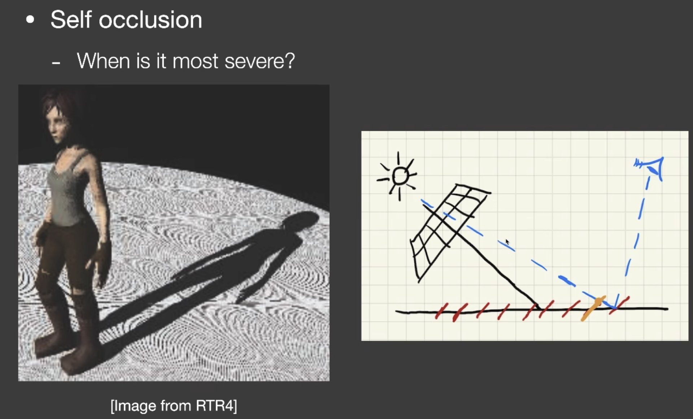

**解决方案**？Adding a (variable) bias to reduce self occlusion。此外，还可以考虑让bias随着光照角度的变化而变化。

**新的问题**？But introducing **detached shadow **issue。Bias过大时，会产生丢失影子的问题。下图中，角色的脚与影子分离了。工业界也称为 **peter panning** (阴影悬浮)

虽然有一些问题，但工业界一般就采用这一增加bias的方法。

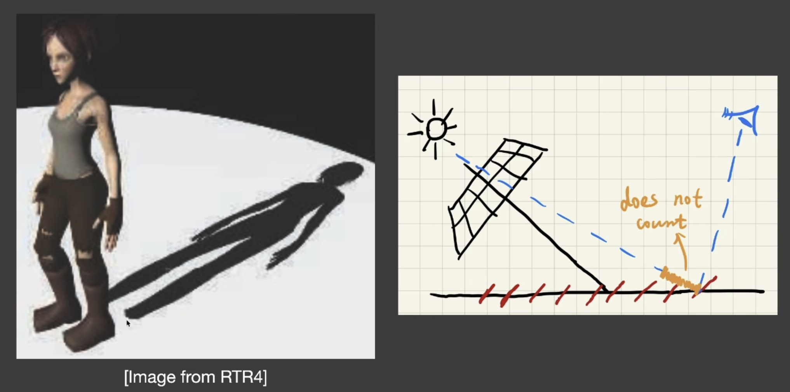

**解决方案**？那么，有没有一个合适的数，又不会出现 detach shadow？Second-depth shadow mapping。但这一方法在工业界很少用。

**核心思想**：shadow map 每个像素不仅存最小深度，还要存次小深度。采用中间深度来做后续阴影的比较

不用bias了。

**新的问题**？

1. 要求所有物体都是 watertight 的。一个物体必须有正反面。即使是纸，也要用一个立方体来代替。
2. 代价高。shadow map的制作过程中，除了最小深度外，还需保存次小深度。过程中牵扯到额外的swap操作和if语句。虽然时间复杂度没变，但影响很大。 —— **RTR 不相信时间复杂度！**

**RTR does not trust in COMPLEXIGTY!**

RTR对时间要求十分苛刻，常数倍的影响也很大。

实例：某个游戏中，给游戏加一个效果，这个效果的生成时间不能超过1ms。超过1ms，方法再好也不能用。

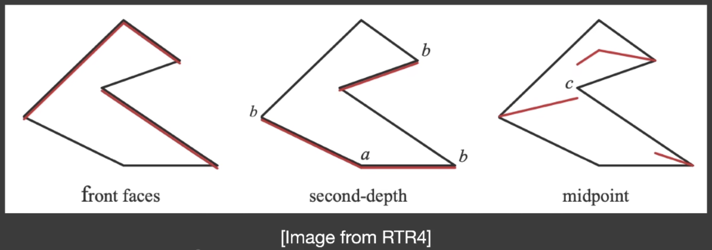

### Aliasing
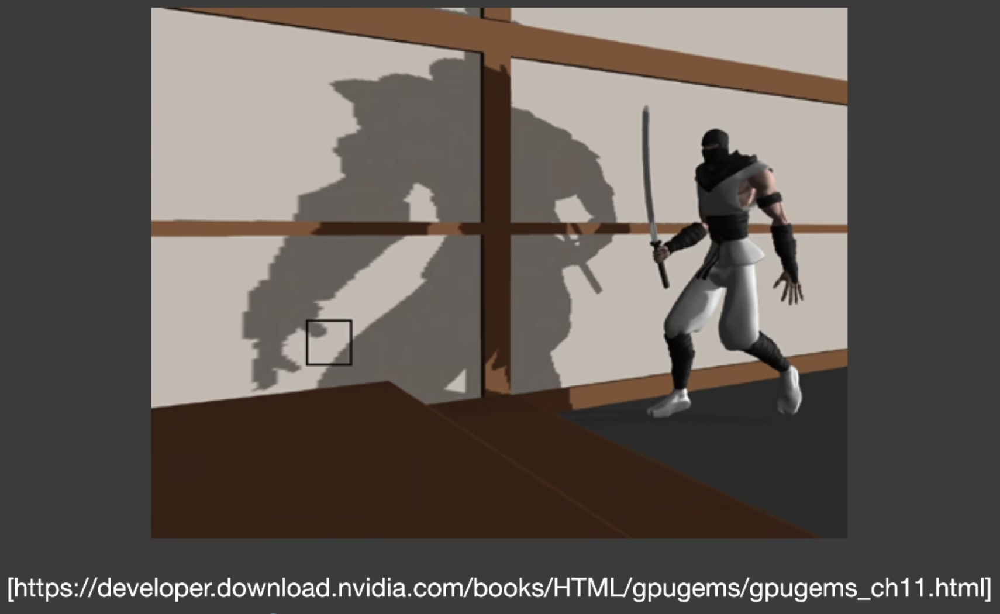

解决方法：

1. 工业界常用 Cascaded Shadow Maps [#](https://developer.download.nvidia.com/SDK/10.5/opengl/src/cascaded_shadow_maps/doc/cascaded_shadow_maps.pdf)

# The math behind shadow mapping
## Inequalities in Calculus
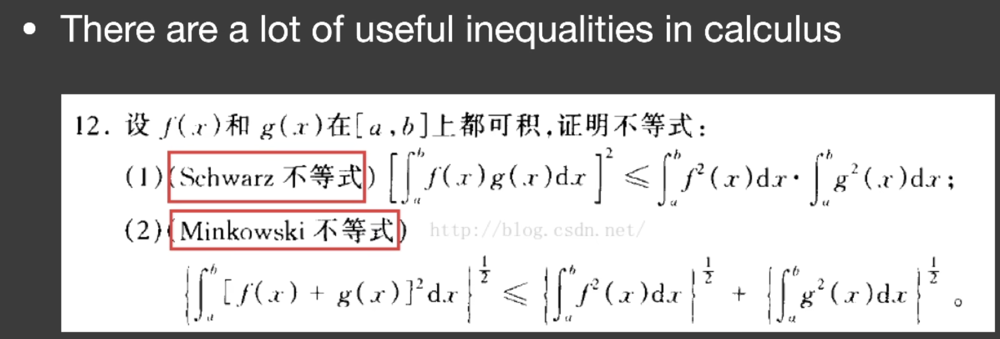

不等式在RTR中很有用。但是，在RTR中，我们不太关心不等，而是关心近似相等。拿不等式当“约等式”使用。

## 一个重要“约等式”
RTR中一个重要的“约等式”，将乘积的积分拆成积分乘积分：

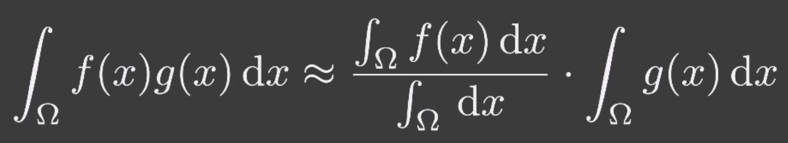

什么时候这个估计是（更）准确的？当满足下面两个条件的一个或多个时：

1. f(x)的support（实际积分的范围）非常小时
2. f(x)足够平滑（平滑不是指连续性，而是指值变化不大，min max 相差较小）

条件中f(x)和g(x)也可以互换。

## 这个约等式在shadow mapping中的应用？
回忆：RTR的渲染方程中显式考虑可见性

结合约等式，可以将可见项拆出：

这个式子反映了什么？

+ 式子将 rendering equation 拆成 Visibility 部分和 Shading 部分。Visibility 部分就是 shadow map 负责的部分，这样就方便了 shadow map 的使用和计算。

在shadow mapping中，一些情况下可以满足约等式准确的两个条件之一：

1. small support （point / directional lighting）。点光源或方向光源的积分区域很小。
2. smooth integrand (diffuse bsdf/constant radiance area lighting)。 面光源L不变。环境光照（超大面光源）或glossy材质（brdf变化特别大）不适合shadow mapping。

当两个条件都不满足时，也可能会使用shadow mapping：ambient occlusions 环境光遮蔽。

# PCSS: Percentage Closer Soft Shadows
可以产生软阴影。 是最常用的软阴影实现方法。

传统的shadow map只支持点光源和直接光源，点光源生成硬阴影。

为了实现面光源的软阴影，会先将面光源视为点光源来生成shadow map，再利用PCSS来生成软阴影。

PCSS的核心：PCF + 一个适应性的filtering size

## From Hard Shadows to Soft Shadows 
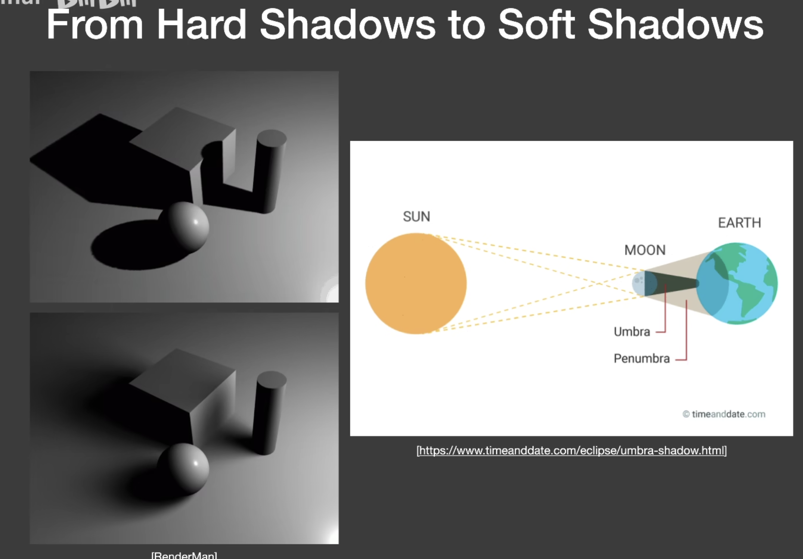

## Percentage Closer Filtering (PCF)
PCF最初被提出来不是做阴影，而是做抗锯齿。

用PCSS用PCF来做阴影。

**PCF核心思想：不是先filter再compare，而是先compare再filter**

****

不是直接在最后渲染的结果上做filtering，也不是对shadow map做filtering。而是对shadow map在一个区域中的比较结果做filtering。

+ 作用：Provides antialiasing at shadows edges
    - Not for soft shadows (PCSS is, introducing later)
    - Filtering the results of shadow comparisons
+ Why not filtering the shadow map?
    - The result of this comparison would be **binary**, making soft antialiased edges impossible. 得到的仍然是非0即1的结果。
    - Another problem is that filtered depth values along the edges of objects would bear no relation to the geometry of the scene. 丢失几何边缘信息。

具体做法：不是找shadow map中的一个像素来做深度比较，而是在shadow map中找一个区域（一般为7*7区域）的像素的来做深度比较。比较之后，取均值。

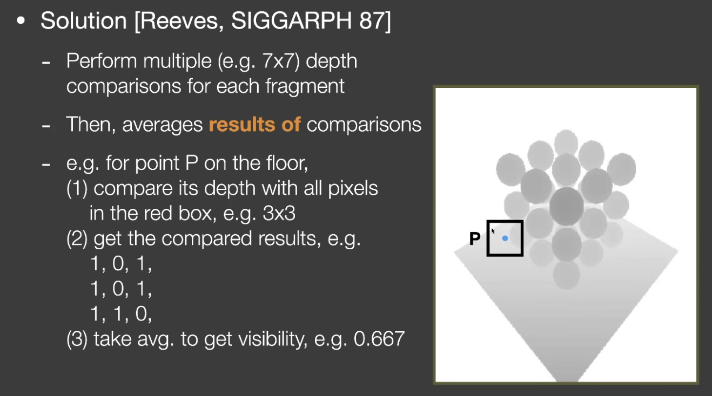

结果：

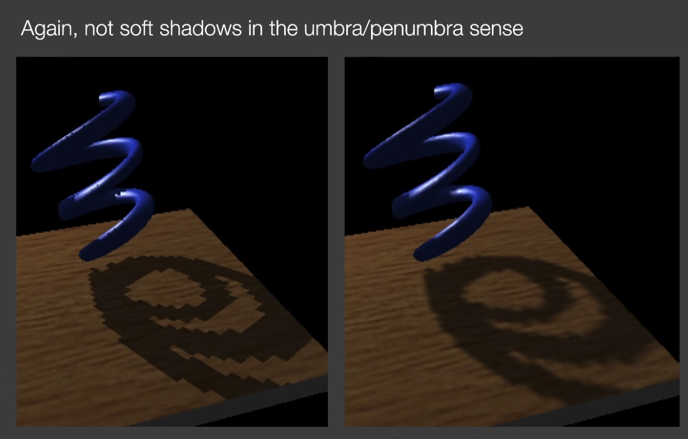

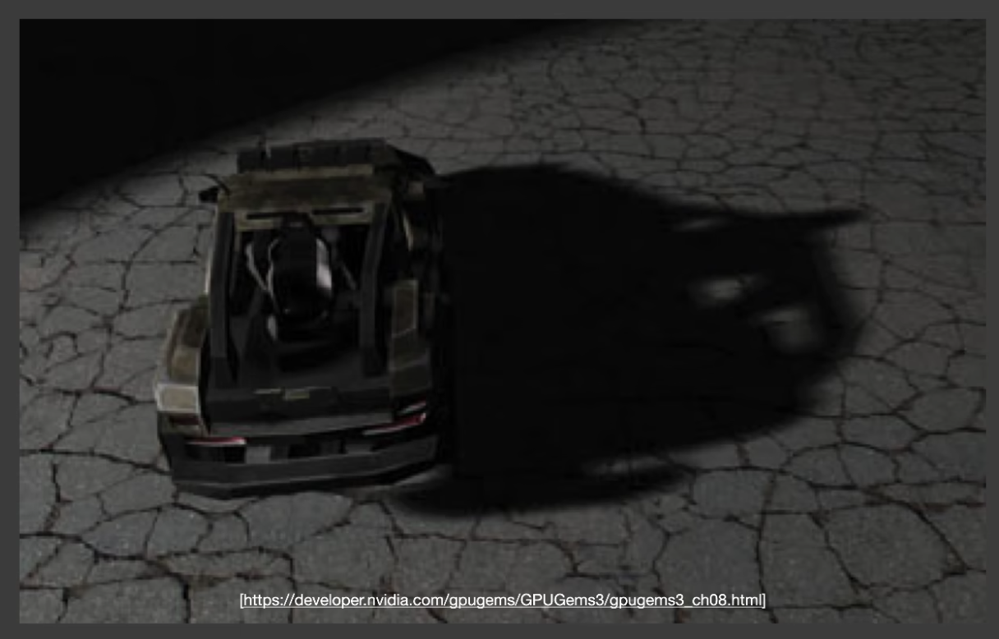

缺点：

计算速度变慢。有解决方式。

论文内容：

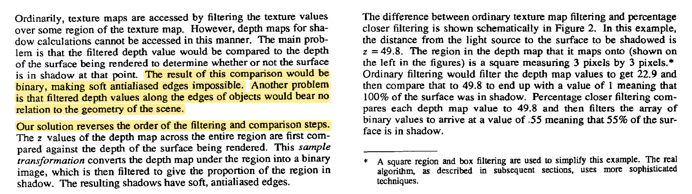

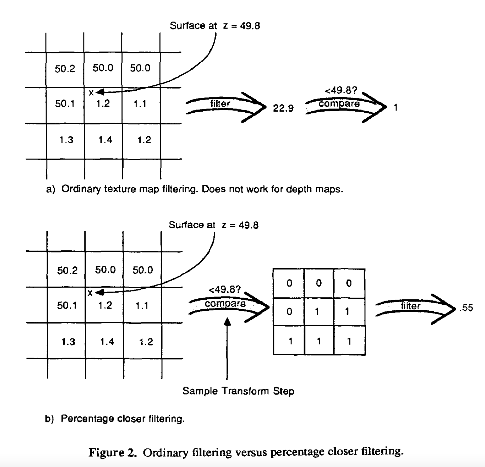

## Percentage Closer Soft Shadows （PCSS）
PCSS的核心：PCF + 一个适应性的filtering size

Filering size 对阴影的影响:

+ Small -> sharper
+ Large -> softer

Can we use PCF to achieve soft shadow effects?

Key thoughts：

+ From hard shadows to soft shadows  是否可以用硬阴影+ filtering 来实现软阴影？
+ What's the correct size to filter? 应该采用多大的 filtering size？
+ Is it uniform? 是不是不同位置要采用相同的 filtering size？不是。

阴影在什么地方硬，在什么地方软？笔尖硬，其他地方软。

观察：阴影的接受物（纸）到阴影的投射物（笔）距离越近，阴影越硬

结论：不同地方采用不同大小的filtering size。blocker distance 小的地方采用小的filtering size。利用相似三角形来确定filtering size （半影范围）。

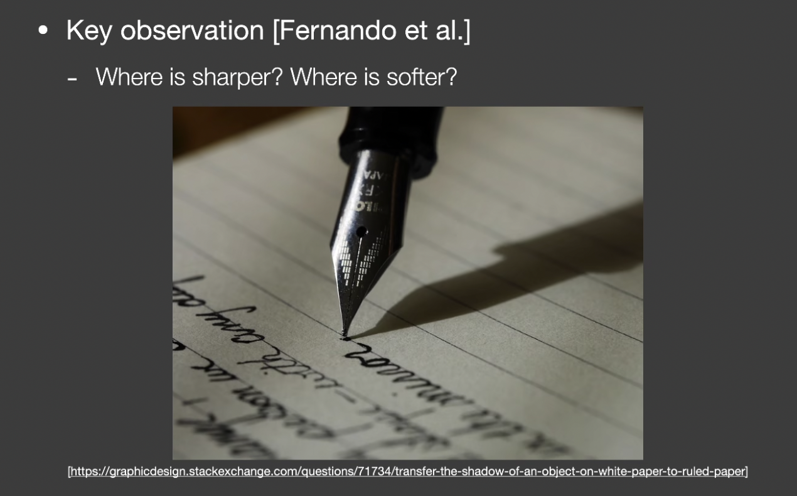

+ light 越大，w（半影范围，filtering size）越大；（传统的shadow map只支持点光源。为了支持面光源的软阴影，会先将面光源视为点光源来生成shadow map，再利用PCSS来生成软阴影）
+ blocker越接近光源（远离接受物），w越大。

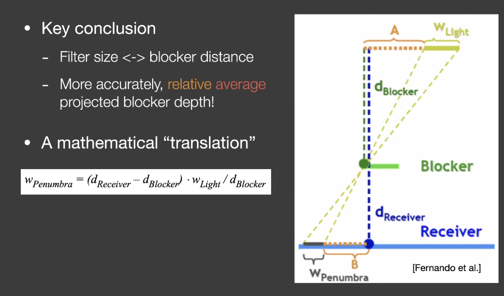

Now the only question:

+ What's the blocker depth d_Blocker?

完整算法流程：

+ **Step 1: Blocker search** (getting the average blocker depth in a certain region)
    - 求n*n范围内遮挡物的平均深度，非遮挡物直接忽略不用来求平均。
    - Which region to perform blocker search?
    - Can be set constant (e.g. 5x5), but can be better with heuristics
+ **Step 2: Penumbra estimation** (use the average blocker depth to determine filter size)
+ **Step 3: Percentage Closer Filtering**

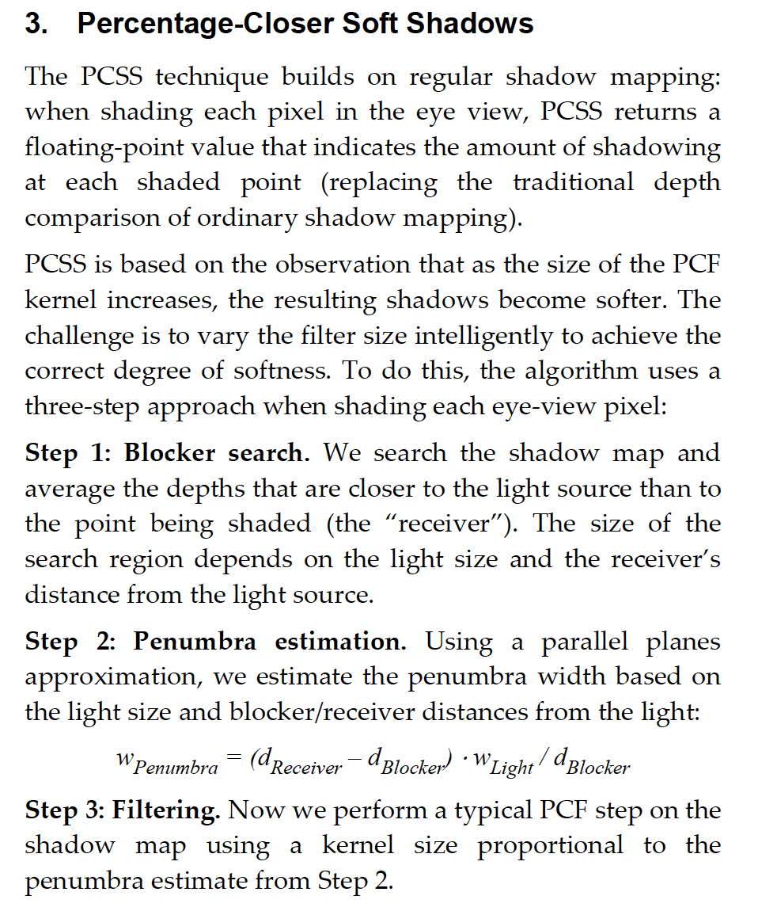

+ Which region to perform blocker search?
    - Method1: Can be set constant (e.g. 5x5), but can be better with heuristics
    - Method2: Depends on the light size, and reviever's distance from the light.

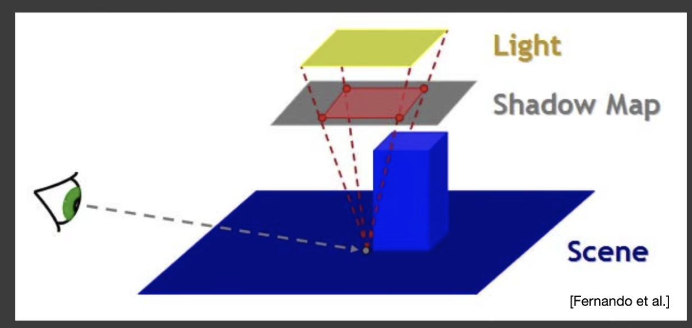

缺点：开销非常大。

## A Deeper Look at PCF
Filter/convolution：

p: 像素点  

N(p): 像素p的相邻像素的集合

w：权重

f：值

In PCSS：

x：着色点

p：x在shadow map上对应的点

ꭓ：符号函数，结果为0或1。用于判断点x是否被q遮挡（compare 步骤）。

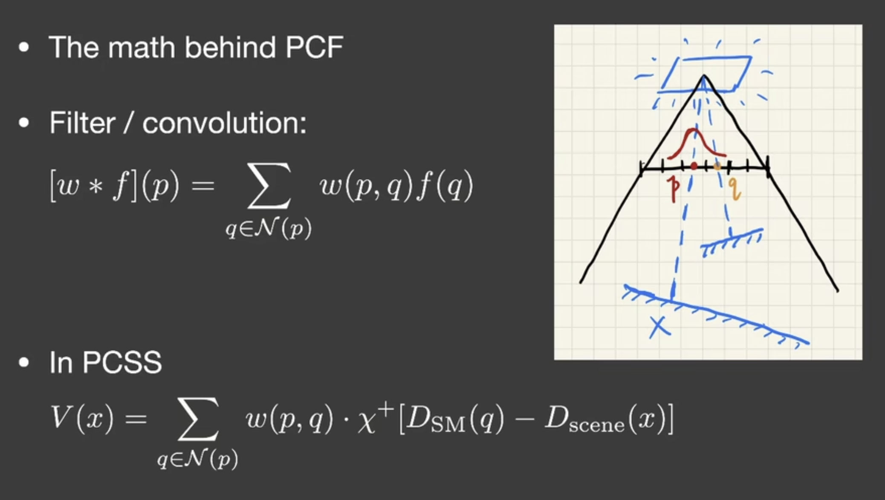

因此，PCF 不是对 shadow map 先 filter 再 compare（ꭓ），而是先 compare 再 filter

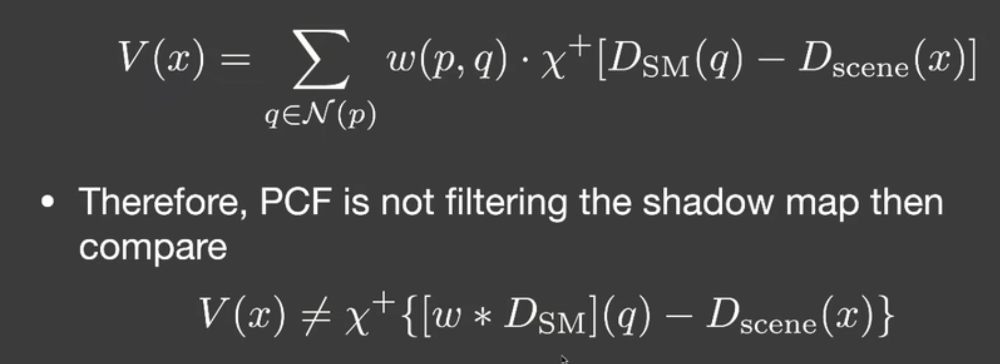

# VSM: Variance Soft Shadow Mapping
有时也被称为 Variance Shadow Mapping （）

## Revisiting PCSS
The complete algorithm of PCSS

+ **Step 1: Blocker search** (getting the average blocker depth in a certain region,
+ **Step 2: Penumbra estimation** (use the average blocker depth to determine filter size)
+ **Step 3: Percentage Closer Filtering**

Which step(s) can be slow?

+ Looking at every texel inside a region (steps 1 and 3)
    - Softer -> larger filtering region -> slower

一个解决方案：step1和step3进行稀疏采样，最后再在图像域做降噪。（两次稀疏采样引入噪声）

另一个解决方案：Variance Soft Shadow Mapping

## VSSM
VSSM 提供了更快的 blocker search 和 filtering，但引入了噪声。

随着越来越多的图像降噪方法的提出，现在人们对图像空间噪声的容忍度越来越高。快速得到一个有噪声的结果是没问题的，可以采用降噪方法来解决。

### Quick PCF
#### 引出
**在 PCF 步骤中，根据 shadow map 当前范围内深度值的分布，来估计 shadow map 中有多少 texel 在 shading point 之前（CDF），进而得到 PCF 的结果。**

**两个关键点：**

+ **如何快速得到深度值的分布（PDF）？**
    - 采用正态分布
    - 通过MIPMAP 和 SAT 来加速均值和方差的计算 （MIPMAP 不准，SAT准）
    - 正态分布+均值+方差 = 当前范围内深度值的分布
+ **如何根据分布做 PCF？**
    - 精确的方法：对 PDF 根据前 reciever depth 做CDF
    - 近似的方法（VSSM 文中采用的方法）：切比雪夫不等式

Let's think from "percentage closer" filtering

+ The percentage of texels that are in front of the shading point, i.e.,
+ how many texels are closer than t in the search area, i.e.,
+ how many students did better than you in an exam
    - Using a **Normal distribution** -> approximate answer!
    - What do you need to define a normal distribution?
        * Mean and Variance

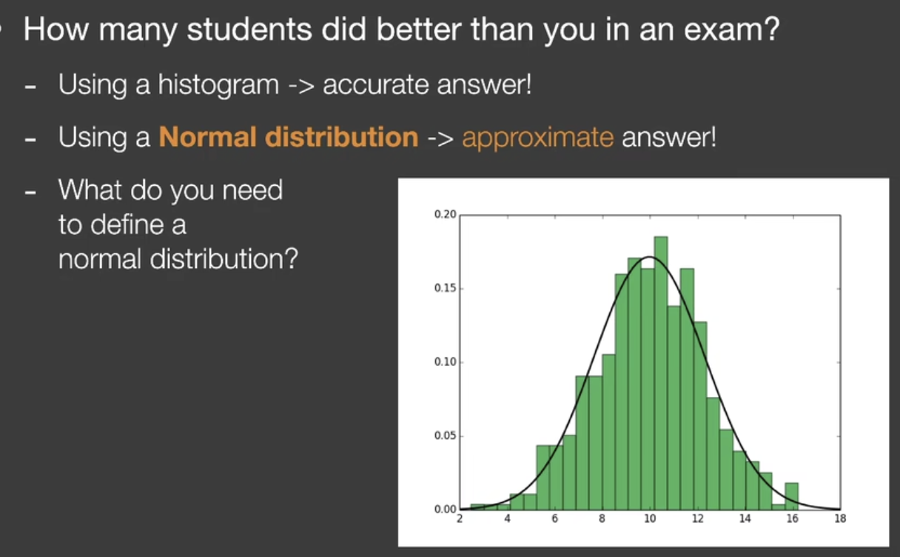

**Key idea**

+ **Quickly compute the mean and variance of depths in an area**

#### Quickly Compute Mean and Variance
（注意，PDF算的比先compare再filter要快时，这个算法才才有意义。）

Mean (average)

+ Hardware MIPMAPing （牵扯到层内和层间的插值，不准）
+ Summed Area Tables (SAT，总和面积表)  也叫积分图（Integral image）
+ Can be handled by both MIPMAP and Summed Area Table (SAT)

Variance

+ $ Var(X) = E(X^2) - E^2(X) $
+ So you just need the mean of ($ dpeth
^2
 $). 
+ Just generate a "square-depth map" along with the shadow map!

通过两个SAT，可以一下子计算出Mean和Variance，非常快。

#### PCF with PDF
Back to the question

+ Percentage of texels that are closer than the shading point
+ You want to calculate the shade's area
+ Accurate answer exists (hint: What's the CDF of a Gaussian PDF?) **准确解**
    - CDF 可以通过查表（error function）得到
    - 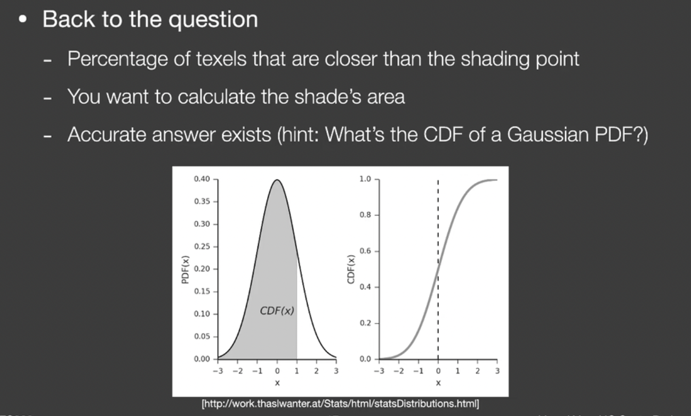
+ It doesn't have to be too accurate! **近似解**
    - Chebychev's inequality (one-tailed version, fort > mu) **切比雪夫不等式**。
    - **把不等式当约等式用**，根据均值和方差快速求 CDF。
    - 把切比雪夫不等式当约等式用，要求 t > 均值，否则比较不准确。即使存在这样的限制，t<均值时人们也照样用，因为这样计算实在是太简单了。
    - 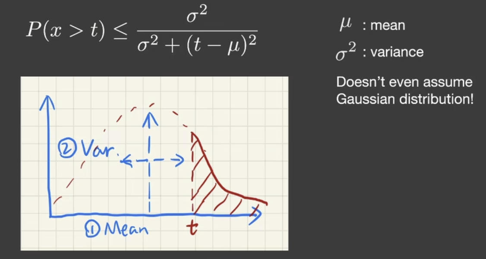

#### Performance
Shadow map generation:

+ "square depth map": parallel, along with shadow map, #pixels
+ Anything else?

Run time

+ Mean of depth in a range: O(1)
+ Mean of depth square in a range: O(1)
+ Chebychev: O(1)
+ **No samples / loops needed!**
+ Step 3 (filtering) solved perfectly** (?)**

### Quick Blocker Search
Back to Step 1: blocker search (within an area)

+ Also require sampling (loop) earlier, also inefficient
+ The average depth of blockers (**范围内蓝色遮挡物的深度，不考虑红色非遮挡物**。这也是和PDF中filter步骤不同的地方)
+ Not the average depth Zavg
+ The average depth of those texels whose depth z<t

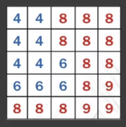

**Key idea**

+ Blocker (z < t), avg. zocc (we want to compute)
+ Non-blocker (z > t), avg. zunocc
+ 
    - zAvg 通过 **MIPMAP** 或** SAT **范围查询得到
    - Approximation: N1 / N = P(x > t), **Chebychev**!
    - Approximation: N2 / N = 1 - P(x > t)
    - zunocc, We really don't know
    - Approximation: zunocc = t (**i.e. shadow receiver is a plane**) 假设非遮挡物部分的深度都和t一样。假设阴影接收物为平面。

Step 1 solved with negligible additional cost

### 效果
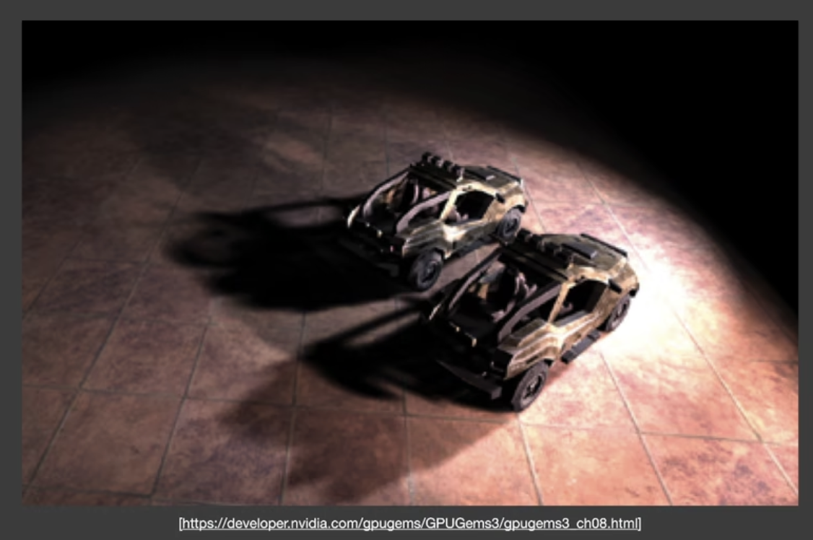

### Questions？
随着越来越多的图像降噪方法（特别是 temperal denoising）的提出，现在人们对图像空间噪声的容忍度越来越高。

快速得到一个有噪声的结果是没问题的，可以采用降噪方法来解决。

渐渐的 PCSS 压过 VSSM 一头。

**当reciever为曲面或平面与光线不平行时会出问题。**

## MIPMAP and Summed Area Variance Shadow Maps
VSSM 中需要做范围查询。存在两种范围查询加速方式：MIPMAP 和 SAT。

### MIPMAP
MIPMAP 做范围查询存在的问题：Still **approximate **even with trilinear interpolation。

另一个准确且快速的方式：**SAT**

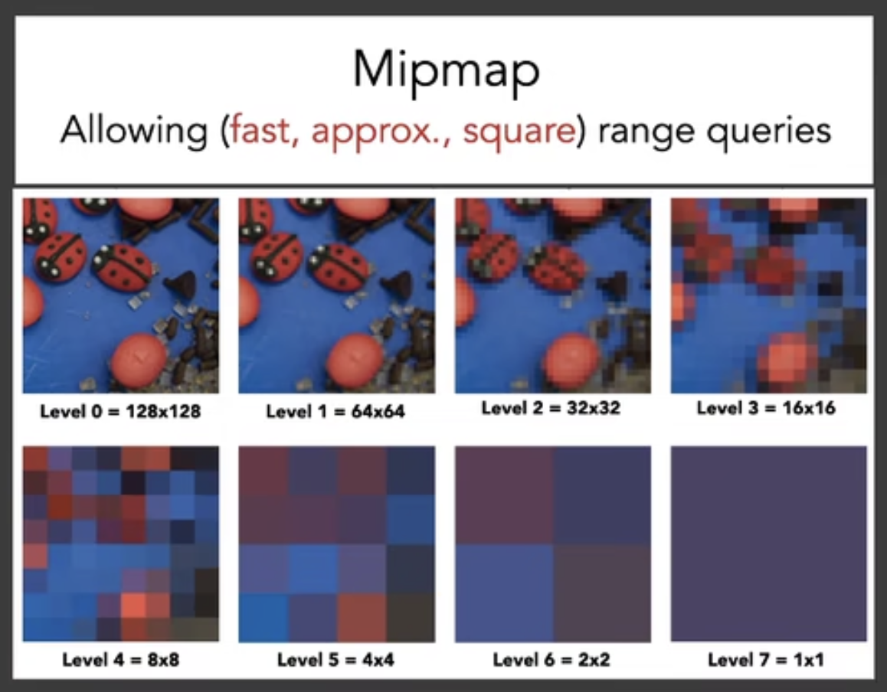

### SAT
其实就是积分图。前缀和算法（prefix sum）。

SAT 中任何一个元素，表示原元素列表中该位置元素及其左侧所有元素之和。

最后根据容斥原理来求出某个范围内的和。

1D：

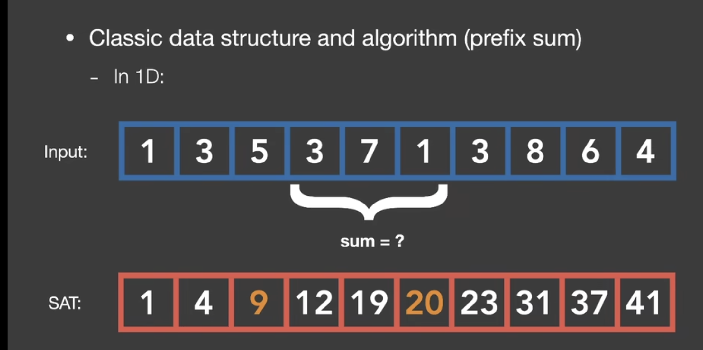

2D：

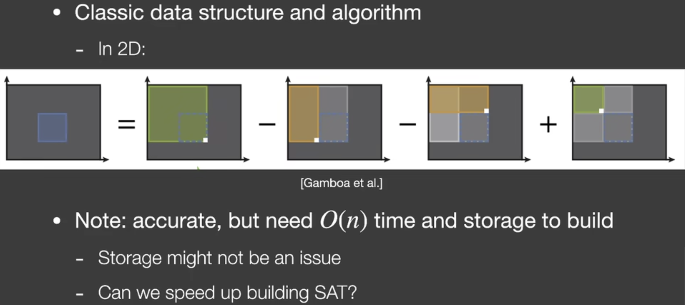

+ 存储空间不是问题。SAT 的存储空间和原图一样。
+ 但构建时间比较慢。

# MSM: Moment shadow mapping
一度被人使用，但由于时间域结合空间域滤波的降噪效果太好，人们逐渐回归 PCSS 的相关方法，而弃用了 Moment shadow mapping。

Moment shadow mapping 实现起来比较麻烦。

## Revisit: VSSM (Problem with VSSM)
Is a normal distribution always good enough to approximate the distribution of fragments' distances?

**有时不能假设为正态分布。**

+ 图1符合正态分布。
+ 但图2中，从红点向纸片看，视线穿过三个纸片，fragment distance 应该是出现三个显著的峰值而不是正态分布。

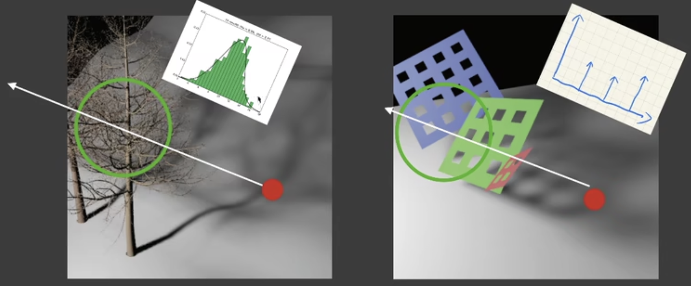

**VSSM 采用错误的分布会出现什么问题？**（只考虑 PCF 步骤，不考虑 blocker search 部分）

+ Overly dark: may be aceeptable
+ **Overly bright**: **LIGHT LEAKING**! （工业界有时叫 light bleeding，不准确，容易和全局光照中的 color bleeding 混淆）

对于阴影，偏黑了通常没什么问题，但人们不希望在阴影的某些部分突然变白。

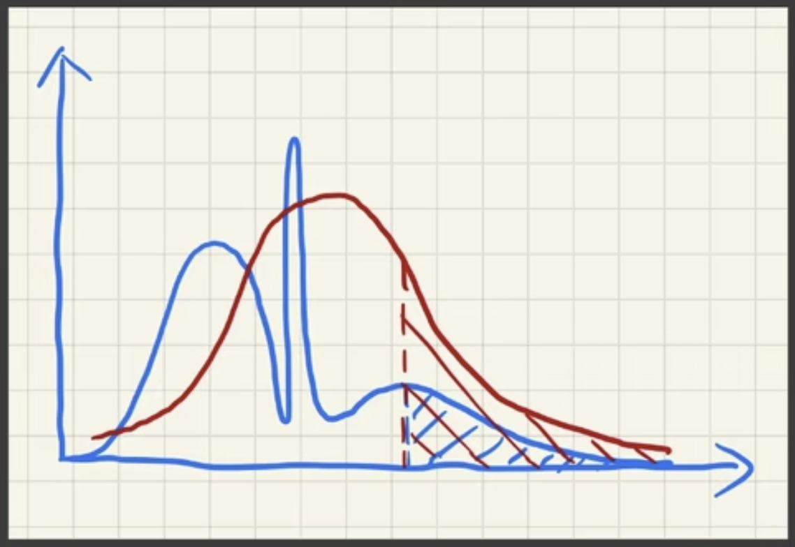

车子底盘突然出现白的部分

一方面描述分布不准确会带来 light leaking 问题，另一方面切比雪夫不等式在t>zavg时不准确也会带来误差

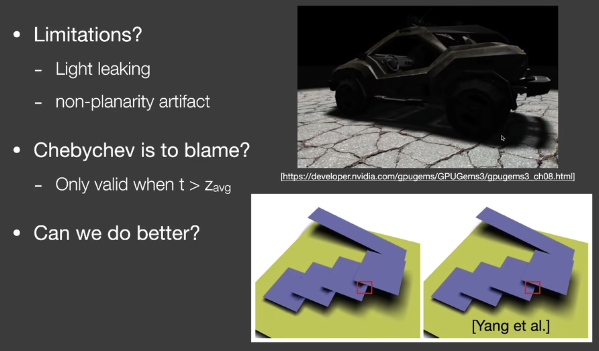

## How to Resolve
Goal

+ **Represent a distribution more accurately (but still not too costly to store)**

Idea

+ Use **higher order moments** to represent a distribution 用高阶矩来表示分布

什么是moments？

+ Quite a few variations on the definition
+ We use the simplest:  $ x, x^2, x^3, x^4, ... $
+ So, VSSM is essentially using the first two orders of moments
+ VSSM是用了前两阶矩（均值和方差）

moments 可以做什么？

+ Conclusion:
    - first m orders of moments can represent a function with m/2 steps
+ Usually, 4 is good enough to approximate the actual CDF of depth dist.
+ ~~How to restore a CDF whose moments match the given moments~~

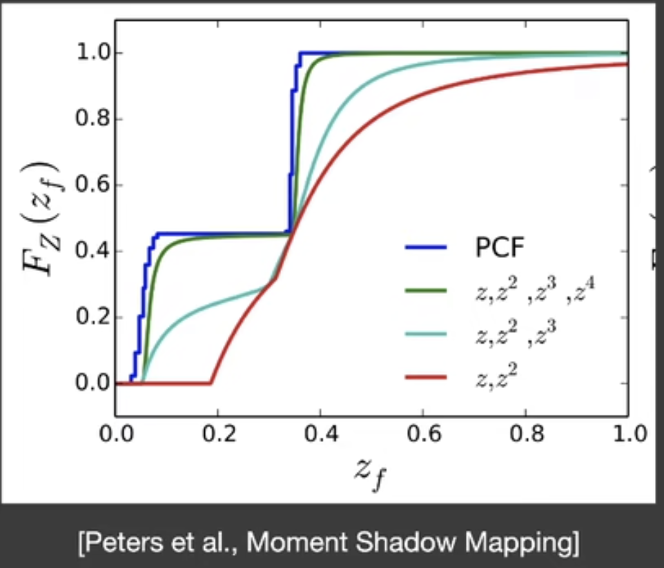

Moment Shadow Mapping

+ Extremely similar to VSSM
+ When generating the shadow map, record $ z, z^2, z^3, z^4 $?
+ Restore the CDF during blocker search & PCF

给定前四阶矩，如何生成 PDF 函数？非常复杂，详情见论文。

Pro:

+ Very nice results

Cons: 

+ Costly storage (might be fine)
+ Costly performance (in the reconstruction)

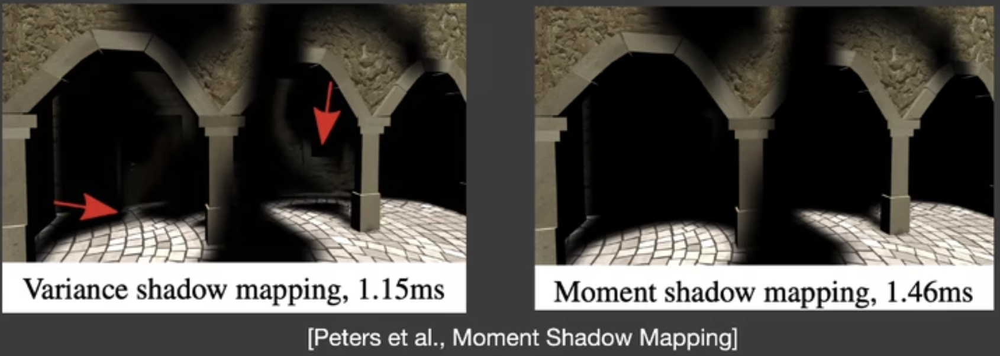

# DFSM: Distance Field Soft Shadows
## Why Distance Field Soft Shadows
UE4中用距离场来实现游戏中静态网格体Actor的动态环境光遮蔽和阴影。

1. 更快
2. 内存成本更高
3. 对于复杂几何可以达到多个shadow map才能达到的复杂效果
4. 相比栅格化阴影，会生成更合适的 penumbra，并且没有 acen（自遮挡导致的 artifact）/undesampling（采样不足）/peter panning (也就是 detaching)

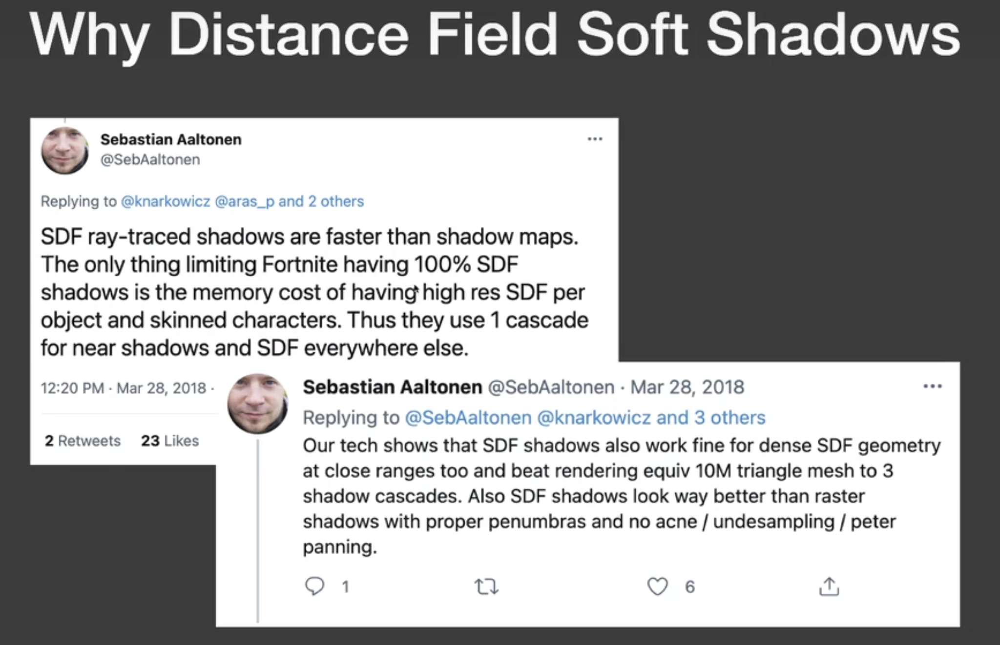

## Distance Field Functions
### Defination
Distance functions: At any point, giving the **minimum distance** (could be signed distance) to the closest location on an object. 对空间中的每一点，记录其到物体表面的最小距离（到物体上最近一个点的距离）。

SDF：负号表示在物体内部，正号表示在外部。

SDF 背后的理论：optimal transport（最优传输）

### Why SDF?
为什么用SDF？

优点1：方便做运动边界的 blending

第二行SDF只看距离为0的地方，令其为边界，不会出现第一行边界模糊的情况。

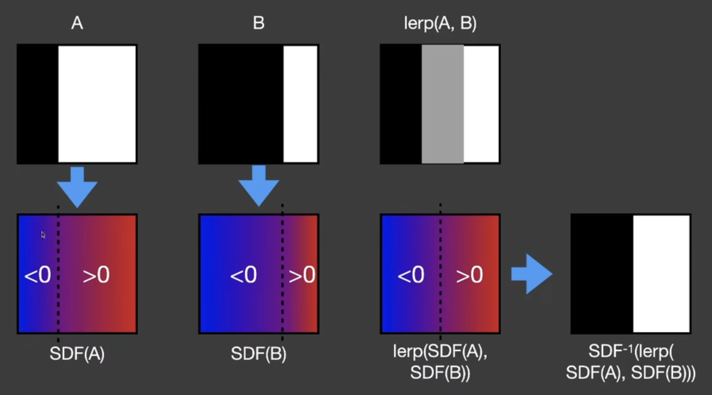

优点2：方便做任意形状的blending，无需额外考虑形状间的拓扑关系

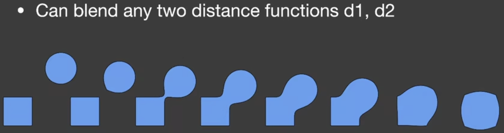

### Usages
Mainly two usages:

1. Ray marching
2. Distance field soft shadows

#### Ray marching
+ Ray marching (sphere tracing) to perform ray-SDF intersection。
    - Ray marching: 用光线追踪去追踪距离场，然后看光线会打到哪个物体表面
+ The value of SDF== a "safe" distance around
    - SDF定义了一个“安全距离”。从一点出发，只要不超过这个安全距离，就不会与任何物体发生碰撞。
    - 每次走安全距离长度的步数，然后继续根据新的安全距离做 marching。
    - Therefore, each time at p, just travel SDF(p) distance。

> ray marching, also known as distance-based rendering or volume ray casting, is a technique primarily used for rendering volumetric data, such as clouds, smoke, or other types of participating media. Instead of tracing individual rays, ray marching steps through a volume in small increments, evaluating a signed distance function at each step to determine the distance to the nearest object or surface. By iteratively marching along the ray and accumulating color and opacity values, ray marching can render complex volumetric effects.
>

> In some cases, ray tracing and ray marching can be combined in a hybrid rendering pipeline to leverage the strengths of each technique. For example, ray tracing can be used to render primary visibility and direct lighting, while ray marching is used to render volumetric effects or handle complex geometry that cannot be easily represented using traditional surfaces.
>

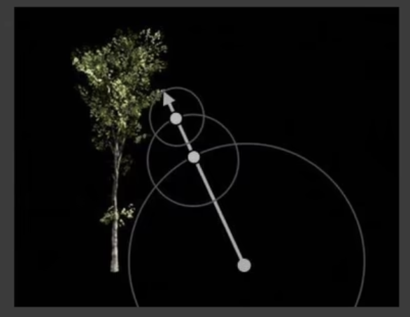

#### Distance Field Soft Shadows
+ Use SDF to determine the (approx.) percentage of occlusion 不准的
    - Step 1：the value of SDF -> a "safe" angle seen from the eye （从 shading point 向场景看）
        * During ray matching
            + Calculate the "safe" angle from the eye at every step
                - How to compute the angle?
                    * 方法1：由反三角函数
                        + $ arcsin \frac{SDF(p)}{|p-o|} $
                        + 缺点：运算量大
                    * 方法2（常用）：
                        + $ min\{\frac{k \cdot SDF(p)}{|p-o|} , 1.0\} $
                        + 思想：根据比值来估计角度
                        + k来控制软硬程度：Larger k <-> earlier cutoff of penumbra <-> harder
            + Keep the minimum
    - Step 2：Smaller "safe" angle <-> less visibility  安全角度越小，该着色点越暗；安全角度越大，该着色点越亮。安全角度为0时，该着色点完全处于阴影中。

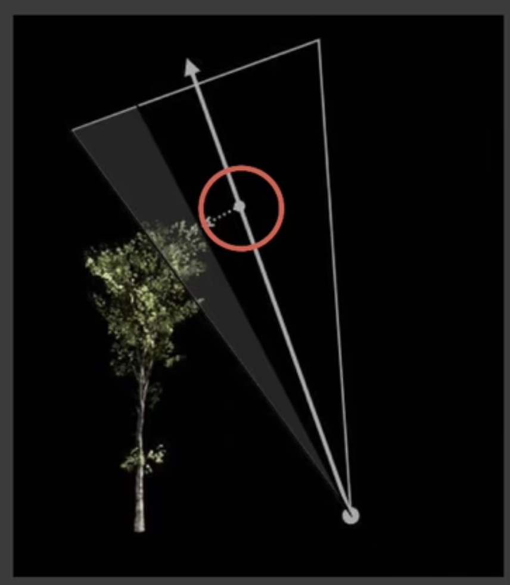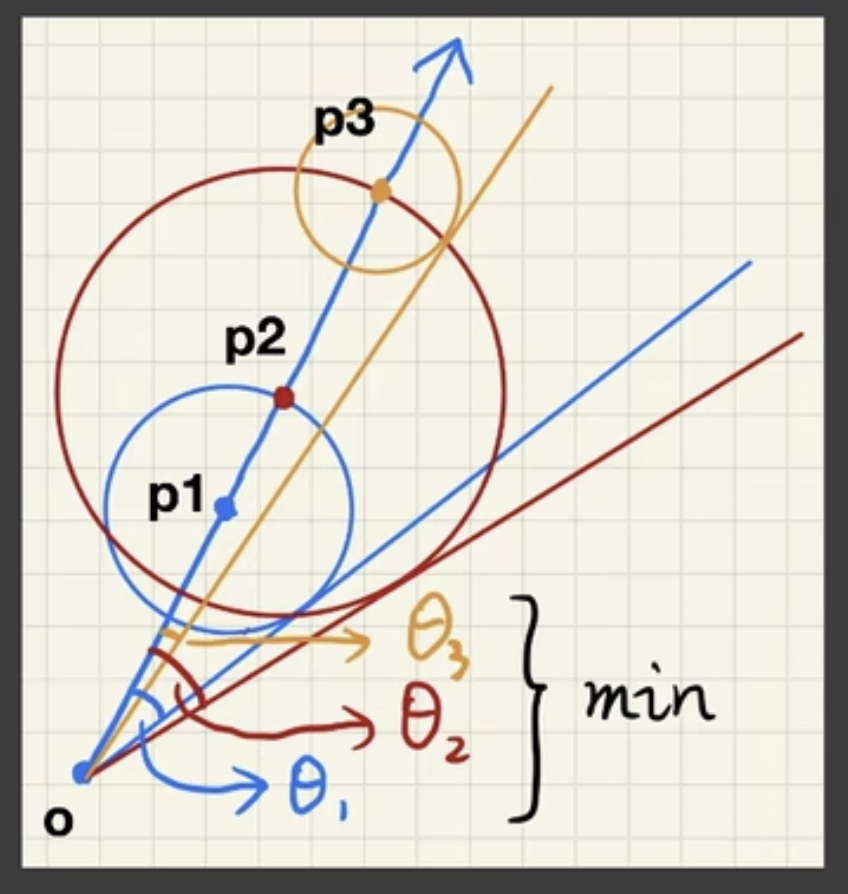

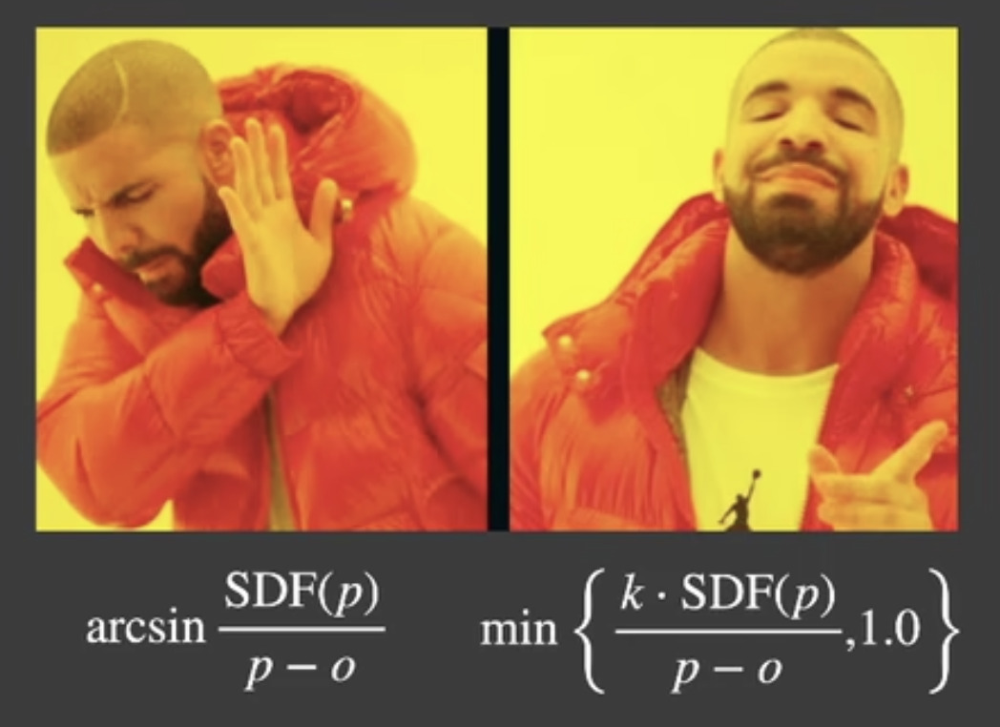

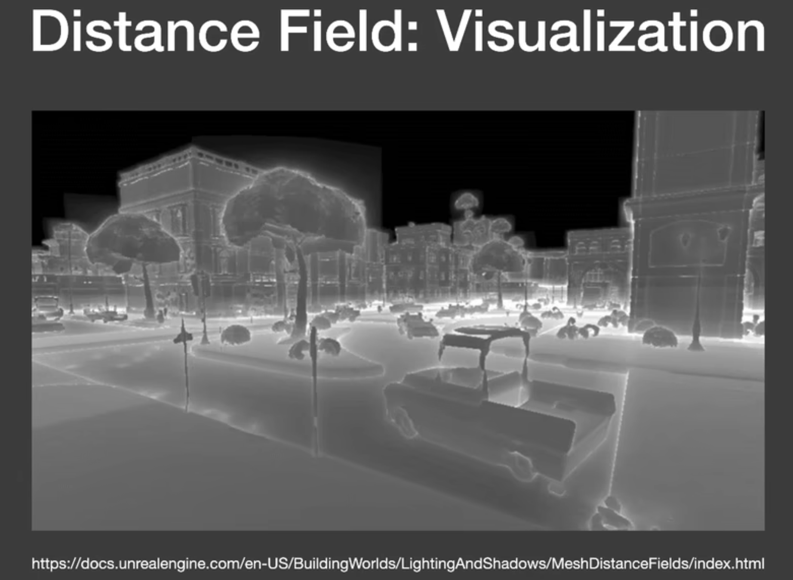

#### Antialiased / Infinite resolution characters in RTR
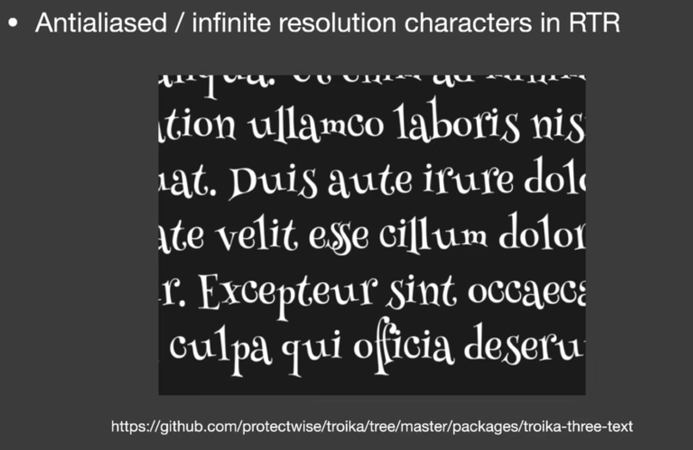

### Pros and Cons of Distance Field
1. Pros
    1. Fast
        1. 方便的地与 ray marching 过程结合
        2. 忽略距离场的生成的时间，比传统 shadow map 快。考虑的话其实速度差不多。
    2. High Quality
        1. 但比 PCSS 效果要差
2. Cons
    1. Need precomputation 预计算距离场
    2. Need heavy storage 存储距离场
        1. 可以利用八叉树KD树等数据结构，来忽略没有物体的空间
    3. Artifact

### 加速判断物体相交
显然也可以用来判断光照是否与物体相交。

与物体相交：

当圆的半径小于某个阈值时，认为相交

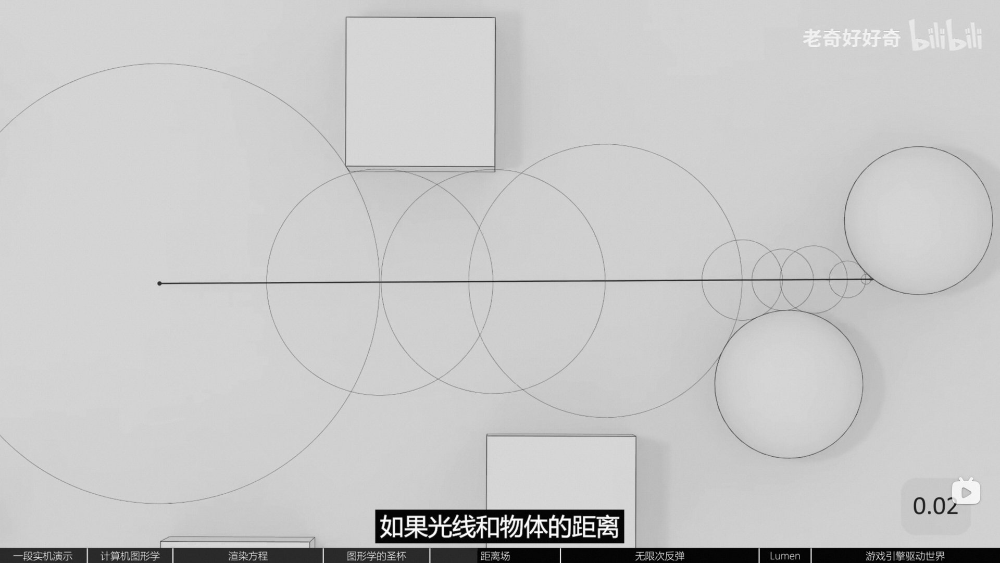

不与物体相交：

当半径一直不小于阈值，甚至不断扩大时，就认为光线不和任何物体相交

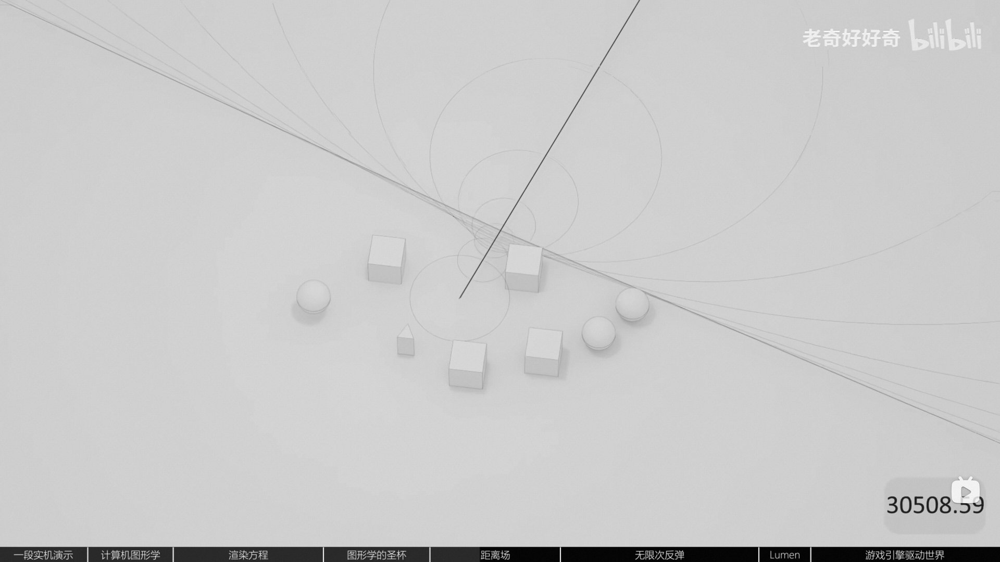

### 渲染
用于做渲染的问题：只能判断相交，获取不到材质，无法进行光线反弹的计算。

Lumen创新性地引入了表面缓存的概念。

#### 表面缓存
计算机为了存储光照专门分配的一段空间。

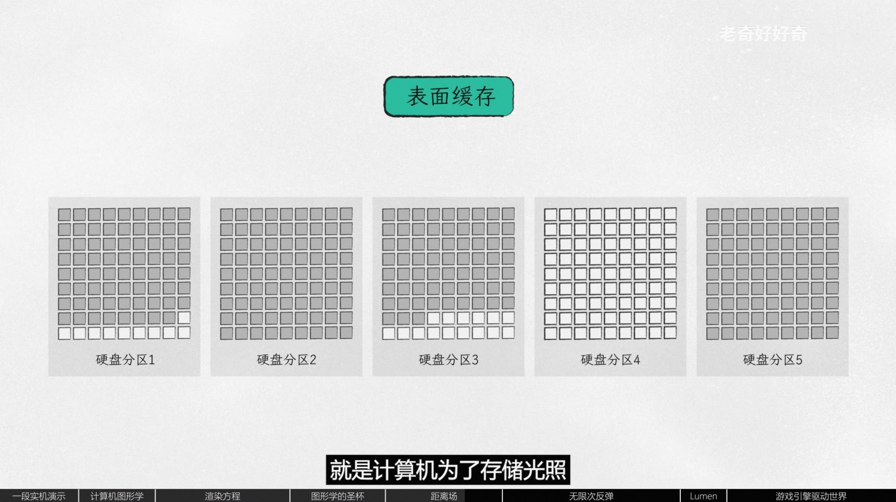

无限次光线反弹如何在一帧内实现？

工程实现和学术理论可能南辕北辙。

 

# References
+ [Cascaded Shadow Maps](https://developer.download.nvidia.com/SDK/10.5/opengl/src/cascaded_shadow_maps/doc/cascaded_shadow_maps.pdf)
+ [Chapter 11. Shadow Map Antialiasing](https://developer.nvidia.com/gpugems/gpugems/part-ii-lighting-and-shadows/chapter-11-shadow-map-antialiasing#:~:text=This%20technique%20is%20called%20percentage,%2C%20therefore%2C%20not%20in%20shadow.)
+ [Percentage-Closer Soft Shadows - Slides](http://download.nvidia.com/developer/presentations/2005/SIGGRAPH/Percentage_Closer_Soft_Shadows.pdf)
+ [Percentage-Closer Soft Shadows - Article](https://developer.download.nvidia.com/shaderlibrary/docs/shadow_PCSS.pdf)
+ [Lecture4 Real-time Shadows 2_哔哩哔哩_bilibili](https://www.bilibili.com/video/BV1YK4y1T7yY?p=4&vd_source=a637826c55b409b420b4b6584a6e8379)
+ **PCF:** Reeves, William T., David H. Salesin, and Robert L. Cook. "Rendering antialiased shadows with depth maps." Proceedings of the 14th annual conference on Computer graphics and interactive techniques. 1987.

> 更新: 2023-10-25 15:55:57  
> 原文: <https://www.yuque.com/viruspc/el3mi0/zbbiopqc2ga7tyb7>