# Marching Cube

- [SDF](#sdf)
- [A simple cube](#a-simple-cube)
- [References](#references)

---

> Marching cubes这个算法虽然古老（1987）但依旧是隐式表达到显式表达转换的de-facto；这个算法的输入是SDF： 关于SDF，喜欢玩shadertoy的小伙伴都知道，在上面写shader的时候可没有显式的mesh，都是靠SDF的隐式表达结合ray-marching实现各种各样fancy的效果
>

## SDF
几何的隐式表达：

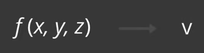

可视化。 右侧的数值被称为 surface level。surface level 是一个很重要的参数。

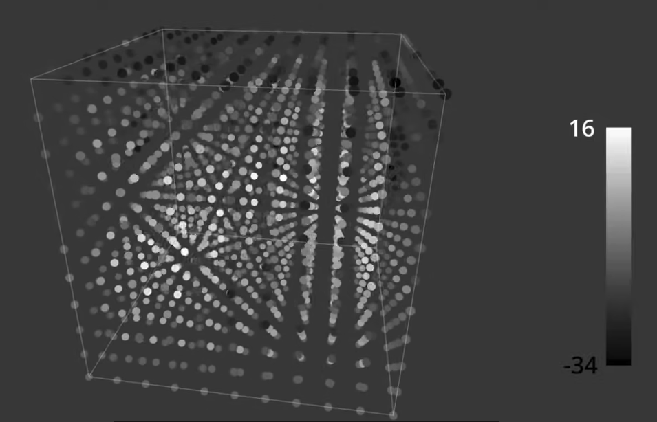

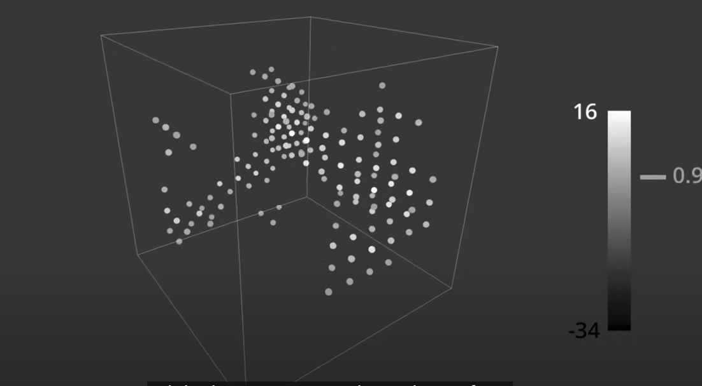

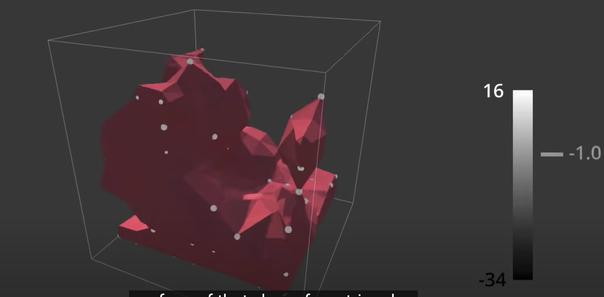

## A simple cube
1. 点亮一点

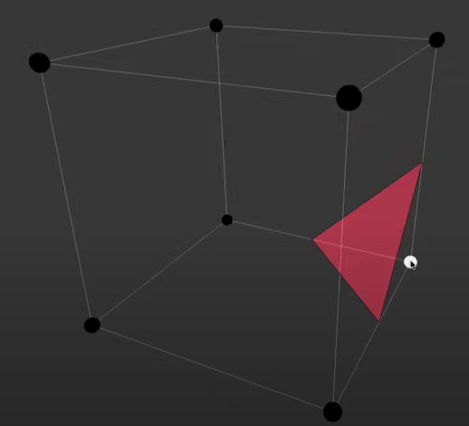

2. 点亮两点

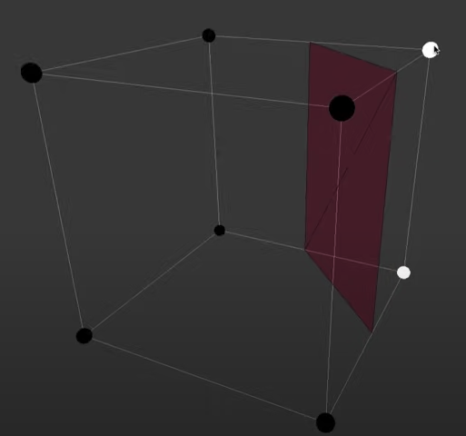

2. 点亮三点

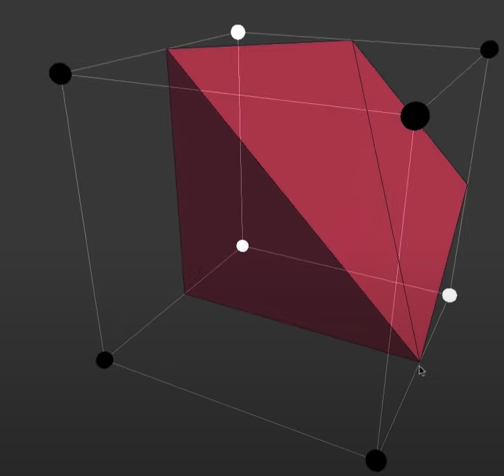

一共16种情况：

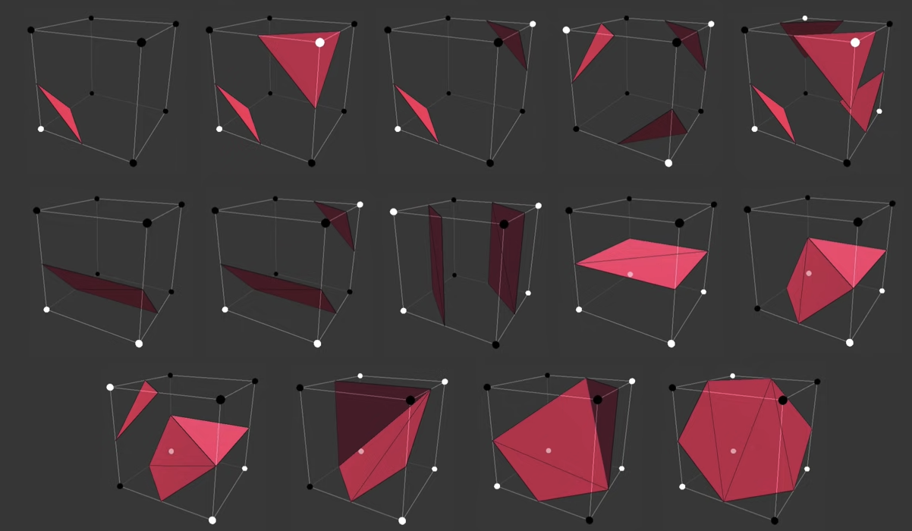

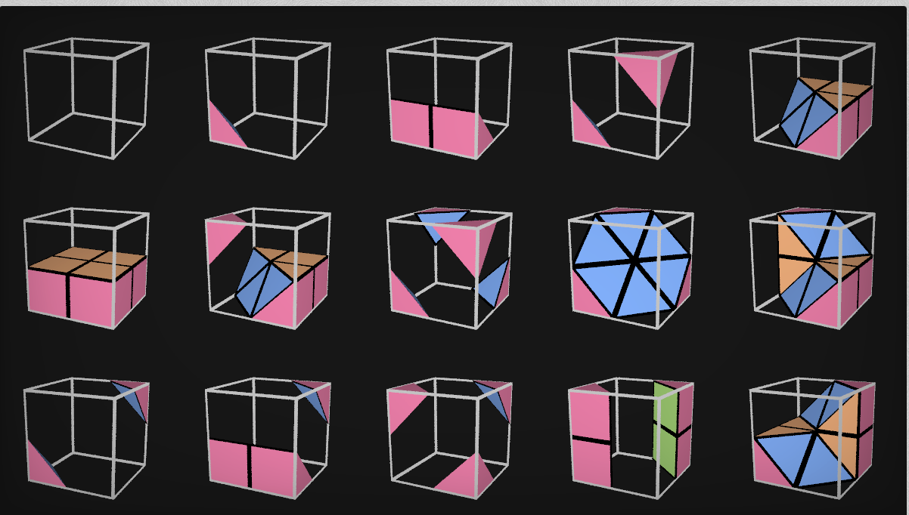

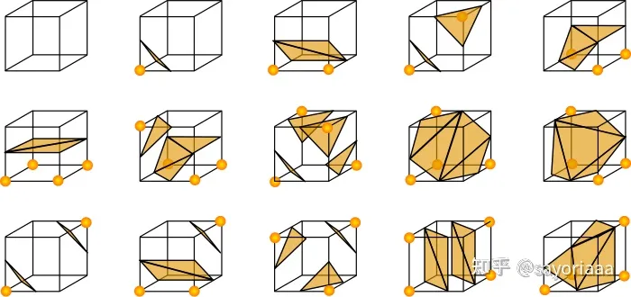

可以总结为一个 triangluation table:

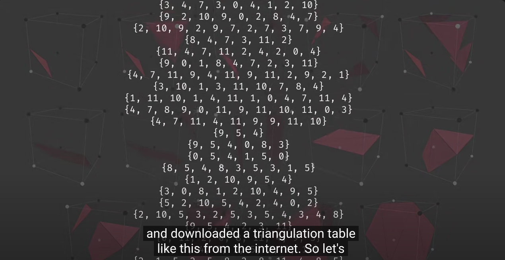将顶点的组合用一个二进制数字来表达：

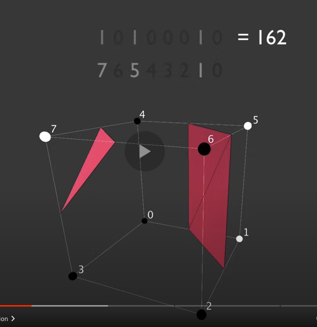

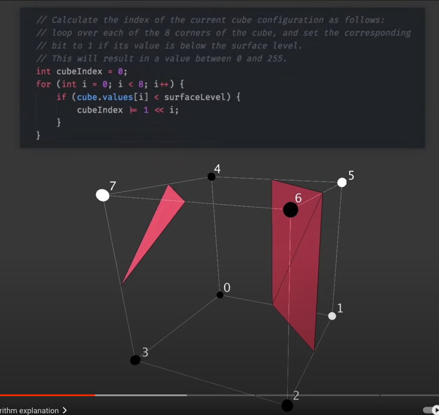

然后就可以根据二进制数字查表得到三角形顶点了：

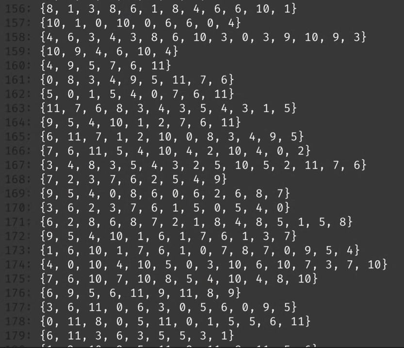

indexed vertex：

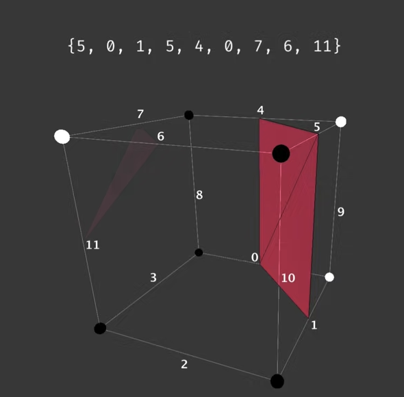

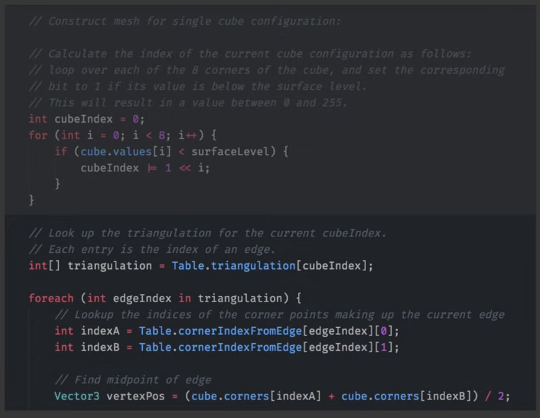

接下来要做的，就是marching整个空间：

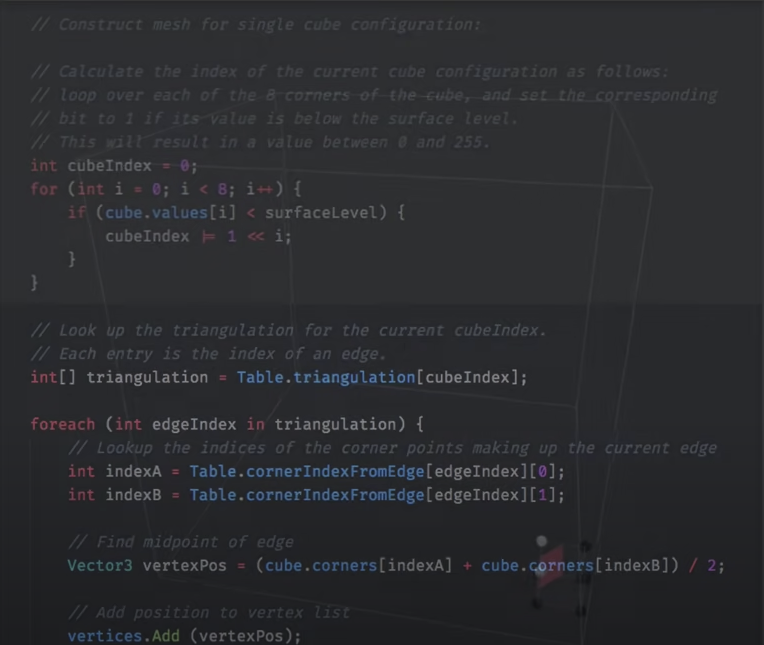

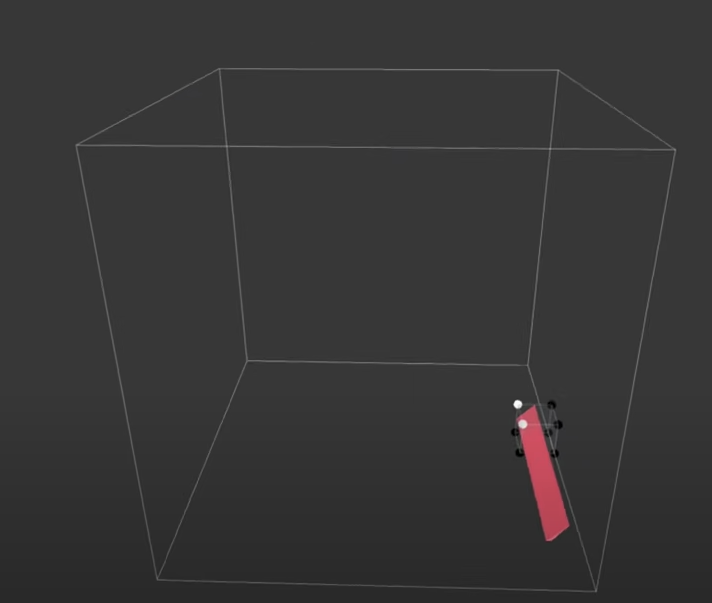

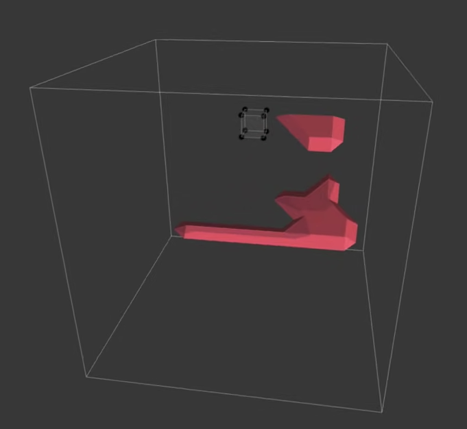

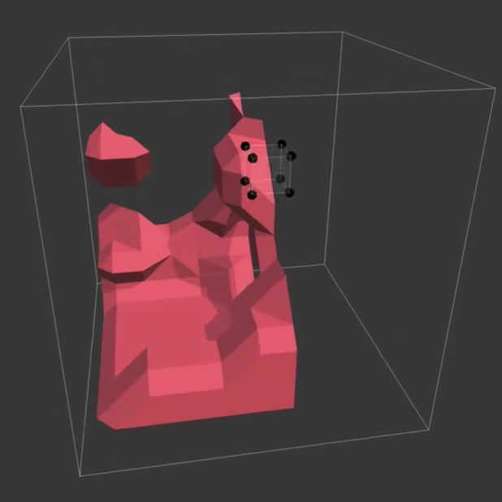

without interpolation: 总是将顶点放在边的中点，即上面那16种情况

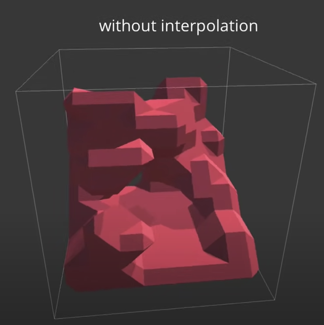

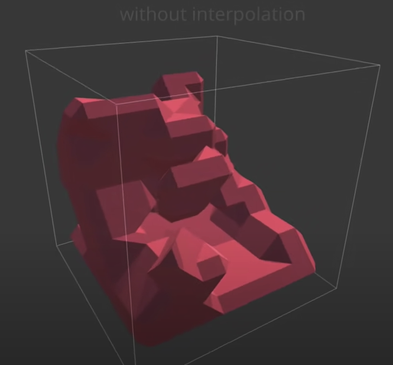

with interpolation: 根据实际值，做插值

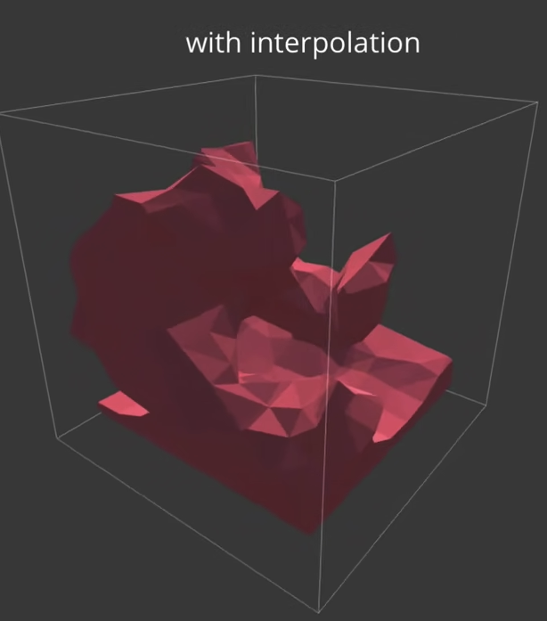

下图假设 surface level = 0

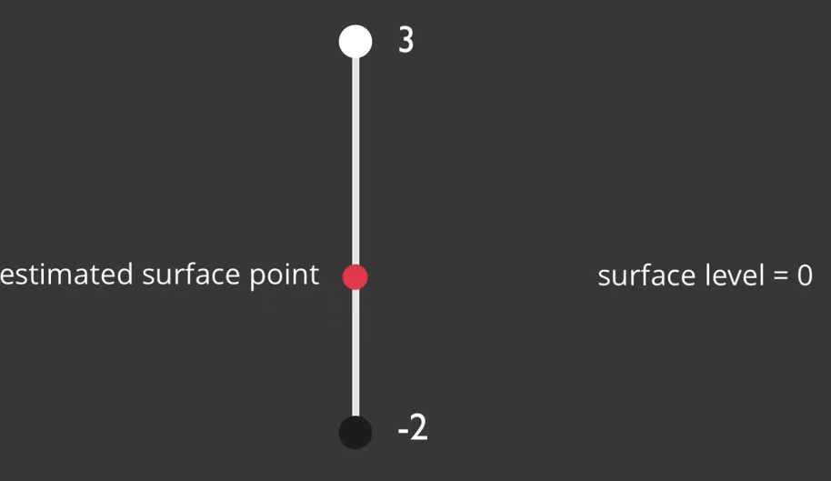

## References

+ [读书笔记 - Marching Cubes 算法](https://zhuanlan.zhihu.com/p/613392327)
+ [https://www.youtube.com/watch?v=M3iI2l0ltbE](https://www.youtube.com/watch?v=M3iI2l0ltbE)
+ Unity 代码： [https://github.com/SebLague/Marching-Cubes](https://github.com/SebLague/Marching-Cubes)
+ [地形、大气和云](https://www.yuque.com/pengcheng-fuigs/el3mi0/ewvn8igeil345gm7#OsK4p)
+ [Shadertoy](https://www.shadertoy.com/view/sltyRM)
+ [Shadertoy](https://www.shadertoy.com/view/ftXGDj)
+ 

> 更新: 2024-01-28 10:44:07  
> 原文: <https://www.yuque.com/viruspc/el3mi0/ytfqms4nix3dgtf9>