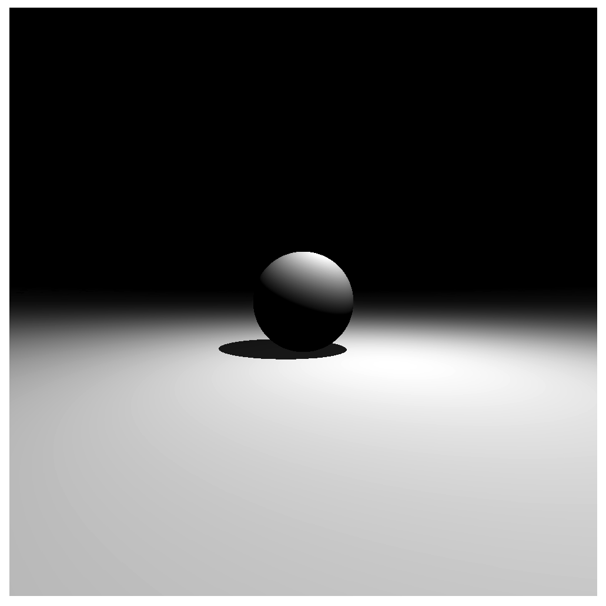
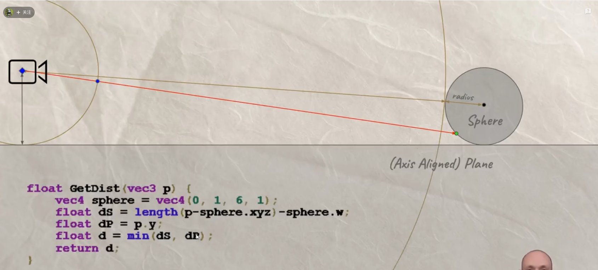
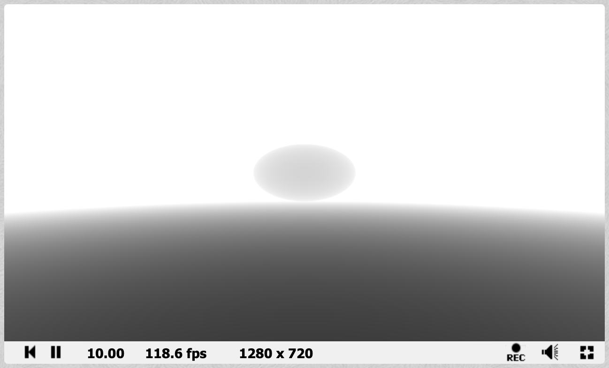
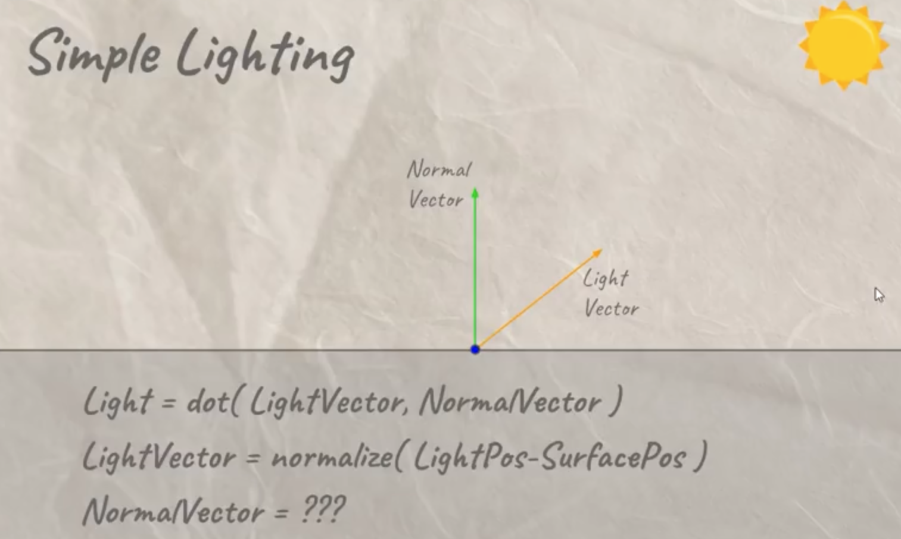
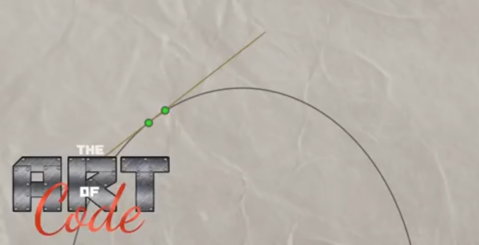
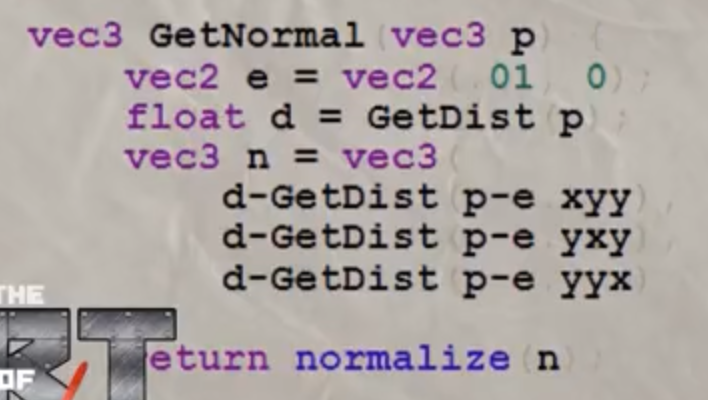
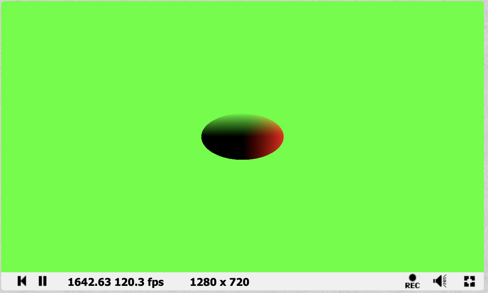
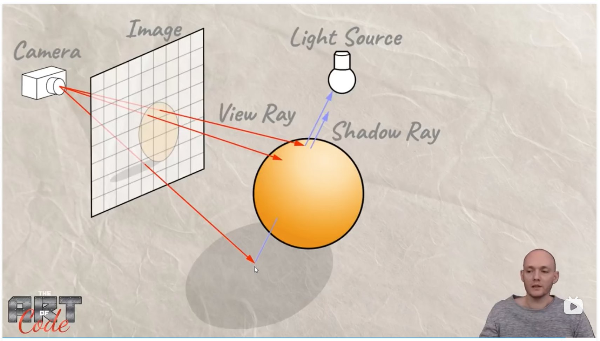
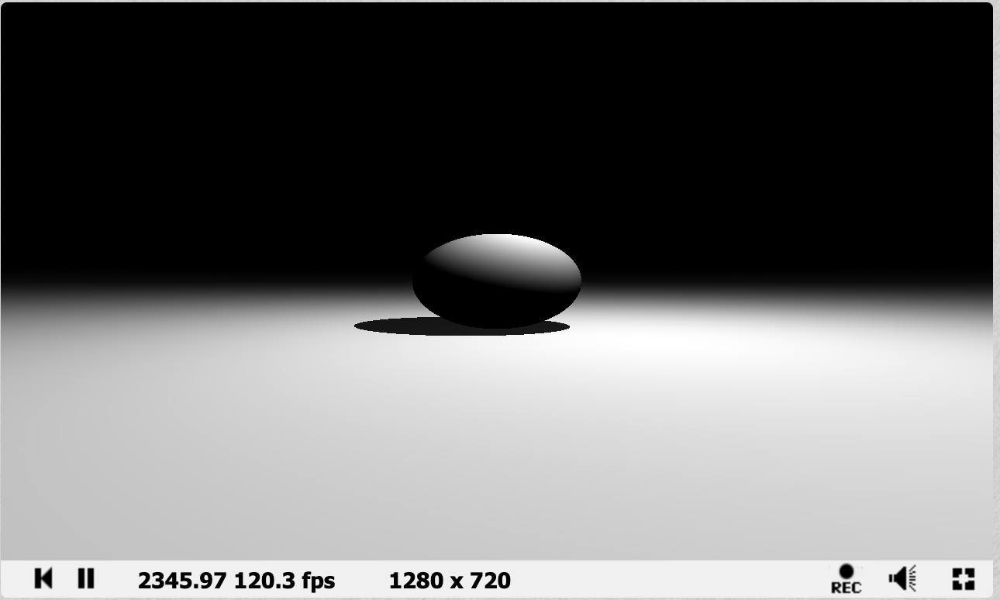

# Ray Marching - Shadertoy

- [Simple Ray Marching](#simple-ray-marching)
- [Ray Marhincg with Light](#ray-marhincg-with-light)
- [Ray Marching with Shadow](#ray-marching-with-shadow)
- [完整代码](#%E5%AE%8C%E6%95%B4%E4%BB%A3%E7%A0%81)
- [References](#references)

---

[https://web3d-demos.vercel.app/gallery/ray-marching](https://web3d-demos.vercel.app/gallery/ray-marching)



## Simple Ray Marching




```glsl
// suppose there are a ground plane and a sphere in the scene
// intersection test
float GetDist(vec3 p){
    vec4 sphere = vec4(0, 1, 6, 1); // a sphere touch the ground
    float dS = length(p - sphere.xyz) - sphere.w;
    float dP = p.y;  // ground plane
    float d = min(dS, dP);
    return d;
}


// integer
#define MAX_STEPS 100 
// float
#define MAX_DIST 100.   
#define SURFACE_DIST .01

float RayMarch(vec3 ro, vec3 rd){
    float dO = 0.; // how far away from the origin
    
    for(int i=0; i<MAX_STEPS; i++){
        vec3 p = ro+dO*rd;  // current point
        float dS = GetDist(p); // disance from this point to the nearest object
        dO += dS;
        if(dS < SURFACE_DIST || dO>MAX_DIST) break;
    }
    
    
    return dO;
}


void mainImage( out vec4 fragColor, in vec2 fragCoord )
{
    vec2 uv = (fragCoord-.5 *iResolution.xy)/iResolution.xy; // zero uv in the middle

    vec3 col = vec3(0); // black stream
    
    // camera ray
    vec3 ro = vec3(0, 1, 0); // ray origin
    vec3 rd = normalize(vec3(uv.x, uv.y, 0.5)); // ray diretion
    
    // ray marching

    float d = RayMarch(ro, rd);
     d /= 6.;
    col = vec3(d);
    

    fragColor = vec4(col, 1.0);
}

```


## Ray Marhincg with Light






法向可视化



```glsl
vec3 GetNormal(vec3 p){
    float d = GetDist(p);
    vec2 e = vec2(.01, 0);
    vec3 n = d - vec3(
        GetDist(p-e.xyy),
        GetDist(p-e.yxy),
        GetDist(p-e. yyx)
    );
    return normalize(n);
}


float GetLight(vec3 p){
    vec3 lightPos = vec3(0, 5, 6); // a point light above the sphere
    lightPos.xz += vec2(sin(iTime), cos(iTime))*2.;
    vec3 l = normalize(lightPos - p);
    vec3 n = GetNormal(p);
    
    float dif = clamp(dot(n, l), 0., 1.);
    return dif;
}


void mainImage( out vec4 fragColor, in vec2 fragCoord )
{
    vec2 uv = (fragCoord-.5 *iResolution.xy)/iResolution.xy; // zero uv in the middle

    vec3 col = vec3(0); // black stream
    
    // camera ray
    vec3 ro = vec3(0, 1, 0); // ray origin
    vec3 rd = normalize(vec3(uv.x, uv.y, 0.5)); // ray diretion
    
    // ray marching to get distance

    float d = RayMarch(ro, rd);
    
    vec3 p = ro + rd * d;
    float dif = GetLight(p);
    
    
     d /= 6.;
    col = vec3(dif);
    //col = GetNormal(p);

    fragColor = vec4(col, 1.0);
}

```


## Ray Marching with Shadow




注意需要沿法线方向移动一小段距离

```glsl
float GetLight(vec3 p){
    vec3 lightPos = vec3(0, 5, 6); // a point light above the sphere
    lightPos.xz += vec2(sin(iTime), cos(iTime))*2.;
    vec3 l = normalize(lightPos - p);
    vec3 n = GetNormal(p);
    
    float dif = clamp(dot(n, l), 0., 1.);
    
    // shadow
    // float d = RayMarch(p, l);
    // float d = RayMarch(p + n*SURFACE_DIST, l);  // not enough
    float d = RayMarch(p + n*SURFACE_DIST*2., l);
    if(d< length(lightPos-p)) dif *= .1;
    
    
    return dif;
}

```

## 完整代码
```glsl


// suppose there are a ground plane and a sphere in the scene
// intersection test
float GetDist(vec3 p){
    vec4 sphere = vec4(0, 1, 6, 1); // a sphere touch the ground
    float dS = length(p - sphere.xyz) - sphere.w;
    float dP = p.y;  // ground plane
    float d = min(dS, dP);
    return d;
}


// integer
#define MAX_STEPS 100 
// float
#define MAX_DIST 100.   
#define SURFACE_DIST .01

float RayMarch(vec3 ro, vec3 rd){
    float dO = 0.; // how far away from the origin
    
    for(int i=0; i<MAX_STEPS; i++){
        vec3 p = ro+dO*rd;  // current point
        float dS = GetDist(p); // disance from this point to the nearest object
        dO += dS;
        if(dS < SURFACE_DIST || dO>MAX_DIST) break;
    }
    
    
    return dO;
}


vec3 GetNormal(vec3 p){
    float d = GetDist(p);
    vec2 e = vec2(.01, 0);
    vec3 n = d - vec3(
        GetDist(p-e.xyy),
        GetDist(p-e.yxy),
        GetDist(p-e. yyx)
    );
    return normalize(n);
}


float GetLight(vec3 p){
    vec3 lightPos = vec3(0, 5, 6); // a point light above the sphere
    lightPos.xz += vec2(sin(iTime), cos(iTime))*2.;
    vec3 l = normalize(lightPos - p);
    vec3 n = GetNormal(p);
    
    float dif = clamp(dot(n, l), 0., 1.);
    
    // shadow
    // float d = RayMarch(p, l);
    // float d = RayMarch(p + n*SURFACE_DIST, l);  // not enough
    float d = RayMarch(p + n*SURFACE_DIST*2., l);
    if(d< length(lightPos-p)) dif *= .1;
    
    
    return dif;
}


void mainImage( out vec4 fragColor, in vec2 fragCoord )
{
    vec2 uv = (fragCoord-.5 *iResolution.xy)/iResolution.xy; // zero uv in the middle

    vec3 col = vec3(0); // black stream
    
    // camera ray
    vec3 ro = vec3(0, 1, 0); // ray origin
    vec3 rd = normalize(vec3(uv.x, uv.y, 0.5)); // ray diretion
    
    // ray marching to get distance

    float d = RayMarch(ro, rd);
    
    vec3 p = ro + rd * d;
    float dif = GetLight(p);
    
    
     d /= 6.;
    col = vec3(dif);
    //col = GetNormal(p);

    fragColor = vec4(col, 1.0);
}

```

## References


> 更新: 2024-01-20 12:54:56  
> 原文: <https://www.yuque.com/viruspc/el3mi0/zw6o8eezucq95tob>