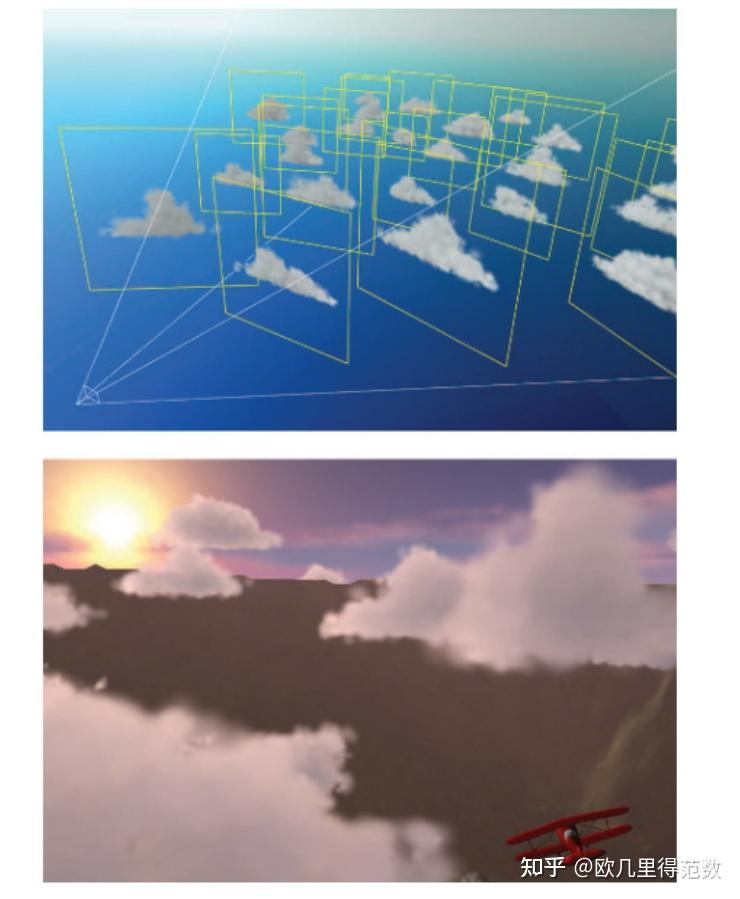

# Sprite、Impostor and Billboard

  * [Sprite VS Impostor VS Billboard](#sprite-vs-impostor-vs-billboard)
    + [1. **本质上的区别**](#1-%E6%9C%AC%E8%B4%A8%E4%B8%8A%E7%9A%84%E5%8C%BA%E5%88%AB)
    + [2. **核心用途**](#2-%E6%A0%B8%E5%BF%83%E7%94%A8%E9%80%94)
    + [3. **实现方式的区别**](#3-%E5%AE%9E%E7%8E%B0%E6%96%B9%E5%BC%8F%E7%9A%84%E5%8C%BA%E5%88%AB)
    + [4. **视觉效果的区别**](#4-%E8%A7%86%E8%A7%89%E6%95%88%E6%9E%9C%E7%9A%84%E5%8C%BA%E5%88%AB)
    + [5. **适用场景的区别**](#5-%E9%80%82%E7%94%A8%E5%9C%BA%E6%99%AF%E7%9A%84%E5%8C%BA%E5%88%AB)
    + [6. **举个例子**](#6-%E4%B8%BE%E4%B8%AA%E4%BE%8B%E5%AD%90)
    + [总结](#%E6%80%BB%E7%BB%93)
  * [Billboard VS Impostor](#billboard-vs-impostor)
    + [1. **Billboard 和 Impostor 的核心区别**](#1-billboard-%E5%92%8C-impostor-%E7%9A%84%E6%A0%B8%E5%BF%83%E5%8C%BA%E5%88%AB)
    + [2. **Billboard 是否属于 Impostor？**](#2-billboard-%E6%98%AF%E5%90%A6%E5%B1%9E%E4%BA%8E-impostor)
      - [**两者的关系可以总结如下：**](#%E4%B8%A4%E8%80%85%E7%9A%84%E5%85%B3%E7%B3%BB%E5%8F%AF%E4%BB%A5%E6%80%BB%E7%BB%93%E5%A6%82%E4%B8%8B)
    + [3. **实际使用中的区别**](#3-%E5%AE%9E%E9%99%85%E4%BD%BF%E7%94%A8%E4%B8%AD%E7%9A%84%E5%8C%BA%E5%88%AB)
    + [4. **结合使用的场景**](#4-%E7%BB%93%E5%90%88%E4%BD%BF%E7%94%A8%E7%9A%84%E5%9C%BA%E6%99%AF)
    + [5. **总结**](#5-%E6%80%BB%E7%BB%93)
- [References](#references)

---

而Impostor是Billboard技术的一种应用，**通过将当前观察点中的复杂物体渲染成纹理，并将改纹理映射到一个Billboard Mesh上，从而创建一个Impostor**。它可以用于同一个物体的若干实例，或者在几帧中重复使用，从而分摊它的创建成本。

## Sprite VS Impostor VS Billboard
**Sprite**、**Impostor** 和 **Billboard** 听起来有些相似，因为它们都涉及到使用二维平面来表现对象。但它们在**本质**、**用途**和**实现细节**上有明确的区别。为了更清晰地说明它们的差异，我们可以从以下几个方面进行更深入的对比：

---

### 1. **本质上的区别**
+ **Sprite** 是纯粹的 2D 图像或动画，通常用作界面元素或简单的装饰物，和 3D 场景没有直接关系。
+ **Billboard** 是 3D 场景中的一个平面，它始终面向摄像机，用于表现粒子效果或简单的 3D 对象。
+ **Impostor** 是一种优化技术，用一个低多边形或平面对象代替复杂的 3D 模型，并通过纹理模拟 3D 效果。

---

### 2. **核心用途**
| **技术** | **主要用途** |
| --- | --- |
| **Sprite** | 用于 2D 游戏中的角色、UI 元素，或 3D 游戏中的 HUD（如血条、图标）。 |
| **Billboard** | 用于 3D 场景中的特效（如烟雾、火焰）或简单的远景对象（如树木、草丛），始终面向摄像机。 |
| **Impostor** | 用于远距离优化复杂的 3D 模型，用一个平面或低多边形对象代替高多边形模型，减少渲染开销。 |

---

### 3. **实现方式的区别**
+ **Sprite**：
    - 是一个始终面向摄像机的 2D 图像，通常没有深度信息。
    - 在 2D 游戏中，Sprite 是游戏世界的基本构建单元。
    - 在 3D 游戏中，Sprite 通常用作 HUD 或装饰性元素。
+ **Billboard**：
    - 是一个位于 3D 场景中的平面，但它会动态旋转，始终面向摄像机。
    - Billboard 通常用于粒子系统（如爆炸、烟雾）或简单的 3D 对象（如远处的树木）。
    - 实现方式是通过动态调整平面的朝向，使其法线始终与摄像机方向一致。
+ **Impostor**：
    - 是一种优化技术，使用一个平面或低多边形对象来模拟复杂的 3D 模型。
    - Impostor 的纹理可以是预渲染的，也可以是动态生成的，通常包含不同角度的视图。
    - 它不会像 Billboard 那样始终面向摄像机，但会通过纹理表现出 3D 的效果。

---

### 4. **视觉效果的区别**
+ **Sprite**：  
    - 纯二维，没有深度感。  
    - 适合用来表现简单的图标、UI 或装饰性图像。
+ **Billboard**：  
    - 看起来像是 3D 场景中的一部分，但实际上是一个动态旋转的平面。  
    - 视觉效果依赖于摄像机的角度，适合表现粒子效果或简单对象。
+ **Impostor**：  
    - 视觉效果接近真实的 3D 模型，尤其在远距离时不容易察觉它是一个简化对象。  
    - 在近距离观察时，可能会暴露出它的二维本质（如缺乏立体感）。

---

### 5. **适用场景的区别**
| **场景** | **Sprite** | **Billboard** | **Impostor** |
| --- | --- | --- | --- |
| **2D 游戏** | 用于角色、背景、UI 等 | 不适用 | 不适用 |
| **3D 游戏的 UI** | 用于 HUD（如血条、图标） | 不适用 | 不适用 |
| **粒子效果（烟雾、火焰）** | 不适用 | 最常用 | 不适用 |
| **远景对象（树木、建筑）** | 不适用 | 可用，但细节不足 | 最适合 |
| **远距离优化** | 不适用 | 不适用 | 最常用 |

---

### 6. **举个例子**
假设你在开发一个开放世界游戏，场景中有大量的树木、火焰和角色血条：

+ **Sprite**：  
    - 用于角色血条、任务图标等 UI 元素。
+ **Billboard**：  
    - 用于表现火焰、烟雾等粒子效果，或者远处的简单树木。
+ **Impostor**：  
    - 用于远距离的复杂树木或建筑物，以降低渲染开销。

---

### 总结
虽然 **Sprite**、**Billboard** 和 **Impostor** 都使用了二维平面，但它们的核心区别在于：

1. **Sprite** 是纯粹的 2D 图像，主要用于 2D 游戏或 3D 游戏中的 UI。
2. **Billboard** 是 3D 场景中的平面，始终面向摄像机，用于粒子效果或简单对象。
3. **Impostor** 是一种优化技术，用平面或低多边形对象来代替复杂的 3D 模型，主要用于远距离对象的渲染优化。

## Billboard VS Impostor
**Billboard 和 Impostor 是不同的概念，它们不能直接互相包含**，但它们确实有一些相似之处，尤其是在使用二维平面来渲染对象时。为了更清晰地回答你的问题，我们可以从以下几个方面分析它们的关系：

---

### 1. **Billboard 和 Impostor 的核心区别**
+ **Billboard**：
    - 是一个始终面向摄像机的二维平面。
    - 通常用于表现粒子效果（如火焰、烟雾）或非常简单的对象（如远处的树木）。
    - **它的目的是通过动态旋转平面来保持视觉一致性**，而不是模拟复杂的三维细节。
+ **Impostor**：
    - 是一种优化技术，用一个静态或动态的二维平面（或低多边形对象）来代替复杂的 3D 模型。
    - Impostor 不一定始终面向摄像机，但它会使用预渲染或动态生成的纹理来模拟 3D 模型的外观。
    - **它的目的是减少渲染复杂模型的计算开销，同时尽可能保留视觉效果**。

---

### 2. **Billboard 是否属于 Impostor？**
从技术和实现的角度来看，**Billboard 并不属于 Impostor**，但它们在某些情况下可以互相借鉴或结合使用。

#### **两者的关系可以总结如下：**
+ **Billboard 是一种更简单的技术**：
    - 它只是一个动态旋转的平面，主要用于表现简单的特效。
    - 不需要复杂的纹理生成或预渲染。
+ **Impostor 是一种更复杂的优化技术**：
    - 它可以使用静态的平面（类似 Billboard）来表现远距离对象。
    - Impostor 的纹理通常包含多个角度的视图，以模拟 3D 对象的真实感。
    - Impostor 不一定需要动态旋转（不一定始终面向摄像机）。

因此，**Billboard 和 Impostor 是两种独立的技术**，但在某些场景中，Billboard 可以被视为 Impostor 的一种简单形式。例如：

+ 如果一个 Impostor 对象是一个始终面向摄像机的平面，并且只使用一个视角的纹理，那么它的行为会类似于 Billboard。

---

### 3. **实际使用中的区别**
| **特性** | **Billboard** | **Impostor** |
| --- | --- | --- |
| **是否动态旋转** | 始终面向摄像机 | 不一定动态旋转，可能是固定的 |
| **纹理来源** | 通常是简单的粒子贴图或单一图像 | 可能是预渲染的多角度纹理或动态生成的纹理 |
| **用途** | 粒子效果、简单对象（如烟雾、火焰） | 优化复杂模型（如远处的树木、建筑） |
| **复杂度** | 简单 | 较高，需要额外的纹理生成或管理 |
| **是否属于优化技术** | 不一定，更多是为了实现特定的视觉效果 | 是一种明确的优化技术 |

---

### 4. **结合使用的场景**
在实际开发中，Billboard 和 Impostor 有时会结合使用。例如：

+ 在渲染远处的树木时，可以使用一个 **Billboard Impostor**：
    - 这个树木是一个始终面向摄像机的平面（Billboard）。
    - 这个平面上贴有从高多边形树模型预渲染的纹理（Impostor 技术）。

这种结合方式既利用了 Billboard 的动态旋转特性，又利用了 Impostor 的纹理优化，从而在远距离场景中实现较好的视觉效果和性能平衡。

---

### 5. **总结**
+ **Billboard 不属于 Impostor**，它们是两种独立的技术。
+ **Billboard 更简单，专注于动态面向摄像机的视觉效果**，而 **Impostor 更复杂，专注于优化复杂模型的渲染开销**。
+ 在某些场景中，Billboard 可以作为 Impostor 的一种简单形式，尤其是在远距离渲染中。

希望这个解释能帮助你更好地理解两者的关系！如果还有疑问，可以继续讨论 😊。

# References
[https://zhuanlan.zhihu.com/p/684423888](https://zhuanlan.zhihu.com/p/684423888)

> 更新: 2025-11-14 03:29:21  
> 原文: <https://www.yuque.com/viruspc/el3mi0/ptubuviusrcwwl11>