# 实时阴影渲染

- [引言](#%E5%BC%95%E8%A8%80)
- [基础概念](#%E5%9F%BA%E7%A1%80%E6%A6%82%E5%BF%B5)
  * [阴影](#%E9%98%B4%E5%BD%B1)
  * [纹理/贴图](#%E7%BA%B9%E7%90%86%E8%B4%B4%E5%9B%BE)
  * [栅格化](#%E6%A0%85%E6%A0%BC%E5%8C%96)
  * [采样与走样](#%E9%87%87%E6%A0%B7%E4%B8%8E%E8%B5%B0%E6%A0%B7)
- [实时阴影渲染技术](#%E5%AE%9E%E6%97%B6%E9%98%B4%E5%BD%B1%E6%B8%B2%E6%9F%93%E6%8A%80%E6%9C%AF)
  * [一些简单技术](#%E4%B8%80%E4%BA%9B%E7%AE%80%E5%8D%95%E6%8A%80%E6%9C%AF)
  * [平面阴影（Planar Shadow）](#%E5%B9%B3%E9%9D%A2%E9%98%B4%E5%BD%B1planar-shadow)
    + [**背景**](#%E8%83%8C%E6%99%AF)
    + [核心思想](#%E6%A0%B8%E5%BF%83%E6%80%9D%E6%83%B3)
    + [算法流程](#%E7%AE%97%E6%B3%95%E6%B5%81%E7%A8%8B)
    + [**效果**](#%E6%95%88%E6%9E%9C)
    + [**优点**](#%E4%BC%98%E7%82%B9)
    + [缺点](#%E7%BC%BA%E7%82%B9)
  * [阴影体（Shadow Volume）](#%E9%98%B4%E5%BD%B1%E4%BD%93shadow-volume)
    + [**核心思想**](#%E6%A0%B8%E5%BF%83%E6%80%9D%E6%83%B3)
    + [算法流程](#%E7%AE%97%E6%B3%95%E6%B5%81%E7%A8%8B-1)
      - [Z-Pass](#z-pass)
      - [Z-Fail](#z-fail)
    + [效果](#%E6%95%88%E6%9E%9C)
    + [优点](#%E4%BC%98%E7%82%B9)
    + [缺点](#%E7%BC%BA%E7%82%B9-1)
  * [现代阴影技术基础：Shadow Map](#%E7%8E%B0%E4%BB%A3%E9%98%B4%E5%BD%B1%E6%8A%80%E6%9C%AF%E5%9F%BA%E7%A1%80shadow-map)
    + [背景](#%E8%83%8C%E6%99%AF)
    + [核心思想](#%E6%A0%B8%E5%BF%83%E6%80%9D%E6%83%B3)
    + [算法流程](#%E7%AE%97%E6%B3%95%E6%B5%81%E7%A8%8B-2)
    + [**效果**](#%E6%95%88%E6%9E%9C-1)
    + [优点](#%E4%BC%98%E7%82%B9-1)
    + [缺点](#%E7%BC%BA%E7%82%B9-2)
  * [软阴影：PCSS => VSM、MSM](#%E8%BD%AF%E9%98%B4%E5%BD%B1pcss--vsmmsm)
    + [背景](#%E8%83%8C%E6%99%AF-1)
    + [核心思想](#%E6%A0%B8%E5%BF%83%E6%80%9D%E6%83%B3-1)
    + [算法流程](#%E7%AE%97%E6%B3%95%E6%B5%81%E7%A8%8B-3)
    + [效果](#%E6%95%88%E6%9E%9C-1)
    + [其他问题](#%E5%85%B6%E4%BB%96%E9%97%AE%E9%A2%98)
    + [**优点**](#%E4%BC%98%E7%82%B9)
    + [缺点](#%E7%BC%BA%E7%82%B9-3)
    + [其他相关算法](#%E5%85%B6%E4%BB%96%E7%9B%B8%E5%85%B3%E7%AE%97%E6%B3%95)
      - [Variance soft shadow mapping (VSM 或 VSSM)](#variance-soft-shadow-mapping-vsm-%E6%88%96-vssm)
      - [Moment shadow mapping （MSM）](#moment-shadow-mapping-msm)
      - [**Virtual Shadow Mapping（VSM ）+ SMRT**](#virtual-shadow-mappingvsm--smrt)
  * [中远距离阴影：Cascaded Shadow Map （CSM，级联阴影）](#%E4%B8%AD%E8%BF%9C%E8%B7%9D%E7%A6%BB%E9%98%B4%E5%BD%B1cascaded-shadow-map-csm%E7%BA%A7%E8%81%94%E9%98%B4%E5%BD%B1)
    + [背景](#%E8%83%8C%E6%99%AF-2)
    + [核心思想](#%E6%A0%B8%E5%BF%83%E6%80%9D%E6%83%B3-2)
    + [算法流程](#%E7%AE%97%E6%B3%95%E6%B5%81%E7%A8%8B-4)
    + [效果](#%E6%95%88%E6%9E%9C-2)
    + [优点](#%E4%BC%98%E7%82%B9-2)
    + [缺点](#%E7%BC%BA%E7%82%B9-4)
  * [远距离阴影：Distance Field Shadow Map](#%E8%BF%9C%E8%B7%9D%E7%A6%BB%E9%98%B4%E5%BD%B1distance-field-shadow-map)
    + [背景](#%E8%83%8C%E6%99%AF-3)
    + [相关工作](#%E7%9B%B8%E5%85%B3%E5%B7%A5%E4%BD%9C)
      - [SDF](#sdf)
      - [Ray marching](#ray-marching)
    + [算法流程](#%E7%AE%97%E6%B3%95%E6%B5%81%E7%A8%8B-5)
    + [优点](#%E4%BC%98%E7%82%B9-3)
    + [缺点](#%E7%BC%BA%E7%82%B9-5)
  * [近距离阴影：Contact Shadow (SSAO=>HBAO、SSDO、DFAO)](#%E8%BF%91%E8%B7%9D%E7%A6%BB%E9%98%B4%E5%BD%B1contact-shadow-ssaohbaossdodfao)
    + [背景](#%E8%83%8C%E6%99%AF-4)
    + [**核心思想**](#%E6%A0%B8%E5%BF%83%E6%80%9D%E6%83%B3-1)
    + [**算法流程**](#%E7%AE%97%E6%B3%95%E6%B5%81%E7%A8%8B)
    + [**效果**](#%E6%95%88%E6%9E%9C-2)
    + [**优点**](#%E4%BC%98%E7%82%B9-1)
    + [**缺点**](#%E7%BC%BA%E7%82%B9)
    + [**其他相关算法**](#%E5%85%B6%E4%BB%96%E7%9B%B8%E5%85%B3%E7%AE%97%E6%B3%95)
  * [反射阴影：SSR（Screen Space Reflection）](#%E5%8F%8D%E5%B0%84%E9%98%B4%E5%BD%B1ssrscreen-space-reflection)
    + [背景](#%E8%83%8C%E6%99%AF-5)
    + [核心思想](#%E6%A0%B8%E5%BF%83%E6%80%9D%E6%83%B3-3)
    + [算法流程](#%E7%AE%97%E6%B3%95%E6%B5%81%E7%A8%8B-6)
    + [效果](#%E6%95%88%E6%9E%9C-3)
    + [优点](#%E4%BC%98%E7%82%B9-4)
    + [缺点](#%E7%BC%BA%E7%82%B9-6)
  * [高分辨率：Virtual Shadow Maps（VSM，虚拟阴影贴图）](#%E9%AB%98%E5%88%86%E8%BE%A8%E7%8E%87virtual-shadow-mapsvsm%E8%99%9A%E6%8B%9F%E9%98%B4%E5%BD%B1%E8%B4%B4%E5%9B%BE)
    + [背景](#%E8%83%8C%E6%99%AF-6)
    + [核心思想](#%E6%A0%B8%E5%BF%83%E6%80%9D%E6%83%B3-4)
    + [算法流程](#%E7%AE%97%E6%B3%95%E6%B5%81%E7%A8%8B-7)
    + [效果](#%E6%95%88%E6%9E%9C-4)
    + [优点](#%E4%BC%98%E7%82%B9-5)
    + [**缺点**](#%E7%BC%BA%E7%82%B9-1)
    + [**工程注意事项**](#%E5%B7%A5%E7%A8%8B%E6%B3%A8%E6%84%8F%E4%BA%8B%E9%A1%B9)
  * [Ray Traced Shadow](#ray-traced-shadow)
- [在淘宝中的应用](#%E5%9C%A8%E6%B7%98%E5%AE%9D%E4%B8%AD%E7%9A%84%E5%BA%94%E7%94%A8)
- [编程实战 - Shadowmap](#%E7%BC%96%E7%A8%8B%E5%AE%9E%E6%88%98---shadowmap)
- [总结](#%E6%80%BB%E7%BB%93)
- [相关文章](#%E7%9B%B8%E5%85%B3%E6%96%87%E7%AB%A0)

---

# 引言
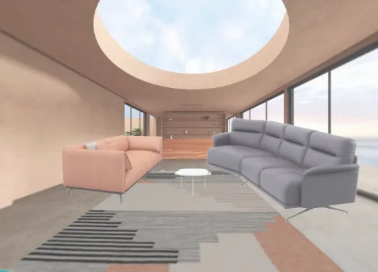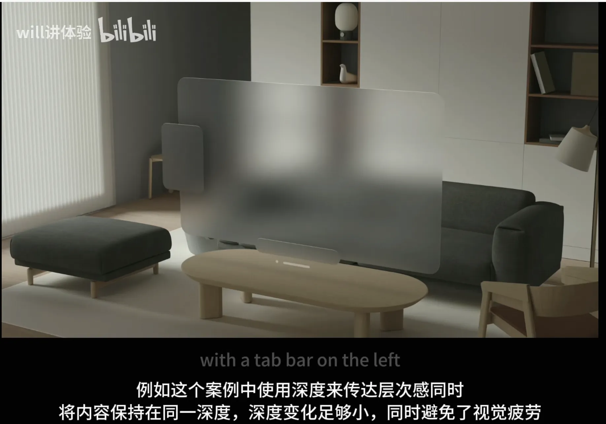

阴影是视觉真实感的关键组成部分，它直接关系到人对场景的深度感知和空间定位。丢弃物体的阴影将会给观察者带来强烈的**悬空感**和**不真实感**。近几个月苹果新推出的 VR 设备 vision pro 就通过为 UI 在真实世界生成投影，来提示用户 UI 的空间位置，并使得虚拟UI更好地与现实世界相融合。

然而，实时阴影渲染技术面临着巨大的技术挑战。考虑到用户体验和技术的实用性，我们需要在有限的计算资源下，平衡**渲染质量**与**性能开销**（一般来说，显示器的刷新率为60Hz，这就要求引擎在16.7ms内完成计算和渲染）。

本文将介绍一些常用的阴影生成技术。首先，本文会介绍一些相关的基础概念，以帮助大家更好地理解文章内容；然后，会循序渐进地介绍一些实时渲染中常用的阴影渲染技术；最后，会通过一个经典算法的代码实现，来加深大家对算法的理解。

本文仅探讨实时生成阴影的算法，并不涵盖实时光线追踪等用于模拟全局光照效果的高级技术。而且，即便这些高级技术可以生成更加真实的效果，受硬件资源和设备兼容性的限制（特别是移动端）大多数游戏仍然依赖于经典的、效率更高的阴影生成技术。

# 基础概念
## 阴影
+ **硬阴影：**阴影边缘非常清晰和锐利的阴影。
+ **软阴影：**阴影边缘具有一定程度的模糊和渐变的阴影。
+ **全影（Umbra）**: 阴影的最暗部分，其中遮挡物体完全阻挡了光源的光线。在这个区域内，观察者无法看到任何来自光源的直接光线。
+ **半影（Penumbra**）: 阴影的过渡部分，其中遮挡物体只阻挡了光源的一部分光线。半影区产生了柔和的阴影边缘，光线强度从阴影区（Umbra）到非阴影区域逐渐增强。
+ **自投阴影**（Self-Shadowing）：物体的一部分遮挡了光源到该物体其他部分的光线，使得物体自身的一部分在另一部分上投影出阴影。

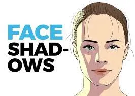

## 纹理/贴图
可以简单理解为一张 2D 图片。（也有3D的）

根本目的：定义物体任意一个点的属性。

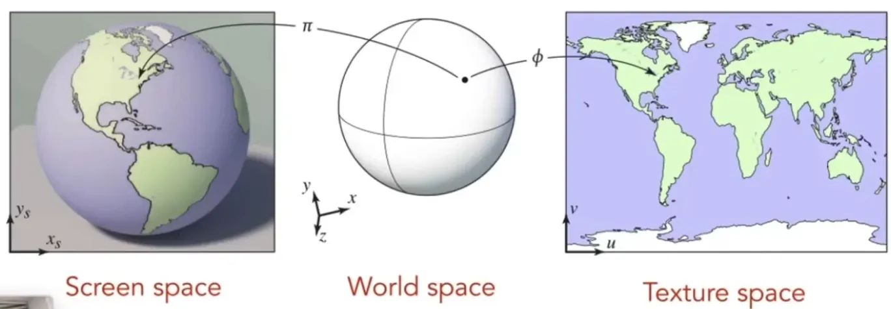

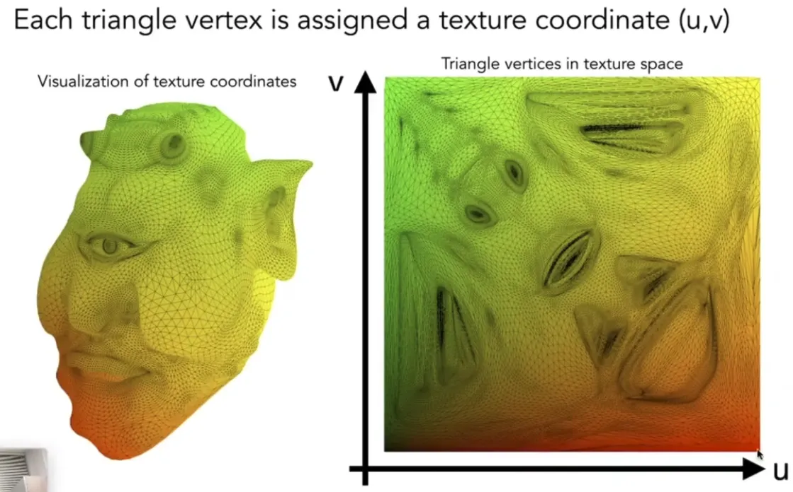

## 栅格化
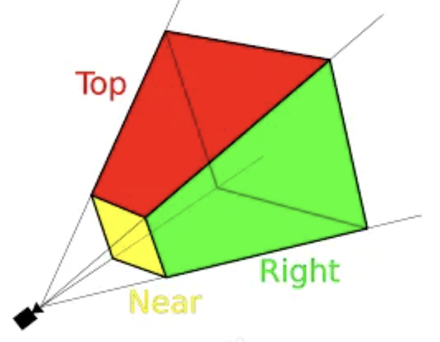

从相机向场景看去，形成一个视锥。视锥又被 近平面 和 远平面 截断，只有中间有颜色的空间中的物体才可以被相机看到。特别地，图中黄色的近平面就是我们的屏幕。空间中所有的物体会沿相机方向被“挤压”、“拍扁”到近平面上，这个“挤压“的过程被称为“投影”。

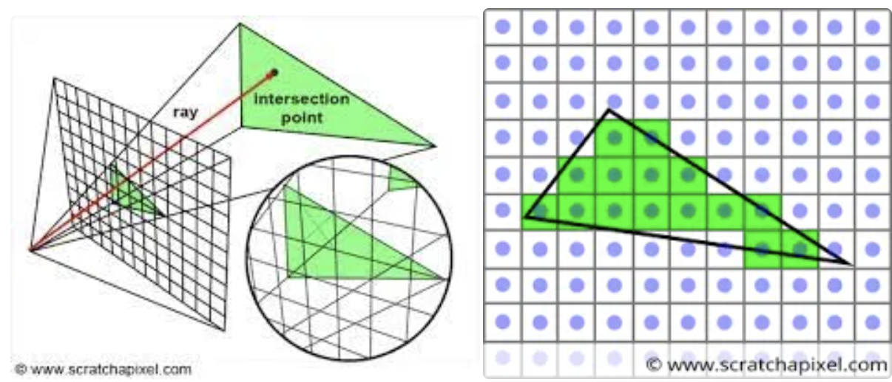

场景中的物体被拍扁投影到屏幕上，将图形以离散的方式存储下来。图中，空间中的三角体被投影到了屏幕，屏幕对应的像素点记录了相应的颜色信息。

## 采样与走样
采样，带来走样

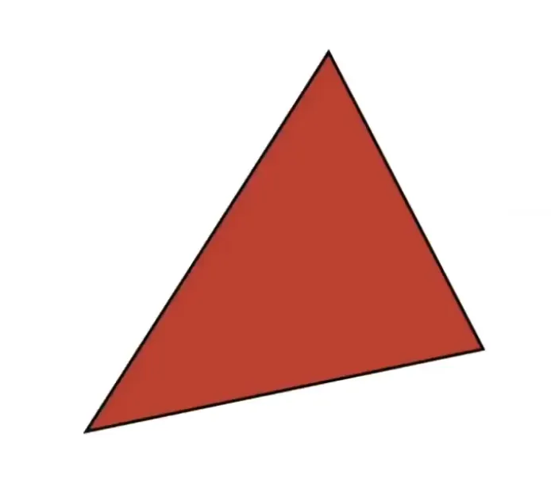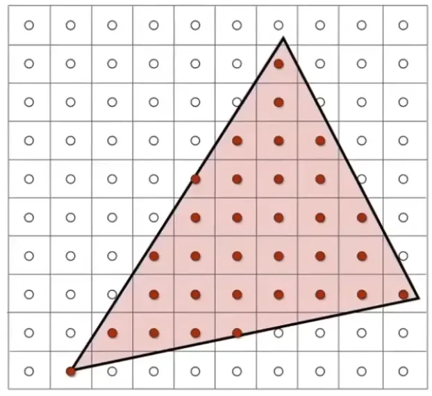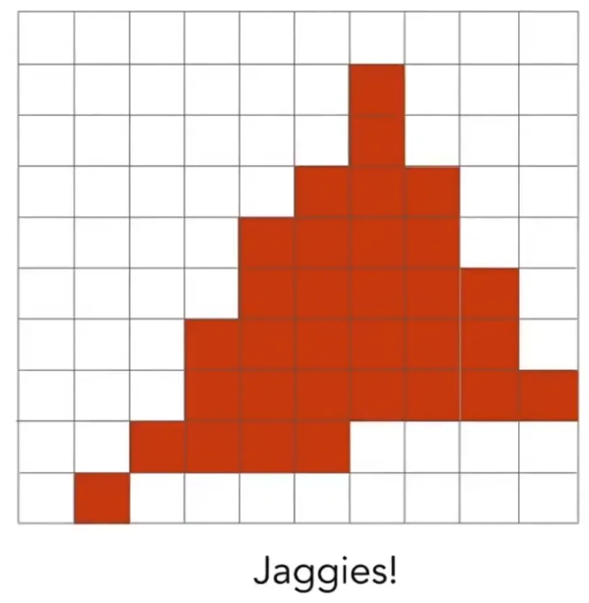

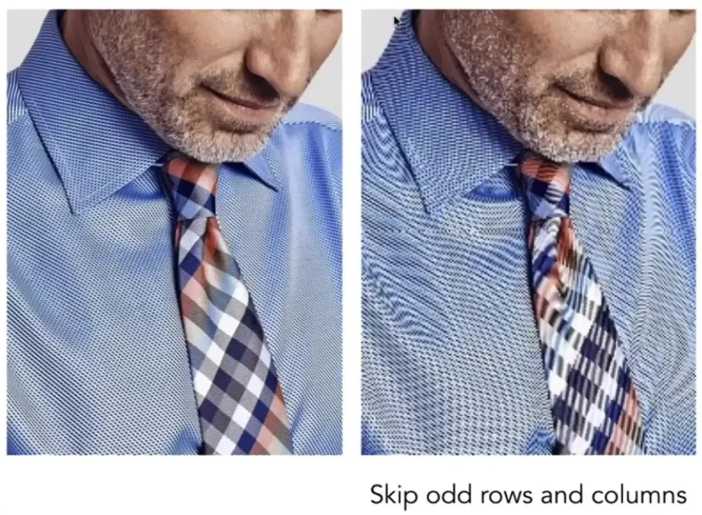

# 实时阴影渲染技术
## 一些简单技术
**没有阴影**：早期的游戏中，是没有阴影的。（精灵宝可梦红绿、金银）

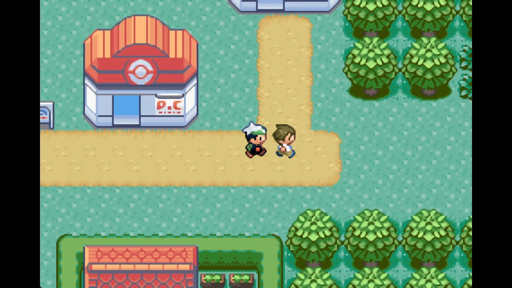

随着硬件的发展，尤其是自从任天堂推出了更先进的掌上游戏机，如Game Boy Advance和后来的任天堂DS，游戏中开始出现更为复杂的图形和效果，包括基本的阴影效果。

****

**静态阴影**：2002年发行的《精灵宝可梦 红宝石·蓝宝石》（Pokemon Ruby and Sapphire）版本在Game Boy Advance上就提供了更为丰富的图形表现，包括角色和物体的静态阴影。角色和某些物体通常带有一个固定在其下方的简单黑色或灰色图案，模拟阴影效果。图案通过更简单的2D图像处理和图层叠加来实现，不会根据光源位置变化而变化，也不会投射到其他物体上。

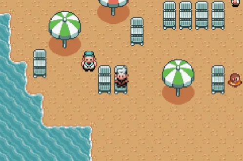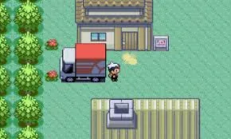

**阴影动画**：为了增加阴影的动态感，有时开发者会采用一个事先做好的阴影动画，放在人物脚底。比椭圆要精致许多。在部分PS2时代的游戏当中可以看到。  

**阴影烘焙**（shadow baking）：阴影烘焙是一种经常使用的技术，它会预先渲染场景光照和阴影，然后将这些信息存储在纹理贴图中。这种技术尤其适合**静态场景**，即那些场景和光源位置固定不变的游戏，可以在不牺牲视觉效果的同时减轻实时渲染的性能负担。在守望先锋、刺客信条等大量现代游戏中被广泛使用。

+ 阴影烘焙到 light map：预烘焙的Lightmap的ShadowMask，将阴影烘焙到每个物体的LightMap的Alpha通道上，作为ShadowMask，渲染时采样Lightmap，然后根据距离和近景动态的实时阴影进行混合。
    - 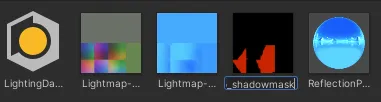
+ 阴影烘焙到物体 texture：许多游戏也用这种技术来实现物体自阴影效果（物体自己各个部分互相遮挡，带来的自身投射到自身的阴影），如著名的魔兽世界
+ 。。。。

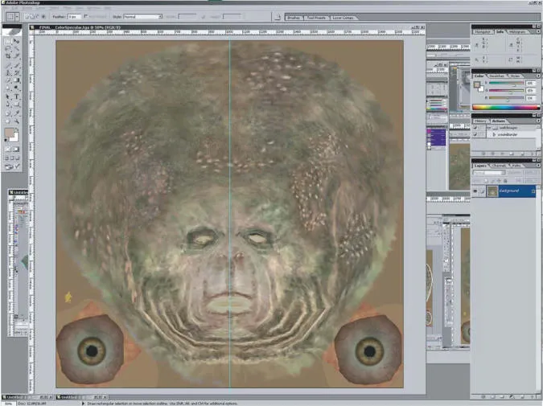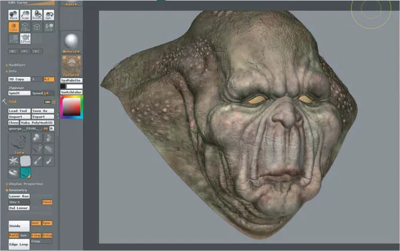

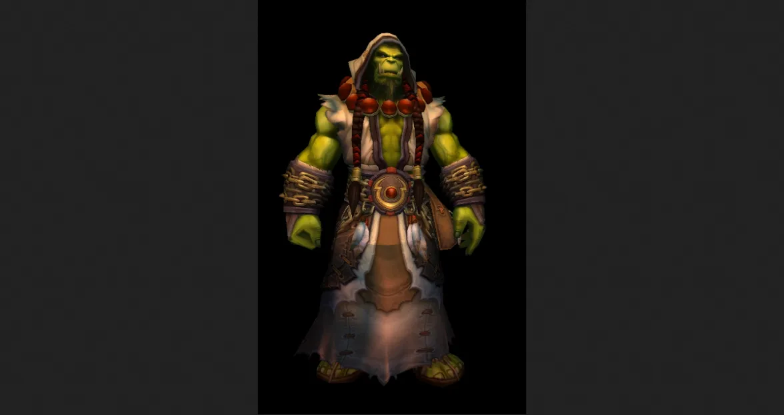

## 平面阴影（Planar Shadow）
### **背景**
无论是静态阴影还是动态阴影，阴影都不受光源、人物动作影响。不是渲染出来的，只是简单的模拟。

### 核心思想
比静态阴影中的小圆盘更复杂一点的阴影技术叫做平面阴影。平面阴影基于一个简单的观察：物体在平面上的投影还是能够清晰地保持自身的轮廓，就好像模型被压扁在平面上了。

### 算法流程
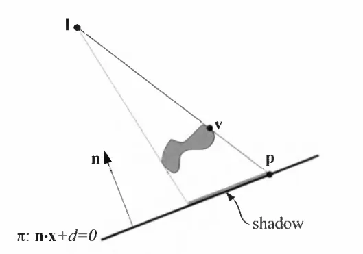

### **效果**
代表游戏：王者荣耀。

可能会用到从脚部到头部的阴影的半透明过渡。

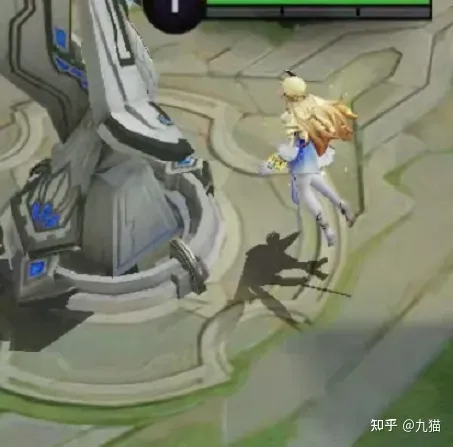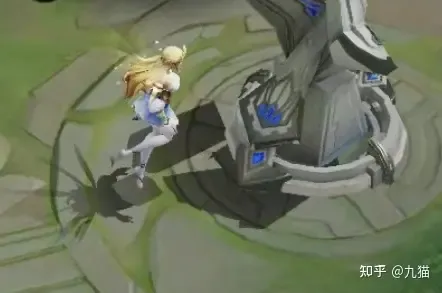

### **优点**
1. 实现简单
2. 性能消耗低
3. 兼容各种垃圾手机型号，不会出现卡爆机器的问题

### 缺点
1. 硬阴影
2. 遇到地面上的任何一点凹凸不平都会把影子卡掉
3. z-fighting （通过控制渲染顺序或抬高阴影来解决）
4. 半透明叠加问题（半透明叠加通过 stencil buffer 来解决）
5. 和其他角色以及场景烘焙的影子无法融合

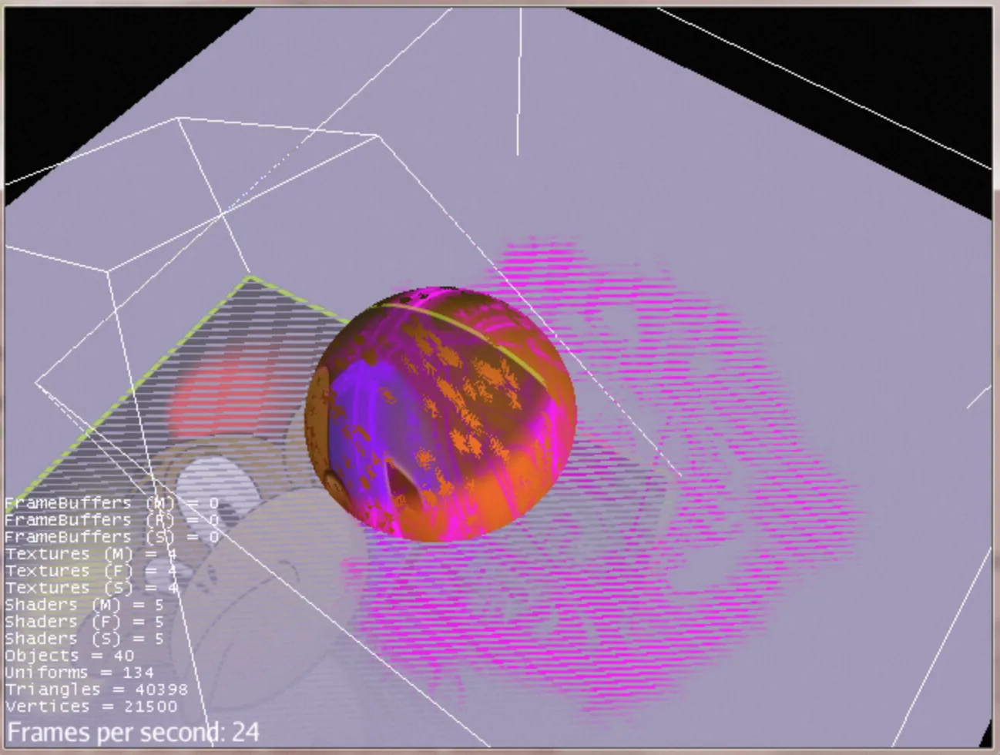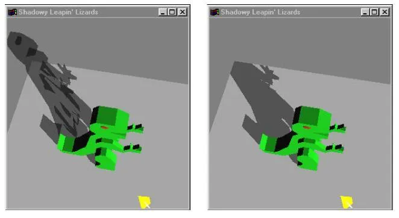

## 阴影体（Shadow Volume）
Shadow Volume 由Frank Crow在1977年提出，是个比较古老的技术，虽然现在已经鲜有游戏使用。

### **核心思想**
在三维空间中构建一个由物体相对于光源的位置生成的虚拟体积（Shadow Volume），即图中的绿色区域（绿色体积内的点都看不到光）。

然后假设 Volume 内（绿色区域）的点都不可以被光照到；Volume 之外（白色区域）的点可以被光照到。

所以问题的关键是，如何判断一个点是否位于阴影体内部。

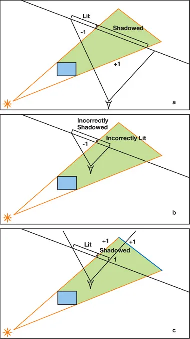

### 算法流程
#### Z-Pass
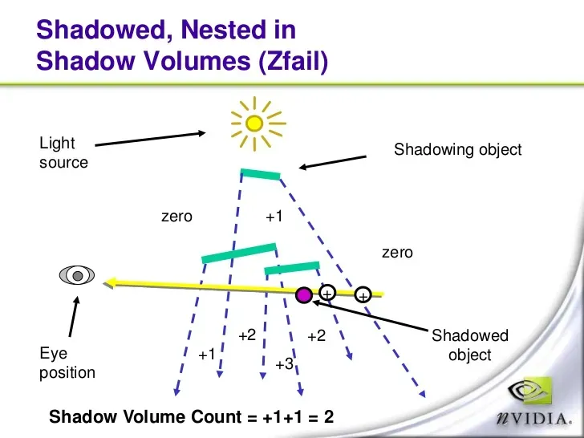

1. 屏幕上任一点发射一条线段
2. 线段每进入一个阴影体，就让交点数+1，反之离开一个阴影体，就让交点数-1
3. 如果最终所有交点数（Shadow Volume Count）为0，则表示当前点位于阴影体之外，若交点数大于0，则表示当前点位于阴影体内。

#### Z-Fail
Z-Pass 基于一个假设：摄像机本身是位于阴影体外的，但实际情况往往并非如此。

不同于ZPass的算法，这次线段发射的起点位于距离摄像机无限远处（保证这个点一定是位于阴影体外的），然后我们每次遇到阴影体背面，就让Stencil Value +1，遇到阴影体正面，就让Stencil Value-1，其他设定均不变。

### 效果
荒野大镖客

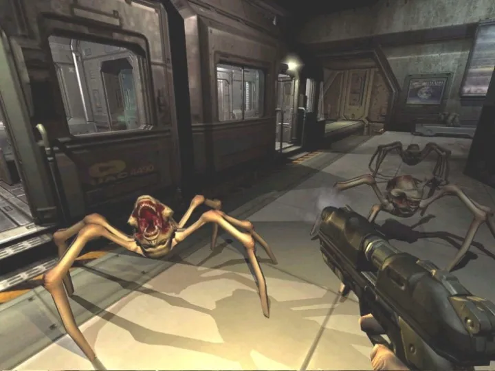

### 优点
1. 没有shadow map的采样问题。能够产生非常精确的阴影边缘
2. 对于静态场景和动态光源，或者动态物体和静态光源都同样适用。
3. 在一些不需要太多投影对象的场景，投影距离较近或者硬阴影时Shadow Volume会比ShadowMap更合适ShadowMap要做到高精度需要较大分辨率才能保证阴影的锯齿感不明显。

### 缺点
硬阴影

需要大量的几何计算，尤其是在场景中有许多复杂物体时，以及无法处理软阴影或半透明阴影效果。

## 现代阴影技术基础：Shadow Map
### 背景
栅格化

场景中的物体被拍扁投影到屏幕上，将图形以离散的方式存储下来。图中，空间中的三角体被投影到了屏幕，屏幕对应的像素点记录了相应的颜色信息。

### 核心思想
如果一个像素点不在阴影中，那么它必须**同时被灯光和相机**看到。

利用栅格化来做阴影。

### 算法流程
如何做？渲染两趟

原始场景（没有阴影）：

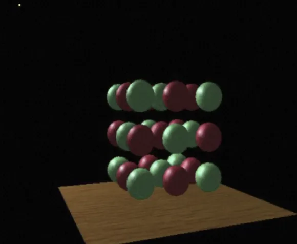

第一趟：从光源处看，生成一个图。不做着色，只记录深度。（记录被光看到的点）

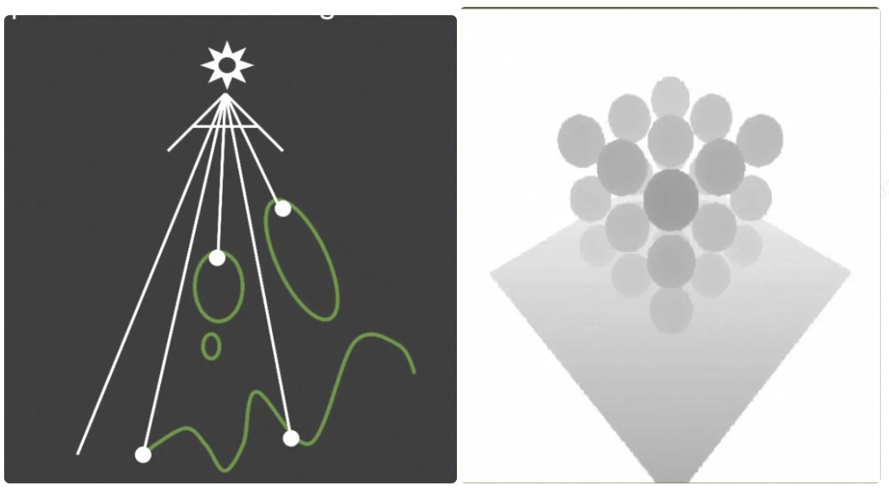

第二趟：从摄像机处看。对于看到的每一个点，投影回光源，可以得到该点对应在深度图里的像素位置。对比该点的深度和深度图里记录的深度，如果深度相同，这个点就可以被看到，不在阴影中；否则，在阴影中。（被相机看到的点，是否被光看到）

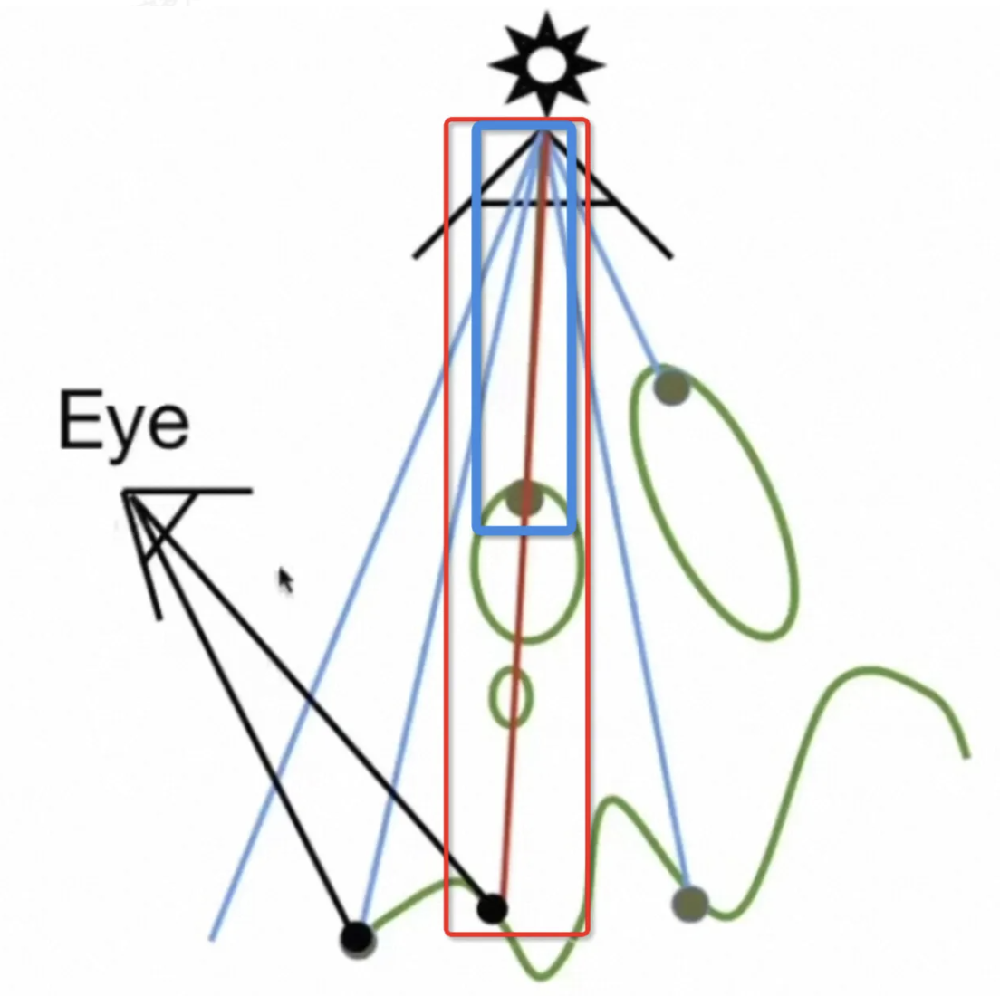

关键点：Shadow Map 记录了光到场景的最小深度。借助Shadow Map，场景在渲染时，每个着色点就可以根据距离来判断自己是否被遮住，进而选择保持原色或涂黑。

### **效果**
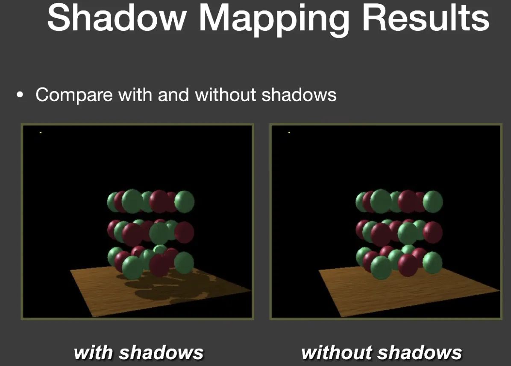

### 优点
最常用的方法

1. 用于任何大小和形状的物体，包括动态物体和静态场景
2. 大型场景下，shadow mapping通常比 Shadow Volumes 等其他高级方法更加高效
3. 不需要知道场景的几何信息
4. 可扩展到软阴影
5. 可以与其他技术（如级联阴影映射Cascaded Shadow Maps）结合，以支持大范围场景的高质量阴影

### 缺点
1. self occlusion（自遮挡）/ self-shadowed（自阴影）/ shadow acne（阴影暗斑、阴影失真） 问题。
    1. 问题：shadow map 是有分辨率的。在一个像素内部，深度是一个固定值。这会导致自遮挡（self occlusion）或者说 Shadow acne 问题。图中，人的眼睛望向一个平面。shadow map 认为 眼睛看到的点到光源的距离 是 黄色平面到光源的距离；而实际渲染时会发现实际距离大于shadow map的值。这就使得本来平整的地面出现了阴影。这个问题就是自遮挡问题。从上往下照时，问题最小；几乎平行照向地面时问题最大。
        1. 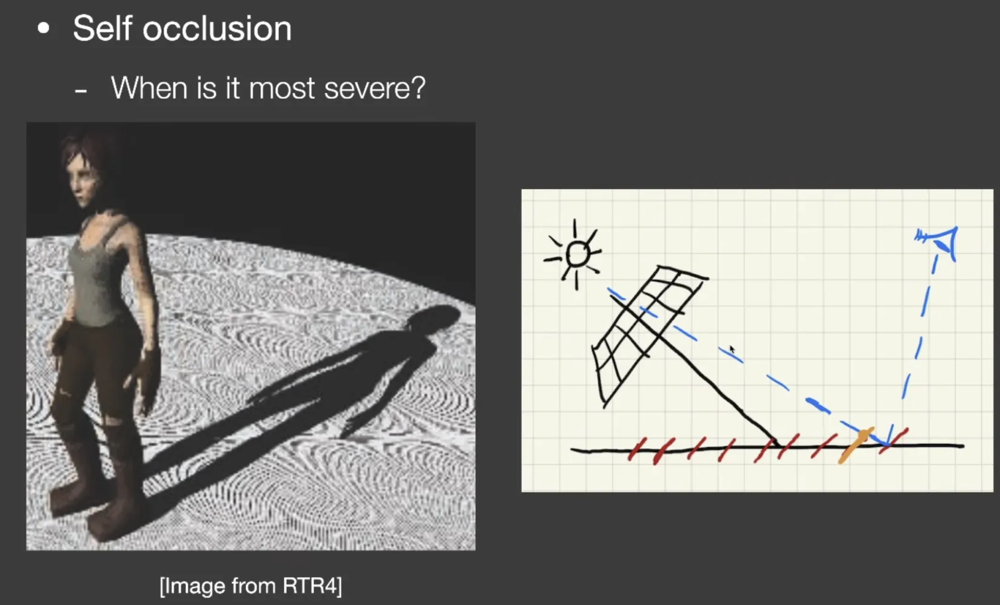
        2. 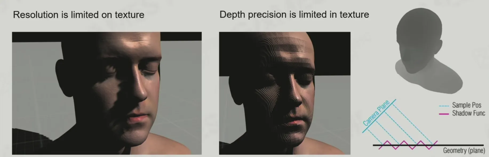
    2. 解决方法：
        1. Bias，bias 甚至可以随着光照角度的变化而变化。但是Bias过大时会产生丢失影子的问题。下图中，角色的脚与影子分离了，工业界也称为 peter panning (阴影悬浮)。虽然有一些问题，但工业界一般就采用这一增加bias的方法。本文后续的编程实战中也采用了这一方法。
            1. 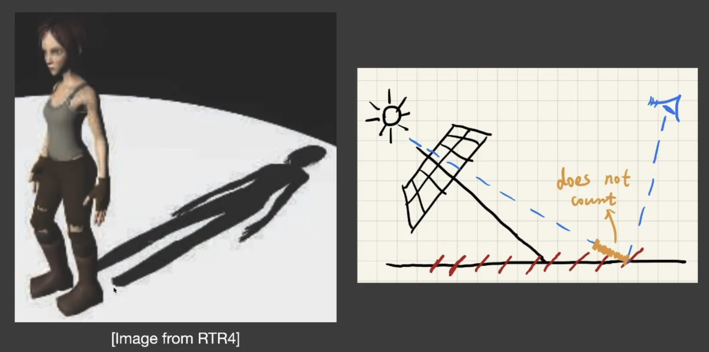
        2. Normal Bias。将 Normal Bias 值设置得太高会使阴影对于游戏对象来说太窄：
            1. 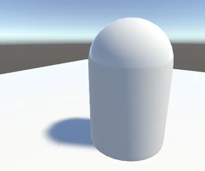
        3. Shadow pancaking
            1. 该技术旨在减少沿光照方向渲染阴影贴图时使用的光照空间范围。本质是提高阴影贴图的精度，减少阴影暗斑。
            2. 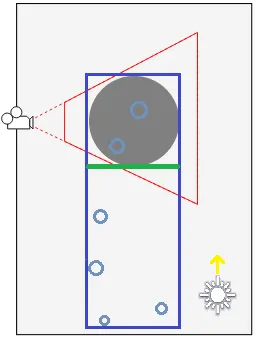
2. 数值精度导致边缘脏。一个像素包含很多点，不同点实际深度不同，而浮点和浮点判断相等是一个非常困难的事情。
3. 只支持点光源
4. aliasing（走样）。Shadow map 的分辨率是个问题
    1. 问题：太小可能会导致锯齿（远距离需要大分辨率），太大浪费存储空间计算能力，且会产生自遮挡问题（近距离需要大分辨率）
    2. 解决方案：
        1. 中远距离： CSM
        2. 远距离： DFSM
        3. 近距离： Contact Shadow （AO，环境光遮蔽）
        4. 支持大分辨率：VSM
5. 生成的是硬阴影
    1. 问题：不够真实
        1. 硬：
            1. 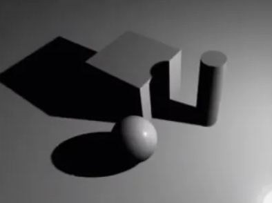
        2. 软：
            1. 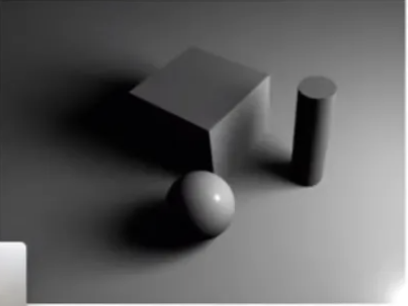
    2. 解决方案：
        1. PCSS、VSM、MSM

## 软阴影：PCSS => VSM、MSM
### 背景
传统的shadow map只支持点光源和直接光源，点光源生成硬阴影。 为了实现面光源的软阴影，可以将面光源视为点光源来生成shadow map，再利用**PCSS（Percentage Closer Soft Shadows）**来生成软阴影。

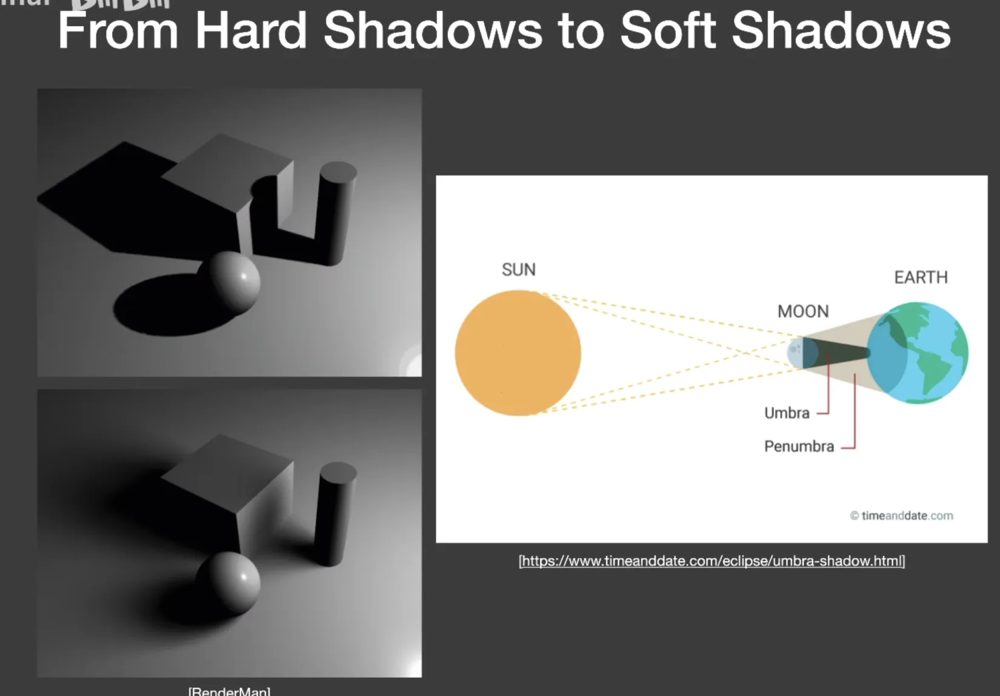

### 核心思想
PCF（Percentage Closer Filtering，百分比渐近滤波） + 一个适应性的 filtering size

PCF最初被提出来不是做阴影，而是做抗锯齿。而PCSS用PCF来做阴影。

PCF核心思想：不是先filter再compare，而是先compare再filter

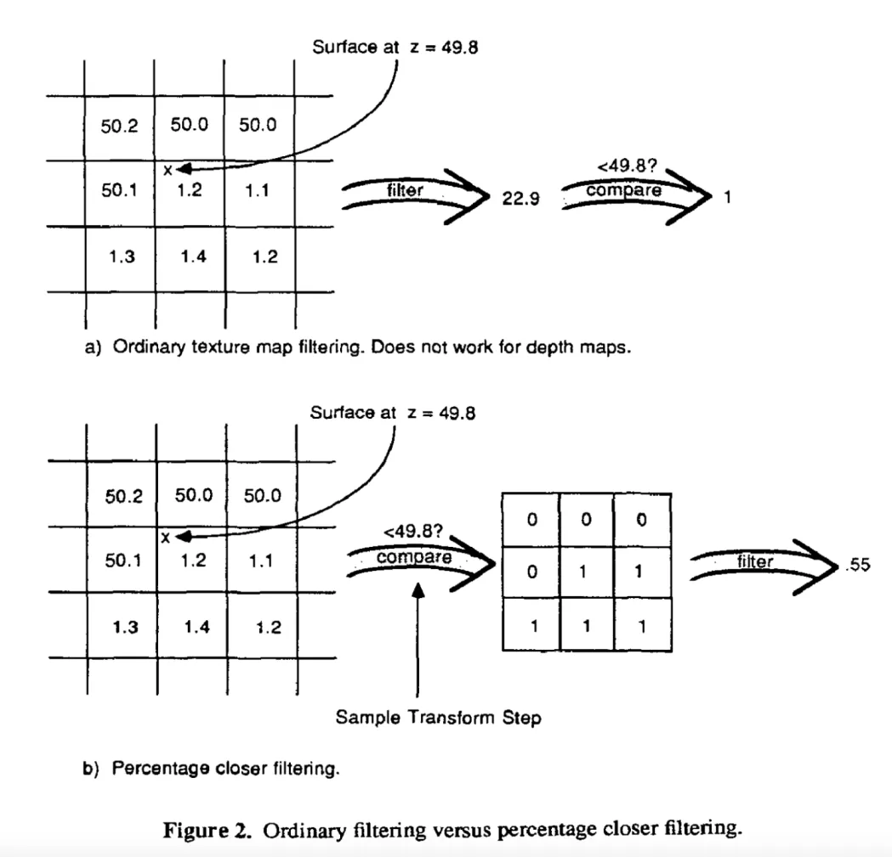

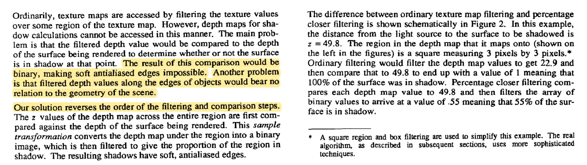

简单来说，不是找shadow map中的一个像素来做深度比较，而是在shadow map中找一个区域（一般为7*7区域）的像素的来做深度比较。比较之后，取均值。

### 算法流程
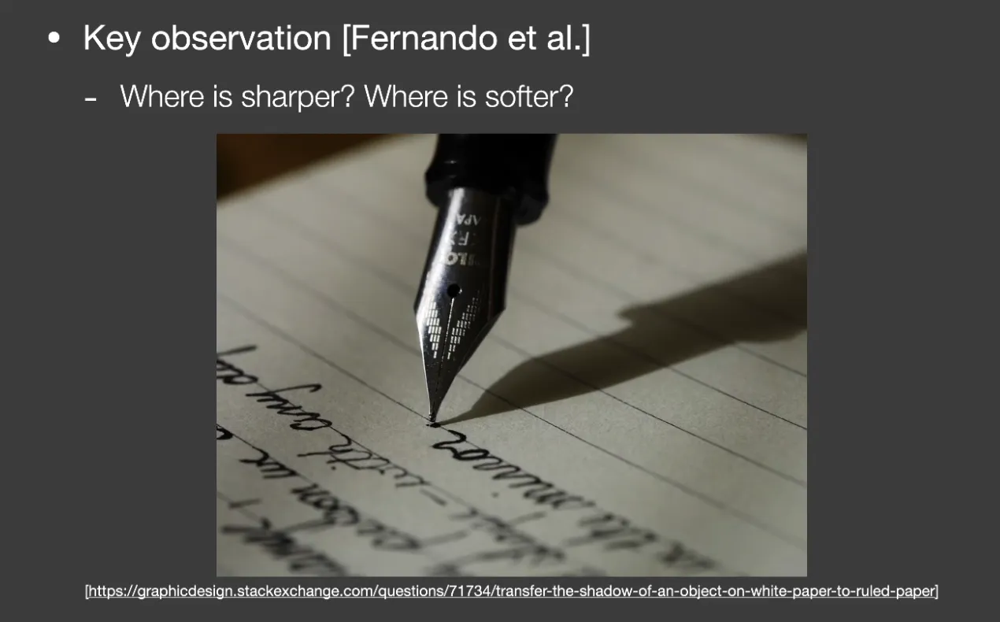

在讲算法流程前，先考虑一个问题：阴影在什么地方硬，在什么地方软？

观察：阴影的接受物（纸）到阴影的投射物（笔）距离越近，阴影越硬。笔尖硬，越远越软。

结论：不同地方采用不同大小的filtering size。blocker distance 小的地方采用小的filtering size。利用相似三角形来确定filtering size （半影范围）。

PCF结合这一观察，就得到了最终算法流程：

1. Step 1: Blocker search (getting the average blocker depth in a certain region)
    1. 求n*n范围内遮挡物的平均深度，非遮挡物直接忽略不用来求平均。
    2. 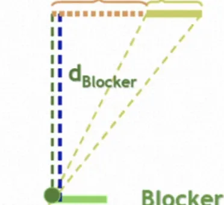
2. Step 2: Penumbra estimation (use the average blocker depth to determine filter size)
    1. 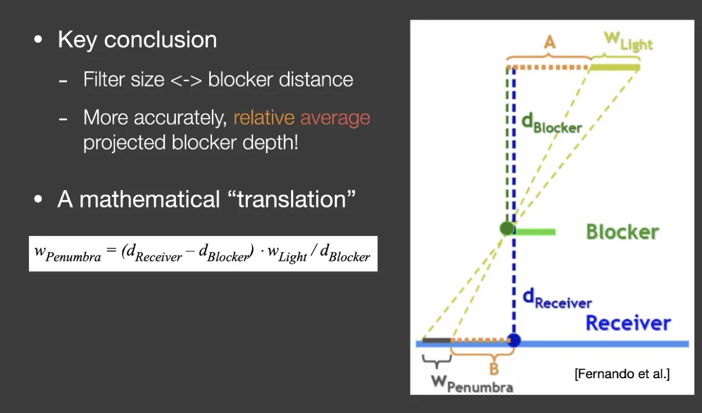
3. Step 3: Percentage Closer Filtering
    1. 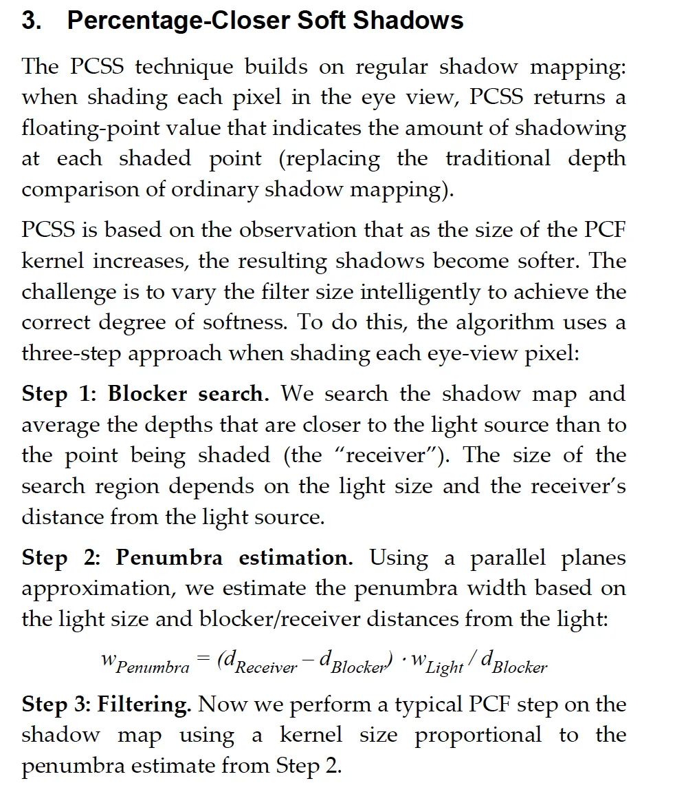

### 效果
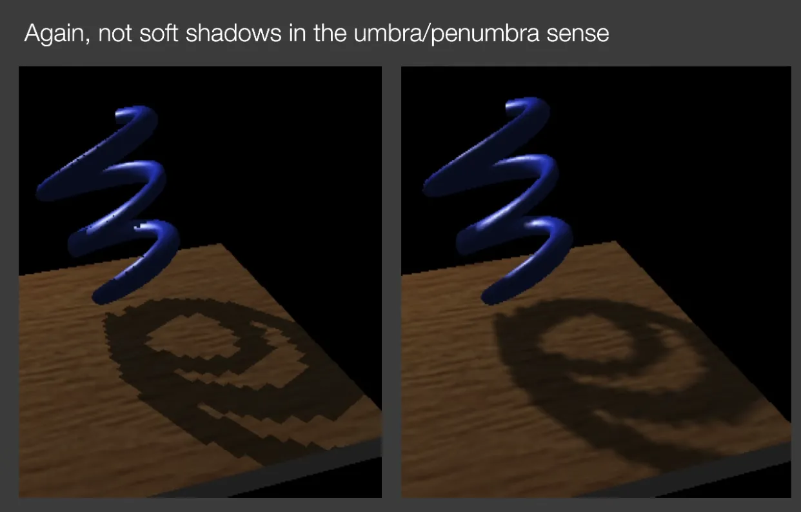

### 其他问题
+ Which region to perform blocker search?
    - Method1: Can be set constant (e.g. 5x5), but can be better with heuristics
    - Method2: Depends on the light size, and reviever's distance from the light.

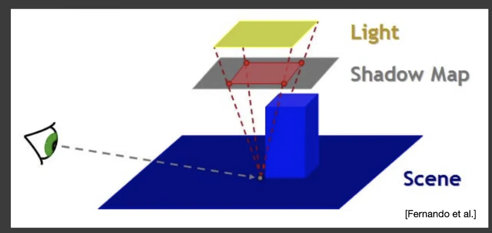

### **优点**
模拟了软阴影

### 缺点
开销非常大

### 其他相关算法
#### Variance soft shadow mapping (VSM 或 VSSM)
**目的**：加速 PCSS 的步骤1和步骤2。相比 PCSS，VSSM 提供了更快的 blocker search 和 filtering。

**核心不等式**：切比雪夫不等式

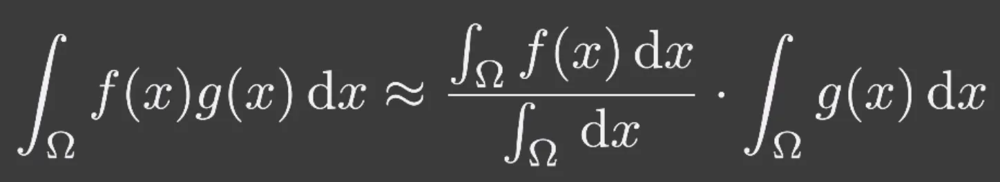

**核心思想**：避免效率低下的采样过程，利用单次范围查询代替多次点查询，以加速 Blocker search 和 PCF。

#### Moment shadow mapping （MSM）
+ 解决的问题：VSSM 中，有时不能假设为正态分布。
+ 解决方式：用高阶矩（一般前4阶）来表示分布。VSSM 是用的前二阶矩（均值和方差）来表示分布。
    - 牵扯到一个复杂计算：给定前四阶矩，如何生成 PDF 函数

#### **Virtual Shadow Mapping（VSM ）+ SMRT**
+ 背景：SMRT是UE5的VSM使用的阴影采样算法，
+ 解决的问题：在VSM中使用SMRT能生成更为真实的柔和阴影和接触硬阴影。
    - 之前UE4使用的PCF不仅不能实现远软近硬的阴影，而且会减少高精度几何体投射阴影的细节，在需要近距离清晰阴影的情况下的阴影效果往往过于模糊。
    - SMRT 用于替代传统阴影渲染中的PCF(Percentage Closer Filtering)/PCSS(Percentage Closer Soft Shadow)，使得物体投射的远处阴影比近处阴影拥有更柔和的效果，更加符合现实的物理效果。
+ 解决方式：SMRT算法的工作原理是在屏幕中每个像素对应的位置大致向着光源方向按照一定的范围均匀发射多条射线来做阴影遮挡检测的判断，不过它并不像传统的光线追踪一样计算光线与几何体的相交点，而是通过在每条射线上步进采样一定数量的点并结合shadowmap上采样到的最近深度值来判断该射线是否撞击到障碍物，根据撞击到障碍物的射线数量来计算软阴影的值，显然相比之前的PCF采样方法这种做法更加Physically based，可实现远软近硬的阴影效果。以往的PCF只是在shadowmap上当前点的周围以相同的filter size均匀采样一些深度做比较，而SMRT改为由光线追踪的方式在shadowmap上不同的filter size范围采样。

## 中远距离阴影：Cascaded Shadow Map （CSM，级联阴影）
### 背景
Shadow Map 存在走样问题

### 核心思想
CSM的实现方式是将最高分辨率的阴影贴图用于最靠近摄像机的区域，因为这部分区域的细节最需要被捕捉。随着离摄像机距离的增加，使用更低分辨率的阴影贴图，因为在远处的细节不需要那么精确。这样既保证了近处阴影的质量，又优化了远处阴影的性能。

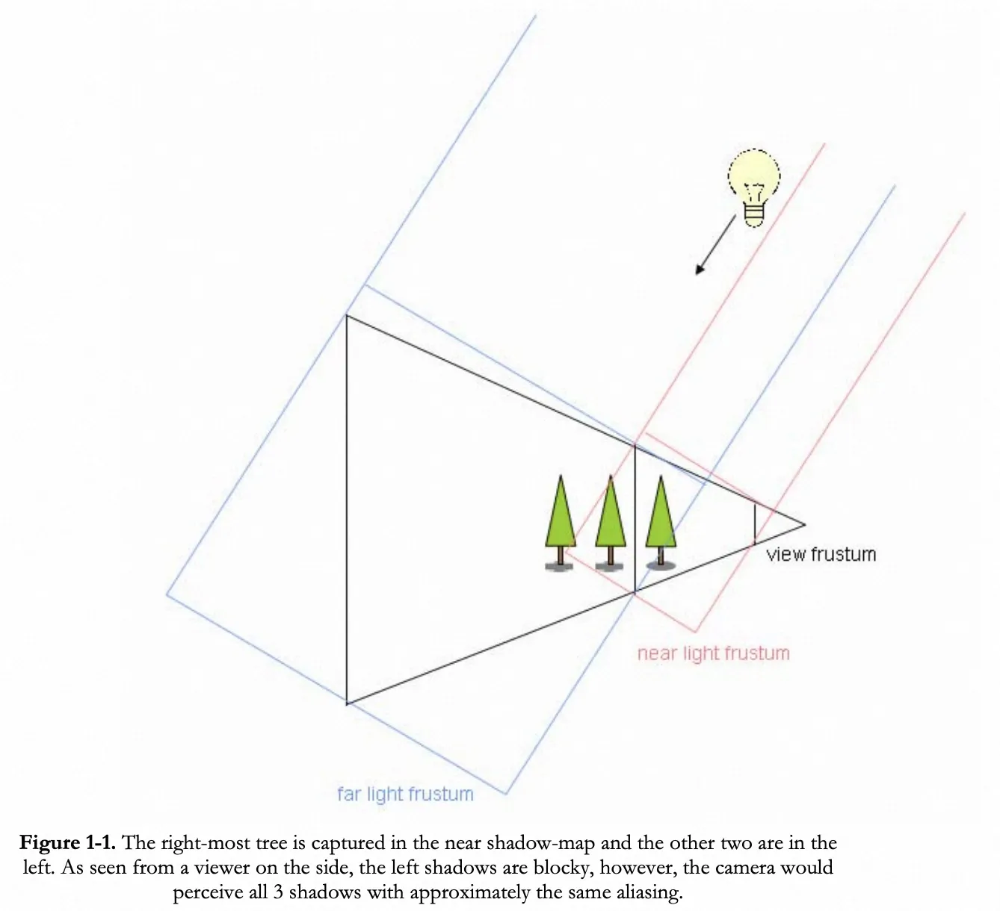

### 算法流程
### 效果
刺客信条奥德赛使用了4级的CSM渲染近景的阴影，使用了两张ShadowMap渲染远处的阴影，一张远景和一张超远景。远景只有地形、石头，超远景就只有地形简模了。

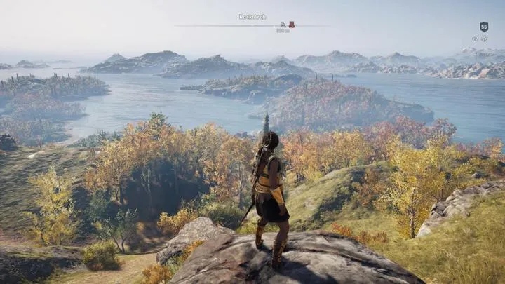

原神使用了8级CSM

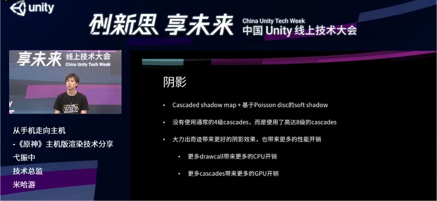


### 优点
1. 性能与质量平衡：CSM通过将视野划分为几个不同的阴影贴图（级联），每个级联用不同分辨率的阴影贴图，可以在接近摄像机的地方提供高质量的阴影，同时保持远处阴影的性能。
2. 广泛支持：CSM被广泛支持并在许多现代游戏引擎中实现，因为它是一个成熟的、经过时间验证的解决方案。
3. 调整灵活：开发者可以根据需要调整各个级联的数量、大小和过渡区域，以实现所需的性能和视觉质量的平衡。
4. 无需预计算：与静态阴影解决方案（如光照贴图）不同，CSM为动态光照环境提供实时阴影，不需要预计算。

### 缺点
1. 过渡区域问题：不同级联之间的阴影可能在过渡区域内产生可见的不连续性，需要通过调整和优化来减轻这个问题。
2. 过远阴影可能失去细节变模糊，过近的shadow map分辨率还是不够。
3. 内存和带宽消耗：更多的级联意味着更多的阴影贴图需要被处理和存储，这可能会增加内存使用和带宽消耗。
4. 泛光和过滤问题：CSM需要仔细调整过滤方法来避免泛光（光晕）和硬边缘，特别是在低分辨率的阴影级联中。

## 远距离阴影：Distance Field Shadow Map 
### 背景
在远处物体的阴影渲染中，传统的阴影贴图（Shadow Maps）可能会因为分辨率限制导致阴影失真或模糊。而距离场阴影映射不依赖于传统阴影贴图的分辨率，因此能够在远距离保持阴影的一致性和清晰度。此外，距离场阴影映射也支持软阴影效果，可以根据物体与光源的距离平滑地过渡阴影边缘。 

在Unreal Engine中，距离场阴影映射被用来增强静态和动态物体的远处阴影效果。由于其较高的性能和质量，这种技术尤其适合于大型开放世界游戏中，其中需要对大面积的地形和物体投射阴影。不过，它需要额外的预处理阶段来生成所需的距离场数据，这在某些情况下可能会增加资源消耗。

### 相关工作
#### SDF
为什么用SDF？

优点1：方便做运动边界的 blending

第二行SDF只看距离为0的地方，令其为边界，不会出现第一行边界模糊的情况。


优点2：方便做任意形状的blending，无需额外考虑形状间的拓扑关系


Mainly two usages:

1. Ray marching
2. Distance field soft shadows

#### Ray marching
+ Ray marching (sphere tracing) to perform ray-SDF intersection。
    - Ray marching: 用光线追踪去追踪距离场，然后看光线会打到哪个物体表面
+ The value of SDF== a "safe" distance around
    - SDF定义了一个“安全距离”。从一点出发，只要不超过这个安全距离，就不会与任何物体发生碰撞。
    - 每次走安全距离长度的步数，然后继续根据新的安全距离做 marching。
    - Therefore, each time at p, just travel SDF(p) distance。

### 算法流程


ray marching

Use SDF to determine the (approx.) percentage of occlusion 不准的

Smaller "safe" angle <-> less visibility 安全角度越小，该着色点越暗；安全角度越大，该着色点越亮。安全角度为0时，该着色点完全处于阴影中。

### 优点
1. Fast
    1. 方便的地与 ray marching 过程结合
    2. 忽略距离场的生成的时间，比传统 shadow map 快。考虑的话其实速度差不多。
2. High Quality
    1. 但比 PCSS 效果要差

### 缺点
1. Need precomputation 预计算距离场
2. Need heavy storage 存储距离场
    1. 可以利用八叉树KD树等数据结构，来忽略没有物体的空间
3. Artifact

## 近距离阴影：Contact Shadow (SSAO=>HBAO、SSDO、DFAO)
### 背景
### **核心思想**
### **算法流程**


### **效果**


### **优点**
### **缺点**
### **其他相关算法**
## 反射阴影：SSR（Screen Space Reflection）
### 背景
### 核心思想
### 算法流程
### 效果


### 优点
### 缺点


## 高分辨率：Virtual Shadow Maps（VSM，虚拟阴影贴图）
### 背景
UE5 引入

### 核心思想
### 算法流程
### 效果


### 优点
### **缺点**
### **工程注意事项**
## Ray Traced Shadow
光线追踪自然可以生成阴影

后续编程实战中会写一个最简单的 ray marching + shadow 的实现：

Unity 的 ray traced shadow 中是在屏幕空间做 ray tracing。相当于UE5中的Ray Traced Ambient Occlusion？ [https://docs.unity3d.com/Packages/com.unity.render-pipelines.high-definition@14.0/manual/Ray-Traced-Shadows.html](https://docs.unity3d.com/Packages/com.unity.render-pipelines.high-definition@14.0/manual/Ray-Traced-Shadows.html)

# 在淘宝中的应用
淘宝中采用了多种阴影技术。

1. 场景介绍
    1. 光照
        1. 会布置一个环境光，偶尔也会布置点光源来强调氛围
    2. 模型
        1. GLB 模型
        2. 白底图
        3. 全景图
        4. 。。。

2. GLB 模型：
    1. 近距离阴影（自阴影）：
        1. 离线预处理：给定环境光下烘焙  或 图生3D天然产生 出带自阴影的问题。通过可微渲染将 Vray材质转化为Web 3D引擎可用的PBR-材质，确保离线和实施渲染的效果一致性。
        2. 实时：根据布置的环境光和点光源，做PBR渲染，实时计算
    2. 中距离阴影（地面投影）
        1. 之前用 shadow map，再类似王者荣耀做下透明度渐变
        2. 现在用 PCSS


3. 白底图billboard：
    1. 近距离阴影：
        1. 不考虑
    2. 中距离阴影（地面投影）
        1. 参考photoshop的方案，类似平面阴影，但是是在shader里做
        2. 此外，一些商家上传的可能是斜着看的视图，家具底面非水平。此时需要通过图像算法获取到 家具底边的倾斜角度，然后在shader里进行平面阴影计算


4. 全景图层
    1. 近距离阴影（自阴影）：烘焙。-
    2. 中距离阴影：烘焙。将物体放在全透明房间里做烘焙，渲染全景图。


5. 。。。。

出于性能考虑，大都不考虑物体之间的遮挡问题。

最后，为了确保照片级渲染质量，产品支持点击进行快速的离线渲染。5s内就可以出现一张极其真实的、考虑到遮挡关系、光照、材质等所有因素的效果图


# 编程实战 - Shadowmap
源码：[web3d-demos/src/app/gallery/(demos)/shadow-mapping/render.ts at main · VirusPC/web3d-demos](https://github.com/VirusPC/web3d-demos/blob/main/src/app/gallery/(demos)/shadow-mapping/render.ts)

在线网址：[https://web3d-demos.vercel.app/gallery/shadow-mapping](https://web3d-demos.vercel.app/gallery/shadow-mapping)

Pass 1，从光源处渲染场景，得到 shadow map。


2. Pass 2: 结合 shadow map（u_projectedTexture）渲染场景
    1. 深度图对蓝色距离
    2. u_projectedTexture的z对应红色距离，(x, y)用于定位深度图的像素


# 总结
为了在有限的时间和资源内计算出相对准确的光和影，几十年来无数科学家和工程师们前仆后继地做出了大量工作，这里只是列了大量工作中的一小部分：

1. 静态阴影、阴影动画是最简单的形式，简单且性能和平台兼容性最好，适合简单的小应用
2. 通过预先烘焙阴影信息，可以降低实时渲染压力
3. 平面阴影低端机友好，简单性能高，适合在平面地面上用
4. 阴影体不常用，但在一些不需要太多投影对象的场景，投影距离较近或者硬阴影时Shadow Volume会比 Shadow Map 更合适。
5. Shadow Map 是实时渲染中常用的一种思想
6. VSM 解决了大分辨率 Shadow Map 的存储问题
7. CSM 一般用于中远距离，解决 Shadow Map 走样问题
8. DFSM 可以用于远景，解决远处的采样，适合大范围开放场景。
9. Contact Shadow 一般用于近景，解决近景 shadow map分辨率不足的问题
10. PCSS、VSM、MSM 可以用于绘制软阴影
11. 实际开发中，往往会同时应用各种全局光照和阴影方法

# 相关文章
Games 101、Games 202、Games 104 系列各个算法的相关论文：

1. [Apple Visionpro 怎样才能设计出避免视觉疲劳的界面设计？避免视疲劳的秘密方案_哔哩哔哩_bilibili](https://www.bilibili.com/video/BV1gy421Y7on/?spm_id_from=333.999.0.0&vd_source=a637826c55b409b420b4b6584a6e8379)
2. [Game Engine Architecture](https://www.gameenginebook.com/)
3. [GPU Gems 3 Part II: Light and Shadows](https://developer.nvidia.com/gpugems/gpugems3/part-ii-light-and-shadows)
4. [无标题](https://developer.download.nvidia.com/assets/events/GDC15/hybrid_ray_traced_GDC_2015.pdf)
5. [Cascaded Shadow Maps - NVIDIA](https://developer.download.nvidia.com/SDK/10.5/opengl/src/cascaded_shadow_maps/doc/cascaded_shadow_maps.pdf)
6. [WebGL2 Shadows](https://webgl2fundamentals.org/webgl/lessons/webgl-shadows.html)
7. [LearnOpenGL - Shadow Mapping](https://learnopengl.com/Advanced-Lighting/Shadows/Shadow-Mapping)
8. [Ureal Engine 5.3 - Shadowing](https://docs.unrealengine.com/5.3/en-US/shadowing-in-unreal-engine/)
9. [Unity - Manual: Shadows](https://docs.unity3d.com/2023.3/Documentation/Manual/Shadows.html)
10. [Unity - Manual: Shadow troubleshooting](https://docs.unity3d.com/2021.3/Documentation/Manual/ShadowPerformance.html)
11. [Ray-traced shadows | High Definition RP | 14.0.10](https://docs.unity3d.com/Packages/com.unity.render-pipelines.high-definition@14.0/manual/Ray-Traced-Shadows.html)
12. [Just a moment...](https://www.researchgate.net/publication/238248138_Improving_Shadows_and_Reflections_via_the_Stencil_Buffe)
13. [Shadow Volumes](http://www.sonic.net/~surdules/articles/cg_shadowvolumes/index.html)
14. [无标题](https://web3d-demos.vercel.app/gallery/shadow-mapping)
15. [web3d-demos/src/app/gallery/(demos)/shadow-mapping/render.ts at main · VirusPC/web3d-demos](https://github.com/VirusPC/web3d-demos/blob/main/src/app/gallery/(demos)/shadow-mapping/render.ts)
16. [无标题](https://github.com/VirusPC/web3d-demos/blob/main/src/app/gallery/(demos)/ray-marching/render.ts)
17. [Shadow Acne](https://digitalrune.github.io/DigitalRune-Documentation/html/3f4d959e-9c98-4a97-8d85-7a73c26145d7.htm)
18. [全局光照、光线追踪出现之前，游戏是如何模拟出诸如投影，反射等特效的? - 知乎](https://www.zhihu.com/question/379662028/answer/1083590729)
19. [Shadow Volumes技术没有成为主流的原因是什么？ - 知乎](https://www.zhihu.com/question/412479769)
20. [UE4中的光与影 —— Lights & Shadows in UE4（第二章）](https://zhuanlan.zhihu.com/p/365645774)
21. [游戏中的阴影（一）：基础](https://zhuanlan.zhihu.com/p/27572129)
22. [Shader学习（22）基于模型的阴影技术（平面投影Planar Shadows和阴影锥Shadow Volume）](https://zhuanlan.zhihu.com/p/548292793?utm_id=0)
23. [UE5 Virtual Shadow Map之SMRT算法](https://zhuanlan.zhihu.com/p/609983515)
24. [（官方转载）UE5 虚拟阴影贴图 （VirtualShadowMaps）的优势和局限性](https://zhuanlan.zhihu.com/p/407945117?utm_id=0)

  

> 更新: 2025-11-14 08:31:38  
> 原文: <https://www.yuque.com/viruspc/el3mi0/yxrafdcwlx3d8nxi>