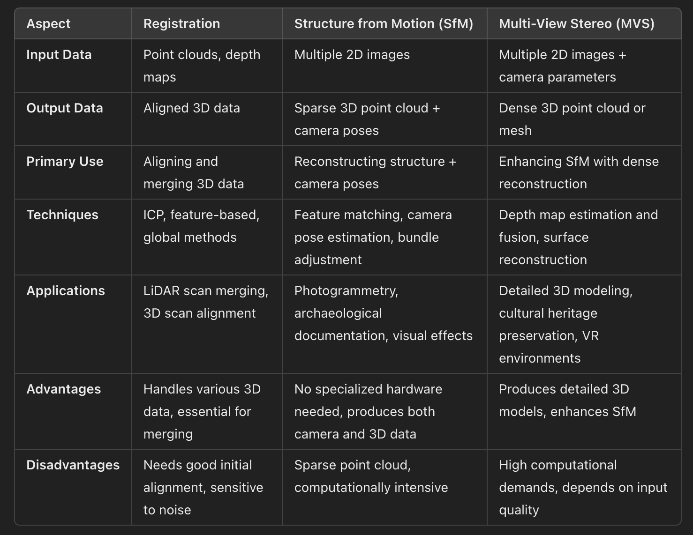

# MVS

sfm只是根据照片推定出的基准点，来推定照片的拍摄位置，mvs是指根据推定的图片位置和基准点生成大范围点云输入

Multi-View Stereo is a technique that reconstructs dense 3D models from multiple overlapping images. It refines the sparse point cloud produced by SfM to generate a detailed and dense reconstruction.

> 更新: 2024-06-22 12:47:06  
> 原文: <https://www.yuque.com/viruspc/el3mi0/qg7freiwkzbk5hir>