# Surface Reconstruction

- [Summary](#summary)
- [Goal](#goal)
- [Two Approaches](#two-approaches)
- [Implicit-Based Methods](#implicit-based-methods)
  * [Surface Reconstruction from Unorganized Points](#surface-reconstruction-from-unorganized-points)
    + [介绍](#%E4%BB%8B%E7%BB%8D)
    + [Pipeline](#pipeline)
    + [背景1 - Implicit Surfaces: Regular value（正则值）](#%E8%83%8C%E6%99%AF1---implicit-surfaces-regular-value%E6%AD%A3%E5%88%99%E5%80%BC)
    + [背景2 - Implicit Function Theorem](#%E8%83%8C%E6%99%AF2---implicit-function-theorem)
    + [方法：Computation of the signed distance](#%E6%96%B9%E6%B3%95computation-of-the-signed-distance)
      - [第一步：Tagent Plane Fitting：](#%E7%AC%AC%E4%B8%80%E6%AD%A5tagent-plane-fitting)
      - [第二步：找Orientation。（法线传播， normal propogation）](#%E7%AC%AC%E4%BA%8C%E6%AD%A5%E6%89%BEorientation%E6%B3%95%E7%BA%BF%E4%BC%A0%E6%92%AD-normal-propogation)
      - [第三步：](#%E7%AC%AC%E4%B8%89%E6%AD%A5)
  * [Marching Cube](#marching-cube)
- [补充资料](#%E8%A1%A5%E5%85%85%E8%B5%84%E6%96%99)
  * [Manifold](#manifold)
  * [dense](#dense)
- [References](#references)

---

## Summary
大部分工作都是90年代到00年、10年，12年开始都是 deep learning。

很基础的问题，但仍未完全解决。很有潜力的问题，值得研究。（相比之下scanning不太好研究）

有些人认为，single view的重建不算真正的重建。

## Goal
上节课讲的 registration 可以得到一个 point cloud（下图左边）。

但如何得到mesh？这就是 Surface Reconstruction 的目标。这个问题没有完全解决，图形学很多东西值得用 deep learning 来再做一遍。比如最近有用dl做marching cube。

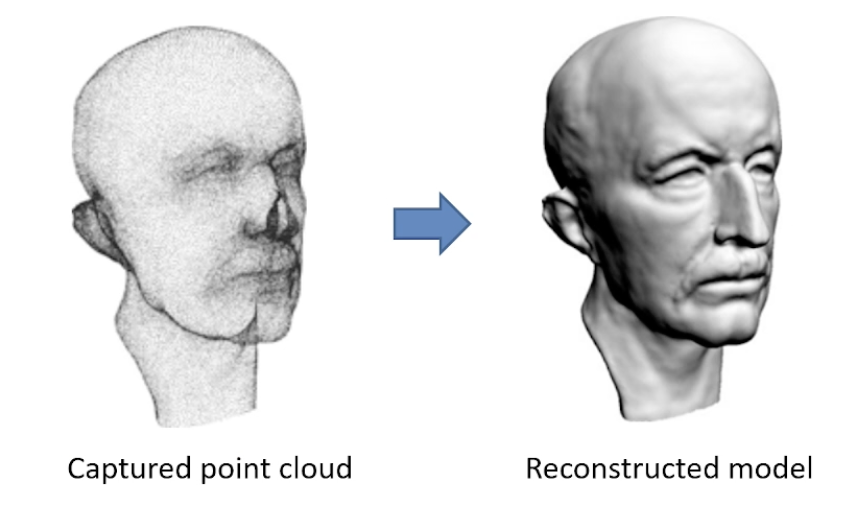

## Two Approaches
+ **Implicit（主流）**
    - Signed distance function estimation
    - Mesh approximation
    - Fast and efficient
    - 受Noise影响小一些，更efficient。但input非常好，也可能不work。
+ Explicit（更倾向于把现有的点连起来）
    - Local surface connectivity estimation
    - Point interpolatoin
    - Computation geometry based
    - Input足够好（noise低，弯的地方点多），用此类方法一定可以重建出来。但是通常比较慢，noise 一高就容易出问题

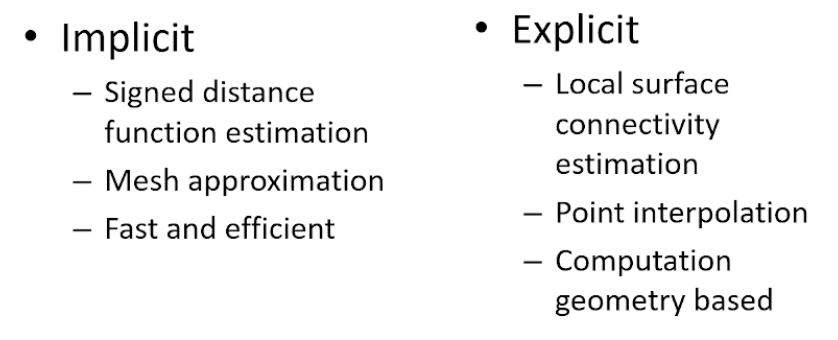

## Implicit-Based Methods
### Surface Reconstruction from Unorganized Points
#### 介绍
SIGGRAPH 1992。很有影响力，建立了一个**体系结构**。如果读重建应该从这篇文章开始读起。

把 implicit-based reconstruction 的方法构建了 complete system。后人主要在这个基础上做改进。

文章很多基本问题没有解决，但这个framework是大家都认同的。

重建基本上要求input是dense的，point把所有object都cover住。如果是partial的，需要data-driven的用deep learning的方法去做。

#### Pipeline
Method pipeline：输入点云，输出manifold的三角网格

具体而言，文章分两步，1. 从点云如何构建出implict surface 2. 从 implicit representation 如何构建出mesh

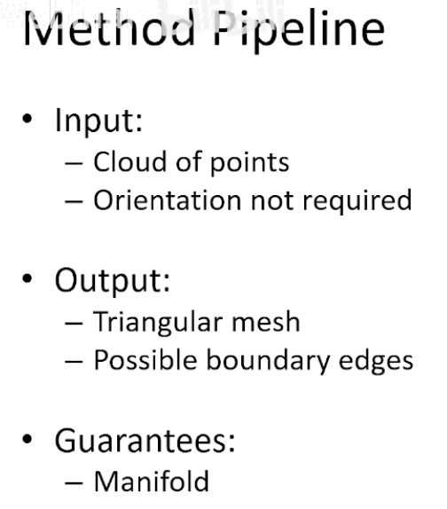

manifold：流形。

#### 背景1 - Implicit Surfaces: Regular value（正则值）
方法怎么来的？

+ 一个非常重要的concept是Implicit Surface。

什么是 Implicit surface？

+ 是一个smooth function。
+ 最简单的implicit surface：球 x^2+y^2+z^2 = 0
+ 隐式曲面是通过一个标量函数 f(x,y,z)的零集定义的，即满足以下方程的点的集合： f(x,y,z)=0这里，f(x,y,z)是一个标量场，它在三维空间中定义了一个曲面。

什么是regular value？

+ 在隐式曲面中，regular value 是指函数 f(x,y,z)的输出值 c，使得隐式曲面 f(x,y,z)=c 的所有点处梯度 ∇f≠0。它确保了曲面的光滑性和良好性质，是隐式曲面理论中的一个重要概念。
    1. 光滑性：如果 c 是一个 regular value，那么 f(x,y,z)=cf定义的隐式曲面是光滑的（smooth surface），它是一个二维流形。
    2. 奇异性排除：如果 ∇f=0 在某些点上，则 c 是一个 critical value，此时曲面可能会有奇点（例如尖点、交叉点等）。
    3. 拓扑稳定性：Regular value 通常用于分析曲面的局部和全局性质，确保曲面在数学上具有良好的性质。

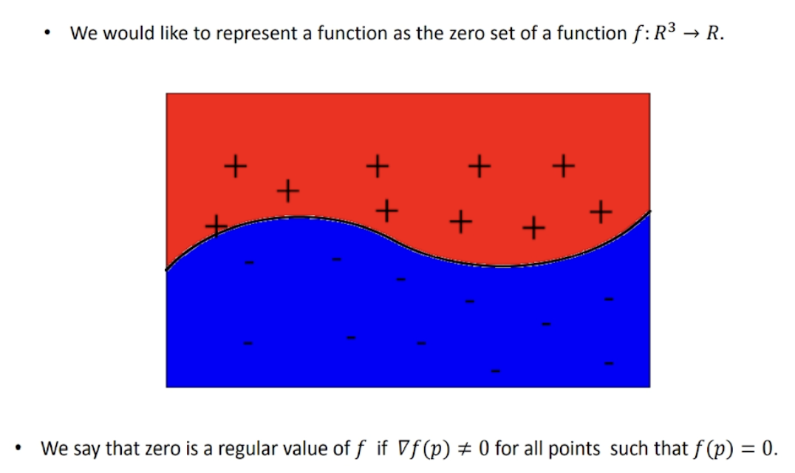

#### 背景2 - Implicit Function Theorem
隐函数定理（Implicit Function Theorem）是数学分析和微分几何中的一个重要定理，它描述了在某些条件下，隐式定义的方程可以局部地用显式函数表示。这个定理为研究隐式方程的解的局部性质提供了理论基础。

在许多问题中，我们会遇到隐式方程：F(x,y)=0

其中，F:R2→R是一个函数。隐函数定理告诉我们，在某些条件下，这个隐式方程可以在某个点附近被表示为显式函数 y=f(x)。

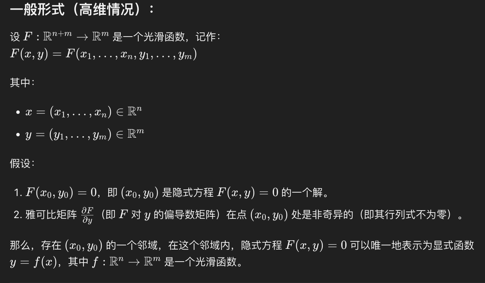

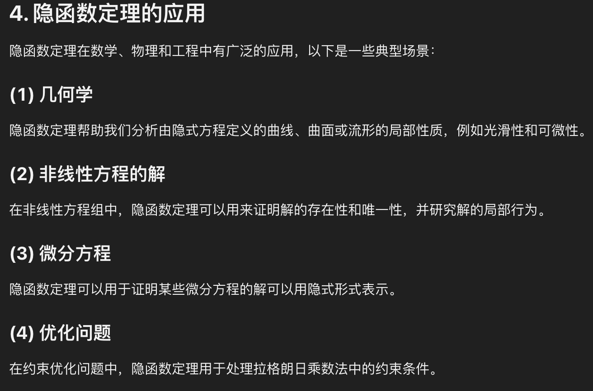

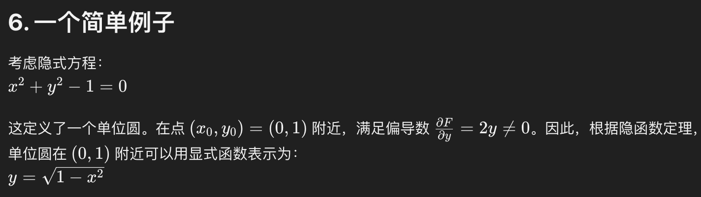

ps：在（0，-1）附近可以用显式函数表示为$ y= - \sqrt{1-x^2} $

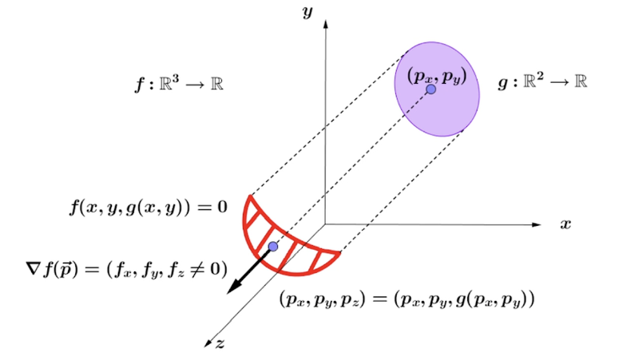

#### 方法：Computation of the signed distance
文章思考的是两步，1. 从点云如何构建出implict surface 2. 从 implicit representation 如何构建出mesh

从点云如何构建出implict surface？算法流程：

1. For each sample fit a tangent plane (切平面) using its k-nearest neighbours。
    1. 用一个平面，来拟合近k个点。
    2. 估计点的normal。（SIGGRAPH ASIA 2024的几篇最佳论文中的一篇就是讲点云的法向估计）
    3. 一些注册方法也需要点的normal，比如point-to-plnae ICP
2. Define a coherent orientation for the tangent plane of all sample points
    1. 定平面朝向
3. for any $ p \in R^3 $ the signed distance function is given by its closest(oriented) tangent plane.
    1. 所有平面结合成一个函数

##### 第一步：Tagent Plane Fitting：
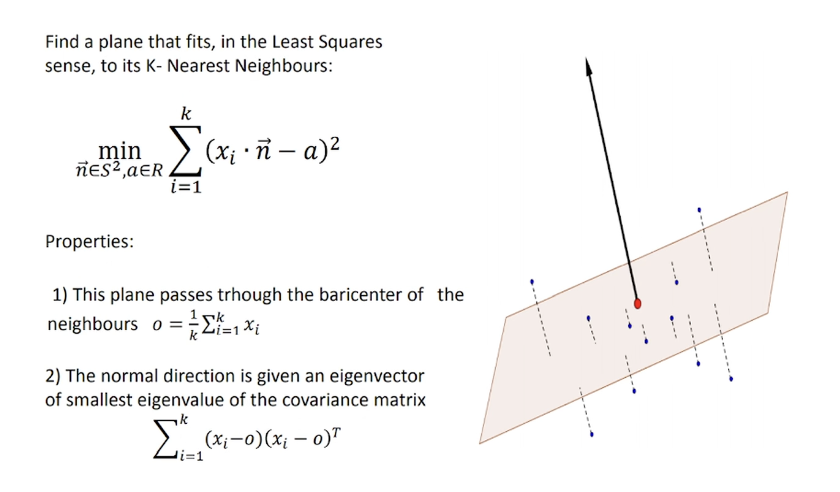

如何做？解优化。平面可以用法向n和平面上一点a来表达，minimize所有点到平面的距离。

最小二乘拟合平面问题，可以直接计算出 optimal solution （存在解析解）。

1. 算所有点的重心，作为a。
2. 法向就是用协方差矩阵，找最小特征的方向（对矩阵做SVD），作为n。（与PCA的目的相反，PCA找最大特征）

牵扯到一些问题：

1. k近邻，取多大的neighbor
2. 如何过滤outlier

##### 第二步：找Orientation。（法线传播， normal propogation）
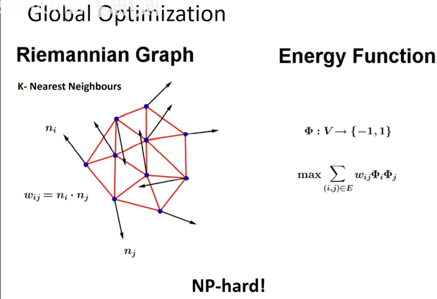

平面有两个方向，取哪个方向？

解优化：**相邻点之间的法向尽量一致**。NP hard问题。

这篇文章补充了heuristic，使得问题可解。work的还不错

1. 初始化发线方向：
    1. 对于点云中的每个点，首先通过局部 PCA 或其他方法计算其法线方向（未定向的法线）。
    2. 从某个种子点开始，选择一个初始法线方向（例如，指向外部）。
2. 构建邻接关系图：构造一个Riemmanian graph（黎曼图，点+边+权重）
    1. 邻接关系的定义方式：
        1. 两个点之间的距离小于某个阈值；
        2. 或者通过 Delaunay 三角化得到的邻接点。
3. 法线传播：从一个点的normal开始，向其他点做propogation，把方向传递给周围。如何选择propogation到哪个点？
    1. 基于几何邻近性（geometric proximity），propogate 到最近的点？不太好，比如夹角处距离近但normal差异大，此时不work。（geometric proximity is not a good criteria for normal propogation）	
        1. 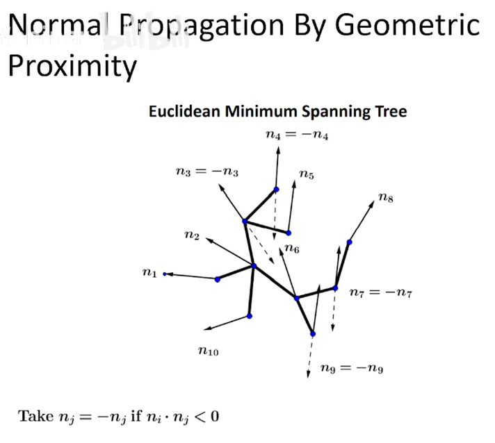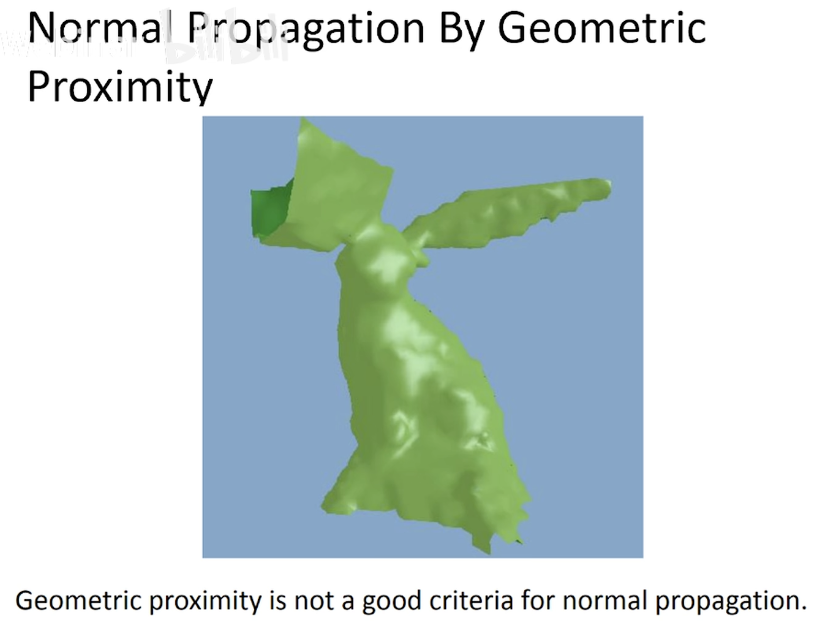
    2. 正确方法，找黎曼图的最小生成树（全局最优）来做做传播，结合黎曼图和平面平行性来做（Normal propagation by plane parallelism ）。
        1. 权重取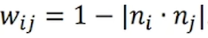。取值范围[0, 2]。（相反方向权重最大，此时内积为-1，权重为2）
        2. 最小
        3. 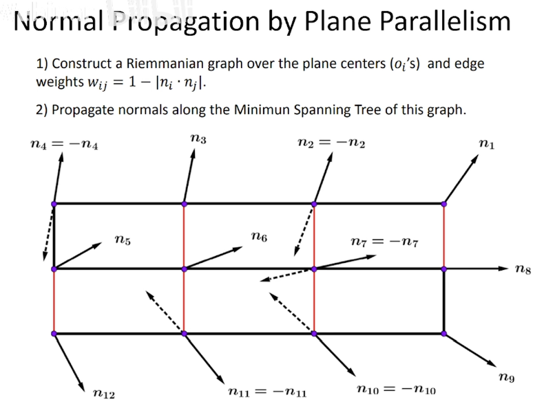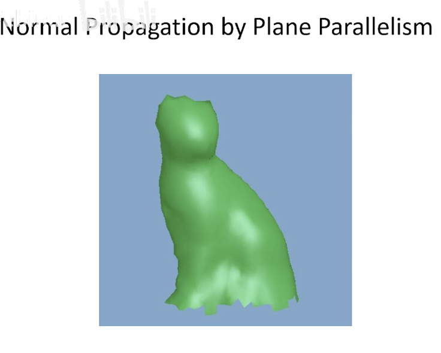
        4. 基于黎曼图的最小生成树来进行法线传播，比直接基于几何邻近性的方法更好，主要因为：
            1. 全局一致性：MST 提供了全局最优的传播路径，而几何邻近性方法容易陷入局部问题。
            2. 噪声鲁棒性：MST 能有效忽略噪声点的影响。
            3. 适应密度变化：MST 能平衡点云密度变化，而几何邻近性方法在密度不均匀时表现较差。
            4. 适合复杂流形：MST 更能捕捉点云的流形结构，而几何邻近性方法局限于简单几何关系。
            5. 无环特性：MST 避免了冗余传播或冲突，确保了法线传播的唯一性和高效性。
        5. 因此，基于黎曼图的最小生成树方法在法线传播任务中更加稳健和高效，尤其是在点云中存在噪声、密度不均匀或流形结构复杂的情况下。
4. 确保全局一致性
    1. 由于点云可能是非单连通的（例如，存在多个分离的点集），需要对每个连通分量分别执行法线传播。

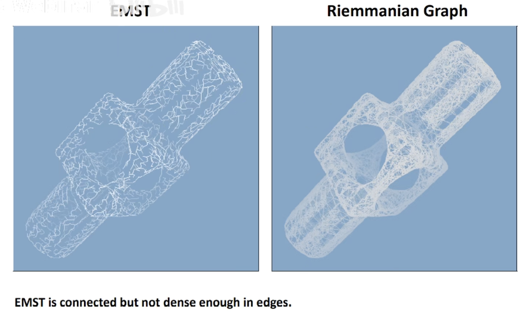

##### 第三步：
Sampling assumptions：

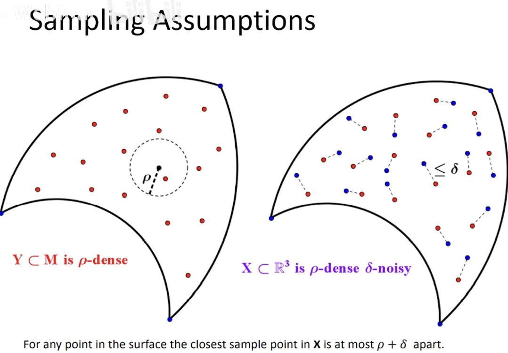

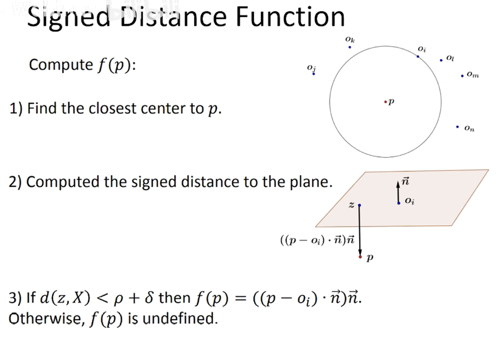

存在的问题：zero level不完全一样。

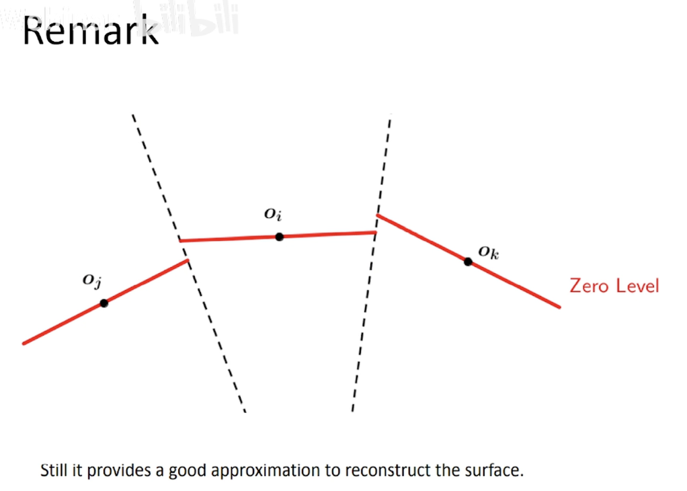

### Marching Cube
一般用于体素生成mesh和等值面。一般不直接用于点云，点云需要先通过网格化或体素化，转换为某种标量场形式。

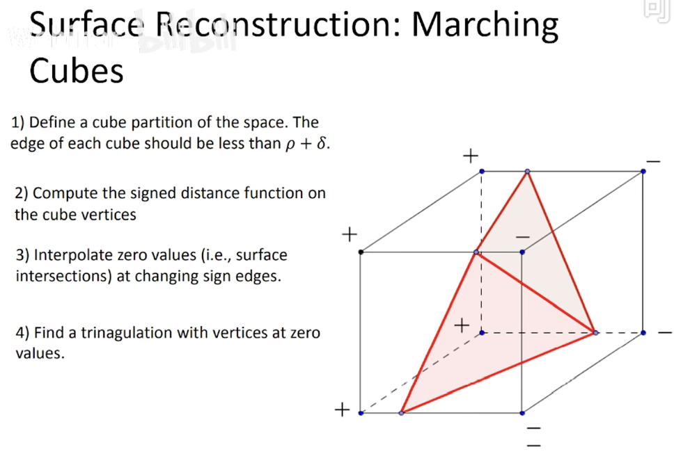

## 补充资料
### Manifold
manifold：流形。所谓流形，意思是"流动的形状"，整体形状如同液体一样可以流畅改变，但是微小的局部上却是不流畅但性质相同的小平面组成。之所以要有流形这个定义是因为图形学中很多关于几何处理的代码都是基于流形性质的，非流形的处理会很麻烦。

一个表面是流形需要满足以下两个条件：

+ 每个边都被正好两个三角形共用
+ 每个顶点都被一个单独且完整的三角形循环包围

但是在实际使用中，这两个流形条件常常无法满足。原始的流形定义要求了表面是封闭的，但是现实中很多表面不是封闭而是有边界的。为了处理这种情况，我们发现放宽松这个条件也不影响计算，称为有边界的流形(manifold with boundary)。

这就总结出了新的流形条件，一个表面要称为有边界的流形需要满足：

+ 每个边都被一个或两个三角形使用
+ 每个顶点都被一个单独的边互相连通的三角形集连接(不需要包围了)

除了流形定义外，图形学中还对三角网格定义了额外的属性：

+ 三角面顶点按照逆时针顺序定义的那面被认为是三角形的正面(少数标准中是反过来的)
+ 一个所有网格三角面的顶点都是相同顺序的时候称为一致朝向(consistently oriented)

但是一致朝向属性在一个很出名的情况下会被严重干扰：莫比乌斯环(Mobius band)。莫比乌斯环成功在保持所有三角形顶点排序顺序一致的情况下却让人无法决定其朝向，如下图：这个连续的表面没法分辨正面和反面。这会给算法带来很大的困扰但是幸运的是实际应用中我们几乎不会碰到这么极端的情况。

[https://cloud.tencent.com/developer/article/1785158](https://cloud.tencent.com/developer/article/1785158)

### dense
**dense** 指的是输入数据的密集程度，通常是指点云、图像或其他几何数据的采样密度足够高，以便在三维重建中能够覆盖物体的所有表面细节。

具体来说：

1. **点云密集（Dense Point Cloud）**：在三维重建中，点云数据需要足够密集，才能完整地表示物体的形状和细节。如果点云稀疏（Sparse），重建出来的模型可能会有缺失或不完整的部分。
2. **图像密集（Dense Image Data）**：在基于图像的重建中，输入的图像需要有足够的分辨率和覆盖范围，确保每个角度和细节都被捕捉到。

因此，**dense** 表示数据的覆盖范围广且采样足够细致，能够全面描述物体的几何信息，从而支持高质量的三维重建。

## References
1. Surface Reconstruction from Unorganized Points - siggraph 1992
2. [【笔记】《计算机图形学》(12)——图形学的数据结构-腾讯云开发者社区-腾讯云](https://cloud.tencent.com/developer/article/1785158)

> 更新: 2025-02-01 07:30:15  
> 原文: <https://www.yuque.com/viruspc/el3mi0/idtqrsr7znpwrez6>