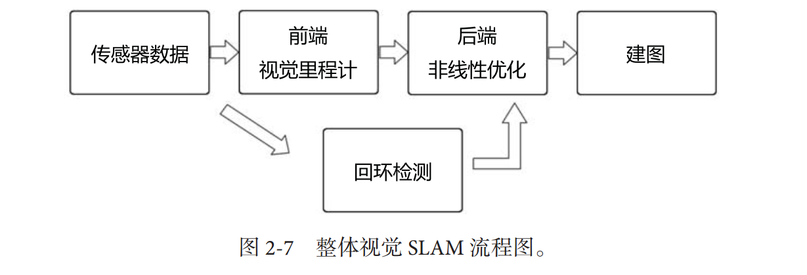

# SLAM 基础概念

- [SLAM是什么？](#slam%E6%98%AF%E4%BB%80%E4%B9%88)
  * [空间状态不确定性的估计（Spatial Uncertainty ）](#%E7%A9%BA%E9%97%B4%E7%8A%B6%E6%80%81%E4%B8%8D%E7%A1%AE%E5%AE%9A%E6%80%A7%E7%9A%84%E4%BC%B0%E8%AE%A1spatial-uncertainty-)
  * [SLAM VS SFM](#slam-vs-sfm)
- [传感器](#%E4%BC%A0%E6%84%9F%E5%99%A8)
- [相机](#%E7%9B%B8%E6%9C%BA)
- [经典SLAM框架](#%E7%BB%8F%E5%85%B8slam%E6%A1%86%E6%9E%B6)
- [SLAM问题的数学表述](#slam%E9%97%AE%E9%A2%98%E7%9A%84%E6%95%B0%E5%AD%A6%E8%A1%A8%E8%BF%B0)

---

对应前 2 讲内容

## SLAM是什么？
1. SLAM 是 SImultatneous Localization and Mapping 的缩写，中文译作“同时**定位**与**地图构建**”。它是指搭载特定**传感器**的主体，在**没有环境先验信息**的情况下，于**运动过程中**建立**环境**的模型，同时估计自己的**运动**。
    1. 条件：传感器 + 运动过程 + 实时 + 无先验知识
    2. 输入：连续运动图像
    3. 输出：运动（定位，即估计相机位姿，旋转和平移6个自由度） + 环境（地图构建，重建稀疏或稠密地图）
2. 如果这里的传感器主要为相机，那就称为“**视觉SLAM**”

### 空间状态不确定性的估计（Spatial Uncertainty ）
早期的SLAM问题是一个状态估计问题。SLAM问题的本质是：对运动主体自身和周围环境空间不确定性的估计。

为了解决SLAM问题，我们需要状态估计理论，把定位和建图的不确定性表达出来，然后采用滤波器或非线性优化（后端），估计状态的均值和不确定性（方差）。

1. 空间不确定性是SLAM系统中需要解决的核心问题之一。因为SLAM的目标是同时估计机器人（或相机）的位置和环境的地图，而这些估计通常受到噪声、不确定性和动态环境的影响。
2. 空间不确定性可以体现在：
    1. 机器人位置的不确定性：对机器人当前位姿（位置和方向）的估计误差。
    2. 地图的不确定性：对环境中特征点或障碍物位置的估计误差。
    3. 数据关联的不确定性：机器人在不同时间观察到的特征点是否对应同一个真实点的模糊性。
3. 这些不确定性会随着时间累积，影响SLAM系统的精度和稳定性。

### SLAM VS SFM
相机内参的估计：前面提到，SLAM的定位一般只估计相机外参（位姿），内参已知或通过标定、动态标定得到；而在三维重建系统中，往往需要在内参未知或不准确的情况下同时估计内参和外参。

1. SLAM中，相机内参通常是已知的；SFM+MVS的三维重建系统中，相机的内参通常是未知的。
2. 一些SLAM系统，如自标定SLAM，也可以在运行过程中估计内参，尤其是在内参可能发生变化的情况下。
3. SFM 和 MVS 系统通常处理的是离线采集的照片或视频序列，这些图像可能来自不同的相机，甚至是未经标定的消费级设备（如手机、普通相机）。因此，相机的内参通常是未知的。

VO是SFM的子集，是SFM的实时化版本。VO不关注全局优化（后端的问题），不关注三位结构的估计，主要关注相机运动的实时估计。

| **属性** | **SLAM** | **三维重建** |
| --- | --- | --- |
| **定义** | 同时估计相机/机器人位置和环境地图。 | 从图像或传感器数据中恢复三维结构。 |
| **目标/核心问题** **核心问题** | **实时** **定位**与**建图**。 + 定位（相机/机器人轨迹估计）。 + 建图（稀疏或稠密地图生成）。 | **离线**生成**高精度三维模型**。 + 几何建模（重建三维形状）。 + 纹理映射（生成逼真表面）。 |
| | | |
| | | |
| **技术特点** | 实时性强，需快速更新位姿和地图，适合动态环境。 | 精度优先，适合离线处理。 |
| **输入数据类型** | 实时传感器数据（相机、激光雷达等）。特别地，如果传感器为相机称之为视觉SLAM。 | 离线采集的图像序列或点云数据。 |
| **主要传感器** | 单目相机、双目相机、RGB-D 相机、激光雷达等。 | 单目或多目相机、无人机航拍、结构光扫描等。 |
| **输出结果** | + 相机/机器人轨迹（位姿）。 + 环境地图（稀疏点云或稠密地图）。 | + 高精度的三维模型（点云、网格）。 + 表面纹理（可选）。 |
| | | |
| **地图类型** | 稀疏地图或稠密地图（体素、网格）。 | 高精度稠密模型（网格或体素）。 |
| **地图精度** | 通常较低（稀疏点云或粗略稠密地图）。 | 高精度（稠密点云、网格、纹理）。 |
| **核心算法** | + 特征点匹配（ORB、SIFT 等）。 + 位姿估计（PnP、ICP、光流跟踪）。 + 地图优化（因子图、BA、回环检测）。 | + 特征点匹配（SIFT、SURF 等）。 + 多视图几何（SfM、MVS）。 + 表面重建（Poisson、TSDF 等）。 |
| | | |
| | | |
| **优化方法** | + 后端优化（图优化、BA）。 | + 全局优化（Bundle Adjustment）。 |
| **应用场景** | + 机器人导航（无人机、自动驾驶等）。 + 增强现实（AR）和虚拟现实（VR）。 + 室内地图构建（清扫机器人等）。 | + 文物数字化、影视特效、建筑测绘等。 + 医学影像、虚拟现实场景建模。 |
| | | |
| | | |
| **关系与结合** | + SLAM 可用于实时三维重建。 + 两者可结合，用于无人机航拍建图等场景。 | + 三维重建可用作 SLAM 的后处理。 |
| | | |

## 
## 传感器
1. 携带于机器人本体上：普通、通用
2. 安装于环境中：简单、可靠

## 相机
**视觉**SLAM的目标，是通过一系列连续变化的图像，进行定位和地图构建

1. 单目（monocular）：
    1. 单摄像头
    2. Pros：结构简单，成本低。
    3. Cons：尺寸不确定性。单目SLAM无法仅凭图像确定这个真实尺度（Scale）。
    4. 问题
        1. 如何通过单目相机，进行定位和地图构建？
            1. Structure From Motion。我们必须移动相机，才能估计相机的运动（Motion），同时估计场景中物体的远近和大小（Structure）。
            2. 利用**视差**（Disparity）可以计算**相对**远近。（近处物体移动快，远处移动慢）
            3. PS：只旋转是不行的，单目相机必须有平移，后面会讲原因。
2. 双目（stereo）：
    1. 多摄像头
    2. Pros：可测深度，可以计算真实尺度。
    3. Cons：计算量大（配置与标定均较为复杂，深度量程和精度受双目的**基线**与**分辨率**所限）。而视差的计算非常消耗计算资源，需要使用GPU和FPGA设备加速，才能实时输出整张图像的距离信息。
    4. 问题
        1. 和单目相机在两个位置拍摄两张照片有什么区别？
            1. 基线（Baseline）已知，可以由三角测量计算绝对深度。
3. 深度（RGB-D）：
    1. 原理比较复杂，可捕捉深度，主要两大类（即 games 203 中的 optical 类型的 passive 的 scanning 方法）：
        1. 红外结构光（Structured Light），如Kinect 1代
        2. 飞行时间（ToF），如Kinect 2代
    2. Pros：物理测量而非软件计算，计算量小。
    3. Cons：测量范围窄，噪声大，视野小，易受日光干扰，无法测量透射材质等

## 经典SLAM框架
这个框架本身及其包含的算法已经基本定型，并且已经在许多视觉程序库和机器人程序库中提供。

**如果把工作环境限定在静态、刚体、光照变化不明显、没有人为干扰的场景**，那么这种场景下的SLAM技术已经相当成熟。

1. 传感器信息读取：
    1. 任务：获取信息
        1. 时间连续的、预处理好的一系列图像帧
        2. （可选）码盘
        3. （可选）惯性传感器
        4. 。。。
2. 前端视觉里程计（Visual Odometry，VO）：
    1. 输入：传感器信息，比如一系列图像帧
    2. 任务：估算相邻图像间相机的运动（Motion），以及局部地图（Structure）的样子。给后端提供待优化的数据，以及这些数据的初始值。
    3. 方法：计算机视觉相关算法
        1. 特征点法
        2. 直接发如特征提取和匹配
    4. 其他
        1. VO是SFM的子集
3. 后端（非线性）优化（Optimization）：
    1. 输入：短时间的相机位姿、运动和地图、回环检测信息
    2. 任务：**处理SLAM过程中的噪声问题。**通过对输入作全局优化，得到全局一致的、长时间最优的轨迹和地图。
        1. 最大后验概率估计（Maximum-a-Posteriori，MAP）：从带有噪声的数据中估计整个系统的状态，以及这个状态估计的不确定性有多大。
    3. 方法：滤波（不常用）与非线性优化（常用）
4. 回环检测（Loop Closure Detection）：
    1. 输入：传感器
    2. 任务：解决位置估计随时间偏移（累积漂移，Accumulating Shift）的问题。判断机器人是否到达过先前的位置，辅助后端进行全局优化。（地图存在的主要意义是让机器人知晓自己到过的地方）。
    3. 方法：可以通过计算图像数据相似性来判断回环。
5. 建图（Mapping）：
    1. 输入：后端估计的轨迹和地图
    2. 任务：建立与任务要求相对应的地图。地图存在的主要意义是让机器人知晓自己到过的地方。
    3. 类型：有度量地图和拓扑地图两种
        1. Metric：**精确**地表示地图中的物体位置关系
            1. Sparse：稀疏地图，只选择部分由代表意义的东西（路标），用于定位。
            2. Dense：稠密地图，建模所有看到的东西，用于导航。
                1. 常为voxel的形式，每个voxel含有占据、空闲、未知三种状态来表达格内是否有物体。这种地图可以用于A*、D*等各种导航算法。
        2. Topoligical：更强调地图元素之间的**相对关系**。
            1. 如何对地图进行分割形成节点与边，如何利用拓扑地图进行导航和路径规划，仍是有待研究的问题。

## SLAM问题的数学表述
x携带着传感器u在含有路标点y环境中运动，可以拆分为两件事情：

1. 什么是运动？运动方程：传感器 =(运动方程)=> 主体本身位姿x
    1. $ x_k = f(x_{k-1}, u_k, w_k) $，w是传感器的噪声
2. 什么是观测？观测方程：主体本身位姿x =(观测方程)=>某个观测物体位置
    1. $ z_{k,j}=h(y_i, x_k, v_{k,j}) $，v是观测带来的噪声

> 更新: 2025-02-02 05:44:12  
> 原文: <https://www.yuque.com/viruspc/el3mi0/wgtzwtdgsnkxc7p5>