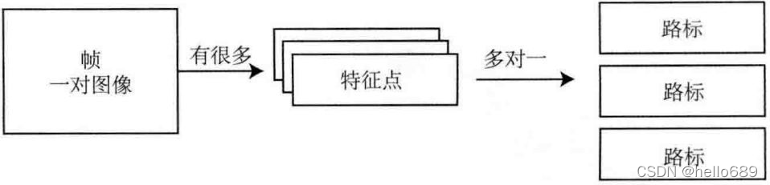
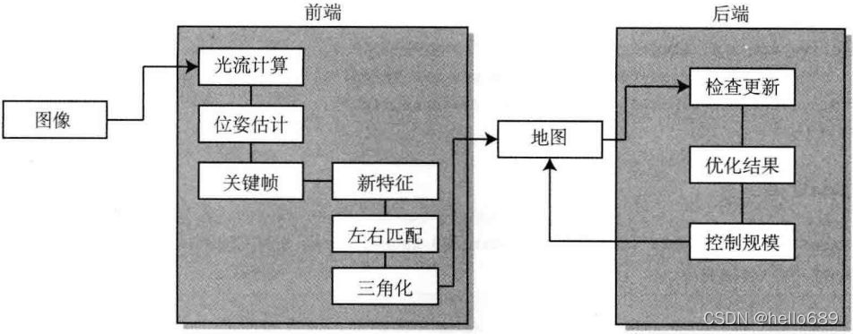

# 实践：设计SLAM系统

1. 基本数据结构
    1. 图像、特征、路标
    2. 
2. 算法框架
    1. 
3. 代码结构脑图

[https://blog.csdn.net/weixin_45703465/article/details/122181500](https://blog.csdn.net/weixin_45703465/article/details/122181500)

> 更新: 2025-02-02 05:54:15  
> 原文: <https://www.yuque.com/viruspc/el3mi0/nrr5hnx2at10wh7e>