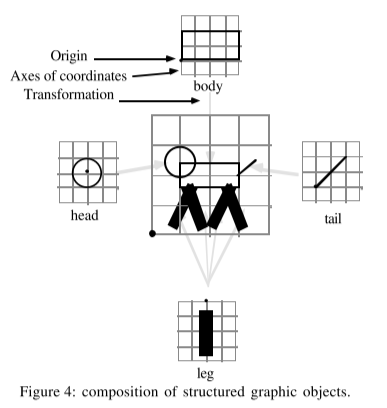
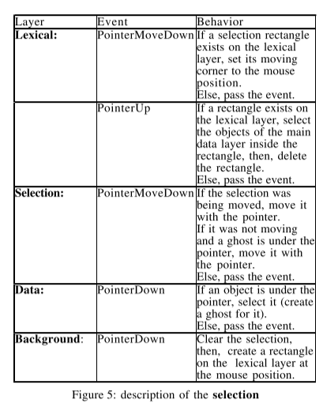
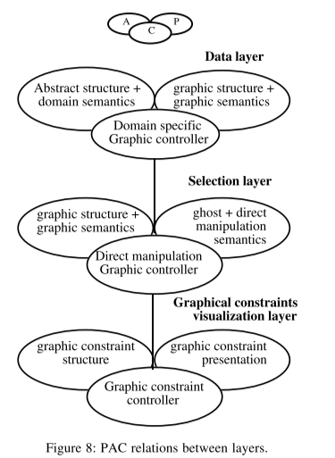
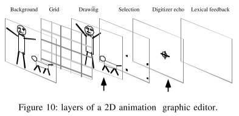

# 1992 - A Multi-Layer Graphic Model for Building Interactive Graphical Applications

- [The Multi-Layered Graphic Model](#the-multi-layered-graphic-model)
  * [Rendering and Event Handling](#rendering-and-event-handling)
  * [The Layers](#the-layers)
  * [The Transformation Model](#the-transformation-model)
  * [Handling of 3D](#handling-of-3d)
  * [Handling of Events](#handling-of-events)
  * [Logical Status of Layers](#logical-status-of-layers)
  * [Example of Use in an Application](#example-of-use-in-an-application)
  * [Conclusion](#conclusion)

---

在这篇论文中，作者提出了一个用于构建交互式图形应用程序的模型，这个模型基于**multi-layered graphics** 和 **multi-layered input handling**.

## The Multi-Layered Graphic Model
传统的工具都会区分两部分：一个虚拟界面（virutal suface）和一个用户真实看到的界面（viewport）。viewport 只展示 virtual surface 的一部分。但是，传统的模型中，virtual surface 只有一层，作者在这篇paper中将virutal surface扩展为了多层（multi-layer）。

### Rendering and Event Handling
多层从下向上绘制，事件从上向下被处理。

### The Layers
作者将 virtual surface 的 layer 分成以下几种。

1. **Background/model Layer**: 展示背景图. 处理被其他所有layer所忽略的事件。
2. **Graphical constraints visualization layer**: 展示网格等表示几何约束的图形形式。 
3. **Application data layer**: 以图形的形式展示应用内部的数据对象。
4. **Selected objects layer**: 用一些形状来表示选中，暗示可操作的类型。比如用户点击一个图像，会在这层展示一个可拖动的handle，来用于对图像进行拉伸。这层的事件处理允许直接操作。
5. **Lexical operations representation laye**r: 用一些形状来展示输入设备。包括光标和transient shapes（brush的矩形区域）。
6. **Others**: 针对特定应用的layer。

每个 virtual surface 可以通过任意数量的 visible surface 观测，每个 visible surface 可以按任意顺序以及可以选择性的展示 virtual surface 的 layer。

### The Transformation Model
在一个可见界面（visible surface， viewport）中展示一个虚拟界面，要经过变形（transformation）和区域剪裁。复杂的东西通过简单的东西变形组合得到，如下图。

在mono-surface model中， visible surface 负责变形操作：用户在visible surface 上进行放缩和滚动，是不影响 virtual surface 的。本文的模型在此基础上，要求一些对象要知道什么哪些 transformation 作用到了自己上面，使得对象在visible surface 上被绘制时，可以明确的管理它。

本文认为，对象在重绘自己时会使用某一特定的transformation，transformation有三种：

1. 为自己的每个组件使用transformation。适用于data layer。
2. 为自己的位置使用 transformation，而非维度（线宽，handle宽度）。适用于selection、grid等。
3. 不使用任何transformation。用于展示刻度尺或显示定位器的坐标等信息。

### Handling of 3D
virtual surface 包含一个3D对象（virtual volume），visible suface 展示 virtual surface 的一个投影。

它的layer划分：

1. background layer: 通常为实色。
2. graphical constraints visualization layer：如用于对齐的3D 网格或轨迹。
3. application data layer: 3D对象
4. selected objects layer：展示所选择的物体或点上的handle。
5. lexical operations representation layer：展示输入设备。如3D鼠标的投影。

### Handling of Events
multi-layer graphics 的一个重要的优势在于对交互的描述。每个 layer 处理自己感兴趣的事件，一个交互的控制被分散到多层。事件从上向下传递。当一个layer接收到一个事件时，它可以选择：

1. 忽略，并且将事件传递给下一层。
2. 处理它。
3. 处理它，然后传给下一层。
4. 处理它，对事件进行变换，然后传给下一层。

下图是对选择（点选和拖选）交互的描述。

### Logical Status of Layers
使用 PAC 模型（MVC 模型的扩展）。每层有自己的一套 PAC 模型。A 是 Abatraction，表示抽象数据结构。P 是 Presentation，用于展示图形结构。C 是controler，用于控制 A 到 P 的过程，保证抽象结构与图形结构的一致性，以及事件的接收和处理。

### Example of Use in an Application

### Conclusion
multi-layerd multi-view model 简化了交互式图形应用程序的图形输出的管理以及事件处理的描述。它给予了图形应用程序中每个对象了明确的地位。它同时允许对各种输入设备的清晰的描述。

> 更新: 2021-09-09 07:59:12  
> 原文: <https://www.yuque.com/viruspc/el3mi0/nnqwds>