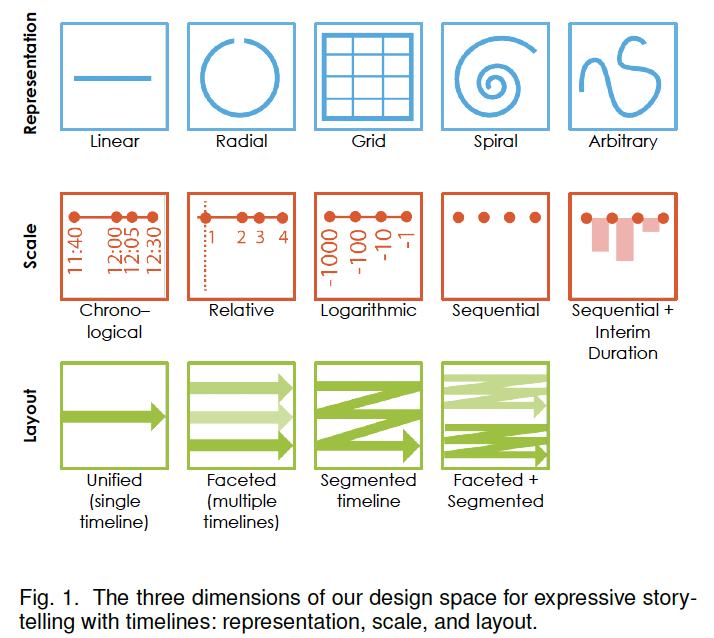

# 2017-Timelines Revisited: A Design Space and Considerations for Expressive Storytelling

- [Contribution](#contribution)
- [Background](#background)
- [Problem](#problem)
- [Methods](#methods)
- [Future Work](#future-work)

---

## Contribution
1. The introduction and analysis of a **design space **for storytelling with timelines.
2. A** realization** of viable timeline designs from our design space within a sandbox environment.

Ultimately, our works is intended to both gorund and inspire the design of future interactive tools for producing visual timeline stories

## Background
There are many ways to visualize event sequences as timelines. In a **storytelling context **where the intent is to convey multiple narrative points, a richer set of **timeline designs** may be more appropriate than the narrow range that has been used for exploratory data analysis by the research community. 

## Problem
**How can storytellers tell expressive stories with timelines while maintaining an underlying concern for perceptual and narrative effectiveness? **

While the visualization research community has devoted attention to articulating the general principles of visual data-driven storytelling design [7], [47], [82], the question of **how to tell expressive stories with timelines **in particular has not been directly addressed. Visual storytellers who wish to present a variety of narrative points **require a rich palette of design choices**. Those who want totell expressive stories with timelines **lack guidance** with respect to balancing perceptual and narrative effectiveness.

1. Lack guidance with respect to balancing perceptual and narrative effectiveness.
2. Lack guidance with respect to transitioning between different timeline designs.

## Methods

## Future Work
1. distinguish between static and interactive timelines (including data videos)

> 更新: 2022-10-21 02:17:31  
> 原文: <https://www.yuque.com/viruspc/el3mi0/xoundh>