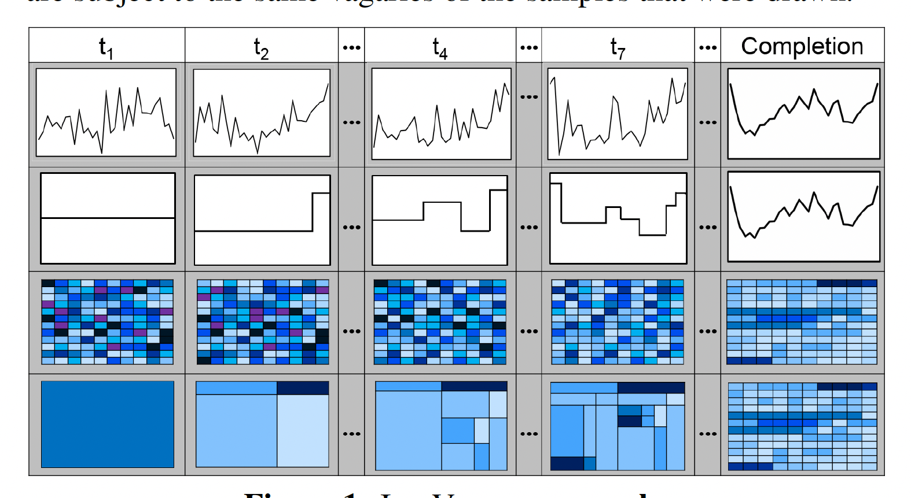
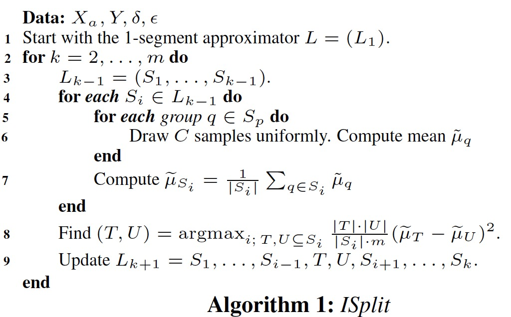
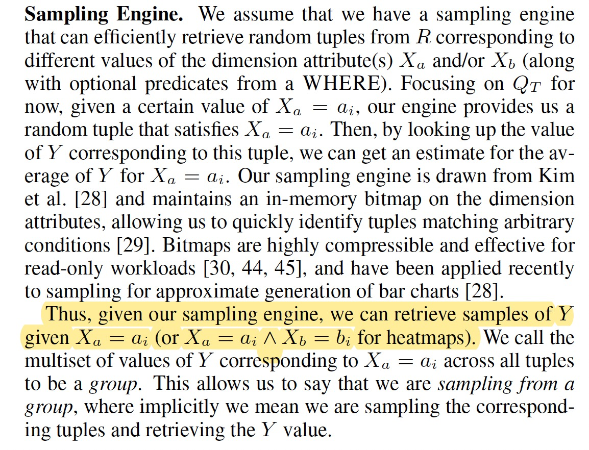

# 2019-I’ve Seen “Enough”: Incrementally Improving Visualizations to Support Rapid Decision Making

- [Contribution](#contribution)
- [Prolem](#prolem)
- [Method](#method)
- [Result](#result)
- [------](#------)
- [Prior Work](#prior-work)
- [Future Work](#future-work)
- [Comments](#comments)

---

# Contribution
online sampling-based schemes可以解决大数据可视化慢的问题，但同时存在着中间生成结果不能揭露数据整体特征，从而误导用户决策的问题。

本文提出了一个 sampling-based incremental visualization算法，可以快速揭露“显著”特征，结果尽量正确，且速度快。

算法支持：1. trendline 2. heatmap

# Prolem
大规模数据数据可视化的生成速度很慢。

一个解决方案是，先采用 online sampling-based schemes （在线的基于采样的方案）来快速生成一个粗略的估计的可视化，再逐步改善显示结果，最终生成一个基于整个数据计算得到的精确可视化。

但这个方案存在着一个问题：中间阶段的可视化是近似的结果，经常会猛烈的波动，可能引导用户做出错误的抉择。

所以，问题总结为：

**Can we develop a sampling-based incremental visualization algorithm that reveals the features of the eventual visualization quickly, but does so in a manner that is guaranteed to be correct?**

# Method
本文提出了一个 sampling-based incremental visualization算法，可以快速揭露“显著”特征，并且在最小化误差的前提下 相对baseline有46倍的速度提升。从而，可以用于快速且error-free的决策。

上图第二行和第四行是本文算法的结果，第一行和第三行是随机采样的结果。ti代表算法的第i步，completion代表最终真实结果。算法会一步步得到更加近似的结果。可以看到，第二行和第四行更能尽早的发现数据趋势特征。

对于trendline，算法在第k步会生成k个横线段。将这些横线连起来，形成阶梯状的曲线，来作为真实结果的近似。

如何生成这些横线段？

已知：1. 所有xi 2. 所有 xi 的 y 值的均值（大数据时结合采样来渐进式采样）。

算法：

1. t1时刻，求所有xi的总体均值m，得到1个线段：{([x1, m], [x2, m], ..., [xi, m])}，绘制
2. ti时刻，从上一步的线段中，选取一个**最佳**线段，对其做分割，产生两个新的线段。在ti时刻会得到i个线段。

均值/分布不知道怎么办？

尽量采用少的样本来估计其分布。每次划分，会利用采样引擎进一步均匀采样，重新估计所有xi的均值。

如何采样？

如何确保线段最佳？

1. 每一次分割，误差会减小。上下两步的相对误差可以通过公式计算出。我们希望尽量减小误差，所以每一步会尽量选择相对误差最大的。

优点？

1. 算法前后两步生成结果是连续的，不会发生突变

# Result
本文证明了，这些算法是关于采样复杂度最优的：给定交互级别，生成的近似结果尽可能的选取更少的样本。

# 
# ------
# Prior Work
**SampleAction** [16] and **online aggregation**[19] both perform online sampling to depict aggregate values, along with confidence-interval style estimates to depict the uncertainty in the current aggregates. However, these approaches prevent users from getting early insights since they need to wait for the values to stabilize. **As we will discuss later, our approach can be used in tandem with online aggregation based approaches.**

**IFOCUS** [28], **PFunk-H** [11], and **ExploreSample** [46] are other approximate visualization algorithms targeted at generating visualizations rapidly while preserving perceptual insights. **IFOCUS** emphasizes the preservation of pairwise ordering of bars in a bar chart,as opposed to the actual values; **PFunk-H** uses perceptual functions from graphical perception research to terminate visualization generationearly; **ExploreSample** approximates scatterplots, ensuring that overall distributions and outliers are preserved. 

An early paper by Hellerstein et al. [20] proposes** CLOUDS**, a similar technique of progressive rendering for scatterplots by using index statistics to depict estimates of density before the data records are actually fetched. Lastly, **M4** [25] uses rasterization to reduce the dimensionality of a time series without impacting the resulting visualization. **None of these methods emphasize revealing features of visualizations incrementally.**

# Future Work

# Comments
和M4解决了类似的问题

和RDP算法思路类似，但RDP能更好的保持斜率信息，RDP应用于heatmap？

x维度的值很多时，找分割点会很费时间。适用于x维度的值少，且整体数据量大的场景。

> 更新: 2023-01-03 04:58:26  
> 原文: <https://www.yuque.com/viruspc/el3mi0/lgfw5c20zqs56a12>