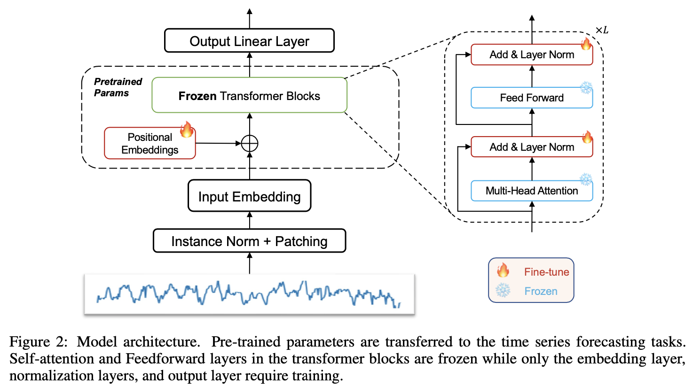

# 2024 NeurlPS One Fits All

- [摘要](#%E6%91%98%E8%A6%81)

---

[https://github.com/DAMO-DI-ML/NeurIPS2023-One-Fits-All](https://github.com/DAMO-DI-ML/NeurIPS2023-One-Fits-All)

将NLP模型跨领域迁移到时序分析任务

# 摘要
虽然 NLP、CV等领域产出了大量 foundation model，用同一个预训练模型作用于下游各种分类任务。

但是，由于 1） 不同来源的时序数据的数据分布差异大 2） 公开的时序数据集少、规模小，收集和扩充成本远远高于NLP和CV数据集。我们很难拿到足够支撑纯时序数据预训练模型所需要的训练数据。

本文采用NLP预训练模型迁移的方式，跳过上面两个问题。其本质是利用NLP与训练模型跨领域的迁移能力，来提升所有时序分析下有任务的结果。

本文的方法在时序补全，时序短程预测，时序长程预测，时序小样本预测，时序零样本预测，时序异常检测，时序分类等7个下游子任务重均取得媲美或超越SOTA的效果，验证了方案的有效性。

同时，本文解释了跨领域迁移能力的原因。

贡献点

1. 提出了简单且统一的跨个年就爱。用一个冻结的预训练语言模型（GPT2），在各类主要类型的时间序列分析任务中实现了SOTA或相当水平的性能。
2. 通过理论和实验分析，发现 self attention 具有类似 PCA 的功能，有助于解释预训练 Transformer 模型的通用性
3. 探索来自另一个LM模型（BERT）或模态（CV）的与训练BEIT模型来驱动时间序列预测，验证了方法在不同模型之间的通用性，不局限于GPT2。

> 更新: 2025-04-22 11:36:27  
> 原文: <https://www.yuque.com/viruspc/el3mi0/dceaa2zu2gmdfhay>