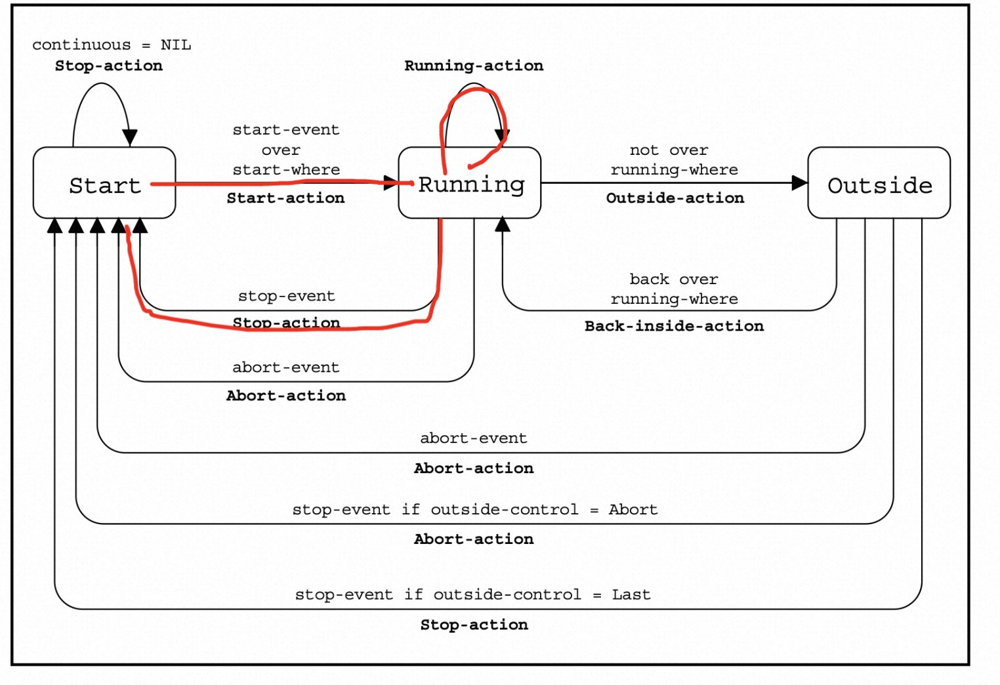
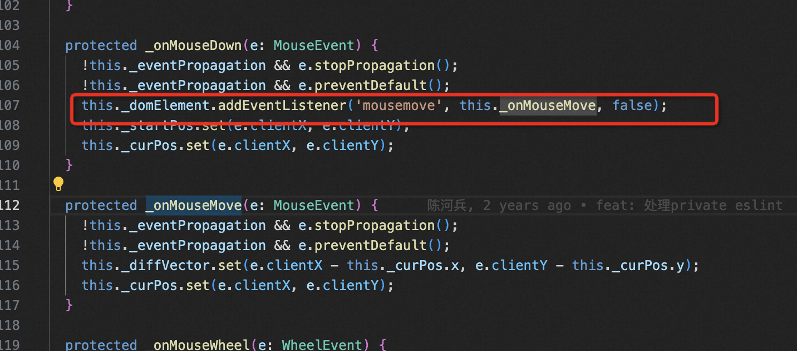
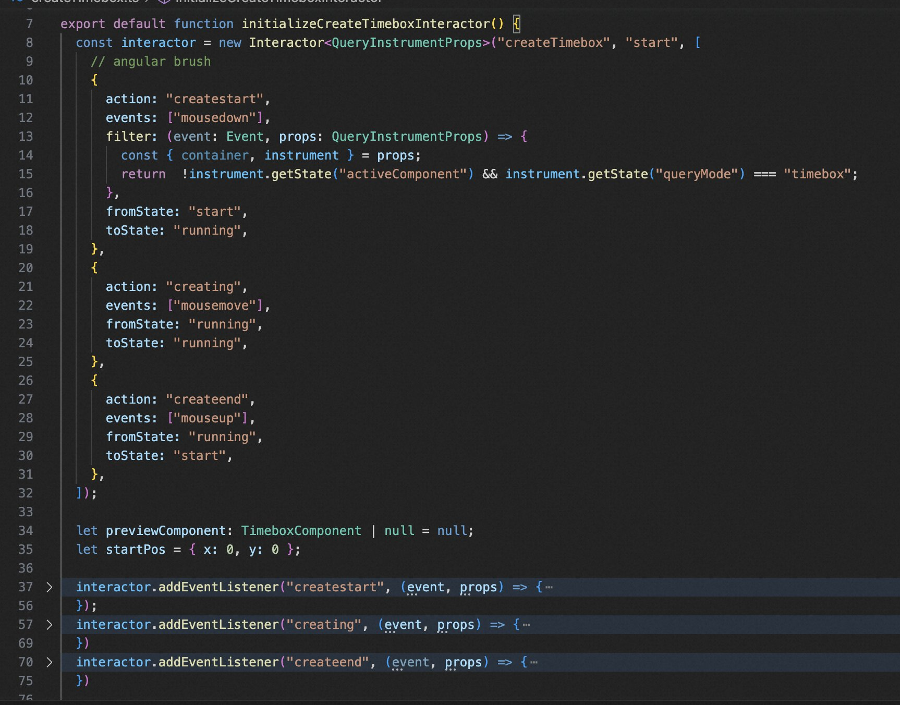

# Interactor

- [什么是交互](#%E4%BB%80%E4%B9%88%E6%98%AF%E4%BA%A4%E4%BA%92)
- [现在定义交互的方法存在的问题](#%E7%8E%B0%E5%9C%A8%E5%AE%9A%E4%B9%89%E4%BA%A4%E4%BA%92%E7%9A%84%E6%96%B9%E6%B3%95%E5%AD%98%E5%9C%A8%E7%9A%84%E9%97%AE%E9%A2%98)
- [方法](#%E6%96%B9%E6%B3%95)
  * [核心思想](#%E6%A0%B8%E5%BF%83%E6%80%9D%E6%83%B3)
  * [例子](#%E4%BE%8B%E5%AD%90)
  * [优势](#%E4%BC%98%E5%8A%BF)
- [参考文献](#%E5%8F%82%E8%80%83%E6%96%87%E7%8C%AE)

---

# 什么是交互
交互是一个状态机

**拖拽操作：**

1. **start ** =mousedown=> **running**
2. **running **=mousemove=> **running**
3. **running **=mouseup=> **start**

garnet

vega

vega-lite

# 现在定义交互的方法存在的问题
交互是一个状态机

1. 不方便定义，需要在回调中通过 addEventListener 来维护状态转移关系
2. 不方便维护历史记录
3. 不方便做多模态
4. ~~复用~~

# 方法
## 核心思想
interactor+状态机+命令模式+事件委托

## 例子
1. 定义状态机
2. 定义时间触发的回调/command

Command

+ do
+ undo

## 优势
1. 方便管理交互的状态 - 方便实现各种交互
2. 方便管理历史记录 - 方便实现 redo/undo
3. 方便做多模态

# 参考文献
1. garnet
2. vega
3. vega-lite

> 更新: 2023-07-27 15:09:37  
> 原文: <https://www.yuque.com/viruspc/el3mi0/kzavb69gm90whwp4>