# 时序数据可视分析

- [背景](#%E8%83%8C%E6%99%AF)
- [可视化方法（Visualization）](#%E5%8F%AF%E8%A7%86%E5%8C%96%E6%96%B9%E6%B3%95visualization)
  * [基础图表](#%E5%9F%BA%E7%A1%80%E5%9B%BE%E8%A1%A8)
  * [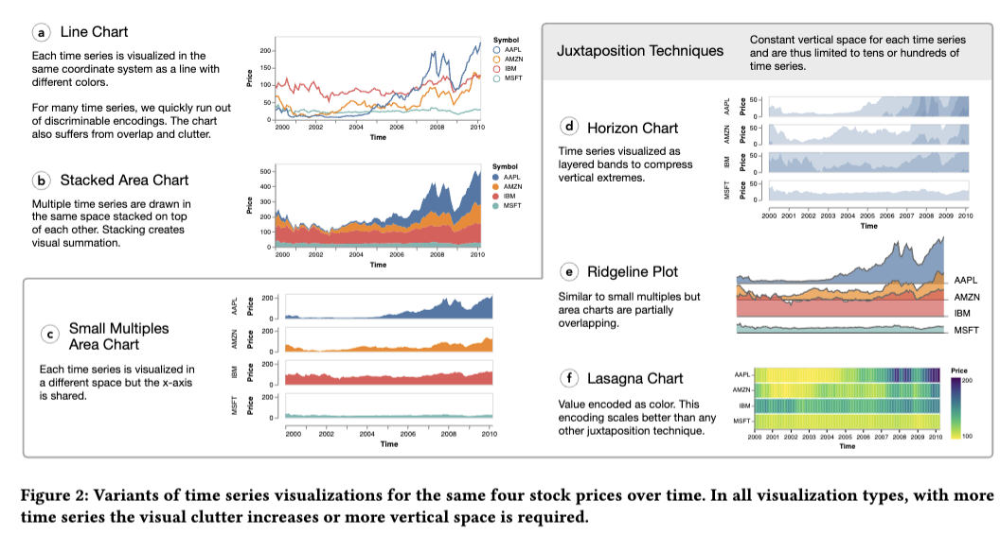](#1735052494155-4b7d35c7-f728-4e25-9879-752cf041ded6pngimgsjk2nbqghbv0xwcm1735052494155-4b7d35c7-f728-4e25-9879-752cf041ded6-310388png)
  * [设计空间](#%E8%AE%BE%E8%AE%A1%E7%A9%BA%E9%97%B4)
  * [多时序数据](#%E5%A4%9A%E6%97%B6%E5%BA%8F%E6%95%B0%E6%8D%AE)
      - [视觉混乱](#%E8%A7%86%E8%A7%89%E6%B7%B7%E4%B9%B1)
      - [渲染和计算效率](#%E6%B8%B2%E6%9F%93%E5%92%8C%E8%AE%A1%E7%AE%97%E6%95%88%E7%8E%87)
  * [高容量时序数据（high volume）](#%E9%AB%98%E5%AE%B9%E9%87%8F%E6%97%B6%E5%BA%8F%E6%95%B0%E6%8D%AEhigh-volume)
  * [多尺度时序数据](#%E5%A4%9A%E5%B0%BA%E5%BA%A6%E6%97%B6%E5%BA%8F%E6%95%B0%E6%8D%AE)
  * [流式数据](#%E6%B5%81%E5%BC%8F%E6%95%B0%E6%8D%AE)
  * [多维数据](#%E5%A4%9A%E7%BB%B4%E6%95%B0%E6%8D%AE)
  * [应用-金融可视化](#%E5%BA%94%E7%94%A8-%E9%87%91%E8%9E%8D%E5%8F%AF%E8%A7%86%E5%8C%96)
    + [k线图](#k%E7%BA%BF%E5%9B%BE)
    + [柱状线（竹节图）](#%E6%9F%B1%E7%8A%B6%E7%BA%BF%E7%AB%B9%E8%8A%82%E5%9B%BE)
- [人为中心的探索数据分析（**EDA)**](#%E4%BA%BA%E4%B8%BA%E4%B8%AD%E5%BF%83%E7%9A%84%E6%8E%A2%E7%B4%A2%E6%95%B0%E6%8D%AE%E5%88%86%E6%9E%90eda)

---

# 背景
时序数据是一类被广泛研究的数据，在金融量化、互联网等领域发挥着越来越重要的作用。例如，大家平常常用的A+、Js Tracker 或是同花顺上股票的k线图，本质都是时序数据。

本文偏科普，希望帮助大家建立起对时序数据可视化和数据分析相关体系的了解。文章分为以下几个部分

1. 可视化方法
2. 人为中心的探索数据分析
3. 数据为中心的模型和算法

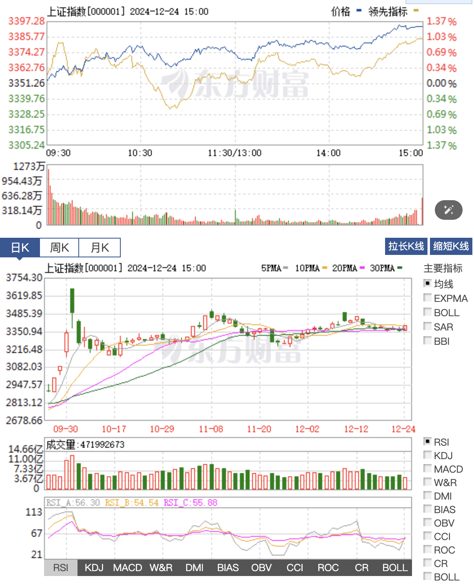

# 可视化方法（Visualization）
## 基础图表
## 
河流图(streamplot/streamgraph) 。

1. 折线图+堆叠柱状图。当需要展示多类别数据、分层数据、累积趋势或强调美感时，河流图是比折线图更好的选择。

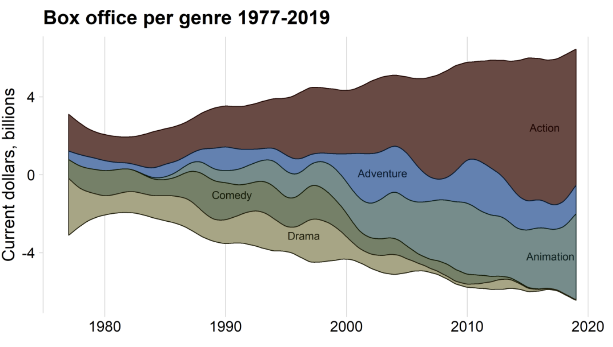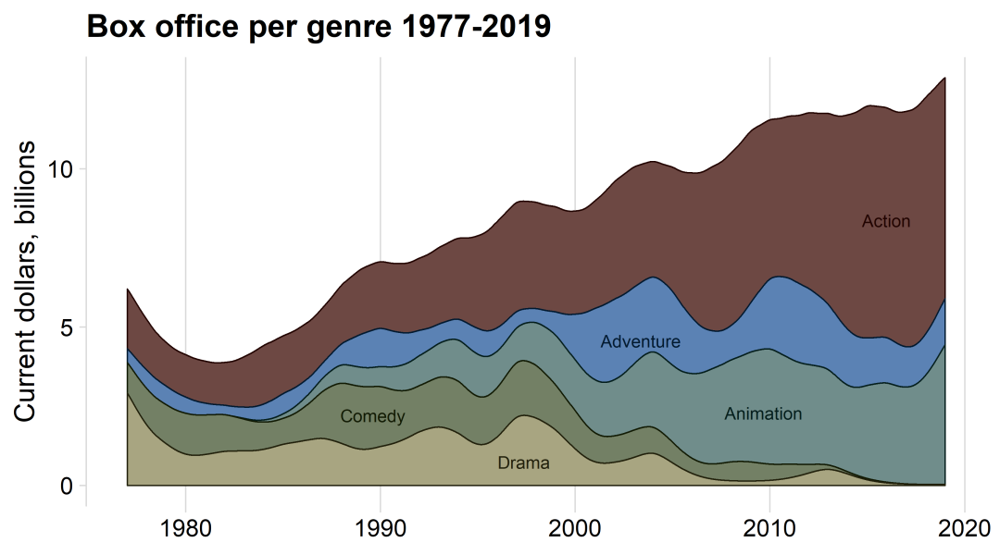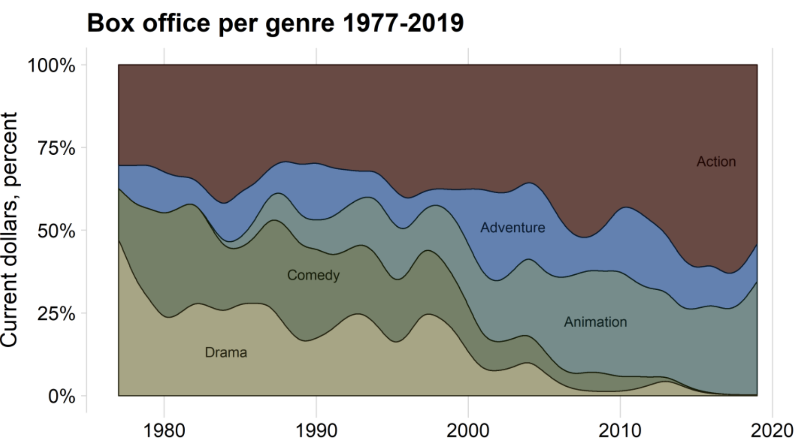

horizon

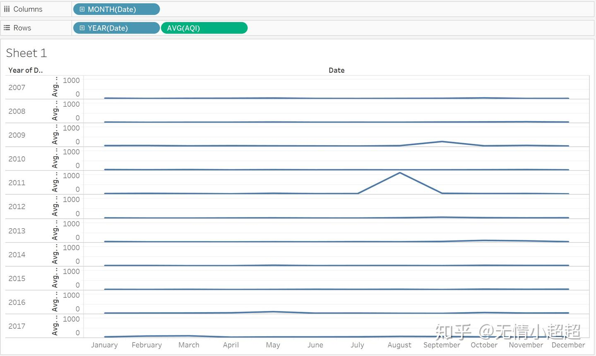

## 设计空间
最简单的时序数据的表现形式就是折线图。

16年，从叙事可视化的角度出发，Tamra等人从图表、过渡、故事三个层次提出了时间序列可视化的设计空间。

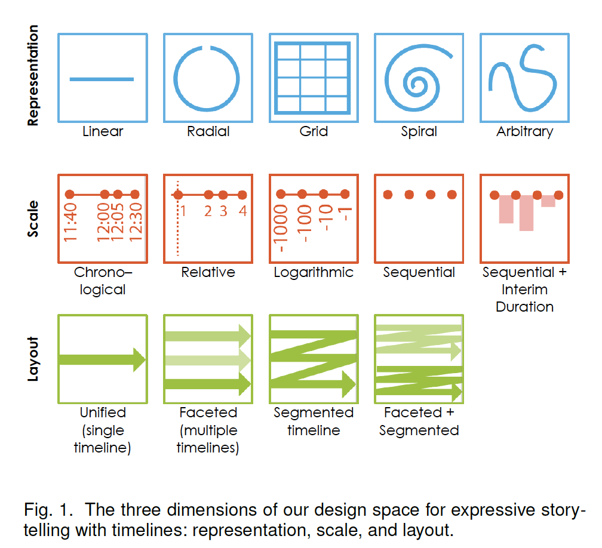

**Charts**:[https://timelinesrevisited.github.io/supplemental/gallery/index.html](https://timelinesrevisited.github.io/supplemental/gallery/index.html)

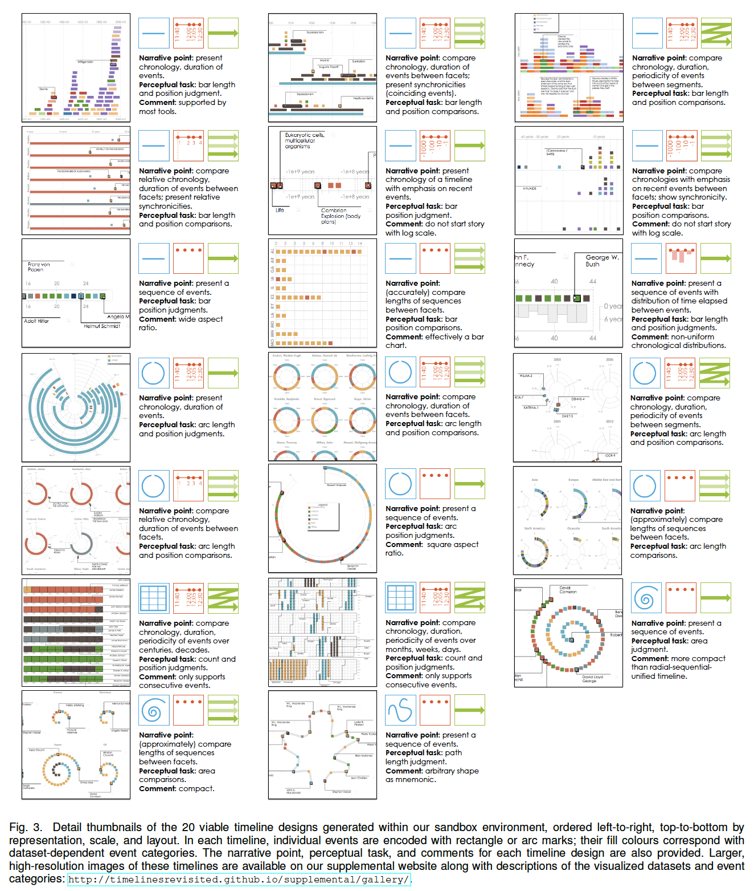

**Transitions**: [https://timelinesrevisited.github.io/supplemental/transitions/index.html](https://timelinesrevisited.github.io/supplemental/transitions/index.html)

+ 上面的三个维度：representation、scale、layout之间可以做过渡动画，使可视化叙事更加生动、吸引人的注意力
+ 

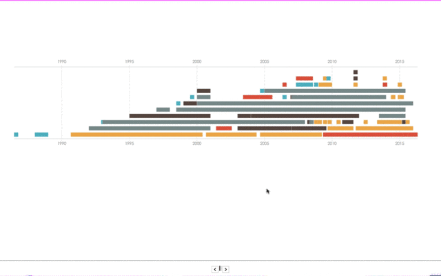

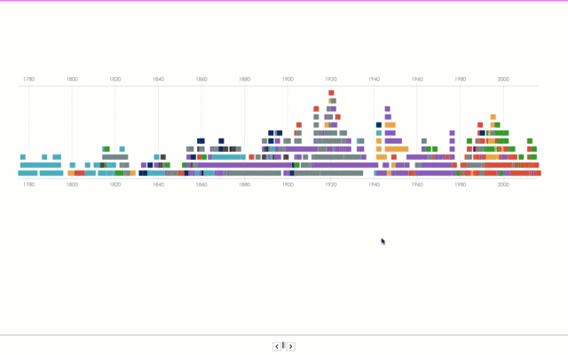

**Stories**: [https://timelinesrevisited.github.io/supplemental/stories/index.html](https://timelinesrevisited.github.io/supplemental/stories/index.html) 

[https://timelinesrevisited.github.io/supplemental/stories/routines.mp4](https://timelinesrevisited.github.io/supplemental/stories/routines.mp4)

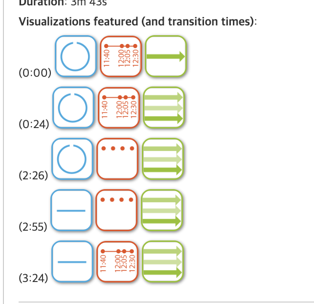

21年同济的曹楠老师给出了更详细的，包括分析、交互等维度的设计空间 

[http://eventvis.idvxlab.com/](http://eventvis.idvxlab.com/)

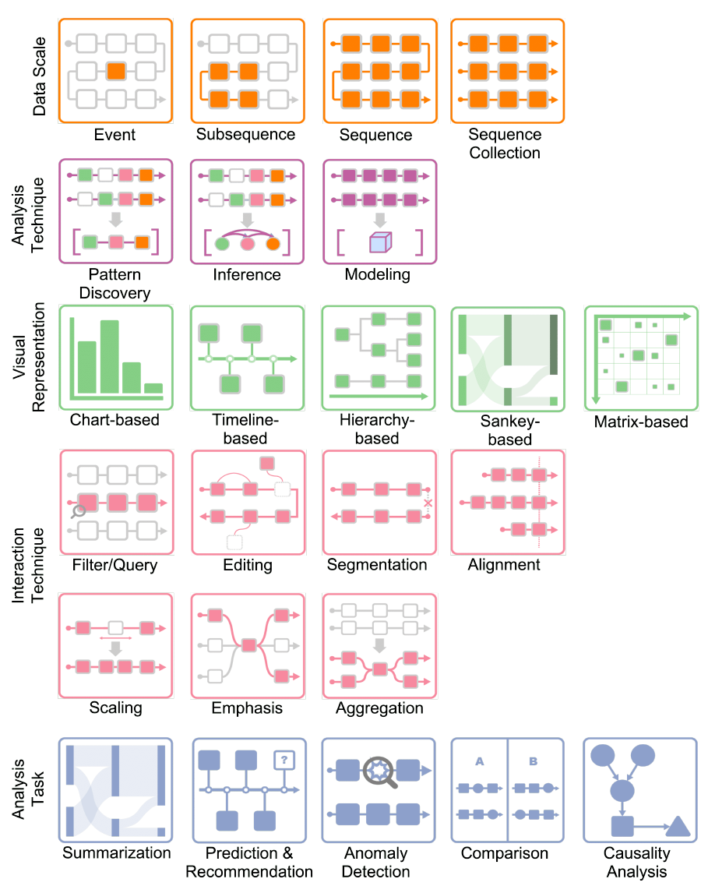

补充了桑基图类型

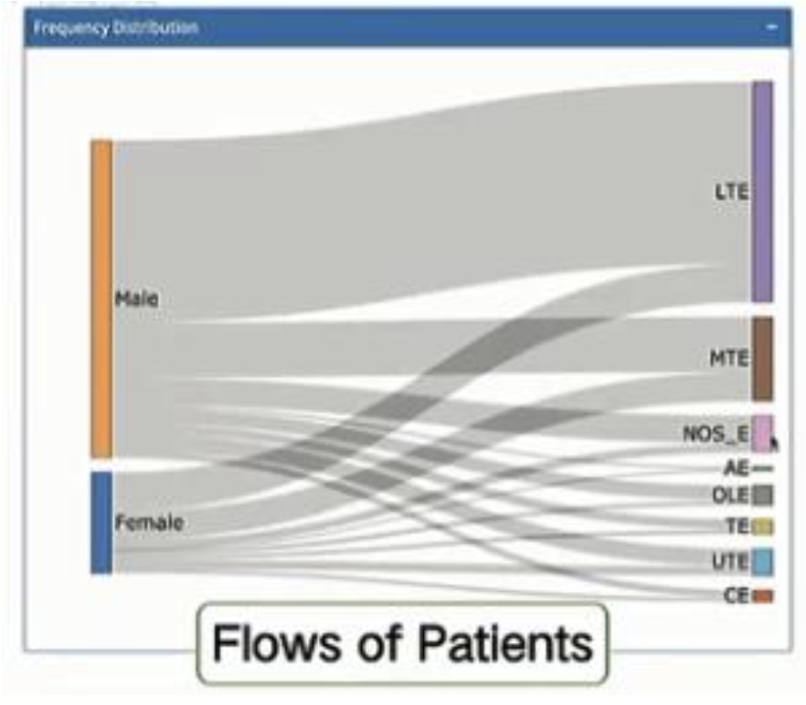

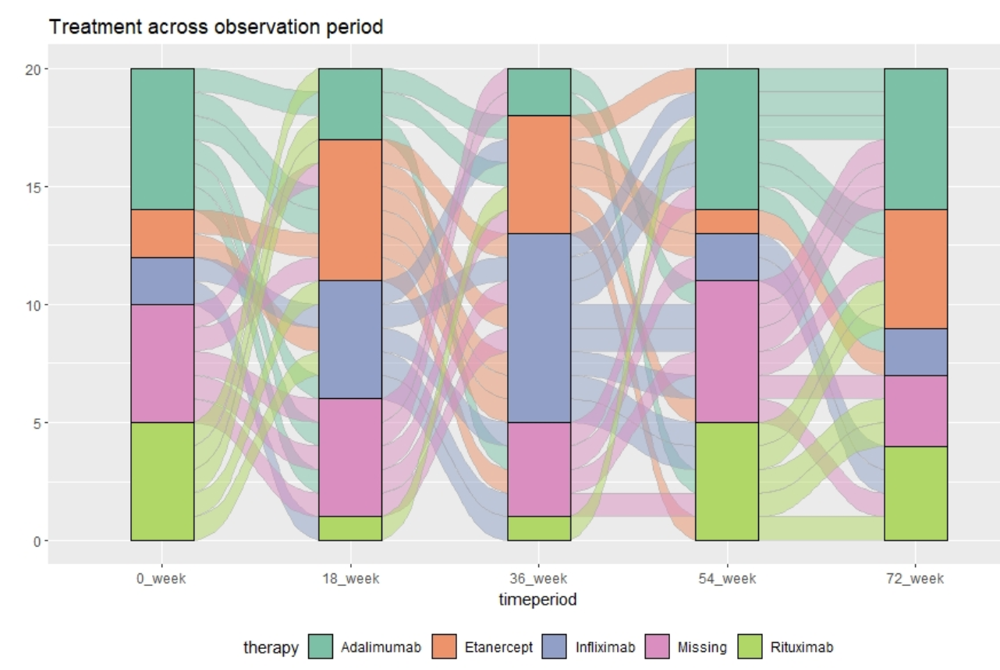

## 多时序数据
同时展示多条时间序列

#### 视觉混乱
1. Time Weaver：织毛衣的思想。阴影+聚类颜色+顺序无关的透明度渲染（类似图形学中的OIT）

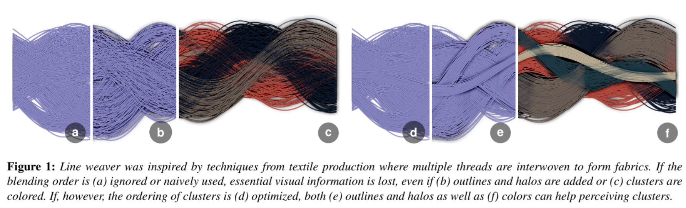

2. Line Density Chart：
    1. 聚合，转化为密度图
    2. 用曲线密度估计做计算，并做了其他算法处理来突出趋势

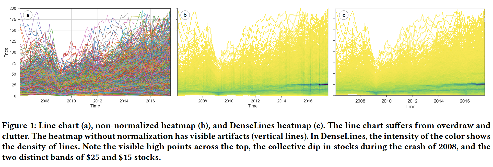

3. Data Reduction
    1. 不展示所有曲线，采样部分有代表性的曲线。许多文章，例如KD-Box提出了相应的找representative line 的方法。

速度问题。

透明度，密度图

Overcrowding and Clutter

+ Cluttered visuals can confuse or overwhelm users, diminishing the ability to identify trends or anomalies.

多时序，多时间点

ti

density分析人员更清晰地识别趋势和模式。以下是一些常见的方法：

1. 密度图 (Density Plot)  
通过计算数据点的密度来展示数据的分布情况，减少了单个数据点的干扰。
2. 堆叠面积图 (Stacked Area Chart)  
将各个时间序列叠加在一起，以展示总体趋势，同时保留个别系列的信息。
3. 小多个图 (Small Multiples)  
将多个小图并排展示，每个图代表一个时间序列，这样可以方便比较不同序列之间的趋势。
4. Horizon 图  
将时间序列分成多个层次，用不同颜色表示不同数值范围，减少了视觉重叠。
5. Ridgeline 图  
通过重叠的密度曲线展示多个时间序列，能够清晰显示数据的分布和变化。
6. 热图 (Heatmap)  
使用颜色强度表示数据的值，适合展示大规模的时序数据，能够快速识别出高密度区域。
7. 线密度图 (Line Density Plot)  
通过计算时间序列的密度，使用颜色深浅表示线条的密集程度，适合展示大量时间序列。
8. 交互式可视化  
允许用户通过缩放、过滤和选择部分数据来减少视觉复杂性，增强数据探索的灵活性。
9. 聚类与分组  
对相似的时间序列进行聚类，可以减少展示的数量，帮助突出重要的趋势。
10. 数据抽样  
对数据进行抽样，只展示一部分数据点，减少信息量，从而降低视觉复杂性。

#### 渲染和计算效率
1. Stardust：第一个用webgl的图表库
    1. 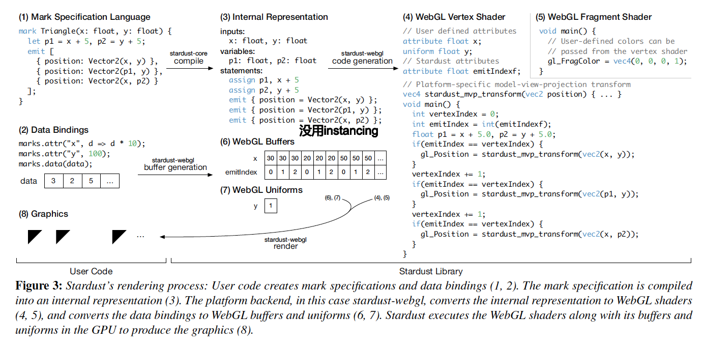
2. Fast Computation of Database Operations using GraphicsProcessors：利用GPU提升计算效率
    1. 早在04年就有人
    2. 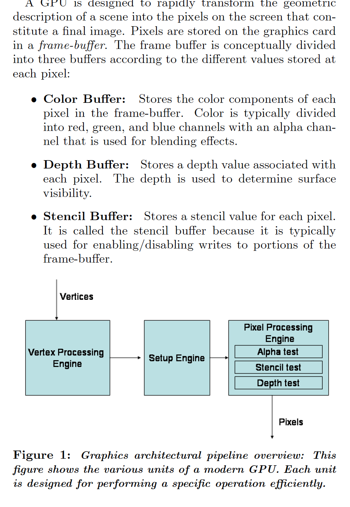
3. P4: 利用webgl做并行计算加速，但提出了通用模型。
    1. 利用GPU渲染管线做并行计算。所有计算拆分为 map/reduce/filter/fetch四个算子，每个操作可以对应到GPU的渲染管线
        1. 例如，map可以用shader并行渲染像素的过程来替代，reduce可以用渲染管线中的alpha blending来替代。
    2. 每次渲染跑两遍程序，第一遍计算并把计算结果放到纹理中，第二遍用纹理中的数据做真正的渲染
    3. 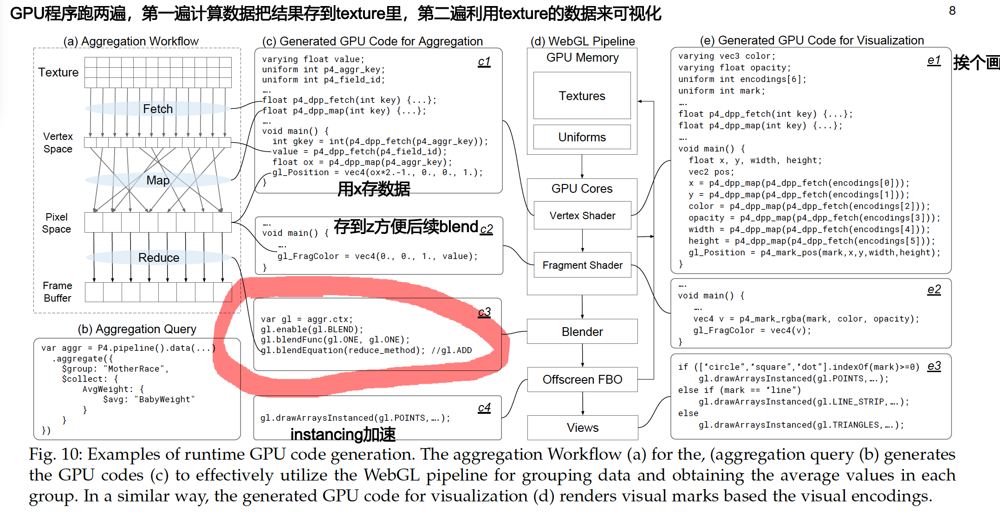
4. SSVG：提升渲染效率
    1. svg 转 webgl + offscreen canvas + worker并行计算，计算块的同时不阻塞主进程的交互。

可扩展性。Scalability

+ Solution: Techniques like data aggregation, sampling, or downsampling (reducing data points) are often used to make large datasets manageable for visualization. Additionally, distributed computing (e.g., using Apache Spark) and GPU acceleration help handle the large-scale computation required for visualizing massive data.
+ As data volume grows, the visualization can become cluttered or too slow to render, making it difficult for users to interpret insights in real time.

事实的性能和响应时间。

Poor performance can frustrate users and lead to delays in decision-making.

多少ms来着？

## 高容量时序数据（high volume）
1. enveloped curve,
    1. 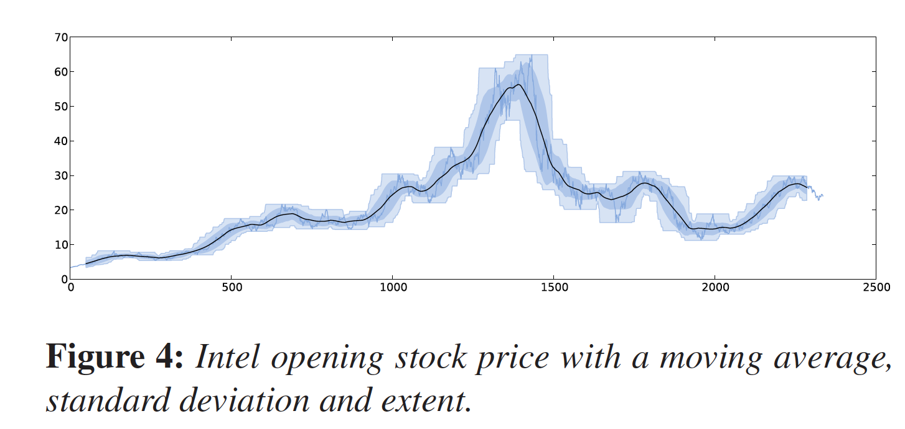
2. M4。时序数据库领域，核心思想是按照像素做 data reduction，提升性能并降低视觉混乱。

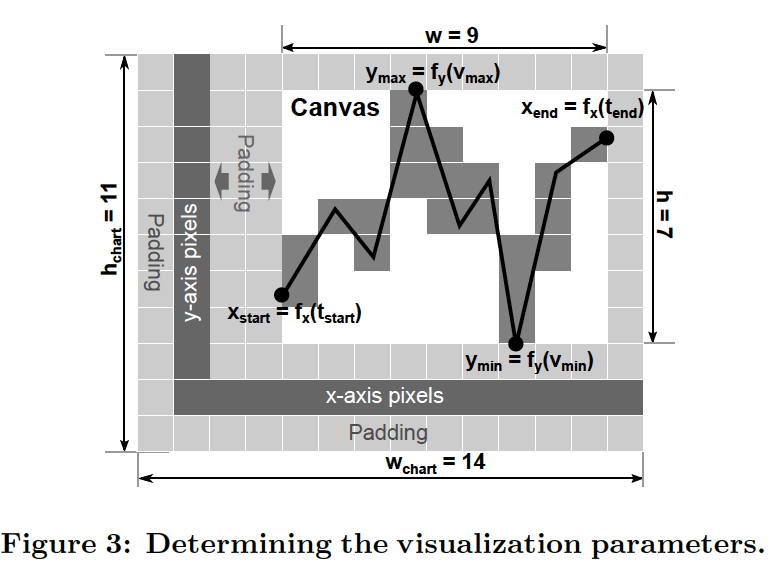

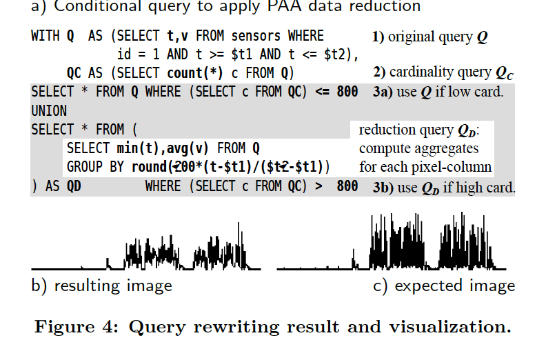

2. 

## 多尺度时序数据
时、天、周、月不同时间尺度的聚合和分析。

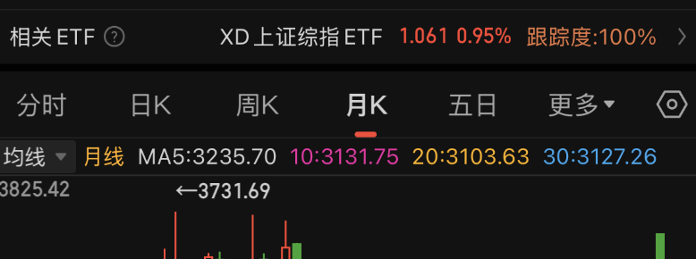

1. Data Cube
    1. 支持 drill down 和 roll up
    2. 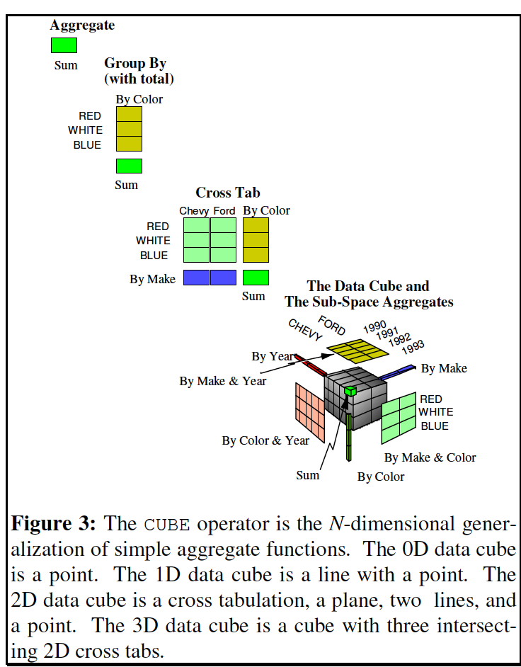
2. Time Lattice
    1. 时间尺度是个偏序集。时序数据的drill down和roll up是有顺序的。以此来优化Data Cube中无意义的 Cuboid。更好地支持detail on demand交互。
    2. 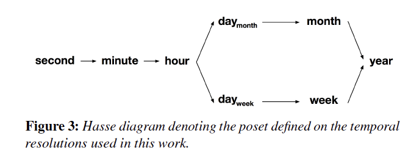
3. Time Notes:

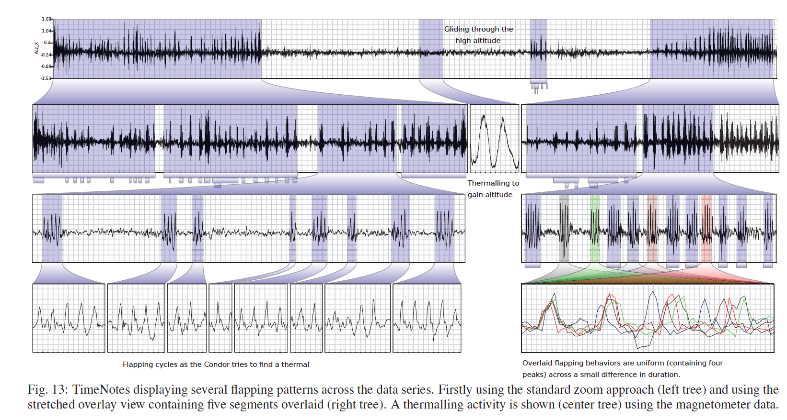

2. M5 - SIGMOD 2024: 
    1. 哈尔小波常用于信号处理、图片压缩等。这里用哈尔小波变换做多尺度时序数据的查询加速。
    2. 哈尔小波默认只能处理2^n的尺度，文中又做了些处理让其支持非2^n的尺度
    3. 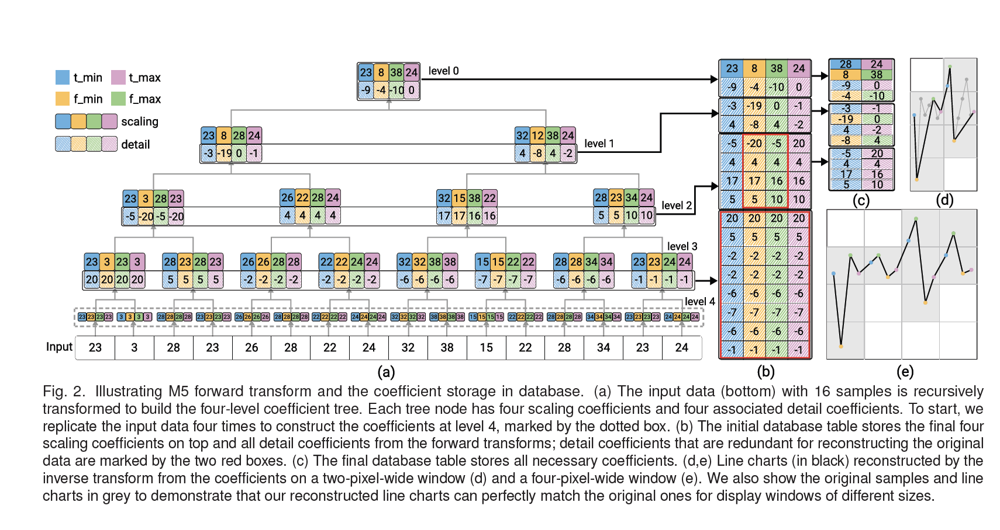
    4. 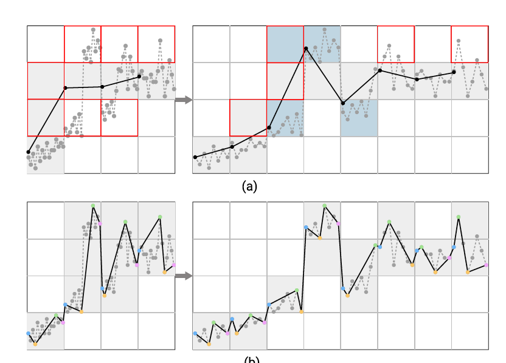

## 流式数据
或是由于数据本身就是实时的，如淘宝直播数据、股票数据等场景；或是由于一下子聚合所有数据再返回结果来做可视化的话，用户等待的时间太长，一些数据是分批次到达的。

1. P5：每次分析一点点
    1. 结合了声明式可视化语法和GPU计算，用于渐进式数据分析与可视化。通过**渐进式数据处理和渲染**，为大数据的交互式分析提供高性能支持，同时允许用户在分析过程中实时干预和引导

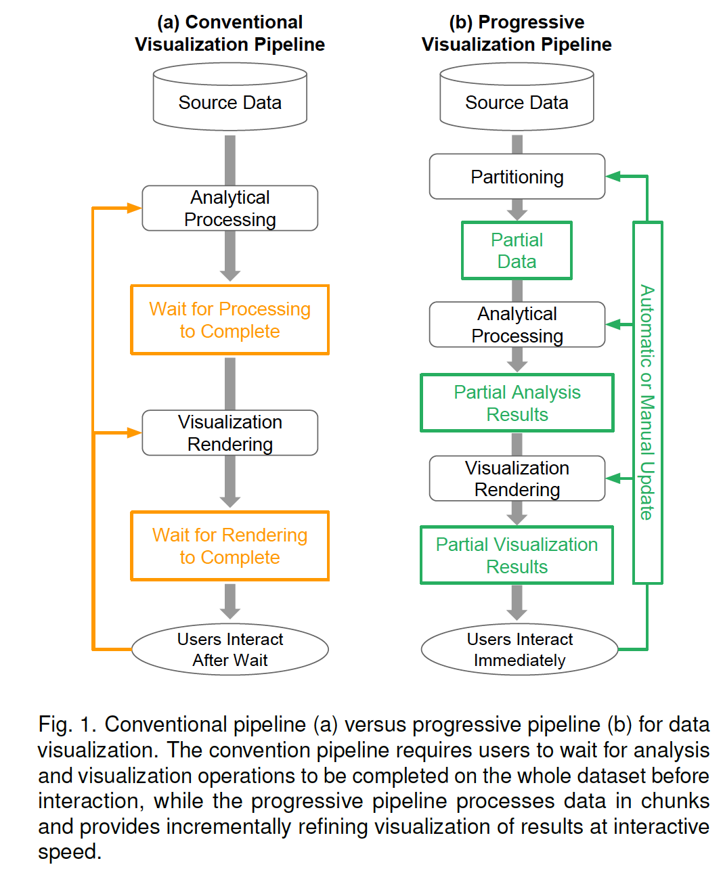

2. Bin-summarise-smooth
    1. 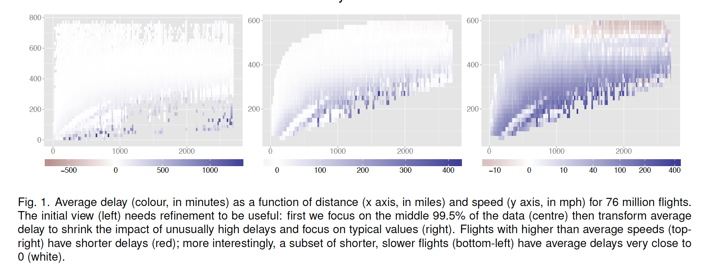
        1. [https://lh3.googleusercontent.com/keep-bbsk/AFgXFlK97T_OKbBdZmjf0d_H9Tx0jitTZIS947EB0CrCWf6DFhhJESMdf95_5pgz7WLOXjNR99guSjrIzPSUsBI8OksQ0A-Fai3Xs9NuFZhHISRiUCdYdOY-wA=s512](https://lh3.googleusercontent.com/keep-bbsk/AFgXFlK97T_OKbBdZmjf0d_H9Tx0jitTZIS947EB0CrCWf6DFhhJESMdf95_5pgz7WLOXjNR99guSjrIzPSUsBI8OksQ0A-Fai3Xs9NuFZhHISRiUCdYdOY-wA=s512)
        2. 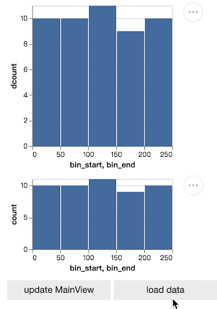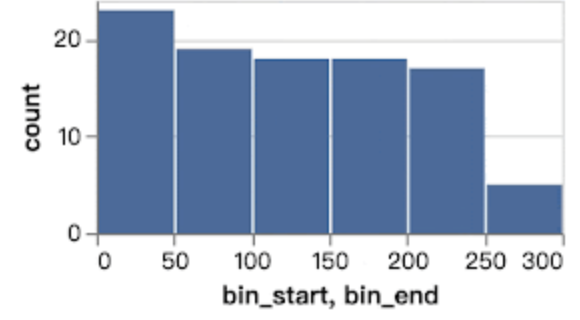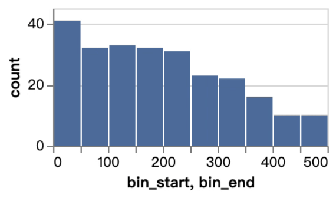
3. Data cube: A relational aggregation operatorgeneralizing group-by, cross-tab, and sub-totals. Data Miningand Knowledge Discovery
    1. 渐进式计算最重要的点是，如何把已有的统计数据，和新到来的统计数据做合并。例如渐进式的直方图中，
    2. distributive 和 algebraic 的操作是可以渐进式地合并的。而holistic的计算只能通过不准确的方式去算，比如Redis中计算基数用的HyperLogLog数据结构、比如计算中位数用的mendian by medians(可用于 kd tree中求划分的超平面)
    3. 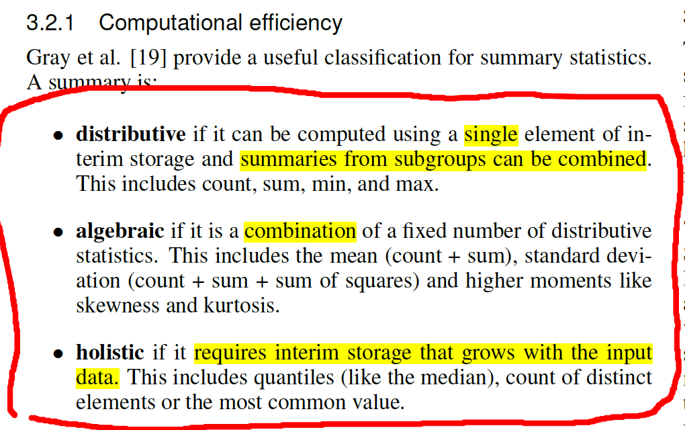
4. 2019_Fekete_practical use cases for progressive visual analytics 这篇论文中分享了更多具体的渐进式可视分析的案例
5. 此外，流数据挖掘的算法种类繁多，分类、聚类、频繁模式挖掘、降维等算法都有在流数据中的改进算法。

## 多维数据
可以用先用PCA等方法做降到二维的时序，再绘制。

也可以通过布局的方式解决，比如时间轴 x n个维度得到 n个图，再用small multiples做绘制

也可以用交互的方式解决，比如只有一个主视图，但用户可以选择当前展示哪一个维度。

可以用交互+布局的方式解决，时间轴之外的其他维度展示为平行坐标系，通过另外的时间选择器来看某个时间点的数据。

Time Wheel：变种平行坐标系。1个时间轴，其他维度轴排在周围。

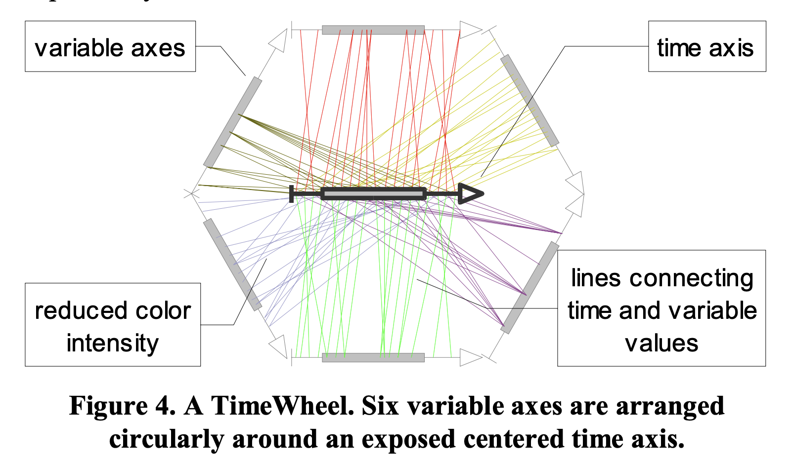

DimpVis：一个时间维度+两个其他维度。结合annotation和交互。hover时展示时间轨迹，然后可以拖动来修改时间。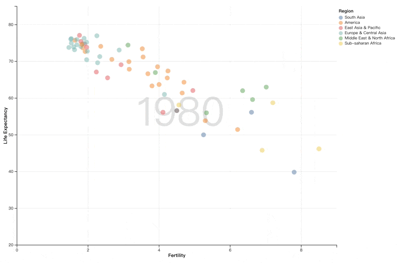

## 应用-金融可视化
### k线图
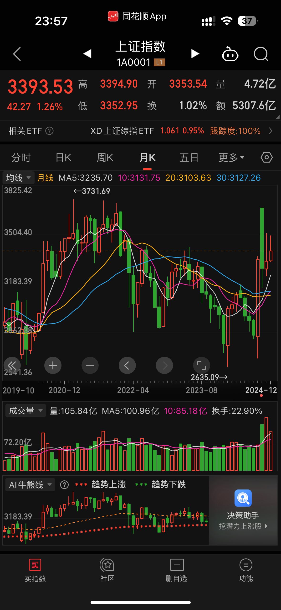

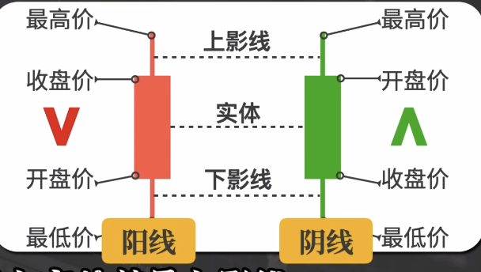

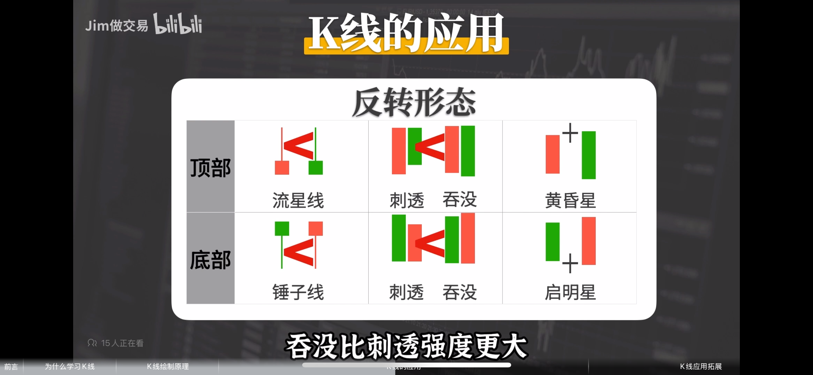

反转形态最大的意义：验证关键位置的支撑阻力

K线描述的是客观的价格走势

K线形态起到的是信号作用

信号的使用要结合相应的位置

### 柱状线（竹节图）

# 人为中心的探索数据分析（**EDA)**
探索式数据分析的目标是通过可视化、统计方法和模式识别等手段，发现数据中的趋势、周期性、异常点和潜在规律。

> All of the high-level analyze cases require the user to **search** for elements of interest within the vis as a mid-level goal. -_ Tamra 2013 TVCG_
>

Tamra认为所有的分析的基础都是“search”，即从原始数据集中“找到”某些特征或规律。时序数据库和在线多维分析中的OLAP（Online Analytical Processing）更是强调实时（Online）查询的重要性。这一小节会重点讲一些时序数据中查询相关的交互技术和查询加速技术。

~~~~

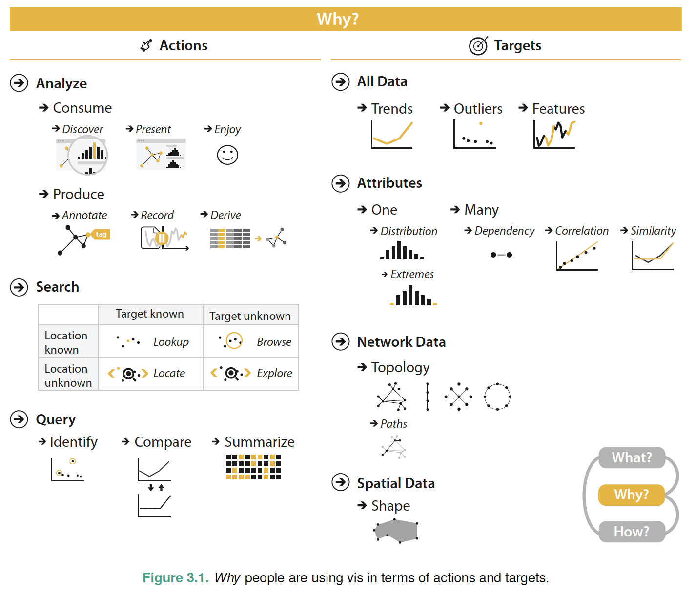

## 表单输入组件
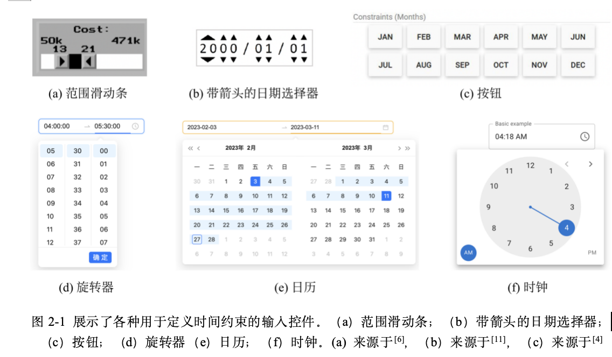

Asta等人将手机触控设备上的各种日期选择控件分成七类：滑动条、单选按钮、数学的、数学对齐的、旋转器、日期选择器以及带箭头的日期选择器。聚焦于三种日期输入方法：下拉菜单、单选按钮和滚轮选择器（Spinner）

+ 完成时间：**下拉菜单**最快（平均6.31秒），单选按钮次之（8.83秒），滚轮选择器最慢（13.25秒）。
+ 错误率：下拉菜单错误率最低（1.28%），滚轮选择器居中（2.49%），**单选按钮**最高（3.16%）。
+ 用户满意度：下拉菜单在舒适性和效率上得分最高（4.25/5），滚轮选择器得分最低（2.34/5），单选按钮得分中等（3.67/5）

## 可视查询组件
通过简单的拖拉拽来做查询

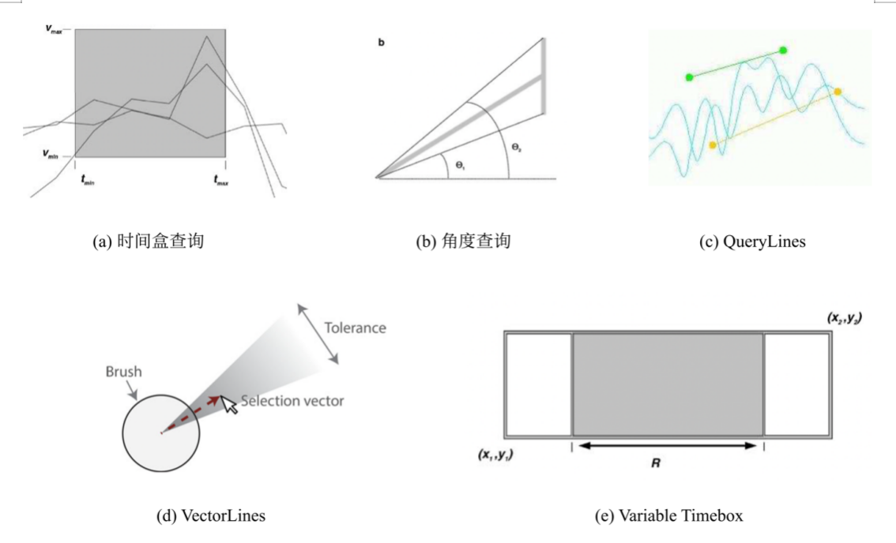

例如，给定一个绘有多条股价随时间变化的曲线的折线图，通过绘制一个在x轴上横跨2016年且在y轴上跨1元到10元的timebox，用户可以选中2016年中股价保持在1元到10元之间的股票

leaders&laggers：找不同时间段，趋势类似的线。如可以用来找相似基因序列。

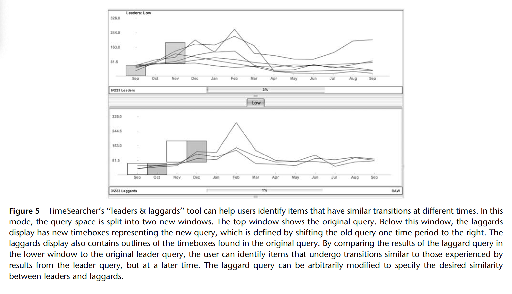

相反趋势的线

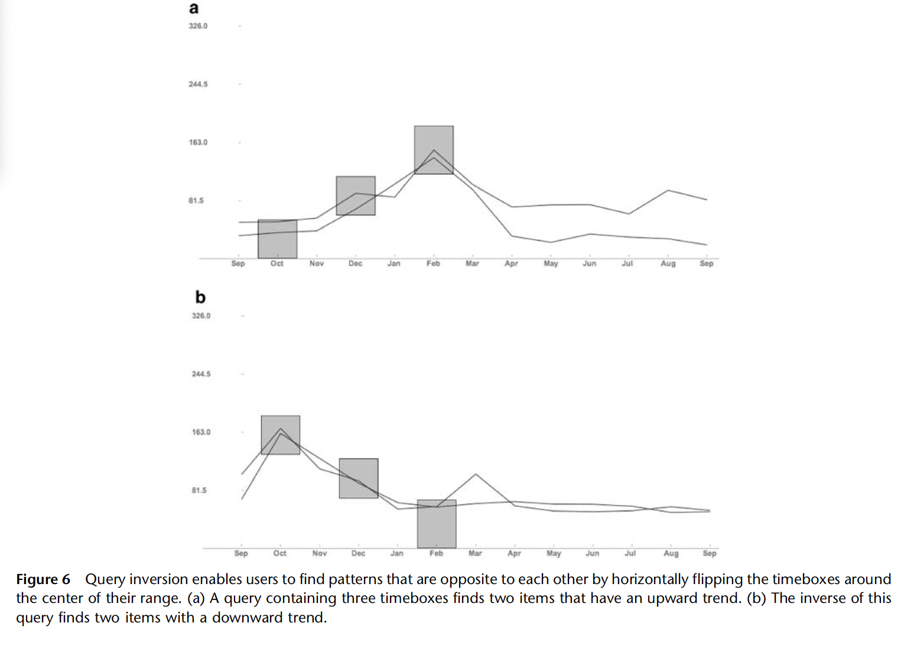

趋势

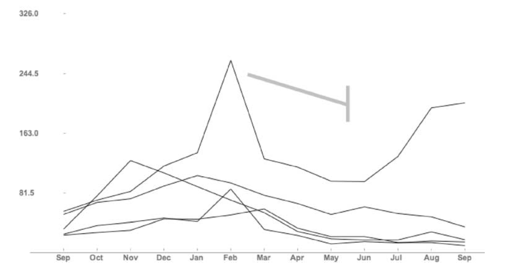

Vector Lens: 经过某个点，且具有某种斜率趋势

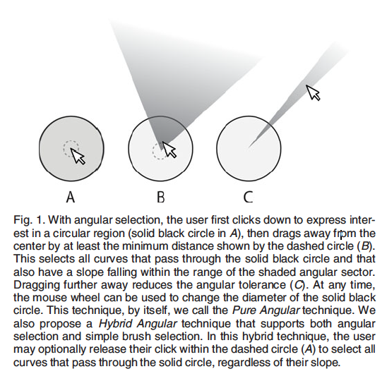

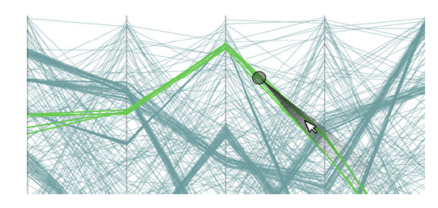

## 手绘草图
1. QuerySketch （2001年 SIG CHI）是第一个使用手绘草图来做时序数据查询的系统。分析者首先绘制一条曲线，然后系统会采用欧氏距离来计算这条曲线与数据库里的时间序列的相似度，并将最相似的时间序列筛选出来放到查询结果集。
    1. 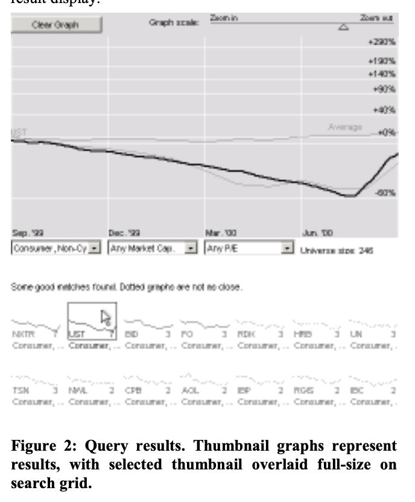
2. Keogh和Pazzani 发现人们理解的“相似”不一定是指严格的较短的欧氏距离。他们采用了主观的“相关反馈”来让用户在绘制结束后的一次次的评分-重新计算相似度的迭代过程中来反复确认查询结果相似程度。首先，用户通过绘制或直接选择时序数据图像上的一段曲线来进行查询的定义。然后，系统将曲线分解为一系列简单直线，每段直线相关的权重代表着这段模式的相对重要程度。系统按照算法选出初始结果集后，用户可以对结果集中的时间序列进行评级，从而产生一个更加完善的查询。经过一次次评级后用户将得到最终结果。但是，这个过程需要人不断对结果进行评估和打分，比较耗时。
    1. 
3. 在上述系统中，相似度的定义与手绘曲线的定义是两个分离的步骤，用户需要先绘制完曲线并查到结果后才能再在相关面板调整查询“相似度”的阈值。Holz和Feiner 意识到，相似程度可以在绘制曲线时就定义好。例如，曲线上绘制越慢的部分意味着用户在这部分绘制得越仔细，也就意味着需要更大的相似度；绘制快的地方意味着用户更不在意这部分，系统也就允许在这部分进行不那么精准的匹配。“宽松的选择技术”会先将用户绘制的曲线近似成几段直线，然后再在折线的每个拐角处创建一个圆形查询（半径查询）。圆的半径由系统推测出的相似度来决定。这样的设计还存在着一个巨大的优势：无需反复地评级，用户可以在绘制结束之后通过调整圆的位置和半径来进一步地调整查询意图。
    1. 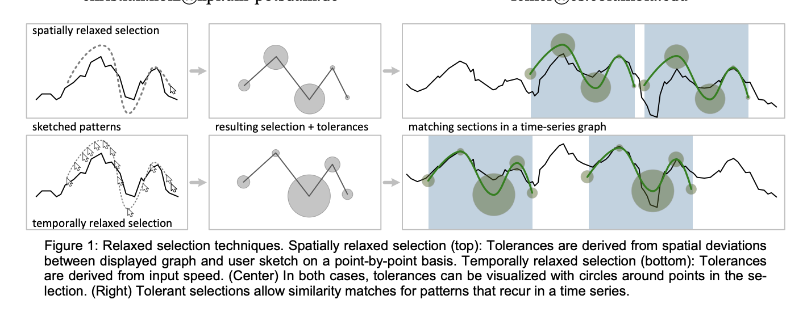

## 查询语法和正则表达式
1. SQL/LPP 对SQL做了扩展，为SQL 补充了描述面向序列数据的模式查询的能力。例如，用户可以查询价格在某段时间内一直上升的股票。作为SQL 的扩展，SQL/LPP 使得本就不简单的SQL语法变得更加复杂。
2. 专注于时序数据，且站在更高的可视化的角度而非原始数据的角度来看待时间序列中的查询这一问题，ZQL为时序数据中的趋势查询和模式查询提供了简单易用的语法。用户可以轻易地指定多维时序数据的某个可视化形式，并查询与该可视化相似的时序曲线。
    1. 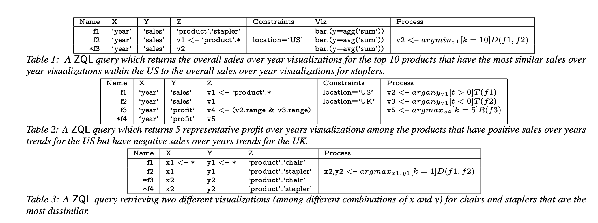
3. ShapeSearch 提供了少量种类的原语和操作符，允许用户通过更加简单的原语加操作符语法形式来描述更加复杂的时间序列形状查询。例如，通过用户指定了一条从点（2，10）到点（10，100）的线段，并希望查询形状与这条线段类似的曲线。更抽象更简洁的语法使得ShapeSearch可以很轻易地被用户所学习和使用。主要考虑的都是趋势查询和形状查询.
    1. 定义了语法。
    2. 定义了判断是否符合某个pattern的方法、打分系统。
    3. 定义了加速方法。
    4. 很多金融量化领域的模式，都可以用这个来查。

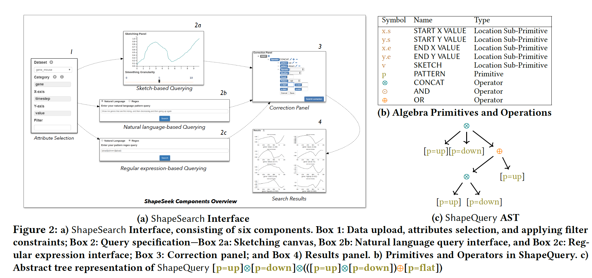

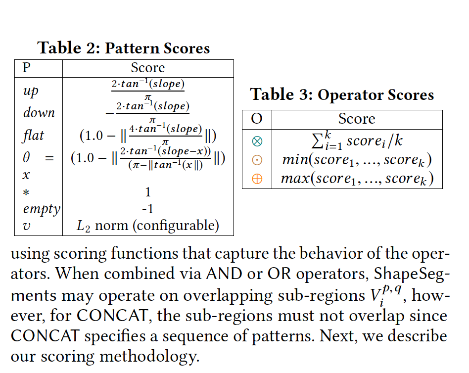

## 自然语言
ShapeSearch（2023 sigmod 最爱论文） 允许用户通过语音输入来指定想要查询的时间序列模式。例如，用户可以通过口述“请展示先上升，再下降，而后继续上升的数据”这句话来寻找指定模式的时间序列。同样，分析宇宙数据的科学家可以通过口述“找到存在一个亮度峰值的对象”这句话来搜索超新星（明亮的恒星爆炸）。

Tableau 的 Eviza（A natural language interface for visual analysis）提供了更加强大的自然语言处理的支持，用户输入“寻找加利福尼亚附近的大地震”，系统会自动将“大”这一描述符与地震属性关联起来，将“近”与地理位置属性关联起来。

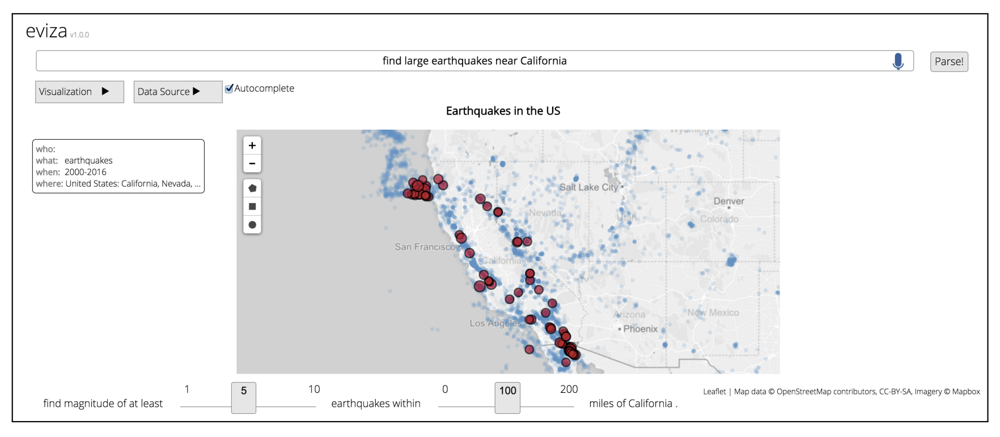

## 其他查询加速方法
1. CCH KD Tree：改造的 KD Tree，适合在很多线中做近邻查询等

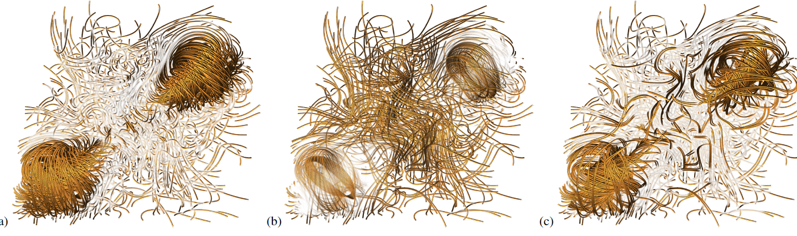

2. KD-BOX：用CCH KD Tree 来加速折线图的范围（timebox）、趋势（angular）、近邻查询等。
    1. 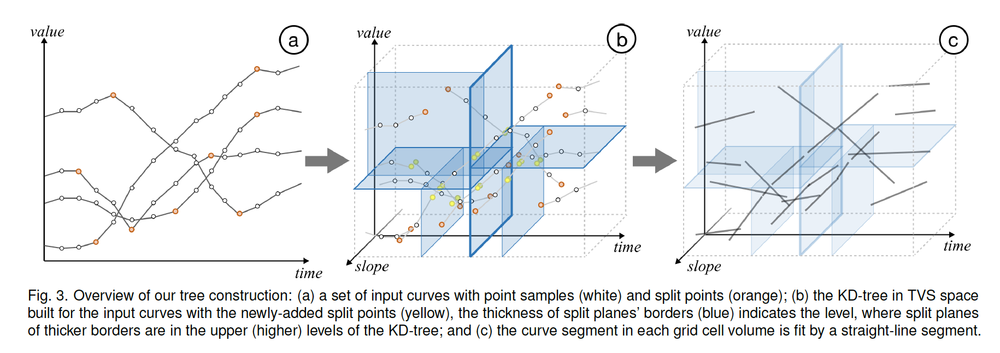
3. Data Cube等

## 应用 - 量化中的均线分析方法
涉及不同时间尺度的聚合查询（rollup and drill down）。

历史数据，趋势

综合观察长、中、短期移动平均线，可以判断市场的多重倾向。

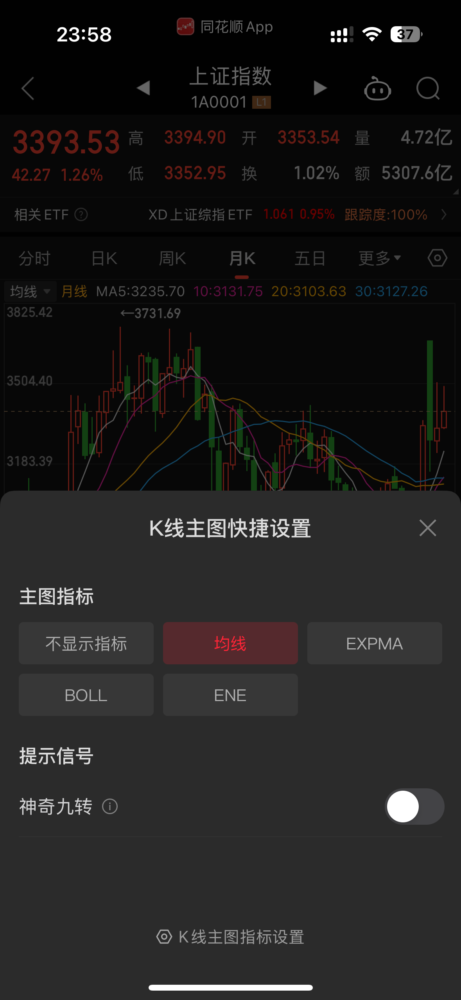

### 黄金交叉与死亡交叉
黄金交叉牛市，死亡交叉熊市

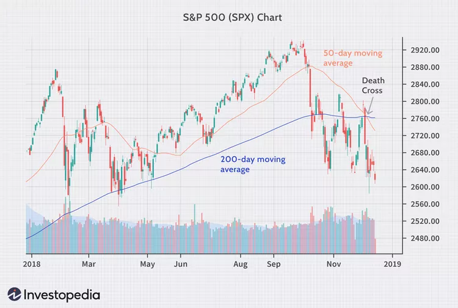

### 多头排列、空头排列与死亡排列
短期均线在最上面，中期均线在中间，长期均线在最下面，并且三条均线同时向上移动的排列形态即为多头排列，这是非常典型的买进信号，在多头排列的强烈支撑之下，价格会大幅上涨。

三根均线同时以圆弧状向下运行，且从上到下时间越来越短，一般来说，一旦均线形成空头排列，尤其是经历过一段大幅上涨后的空头排列，意味着价格将会继续下跌。

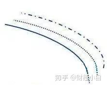

### 逐浪上升与逐浪下降
短期、中期均线沿着长期均线的上升轨迹呈波浪向上运行，意味着价格有较大的上升空间，虽然中间会有小幅下跌，但空方没有持续能力，多方占据优势。

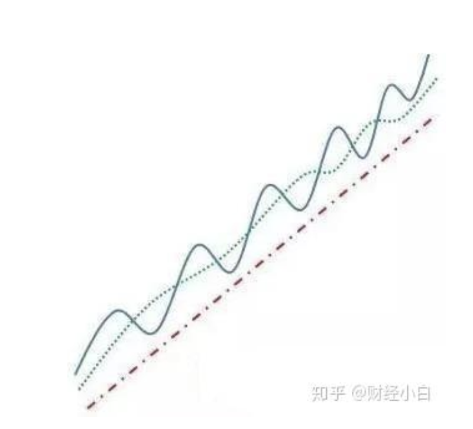

### 向上爬坡
是一个基础技术指标，当短期移动平均线超过长期移动平均线时。当这个事件发生时，一般认为是一个牛市的信号，也就是看涨信号，买入。而这个短期，一般是50个周期，比如50天；而长期，一般说200个周期，比如200天。在数字货币里面，这个周期也可以是50、200小时或分钟。当然，这里的50或200个周期，也是可以修改的。

### 死亡谷
当上升的均线系统整体发生逆转的时候，就会形成死亡谷，短期均线向下穿过中/长期均线，中期均线向下穿过长期均线，形成一个头冲下的不规则三角形或者叫扇形区域。如果死亡谷出现在价格大幅上涨之后，代表着接下来会有个极大的下降空间。

  

### 注意
这些基本都可以用shape search的论文查出。

简单、直观、客观，但滞后于价格走势

均线有助涨助跌作用？=》均线的状态会影响价格波动 =>市场中的资金时依据均线进行交易。

均线会影响情绪

# 数据为中心的模型和算法
## 时序数据分析

## 智能可视化
1. PowerBI
    1. trend: 拟合线性回归，求cost
    2. change point detection: paper_Selective review of o ine change point detection method
    3. forecasting: paper_time series forcasting with deep learning a survey
    4. correlation：DTW（Dynamic Time Wrapping，动态时间规整）。非线性对齐。

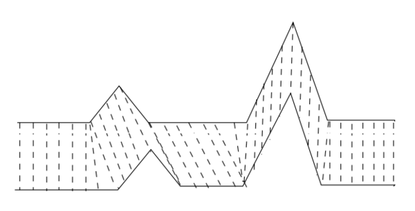

DTW还可以用于比较人体动作轨迹（例如手势）的相似性。

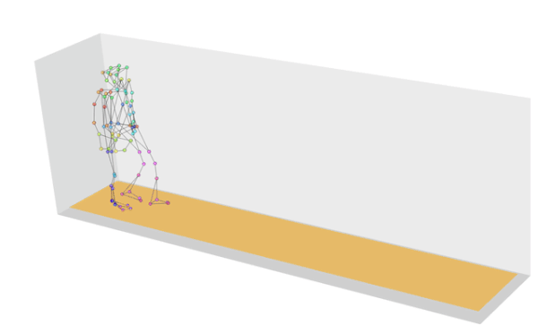

2. VizLint

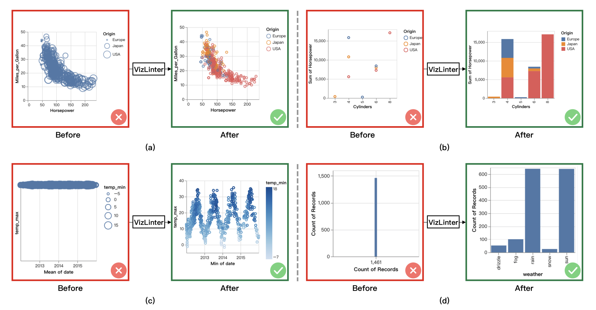

问题：现有的自动化可视化工具虽然可以快速生成图表，但生成的结果不一定符合输入数据或可视化设计原则，用户需要手动调整。然而，许多用户缺乏足够的可视化知识，即使是专家也可能犯错。

目标：开发一个框架，帮助用户检测可视化中的错误并自动修复，以提升可视化设计的准确性与效率。

方法：定义了 41 条规则，涵盖以下四类常见问题：

1. 单一编码通道内部的不兼容问题：如数据类型与编码通道不匹配。
    1. 数据字段的类型与编码通道不兼容（如将分类数据映射到大小通道）。
    2. 数据字段的聚合类型与数据字段本身的属性不匹配（如对分类字段使用求和聚合）。
    3. 同时对一个数据字段应用了 bin（分箱）和 aggregate（聚合），这是不合法的。
    4. 。。。
2. 多编码通道之间的不兼容问题：如重复使用同一通道。
    1. 重复使用同一数据字段或通道。
    2. X轴和Y轴同时使用相同的聚合方法（如同时对两个轴进行计数）。
3. 编码通道与标记类型之间的不兼容问题：如不适合的标记类型与通道组合。
    1. 标记类型不支持某些通道（如柱状图不支持大小通道）。
    2. 标记类型与数据属性不匹配（如对负值数据使用柱状图的堆叠功能）。
4. 语法错误或输入拼写问题：如非法声明。
    1. 标记类型拼写错误（如 point 被拼写为 pont）。
    2. 数据字段声明错误（如使用不存在的字段名）。

3. MS 23年提出的 LIDA，发表在ACL2023。视频：[https://microsoft.github.io/lida/](https://microsoft.github.io/lida/)
+ 概括：通过结合大型语言模型（LLMs）和图像生成模型（IGMs），实现自动化、语法无关的数据**可视化和信息图**生成。
+ 对比之前power BI 的工作，特征提取、可视化代码全部由大模型来做。
+ 模块化多阶段生成框架：提出一个由四个模块组成的多阶段生成流程：数据总结（Summarizer）、目标探索（Goal Explorer）、可视化生成（VisGenerator）和信息图生成（Infographer）。将可视化生成问题重新定义为多步骤的文本和代码生成任务。
    - 信息图生成：利用文本条件图像生成技术（如Latent Diffusion模型），创建既美观又数据忠实的个性化信息图。
    - 自动化与用户控制结合：提供完全自动化模式（系统生成可视化目标）和半自动化模式（用户指定目标）。
    - 自评估与修复功能：引入自评估指标（如可视化错误率VER和自评估质量SEVQ），并支持自动修复生成的可视化。

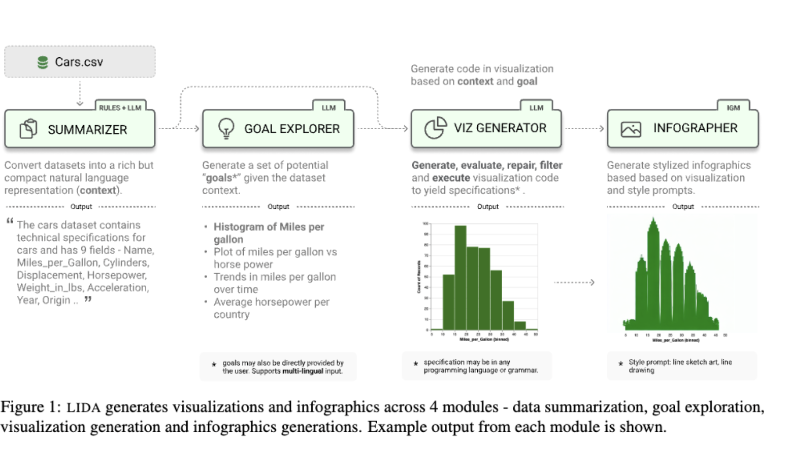

## 时间序列模型

1. UniTS：构建统一时间序列模型的里程碑

大一统时序模型

面对时间序列分析领域的独特挑战，如数据多样性、任务差异性及特定需求等，UniTS应运而生。作为一款统一的时间序列模型，UniTS凭借其创新的网络架构，融合了序列与变量注意力机制及动态线性算子，实现了对分类、预测、插补及异常检测等多元任务的全面支持。

在横跨38个领域的数据集测试中，UniTS不仅超越了特定任务模型，更在零样本、少量样本学习及提示学习能力上展现出非凡实力，为时间序列分析树立了新的标杆。

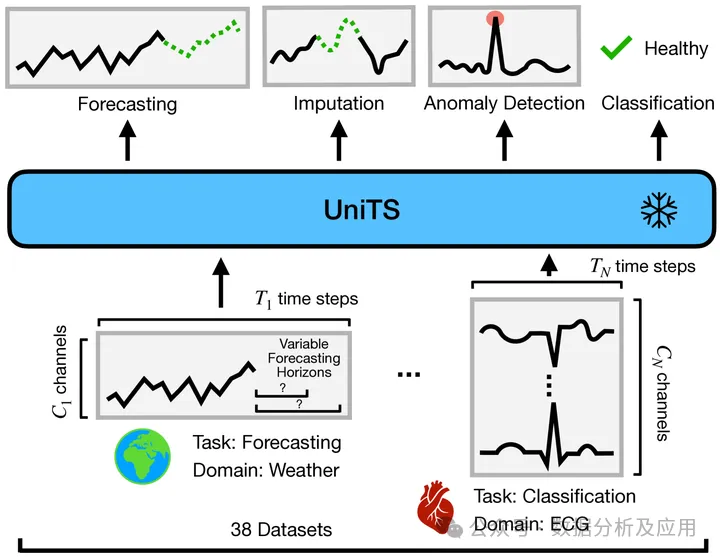

2. TIME-LLM：大型语言模型在时间序列预测中的重塑

TIME-LLM的提出，标志着大型语言模型（LLMs）在时间序列预测领域的崭新应用。通过创新的重新编程框架，TIME-LLM成功地**将时间序列数据模态与自然语言模态对齐**，利用LLMs强大的模式识别与推理能力进行预测。

结合Prompt-as-Prefix（PaP）策略，TIME-LLM在少量样本及零样本学习场景下同样表现出色，其性能超越了众多先进的专业预测模型，为时间序列预测开辟了全新的路径。

3. Chronos：解锁时间序列的“语言”

Chronos，作为一款预训练概率时间序列模型框架，通过创新的标记化方法与Transformer架构的结合，实现了对时间序列数据的深度学习与理解。

在广泛的基准测试中，Chronos不仅在训练数据集上展现出卓越性能，更在新数据集上实现了令人瞩目的零样本预测能力，证明了其强大的泛化潜力。Chronos的成功，为时间序列预测领域预训练模型的广泛应用奠定了坚实基础。论文标题：Chronos: Learning the Language of Time Series

4. Lag-Llama：迈向概率时间序列预测的基础模型

Lag-Llama的推出，标志着时间序列预测领域基础模型开发的重要进展。作为一款基于解码器Transformer架构的通用单变量概率时间序列预测模型，Lag-Llama通过预训练大量跨领域时间序列数据，实现了强大的零样本泛化。论文标题：Lag-Llama: Towards Foundation Models for Probabilistic Time Series Forecasting

在跨领域下游数据集上的测试中，Lag-Llama不仅展现了与现有深度学习方法相媲美的性能，更在微调后实现了显著超越，为时间序列预测领域的基础模型研究树立了新的里程碑。

# 总结
介绍了时序数据的可视化和分析方法。

# 参考资料
1. 2016 - TVCG - Tamara - Timelines Revisited: A Design Space andConsiderations for Expressive Storytelling
2. 2013 - TVCG - Tamara - A Multi-Level Typology of Abstract Visualization Tasks
3. 2021 - TVCG - Nan Cao - Survey on Visual Analysis ofEvent Sequence Data
4. 2021 - TVCG - Nan Cao - VizLinter: A Linter and Fixer Framework for Data Visualization
5. 2017 - VLDB -  I’ve Seen “Enough”: Incrementally ImprovingVisualizations to Support Rapid Decision Making
6. 2018 - TVCG - Dominik - Visualizing a Million Time Series withthe Density Line Chart
7. 2021 - Euro Vis - Line Weaver: Importance-Driven Order Enhanced Rendering of Dense Line Charts
8. 2021 - TVCG - Scalable Scalable Vector Graphics:Automatic Translation of InteractiveSVGs to a Multithread VDOM for Fast Rendering
9. 1997-TVCG-Data cube: A relational aggregation operatorgeneralizing group-by, cross-tab, and sub-totals. Data Miningand Knowledge Discovery,
10. 2022 - TVCG - Yunhai Wang - KD-Box: Line-segment-based KD-tree for Interactive Exploration of Large-scale Time-Series Data
11. 2021 - TVCG - Yunhai Wang - Curve Complexity Heuristic KD-trees for Neighborhood-based Exploration of 3D Curves
12. 2019 - TVCG - P5: Portable Progressive Parallel Processing Pipelinesfor Interactive Data Analysis and Visualization
13. 2018 - TVCG - P4: Portable Parallel Processing Pipelinesfor Interactive Information Visualization
14. 2013 - TVCG - Bin-summarise-smooth: A framework for visualising large data
15. 2019-Fekete-practical use cases for progressive visual analytics 
16. 2004 - Fast Computation of Database Operations using GraphicsProcessors
17. 2024 - Pacific Visualization  - Are LLMs ready for Visualization?
18. 2020 - SIGMOD (best paper) - ShapeSearch: A Flexible and Efficient System for Shape-based Exploration of Trendlines 
19. 2016 - J.D. Fekete - How Progressive Visualizations Affect ExploratoryAnalysis
20. 2019 - TVCG - Bongshin - Charticulator: Interactive Construction of Bespoke Char tLayouts
21. 2023 - Arxiv - Microsoft - LIDA: A Tool for Automatic Generation of Grammar-Agnostic
22. 2024 - ICLR - TIME-LLM: TIME SERIES FORECASTING BY REPROGRAMMING LARGE LANGUAGE MODELS
23. 2024 - Neurips - UNITS: A Unified Multi-Task Time Series Model
24. 2022- CHIRA -A comparison of date selection elements on mobile touch devices in eCommerce sites
25. 2014 - SIGMOD - M4: A VisualizationOrientedTime Series Data Aggregation
26. 1997 - Data Cube: A Relational Aggregation Operator GeneralizingGroup-By, Cross-Tab, and Sub-Totals
27. 2016-TVCG-Eviza: A natural language interface for visual analysis
28. 2001 - CHI - Sketching a graph to query a time-series
29. 2004 - Axes-Based Visualizations with Radial Layouts
30. 2023 - ACL - Mircorsoft - LIDA: A Tool for Automatic Generation of Grammar-Agnostic

Visualizations and Infographics using Large Language Models

31. [https://academy.binance.com/en/glossary/golden-cross](https://academy.binance.com/en/glossary/golden-cross)
32. [https://www.investopedia.com/ask/answers/121114/what-difference-between-golden-cross-and-death-cross-pattern.asp](https://www.investopedia.com/ask/answers/121114/what-difference-between-golden-cross-and-death-cross-pattern.asp)
33. [前沿！时序大模型研究进展！](https://mp.weixin.qq.com/s?__biz=MzIzNzQwMzMzMw==&mid=2247535162&idx=1&sn=a05a8d948e0fafea9210d292322b34da&chksm=e9975df6bdc058b0d54febbe1b80e1aedaf4640edde0940795f9c5c67f28911b2d5b9e76912d&scene=27)

Visualizations and Infographics using Large Language Models

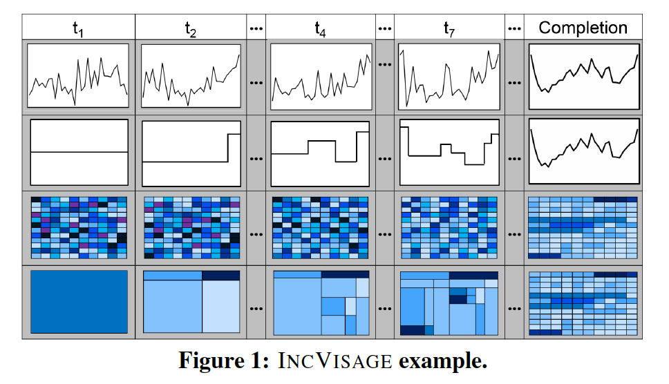

意图驱动的可视化

> 更新: 2025-10-08 07:35:07  
> 原文: <https://www.yuque.com/viruspc/el3mi0/qdheo0btp0dhbazv>