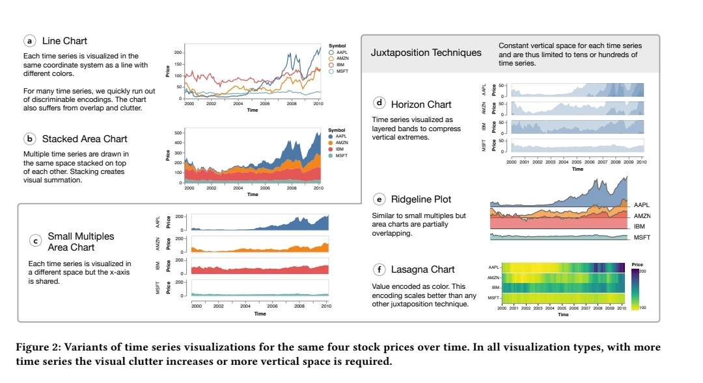

# Summary

1. Which type of visualizations suffers from visual clutter?
    1. scatter plot
    2. line chart
    3. parallel coordinate plots (PCPs)
2. How to reduce visual clutter with feature encoding?
    1. General
        1. a new representation
            1. density
            2. edge bunding
            3. space-time cubes
            4. ....
        2. only show the most important lines
            1. representative line
        3. cluster
    2. visulization type specified
        1. PCPs:
        2.  reordering the axes 
        3. Hierarchical Parallel Coordinates
        4. Image processing techniques
        5. 
3. Line rendering
    1. multiple graphs
    2. an average angle of 45 degrees should be kept between adjacent line segments.

## 

> 更新: 2021-11-10 01:44:55  
> 原文: <https://www.yuque.com/viruspc/el3mi0/vm33ii>