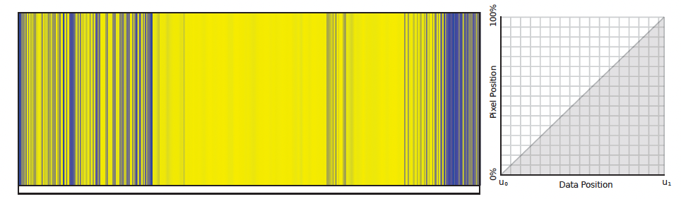
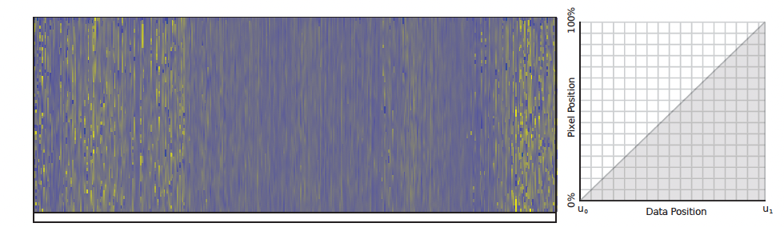
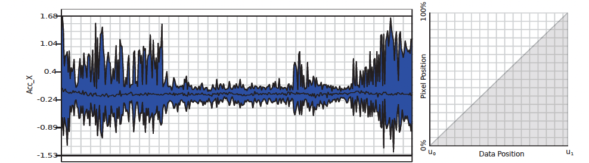
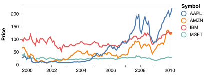
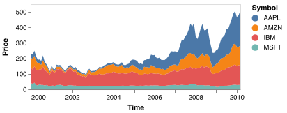
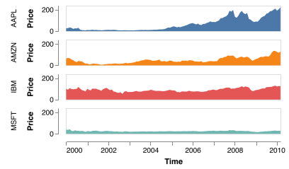
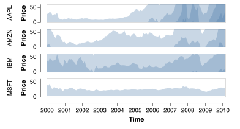
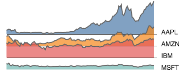
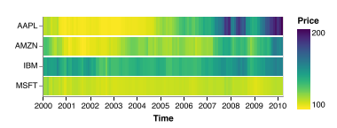

# Time Series

- [Tasks](#tasks)
- [Visualization Methods](#visualization-methods)
  * [Single Time Series](#single-time-series)
  * [Multiple Time Series](#multiple-time-series)
- [Interaction Methods](#interaction-methods)
- [References](#references)

---

high-level framework for analyzing vis use according to three questions: what data the user sees, why the user intends to use a vis tool (**task**), and how the **visual encoding** and **interaction** idioms are constructed in terms of design choices. [3]

A dataset has **time-varying** semantics when time is one of the key attributes, as opposed to when the temporal attribute is a value rather than a key.

A common case of temporal data occurs in a **time-series** dataset, a special case of tables, where time is the key. These timevalue pairs are often but not always spaced at uniform temporal intervals. 

Typical time-series analysis **tasks** involve finding trends, correlations, and variations at multiple time scales such as hourly, daily, weekly, and seasonal

The word** dynamic** is often used ambiguously to mean one of two very different things. Some use it to mean a dataset **has timevarying semantics**, in contrast to a dataset where time is not a key attribute, as discussed here. Others use it to mean a dataset **has stream type**, in contrast to an unchanging file that can be loaded all at once. In this latter sense, items and attributes can be added or deleted and their values may change during a running session of a vis tool.

## Tasks
1. filter
2. aggregation
3. trending

## Visualization Methods
### Single Time Series
1. Pixel Plot (from Kincaid et al.)
    1. 
2. Two-dimensional pixel plot (from Hao et al.)
    1. 
3. River plot (from Buno et al.)
    1. 

### Multiple Time Series
1. Shared space techniques
    1. Line Chart

    2. Stacked Area Chart

easy to compare

2. Create separate charts ffor each time series (Juxtaposition)
    1. Small multiples Area Chart

    2. Horizon Chart

    3. Ridgeline Plot

    4. Lasagna Chart

the order matters 

hard to compare

3. LiveRAC
4. Density visualizations
    1. opacity
        1. If the opacity is set too low, individual outlier lines may become invisible. If the opacity is set too high, dense regions with different densities become indistinguishable.
    2. smooth
    3. binning(heatmap)
    4. With hundreds or thousands of time series it becomes less important to trace individual lines. Analysts often want to know the amount of data in regions of a particular time and value.  Density alone is sufficient to see trends, clusters, and other patterns, and to recognize outlier regions

## Interaction Methods
+ focus context
+ overview detail
+ interactive query
    - time-box, kd-box
    - shape search
    - sketch
    - lens based techniques: SignalLens, Smooth SignalLens, RiverLens, ChronoLens

PCP用于展示数据分布，散点图判断相关性

## References
[1] Moritz, Dominik and Danyel Fisher. “Visualizing a Million Time Series with the Density Line Chart.” _ArXiv_ abs/1808.06019 (2018): n. pag.

[2] W. Javed, B. McDonnel and N. Elmqvist, "Graphical Perception of Multiple Time Series," in _IEEE Transactions on Visualization and Computer Graphics_, vol. 16, no. 6, pp. 927-934, Nov.-Dec. 2010, doi: 10.1109/TVCG.2010.162.

[3] Visualization Analysis and Design

Time Lattice: A Data Structure for the Interactive Visual Analysis of Large Time Series

> 更新: 2023-03-01 08:52:26  
> 原文: <https://www.yuque.com/viruspc/el3mi0/ytecce>