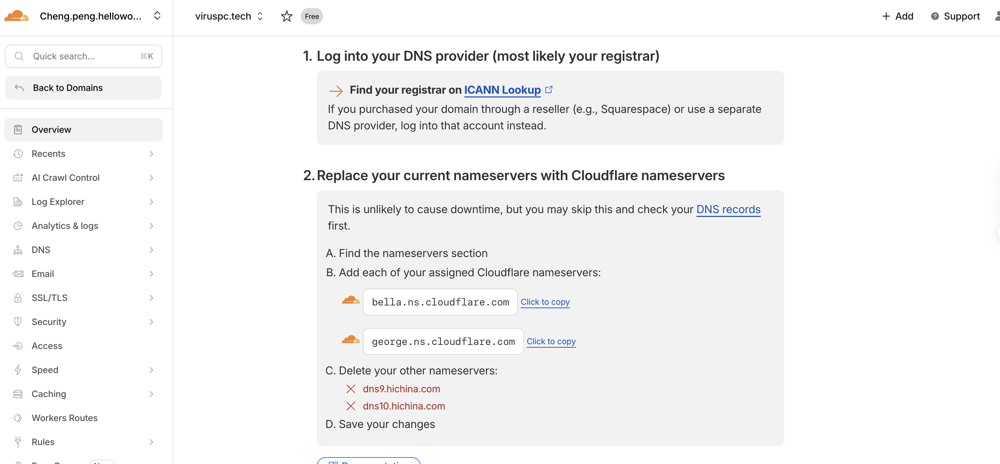
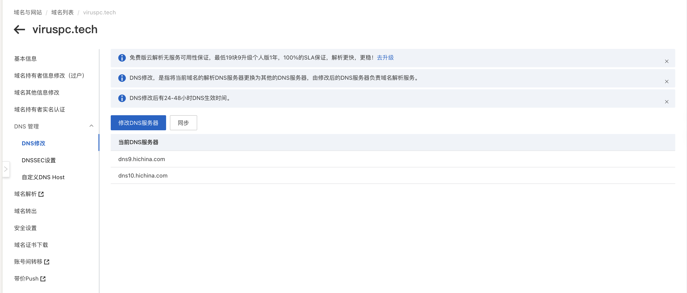

# 内网穿透

最方便的做法：cloudflare tunnel + docker cloudflared

优点：方便，不需要公网IP

缺点，网络延迟和带宽

1. 阿里云接入 cloudflare 的DNS服务器(注意提前先在 Cloudflare 把 DNS 配好；提前1天将阿里云域名的TTL调低，比如5分钟，避免中间有段时间连不上自己的相关网站)
    1. [https://dash.cloudflare.com/54d4f45267449095f5ac48daec523441/viruspc.tech/nameserver-directions](https://dash.cloudflare.com/54d4f45267449095f5ac48daec523441/viruspc.tech/nameserver-directions)
        1. 
    2. [https://dc.console.aliyun.com/?spm=5176.100251.111252.64.59564f15OPjlTH#/domain/details/dns-modify?saleId=S20214T17WS72253&domain=viruspc.tech](https://dc.console.aliyun.com/?spm=5176.100251.111252.64.59564f15OPjlTH#/domain/details/dns-modify?saleId=S20214T17WS72253&domain=viruspc.tech)
    3. 
2. cloudflare 开启zero
3. cloudflare 配置 tunnel
4. nas docker下载cloudflared镜像

> 更新: 2026-02-04 16:08:33  
> 原文: <https://www.yuque.com/viruspc/el3mi0/eqm8ru5o9r1rv10v>