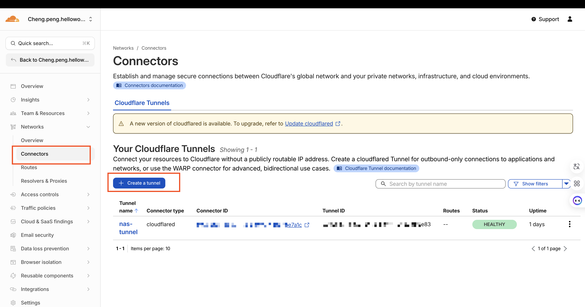
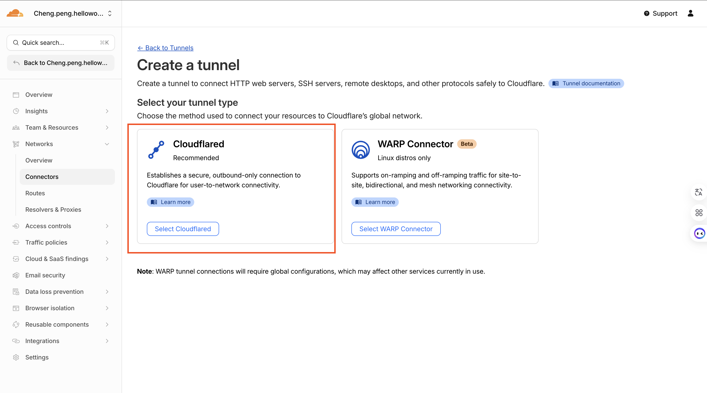
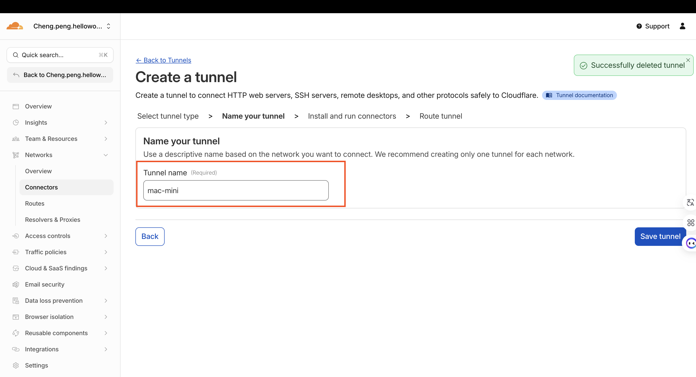
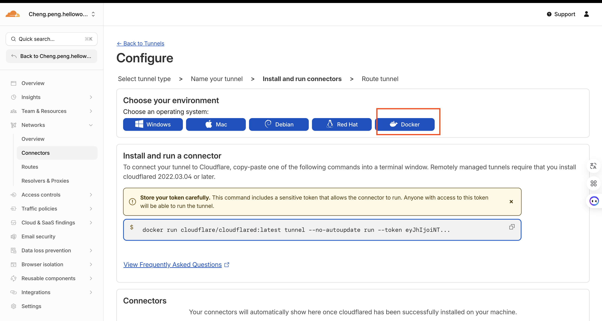
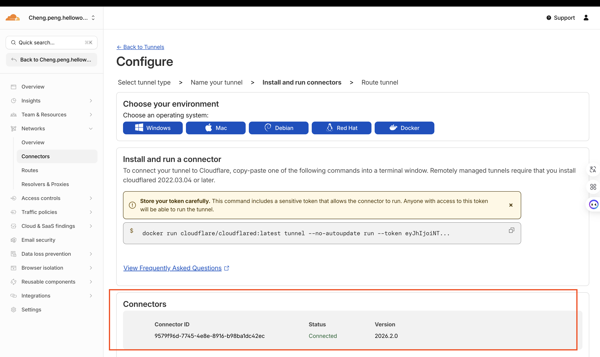
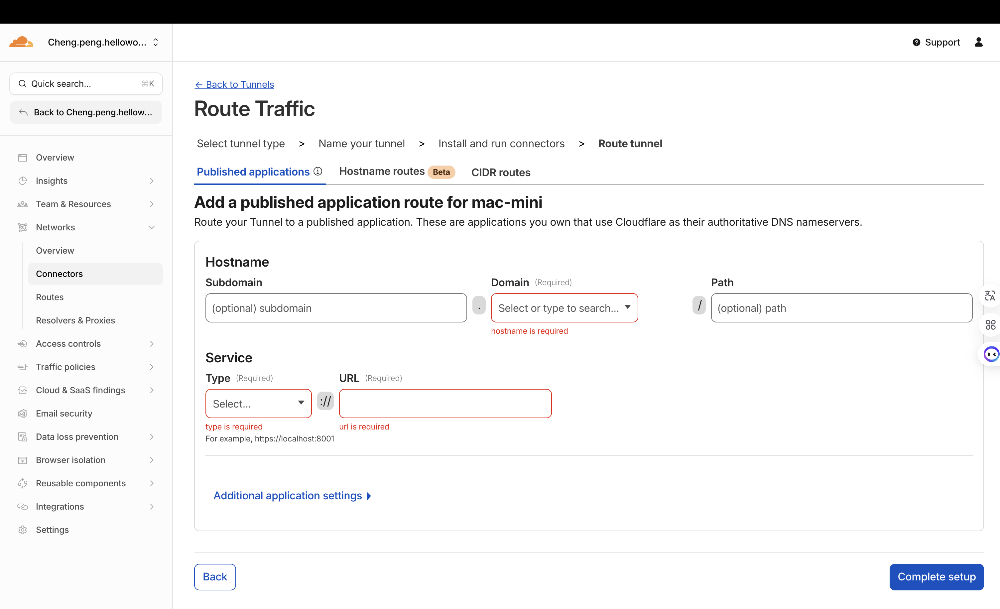
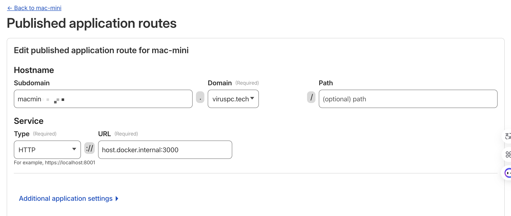

# 内网穿透 - Cloudflare Connector

前置条件：DNS 从阿里云切到cloudflare

一般用docker。记得用tmux开个后台进程。

连接成功后会显示状态

配置domain

注意下，cloudflared跑在docker时，这里要用host.docker.internal

> 更新: 2026-02-19 18:28:59  
> 原文: <https://www.yuque.com/viruspc/el3mi0/brhydnxk0e1kaw7e>