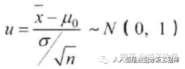
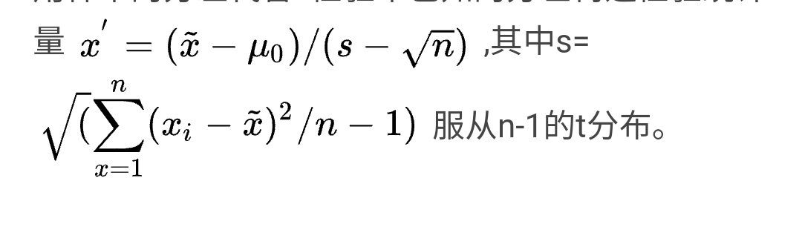

# 假设检验

- [假设检验](#%E5%81%87%E8%AE%BE%E6%A3%80%E9%AA%8C)
- [检验统计量](#%E6%A3%80%E9%AA%8C%E7%BB%9F%E8%AE%A1%E9%87%8F)

---

# 假设检验
核心思想:反证，拒绝零假设。通过小概率事件的出现，否定原假设。为什么反证？直接证明工作量很大。反证只要有一个例子就可以证明错误。

“小概率”的定义是将p-value与预先设定的显著性水平  进行对比，如果p-value小于  ，就可以推翻原假设。

[统计学基础知识4——假设检验原理、步骤、两类错误](https://zhuanlan.zhihu.com/p/262274195)

1. 提出假设。原假设/零假设/null hypothesis, 备择假设
2. 确定显著性水平α
3. 从总体样本中取出一个随机样本
4. 否定假设。置信区间法或检验统计量。

检验统计量本质就是置信区间。

    4. 在承认原假设的前提下，构造检验统计量。检验是否在置信区间[α/2, 1-α/2]内。例，z检验中，显著水平α=0.05, 则置信区间为[0.025,0.975], 对应z检验统计量为1.96。
    5. 检验统计量查表，得pValue
    6. 求出pvalue后，与显著水平α作比较，可决定是否推翻原假设。

置信区间+显著水平=100%

[假设检验的逻辑是是什么？ - 知乎](https://www.zhihu.com/answer/459073864)

# 检验统计量
1. Z 检验/u检验。在原假设成立时，检验统计量服从标准正态分布。要求总体方差已知。单样本公式如下。
    1. 
    2. 提出假设(均值相关，单样本，多独立样本都可)
    3. 显著性水平
    4. 计算检验统计量
    5. 查表确定p值
    6. 
2. t检验。在原假设成立时，检验统计量服从t分布，故称t检验。与z检验不同，单个正态总体在方差未知的情况下总体均值的检验。
    1. Z检验虽然能够进行均值差异性检验，但是，它要求总体标准差已知或者样本容量足够大，这是很难做到甚至无法达成的。这时候t检验就发挥作用了，只需从正态总体中抽取小规模的样本数据，并计算均值与标准差，用来代替正态总体的均值和标准差即可。
    2. 
    3. 
3. 卡方检验，检验方差。

> 更新: 2022-07-16 19:28:10  
> 原文: <https://www.yuque.com/viruspc/el3mi0/zdaua0>