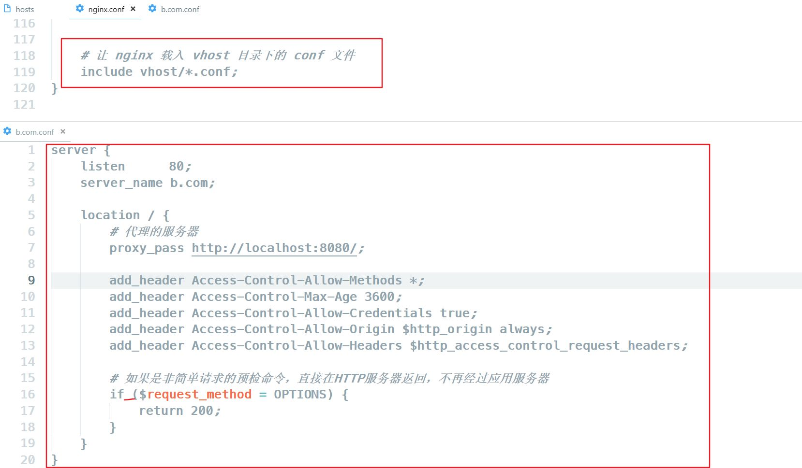
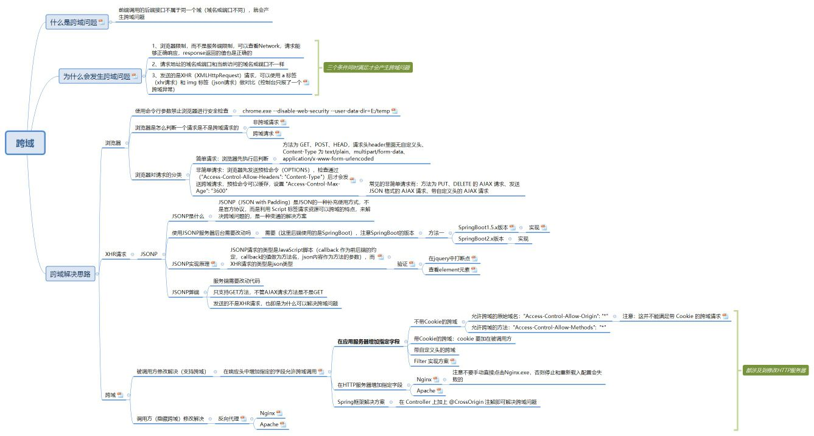

# CORS

- [同源策略](#%E5%90%8C%E6%BA%90%E7%AD%96%E7%95%A5)
  * [什么是不同源？](#%E4%BB%80%E4%B9%88%E6%98%AF%E4%B8%8D%E5%90%8C%E6%BA%90)
  * [同源策略限制的内容](#%E5%90%8C%E6%BA%90%E7%AD%96%E7%95%A5%E9%99%90%E5%88%B6%E7%9A%84%E5%86%85%E5%AE%B9)
  * [同源政策不太限制的内容](#%E5%90%8C%E6%BA%90%E6%94%BF%E7%AD%96%E4%B8%8D%E5%A4%AA%E9%99%90%E5%88%B6%E7%9A%84%E5%86%85%E5%AE%B9)
- [**不同源与跨域？**](#%E4%B8%8D%E5%90%8C%E6%BA%90%E4%B8%8E%E8%B7%A8%E5%9F%9F)
- [如何解决跨域问题](#%E5%A6%82%E4%BD%95%E8%A7%A3%E5%86%B3%E8%B7%A8%E5%9F%9F%E9%97%AE%E9%A2%98)
  * [CORS](#cors)
    + [简单请求与非简单请求](#%E7%AE%80%E5%8D%95%E8%AF%B7%E6%B1%82%E4%B8%8E%E9%9D%9E%E7%AE%80%E5%8D%95%E8%AF%B7%E6%B1%82)
    + [具体处理方式](#%E5%85%B7%E4%BD%93%E5%A4%84%E7%90%86%E6%96%B9%E5%BC%8F)
  * [其他](#%E5%85%B6%E4%BB%96)

---

同源策略，定义，触发流程，解决方法

## 同源策略

跨域问题的来源是浏览器为了请求安全而引入的基于**同源策略**（Same-origin policy）的安全特性。同源策略是浏览器一个非常重要的安全策略，基于这个策略可以限制非同源的内容与当前页面进行交互，从而减少页面被攻击的可能性。不同源会导致浏览器的跨域问题。

### 什么是不同源？

当页面和请求的协议、主机名或端口不同时，浏览器判定两者不同源。

不同源会导致浏览器的跨域问题。需要注意的是跨域是浏览器的限制，实际请求已经正常发出和响应了。

### 同源策略限制的内容

1. 数据存储隔离。第一个是当前域下的 js 脚本不能够访问其他域（其他域的js访问不到当前页面的）下的 cookie、localStorage、sessionStorage和 indexedDB。

* **例外**：
  * Cookie 可通过设置 `Domain` 和 `Path` 属性实现跨子域共享（如 `example.com` 的 Cookie 可被 `a.example.com` 和 `b.example.com` 共享）。
  * `postMessage` API 可实现跨源页面间的安全数据传递。

2. Dom访问限制。第二个是当前域下的 js 脚本不能够操作访问其他域下的 DOM。 **跨源页面无法互相操作 DOM**
   * 例如：`a.com` 的页面通过 `<iframe>` 嵌入 `b.com` 的页面时，`a.com` 的 JavaScript 无法直接读取或修改 `b.com` 页面的 DOM 元素（如获取表单内容）。
   * **例外**：若两个页面显式设置 `document.domain` 为相同父域（如 `a.example.com` 和 `b.example.com` 均设为 `example.com`），则可以实现有限通信。
3. 网络请求限制。第三个是当前域下 ajax 无法发送跨域请求。 浏览器会拦截来自 `XMLHttpRequest` 或 `Fetch API` 的跨域请求，除非目标服务器明确返回允许跨域的 HTTP 头部（如 `Access-Control-Allow-Origin`）。
   * **简单请求与非简单请求**：
     * 简单请求（GET/POST/HEAD，特定 Content-Type）会直接发送，但响应头需包含 `Access-Control-Allow-Origin` 才会被浏览器接受。
     * 非简单请求（如 PUT、DELETE 或自定义头部）需先发送 **预检请求（OPTIONS）**，通过验证后才能发送实际请求。

* **其他资源交互限制。跨源脚本与资源的有限访问**
  * `<script>`**、**``**、**`<link>`\*\* 等标签允许跨源加载资源\*\*，但 JavaScript 无法直接读取跨源脚本返回的内容（如跨域图片的像素数据）。
  * **Canvas 污染**：若将跨源图片绘制到 `<canvas>`，则 `getImageData()` 等操作会被禁止，防止通过像素分析窃取信息。
  * **Web Fonts**：部分浏览器限制跨源字体文件的加载，需服务器设置 `Access-Control-Allow-Origin`。
  * **Web Workers**：跨源 Worker 脚本需通过 CORS 策略验证。

### 同源政策不太限制的内容

1. 
2. <link href=XXX>
3. <script src=XXX>


准确来说，并不是不限制，而是跨源脚本与资源的有限访问：

1. **允许跨域加载资源**（如图片、脚本、字体），但**限制对资源内容的直接读取或操作**（如 Canvas 像素分析、字体文件加载）。
2. **跨域脚本可以执行**，但无法直接提取其原始内容（如字符串形式的数据）。<font style="color:#DF2A3F;">JSONP利用了这点特性。</font>

允<font style="color:#DF2A3F;">许任意origin的资源加载，有时会带来XSS攻击。因此，许多应用会配置CSP。</font>

## **<font style="color:rgb(18, 18, 18);">不同源与跨域？</font>**

1. **<font style="color:rgb(18, 18, 18);">同源判定</font>**<font style="color:rgb(18, 18, 18);">。一个 origin 由协议（Protocol）、主机名（Host）和端口（Port）组成，只有当三者都相同时，浏览器才判定两者是同源关系，否则即为跨域。</font>
2. **<font style="color:rgb(18, 18, 18);">发送的是XHR（XMLHttpRequest）请求</font>**<font style="color:rgb(18, 18, 18);">，可以使用 a 标签（模拟xhr请求）和 img 标签（模拟json请求）做对比（控制台只报了一个跨域异常）</font>
3. **<font style="color:rgb(18, 18, 18);">浏览器限制</font>**<font style="color:rgb(18, 18, 18);">，而不是服务端限制，可以查看Network，请求能够正确响应，response返回的值也是正确的</font>

## 如何解决跨域问题

主要是CORS，JSONP，postMessage，websocket

### CORS

<font style="color:rgb(18, 18, 18);">CORS 是跨域资源分享(Cross-Origin Resource Sharing)的缩写，</font>是一种解决跨域的规范

#### 简单请求与非简单请求

HTTP1.1 协议中的，请求方法分为GET、POST、PUT、DELETE、HEAD、TRACE、OPTIONS、CONNECT 八种。浏览器根据这些请求方法和请求类型将CORS请求划分为简单请求和非简单请求。这样分类的原因是因为，有些请求会对服务器产生副作用。浏览器需要通过OPTIONS方法预检，查看自己是否可以跨域。

1. <font style="color:rgb(18, 18, 18);">简单请求：浏览器先发送（执行）请求然后再根据响应头判断是否跨域。请求方法为 GET、POST、HEAD，请求头header中无自定义的请求头信息，请求类型Content-Type 为 text/plain、multipart/form-data、application/x-www-form-urlencoded 的请求都是简单请求。</font>
2. <font style="color:rgb(18, 18, 18);">非简单请求：浏览器先发送预检命令（OPTIONS方法），检查通过后才发送真正的数据请求。</font>
   1. <code><font style="color:rgb(18, 18, 18);">TRACE</font></code><font style="color:rgb(18, 18, 18);"> 方法用于诊断服务器的请求回显功能，它会将客户端发送的请求内容（包括头部和数据）原样返回给客户端。  这种行为可能导致敏感信息（如 Cookie 或认证令牌）被泄露给恶意第三方。如果允许跨域使用 </font><code><font style="color:rgb(18, 18, 18);">TRACE</font></code><font style="color:rgb(18, 18, 18);"> 方法，攻击者可能利用它进行中间人攻击或其他安全漏洞。（同源会自动带cookie，如果不同源也可以带cookie的话，那trace会把victim.com的cookie返回给attracker.com）</font>
   2. <code><font style="color:rgb(18, 18, 18);">CONNECT</font></code><font style="color:rgb(18, 18, 18);"> 方法用于建立隧道连接（通常用于代理服务器或 HTTPS 加密连接）。  这种方法设计用于低层网络通信，而不是普通的 HTTP 请求。如果允许跨域使用 </font><code><font style="color:rgb(18, 18, 18);">CONNECT</font></code><font style="color:rgb(18, 18, 18);"> 方法，可能会导致代理服务器被滥用或网络安全问题。</font>

#### 具体处理方式

1. 简单请求:
   1. 客户端请求报文携带Origin首部字段
   2. CORS服务端在接受到携带Origin字CORS段的跨域请求后，在response header中添加Access-Control-Allow-Origin/Access-Control-Allow-Credentials, Access-Control-Expose-Header等字段给浏览器做同源判断。
2. 非简单请求:
   1. 浏览器会首先发出类型为OPTIONS的“预检请求”，请求地址相同
   2. 服务端对“预检请求”处理，并对Response Header添加验证字段，客户端接受到预检请求的返回值进行一次请求预判断，验证通过后，主请求发起。
   3. 按照简单请求的步骤做后续通信。唯一不同在于响应报文多了Access-Control-Request-Method，Access-Control-Request-Headers两个首部字段

### 其他

都需要服务端配合：

* <font style="color:#DF2A3F;">JSONP</font>（实际上，为了避免XSS攻击，许多应用会配置CSP。具体能不能执行，还要继续看CSP策略）
* <font style="color:#DF2A3F;">postMessage/websocket</font>
* <font style="color:#DF2A3F;">access-control-allow-origin</font>

1. 绕过判断条件2
   1. 核心是script标签加载脚本不受。发送JSONP请求替代XHR请求（仅支持get方法，并不能适用所有的请求方式，不推荐）。JSONP本质是动态script加载，需要修改后端。虽然同源策略要求跨域脚本的内容是不可读取的，但可以利用“**跨域脚本执行过程中，可以访问到发起请求的页面的变量**”的作用域的特性，可以把数据传递给发起请求的页面。

```javascript
// 客户端定义回调函数
function myCallback(data) {
    console.log("Received data:", data); // { 'name': 'Alice'; 'age': 25}
}
// 动态创建 <script> 标签
var script = document.createElement("script");
// 把函数名传给服务端。实际使用中会随机生成函数名来保障安全和避免命名冲突。
script.src = "https://api.example.com/data?callback=myCallback";
document.body.appendChild(script);
```

```javascript
// 服务端通过执行指定函数名的回调，将数据传递给客户端页面
myCallback({
    "name": "Alice",
    "age": 25
});


```

```
2. window.postMessage. 常用于: 1. 页面和其打开的新窗口的数据传递 2.多窗口之间消息传递 3. 页面与嵌套的iframe消息传递. 要先获取到目标window对象，再调用postMessage通信
3. websocket
```

2\. 绕过判断条件3，客户端浏览器解除跨域限制（理论上可以但是不现实）
3\. 不绕过判断，修改服务器端。这样浏览器依旧会检查跨域。
1\. CORS. 在 HTTP 服务器增加指定字段 access-control-allow-origin
1\. 修改服务器端（包括HTTP服务器和应用服务器，依旧触发浏览器的CORS判断）（推荐）。1浏览器发送预检请求，检查响应报文头的Access-Control-Allow-Origin(允许的域)，Access-Control-Allow-Methods(允许的方法)，Access-Control-Allow-Headers(自定义请求头)。对options的响应要在nginx上做配置:
2\. 
2\. 反向代理。也即是将被调用方的域名代理到调用方域名下，这样就符合同源策略了，也就解决了跨域问题。
3\.  代理。需要代理和被调用方在同一个域下
4\.  node中间件代理。同源策略是浏览器需要遵循的标准，而如果是服务器向服务器请求就无需遵循同源策略
4\. 其他
1\. document.domain。该方式只能用于二级域名相同的情况下，比如 a.test.com 和 b.test.com 适用于该方式。只需要给页面添加 document.domain = 'test.com' 表示二级域名都相同就可以实现跨域
2\. window.name+iframe
3\. location.hash+iframe
4\. webpack配置proxyTable设置开发环境跨域



[一文搞懂跨域的所有问题，生活从此669~](https://zhuanlan.zhihu.com/p/66484450)

[九种跨域方式实现原理（完整版） - 掘金](https://juejin.cn/post/6844903767226351623?share_token=e6b0bf99-425b-4c15-bb7e-fdf3fc4d7ea6)

[web跨域问题终结者 - 掘金](https://juejin.cn/post/7153220953789431839)


> 更新: 2025-08-16 14:08:49  
> 原文: <https://www.yuque.com/viruspc/el3mi0/xxfcxb>