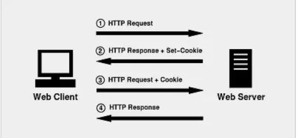
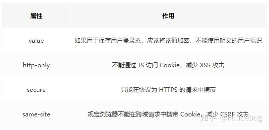

# 无状态：浏览器缓存，Cookie 与 Web Storage

- [无连接与无状态](#%E6%97%A0%E8%BF%9E%E6%8E%A5%E4%B8%8E%E6%97%A0%E7%8A%B6%E6%80%81)
- [无状态与无连接带来的问题与解决方案](#%E6%97%A0%E7%8A%B6%E6%80%81%E4%B8%8E%E6%97%A0%E8%BF%9E%E6%8E%A5%E5%B8%A6%E6%9D%A5%E7%9A%84%E9%97%AE%E9%A2%98%E4%B8%8E%E8%A7%A3%E5%86%B3%E6%96%B9%E6%A1%88)
- [Cookie VS Session](#cookie-vs-session)
- [HTTP协议如何使用Cookie](#http%E5%8D%8F%E8%AE%AE%E5%A6%82%E4%BD%95%E4%BD%BF%E7%94%A8cookie)
- [Web Storage API](#web-storage-api)
- [cookie vs Web Storage API：](#cookie-vs-web-storage-api)
- [cookie的安全性](#cookie%E7%9A%84%E5%AE%89%E5%85%A8%E6%80%A7)

---

# 无连接与无状态

HTTP协议五大特点： 1. 支持客户/服务器模式 2. 简单快速 3. 灵活 4. 无连接（短连接） 5. 无状态

**无连接**：每次连接只处理一个请求。服务器处理完客户的请求，并收到客户的应答后，即断开连接。采用这种方式可以节省传输时间。（http1.1改为持久连接）

**无状态**：协议对于事务处理没有记忆能力，服务器不知道客户端是什么状态。即我们给服务器发送 HTTP 请求之后，服务器根据请求，会给我们发送数据过来，但是，发送完，不会记录任何信息。（HTTP协议自身不对请求和响应之间的通信状态进行保存。也就是说在HTTP这个级别，协议对于发送过的请求或响应都**不做持久化处理**）（cookie session jwt）等解决

# 无状态与无连接带来的问题与解决方案

问题：HTTP 协议这种特性有优点也有缺点，优点在于解放了服务器，每一次请求“点到为止”不会造成不必要连接占用，缺点在于每次请求会传输大量重复的内容信息。客户端与服务器进行动态交互的 Web 应用程序出现之后，HTTP 无状态的特性严重阻碍了这些应用程序的实现，毕竟交互是需要承前启后的，简单的购物车程序也要知道用户到底在之前选择了什么商品。

解决方案：两种用于保持 HTTP 连接状态的技术就应运而生了，一个是 Cookie，而另一个则是 Session。

Cookie：Cookie可以保持登录信息到用户下次与服务器的会话，换句话说，下次访问同一网站时，用户会发现不必输入用户名和密码就已经登录了。Cookie保存在客户端。

Session：与 Cookie 相对的一个解决方案是 Session，它是通过服务器来保持状态的。

当客户端访问服务器时，服务器根据需求设置 Session，将会话信息保存在服务器上，同时将标示 Session 的 SessionId 传递给客户端浏览器，浏览器将这个 SessionId 保存在内存中，我们称之为无过期时间的 Cookie。浏览器关闭后，这个  
Cookie 就会被清掉，它不会存在于用户的 Cookie 临时文件。以后浏览器每次请求都会额外加上这个参数值，服务器会根据这个 SessionId，就能取得客户端的数据信息。

# Cookie VS Session

1，session 在服务器端，cookie 在客户端（浏览器）  
2，session 默认被存在在服务器的一个文件里（不是内存）  
3，session 的运行依赖 session id，而 session id 是存在 cookie 中的，也就是说，如果浏览器禁用了 cookie ，同时 session 也会失效（但是可以通过其它方式实现，比如在 url 中传递 session_id）  
4，session 可以放在 文件、数据库、或内存中都可以。  
5，用户验证这种场合一般会用 session

# HTTP协议如何使用Cookie

Responses Header | Http Header  
Set-Cookie：设置Http Cookie，服务器端向客户端发送 cookie。  Set-Cookie响应头是服务器返回的响应头，用来在浏览器种cookie。一旦被种下，当浏览器访问符合条件的url地址时，会自动带上这个cookie

Requests Header | Http Header  
Authorization：Web 认证信息，HTTP授权的授权证书。  
Cookie：cookie 就是一段字符串, 通过Set-Cookie设置的值， HTTP请求发送时，会把保存在该请求域名下的所有cookie值一起发送给web服务器。

Cookie 是一串字符串，是服务器发送到用户浏览器并保存在本地的一小块数据，它会在浏览器之后向同一服务器再次发起请求时自动被携带上，用于告知服务端两个请求是否来自同一浏览器。通常保存用户身份信息。由于之后每次请求都会需要携带 Cookie 数据，因此会带来额外的性能开销（尤其是在移动环境下）。

服务流程:

1. 客户端(比如某个浏览器)第一次请求时,如果服务器想保存用户信息,服务器向客户端响应时会带有Set-Cookie字段
2. 客户端会保存Cookie,在下次请求时会自动带上Cookie
3. 这样服务器收到Cookie后,就知道是哪个客户端发来的请求,得到之前的状态信息

# Web Storage API
  
Cookie 曾一度用于客户端数据的存储，因为当时并没有其它合适的存储办法而作为唯一的存储手段，但现在随着现代浏览器开始支持各种各样的存储方式，Cookie 渐渐被淘汰。新的浏览器 API 已经允许开发者直接将数据存储到本地，如使用 Web storage API（本地存储和会话存储）或 IndexedDB。

sessionStorage：可以将一部分数据在当前的会话中保存下来，刷新页面数据依旧存在。但是页面关闭时，sessionStorage中的数据就会被清空。

localStorage：localStorage中的键值对总是以字符串的形式存储。localStorage类似sessionStorage，但其区别在于：存储在localStorage 的数据可以长期保留；

同源：协议相同/域名相同/端口相同

可以代替cookie

# cookie vs Web Storage API：

1. 存储大小：cookie小(<4k)，localStorage和sessionStorage大(5M+)。
2. 数据有效期：  
a. cookie:一般由服务器生成，可以设置失效时间；若没有设置时间，关闭浏览器cookie失效，如果设置了时间，cookie就会存储在硬盘中，过期失效  
b. sessionStorage：仅在当前浏览器窗口关闭之前有效，关闭页面或者浏览器会被清除  
c. localStorage：永久有效，窗口或者浏览器关闭也会一直保存，除非手动永久删除
3. 作用域  
a. cookie：在所有同源窗口中都是共享的(也不一定

[不同浏览器的cookie共享吗? - CSDN](https://www.csdn.net/tags/NtTaYg3sMzc0NTEtYmxvZwO0O0OO0O0O.html)

  
b. sessionStorage：同源的前提下，在当前标签页以及当前标签页打开的新标签页中共享。通过其它方式(比如手动输入url)新开的窗口或标签不认为是同一个session。  
c. localStorage：在所有同源窗口中共享。

4. 通信  
a. cookie：cookie在浏览器和服务器之间来回传递，如果使用cookie保存过多数据会造成性能问题。普通cookie保存在内存，持久化cookie保存在硬磁盘。  
b. sessionStorage：仅在客户端（浏览器）中保存，不参与服务器的通信  
c. localStorage：仅在客户端（浏览器）中保存，不参与服务器的通信

不同浏览器无法共享localStorage和sessionStorage的值。

相同浏览器下，并且是同源窗口（协议、域名、端口一致），不同页面可以共享localStorage，Cookies值，通过跳转的页面可以共享sessionStorage值。

# cookie的安全性

http-only: cookie的写入方式有两种:1.http response header中的set-cookie 2. js中可以通过document.cookie可以读写cookie，以键值对的形式展示。HttpOnly 不支持读写，浏览器不允许脚本操作document.cookie去更改cookie， 可以避免跨域脚本 (XSS) 攻击。

secure: 标记为 Secure 的Cookie只应通过被HTTPS协议加密过的请求发送给服务端。

[https://blog.csdn.net/aliujiujiang/article/details/113117198](https://blog.csdn.net/aliujiujiang/article/details/113117198)

[https://blog.csdn.net/tennysonsky/article/details/44562435](https://blog.csdn.net/tennysonsky/article/details/44562435)  
[https://www.zhihu.com/question/19786827/answer/28752144](https://www.zhihu.com/question/19786827/answer/28752144)  
[https://www.cnblogs.com/Duikerdd/p/12030952.html](https://www.cnblogs.com/Duikerdd/p/12030952.html)  
[https://blog.csdn.net/m0_56028305/article/details/121039230](https://blog.csdn.net/m0_56028305/article/details/121039230)  
cookie和localStorage以及sessionStorage的区别 - Kerry的文章 - 知乎 [https://zhuanlan.zhihu.com/p/207106785](https://zhuanlan.zhihu.com/p/207106785)

图解HTTP

[深入了解浏览器存储：对比Cookie、Local/sessionStorage与IndexedDB](https://zhuanlan.zhihu.com/p/61704951)

> 更新: 2025-06-02 04:07:46  
> 原文: <https://www.yuque.com/viruspc/el3mi0/ouht1y>